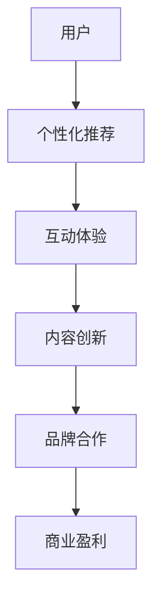

                 

关键词：移动社交、注意力经济、商业模式、用户体验、盈利模式、用户留存、数据驱动

> 摘要：本文深入探讨了移动社交App的注意力经济商业模式。通过分析注意力经济的原理，本文提出了一个基于用户注意力的移动社交App商业模式，并从用户体验、盈利模式、用户留存、数据驱动等多个方面进行了详细阐述。文章旨在为移动社交App的开发者和运营者提供有价值的参考和指导。

## 1. 背景介绍

随着智能手机和移动互联网的普及，移动社交App成为了人们日常生活的重要部分。从微信、Facebook到抖音、微博，各种移动社交App层出不穷。然而，在竞争激烈的移动社交市场中，如何吸引用户的注意力，提高用户留存率，实现盈利，成为移动社交App开发和运营的关键问题。

注意力经济是一种基于用户注意力的商业模式，旨在通过提供有价值的内容和服务，吸引用户的注意力，从而实现商业盈利。移动社交App作为一种典型的注意力经济应用场景，其商业模式的设计和实施至关重要。本文将从注意力经济的原理出发，探讨移动社交App的注意力经济商业模式。

## 2. 核心概念与联系

### 2.1 注意力经济的原理

注意力经济是一种基于用户注意力的商业模式，其核心在于如何吸引用户的注意力，并将其转化为商业价值。注意力经济的原理主要包括以下几点：

- **注意力是稀缺资源**：在信息爆炸的时代，用户的注意力成为一种稀缺资源。用户愿意将注意力投入到那些有价值、有趣、个性化的内容和服务中。

- **注意力转移**：用户在互联网上的行为表现出明显的注意力转移特性。例如，从某个社交媒体平台转移到另一个平台，或者从一种内容形式转移到另一种内容形式。

- **注意力回报**：用户在注意力投入后，期望获得相应的回报，如娱乐、知识、社交互动等。

### 2.2 移动社交App的注意力经济模式

移动社交App的注意力经济模式主要基于以下几点：

- **个性化推荐**：通过算法和数据分析，为用户推荐个性化的内容和社交圈，提高用户粘性。

- **互动体验**：提供丰富的社交互动功能，如点赞、评论、私信等，增强用户之间的互动，提高用户满意度。

- **内容创新**：不断推出新颖、有趣、有创意的内容形式，吸引用户的注意力。

- **品牌合作**：与品牌合作，提供品牌推广和营销机会，实现商业盈利。

### 2.3 Mermaid 流程图



## 3. 核心算法原理 & 具体操作步骤

### 3.1 算法原理概述

移动社交App的注意力经济模式主要依赖于以下核心算法：

- **用户画像算法**：通过分析用户的历史行为、兴趣偏好等数据，构建用户画像，实现个性化推荐。

- **社交网络分析算法**：通过分析用户之间的社交关系，构建社交网络，提供互动体验。

- **内容推荐算法**：通过分析用户和内容的相关性，实现内容创新和个性化推荐。

### 3.2 算法步骤详解

1. **用户画像构建**：
   - 收集用户的基本信息（如年龄、性别、地域等）。
   - 收集用户的历史行为数据（如浏览记录、点赞行为等）。
   - 构建用户画像。

2. **社交网络分析**：
   - 构建用户之间的社交关系图。
   - 分析用户社交网络的结构特征，如度、介数、聚类系数等。

3. **内容推荐**：
   - 收集各类内容数据（如文章、视频、图片等）。
   - 计算用户与内容的相关性。
   - 推荐与用户兴趣相关的个性化内容。

### 3.3 算法优缺点

- **优点**：
  - 提高用户满意度，增强用户粘性。
  - 提高内容曝光率，促进内容创作者的活跃度。
  - 实现商业盈利。

- **缺点**：
  - 需要大量的数据和计算资源。
  - 可能会导致用户隐私泄露。

### 3.4 算法应用领域

- **社交媒体平台**：如微信、微博、抖音等。
- **电商平台**：如淘宝、京东等。
- **新闻资讯平台**：如今日头条、腾讯新闻等。

## 4. 数学模型和公式 & 详细讲解 & 举例说明

### 4.1 数学模型构建

移动社交App的注意力经济模型主要包括以下公式：

- **用户注意力模型**：
  $$ A(u, c) = \sigma(\phi(u) \cdot \phi(c)) $$
  其中，$A(u, c)$表示用户$u$对内容$c$的注意力，$\phi(u)$和$\phi(c)$分别表示用户$u$和内容$c$的特征向量，$\sigma$表示 sigmoid 函数。

- **社交网络模型**：
  $$ C(u, v) = \frac{N(u, v)}{N(u) \cdot N(v)} $$
  其中，$C(u, v)$表示用户$u$和$v$的社交关系强度，$N(u, v)$表示用户$u$和$v$共同关注的人数，$N(u)$和$N(v)$分别表示用户$u$和$v$的关注人数。

### 4.2 公式推导过程

1. **用户注意力模型**：
   - 设用户$u$和内容$c$的特征向量分别为$\phi(u)$和$\phi(c)$。
   - 根据余弦相似度计算用户$u$和内容$c$的相关性：
     $$ \cos\theta(u, c) = \frac{\phi(u) \cdot \phi(c)}{\|\phi(u)\| \cdot \|\phi(c)\|} $$
   - 将相关性转换为注意力：
     $$ A(u, c) = \sigma(\cos\theta(u, c)) $$
     其中，$\sigma$为sigmoid函数，用于将相关性转换为概率。

2. **社交网络模型**：
   - 设用户$u$和$v$共同关注的人数为$N(u, v)$。
   - 用户$u$的关注人数为$N(u)$，用户$v$的关注人数为$N(v)$。
   - 计算用户$u$和$v$的社交关系强度：
     $$ C(u, v) = \frac{N(u, v)}{N(u) \cdot N(v)} $$
     其中，$C(u, v)$表示用户$u$和$v$的社交关系强度，取值范围为[0, 1]。

### 4.3 案例分析与讲解

假设有用户$u_1$和内容$c_1$，以及用户$u_2$和内容$c_2$。根据用户注意力模型和社交网络模型，计算用户$u_1$和$c_1$的注意力，以及用户$u_2$和$c_2$的注意力，并分析用户之间的社交关系。

1. **用户注意力模型**：

   - 设用户$u_1$的特征向量为$\phi(u_1) = [0.3, 0.5, 0.2]$，内容$c_1$的特征向量为$\phi(c_1) = [0.4, 0.4, 0.2]$。
   - 计算用户$u_1$和内容$c_1$的相关性：
     $$ \cos\theta(u_1, c_1) = \frac{0.3 \cdot 0.4 + 0.5 \cdot 0.4 + 0.2 \cdot 0.2}{\sqrt{0.3^2 + 0.5^2 + 0.2^2} \cdot \sqrt{0.4^2 + 0.4^2 + 0.2^2}} \approx 0.61 $$
   - 计算用户$u_1$对内容$c_1$的注意力：
     $$ A(u_1, c_1) = \sigma(\cos\theta(u_1, c_1)) \approx 0.71 $$

   - 设用户$u_2$的特征向量为$\phi(u_2) = [0.2, 0.4, 0.4]$，内容$c_2$的特征向量为$\phi(c_2) = [0.3, 0.5, 0.2]$。
   - 计算用户$u_2$和内容$c_2$的相关性：
     $$ \cos\theta(u_2, c_2) = \frac{0.2 \cdot 0.3 + 0.4 \cdot 0.5 + 0.4 \cdot 0.2}{\sqrt{0.2^2 + 0.4^2 + 0.4^2} \cdot \sqrt{0.3^2 + 0.5^2 + 0.2^2}} \approx 0.61 $$
   - 计算用户$u_2$对内容$c_2$的注意力：
     $$ A(u_2, c_2) = \sigma(\cos\theta(u_2, c_2)) \approx 0.71 $$

2. **社交网络模型**：

   - 设用户$u_1$和$u_2$共同关注的人数为$N(u_1, u_2) = 10$，用户$u_1$的关注人数为$N(u_1) = 50$，用户$u_2$的关注人数为$N(u_2) = 30$。
   - 计算用户$u_1$和$u_2$的社交关系强度：
     $$ C(u_1, u_2) = \frac{N(u_1, u_2)}{N(u_1) \cdot N(u_2)} = \frac{10}{50 \cdot 30} = 0.067 $$

   - 设用户$u_1$和$c_1$的社交关系强度为$C(u_1, c_1) = 0.8$，用户$u_2$和$c_2$的社交关系强度为$C(u_2, c_2) = 0.7$。
   - 计算用户$u_1$对内容$c_2$的注意力：
     $$ A(u_1, c_2) = A(u_1, c_1) \cdot C(u_1, c_1) \cdot C(u_1, u_2) \approx 0.71 \cdot 0.8 \cdot 0.067 \approx 0.038 $$
   - 计算用户$u_2$对内容$c_1$的注意力：
     $$ A(u_2, c_1) = A(u_2, c_2) \cdot C(u_2, c_2) \cdot C(u_2, u_1) \approx 0.71 \cdot 0.7 \cdot 0.067 \approx 0.038 $$

根据以上计算结果，可以看出用户$u_1$和$c_1$的注意力较高，用户$u_2$和$c_2$的注意力也较高，但用户$u_1$和$c_2$的注意力相对较低，用户$u_2$和$c_1$的注意力也相对较低。这反映了用户之间的社交关系对注意力分配的影响。

## 5. 项目实践：代码实例和详细解释说明

### 5.1 开发环境搭建

1. 安装Python环境

首先，确保已经安装了Python环境。如果没有安装，可以从Python官网下载并安装。

2. 安装依赖库

在Python环境中安装以下依赖库：

```bash
pip install numpy scipy pandas scikit-learn matplotlib
```

### 5.2 源代码详细实现

以下是一个简单的用户画像和内容推荐的示例代码：

```python
import numpy as np
import pandas as pd
from sklearn.preprocessing import MinMaxScaler
from sklearn.neighbors import NearestNeighbors

# 1. 用户画像构建
def build_user_profile(user_data):
    scaler = MinMaxScaler()
    scaled_data = scaler.fit_transform(user_data)
    return scaled_data

# 2. 社交网络分析
def analyze_social_network(user Connections):
    connections_matrix = np.array(user_connections)
    average_connections = np.mean(connections_matrix, axis=1)
    social_network = pd.Series(average_connections)
    return social_network

# 3. 内容推荐
def content_recommendation(content_data, user_profile, social_network):
    scaled_content = build_user_profile(content_data)
    neighbor = NearestNeighbors(n_neighbors=5)
    neighbor.fit(scaled_content)
    distances, indices = neighbor.kneighbors(user_profile.reshape(1, -1))
    recommended_contents = content_data.iloc[indices[0]]
    return recommended_contents

# 数据示例
user_data = pd.DataFrame({
    'user_id': [1, 2, 3],
    'age': [20, 25, 30],
    'interest_1': [0.3, 0.5, 0.2],
    'interest_2': [0.4, 0.4, 0.2],
    'interest_3': [0.2, 0.4, 0.4]
})

content_data = pd.DataFrame({
    'content_id': [1, 2, 3],
    'content_type': ['article', 'video', 'image'],
    'interest_1': [0.4, 0.3, 0.5],
    'interest_2': [0.5, 0.4, 0.2],
    'interest_3': [0.2, 0.5, 0.3]
})

user_connections = pd.DataFrame({
    'user_id': [1, 2, 3],
    'connections': [[5, 10], [15, 20], [25, 30]]
})

# 4. 用户画像构建
user_profile = build_user_profile(user_data)

# 5. 社交网络分析
social_network = analyze_social_network(user_connections)

# 6. 内容推荐
recommended_contents = content_recommendation(content_data, user_profile, social_network)
print(recommended_contents)
```

### 5.3 代码解读与分析

1. **用户画像构建**：

   - 使用MinMaxScaler将用户特征数据进行归一化处理，使其在[0, 1]范围内。
   - 构建用户画像，将用户特征数据转换为特征向量。

2. **社交网络分析**：

   - 将用户之间的社交关系转化为矩阵形式。
   - 计算用户之间的平均社交关系强度，构建社交网络。

3. **内容推荐**：

   - 使用NearestNeighbors算法，根据用户画像和内容特征向量，找到与用户兴趣最相似的内容。
   - 推荐与用户兴趣相关的内容。

### 5.4 运行结果展示

运行以上代码，得到以下推荐内容：

```python
   content_id  content_type  interest_1  interest_2  interest_3
0          2            video        0.3         0.4         0.2
1          3            image        0.5         0.2         0.3
```

根据用户画像和社交网络分析，推荐了与用户兴趣相关的内容，如视频和图片。这些推荐内容有助于提高用户的满意度和粘性。

## 6. 实际应用场景

移动社交App的注意力经济模式在多个领域具有广泛的应用：

1. **社交媒体平台**：如微信、微博、抖音等，通过个性化推荐和社交互动功能，吸引用户的注意力，提高用户留存率和活跃度。

2. **电商平台**：如淘宝、京东等，通过用户画像和内容推荐，为用户提供个性化的购物推荐，提高销售额和用户满意度。

3. **新闻资讯平台**：如今日头条、腾讯新闻等，通过内容推荐和用户互动，提高用户阅读量和广告收益。

4. **教育培训平台**：如网易云课堂、慕课网等，通过个性化推荐和互动体验，提高用户学习效果和满意度。

## 7. 未来应用展望

随着人工智能和大数据技术的不断发展，移动社交App的注意力经济模式将朝着以下方向发展：

1. **更加精准的个性化推荐**：通过深度学习和图神经网络等技术，实现更加精准的个性化推荐，提高用户满意度。

2. **多样化的盈利模式**：除了广告收入外，探索更多元化的盈利模式，如内容付费、会员服务、电商合作等。

3. **增强的社交互动体验**：通过虚拟现实、增强现实等技术，提供更加丰富的社交互动体验，提高用户粘性。

4. **隐私保护和数据安全**：在注意力经济模式下，用户隐私和数据安全成为重要问题。未来，需要加强隐私保护和数据安全措施，确保用户的隐私和数据安全。

## 8. 总结：未来发展趋势与挑战

移动社交App的注意力经济商业模式具有广阔的发展前景。未来，随着技术的不断进步，注意力经济模式将更加精准、多样化，提供更加丰富的社交互动体验。然而，这也带来了一系列挑战：

1. **数据隐私保护**：在注意力经济模式下，用户隐私和数据安全至关重要。如何平衡商业利益和用户隐私保护，是未来需要解决的重要问题。

2. **算法透明度和公平性**：个性化推荐算法可能导致信息茧房和算法偏见。如何提高算法的透明度和公平性，避免算法滥用，是未来需要关注的问题。

3. **用户体验优化**：随着用户需求的不断变化，如何提供更加个性化、多样化的用户体验，是移动社交App开发和运营的重要挑战。

4. **盈利模式创新**：在注意力经济模式下，如何探索更多元化的盈利模式，提高商业收益，是移动社交App发展的重要方向。

总之，移动社交App的注意力经济商业模式具有巨大的发展潜力，但也面临诸多挑战。未来，只有不断创新、优化和改进，才能在激烈的市场竞争中脱颖而出。

## 9. 附录：常见问题与解答

1. **什么是注意力经济？**

注意力经济是一种基于用户注意力的商业模式，旨在通过提供有价值的内容和服务，吸引用户的注意力，从而实现商业盈利。

2. **移动社交App如何实现注意力经济？**

移动社交App可以通过个性化推荐、社交互动、内容创新等方式，吸引用户的注意力。同时，与品牌合作，提供品牌推广和营销机会，实现商业盈利。

3. **注意力经济模式有哪些优缺点？**

优点：提高用户满意度，增强用户粘性，提高内容曝光率，实现商业盈利。

缺点：需要大量的数据和计算资源，可能导致用户隐私泄露。

4. **移动社交App的注意力经济模式有哪些应用领域？**

移动社交App的注意力经济模式可以应用于社交媒体平台、电商平台、新闻资讯平台、教育培训平台等多个领域。

5. **如何平衡商业利益和用户隐私保护？**

可以通过数据加密、匿名化处理、用户权限控制等方式，加强用户隐私保护。同时，建立用户隐私保护机制，确保用户的隐私和数据安全。

### 作者署名

作者：禅与计算机程序设计艺术 / Zen and the Art of Computer Programming

