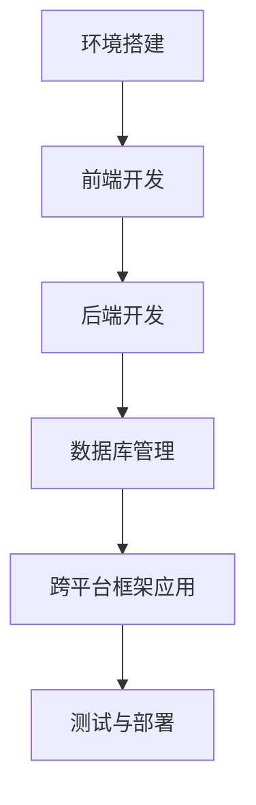

                 

在数字化的时代浪潮中，移动应用的开发已经成为企业布局市场的重要一环。iOS和Android平台因其庞大的用户群体和丰富的生态体系，成为了移动应用开发的热门选择。然而，面对这两个平台，开发者往往需要掌握两套不同的技术栈，这不仅增加了开发和维护的复杂性，也提高了时间和成本。本文旨在探讨如何通过全栈开发技术实现iOS和Android平台的统一解决方案，降低开发难度，提高开发效率。

## 关键词
- 移动应用开发
- 全栈开发
- iOS
- Android
- 跨平台解决方案

## 摘要
本文将详细分析移动端全栈开发的原理和实践方法，包括环境搭建、核心框架和技术的介绍，以及在实际项目中的应用。通过本文，读者将了解如何利用全栈技术实现iOS和Android平台的统一开发，从而降低开发成本，提高开发效率。

## 1. 背景介绍
### 移动应用开发的重要性
随着智能手机的普及和移动互联网的发展，移动应用已成为人们日常生活不可或缺的一部分。无论是社交、购物、娱乐还是工作，移动应用都在改变着人们的生活方式。因此，移动应用开发已经成为企业提升竞争力、拓展市场的重要手段。

### iOS和Android平台的差异
iOS和Android平台在操作系统、硬件兼容性、开发工具和编程语言等方面存在显著差异。这使得开发者需要分别掌握iOS的Swift或Objective-C，以及Android的Java或Kotlin，增加了学习和开发的复杂性。

### 全栈开发的必要性
全栈开发是一种涵盖前端、后端和数据库等多个方面的综合开发模式。它能够帮助开发者通过一套技术栈实现跨平台的移动应用开发，从而降低开发难度，提高开发效率。

## 2. 核心概念与联系
为了实现iOS和Android平台的统一解决方案，我们需要了解一些核心概念和它们之间的联系。

### 全栈开发的核心概念
- **前端开发**：负责用户界面和交互设计，使用HTML、CSS和JavaScript等前端技术。
- **后端开发**：负责处理数据存储、业务逻辑和服务器通信，使用Java、Python、Node.js等后端技术。
- **数据库**：用于存储和管理应用数据，如MySQL、MongoDB等。

### 跨平台框架
- **React Native**：由Facebook推出，使用JavaScript进行开发，可以生成iOS和Android的原生应用。
- **Flutter**：由Google推出，使用Dart语言，能够提供高度优化的性能和丰富的UI组件。

### Mermaid 流程图
以下是一个简化的全栈开发流程的Mermaid流程图：



### 核心概念的联系
前端、后端和数据库通过API进行通信，跨平台框架将前端和后端整合在一起，实现iOS和Android平台的统一开发。

## 3. 核心算法原理 & 具体操作步骤

### 3.1 算法原理概述
移动端全栈开发的核心在于如何高效地处理前端和后端的交互，实现数据的同步和共享。这需要以下核心算法原理的支持：

- **状态管理**：使用Redux、MobX等状态管理工具，保证前端状态的一致性。
- **网络请求**：使用Axios、Fetch等库进行网络请求，实现前后端的通信。
- **数据存储**：使用Local Storage、IndexedDB等技术进行本地数据存储，提高应用的响应速度。

### 3.2 算法步骤详解

#### 前端开发
1. **搭建项目结构**：使用React Native CLI或Flutter命令行工具初始化项目。
2. **设计UI界面**：使用组件化开发，通过编写JavaScript或Dart代码实现界面。
3. **状态管理**：设置Redux或MobX的状态管理工具，管理应用状态。
4. **网络请求**：使用Axios或Fetch库进行网络请求，获取后端数据。

#### 后端开发
1. **选择后端框架**：如Node.js的Express、Python的Django等。
2. **搭建服务器**：配置服务器，处理前端发送的请求。
3. **数据库连接**：连接MySQL、MongoDB等数据库，实现数据的增删改查。
4. **API开发**：编写API接口，实现前后端的数据交互。

#### 跨平台框架应用
1. **组件化开发**：使用React Native或Flutter的组件库，实现界面和交互。
2. **UI适配**：使用响应式设计，确保在不同设备上的显示效果一致。
3. **性能优化**：使用懒加载、缓存等技术，提高应用的性能。

### 3.3 算法优缺点

#### React Native
- **优点**：使用JavaScript进行开发，易于上手；跨平台能力强，可以一次编写，多平台运行。
- **缺点**：性能不如原生应用；对复杂界面和动画的支持有限。

#### Flutter
- **优点**：使用Dart语言，性能优异；丰富的UI组件库，支持多种平台。
- **缺点**：Dart语言社区较小，生态不如JavaScript；上手难度较高。

### 3.4 算法应用领域
移动端全栈开发广泛应用于企业级应用、电子商务、社交媒体等多个领域。通过全栈开发，企业可以快速搭建跨平台的应用，提高市场响应速度。

## 4. 数学模型和公式 & 详细讲解 & 举例说明

### 4.1 数学模型构建
在移动端全栈开发中，数据同步是关键的一环。我们可以使用以下数学模型进行数据同步：

- **一致性模型**：使用CAP定理，确保数据的一致性、可用性和分区容错性。
- **一致性算法**：如Paxos算法、Raft算法，保证数据的一致性。

### 4.2 公式推导过程
- **CAP定理**：CAP定理指出，在任何分布式系统中，一致性（Consistency）、可用性（Availability）和分区容错性（Partition tolerance）三者之间只能同时满足两个。

### 4.3 案例分析与讲解
假设我们有一个电商平台，需要保证用户订单的一致性、可用性和分区容错性。我们可以采用以下步骤：

1. **数据一致性**：使用分布式数据库，如MongoDB，确保数据的最终一致性。
2. **数据可用性**：通过负载均衡和数据库复制，确保服务的可用性。
3. **分区容错性**：通过分布式架构，确保系统在分区故障时仍能正常运行。

## 5. 项目实践：代码实例和详细解释说明

### 5.1 开发环境搭建
在本节中，我们将以React Native为例，介绍如何搭建移动端全栈开发的环境。

#### 环境要求
- 操作系统：Windows/Mac/Linux
- 编程语言：JavaScript
- 开发工具：Visual Studio Code/IntelliJ IDEA

#### 搭建步骤
1. 安装Node.js和npm。
2. 使用npm安装React Native CLI。
3. 创建新项目：`npx react-native init MyProject`。

### 5.2 源代码详细实现
在本节中，我们将实现一个简单的用户登录功能，包括前端界面和后端API。

#### 前端实现
```javascript
// 登录组件
import React, { useState } from 'react';
import { View, TextInput, Button } from 'react-native';

const LoginForm = () => {
  const [username, setUsername] = useState('');
  const [password, setPassword] = useState('');

  const handleLogin = () => {
    // 调用后端API进行登录
  };

  return (
    <View>
      <TextInput
        placeholder="用户名"
        value={username}
        onChangeText={setUsername}
      />
      <TextInput
        placeholder="密码"
        value={password}
        onChangeText={setPassword}
        secureTextEntry
      />
      <Button title="登录" onPress={handleLogin} />
    </View>
  );
};

export default LoginForm;
```

#### 后端实现
```python
# 使用Flask框架实现API
from flask import Flask, request, jsonify
from flask_cors import CORS

app = Flask(__name__)
CORS(app)

@app.route('/login', methods=['POST'])
def login():
    data = request.json
    username = data['username']
    password = data['password']
    
    # 验证用户名和密码（此处简化处理）
    if username == 'admin' and password == '123456':
        return jsonify({'status': 'success'})
    else:
        return jsonify({'status': 'failure'})

if __name__ == '__main__':
    app.run(debug=True)
```

### 5.3 代码解读与分析
在前端代码中，我们使用React Native的组件化开发模式，创建了一个简单的登录界面。通过useState钩子，我们管理了用户名和密码的状态，并在登录按钮点击时调用后端API进行登录验证。

在后端代码中，我们使用Flask框架创建了一个简单的API接口，用于处理登录请求。通过CORS插件，我们允许前端和后端跨域通信。

### 5.4 运行结果展示
在开发环境中，我们可以分别启动前端和后端服务，并通过React Native模拟器或真实设备查看应用运行效果。当用户输入正确的用户名和密码时，会收到“登录成功”的提示；否则，会收到“登录失败”的提示。

## 6. 实际应用场景

### 6.1 企业级应用
移动端全栈开发适用于企业级应用，如内部管理系统、客户关系管理（CRM）系统等。通过全栈技术，企业可以快速搭建跨平台的应用，提高工作效率。

### 6.2 电子商务平台
电子商务平台需要处理大量的用户数据，如订单、库存、支付等。通过移动端全栈开发，企业可以实现高效的数据处理和用户交互，提升用户体验。

### 6.3 社交媒体
社交媒体应用对实时性和用户体验要求较高。移动端全栈开发可以帮助企业快速搭建功能丰富的社交平台，如聊天、动态发布、朋友圈等。

### 6.4 未来应用展望
随着5G、物联网和人工智能技术的发展，移动端全栈开发的应用场景将更加广泛。未来，全栈开发将不仅限于移动应用，还将扩展到物联网设备、智能穿戴设备等领域。

## 7. 工具和资源推荐

### 7.1 学习资源推荐
- 《React Native开发实战》
- 《Flutter实战》
- 《移动端Web开发指南》

### 7.2 开发工具推荐
- Visual Studio Code
- IntelliJ IDEA
- Android Studio

### 7.3 相关论文推荐
- "Cross-Platform Mobile Application Development: A Comparative Study of React Native and Flutter"
- "Full-Stack Web Development: A Modern Synthesis of JavaScript, Node.js, and MongoDB"
- "Mobile Web Application Development with Apache Cordova"

## 8. 总结：未来发展趋势与挑战

### 8.1 研究成果总结
移动端全栈开发凭借其高效、便捷的优势，已在企业级应用、电子商务和社交媒体等领域得到广泛应用。通过全栈技术，企业可以快速搭建跨平台的应用，降低开发成本，提高开发效率。

### 8.2 未来发展趋势
随着5G、物联网和人工智能技术的不断发展，移动端全栈开发的应用场景将更加广泛。未来，全栈开发将不仅限于移动应用，还将扩展到物联网设备、智能穿戴设备等领域。

### 8.3 面临的挑战
尽管移动端全栈开发具有显著的优势，但在性能、安全性、兼容性等方面仍面临挑战。例如，如何优化React Native和Flutter的性能，提高应用的响应速度；如何确保数据的安全传输和存储；如何在不同设备和操作系统上保持一致的用户体验等。

### 8.4 研究展望
未来的研究将致力于解决移动端全栈开发面临的技术难题，如性能优化、安全性提升、跨平台兼容性增强等。同时，探索全栈开发在物联网和智能穿戴设备等新兴领域的应用，为数字化时代的移动应用开发提供更全面的解决方案。

## 9. 附录：常见问题与解答

### 问题1：React Native和Flutter哪个更好？
答：React Native和Flutter各有优缺点，选择哪个取决于具体需求和项目特点。如果团队熟悉JavaScript和React，React Native可能更适合；如果需要高性能和丰富的UI组件，Flutter可能更有优势。

### 问题2：移动端全栈开发如何保证数据的安全性？
答：可以通过以下措施保证数据的安全性：
1. 使用HTTPS协议进行数据传输；
2. 对用户数据进行加密处理；
3. 实施严格的权限管理和认证机制；
4. 定期进行安全审计和漏洞修复。

### 问题3：移动端全栈开发对开发者有什么要求？
答：移动端全栈开发要求开发者具备以下技能：
1. 掌握前端开发技术，如HTML、CSS和JavaScript；
2. 了解后端开发技术，如Node.js、Python、Java等；
3. 熟悉数据库管理，如MySQL、MongoDB等；
4. 熟悉至少一种跨平台开发框架，如React Native、Flutter等。

通过本文，我们详细探讨了移动端全栈开发的原理、方法和应用场景，为开发者提供了实用的技术指南。随着技术的不断进步，移动端全栈开发将继续在移动应用开发领域发挥重要作用。作者：禅与计算机程序设计艺术 / Zen and the Art of Computer Programming。

