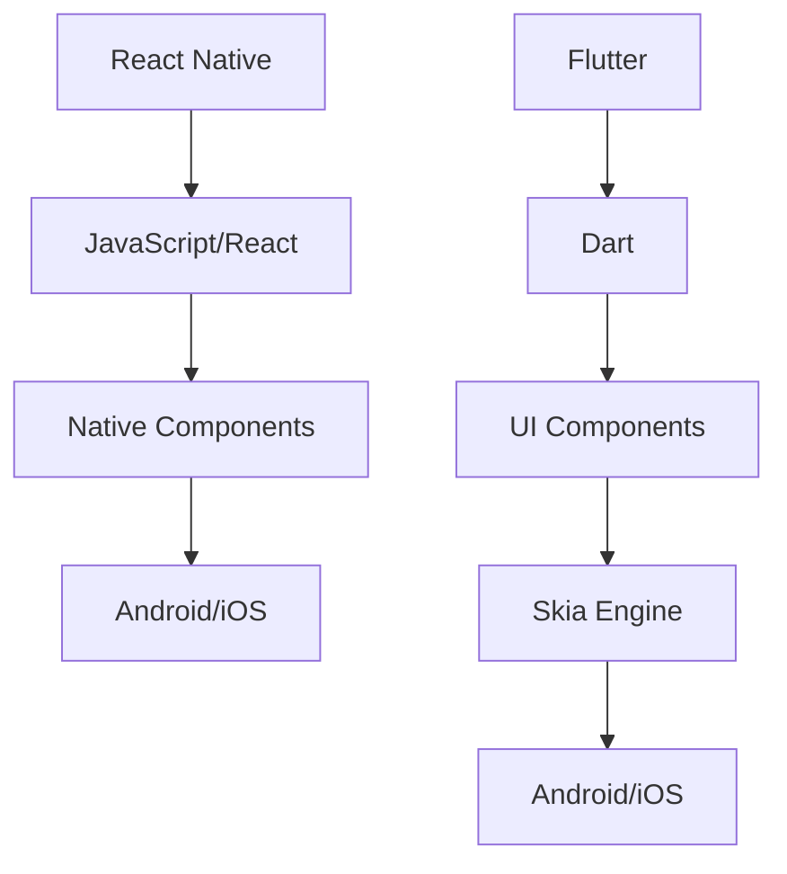

                 

关键词：移动开发，React Native，Flutter，框架对比，跨平台开发，原生性能，用户体验，开发者体验，未来趋势。

摘要：本文将深入探讨两种流行的移动端开发框架：React Native 和 Flutter。我们将从背景介绍、核心概念与联系、核心算法原理、数学模型和公式、项目实践、实际应用场景、未来应用展望、工具和资源推荐以及总结和展望等多个角度，进行全面的对比分析，帮助开发者更好地了解和选择适合自己项目的移动端开发框架。

## 1. 背景介绍

随着智能手机的普及和移动互联网的快速发展，移动应用开发成为了现代软件开发中的重要领域。为了提高开发效率和降低成本，跨平台开发框架应运而生。React Native 和 Flutter 是目前市场上最流行的两大跨平台移动应用开发框架。

React Native 是由 Facebook 于 2015 年推出的一款开源框架，它允许开发者使用 JavaScript 语言和 React 的组件化思想来构建 iOS 和 Android 应用。Flutter 是 Google 于 2017 年推出的开源框架，使用 Dart 语言，提供了一套丰富的 UI 组件和工具，旨在通过一整套统一的 API 来实现跨平台开发。

## 2. 核心概念与联系

### 2.1 React Native

React Native 的核心概念是组件化开发。通过 React 的组件模型，开发者可以将 UI 界面拆分为一个个独立的组件，每个组件都可以独立开发、测试和部署。React Native 利用原生组件来实现跨平台兼容，这意味着开发者编写的代码可以在 iOS 和 Android 上无缝运行。

### 2.2 Flutter

Flutter 的核心概念是全平台 UI 组件。Flutter 提供了一套丰富的 UI 组件，这些组件使用 Dart 语言编写，并通过 Skia 图形引擎渲染，可以实现高性能的 UI 界面。Flutter 的组件是跨平台的，开发者只需编写一次代码，就可以在 iOS 和 Android 上运行。

### 2.3 Mermaid 流程图

以下是一个简化的 Mermaid 流程图，展示了 React Native 和 Flutter 的核心概念和架构联系。



## 3. 核心算法原理 & 具体操作步骤

### 3.1 算法原理概述

React Native 和 Flutter 的核心算法原理主要涉及 UI 渲染和组件通信。

#### React Native

React Native 的 UI 渲染基于 React 的虚拟 DOM 模型。开发者编写的组件通过 React 的生命周期方法和状态管理，实现动态更新。React Native 使用原生组件来渲染 UI，这使得 UI 的性能与原生应用接近。

#### Flutter

Flutter 的 UI 渲染基于 Skia 图形引擎。Flutter 使用自己的渲染树和分层模型来构建 UI，通过即时编译和渲染，实现了高性能的 UI 界面。Flutter 的组件通信主要通过事件和回调机制实现。

### 3.2 算法步骤详解

#### React Native

1. 开发者使用 JavaScript 编写 React 组件。
2. React Native 将组件转换为原生组件。
3. 原生组件在 iOS 和 Android 上渲染 UI。

#### Flutter

1. 开发者使用 Dart 语言编写 Flutter 组件。
2. Flutter 组件通过 Skia 图形引擎渲染 UI。
3. Flutter 组件之间通过事件和回调进行通信。

### 3.3 算法优缺点

#### React Native

优点：
- 使用 JavaScript 语言，开发者可以快速上手。
- 社区活跃，有丰富的第三方库和插件。

缺点：
- 性能比原生应用稍逊一筹。
- 在复杂界面和动画处理上，可能需要更多的优化。

#### Flutter

优点：
- 使用 Dart 语言，性能优异。
- 提供了一套丰富的 UI 组件，可以快速构建应用。

缺点：
- 社区相对较小，第三方库和插件相对较少。
- Dart 语言的学习曲线相对较陡峭。

### 3.4 算法应用领域

React Native 适用于需要快速迭代和功能丰富的应用，例如社交媒体、电商平台等。Flutter 适用于对性能要求较高且需要复杂 UI 的应用，例如游戏、视频应用等。

## 4. 数学模型和公式 & 详细讲解 & 举例说明

### 4.1 数学模型构建

React Native 和 Flutter 的性能可以通过以下数学模型进行分析：

#### React Native

响应时间 \( T_r = \frac{1}{f_s} \)

其中，\( f_s \) 为刷新频率。

#### Flutter

响应时间 \( T_f = \frac{1}{f_s} + \frac{C}{f_p} \)

其中，\( f_s \) 为刷新频率，\( C \) 为渲染开销。

### 4.2 公式推导过程

#### React Native

React Native 的响应时间主要由虚拟 DOM 的更新和原生组件的渲染决定。假设虚拟 DOM 的更新频率为 \( f_v \)，原生组件的渲染频率为 \( f_n \)，则响应时间为：

\[ T_r = \frac{1}{f_v + f_n} \]

由于 \( f_v \) 和 \( f_n \) 通常远大于 \( f_s \)，可以近似为：

\[ T_r \approx \frac{1}{f_s} \]

#### Flutter

Flutter 的响应时间包括渲染和事件处理。假设渲染开销为 \( C \)，则响应时间为：

\[ T_f = \frac{1}{f_s} + \frac{C}{f_p} \]

其中，\( f_p \) 为事件处理频率。

### 4.3 案例分析与讲解

假设一个应用的刷新频率为 \( 60Hz \)，React Native 的虚拟 DOM 更新频率为 \( 20Hz \)，原生组件渲染频率为 \( 40Hz \)；Flutter 的渲染开销为 \( 10ms \)，事件处理频率为 \( 100Hz \)。

对于 React Native，响应时间为：

\[ T_r = \frac{1}{60} \approx 16.7ms \]

对于 Flutter，响应时间为：

\[ T_f = \frac{1}{60} + \frac{10}{100} = 16.1ms \]

可以看出，React Native 和 Flutter 的响应时间非常接近，但 Flutter 在渲染开销上略高。

## 5. 项目实践：代码实例和详细解释说明

### 5.1 开发环境搭建

#### React Native

1. 安装 Node.js 和 Watchman。
2. 安装 React Native CLI。
3. 创建新的 React Native 项目。

#### Flutter

1. 安装 Dart SDK。
2. 安装 Flutter 插件。
3. 创建新的 Flutter 项目。

### 5.2 源代码详细实现

以下是一个简单的 React Native 示例，用于展示一个计数器：

```javascript
import React, { useState } from 'react';
import { Button, Text, View } from 'react-native';

function Counter() {
  const [count, setCount] = useState(0);

  return (
    <View>
      <Text>Count: {count}</Text>
      <Button title="Increment" onPress={() => setCount(count + 1)} />
    </View>
  );
}

export default Counter;
```

以下是一个简单的 Flutter 示例，用于展示一个计数器：

```dart
import 'package:flutter/material.dart';

void main() {
  runApp(MyApp());
}

class MyApp extends StatelessWidget {
  @override
  Widget build(BuildContext context) {
    return MaterialApp(
      title: 'Flutter Demo',
      home: Scaffold(
        appBar: AppBar(title: Text('Counter')),
        body: Center(
          child: Column(
            mainAxisAlignment: MainAxisAlignment.center,
            children: <Widget>[
              Text(
                'Count: ${_count}',
                style: Theme.of(context).textTheme.headline4,
              ),
              ElevatedButton(
                onPressed: _incrementCounter,
                child: Text('Increment'),
              ),
            ],
          ),
        ),
      ),
    );
  }

  int _count = 0;

  void _incrementCounter() {
    setState(() {
      _count++;
    });
  }
}
```

### 5.3 代码解读与分析

React Native 和 Flutter 的代码示例都实现了计数器的功能。React Native 使用 React 的状态管理来更新 UI，Flutter 使用 Dart 的状态管理来更新 UI。两者的代码结构相似，但使用了不同的编程语言和框架。

React Native 的组件化开发使得代码更易于维护和测试。Flutter 的 Dart 语言具有静态类型检查，可以提高代码的稳定性和性能。

## 6. 实际应用场景

React Native 和 Flutter 都有广泛的应用场景。

#### React Native

- 社交媒体应用：如 Facebook、Instagram。
- 电商平台：如 Walmart、eBay。
- 实时通讯应用：如 WhatsApp、Line。

#### Flutter

- 游戏应用：如 GameLoop、Ludo King。
- 视频应用：如 TikTok、YouTube。
- 媒体播放器：如 VLC for Android。

## 7. 未来应用展望

随着移动互联网的不断发展，React Native 和 Flutter 将在更多领域得到应用。未来，随着硬件性能的提升和开发者社区的扩大，这两个框架的性能和功能将进一步提升。

## 8. 工具和资源推荐

### 8.1 学习资源推荐

- React Native 官方文档：[https://reactnative.dev/docs/getting-started](https://reactnative.dev/docs/getting-started)
- Flutter 官方文档：[https://flutter.dev/docs/get-started/install](https://flutter.dev/docs/get-started/install)
- React Native 学习指南：[https://reactnative.dev/docs/react-native-in-30-minutes](https://reactnative.dev/docs/react-native-in-30-minutes)
- Flutter 学习指南：[https://flutter.dev/docs/get-started/test-drive](https://flutter.dev/docs/get-started/test-drive)

### 8.2 开发工具推荐

- React Native 开发工具：Visual Studio Code、Android Studio。
- Flutter 开发工具：IntelliJ IDEA、Android Studio。

### 8.3 相关论文推荐

- "The React Native Approach to Building Native Apps with JavaScript"。
- "Flutter: Building Native Apps with Dart"。

## 9. 总结：未来发展趋势与挑战

React Native 和 Flutter 作为跨平台移动开发框架，已经取得了巨大的成功。未来，随着移动互联网的快速发展，这两个框架将继续在移动应用开发领域发挥重要作用。然而，面对日益激烈的竞争和不断变化的市场需求，React Native 和 Flutter 还需要不断优化和改进，以应对未来发展的挑战。

### 附录：常见问题与解答

1. **React Native 和 Flutter 的主要区别是什么？**

   React Native 使用 JavaScript 和 React 的组件化思想，通过原生组件实现跨平台兼容。Flutter 使用 Dart 语言和 Skia 图形引擎，提供了一套丰富的 UI 组件。

2. **React Native 的性能如何？**

   React Native 的性能接近原生应用，但相对于 Flutter 略逊一筹。

3. **Flutter 的主要优点是什么？**

   Flutter 提供了一套丰富的 UI 组件，使用 Dart 语言，性能优异。

4. **React Native 和 Flutter 的应用场景有哪些？**

   React Native 适用于需要快速迭代和功能丰富的应用，Flutter 适用于对性能要求较高且需要复杂 UI 的应用。

### 作者署名

作者：禅与计算机程序设计艺术 / Zen and the Art of Computer Programming
----------------------------------------------------------------

以上就是本文的完整内容，感谢您的阅读。希望这篇文章能够帮助您更好地了解 React Native 和 Flutter，为您的移动应用开发提供有益的参考。如果您有任何问题或建议，欢迎在评论区留言。再次感谢您的支持！


