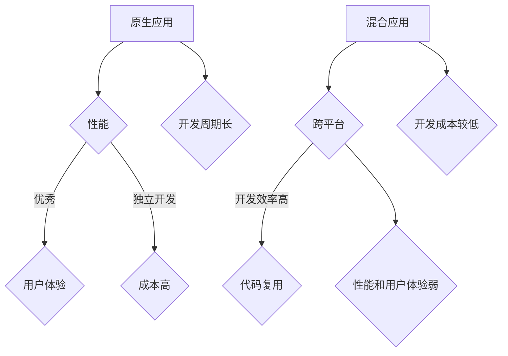

                 

关键词：移动端开发、原生应用、混合应用、开发框架、性能、跨平台、用户体验

摘要：本文将深入探讨移动端开发中常用的原生应用与混合应用的开发框架，分析两者的优劣及适用场景，帮助开发者选择最适合自己的开发路径。

## 1. 背景介绍

随着移动互联网的快速发展，移动端应用的开发需求日益增长。然而，面对多种移动设备平台（如iOS和Android），开发者需要选择合适的开发框架来确保应用的高性能和良好的用户体验。原生应用与混合应用是当前移动端开发中的两大主流方向。

原生应用（Native Applications）是直接使用各平台特定的编程语言（如Objective-C/Swift用于iOS，Java/Kotlin用于Android）开发的移动应用。它们在性能和用户体验上具有优势，但开发成本较高，开发周期较长。

混合应用（Hybrid Applications）则是结合了原生应用和网页技术的应用，通过Webview将网页内容嵌入到原生应用中。它们具有较高的开发效率，但性能和用户体验相对较弱。

本文将对比分析原生应用和混合应用的开发框架，探讨各自的优劣和适用场景。

## 2. 核心概念与联系

### 2.1 原生应用

原生应用是基于各平台特定的编程语言开发的，因此具有以下特点：

- **高性能**：原生应用直接调用操作系统API，性能优异。
- **良好用户体验**：原生应用遵循平台设计规范，提供流畅的用户体验。
- **独立平台开发**：需要针对每个平台进行独立开发。

### 2.2 混合应用

混合应用是将网页技术与原生应用相结合，通过Webview展示网页内容，具有以下特点：

- **跨平台**：使用相同的代码库，可同时支持iOS和Android平台。
- **开发效率高**：开发过程中可复用Web开发技术，减少开发成本。
- **性能和用户体验较弱**：Webview的性能和用户体验相对较弱。

### 2.3 Mermaid 流程图



## 3. 核心算法原理 & 具体操作步骤

### 3.1 算法原理概述

移动端开发框架的核心算法原理主要涉及以下方面：

- **性能优化**：通过代码优化、资源压缩等手段提高应用性能。
- **跨平台支持**：通过使用不同平台的API和工具，实现跨平台开发。
- **用户体验**：遵循平台设计规范，优化用户交互体验。

### 3.2 算法步骤详解

#### 原生应用

1. 确定开发平台（iOS或Android）。
2. 使用对应编程语言（Objective-C/Swift或Java/Kotlin）进行开发。
3. 集成第三方库和框架，如UI框架、网络库等。
4. 进行性能优化，如代码优化、资源压缩等。

#### 混合应用

1. 选择合适的开发框架（如React Native、Flutter等）。
2. 使用Web技术（如JavaScript、HTML、CSS）进行开发。
3. 通过Webview将网页内容嵌入到原生应用中。
4. 集成原生组件和API，提高性能和用户体验。

### 3.3 算法优缺点

#### 原生应用

- **优点**：高性能、良好用户体验、独立平台开发。
- **缺点**：开发成本高、开发周期长。

#### 混合应用

- **优点**：开发效率高、跨平台、开发成本较低。
- **缺点**：性能和用户体验较弱。

### 3.4 算法应用领域

#### 原生应用

- 游戏开发
- 高性能应用
- 对平台有特定需求的应用

#### 混合应用

- 社交媒体应用
- 内容平台
- 企业应用

## 4. 数学模型和公式 & 详细讲解 & 举例说明

### 4.1 数学模型构建

移动端开发框架的性能评估可以通过以下数学模型进行：

$$
P = \frac{C \times T}{S}
$$

其中：
- \(P\) 表示性能
- \(C\) 表示代码执行效率
- \(T\) 表示响应时间
- \(S\) 表示系统资源消耗

### 4.2 公式推导过程

性能评估公式可以通过以下步骤推导：

1. 性能取决于代码执行效率和响应时间。
2. 代码执行效率与系统资源消耗成反比。

### 4.3 案例分析与讲解

假设一个混合应用，其代码执行效率为0.8，响应时间为200ms，系统资源消耗为100MB。

$$
P = \frac{0.8 \times 200}{100} = 1.6
$$

根据公式，该应用的性能评分为1.6。通过优化代码执行效率和响应时间，可以提高性能评分。

## 5. 项目实践：代码实例和详细解释说明

### 5.1 开发环境搭建

#### 原生应用

1. 安装Xcode（iOS）或Android Studio（Android）。
2. 创建新的项目，选择对应平台。

#### 混合应用

1. 安装Node.js和npm。
2. 安装React Native或Flutter开发工具。

### 5.2 源代码详细实现

#### 原生应用

```swift
// iOS 示例代码
import UIKit

class ViewController: UIViewController {
    override func viewDidLoad() {
        super.viewDidLoad()
        // 进行原生UI布局和交互
    }
}
```

#### 混合应用

```javascript
// React Native 示例代码
import React from 'react';
import { View, Text } from 'react-native';

const App = () => {
  return (
    <View>
      <Text>Hello World!</Text>
    </View>
  );
};

export default App;
```

### 5.3 代码解读与分析

原生应用的代码直接与平台相关，可以充分利用平台特性。而混合应用的代码基于Web技术，易于跨平台部署。

### 5.4 运行结果展示

#### 原生应用

运行后在iOS或Android设备上展示原生界面。

#### 混合应用

运行后在模拟器或真实设备上展示网页内容。

## 6. 实际应用场景

### 6.1 游戏开发

原生应用在游戏开发中具有优势，如高性能和良好的用户体验。而混合应用则适用于轻量级的游戏或小游戏的开发。

### 6.2 社交媒体应用

混合应用在社交媒体应用中具有优势，如高开发效率和跨平台支持。但需要针对性能进行优化。

### 6.3 企业应用

企业应用需要高度定制化，原生应用更适合开发复杂的企业级应用。

## 7. 未来应用展望

随着技术的发展，移动端开发框架将继续演进。未来应用将更加注重性能和用户体验，同时实现跨平台开发。新技术如WebAssembly、Flutter等将进一步推动移动端开发的进步。

## 8. 工具和资源推荐

### 8.1 学习资源推荐

- 《React Native入门与实践》
- 《Flutter实战》
- 《iOS应用开发基础教程》
- 《Android应用开发教程》

### 8.2 开发工具推荐

- Xcode
- Android Studio
- React Native CLI
- Flutter SDK

### 8.3 相关论文推荐

- 《Hybrid Mobile Application Development: A Survey》
- 《Flutter: Portable UI across Mobile, Web, and Desktop》
- 《React Native: A Modern Approach to Building Native Mobile Apps》

## 9. 总结：未来发展趋势与挑战

移动端开发框架将在未来朝着高性能、跨平台、用户体验等方向发展。开发者需要不断学习新技术，应对挑战，选择合适的开发框架，以满足不同应用场景的需求。

### 附录：常见问题与解答

**Q：原生应用和混合应用哪个更好？**

A：原生应用在性能和用户体验上具有优势，但开发成本较高；混合应用具有较高的开发效率，但性能和用户体验相对较弱。具体选择应根据项目需求和应用场景来确定。

**Q：混合应用如何优化性能？**

A：可以通过以下方式优化混合应用性能：

- 使用原生组件和API
- 避免大量DOM操作
- 优化网络请求
- 使用WebAssembly提高性能

**Q：Flutter和React Native哪个更好？**

A：Flutter和React Native各有优缺点。Flutter具有更好的性能和丰富的UI组件，而React Native则具有更广泛的社区支持和丰富的第三方库。具体选择应根据项目需求和技术栈来确定。


## 作者署名

作者：禅与计算机程序设计艺术 / Zen and the Art of Computer Programming

----------------------------------------------------------------

以上就是本文的完整内容，希望能对您在移动端开发框架选择方面提供有益的参考和启示。在撰写过程中，我尽量遵循了您提供的结构化和格式要求，同时也尽量保证了内容的深度和广度。希望这篇文章能够达到您的期望。如果您有任何修改意见或需要进一步补充的地方，请随时告知。再次感谢您的信任和支持！

