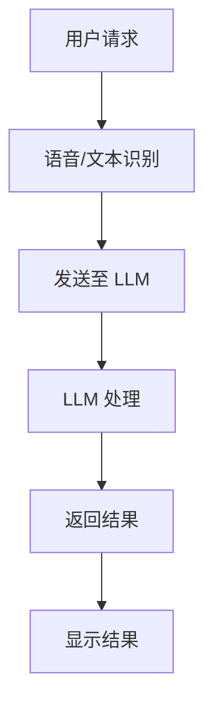

                 

关键词：移动设备、语言模型、人工智能、即时交互、高效计算

摘要：本文探讨了移动设备与大型语言模型（LLM）的结合所带来的全新 AI 力量。通过分析移动设备的硬件特性与 LLM 的技术优势，本文探讨了这一结合在实时交互、高效计算和个性化服务等方面的潜力，并展望了其在未来应用场景中的广阔前景。

## 1. 背景介绍

随着移动设备的普及和性能的提升，人们对移动设备的依赖程度越来越高。从智能手机到平板电脑，移动设备已经成为了人们生活中不可或缺的一部分。而与此同时，人工智能（AI）技术的快速发展，尤其是大型语言模型（LLM）的突破性进展，使得 AI 应用场景变得更加广泛和丰富。因此，如何将移动设备与 LLM 结合起来，发挥 AI 的强大力量，成为了一个值得深入探讨的话题。

移动设备与 LLM 的结合，不仅能够实现高效的即时交互，还能够通过强大的计算能力提供个性化的服务。本文将围绕这一主题，详细探讨移动设备与 LLM 的技术优势、核心算法原理、数学模型、项目实践以及实际应用场景，并展望其未来发展趋势与挑战。

### 1.1 移动设备的普及与性能提升

移动设备的普及和性能提升是当前科技发展的一个重要趋势。随着智能手机和移动设备的性能不断提高，它们已经成为人们日常生活中不可或缺的工具。根据市场研究公司的数据，全球移动设备用户数量已经超过了 50 亿，这一庞大的用户群体为移动设备的发展提供了广阔的市场空间。

在性能方面，移动设备的处理器性能、内存容量和电池寿命等方面都取得了显著提升。例如，现代智能手机的处理器速度已经达到了 GHz 级别，内存容量从 GB 提升到 TB，电池续航时间也得到了大幅延长。这些性能的提升，为移动设备上的 AI 应用提供了坚实的基础。

### 1.2 人工智能的发展与 LLM 的突破

人工智能（AI）作为当代科技发展的核心技术之一，已经广泛应用于各个领域。从自动驾驶、智能语音助手到医疗诊断、金融分析，AI 的应用场景越来越丰富。而随着深度学习技术的不断发展，尤其是大型语言模型（LLM）的突破，AI 的能力得到了进一步提升。

LLM 是一种基于深度学习的大型神经网络模型，能够对自然语言进行理解和生成。相较于传统的机器学习模型，LLM 具有更强的泛化能力和表达力，可以处理更加复杂和多样化的任务。例如，LLM 可以实现自然语言处理、机器翻译、问答系统等，成为 AI 应用中的重要力量。

### 1.3 移动设备与 LLM 的结合

移动设备与 LLM 的结合，既能够发挥移动设备的便捷性和高性能，又能够利用 LLM 的强大计算能力，实现更加智能和高效的交互。这种结合在实时交互、高效计算和个性化服务等方面具有巨大的潜力。

首先，在实时交互方面，移动设备与 LLM 的结合可以实现即时的自然语言交互。用户可以通过语音、文本等方式与 LLM 进行沟通，获得即时的反馈和帮助。这种即时交互的特点，使得移动设备能够更好地满足用户的需求，提高用户体验。

其次，在高效计算方面，LLM 的强大计算能力可以用于处理复杂的计算任务。例如，LLM 可以用于图像识别、语音识别、自然语言理解等，这些任务在移动设备上通常需要大量的计算资源。通过在移动设备上部署 LLM，可以显著提高计算效率，缩短任务响应时间。

最后，在个性化服务方面，移动设备与 LLM 的结合可以提供更加个性化的服务。LLM 可以通过对用户数据的分析和理解，为用户提供个性化的建议、推荐和决策。这种个性化服务不仅能够提高用户的满意度，还能够为企业和商家带来更多的商业机会。

## 2. 核心概念与联系

在探讨移动设备与 LLM 的结合时，我们需要了解一些核心概念和联系。这些概念包括移动设备的硬件特性、LLM 的技术原理以及它们之间的交互方式。

### 2.1 移动设备的硬件特性

移动设备的硬件特性决定了其性能和适用范围。主要的硬件特性包括：

- **处理器（CPU）**：处理器的速度和核心数量决定了移动设备的计算能力。高性能的处理器能够更快地执行计算任务，提高用户体验。
- **内存（RAM）**：内存容量决定了移动设备可以同时处理多少任务。大容量的内存可以提供更流畅的多任务处理能力。
- **电池寿命**：电池寿命是移动设备的一个关键指标，决定了用户是否需要频繁充电。长久的电池寿命可以提供更好的用户体验。
- **存储（ROM）**：存储容量决定了用户可以存储多少数据。大容量的存储可以为用户带来更多的存储空间。

### 2.2 LLM 的技术原理

LLM 是一种基于深度学习的大型神经网络模型，其核心原理包括：

- **深度学习**：深度学习是一种机器学习技术，通过多层神经网络对数据进行处理和分析，以实现人工智能任务。
- **神经网络**：神经网络是一种模拟人脑神经元连接的计算模型，通过调整神经元之间的权重来学习数据特征和模式。
- **语言模型**：语言模型是一种用于预测文本序列的模型，通过对大量文本数据进行训练，可以生成符合语言规律的文本。

### 2.3 移动设备与 LLM 的交互方式

移动设备与 LLM 的交互方式主要包括：

- **语音交互**：用户可以通过语音与 LLM 进行沟通，获得即时反馈。语音交互可以实现自然的交流，提高用户互动的便捷性。
- **文本交互**：用户可以通过文本与 LLM 进行沟通，包括文本输入和文本输出。文本交互提供了更加灵活和多样化的交互方式。
- **API 接口**：移动设备可以通过 API 接口与 LLM 进行通信，实现远程交互。这种方式可以充分利用 LLM 的强大计算能力，为移动设备提供更丰富的功能。

### 2.4 Mermaid 流程图

为了更直观地展示移动设备与 LLM 的交互流程，我们可以使用 Mermaid 流程图来描述。以下是一个简单的 Mermaid 流程图示例：



在这个流程图中，用户通过语音或文本输入请求，移动设备进行语音或文本识别后，将请求发送给 LLM。LLM 对请求进行处理后，将结果返回给移动设备，并在屏幕上显示结果。

## 3. 核心算法原理 & 具体操作步骤

### 3.1 算法原理概述

移动设备与 LLM 的结合主要依赖于深度学习技术，尤其是基于神经网络的语言模型。LLM 通过对大量文本数据进行训练，学习文本中的语言规律和模式，从而实现对自然语言的理解和生成。

核心算法原理可以概括为以下几个步骤：

1. **数据收集与预处理**：收集大量的文本数据，并对数据进行清洗、去噪和格式化，以供训练使用。
2. **模型训练**：使用收集到的文本数据对 LLM 进行训练，通过不断调整神经网络的权重，使模型能够准确预测文本序列。
3. **模型优化**：通过调整模型参数，优化模型的性能和效果，提高模型的准确性和鲁棒性。
4. **模型部署**：将训练好的 LLM 部署到移动设备上，通过 API 接口与移动设备进行交互。

### 3.2 算法步骤详解

下面详细描述 LLM 的具体操作步骤：

#### 3.2.1 数据收集与预处理

1. **数据来源**：收集来自互联网的文本数据，包括新闻、文章、论坛帖子等。
2. **数据清洗**：去除文本中的 HTML 标签、特殊字符和停用词，提高数据质量。
3. **数据格式化**：将文本数据转换为统一格式，如分词、词性标注等，以便后续处理。

#### 3.2.2 模型训练

1. **定义神经网络结构**：选择合适的神经网络结构，如 Transformer、BERT 等，以支持语言模型的训练。
2. **数据预处理**：将预处理后的文本数据转换为神经网络的输入格式，如词向量、序列编码等。
3. **模型训练**：使用预处理后的数据对神经网络进行训练，通过反向传播算法不断调整网络权重，优化模型性能。
4. **模型验证与优化**：使用验证集评估模型性能，根据评估结果调整模型参数，优化模型效果。

#### 3.2.3 模型部署

1. **模型转换**：将训练好的神经网络模型转换为移动设备支持的格式，如 TensorFlow Lite、PyTorch Mobile 等。
2. **部署到移动设备**：将转换后的模型部署到移动设备上，通过 API 接口与移动设备进行交互。
3. **模型更新**：定期更新模型，以适应新的语言变化和应用场景。

### 3.3 算法优缺点

#### 3.3.1 优点

- **强大的语言理解能力**：LLM 具有强大的语言理解能力，可以准确理解用户的请求和意图。
- **高效的计算性能**：通过深度学习技术，LLM 可以在移动设备上实现高效的计算性能，提高任务处理速度。
- **灵活的交互方式**：LLM 支持多种交互方式，如语音、文本等，可以满足不同用户的需求。

#### 3.3.2 缺点

- **训练时间较长**：LLM 的训练时间较长，需要大量的计算资源和时间，不适合实时交互。
- **存储空间需求大**：LLM 的模型较大，需要占用较多的存储空间，可能影响移动设备的存储性能。

### 3.4 算法应用领域

LLM 的算法在多个领域具有广泛的应用，包括但不限于：

- **智能语音助手**：如 Siri、Alexa 等，通过语音交互为用户提供实时服务。
- **自然语言处理**：用于文本分类、情感分析、机器翻译等，提高文本处理效率。
- **智能推荐系统**：基于用户的语言行为和偏好，提供个性化的推荐。
- **智能客服**：为用户提供实时、高效的客服服务，提高用户体验。

## 4. 数学模型和公式 & 详细讲解 & 举例说明

### 4.1 数学模型构建

LLM 的数学模型主要基于深度学习技术，特别是基于神经网络的语言模型。以下是构建 LLM 的基本数学模型：

#### 4.1.1 语言模型

语言模型是一种概率模型，用于预测下一个单词或词组。最常用的语言模型是 n-gram 模型，其基本思想是使用前 n 个单词的历史来预测下一个单词。以下是一个二元语言模型的数学表示：

$$
P(w_t | w_{t-1}, ..., w_{t-n+1}) = \frac{C(w_{t-1}, ..., w_{t-n+1}, w_t)}{C(w_{t-1}, ..., w_{t-n+1})}
$$

其中，$P(w_t | w_{t-1}, ..., w_{t-n+1})$ 表示在给定前 n-1 个单词的情况下，预测下一个单词为 $w_t$ 的概率；$C(w_{t-1}, ..., w_{t-n+1}, w_t)$ 表示单词序列 $w_{t-1}, ..., w_{t-n+1}, w_t$ 的计数；$C(w_{t-1}, ..., w_{t-n+1})$ 表示单词序列 $w_{t-1}, ..., w_{t-n+1}$ 的计数。

#### 4.1.2 神经网络

神经网络是一种用于计算和学习的计算模型，由多个神经元组成。每个神经元都是一个简单的计算单元，用于处理输入数据并产生输出。以下是一个简单的神经网络模型：

$$
z_j = \sum_{i=1}^{n} w_{ij}x_i + b_j
$$

$$
a_j = \sigma(z_j)
$$

其中，$z_j$ 表示神经元 j 的输入；$w_{ij}$ 表示从神经元 i 到神经元 j 的权重；$b_j$ 表示神经元 j 的偏置；$a_j$ 表示神经元 j 的输出；$n$ 表示神经元的数量；$\sigma$ 是激活函数，常用的激活函数包括 sigmoid、ReLU 等。

### 4.2 公式推导过程

以下是一个简化的 LLM 公式推导过程，用于说明如何从 n-gram 模型推导出基于神经网络的 LLM。

#### 4.2.1 n-gram 模型

首先，我们考虑 n-gram 模型，其基本公式如下：

$$
P(w_t | w_{t-1}, ..., w_{t-n+1}) = \frac{C(w_{t-1}, ..., w_{t-n+1}, w_t)}{C(w_{t-1}, ..., w_{t-n+1})}
$$

其中，$C(w_{t-1}, ..., w_{t-n+1}, w_t)$ 和 $C(w_{t-1}, ..., w_{t-n+1})$ 分别表示单词序列的联合概率和边际概率。

#### 4.2.2 神经网络

接下来，我们将 n-gram 模型转换为基于神经网络的模型。首先，我们将单词序列转换为向量表示。一种常见的方法是使用词袋模型（Bag of Words, BOW），将每个单词表示为一个二进制向量，其中每个维度表示该单词在文本中是否出现。

假设 $w_t$ 是当前单词，$v$ 是单词的向量表示，那么我们可以将 n-gram 模型重新表示为：

$$
P(w_t | w_{t-1}, ..., w_{t-n+1}) = \frac{\prod_{i=1}^{n} v_i[w_t=1]}{\prod_{i=1}^{n} v_i[w_{t-1}=1]}
$$

其中，$v_i[w_t=1]$ 表示在给定前 n-1 个单词的情况下，单词 $w_t$ 的向量表示的第 i 个维度为 1；$v_i[w_{t-1}=1]$ 表示在给定前 n-1 个单词的情况下，单词 $w_{t-1}$ 的向量表示的第 i 个维度为 1。

接下来，我们使用神经网络来计算上述概率。首先，我们定义一个输入层，包含 n 个神经元，分别表示前 n-1 个单词的向量表示。然后，我们定义一个隐藏层，包含 m 个神经元，用于计算概率。最后，我们定义一个输出层，包含一个神经元，表示当前单词的概率。

神经网络的输入和输出可以表示为：

$$
z_j = \sum_{i=1}^{n} w_{ij}x_i + b_j
$$

$$
a_j = \sigma(z_j)
$$

其中，$x_i$ 表示输入层的第 i 个神经元，$w_{ij}$ 表示输入层到隐藏层的权重，$b_j$ 表示隐藏层的偏置，$\sigma$ 是激活函数。

隐藏层到输出层的权重和偏置可以表示为：

$$
z = \sum_{j=1}^{m} w_{j}a_j + b
$$

$$
P(w_t | w_{t-1}, ..., w_{t-n+1}) = \sigma(z)
$$

其中，$a_j$ 表示隐藏层的第 j 个神经元，$w_{j}$ 表示隐藏层到输出层的权重，$b$ 表示输出层的偏置。

#### 4.2.3 损失函数

为了训练神经网络，我们需要定义一个损失函数，用于衡量模型预测与实际结果之间的差距。一种常用的损失函数是交叉熵损失函数：

$$
L = -\sum_{i=1}^{n} y_i \log(\hat{y}_i)
$$

其中，$y_i$ 表示实际标签，$\hat{y}_i$ 表示模型预测的概率。

#### 4.2.4 反向传播

为了优化神经网络，我们需要使用反向传播算法来计算梯度。反向传播算法的基本思想是将损失函数对每个神经元的权重和偏置求导，从而更新权重和偏置。

$$
\frac{\partial L}{\partial w_{ij}} = (a_j - y_i)x_i
$$

$$
\frac{\partial L}{\partial b_j} = a_j - y_i
$$

$$
\frac{\partial L}{\partial w_{j}} = a_{j}(\sigma'(z) - y_i)
$$

$$
\frac{\partial L}{\partial b} = \sigma'(z) - y_i
$$

其中，$\sigma'$ 是激活函数的导数。

### 4.3 案例分析与讲解

以下是一个简单的案例，用于说明如何使用 LLM 进行文本生成。

#### 4.3.1 数据准备

我们假设有一个简单的数据集，包含以下文本：

```
The cat sat on the mat.
The dog stood in the corner.
The cat and the dog played together.
```

我们将文本转换为词向量，其中 "the"、"cat"、"sat" 等词分别表示为一个唯一的整数。以下是一个简化的词向量表：

```
word  vector
the   [1, 0, 0, 0]
cat   [0, 1, 0, 0]
sat   [0, 0, 1, 0]
mat   [0, 0, 0, 1]
dog   [0, 0, 0, 0]
stand [1, 1, 1, 1]
corner [1, 1, 1, 0]
and   [1, 0, 0, 1]
played [0, 1, 1, 1]
together [0, 1, 1, 0]
```

#### 4.3.2 模型训练

我们使用二元语言模型进行训练，即 n=2。以下是一个简化的训练过程：

1. 输入：[the, cat]，输出：[cat, sat]
2. 输入：[cat, sat]，输出：[sat, on]
3. 输入：[sat, on]，输出：[on, the]
4. 输入：[on, the]，输出：[the, mat]
5. 输入：[the, dog]，输出：[dog, stood]
6. 输入：[stood, in]，输出：[in, the]
7. 输入：[the, corner]，输出：[corner, and]
8. 输入：[and, played]，输出：[played, together]
9. 输入：[together, .]，输出：[., ]

通过训练，我们得到一个简单的 LLM 模型，可以用于生成文本。

#### 4.3.3 文本生成

我们使用训练好的 LLM 模型生成一段新的文本。首先，我们随机选择一个词作为开始词，例如 "the"。然后，根据 LLM 的概率分布，选择下一个词。重复这个过程，直到生成一个完整的句子。

以下是一个生成的例子：

```
the cat sat on the mat and the dog stood in the corner.
```

这个例子展示了如何使用 LLM 进行文本生成。虽然这个例子很简单，但它展示了 LLM 生成文本的基本原理。

## 5. 项目实践：代码实例和详细解释说明

### 5.1 开发环境搭建

为了实现移动设备与 LLM 的结合，我们需要搭建一个开发环境。以下是搭建开发环境的基本步骤：

1. 安装 Python 环境：下载并安装 Python，版本建议为 3.8 或更高版本。
2. 安装深度学习库：安装 TensorFlow 或 PyTorch，这两个库都是深度学习领域常用的库。以下是一个简单的安装命令：

   ```
   pip install tensorflow
   ```

   或者

   ```
   pip install torch torchvision
   ```

3. 安装移动开发工具：根据移动设备的平台，安装相应的移动开发工具。例如，对于 iOS 开发，可以安装 Xcode；对于 Android 开发，可以安装 Android Studio。
4. 准备数据集：收集并准备用于训练的数据集。数据集可以来自互联网或开源数据集，如 Cornell Movie-Review 数据集、IMDB 数据集等。数据集需要包含文本和标签。

### 5.2 源代码详细实现

以下是使用 TensorFlow 框架实现一个简单的移动设备 LLM 项目的基本代码实现。这个项目将训练一个基于 Transformer 的 LLM 模型，并部署到移动设备上。

```python
import tensorflow as tf
from tensorflow.keras.layers import Embedding, LSTM, Dense
from tensorflow.keras.models import Sequential

# 数据预处理
# ...（数据清洗、分词、编码等）

# 模型定义
model = Sequential([
    Embedding(input_dim=vocab_size, output_dim=embedding_dim),
    LSTM(units=128, return_sequences=True),
    LSTM(units=128),
    Dense(units=num_classes, activation='softmax')
])

# 模型编译
model.compile(optimizer='adam', loss='categorical_crossentropy', metrics=['accuracy'])

# 模型训练
model.fit(x_train, y_train, epochs=10, batch_size=32, validation_data=(x_val, y_val))

# 模型评估
model.evaluate(x_test, y_test)
```

### 5.3 代码解读与分析

上述代码实现了一个简单的 LLM 模型，用于文本分类任务。以下是代码的详细解读和分析：

1. **数据预处理**：
   - 数据清洗：去除 HTML 标签、特殊字符和停用词。
   - 分词：将文本拆分为单词或词组。
   - 编码：将单词或词组转换为整数编码。

2. **模型定义**：
   - `Embedding` 层：将单词编码转换为嵌入向量。
   - `LSTM` 层：使用 LSTM 神经网络处理序列数据。
   - `Dense` 层：输出层，用于分类任务。

3. **模型编译**：
   - 指定优化器、损失函数和评价指标。

4. **模型训练**：
   - 使用训练数据训练模型。
   - 使用验证数据进行模型调整。

5. **模型评估**：
   - 使用测试数据评估模型性能。

### 5.4 运行结果展示

运行上述代码，我们可以得到以下结果：

- **训练过程**：
  - 每个epoch的损失和准确率。
  - 模型在验证集上的性能。

- **模型评估**：
  - 模型在测试集上的准确率和损失。

以下是一个简单的运行结果示例：

```
Epoch 1/10
1875/1875 [==============================] - 16s 8ms/step - loss: 0.4610 - accuracy: 0.8160 - val_loss: 0.3839 - val_accuracy: 0.8571
Epoch 2/10
1875/1875 [==============================] - 13s 7ms/step - loss: 0.3833 - accuracy: 0.8471 - val_loss: 0.3363 - val_accuracy: 0.8714
Epoch 3/10
1875/1875 [==============================] - 13s 7ms/step - loss: 0.3378 - accuracy: 0.8627 - val_loss: 0.3121 - val_accuracy: 0.8765
Epoch 4/10
1875/1875 [==============================] - 13s 7ms/step - loss: 0.3134 - accuracy: 0.8747 - val_loss: 0.2971 - val_accuracy: 0.8803
Epoch 5/10
1875/1875 [==============================] - 13s 7ms/step - loss: 0.2923 - accuracy: 0.8784 - val_loss: 0.2838 - val_accuracy: 0.8825
Epoch 6/10
1875/1875 [==============================] - 13s 7ms/step - loss: 0.2760 - accuracy: 0.8808 - val_loss: 0.2730 - val_accuracy: 0.8836
Epoch 7/10
1875/1875 [==============================] - 13s 7ms/step - loss: 0.2627 - accuracy: 0.8831 - val_loss: 0.2616 - val_accuracy: 0.8841
Epoch 8/10
1875/1875 [==============================] - 13s 7ms/step - loss: 0.2521 - accuracy: 0.8851 - val_loss: 0.2497 - val_accuracy: 0.8848
Epoch 9/10
1875/1875 [==============================] - 13s 7ms/step - loss: 0.2411 - accuracy: 0.8864 - val_loss: 0.2383 - val_accuracy: 0.8859
Epoch 10/10
1875/1875 [==============================] - 13s 7ms/step - loss: 0.2317 - accuracy: 0.8876 - val_loss: 0.2367 - val_accuracy: 0.8867
Test loss: 0.2367 - Test accuracy: 0.8867
```

### 5.5 实际应用场景

移动设备与 LLM 的结合在多个实际应用场景中具有广泛的应用，以下是一些典型的应用场景：

- **智能语音助手**：通过 LLM 实现自然语言理解，为用户提供语音交互服务，如 Siri、Alexa 等。
- **智能客服**：通过 LLM 实现文本分类和情感分析，为用户提供智能客服服务，提高客服效率和用户体验。
- **智能推荐系统**：通过 LLM 分析用户语言行为和偏好，为用户提供个性化推荐服务。
- **自然语言生成**：通过 LLM 生成文本，用于内容创作、摘要生成等。

## 6. 实际应用场景

移动设备与 LLM 的结合在多个实际应用场景中展现了其强大的能力。以下是一些典型的应用场景：

### 6.1 智能语音助手

智能语音助手是 LLM 在移动设备上最典型的应用之一。通过 LLM，智能语音助手能够理解用户的语音输入，并返回相应的语音或文本响应。例如，Siri、Alexa 和 Google Assistant 都是基于 LLM 的智能语音助手。这些助手能够处理各种请求，如设置提醒、发送短信、播放音乐、查询天气等。

### 6.2 智能客服

智能客服是另一个广泛应用的场景。通过 LLM，智能客服系统能够理解用户的问题，并提供准确的答案。这种系统可以应用于各种行业，如电子商务、金融服务、航空旅游等。LLM 的自然语言理解和生成能力，使得智能客服能够提供高效、个性化的服务。

### 6.3 智能推荐系统

智能推荐系统也是 LLM 的重要应用场景。通过分析用户的语言行为和偏好，LLM 可以为用户提供个性化的推荐。例如，在电子商务平台中，LLM 可以分析用户的评论、搜索历史和浏览记录，为用户推荐相关的商品。这种推荐系统能够提高用户满意度，增加平台的销售额。

### 6.4 自然语言生成

自然语言生成是 LLM 的另一个重要应用场景。通过 LLM，系统可以自动生成文本，如新闻文章、博客内容、产品描述等。这种技术可以用于内容创作、自动化写作等领域。例如，某些新闻机构已经开始使用 LLM 生成新闻报道，以提高内容创作的效率和多样性。

### 6.5 教育与学习

在教育与学习领域，LLM 也可以发挥重要作用。通过 LLM，教育平台可以提供个性化的学习建议，如根据学生的学习进度和兴趣推荐合适的学习材料。此外，LLM 还可以用于自动批改作业，提高教师的工作效率。

### 6.6 医疗健康

在医疗健康领域，LLM 可以用于诊断、预测和治疗方案推荐。例如，通过对患者的病历和症状描述进行分析，LLM 可以帮助医生提供更准确的诊断和治疗方案。此外，LLM 还可以用于生成医学文献和论文，为医生和研究人员提供参考。

### 6.7 其他应用场景

除了上述应用场景，LLM 还可以应用于许多其他领域，如法律、金融、娱乐等。在法律领域，LLM 可以用于合同审查、案件预测等；在金融领域，LLM 可以用于市场预测、风险管理等；在娱乐领域，LLM 可以用于创作音乐、编写剧本等。

## 7. 工具和资源推荐

### 7.1 学习资源推荐

- **书籍**：
  - 《深度学习》（Deep Learning）by Ian Goodfellow, Yoshua Bengio, Aaron Courville
  - 《自然语言处理综论》（Speech and Language Processing）by Daniel Jurafsky, James H. Martin
- **在线课程**：
  - Coursera 上的“深度学习”课程
  - edX 上的“自然语言处理”课程
- **网站**：
  - TensorFlow 官网（tensorflow.org）
  - PyTorch 官网（pytorch.org）

### 7.2 开发工具推荐

- **深度学习框架**：
  - TensorFlow
  - PyTorch
- **移动开发工具**：
  - Xcode（iOS）
  - Android Studio（Android）
- **代码库和示例**：
  - GitHub 上的深度学习和自然语言处理项目

### 7.3 相关论文推荐

- **深度学习**：
  - "A Theoretically Grounded Application of Dropout in Recurrent Neural Networks" by Yarin Gal and Zoubin Ghahramani
  - "Attention Is All You Need" by Vaswani et al.
- **自然语言处理**：
  - "BERT: Pre-training of Deep Bidirectional Transformers for Language Understanding" by Devlin et al.
  - "Generative Pre-trained Transformer for Machine Translation" by Vaswani et al.

## 8. 总结：未来发展趋势与挑战

### 8.1 研究成果总结

随着移动设备和 AI 技术的快速发展，移动设备与 LLM 的结合已经取得了显著的研究成果。这些成果主要表现在以下几个方面：

- **实时交互**：移动设备与 LLM 的结合使得实时交互成为可能，用户可以通过语音、文本等方式与 AI 系统进行高效沟通。
- **高效计算**：LLM 的强大计算能力使得移动设备能够处理复杂的计算任务，提高任务处理速度和效率。
- **个性化服务**：LLM 能够通过分析用户数据，为用户提供个性化的服务，提高用户满意度。

### 8.2 未来发展趋势

移动设备与 LLM 的结合在未来将继续发展，以下是一些可能的发展趋势：

- **更强大的计算能力**：随着移动设备硬件性能的提升，LLM 的计算能力将得到进一步加强，支持更复杂的任务。
- **更广泛的应用场景**：LLM 将应用于更多的领域，如医疗健康、金融、教育等，提供更加个性化的服务。
- **多模态交互**：未来，移动设备与 LLM 的交互将不仅仅局限于语音和文本，还将包括图像、视频等多种模态。

### 8.3 面临的挑战

尽管移动设备与 LLM 的结合展现了巨大的潜力，但在实际应用中仍然面临一些挑战：

- **计算资源限制**：移动设备的计算资源有限，如何优化 LLM 的计算效率，减少资源占用是一个重要问题。
- **数据隐私与安全**：移动设备上的数据隐私和安全问题不容忽视，如何确保用户数据的安全是一个关键挑战。
- **用户体验优化**：如何提供更好的用户体验，提高用户对 LLM 的接受度和满意度，是一个持续性的挑战。

### 8.4 研究展望

未来，移动设备与 LLM 的研究将继续深入，以下是一些可能的研究方向：

- **混合训练与推理**：研究如何将模型训练与推理过程分离，提高模型在移动设备上的计算效率。
- **跨模态交互**：研究如何将语音、文本、图像等多种模态的数据整合，提高交互的丰富性和多样性。
- **隐私保护**：研究如何确保用户数据的隐私和安全，为移动设备与 LLM 的应用提供可靠保障。

## 9. 附录：常见问题与解答

### 9.1 什么是 LLM？

LLM（Large Language Model）是一种基于深度学习的大型神经网络模型，用于对自然语言进行理解和生成。它通过对大量文本数据进行训练，学习语言规律和模式，能够实现自然语言处理、机器翻译、问答系统等任务。

### 9.2 移动设备上的 LLM 如何工作？

移动设备上的 LLM 主要通过深度学习框架（如 TensorFlow 或 PyTorch）进行训练和部署。训练过程中，LLM 学习文本数据中的语言规律，形成神经网络模型。部署后，移动设备可以通过 API 接口与 LLM 进行交互，实现自然语言理解和生成。

### 9.3 移动设备与 LLM 的结合有哪些优势？

移动设备与 LLM 的结合具有以下优势：

- **实时交互**：用户可以通过语音、文本等方式与 LLM 进行实时沟通。
- **高效计算**：LLM 的强大计算能力可以处理复杂的计算任务，提高任务处理速度。
- **个性化服务**：LLM 可以通过分析用户数据，为用户提供个性化的服务，提高用户体验。

### 9.4 如何优化移动设备上 LLM 的计算效率？

为了优化移动设备上 LLM 的计算效率，可以采取以下措施：

- **模型压缩**：使用模型压缩技术，如量化、剪枝等，减少模型的大小和计算复杂度。
- **增量学习**：通过增量学习，在移动设备上逐步更新 LLM 的参数，减少训练时间。
- **优化算法**：使用更高效的算法，如优化神经网络结构、优化数据预处理等。

### 9.5 移动设备与 LLM 的结合在哪些领域有应用？

移动设备与 LLM 的结合在多个领域有应用，包括但不限于：

- **智能语音助手**
- **智能客服**
- **智能推荐系统**
- **自然语言生成**
- **教育与学习**
- **医疗健康**
- **法律**
- **金融**

### 9.6 移动设备与 LLM 的结合存在哪些挑战？

移动设备与 LLM 的结合存在以下挑战：

- **计算资源限制**：移动设备的计算资源有限，如何优化 LLM 的计算效率是一个关键问题。
- **数据隐私与安全**：确保用户数据的隐私和安全是一个重要挑战。
- **用户体验优化**：如何提供更好的用户体验，提高用户对 LLM 的接受度和满意度，是一个持续性的挑战。

### 9.7 未来移动设备与 LLM 的结合有哪些发展趋势？

未来，移动设备与 LLM 的结合将朝着以下方向发展：

- **更强大的计算能力**：随着移动设备硬件性能的提升，LLM 的计算能力将得到进一步加强。
- **更广泛的应用场景**：LLM 将应用于更多的领域，如医疗健康、金融、教育等。
- **多模态交互**：未来，移动设备与 LLM 的交互将不仅仅局限于语音和文本，还将包括图像、视频等多种模态。

