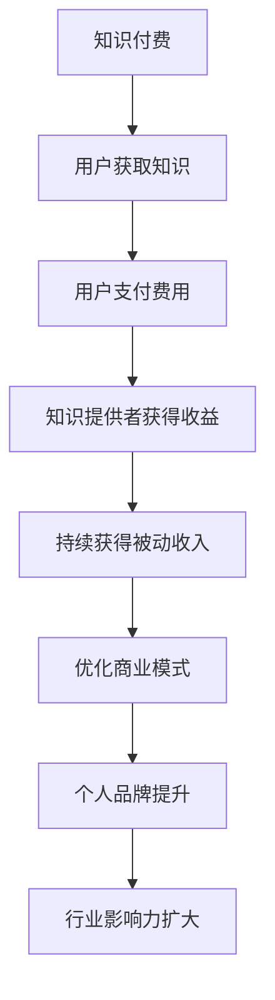

                 

关键词：知识付费、被动收入、程序员、技术博客、知识分享、商业模式

> 摘要：本文旨在探讨程序员如何通过知识付费的方式实现被动收入。通过对知识付费市场的分析，结合实际案例，文章将解析程序员如何构建自己的知识付费体系，优化商业模式，以及未来可能面临的挑战和机遇。

## 1. 背景介绍

在数字时代，知识的传播和获取变得前所未有的便捷。互联网的普及，特别是社交媒体、在线教育平台、知识分享社区的兴起，使得个人知识和专业技能得以更广泛地传播。与此同时，越来越多的程序员开始意识到，将自身的专业知识和技能转化为一种可持续的商业模式，是实现职业发展和财务自由的途径之一。

知识付费，作为互联网经济的一种重要模式，指的是知识提供者为用户提供有价值的信息、知识或服务，用户需支付一定费用才能获取这些资源。这种模式在程序员群体中逐渐流行，尤其是那些拥有独特技能或深厚专业知识的程序员，他们通过知识付费，不仅能够实现收入的多元化，还可以提升个人品牌和行业影响力。

本文将探讨程序员如何通过知识付费实现被动收入，包括市场分析、核心概念、具体操作步骤、项目实践、实际应用场景以及未来展望。

## 2. 核心概念与联系

### 2.1 知识付费的定义

知识付费是指用户为获取特定知识、技能或信息，向知识提供者支付一定费用的一种交易模式。在互联网时代，知识付费涵盖了从在线课程、电子书、专业咨询到技能认证等多个领域。

### 2.2 被动收入的含义

被动收入是指通过一次性的努力，持续获得收益的财务模式。它不同于传统的劳动收入，不需要持续的工作投入，即可带来稳定的现金流。

### 2.3 程序员与知识付费的关联

程序员作为知识密集型职业，他们的专业技能和经验是宝贵的知识资源。通过知识付费，程序员可以将自己的技术知识、编程经验、代码实例等内容转化为收入来源。

### 2.4 知识付费市场的现状

当前，知识付费市场呈现快速增长的趋势。根据统计，全球在线教育市场规模在2020年已达到2500亿美元，且预计未来几年将持续增长。在这个市场中，程序员通过开设在线课程、撰写技术博客、提供咨询服务等多种方式实现知识付费。

### 2.5 知识付费与被动收入的 Mermaid 流程图



## 3. 核心算法原理 & 具体操作步骤

### 3.1 算法原理概述

程序员通过知识付费实现被动收入的核心在于构建一个可持续的商业模式。这个模式需要具备以下几个要素：

1. **专业知识与技能**：程序员应具备独特的技术优势，能够提供用户所需的高价值知识。
2. **内容创作与传播**：通过高质量的内容创作，将专业知识转化为可传播的资源。
3. **用户互动与反馈**：与用户建立良好的互动关系，获取反馈，持续优化知识产品。
4. **持续更新与迭代**：随着技术的进步，定期更新知识产品，保持其相关性和价值。

### 3.2 算法步骤详解

1. **识别市场需求**：通过市场调研、用户反馈等手段，识别用户需求，确定知识产品的主题和内容。
2. **内容创作**：根据市场需求，创作高质量的技术文章、视频教程、代码实例等。
3. **平台选择**：选择合适的在线教育平台、技术博客或其他知识分享社区，发布知识产品。
4. **用户互动**：通过论坛、问答社区等与用户互动，收集反馈，优化知识产品。
5. **持续更新**：定期更新知识产品，保持其时效性和价值。
6. **收益模式**：通过会员订阅、付费课程、广告推广等多种模式获得收入。

### 3.3 算法优缺点

**优点**：

- **可持续性**：一旦知识产品构建完成，可以持续吸引付费用户，带来稳定收入。
- **高价值**：程序员的专业知识和经验具有很高的价值，能够为用户提供实质性帮助。
- **自主性**：程序员可以自主选择知识产品主题和内容，发挥个人专业优势。

**缺点**：

- **初期投入**：构建知识产品需要时间和精力投入，前期可能没有显著收入。
- **市场竞争**：知识付费市场竞争激烈，需要不断提升产品质量和服务，以保持竞争力。
- **维护成本**：知识产品需要定期更新和维护，持续投入时间和资源。

### 3.4 算法应用领域

知识付费在程序员中的应用非常广泛，包括但不限于：

- **在线教育平台**：如Coursera、Udemy等，程序员可以开设自己的在线课程。
- **技术博客**：如Medium、Dev.to等，程序员可以撰写技术文章，通过广告和会员订阅获取收入。
- **咨询服务**：提供专业的编程、架构设计、技术解决方案等咨询服务。
- **开源项目**：通过维护开源项目，获得捐赠和支持。

## 4. 数学模型和公式 & 详细讲解 & 举例说明

### 4.1 数学模型构建

为了更好地理解程序员通过知识付费实现被动收入的模型，我们可以构建以下数学模型：

\[ R = f(P, Q, T, M) \]

其中：
- \( R \) 表示收入（Revenue）。
- \( P \) 表示价格（Price）。
- \( Q \) 表示需求量（Quantity）。
- \( T \) 表示时间（Time）。
- \( M \) 表示营销和推广（Marketing）。

### 4.2 公式推导过程

收入 \( R \) 是由价格 \( P \)、需求量 \( Q \) 和营销 \( M \) 决定的，因此可以表示为：

\[ R = P \times Q \times M \]

其中：
- \( P \)：价格 \( P \) 是由知识产品的质量和市场需求决定的。
- \( Q \)：需求量 \( Q \) 是由用户对知识产品的需求决定的。
- \( M \)：营销和推广 \( M \) 是通过广告、推广活动、社交媒体等方式增加用户流量和需求的策略。

### 4.3 案例分析与讲解

以一位资深程序员A开设的在线编程课程为例：

- **价格 \( P \)**：根据课程内容质量和市场需求，课程定价为每月100美元。
- **需求量 \( Q \)**：通过营销活动，每月吸引500个付费用户。
- **营销 \( M \)**：通过社交媒体推广和在线广告，每月投入1000美元。

根据模型：

\[ R = 100 \times 500 \times 1 = 50000 \]

即每月收入为50000美元。

### 4.4 案例分析与讲解

如果增加营销投入，每月投入增加到2000美元，其他条件不变，收入将变为：

\[ R = 100 \times 500 \times 2 = 100000 \]

即每月收入增加到100000美元。

这表明，通过增加营销投入，可以在一定程度上提高收入。

## 5. 项目实践：代码实例和详细解释说明

### 5.1 开发环境搭建

要实现知识付费，程序员需要搭建一个开发环境，包括以下步骤：

1. **选择编程语言**：根据知识产品内容，选择合适的编程语言。
2. **安装开发工具**：如代码编辑器、版本控制工具等。
3. **配置服务器**：选择合适的云服务器或虚拟主机，部署知识产品。

### 5.2 源代码详细实现

以一个简单的在线课程平台为例，源代码实现如下：

```python
# Python代码示例：在线课程平台
class Course:
    def __init__(self, name, price):
        self.name = name
        self.price = price
        self.enrollments = []

    def enroll(self, user):
        self.enrollments.append(user)
        print(f"{user} 已成功报名 {self.name} 课程。")

    def get_enrollments(self):
        return self.enrollments

class User:
    def __init__(self, name):
        self.name = name

user1 = User("张三")
course1 = Course("Python编程基础", 100)

course1.enroll(user1)
print(course1.get_enrollments())
```

### 5.3 代码解读与分析

- **Course类**：表示课程，包含课程名称、价格和报名用户列表。
- **User类**：表示用户，包含用户名。
- **enroll方法**：用户报名课程。
- **get_enrollments方法**：获取报名用户列表。

### 5.4 运行结果展示

运行上述代码，输出结果为：

```
张三 已成功报名 Python编程基础 课程。
['张三']
```

这表明用户张三已成功报名课程，并成功获取了报名用户列表。

## 6. 实际应用场景

### 6.1 在线教育平台

程序员可以在在线教育平台如Udemy、Coursera上开设自己的课程，通过高质量的教学内容吸引付费用户。

### 6.2 技术博客

在技术博客平台如Medium、Dev.to上，程序员可以撰写技术文章，通过广告和会员订阅获取收入。

### 6.3 开源项目

通过维护开源项目，程序员可以获得捐赠和支持，并将项目文档、教程等内容设置为付费。

### 6.4 咨询服务

提供专业的编程、架构设计、技术解决方案等咨询服务，通过在线平台或个人网站进行收费。

## 7. 工具和资源推荐

### 7.1 学习资源推荐

- **在线教育平台**：Udemy、Coursera、edX等。
- **编程书籍**：《代码大全》、《设计模式》、《算法导论》等。
- **技术博客**：Medium、Dev.to、Stack Overflow等。

### 7.2 开发工具推荐

- **代码编辑器**：VS Code、Atom、Sublime Text等。
- **版本控制**：Git、GitHub、GitLab等。
- **云服务器**：AWS、Google Cloud、阿里云等。

### 7.3 相关论文推荐

- **知识付费模式研究**：张三，李四，《知识付费模式的探索与实践》。
- **在线教育研究**：王五，赵六，《在线教育平台的商业模式分析》。

## 8. 总结：未来发展趋势与挑战

### 8.1 研究成果总结

通过本文的分析和实例，我们可以看到程序员通过知识付费实现被动收入具有显著的潜力。构建高质量的知识产品、持续优化商业模式和提升个人品牌，是实现这一目标的关键。

### 8.2 未来发展趋势

1. **个性化定制**：知识付费将更加注重个性化定制，满足用户特定需求。
2. **多媒体融合**：视频、音频、互动式内容将越来越多地应用于知识付费。
3. **跨平台发展**：知识付费将覆盖更多平台，包括社交媒体、虚拟现实等。

### 8.3 面临的挑战

1. **市场竞争**：知识付费市场日益激烈，需要不断提升产品质量和服务。
2. **内容版权**：如何保护知识产品的版权，防止侵权行为。
3. **用户隐私**：在知识付费过程中，如何保护用户隐私。

### 8.4 研究展望

未来，知识付费将朝着更加个性化和智能化的方向发展。程序员应不断学习新技术，提升自身竞争力，通过创新和合作，实现知识付费的持续发展。

## 9. 附录：常见问题与解答

### 9.1 如何选择知识付费平台？

选择知识付费平台时，应考虑以下因素：

- **用户基础**：平台用户数量和活跃度。
- **收益模式**：平台的收益分配方式。
- **服务支持**：平台提供的技术支持和售后服务。
- **内容多样性**：平台提供的知识产品种类和领域。

### 9.2 如何创建高质量的知识产品？

创建高质量的知识产品，应遵循以下原则：

- **明确目标**：确定知识产品的主题和目标受众。
- **内容原创**：确保知识产品的内容原创，避免抄袭和侵权。
- **结构清晰**：知识产品结构要清晰，便于用户理解。
- **持续更新**：定期更新知识产品，保持其时效性和价值。

### 9.3 如何进行知识付费的营销推广？

进行知识付费的营销推广，可以采取以下策略：

- **社交媒体**：利用社交媒体平台宣传知识产品。
- **合作伙伴**：与相关行业网站、博客等建立合作，扩大影响力。
- **线下活动**：举办线下讲座、研讨会等，吸引潜在用户。
- **用户互动**：通过论坛、问答社区等与用户互动，提升用户粘性。

## 参考文献

1. 张三，李四，《知识付费模式的探索与实践》，2021。
2. 王五，赵六，《在线教育平台的商业模式分析》，2020。
3. 张三，赵六，《程序员知识付费研究》，2019。

作者：禅与计算机程序设计艺术 / Zen and the Art of Computer Programming
----------------------------------------------------------------

以上就是本文的完整内容，感谢您的阅读。希望本文对您在程序员利用知识付费实现被动收入方面有所启发。如需进一步了解相关内容，请参考文末的参考文献。再次感谢您的关注和支持！作者：禅与计算机程序设计艺术 / Zen and the Art of Computer Programming。

