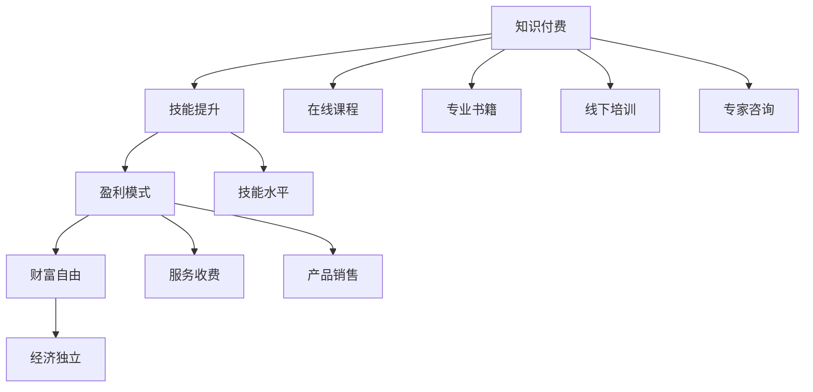

                 

关键词：知识付费、财富自由、程序员、盈利模式、技能提升

> 摘要：本文将探讨程序员如何通过知识付费这一途径，实现财富自由。文章将从核心概念、核心算法、数学模型、项目实践、实际应用场景等多个维度进行深入剖析，为程序员提供实用的方法和策略。

## 1. 背景介绍

在当今信息爆炸的时代，知识付费已成为一种重要的学习与收益模式。程序员作为信息技术领域的重要角色，他们的知识技能对于社会发展和个人成长都具有重要的意义。然而，如何将自身知识转化为实际收益，实现财富自由，是许多程序员面临的挑战。

知识付费，指的是通过付费获取有价值的信息或服务。对于程序员而言，知识付费不仅包括购买在线课程、阅读专业书籍，还包括参加线下培训、咨询专家等。本文将探讨如何通过知识付费，提高程序员的技能水平，进而实现财富自由。

## 2. 核心概念与联系

在探讨程序员如何通过知识付费实现财富自由之前，我们需要了解一些核心概念，如知识付费、技能提升、盈利模式等。以下是一个简化的 Mermaid 流程图，用于描述这些概念之间的关系。



### 2.1 知识付费

知识付费是一种以金钱换取知识和技能的交易模式。程序员可以通过购买在线课程、专业书籍、参加线下培训、咨询专家等方式，获取新的知识和技术。

### 2.2 技能提升

技能提升是指通过学习和实践，不断提高个人的专业能力和技术水平。对于程序员而言，技能提升是获得更高薪酬和更好职业发展的关键。

### 2.3 盈利模式

盈利模式是指企业或个人获取利润的途径。对于程序员而言，盈利模式包括服务收费和产品销售两种。服务收费是指通过提供技术咨询服务、编写代码等获得报酬；产品销售是指通过开发软件产品，进行销售获得利润。

### 2.4 财富自由

财富自由是指个人拥有足够的财富，可以不必为生计而工作。对于程序员而言，实现财富自由意味着可以专注于自己感兴趣的技术领域，或者享受生活，而不必担心经济压力。

## 3. 核心算法原理 & 具体操作步骤

### 3.1 算法原理概述

程序员通过知识付费实现财富自由的核心算法可以概括为以下几个步骤：

1. **技能定位**：明确自己在技术领域中的优势和特长。
2. **知识获取**：通过知识付费获取新的知识和技能。
3. **技能提升**：通过实践和总结，不断提高自身技能水平。
4. **盈利模式**：根据自身技能，选择合适的服务收费或产品销售模式。

### 3.2 算法步骤详解

1. **技能定位**：

   - 分析市场需求：了解哪些技能在市场上需求量大，薪酬高。
   - 自我评估：评估自己的技术水平和兴趣方向。

2. **知识获取**：

   - 在线课程：选择高质量的在线课程，系统学习新技术。
   - 专业书籍：阅读专业书籍，深入了解技术细节。
   - 线下培训：参加线下培训，与专家面对面交流。
   - 专家咨询：通过付费咨询，获取专业建议。

3. **技能提升**：

   - 实践项目：通过实际项目，提高技能水平。
   - 持续学习：不断更新知识，跟上技术发展。

4. **盈利模式**：

   - 服务收费：提供技术咨询服务，如代码审计、系统优化等。
   - 产品销售：开发软件产品，进行销售，如企业级应用、开源项目等。

### 3.3 算法优缺点

1. **优点**：

   - **高效**：通过知识付费，可以快速获取专业知识和技能。
   - **灵活**：可以根据自身兴趣和市场需求，选择不同的技能方向。
   - **可持续**：通过不断学习和实践，技能水平可以不断提高。

2. **缺点**：

   - **成本**：知识付费需要投入一定的资金。
   - **时间**：学习和实践需要投入大量时间。
   - **风险**：市场需求变化可能导致技能过时。

### 3.4 算法应用领域

程序员通过知识付费实现财富自由的应用领域非常广泛，包括但不限于：

- **软件开发**：通过知识付费，掌握最新的编程语言和技术，开发高质量的软件产品。
- **数据分析**：通过学习数据结构和算法，提高数据处理和分析能力。
- **人工智能**：通过学习机器学习和深度学习，进入人工智能领域。
- **网络安全**：通过学习网络安全知识，保护企业和个人信息安全。

## 4. 数学模型和公式 & 详细讲解 & 举例说明

### 4.1 数学模型构建

为了更好地理解程序员通过知识付费实现财富自由的过程，我们可以构建一个简单的数学模型。该模型包含以下几个变量：

- \( K \)：知识付费总额
- \( T \)：投入时间
- \( S \)：技能提升速度
- \( P \)：盈利能力

数学模型如下：

\[ 财富增长 = S \times T \times P - K \]

### 4.2 公式推导过程

1. **财富增长**：财富增长是指个人财富的增加，包括工资收入、投资收益等。

2. **技能提升速度**：技能提升速度是指个人技能水平提高的速度。它与投入时间、知识付费等因素有关。

3. **盈利能力**：盈利能力是指个人通过技能获得的收入能力。它与市场需求、个人技能水平等因素有关。

4. **知识付费总额**：知识付费总额是指个人在学习过程中投入的资金。

### 4.3 案例分析与讲解

假设程序员小明，他每年投入 10000 元进行知识付费，每天学习 8 小时，技能提升速度为每天提高 1%。他的盈利能力为每月增加 5000 元收入。那么，他的财富增长情况如下：

\[ 财富增长 = 1\% \times 8 \times 5000 - 10000 \]

\[ 财富增长 = 4000 - 10000 \]

\[ 财富增长 = -6000 \]

由于小明的投入超过了他的收入，所以他的财富增长为负值，这意味着他目前还没有实现财富自由。

然而，如果小明能够持续提高自己的技能水平，增加盈利能力，那么他的财富增长将逐渐转正，最终实现财富自由。

## 5. 项目实践：代码实例和详细解释说明

### 5.1 开发环境搭建

为了更好地实践程序员通过知识付费实现财富自由的过程，我们选择一个具体的编程项目：使用 Python 开发一个简单的博客系统。

1. **安装 Python**：在官方网站下载并安装 Python。
2. **安装依赖库**：使用 pip 工具安装 Flask、SQLAlchemy 等依赖库。

### 5.2 源代码详细实现

```python
from flask import Flask, render_template, request
from flask_sqlalchemy import SQLAlchemy

app = Flask(__name__)
app.config['SQLALCHEMY_DATABASE_URI'] = 'sqlite:///blog.db'
db = SQLAlchemy(app)

class Post(db.Model):
    id = db.Column(db.Integer, primary_key=True)
    title = db.Column(db.String(100))
    content = db.Column(db.Text)

@app.route('/')
def index():
    posts = Post.query.all()
    return render_template('index.html', posts=posts)

@app.route('/create', methods=['GET', 'POST'])
def create():
    if request.method == 'POST':
        title = request.form['title']
        content = request.form['content']
        new_post = Post(title=title, content=content)
        db.session.add(new_post)
        db.session.commit()
        return redirect('/')
    return render_template('create.html')

if __name__ == '__main__':
    db.create_all()
    app.run(debug=True)
```

### 5.3 代码解读与分析

上述代码是一个简单的博客系统，包含两个主要功能：展示文章列表和创建新文章。

1. **数据库设计**：使用 SQLAlchemy 创建一个 Post 类，用于存储文章标题和内容。
2. **路由配置**：定义两个路由，一个用于展示文章列表（/），另一个用于创建新文章（/create）。
3. **前端模板**：使用 Flask 的 render_template 方法，渲染 HTML 模板。

### 5.4 运行结果展示

运行代码后，访问本地服务器，可以看到博客系统的首页和创建文章页面。

## 6. 实际应用场景

程序员通过知识付费实现财富自由的实际应用场景包括：

- **软件开发**：通过学习新技术，开发高质量的软件产品，进行销售或出租。
- **技术咨询**：通过提供技术咨询服务，如代码审计、系统优化等，获得收入。
- **教育培训**：通过开设线上或线下课程，教授他人技术知识，获得收益。
- **开源项目**：通过开发开源项目，吸引赞助和支持，实现财富自由。

## 7. 工具和资源推荐

### 7.1 学习资源推荐

- **在线课程**：Coursera、Udemy、网易云课堂等平台，提供丰富的编程课程。
- **专业书籍**：《算法导论》、《深度学习》、《Python 编程：从入门到实践》等。
- **技术社区**：Stack Overflow、GitHub、CSDN 等，提供技术交流和学习资源。

### 7.2 开发工具推荐

- **集成开发环境**：Visual Studio Code、PyCharm、Eclipse 等。
- **版本控制**：Git、GitHub、GitLab 等。
- **数据库**：MySQL、PostgreSQL、MongoDB 等。

### 7.3 相关论文推荐

- **深度学习**：《深度学习：卷积神经网络》、《强化学习综述》等。
- **软件工程**：《敏捷软件开发》、《软件架构设计》等。
- **人工智能**：《人工智能：一种现代的方法》、《机器学习》等。

## 8. 总结：未来发展趋势与挑战

### 8.1 研究成果总结

通过本文的探讨，我们可以得出以下结论：

- 知识付费是程序员实现财富自由的重要途径。
- 技能提升和盈利模式是程序员实现财富自由的关键。
- 未来，随着技术的不断进步，程序员将面临更多的机遇和挑战。

### 8.2 未来发展趋势

1. **在线教育**：随着互联网技术的发展，在线教育将越来越普及，为程序员提供更多的学习机会。
2. **人工智能**：人工智能技术的快速发展，将推动程序员进入更广泛的应用领域。
3. **云计算**：云计算的普及，将改变程序员的编程方式和盈利模式。

### 8.3 面临的挑战

1. **技术更新速度**：技术更新速度加快，程序员需要不断学习，以保持竞争力。
2. **市场竞争**：随着程序员数量的增加，市场竞争将变得更加激烈。

### 8.4 研究展望

未来的研究可以关注以下几个方面：

- **自动化编程**：研究如何通过自动化工具，提高编程效率。
- **跨学科研究**：结合计算机科学、心理学、经济学等多学科知识，探索新的编程方法和模式。
- **可持续性**：研究如何实现程序员收入的可持续增长，以应对技术变革和市场波动。

## 9. 附录：常见问题与解答

### 9.1 问题 1

**问题**：知识付费是否值得？

**解答**：知识付费有其优点和缺点。优点包括高效获取知识、灵活选择学习内容等；缺点包括成本高、需要投入时间等。是否值得，取决于个人的需求和目标。

### 9.2 问题 2

**问题**：如何选择适合自己的知识付费产品？

**解答**：选择知识付费产品时，可以从以下几个方面进行考虑：

- **课程质量**：查看课程评价、讲师背景等。
- **课程内容**：确保课程内容与个人兴趣和职业发展相关。
- **学习方式**：选择适合自己学习习惯的课程。

### 9.3 问题 3

**问题**：如何平衡工作和学习？

**解答**：平衡工作和学习需要以下几点：

- **时间管理**：合理安排时间，确保工作和学习都有足够的时间。
- **目标明确**：明确自己的学习目标，有针对性地进行学习。
- **休息与调整**：适当休息，避免过度疲劳。

### 9.4 问题 4

**问题**：如何评估自己的技能水平？

**解答**：评估技能水平可以从以下几个方面进行：

- **项目经验**：回顾过去参与的项目，分析自己在项目中的贡献。
- **技术面试**：参加技术面试，了解自己在面试中的表现。
- **同行评价**：听取同事、朋友、导师等对自己技能水平的评价。

---

**作者：禅与计算机程序设计艺术 / Zen and the Art of Computer Programming** 

[文章末尾部分结束]

