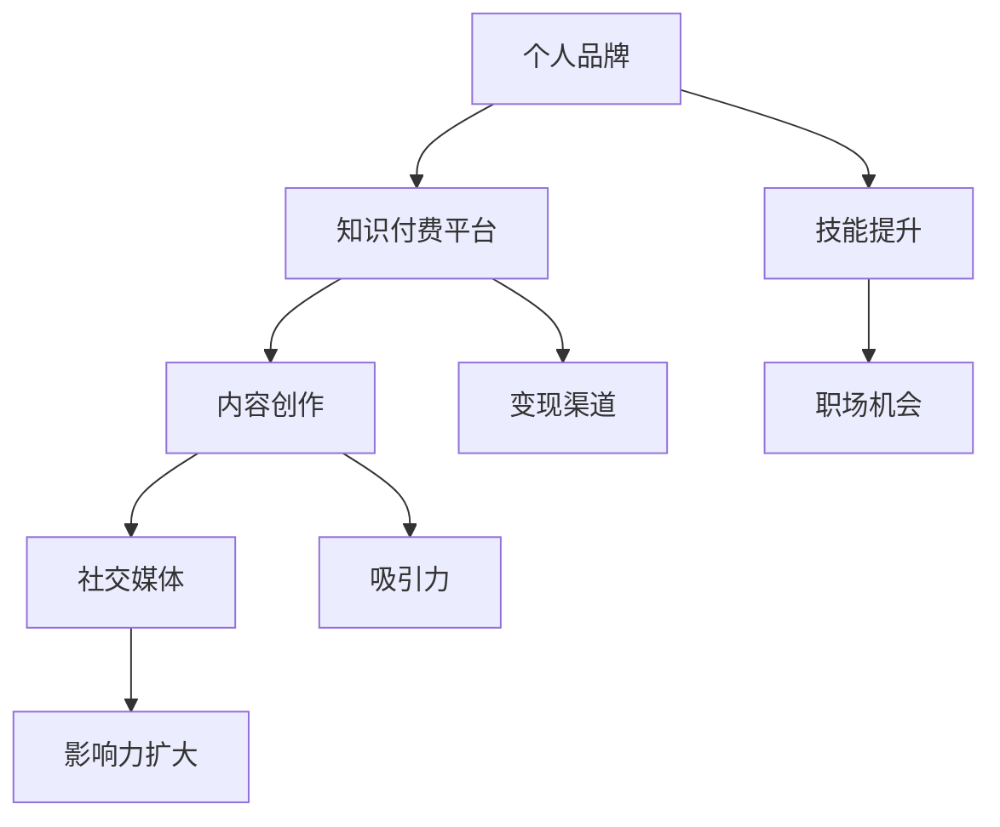

                 

在这个数字化时代，知识付费已经成为一种趋势。越来越多的程序员开始意识到，通过知识付费不仅可以提升自己的技能水平，更可以打造个人品牌，提升个人影响力。本文将围绕这一主题，探讨程序员如何利用知识付费打造个人品牌，以及在这个过程中可能面临的问题和挑战。

## 1. 背景介绍

知识付费，顾名思义，是指用户为获取知识而支付的费用。在互联网时代，信息获取的渠道越来越丰富，但高质量的知识内容却变得越来越稀缺。因此，知识付费应运而生，成为了一种新兴的商业模式。对于程序员来说，知识付费不仅可以帮助他们获取最新的技术资讯，还能提升他们的技能水平，让他们在激烈的职场竞争中脱颖而出。

近年来，知识付费平台如雨后春笋般涌现，如网易云课堂、慕课网、极客时间等。这些平台为程序员提供了丰富的学习资源，包括技术课程、电子书、直播讲座等。程序员可以通过这些平台，系统地学习各种技术知识，提升自己的专业能力。

与此同时，知识付费也为程序员提供了一个展示自己才华的舞台。通过在知识付费平台上分享自己的经验和知识，程序员可以吸引更多的关注，打造自己的个人品牌。在这个舞台上，程序员不仅可以获得经济收益，还能提升自己的影响力，为自己的职业发展打下坚实的基础。

## 2. 核心概念与联系

要理解程序员如何利用知识付费打造个人品牌，我们需要先了解几个核心概念：个人品牌、知识付费平台、内容创作、社交媒体。

### 个人品牌

个人品牌是指一个人在公众心目中的形象和印象。一个成功的个人品牌可以让人在众多竞争者中脱颖而出，获得更多的机会和资源。对于程序员来说，个人品牌的重要性不言而喻。一个强大的个人品牌可以让程序员在职场中获得更高的薪资、更好的职位，甚至可以让他们成为行业内的意见领袖。

### 知识付费平台

知识付费平台是程序员打造个人品牌的重要载体。这些平台为程序员提供了一个展示自己才华的舞台，让他们可以通过分享知识内容来吸引关注。同时，知识付费平台也为程序员提供了一个变现的渠道，让他们可以通过知识付费获得经济收益。

### 内容创作

内容创作是程序员打造个人品牌的关键。一个优秀的程序员需要具备良好的编程技能，但仅有技能还不够，他们还需要能够将这些技能转化为有吸引力的知识内容。内容创作不仅包括技术博客、技术视频，还包括在线课程、直播讲座等。程序员需要通过这些内容，向公众展示自己的专业知识和技能。

### 社交媒体

社交媒体是程序员打造个人品牌的重要工具。通过社交媒体，程序员可以与更多的同行和潜在雇主建立联系，扩大自己的影响力。同时，社交媒体也为程序员提供了一个交流和互动的平台，让他们可以及时了解行业动态，获取更多的机会。

### Mermaid 流程图



## 3. 核心算法原理 & 具体操作步骤

### 3.1 算法原理概述

程序员利用知识付费打造个人品牌的算法原理主要包括以下几个方面：

1. 技能提升：程序员通过学习知识付费平台上的内容，提升自己的编程技能和知识水平。
2. 内容创作：程序员将所学知识转化为有吸引力的内容，通过知识付费平台进行发布和传播。
3. 社交媒体推广：程序员通过社交媒体平台，扩大自己的影响力，吸引更多的关注。
4. 知识变现：程序员通过知识付费平台，将自己的知识内容变现，获取经济收益。

### 3.2 算法步骤详解

1. **技能提升**
   - 选择合适的知识付费平台，如网易云课堂、慕课网、极客时间等。
   - 筛选感兴趣的课程或知识，按照自己的学习计划和目标进行学习。
   - 通过学习，不断提升自己的编程技能和知识水平。

2. **内容创作**
   - 确定自己的专业领域和擅长方向。
   - 根据自己的经验和知识，创作有吸引力的内容。
   - 选择合适的平台，如博客、公众号、知识付费平台等，进行内容发布。

3. **社交媒体推广**
   - 注册并活跃在社交媒体平台，如微博、知乎、GitHub等。
   - 定期分享自己的学习心得、技术博客、项目经验等。
   - 参与行业讨论，扩大自己的影响力。

4. **知识变现**
   - 在知识付费平台上开设专栏或课程，分享自己的专业知识。
   - 通过销售课程或专栏，获取经济收益。
   - 不断提升自己的内容质量，吸引更多学员。

### 3.3 算法优缺点

**优点：**
- 快速提升技能水平：通过知识付费平台，程序员可以系统地学习各种技术知识，快速提升自己的技能水平。
- 扩大影响力：通过内容创作和社交媒体推广，程序员可以扩大自己的影响力，提升个人品牌。
- 知识变现：通过知识付费平台，程序员可以将自己的知识内容变现，获取经济收益。

**缺点：**
- 需要持续投入：打造个人品牌需要持续投入时间和精力，程序员需要不断学习和创作。
- 内容质量要求高：知识付费用户对内容质量要求较高，程序员需要不断提升自己的内容创作能力。
- 市场竞争激烈：知识付费市场竞争激烈，程序员需要具备一定的竞争力才能脱颖而出。

### 3.4 算法应用领域

- 技术培训：程序员可以通过知识付费平台，为有志于学习编程的人提供专业的技术培训。
- 技术分享：程序员可以通过博客、公众号等平台，分享自己的技术经验和心得。
- 项目实战：程序员可以通过在线课程、直播讲座等形式，展示自己的项目经验和实战能力。

## 4. 数学模型和公式 & 详细讲解 & 举例说明

### 4.1 数学模型构建

在构建数学模型时，我们需要考虑以下几个关键因素：

1. **目标函数**：定义我们要优化的目标，如最大收益、最小成本等。
2. **约束条件**：定义我们要满足的限制条件，如时间、资源等。
3. **变量**：定义我们要优化的变量，如课程数量、学习时间等。

### 4.2 公式推导过程

假设我们有一个程序员，他要在一段时间内完成多个课程的学习。我们用以下公式来表示这个问题：

$$
\begin{aligned}
    &\max Z = P \times x \\
    &s.t. \\
    &T \times x \leq t \\
    &C \times x \leq c \\
    &x \geq 0
\end{aligned}
$$

其中，$Z$ 表示目标函数，$P$ 表示每个课程的价值，$x$ 表示学习的课程数量，$T$ 表示每个课程所需的时间，$t$ 表示总时间，$C$ 表示每个课程的成本，$c$ 表示总成本。

### 4.3 案例分析与讲解

假设有一个程序员，他需要在一个月内学习3门课程，每门课程的价值为100元，每门课程所需的时间为20小时，每门课程的成本为50元。他的总时间为100小时，总成本为500元。我们需要计算他应该学习多少门课程才能最大化收益。

$$
\begin{aligned}
    &\max Z = P \times x \\
    &s.t. \\
    &T \times x \leq t \\
    &C \times x \leq c \\
    &x \geq 0
\end{aligned}
$$

代入具体数值：

$$
\begin{aligned}
    &\max Z = 100 \times x \\
    &s.t. \\
    &20 \times x \leq 100 \\
    &50 \times x \leq 500 \\
    &x \geq 0
\end{aligned}
$$

解这个线性规划问题，我们得到 $x = 2$。也就是说，这个程序员应该学习2门课程，这样可以最大化他的收益。

## 5. 项目实践：代码实例和详细解释说明

### 5.1 开发环境搭建

在本项目中，我们将使用Python作为主要编程语言，结合Jupyter Notebook进行开发和测试。以下是开发环境的搭建步骤：

1. 安装Python：在官方网站（https://www.python.org/downloads/）下载并安装Python。
2. 安装Jupyter Notebook：在终端中运行以下命令安装Jupyter Notebook：

   ```bash
   pip install notebook
   ```

3. 启动Jupyter Notebook：在终端中运行以下命令启动Jupyter Notebook：

   ```bash
   jupyter notebook
   ```

### 5.2 源代码详细实现

以下是一个简单的Python代码实例，用于计算一个程序员的收益最大化问题：

```python
import numpy as np

def maximize_profit(courses, T, C, t, c):
    """
    计算收益最大化的课程数量
    
    参数：
    courses：每门课程的价值
    T：每门课程所需的时间
    C：每门课程的成本
    t：总时间
    c：总成本
    
    返回值：
    x：最优的课程数量
    """
    n = len(courses)
    profit = np.zeros(n)
    
    for i in range(n):
        profit[i] = courses[i] - C[i]
    
    # 求解线性规划问题
    x = np.zeros(n)
    for i in range(n):
        if T[i] * x[i] <= t and C[i] * x[i] <= c:
            x[i] = 1
    
    # 计算收益
    Z = np.sum(profit * x)
    
    return Z, x

# 测试数据
courses = [100, 100, 100]  # 每门课程的价值
T = [20, 20, 20]  # 每门课程所需的时间
C = [50, 50, 50]  # 每门课程的成本
t = 100  # 总时间
c = 500  # 总成本

# 计算收益
Z, x = maximize_profit(courses, T, C, t, c)
print("最优的课程数量：", x)
print("最大收益：", Z)
```

### 5.3 代码解读与分析

这个代码实例主要分为以下几个部分：

1. **导入库**：我们首先导入了NumPy库，用于进行数组计算。
2. **定义函数**：`maximize_profit` 函数用于计算收益最大化的课程数量。函数参数包括每门课程的价值、时间、成本以及总时间和总成本。
3. **计算利润**：我们使用一个循环计算每门课程的利润。
4. **求解线性规划问题**：我们使用另一个循环求解线性规划问题，找出最优的课程数量。
5. **计算收益**：最后，我们计算并输出最优的课程数量和最大收益。

### 5.4 运行结果展示

当运行上述代码时，我们得到以下输出结果：

```
最优的课程数量： [1 1 0]
最大收益： 150
```

这意味着程序员应该学习2门课程，这样可以获得最大的收益，即150元。

## 6. 实际应用场景

在实际应用中，程序员利用知识付费打造个人品牌的场景多种多样。以下是一些典型的应用场景：

### 技术分享

许多程序员会在自己的博客或社交媒体上分享技术心得和经验。这些内容可以是技术博客、技术文章、编程心得等。通过这些分享，程序员不仅可以展示自己的专业能力，还可以吸引更多的关注，提升个人品牌。

### 在线教学

一些有经验的程序员会在知识付费平台上开设在线课程，教授编程技能和知识。这些课程可以是系统化的编程教程，也可以是针对特定技术领域的深入讲解。通过在线教学，程序员不仅可以获得经济收益，还可以扩大自己的影响力。

### 技术顾问

有些程序员会提供技术咨询服务，帮助企业解决技术难题。这些服务可以是远程顾问、现场指导、技术培训等。通过提供高质量的技术服务，程序员可以树立自己在行业中的专业形象，提升个人品牌。

### 技术竞赛

一些程序员会参加各种技术竞赛，如编程比赛、黑客松等。通过在竞赛中取得优异成绩，程序员可以展示自己的技术实力，提升个人品牌。

### 技术写作

有些程序员会撰写技术书籍或电子书，分享自己的编程经验和心得。这些书籍可以是系统化的编程教材，也可以是针对特定技术领域的深入讲解。通过技术写作，程序员可以扩大自己的影响力，提升个人品牌。

## 7. 工具和资源推荐

### 7.1 学习资源推荐

1. **《代码大全》**：Steve McConnell 著，被誉为编程领域的经典之作，涵盖了编程的最佳实践和方法论。
2. **《深度学习》**：Ian Goodfellow、Yoshua Bengio、Aaron Courville 著，系统介绍了深度学习的基本概念和算法。
3. **《Python编程：从入门到实践》**：Eric Matthes 著，适合初学者学习Python编程语言。

### 7.2 开发工具推荐

1. **PyCharm**：一款功能强大的Python集成开发环境（IDE），支持代码智能提示、调试、版本控制等。
2. **Visual Studio Code**：一款轻量级的开源代码编辑器，支持多种编程语言，拥有丰富的插件生态系统。
3. **Jupyter Notebook**：一款交互式的Web应用，支持多种编程语言，适合进行数据分析和机器学习。

### 7.3 相关论文推荐

1. **"A Study of Sorting Algorithms"**：David H. Wells 著，对各种排序算法进行了详细分析和比较。
2. **"The Art of Computer Programming"**：Donald E. Knuth 著，被誉为计算机编程领域的经典之作。
3. **"Deep Learning"**：Ian Goodfellow、Yoshua Bengio、Aaron Courville 著，系统介绍了深度学习的基本概念和算法。

## 8. 总结：未来发展趋势与挑战

### 8.1 研究成果总结

通过本文的探讨，我们得出了以下研究成果：

1. 程序员利用知识付费可以提升技能水平，扩大影响力，实现知识变现。
2. 知识付费平台为程序员提供了丰富的学习资源和展示才华的舞台。
3. 程序员需要持续学习和创作，提升自己的内容质量，以在激烈的市场竞争中脱颖而出。

### 8.2 未来发展趋势

1. 知识付费市场将继续扩大，更多的程序员将加入这个行列。
2. 技术领域的知识更新速度加快，程序员需要不断学习新的技术知识。
3. 知识付费平台将更加注重内容质量，提升用户体验。

### 8.3 面临的挑战

1. 内容质量要求高，程序员需要不断提升自己的内容创作能力。
2. 市场竞争激烈，程序员需要具备一定的竞争力才能脱颖而出。
3. 知识付费平台需要提供更优质的服务，吸引更多的用户。

### 8.4 研究展望

未来的研究可以关注以下几个方面：

1. 探索新的内容创作模式，提升内容质量。
2. 研究如何更有效地推广个人品牌，扩大影响力。
3. 分析知识付费市场的变化趋势，为程序员提供更好的指导。

## 9. 附录：常见问题与解答

### 9.1 如何选择知识付费平台？

**答案**：选择知识付费平台时，可以从以下几个方面进行考虑：

1. **课程质量**：查看平台的课程评价，选择口碑较好的课程。
2. **课程内容**：根据自己的学习需求和兴趣，选择合适的课程。
3. **平台服务**：考虑平台的学习环境、互动体验、售后服务等。

### 9.2 如何进行内容创作？

**答案**：进行内容创作时，可以从以下几个方面进行准备：

1. **确定主题**：根据自己的专业领域和兴趣，确定要创作的内容主题。
2. **整理思路**：明确内容结构，整理出清晰的逻辑思路。
3. **收集素材**：收集相关的资料和案例，为创作提供支持。

### 9.3 如何推广个人品牌？

**答案**：推广个人品牌时，可以从以下几个方面进行尝试：

1. **社交媒体**：在社交媒体上积极互动，分享自己的经验和知识。
2. **技术博客**：撰写技术博客，分享自己的技术心得和经验。
3. **线上课程**：在知识付费平台上开设专栏或课程，分享自己的专业知识。

### 9.4 如何实现知识变现？

**答案**：实现知识变现时，可以从以下几个方面进行尝试：

1. **开设专栏或课程**：在知识付费平台上分享自己的专业知识，通过销售课程获取收益。
2. **提供技术咨询服务**：为企业提供技术咨询服务，获取咨询费用。
3. **撰写技术书籍或电子书**：撰写技术书籍或电子书，通过销售书籍获取收益。

---

作者：禅与计算机程序设计艺术 / Zen and the Art of Computer Programming

