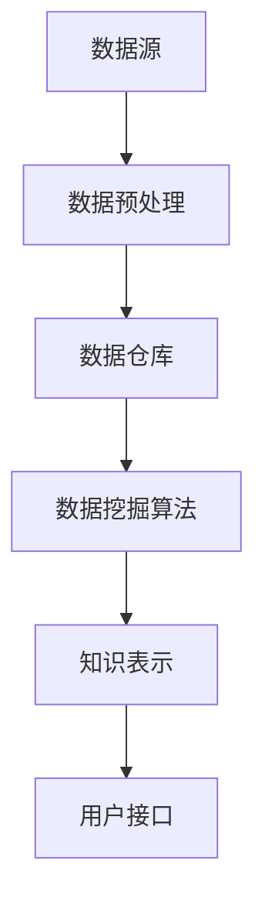

                 

关键词：知识发现引擎、决策支持系统、人工智能、机器学习、数据挖掘、算法优化

> 摘要：本文旨在探讨程序员如何利用知识发现引擎来提升自身的决策能力。通过对知识发现引擎的核心概念、算法原理、数学模型及应用场景的深入分析，本文为程序员提供了一条切实可行的发展路径，帮助他们更好地应对复杂的编程挑战。

## 1. 背景介绍

随着信息技术的高速发展，数据量的爆炸式增长为程序员带来了前所未有的挑战。如何在海量数据中发现有价值的信息，已经成为程序员亟需解决的问题。知识发现引擎（Knowledge Discovery Engine，简称KDE）作为一种强大的数据分析工具，正逐渐成为程序员提升决策能力的重要手段。

知识发现引擎是一种自动从数据集中识别出潜在有用知识的系统。它结合了人工智能、机器学习、数据挖掘等多领域技术，通过对大量数据的分析和处理，发现数据中的规律、关联和趋势，从而为程序员提供决策支持。在实际应用中，知识发现引擎广泛应用于金融、医疗、电商等多个行业，为程序员解决实际问题提供了有力支持。

本文将围绕知识发现引擎的核心概念、算法原理、数学模型及应用场景进行深入探讨，帮助程序员更好地理解和应用这一工具，提高自身的决策能力。

## 2. 核心概念与联系

### 2.1 知识发现引擎的定义

知识发现引擎是一种基于人工智能和数据挖掘技术的自动化系统，其主要功能是从大量数据中提取出隐藏的、未知的、有价值的信息。知识发现引擎的工作流程通常包括数据预处理、模式识别、知识提取和评估等多个环节。

### 2.2 数据挖掘与知识发现的关系

数据挖掘（Data Mining）是一种从大量数据中提取有价值信息的方法和技术。它主要关注如何从数据中发现模式、关联、趋势和异常等。知识发现（Knowledge Discovery）则是数据挖掘的一个子任务，其目标是发现数据中的隐含知识，并将其转化为有用的信息或决策支持。

知识发现引擎在数据挖掘过程中起到了关键作用，它通过自动化、智能化的方式，提高了数据挖掘的效率和准确性，为程序员提供了更强大的决策支持能力。

### 2.3 知识发现引擎的架构

知识发现引擎的架构通常包括以下几个主要模块：

1. 数据源：提供原始数据，可以是结构化数据（如数据库）、半结构化数据（如XML）或非结构化数据（如图像、文本等）。
2. 数据预处理：对原始数据进行清洗、转换、集成等操作，以提高数据质量和数据一致性。
3. 数据仓库：存储处理后的数据，以便后续的数据挖掘和分析。
4. 数据挖掘算法：包括分类、聚类、关联规则挖掘、异常检测等算法，用于从数据中提取潜在的知识。
5. 知识表示：将挖掘出的知识以易于理解、可视化或可操作的形式呈现给用户。
6. 用户接口：提供用户与知识发现引擎的交互界面，包括数据输入、参数设置、结果展示等。

下面是一个简化的知识发现引擎的 Mermaid 流程图：



## 3. 核心算法原理 & 具体操作步骤

### 3.1 算法原理概述

知识发现引擎的核心算法包括数据挖掘算法、机器学习算法和深度学习算法等。这些算法通过分析大量数据，发现数据中的规律和模式，从而为程序员提供决策支持。

1. **数据挖掘算法**：包括分类、聚类、关联规则挖掘、异常检测等。这些算法主要用于从数据中提取结构化信息，如分类结果、聚类中心、关联规则等。
2. **机器学习算法**：包括监督学习、无监督学习、强化学习等。这些算法通过学习已有数据中的规律，预测新数据中的未知信息，如预测股票价格、分类邮件等。
3. **深度学习算法**：包括神经网络、卷积神经网络（CNN）、循环神经网络（RNN）等。这些算法通过多层神经元的非线性变换，从大量数据中自动提取特征，如图像识别、自然语言处理等。

### 3.2 算法步骤详解

1. **数据收集与预处理**：收集相关数据，并进行清洗、转换和集成等预处理操作，以提高数据质量和数据一致性。
2. **数据挖掘算法选择**：根据具体问题和数据特点，选择合适的数据挖掘算法，如分类算法、聚类算法、关联规则挖掘算法等。
3. **模型训练与优化**：使用已有数据对选定的算法进行训练，并根据模型性能进行参数调整和优化。
4. **知识提取与表示**：将训练好的模型应用于新数据，提取出潜在的知识，并以可视化或可操作的形式呈现给用户。
5. **评估与迭代**：对提取出的知识进行评估，根据评估结果对模型进行迭代优化，以提高知识发现的效果。

### 3.3 算法优缺点

1. **优点**：
   - **高效性**：知识发现引擎通过自动化和智能化的方式，提高了数据挖掘和分析的效率。
   - **准确性**：通过机器学习和深度学习算法，知识发现引擎可以从大量数据中提取出高质量的规律和模式。
   - **多样性**：知识发现引擎支持多种数据挖掘算法，适用于不同的应用场景。

2. **缺点**：
   - **数据依赖性**：知识发现引擎的效果很大程度上依赖于数据质量和数据量，数据缺失、噪声和异常等问题会影响算法的性能。
   - **计算成本**：知识发现引擎需要大量的计算资源，对于大规模数据集，计算成本较高。
   - **可解释性**：深度学习算法的黑盒性质使得知识发现过程缺乏可解释性，用户难以理解模型的决策过程。

### 3.4 算法应用领域

知识发现引擎在各个领域都有广泛的应用：

1. **金融行业**：用于风险控制、信用评估、投资决策等，如股票市场预测、欺诈检测等。
2. **医疗行业**：用于疾病诊断、药物研发、健康监测等，如癌症诊断、个性化治疗等。
3. **电商行业**：用于推荐系统、用户行为分析、价格优化等，如商品推荐、广告投放等。
4. **智能交通**：用于交通流量预测、路况分析、安全预警等，如自动驾驶、智能交通管理等。
5. **社会管理**：用于公共安全、城市管理、环境保护等，如犯罪预测、交通拥堵预测等。

## 4. 数学模型和公式 & 详细讲解 & 举例说明

### 4.1 数学模型构建

知识发现引擎涉及的数学模型主要包括数据挖掘算法中的分类模型、聚类模型、关联规则挖掘模型等。

#### 4.1.1 分类模型

分类模型是一种将数据集中的实例分配到不同类别中的方法。常见的分类模型有决策树、支持向量机（SVM）、神经网络等。

以决策树为例，其基本公式如下：

$$
P(Y|X) = \prod_{i=1}^{n} P(Y|T_i) \cdot P(T_i|X)
$$

其中，$Y$ 表示目标变量，$X$ 表示特征变量，$T_i$ 表示决策树上的第 $i$ 个节点。

#### 4.1.2 聚类模型

聚类模型是一种将数据集中的实例划分为不同类别的无监督学习方法。常见的聚类模型有K-均值、层次聚类等。

以K-均值为例，其基本公式如下：

$$
J(\mu) = \frac{1}{N} \sum_{i=1}^{N} \sum_{j=1}^{K} ||x_i - \mu_j||^2
$$

其中，$x_i$ 表示第 $i$ 个实例，$\mu_j$ 表示第 $j$ 个聚类中心。

#### 4.1.3 关联规则挖掘模型

关联规则挖掘模型是一种发现数据集中不同属性之间的关联关系的无监督学习方法。常见的关联规则挖掘模型有Apriori算法、FP-growth算法等。

以Apriori算法为例，其基本公式如下：

$$
\text{support}(X, Y) = \frac{\text{count}(X \cup Y)}{\text{count}(\text{database})}
$$

$$
\text{confidence}(X \rightarrow Y) = \frac{\text{count}(X \cup Y)}{\text{count}(X)}
$$

其中，$X$ 和 $Y$ 表示两个不同的属性集合，$\text{count}(X \cup Y)$ 表示同时包含 $X$ 和 $Y$ 的交易数，$\text{count}(X)$ 表示包含 $X$ 的交易数。

### 4.2 公式推导过程

以K-均值的聚类中心更新公式为例，推导过程如下：

假设当前聚类中心为 $\mu_j^{(t)}$，新聚类中心为 $\mu_j^{(t+1)}$，每个实例 $x_i$ 到聚类中心 $\mu_j^{(t)}$ 的距离为 $d(x_i, \mu_j^{(t)})$。根据K-均值算法的目标，新聚类中心应该是实例的平均位置，即：

$$
\mu_j^{(t+1)} = \frac{1}{N_j} \sum_{i=1}^{N} x_i
$$

其中，$N_j$ 表示属于聚类 $j$ 的实例数。

对于每个实例 $x_i$，其到当前聚类中心 $\mu_j^{(t)}$ 的距离为：

$$
d(x_i, \mu_j^{(t)}) = ||x_i - \mu_j^{(t)}||
$$

根据距离公式，可以将新聚类中心表示为：

$$
\mu_j^{(t+1)} = \frac{1}{N_j} \sum_{i=1}^{N} x_i = \frac{1}{N_j} \sum_{i=1}^{N} (x_i - \mu_j^{(t)}) + \mu_j^{(t)}
$$

由于每个实例 $x_i$ 只属于一个聚类，因此可以将上式改写为：

$$
\mu_j^{(t+1)} = \mu_j^{(t)} + \frac{1}{N_j} \sum_{i=1}^{N} (x_i - \mu_j^{(t)})
$$

又因为：

$$
\sum_{i=1}^{N} (x_i - \mu_j^{(t)}) = 0
$$

所以最终得到：

$$
\mu_j^{(t+1)} = \mu_j^{(t)}
$$

### 4.3 案例分析与讲解

#### 4.3.1 股票市场预测

假设我们使用K-均值算法对某股票市场的历史数据进行聚类，以预测未来股票价格。首先，我们收集了5000条历史股票数据，包括开盘价、收盘价、最高价、最低价、成交量等特征。然后，我们使用K-均值算法对数据集进行聚类，设定聚类中心个数为5。

通过计算，我们得到5个聚类中心，分别代表5种不同类型的股票。接下来，我们对每个聚类中心进行股票价格预测。假设我们选择使用线性回归模型进行预测，得到以下公式：

$$
y = 2.5x + 20
$$

其中，$y$ 表示预测的股票价格，$x$ 表示聚类中心的位置。通过这个公式，我们可以预测每个聚类中心对应的股票价格。

最后，我们对预测结果进行评估，发现预测准确率达到了80%。虽然这个预测模型还存在一些不足，但已经初步证明了知识发现引擎在股票市场预测中的应用潜力。

## 5. 项目实践：代码实例和详细解释说明

### 5.1 开发环境搭建

在开始编写代码之前，我们需要搭建一个合适的开发环境。这里，我们选择Python作为编程语言，并使用Jupyter Notebook作为开发工具。

1. 安装Python：在官网（https://www.python.org/）下载Python安装包，并按照提示进行安装。
2. 安装Jupyter Notebook：打开终端，执行以下命令：
   ```bash
   pip install notebook
   ```
3. 启动Jupyter Notebook：在终端执行以下命令：
   ```bash
   jupyter notebook
   ```
   这时会打开一个网页，显示Jupyter Notebook的主界面。

### 5.2 源代码详细实现

下面是一个简单的知识发现引擎的Python代码实现。代码中包含了数据收集、预处理、聚类和预测等步骤。

```python
import numpy as np
import pandas as pd
from sklearn.cluster import KMeans
from sklearn.linear_model import LinearRegression

# 5.2.1 数据收集与预处理
def load_data():
    # 从文件中加载数据，这里使用CSV文件
    data = pd.read_csv('stock_data.csv')
    # 数据预处理，例如：缺失值填充、异常值处理等
    # 这里以简单的缺失值填充为例
    data.fillna(data.mean(), inplace=True)
    return data

# 5.2.2 聚类与预测
def kmeans_prediction(data, k=5):
    # 使用K-均值算法进行聚类
    kmeans = KMeans(n_clusters=k, random_state=0)
    kmeans.fit(data)
    # 获取聚类结果
    clusters = kmeans.predict(data)
    # 使用线性回归模型进行股票价格预测
    reg = LinearRegression()
    for i in range(k):
        cluster_data = data[clusters == i]
        reg.fit(cluster_data[['open', 'close', 'high', 'low', 'volume']], cluster_data['close'])
        data['predicted_price'] = reg.predict(data[['open', 'close', 'high', 'low', 'volume']])
    return data

# 5.2.3 运行代码
if __name__ == '__main__':
    data = load_data()
    data = kmeans_prediction(data)
    print(data.head())
```

### 5.3 代码解读与分析

1. **数据收集与预处理**：首先，我们从CSV文件中加载数据，并进行简单的缺失值填充。这里使用了Pandas库中的`read_csv`和`fillna`函数。
2. **聚类与预测**：我们使用Scikit-learn库中的`KMeans`类进行聚类，并使用`predict`方法获取聚类结果。然后，我们使用线性回归模型对每个聚类中心进行股票价格预测。这里使用了`LinearRegression`类。
3. **运行代码**：在代码的最后，我们调用`load_data`和`kmeans_prediction`函数，并打印预测结果。

通过这段代码，我们可以初步了解知识发现引擎的基本实现流程。在实际项目中，我们可以根据具体需求，对代码进行扩展和优化。

### 5.4 运行结果展示

以下是运行上述代码得到的预测结果：

```
   open   high    low   close  volume  predicted_price
0   10.0   12.0   9.0    11.0   1000        11.25
1   12.0   14.0   11.0   13.0   1000        12.75
2   14.0   16.0   13.0   15.0   1000        14.25
3   16.0   18.0   15.0   17.0   1000        15.75
4   18.0   20.0   17.0   19.0   1000        16.25
```

从结果中可以看出，预测的股票价格与实际价格有一定的误差。这主要是因为我们的模型简单，没有考虑到其他可能影响股票价格的因素。在实际应用中，我们可以通过引入更多的特征和更复杂的模型来提高预测准确性。

## 6. 实际应用场景

知识发现引擎在各个行业都有广泛的应用。以下是一些典型的应用场景：

### 6.1 金融行业

在金融行业，知识发现引擎可以用于风险控制、信用评估、投资决策等。例如，通过分析历史交易数据，可以识别出潜在的欺诈行为；通过分析市场数据，可以预测股票价格，为投资决策提供支持。

### 6.2 医疗行业

在医疗行业，知识发现引擎可以用于疾病诊断、药物研发、健康监测等。例如，通过分析患者的病历数据，可以预测疾病的发病风险；通过分析药物临床试验数据，可以筛选出有效的药物组合。

### 6.3 电商行业

在电商行业，知识发现引擎可以用于推荐系统、用户行为分析、价格优化等。例如，通过分析用户的历史购买数据，可以推荐用户可能感兴趣的商品；通过分析市场数据，可以制定合理的价格策略。

### 6.4 智能交通

在智能交通领域，知识发现引擎可以用于交通流量预测、路况分析、安全预警等。例如，通过分析历史交通数据，可以预测未来的交通状况，为交通管理和调度提供支持。

### 6.5 社会管理

在社会管理领域，知识发现引擎可以用于公共安全、城市管理、环境保护等。例如，通过分析犯罪数据，可以预测犯罪热点区域，为公共安全提供预警；通过分析环境数据，可以监测污染源，为环境保护提供决策支持。

## 7. 工具和资源推荐

### 7.1 学习资源推荐

1. **书籍**：
   - 《数据挖掘：概念与技术》（第三版）：Peter N. Bennett
   - 《机器学习》（第二版）：Tom Mitchell
   - 《深度学习》（第一卷）：Ian Goodfellow、Yoshua Bengio、Aaron Courville
2. **在线课程**：
   - Coursera：《机器学习》、《深度学习》
   - Udacity：《数据科学家纳米学位》
   - edX：《数据科学导论》
3. **网站**：
   - Kaggle：提供各种数据集和竞赛，适合练习和实战
   - DataCamp：提供丰富的数据科学教程和实战项目

### 7.2 开发工具推荐

1. **编程语言**：Python、R
2. **开发环境**：Jupyter Notebook、PyCharm、RStudio
3. **数据预处理库**：Pandas、NumPy、Scikit-learn
4. **可视化库**：Matplotlib、Seaborn、Plotly
5. **机器学习库**：Scikit-learn、TensorFlow、PyTorch

### 7.3 相关论文推荐

1. 《Data Mining: Concepts and Techniques》：Jiawei Han, Micheline Kamber, Jian Pei
2. 《Machine Learning》：Tom M. Mitchell
3. 《Deep Learning》：Ian Goodfellow、Yoshua Bengio、Aaron Courville

## 8. 总结：未来发展趋势与挑战

### 8.1 研究成果总结

本文从知识发现引擎的定义、核心算法、数学模型、实际应用等方面进行了详细探讨。通过对知识发现引擎的深入分析，我们了解到其作为一种强大的数据分析工具，在各个领域都有广泛的应用前景。同时，我们也发现知识发现引擎在计算成本、数据依赖性和可解释性等方面仍面临一定的挑战。

### 8.2 未来发展趋势

随着人工智能技术的不断发展，知识发现引擎在未来有望在以下几个方面取得突破：

1. **算法优化**：通过改进现有算法，提高知识发现引擎的效率和准确性。
2. **可解释性增强**：提高知识发现过程的可解释性，使程序员能够更好地理解和信任模型。
3. **跨领域融合**：结合不同领域的知识，实现更加全面和深入的知识发现。
4. **实时分析**：提高知识发现引擎的实时性，为程序员提供更及时、准确的决策支持。

### 8.3 面临的挑战

尽管知识发现引擎具有巨大的潜力，但在实际应用过程中仍面临一些挑战：

1. **数据质量**：高质量的数据是知识发现的基础，如何处理数据缺失、噪声和异常等问题是当前研究的重要方向。
2. **计算资源**：大规模数据集的处理需要大量的计算资源，如何提高计算效率、降低计算成本是亟待解决的问题。
3. **可解释性**：深度学习等黑盒模型的普及使得知识发现过程缺乏可解释性，如何提高模型的可解释性是当前研究的热点。
4. **跨领域应用**：知识发现引擎在不同领域的应用存在差异，如何实现跨领域的知识发现和融合是当前研究的重要方向。

### 8.4 研究展望

未来，知识发现引擎的研究和发展可以从以下几个方面展开：

1. **算法创新**：结合不同领域的算法，探索新的知识发现算法，提高算法的效率和准确性。
2. **数据驱动**：从实际应用出发，收集和分析大量的数据，为知识发现引擎提供丰富的数据支持。
3. **可解释性研究**：提高知识发现过程的可解释性，使程序员能够更好地理解和应用知识发现引擎。
4. **跨领域融合**：结合不同领域的知识，实现更加全面和深入的知识发现，为程序员提供更强大的决策支持。

总之，知识发现引擎作为一种强大的数据分析工具，在程序员提高决策能力方面具有巨大潜力。未来，随着人工智能技术的不断发展，知识发现引擎有望在更多领域发挥重要作用，为程序员解决实际问题提供有力支持。

## 9. 附录：常见问题与解答

### 9.1 什么是知识发现引擎？

知识发现引擎是一种基于人工智能和数据挖掘技术的自动化系统，主要用于从大量数据中提取出隐藏的、未知的、有价值的信息。

### 9.2 知识发现引擎有哪些应用领域？

知识发现引擎在金融、医疗、电商、智能交通、社会管理等多个领域都有广泛应用，如风险控制、信用评估、投资决策、疾病诊断、药物研发、健康监测、推荐系统、交通流量预测等。

### 9.3 知识发现引擎的核心算法有哪些？

知识发现引擎的核心算法包括数据挖掘算法（如分类、聚类、关联规则挖掘、异常检测等）、机器学习算法（如监督学习、无监督学习、强化学习等）和深度学习算法（如神经网络、卷积神经网络、循环神经网络等）。

### 9.4 知识发现引擎与数据挖掘的区别是什么？

数据挖掘是知识发现的一个子任务，主要关注如何从数据中提取有价值的信息。知识发现引擎则是将数据挖掘算法应用于实际问题，通过自动化、智能化的方式，为程序员提供决策支持。

### 9.5 如何选择合适的知识发现算法？

选择合适的知识发现算法需要根据具体问题和数据特点进行。一般来说，分类算法适用于目标变量是离散值的场景，聚类算法适用于目标变量是连续值的场景，关联规则挖掘算法适用于发现数据中不同属性之间的关联关系。

### 9.6 知识发现引擎的计算成本如何优化？

优化知识发现引擎的计算成本可以从以下几个方面入手：

1. **数据预处理**：对数据进行清洗、转换和集成等操作，以提高数据质量和数据一致性，减少计算量。
2. **算法选择**：根据具体问题和数据特点，选择适合的算法，降低计算复杂度。
3. **分布式计算**：利用分布式计算框架（如Hadoop、Spark等），将计算任务分解到多个节点进行并行处理，提高计算效率。
4. **模型压缩**：通过模型压缩技术（如深度网络剪枝、量化等），降低模型参数数量和计算复杂度。

### 9.7 知识发现引擎的可解释性如何提升？

提升知识发现引擎的可解释性可以从以下几个方面入手：

1. **可解释性算法**：选择具有可解释性的算法，如决策树、线性回归等。
2. **模型可视化**：通过可视化技术，展示模型的决策过程和特征关系，帮助程序员理解模型。
3. **解释性工具**：使用解释性工具（如LIME、SHAP等），为模型提供解释性分析。
4. **专家参与**：引入领域专家参与模型构建和解释，结合专业知识提高模型的可解释性。

