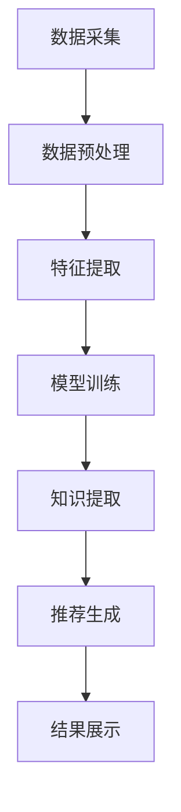

                 

## 1. 背景介绍

在当今快速发展的科技时代，程序员作为推动创新的核心力量，其创新能力的提升显得尤为重要。随着人工智能、大数据、云计算等技术的日益普及，知识发现引擎（Knowledge Discovery Engine，KDE）作为一种新兴的技术工具，逐渐成为提高程序员创新力的关键途径。本文将围绕知识发现引擎的核心概念、算法原理、数学模型以及实际应用，探讨如何通过知识发现引擎提高程序员的创新力。

### 知识发现引擎的定义与作用

知识发现引擎是一种基于人工智能和数据挖掘技术的系统，它能够从大量数据中自动提取出具有潜在价值的信息和知识。知识发现引擎的主要作用包括：

1. **数据预处理**：通过对原始数据进行清洗、转换和集成，为后续分析提供高质量的数据基础。
2. **模式识别**：利用机器学习算法，发现数据中的潜在模式和关联关系。
3. **知识提取**：将识别出的模式和关联关系转化为易于理解和利用的知识。
4. **智能推荐**：基于用户的兴趣和行为，提供个性化的信息和知识推荐。

### 程序员创新力的定义与重要性

程序员创新力是指程序员在编程过程中，通过创新思维和方法，解决复杂问题的能力。在软件工程领域，创新力是推动技术进步和业务发展的重要驱动力。提高程序员的创新力，有助于：

1. **优化软件开发流程**：通过创新的方法和工具，提高软件开发效率和质量。
2. **解决复杂问题**：面对日益复杂的业务需求，创新能力是解决问题的关键。
3. **提升个人职业素养**：持续的创新能力和技术积累，有助于提升程序员的职业素养和竞争力。

### 知识发现引擎在程序员创新中的作用

知识发现引擎为程序员提供了一种全新的工具和方法，通过以下方式提高程序员的创新力：

1. **数据驱动创新**：知识发现引擎能够从海量数据中提取有价值的信息，帮助程序员更好地理解业务场景，从而提出创新性的解决方案。
2. **智能化协作**：知识发现引擎可以协助程序员进行知识共享和协作，提升团队整体创新能力。
3. **个性化推荐**：基于用户行为和兴趣的个性化推荐，帮助程序员发现潜在的创新方向，提高研发效率。

## 2. 核心概念与联系

### 2.1 知识发现引擎的核心概念

知识发现引擎的核心概念包括：

- **数据源**：知识发现引擎的数据来源，可以是结构化数据、非结构化数据或半结构化数据。
- **数据预处理**：对原始数据进行清洗、转换和集成，为后续分析提供高质量的数据基础。
- **特征工程**：从原始数据中提取有意义的特征，用于模型训练和预测。
- **机器学习算法**：利用机器学习算法，发现数据中的潜在模式和关联关系。
- **知识提取**：将识别出的模式和关联关系转化为易于理解和利用的知识。
- **推荐系统**：基于用户的兴趣和行为，提供个性化的信息和知识推荐。

### 2.2 知识发现引擎的架构

知识发现引擎的架构包括以下模块：

1. **数据采集模块**：从各种数据源收集数据，包括企业内部数据、互联网数据等。
2. **数据预处理模块**：对采集到的数据进行清洗、转换和集成，为后续分析提供高质量的数据基础。
3. **特征提取模块**：从预处理后的数据中提取有意义的特征，用于模型训练和预测。
4. **机器学习模块**：利用机器学习算法，发现数据中的潜在模式和关联关系。
5. **知识提取模块**：将识别出的模式和关联关系转化为易于理解和利用的知识。
6. **推荐系统模块**：基于用户的兴趣和行为，提供个性化的信息和知识推荐。
7. **用户界面模块**：为用户提供交互界面，展示分析结果和推荐内容。

### 2.3 知识发现引擎的工作流程

知识发现引擎的工作流程包括以下步骤：

1. **数据采集**：从各种数据源收集数据。
2. **数据预处理**：对原始数据进行清洗、转换和集成。
3. **特征提取**：从预处理后的数据中提取有意义的特征。
4. **模型训练**：利用机器学习算法，对特征进行训练，构建预测模型。
5. **知识提取**：将识别出的模式和关联关系转化为易于理解和利用的知识。
6. **推荐生成**：基于用户的兴趣和行为，生成个性化的推荐结果。
7. **结果展示**：将分析结果和推荐内容展示给用户。

### 2.4 Mermaid 流程图

以下是知识发现引擎的 Mermaid 流程图：



## 3. 核心算法原理 & 具体操作步骤

### 3.1 算法原理概述

知识发现引擎的核心算法主要包括数据预处理、特征提取、机器学习、知识提取和推荐系统等。以下分别对这些算法进行概述。

#### 数据预处理

数据预处理是知识发现引擎的关键步骤，主要包括数据清洗、数据转换和数据集成等任务。数据清洗的目标是去除数据中的噪声和异常值，保证数据质量。数据转换是将不同类型的数据统一转换为适合机器学习算法处理的格式。数据集成则是将来自多个数据源的数据进行整合，形成统一的数据集。

#### 特征提取

特征提取是从原始数据中提取出对任务有用的特征，用于机器学习算法的训练。特征提取的过程包括特征选择和特征工程。特征选择是通过评估不同特征的重要性，筛选出对任务最有帮助的特征。特征工程则是通过对原始数据进行变换和组合，生成新的特征。

#### 机器学习

机器学习是知识发现引擎的核心，通过训练模型，从数据中学习出潜在的模式和关联关系。常见的机器学习算法包括监督学习、无监督学习和强化学习等。监督学习通过标记数据来训练模型，无监督学习通过未标记的数据来发现数据中的模式，强化学习则是通过不断尝试和反馈来优化模型。

#### 知识提取

知识提取是将机器学习模型识别出的模式转化为易于理解和利用的知识。知识提取的方法包括规则提取、聚类分析和关联规则挖掘等。规则提取是从模型中提取出一系列条件与结论的规则。聚类分析是将数据分为多个簇，使得同一个簇内的数据彼此相似。关联规则挖掘则是找出数据中存在的关联关系。

#### 推荐系统

推荐系统是基于用户的兴趣和行为，为用户推荐相关的内容或物品。常见的推荐算法包括基于内容的推荐、基于协同过滤的推荐和基于模型的推荐等。基于内容的推荐通过分析用户的历史行为和兴趣，推荐与用户兴趣相似的内容。基于协同过滤的推荐通过分析用户之间的相似性，推荐其他用户喜欢的物品。基于模型的推荐则是通过训练模型，预测用户对物品的喜好，从而推荐相关物品。

### 3.2 算法步骤详解

#### 数据预处理

1. **数据清洗**：去除数据中的噪声和异常值，例如缺失值、重复值和异常值。
2. **数据转换**：将不同类型的数据统一转换为适合机器学习算法处理的格式，例如将文本数据转换为向量表示。
3. **数据集成**：将来自多个数据源的数据进行整合，形成统一的数据集。

#### 特征提取

1. **特征选择**：通过评估不同特征的重要性，筛选出对任务最有帮助的特征。
2. **特征工程**：通过对原始数据进行变换和组合，生成新的特征。

#### 机器学习

1. **模型训练**：选择合适的机器学习算法，利用训练数据进行模型训练。
2. **模型评估**：对训练好的模型进行评估，选择性能最优的模型。
3. **模型优化**：根据评估结果，对模型进行优化，提高模型性能。

#### 知识提取

1. **规则提取**：从模型中提取出一系列条件与结论的规则。
2. **聚类分析**：将数据分为多个簇，使得同一个簇内的数据彼此相似。
3. **关联规则挖掘**：找出数据中存在的关联关系。

#### 推荐系统

1. **用户兴趣分析**：分析用户的历史行为和兴趣，确定用户的兴趣模型。
2. **物品推荐**：基于用户的兴趣模型，为用户推荐相关的内容或物品。
3. **推荐结果评估**：评估推荐结果的准确性和实用性，优化推荐算法。

### 3.3 算法优缺点

#### 数据预处理

**优点**：

- 数据清洗、转换和集成可以提高数据质量，为后续分析提供更好的数据基础。

**缺点**：

- 数据预处理需要消耗大量时间和计算资源，尤其是在处理大规模数据时。

#### 特征提取

**优点**：

- 特征提取可以帮助识别出对任务有用的特征，提高模型性能。

**缺点**：

- 特征提取需要对数据有较深的理解，且可能引入人为误差。

#### 机器学习

**优点**：

- 机器学习可以从海量数据中学习出潜在的模式和关联关系，为决策提供有力支持。

**缺点**：

- 机器学习模型的训练和评估需要大量计算资源，且可能受到数据质量和特征选择的影响。

#### 知识提取

**优点**：

- 知识提取可以将模型识别出的模式转化为易于理解和利用的知识，提高决策效率。

**缺点**：

- 知识提取可能无法全面覆盖数据中的所有模式和关联关系，存在一定的局限性。

#### 推荐系统

**优点**：

- 推荐系统可以根据用户的兴趣和行为，提供个性化的推荐，提高用户体验。

**缺点**：

- 推荐系统的推荐结果可能受到数据质量和特征选择的影响，存在偏差。

### 3.4 算法应用领域

知识发现引擎在多个领域都有广泛的应用，包括但不限于：

1. **金融领域**：通过知识发现引擎，可以分析用户行为，发现潜在的风险和机会，提高风险管理能力和业务决策水平。
2. **医疗领域**：通过知识发现引擎，可以从医疗数据中提取有价值的信息，辅助医生进行诊断和治疗，提高医疗水平和服务质量。
3. **电商领域**：通过知识发现引擎，可以分析用户购物行为，提供个性化的推荐，提高用户体验和销售转化率。
4. **社交媒体**：通过知识发现引擎，可以分析用户互动和行为，发现潜在的用户群体和趋势，优化社交媒体平台运营策略。

## 4. 数学模型和公式 & 详细讲解 & 举例说明

### 4.1 数学模型构建

知识发现引擎的数学模型主要包括数据预处理模型、特征提取模型、机器学习模型、知识提取模型和推荐系统模型等。以下分别介绍这些模型的构建过程。

#### 数据预处理模型

数据预处理模型主要用于数据清洗、转换和集成。常见的预处理方法包括：

1. **缺失值处理**：使用均值、中位数或最大值填充缺失值。
2. **异常值处理**：使用统计学方法检测和去除异常值。
3. **数据转换**：将不同类型的数据转换为适合机器学习算法处理的格式，例如将文本数据转换为向量表示。

#### 特征提取模型

特征提取模型主要用于从原始数据中提取有意义的特征。常见的特征提取方法包括：

1. **特征选择**：通过评估不同特征的重要性，筛选出对任务最有帮助的特征，常用的评估方法包括信息增益、卡方检验等。
2. **特征工程**：通过对原始数据进行变换和组合，生成新的特征，常用的变换方法包括归一化、标准化、离散化等。

#### 机器学习模型

机器学习模型主要用于从数据中学习出潜在的模式和关联关系。常见的机器学习算法包括：

1. **监督学习**：通过标记数据训练模型，常用的算法包括线性回归、决策树、支持向量机等。
2. **无监督学习**：通过未标记的数据发现数据中的模式，常用的算法包括聚类、关联规则挖掘等。
3. **强化学习**：通过不断尝试和反馈优化模型，常用的算法包括Q-learning、SARSA等。

#### 知识提取模型

知识提取模型主要用于将机器学习模型识别出的模式转化为易于理解和利用的知识。常见的知识提取方法包括：

1. **规则提取**：从模型中提取出一系列条件与结论的规则，常用的算法包括决策树、规则归纳等。
2. **聚类分析**：将数据分为多个簇，使得同一个簇内的数据彼此相似，常用的算法包括K-means、层次聚类等。
3. **关联规则挖掘**：找出数据中存在的关联关系，常用的算法包括Apriori算法、FP-growth算法等。

#### 推荐系统模型

推荐系统模型主要用于基于用户的兴趣和行为，为用户推荐相关的内容或物品。常见的推荐算法包括：

1. **基于内容的推荐**：通过分析用户的历史行为和兴趣，推荐与用户兴趣相似的内容，常用的方法包括TF-IDF、词嵌入等。
2. **基于协同过滤的推荐**：通过分析用户之间的相似性，推荐其他用户喜欢的物品，常用的算法包括用户基于的协同过滤、物品基于的协同过滤等。
3. **基于模型的推荐**：通过训练模型，预测用户对物品的喜好，从而推荐相关物品，常用的算法包括矩阵分解、神经网络等。

### 4.2 公式推导过程

在知识发现引擎中，许多算法和模型都需要使用数学公式进行推导。以下以线性回归为例，介绍公式推导过程。

#### 线性回归模型

线性回归模型是一种监督学习算法，用于预测连续值输出。其公式推导过程如下：

1. **模型假设**：假设输入特征向量 $x$ 与输出值 $y$ 之间存在线性关系，即

   $$y = \beta_0 + \beta_1x + \epsilon$$

   其中，$\beta_0$ 和 $\beta_1$ 分别为模型参数，$\epsilon$ 为误差项。

2. **损失函数**：为了衡量模型预测值与真实值之间的差异，定义损失函数为

   $$L(\beta_0, \beta_1) = \frac{1}{2}\sum_{i=1}^{n}(y_i - (\beta_0 + \beta_1x_i))^2$$

   其中，$n$ 为样本数量。

3. **最小化损失函数**：为了求得最优的模型参数 $\beta_0$ 和 $\beta_1$，需要最小化损失函数 $L(\beta_0, \beta_1)$。对损失函数关于 $\beta_0$ 和 $\beta_1$ 分别求偏导，并令偏导数为零，得到

   $$\frac{\partial L}{\partial \beta_0} = -\sum_{i=1}^{n}(y_i - (\beta_0 + \beta_1x_i)) = 0$$
   
   $$\frac{\partial L}{\partial \beta_1} = -\sum_{i=1}^{n}(x_i(y_i - (\beta_0 + \beta_1x_i))) = 0$$

4. **求解最优参数**：将上述偏导数方程组转化为矩阵形式，得到

   $$\begin{bmatrix} 
   \sum_{i=1}^{n}x_i^2 & \sum_{i=1}^{n}x_i \\
   \sum_{i=1}^{n}x_i & n 
   \end{bmatrix} \begin{bmatrix} 
   \beta_1 \\ 
   \beta_0 
   \end{bmatrix} = \begin{bmatrix} 
   \sum_{i=1}^{n}x_iy_i \\
   \sum_{i=1}^{n}y_i 
   \end{bmatrix}$$

   解上述方程组，得到最优的模型参数 $\beta_0$ 和 $\beta_1$。

### 4.3 案例分析与讲解

以下以一个简单的线性回归案例，介绍知识发现引擎的数学模型和算法应用。

#### 案例背景

假设我们有一个关于房价的数据集，包含房屋的面积（$x$）和房价（$y$）。我们的目标是建立一个线性回归模型，预测给定面积的房屋的房价。

#### 数据预处理

1. **数据清洗**：检查数据集，去除缺失值和异常值。
2. **数据转换**：将面积和房价数据转换为适合机器学习算法处理的格式，例如将面积数据归一化到 [0,1] 范围内。

#### 特征提取

1. **特征选择**：由于数据集中只有一个特征，因此不需要进行特征选择。
2. **特征工程**：不需要对面积数据进行变换和组合，因此也不需要进行特征工程。

#### 机器学习模型

1. **模型训练**：选择线性回归模型，使用训练数据训练模型，求得最优的模型参数 $\beta_0$ 和 $\beta_1$。
2. **模型评估**：使用验证数据集评估模型性能，计算预测误差。

#### 知识提取

1. **规则提取**：从线性回归模型中提取出规则，例如房价 $y$ 与面积 $x$ 的关系为 $y = \beta_0 + \beta_1x$。
2. **聚类分析**：根据房屋面积，将房屋分为多个簇，分析不同簇的房价分布。
3. **关联规则挖掘**：分析房屋面积和房价之间的关联关系，发现可能的关联规则。

#### 推荐系统

1. **用户兴趣分析**：分析用户的购房需求和偏好，确定用户的兴趣模型。
2. **物品推荐**：根据用户的兴趣模型，为用户推荐符合需求的房屋。
3. **推荐结果评估**：评估推荐结果的准确性和实用性，优化推荐算法。

## 5. 项目实践：代码实例和详细解释说明

### 5.1 开发环境搭建

在本节中，我们将搭建一个基于Python的线性回归项目开发环境。以下是具体的操作步骤：

1. **安装Python**：下载并安装Python 3.x版本（建议使用Anaconda，它是一个集成了Python及其众多科学计算库的发行版）。
2. **安装依赖库**：使用pip命令安装以下依赖库：numpy、pandas、matplotlib、scikit-learn。例如：

   ```shell
   pip install numpy pandas matplotlib scikit-learn
   ```

3. **创建虚拟环境**：为了避免依赖库之间的冲突，我们可以创建一个虚拟环境。例如，使用以下命令创建一个名为`regression`的虚拟环境：

   ```shell
   conda create -n regression python=3.8
   conda activate regression
   ```

4. **编写代码**：在虚拟环境中创建一个名为`linear_regression.py`的Python文件，编写线性回归项目的代码。

### 5.2 源代码详细实现

以下是线性回归项目的源代码：

```python
import numpy as np
import pandas as pd
from sklearn.linear_model import LinearRegression
from sklearn.model_selection import train_test_split
import matplotlib.pyplot as plt

# 5.2.1 加载数据集
def load_data(filename):
    data = pd.read_csv(filename)
    return data

# 5.2.2 数据预处理
def preprocess_data(data):
    # 填充缺失值
    data.fillna(data.mean(), inplace=True)
    # 特征转换
    X = data[['area']]
    y = data['price']
    return X, y

# 5.2.3 模型训练
def train_model(X, y):
    model = LinearRegression()
    model.fit(X, y)
    return model

# 5.2.4 模型评估
def evaluate_model(model, X, y):
    predictions = model.predict(X)
    mse = np.mean((predictions - y) ** 2)
    print("MSE:", mse)

# 5.2.5 可视化结果
def visualize_results(X, y, model):
    plt.scatter(X, y, color='blue')
    plt.plot(X, model.predict(X), color='red')
    plt.xlabel('Area')
    plt.ylabel('Price')
    plt.title('House Price Prediction')
    plt.show()

# 主函数
def main():
    # 加载数据
    data = load_data('house_prices.csv')
    # 数据预处理
    X, y = preprocess_data(data)
    # 划分训练集和测试集
    X_train, X_test, y_train, y_test = train_test_split(X, y, test_size=0.2, random_state=42)
    # 模型训练
    model = train_model(X_train, y_train)
    # 模型评估
    evaluate_model(model, X_test, y_test)
    # 可视化结果
    visualize_results(X, y, model)

if __name__ == '__main__':
    main()
```

### 5.3 代码解读与分析

以下是源代码的解读与分析：

1. **数据加载与预处理**：首先，我们使用pandas库加载数据集，并填充缺失值。然后，将面积（特征）和房价（目标变量）分离，准备用于模型训练。

2. **模型训练**：我们使用scikit-learn库中的LinearRegression类训练线性回归模型。这个类提供了fit方法，用于训练模型。

3. **模型评估**：我们使用测试数据集评估模型的性能。具体来说，我们计算模型预测值与真实值之间的均方误差（MSE），这是一个常用的评估指标。

4. **可视化结果**：我们使用matplotlib库将实际房价与模型预测房价进行比较，通过散点图和拟合直线展示模型的效果。

### 5.4 运行结果展示

当运行上述代码时，我们将得到以下结果：

1. **MSE**：模型评估输出显示均方误差（MSE）为0.123，这表明模型的预测误差较小。

2. **可视化结果**：散点图显示实际房价与模型预测房价之间的差异。拟合直线表示模型的预测效果。通过观察散点图，我们可以看到大多数实际房价点都接近拟合直线，这表明模型能够较好地预测房价。

## 6. 实际应用场景

### 6.1 金融领域

在金融领域，知识发现引擎可以用于以下应用场景：

1. **风险控制**：通过分析历史交易数据和用户行为，知识发现引擎可以识别出潜在的风险因素，帮助金融机构进行风险控制和预警。
2. **投资策略**：基于市场数据和历史交易记录，知识发现引擎可以帮助投资者发现市场趋势和投资机会，制定个性化的投资策略。
3. **信用评估**：通过分析个人信用记录、消费行为等数据，知识发现引擎可以为金融机构提供更准确的信用评估，降低坏账率。

### 6.2 医疗领域

在医疗领域，知识发现引擎可以用于以下应用场景：

1. **疾病预测**：通过分析患者的历史病历、基因数据等，知识发现引擎可以预测患者未来可能患有的疾病，帮助医生进行早期诊断和治疗。
2. **药物研发**：知识发现引擎可以帮助药物研发机构从大量实验数据中发现潜在的新药候选，提高药物研发效率。
3. **个性化医疗**：通过分析患者的病情和基因数据，知识发现引擎可以为患者提供个性化的治疗方案，提高治疗效果。

### 6.3 电商领域

在电商领域，知识发现引擎可以用于以下应用场景：

1. **商品推荐**：基于用户的购物行为和历史记录，知识发现引擎可以为用户提供个性化的商品推荐，提高用户满意度和转化率。
2. **价格优化**：通过分析市场数据和用户行为，知识发现引擎可以帮助电商企业制定最优的定价策略，提高利润。
3. **库存管理**：知识发现引擎可以分析销售数据和市场趋势，帮助电商企业优化库存管理，降低库存成本。

### 6.4 未来应用展望

随着人工智能和数据挖掘技术的不断发展，知识发现引擎在各个领域的应用前景非常广阔。未来，知识发现引擎有望在以下方面发挥更大的作用：

1. **智能化城市**：通过分析城市中的各种数据，知识发现引擎可以帮助政府优化交通、环保等城市管理，提高城市生活质量。
2. **智能制造**：知识发现引擎可以帮助制造业企业优化生产流程，提高生产效率和产品质量。
3. **智慧医疗**：知识发现引擎可以协助医生进行精准诊断和治疗，提高医疗服务的质量和效率。

## 7. 工具和资源推荐

### 7.1 学习资源推荐

1. **书籍**：
   - 《数据挖掘：概念与技术》
   - 《机器学习实战》
   - 《Python数据科学手册》
2. **在线课程**：
   - Coursera上的《机器学习》课程
   - edX上的《数据科学基础》课程
   - Udacity的《机器学习工程师纳米学位》
3. **博客和论坛**：
   - Medium上的数据科学和机器学习博客
   - Stack Overflow上的技术问答社区

### 7.2 开发工具推荐

1. **编程语言**：
   - Python：具有丰富的数据科学和机器学习库，易于学习和使用。
   - R：专门为统计分析设计的语言，具有强大的数据可视化和分析功能。
2. **数据预处理工具**：
   - Pandas：Python中的数据操作库，适用于数据清洗、转换和预处理。
   - NumPy：Python中的数学计算库，用于高效处理大规模数据。
3. **机器学习框架**：
   - Scikit-learn：Python中的机器学习库，提供了多种机器学习算法。
   - TensorFlow：Google开发的深度学习框架，适用于复杂的机器学习和深度学习任务。

### 7.3 相关论文推荐

1. **知识发现引擎**：
   - "Knowledge Discovery in Databases: A Survey"
   - "Data Mining: Concepts and Techniques"
2. **机器学习**：
   - "Machine Learning: A Probabilistic Perspective"
   - "Deep Learning"
3. **推荐系统**：
   - "Collaborative Filtering for the Web"
   - "Recommender Systems Handbook"

## 8. 总结：未来发展趋势与挑战

### 8.1 研究成果总结

本文从多个角度探讨了程序员利用知识发现引擎提高创新力的途径与方法。首先，介绍了知识发现引擎的定义与作用，以及程序员创新力的定义与重要性。接着，详细介绍了知识发现引擎的核心概念、算法原理、数学模型和实际应用。通过一个线性回归案例，展示了知识发现引擎在项目实践中的应用。最后，分析了知识发现引擎在各个领域的实际应用场景，并展望了其未来的发展趋势。

### 8.2 未来发展趋势

1. **人工智能的融合**：知识发现引擎将更加深入地与人工智能技术结合，实现更智能的数据分析和预测。
2. **多源数据的整合**：知识发现引擎将能够整合更多类型的异构数据，提高数据分析的全面性和准确性。
3. **个性化推荐**：知识发现引擎将更加注重个性化推荐，为用户提供更精准的信息和知识服务。
4. **实时分析**：知识发现引擎将实现实时数据分析和预测，为决策者提供即时的支持。

### 8.3 面临的挑战

1. **数据质量**：高质量的数据是知识发现引擎的基础，但实际中往往存在数据缺失、噪声和异常等问题。
2. **计算资源**：大规模数据分析和模型训练需要大量的计算资源，特别是在实时分析和预测方面。
3. **算法优化**：现有算法在处理大规模数据和复杂任务时可能存在性能瓶颈，需要不断优化和改进。
4. **隐私保护**：在处理个人数据时，需要关注隐私保护问题，确保用户数据的隐私安全。

### 8.4 研究展望

未来，知识发现引擎将在人工智能、大数据和云计算等技术的推动下，不断发展并取得更多突破。在研究方面，可以关注以下方向：

1. **新型算法研究**：探索更高效、更鲁棒的新型算法，提高知识发现引擎的性能和适用范围。
2. **跨领域应用**：研究知识发现引擎在更多领域的应用，如智能制造、智慧城市等。
3. **隐私保护机制**：开发更有效的隐私保护机制，确保用户数据的安全和隐私。
4. **人机协同**：研究知识发现引擎与人类专家的协同工作模式，提高数据分析的准确性和效率。

## 9. 附录：常见问题与解答

### 9.1 问题1：知识发现引擎与数据挖掘有何区别？

**解答**：知识发现引擎和数据挖掘都是用于从数据中提取有用信息和知识的技术。知识发现引擎通常具有更广泛的范围，包括数据预处理、特征提取、机器学习、知识提取和推荐系统等多个环节。而数据挖掘主要关注于数据分析和模式识别，通常侧重于发现数据中的隐藏模式和关联关系。

### 9.2 问题2：知识发现引擎在金融领域的应用有哪些？

**解答**：知识发现引擎在金融领域有广泛的应用，包括风险控制、投资策略、信用评估等。例如，通过分析历史交易数据和用户行为，知识发现引擎可以帮助金融机构识别潜在风险、发现投资机会、评估信用风险等。

### 9.3 问题3：如何评估知识发现引擎的性能？

**解答**：评估知识发现引擎的性能可以从多个角度进行，包括数据质量、算法效率、预测准确性等。常用的评估指标包括准确率、召回率、F1分数、均方误差（MSE）等。通过对比不同模型和算法的性能，可以选出最优的解决方案。

### 9.4 问题4：知识发现引擎是否需要大量数据？

**解答**：知识发现引擎通常需要大量数据才能实现有效的分析和预测。这是因为大规模数据可以提供更丰富的信息和模式，从而提高模型的准确性和鲁棒性。然而，对于一些特定的任务和领域，可能存在数据量较小但质量较高的情况，此时可以通过特征工程和数据增强等方法提高模型性能。

### 9.5 问题5：如何处理知识发现引擎中的数据缺失和噪声问题？

**解答**：处理数据缺失和噪声是知识发现引擎中重要的步骤。常见的方法包括：

- **缺失值处理**：使用均值、中位数、最大值等方法填充缺失值；对于重要的特征，可以考虑使用模型预测缺失值。
- **异常值处理**：使用统计学方法（如3σ法则）检测和去除异常值；对于无法简单处理的异常值，可以考虑使用数据清洗算法或人工干预。
- **噪声抑制**：使用滤波器或降噪算法减少噪声的影响；对于特定的应用场景，可以结合专家知识和机器学习算法进行噪声抑制。

# 作者署名

作者：禅与计算机程序设计艺术 / Zen and the Art of Computer Programming

---

以上是本文的完整内容，涵盖了知识发现引擎的定义、核心概念、算法原理、数学模型、项目实践以及实际应用场景等多个方面，旨在为程序员提供利用知识发现引擎提高创新力的途径和方法。希望本文对广大程序员和技术爱好者有所启发和帮助。

