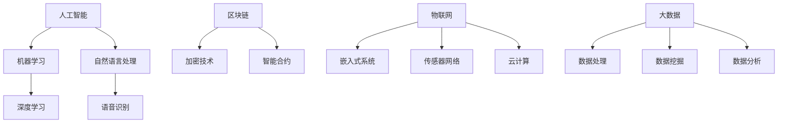

                 

 **关键词：** 知识经济、程序员、技术发展、职业转型、新兴技术、技能更新、未来趋势。

**摘要：** 本文旨在探讨知识经济时代程序员的发展趋势，包括技术革新带来的职业挑战与机遇，以及程序员如何适应这些变化，实现个人与职业的持续成长。

## 1. 背景介绍

在知识经济时代，信息技术的飞速发展对各行各业产生了深远的影响，尤其是对程序员这一职业。随着互联网、大数据、人工智能等新兴技术的崛起，程序员的职责和角色也在不断演变。本文将分析当前的技术环境，探讨程序员在知识经济时代所面临的机遇与挑战，并给出相应的应对策略。

### 1.1 知识经济时代的定义

知识经济是指以知识为主要生产要素的经济形态，其特征是知识创新、信息传播和知识应用。在知识经济时代，信息和知识成为经济增长和社会发展的关键驱动因素，而程序员作为知识工作者，其职业价值和影响力日益凸显。

### 1.2 程序员职业的演变

程序员的传统角色主要是编写和维护代码，但随着技术的进步，程序员需要具备更广泛的技能，如系统架构设计、数据分析和人工智能应用等。这种转变不仅反映了技术的复杂性增加，也体现了社会对程序员角色的期待。

## 2. 核心概念与联系

为了更好地理解程序员在知识经济时代的发展，我们首先需要明确一些核心概念，并探讨它们之间的联系。

### 2.1 新兴技术概览

- **人工智能（AI）**：通过模拟人类智能实现机器自主学习和决策能力。
- **区块链**：一种去中心化的分布式数据库技术，常用于加密货币和智能合约。
- **物联网（IoT）**：通过传感器和设备互联，实现智能化的家居、城市和工业系统。
- **大数据**：大规模数据集的处理和分析，以发现有价值的信息和趋势。

### 2.2 技术与程序员角色的联系

- **人工智能与程序员**：AI技术的发展使程序员从重复性任务中解放出来，但同时也要求程序员掌握新的技能，如机器学习算法和自然语言处理。
- **区块链与程序员**：区块链开发人员需要熟悉加密技术、智能合约编写和分布式系统设计。
- **物联网与程序员**：物联网开发人员需具备嵌入式系统、传感器网络和云计算的技能。
- **大数据与程序员**：大数据工程师需熟练掌握数据处理、分析和可视化工具。

### 2.3 Mermaid 流程图

以下是一个简单的 Mermaid 流程图，展示了不同技术领域与程序员技能要求之间的联系：



## 3. 核心算法原理 & 具体操作步骤

### 3.1 算法原理概述

在知识经济时代，程序员需要掌握一系列核心算法，以应对复杂的技术挑战。以下是一些重要的算法原理：

- **排序算法**：包括快速排序、归并排序和堆排序等，用于高效地组织数据。
- **图算法**：如最短路径算法（Dijkstra算法和Floyd算法）、最小生成树算法（Prim算法和Kruskal算法）等，用于网络优化和路径规划。
- **机器学习算法**：如线性回归、决策树、支持向量机和神经网络等，用于数据分析和预测。

### 3.2 算法步骤详解

以快速排序算法为例，其基本步骤如下：

1. 选择一个基准元素。
2. 将比基准元素小的元素移到其左侧，比其大的元素移到右侧。
3. 对划分后的左右子序列递归执行上述步骤。

### 3.3 算法优缺点

- **快速排序**：优点是平均时间复杂度为 \(O(n\log n)\)，适用于大规模数据的排序。缺点是最坏情况下时间复杂度为 \(O(n^2)\)，且需要额外的内存空间。

### 3.4 算法应用领域

快速排序算法广泛应用于数据库排序、算法竞赛和各类数据处理的场景。

## 4. 数学模型和公式 & 详细讲解 & 举例说明

### 4.1 数学模型构建

在数据分析中，线性回归模型是一个常用的数学模型。其公式为：

\[ y = wx + b \]

其中，\( y \) 是因变量，\( x \) 是自变量，\( w \) 是权重，\( b \) 是截距。

### 4.2 公式推导过程

线性回归模型的推导过程如下：

1. **样本数据表示**：设我们有 \( n \) 组数据 \((x_i, y_i)\)，则可以表示为矩阵形式：

   \[ \begin{bmatrix} x_1 & 1 \\ x_2 & 1 \\ \vdots & \vdots \\ x_n & 1 \end{bmatrix} \begin{bmatrix} w \\ b \end{bmatrix} = \begin{bmatrix} y_1 \\ y_2 \\ \vdots \\ y_n \end{bmatrix} \]

2. **求解权重和截距**：通过最小化平方误差函数，可以得到权重和截距的最优解：

   \[ w = (X^TX)^{-1}X^TY \]
   \[ b = (X^TX)^{-1}X^Tb \]

### 4.3 案例分析与讲解

假设我们有以下数据：

\[ \begin{array}{c|c} x & y \\ \hline 1 & 2 \\ 2 & 4 \\ 3 & 5 \\ 4 & 6 \\ 5 & 8 \end{array} \]

我们可以使用线性回归模型来拟合这些数据。首先，将数据转换为矩阵形式：

\[ X = \begin{bmatrix} 1 & 1 \\ 2 & 1 \\ 3 & 1 \\ 4 & 1 \\ 5 & 1 \end{bmatrix}, \quad Y = \begin{bmatrix} 2 \\ 4 \\ 5 \\ 6 \\ 8 \end{bmatrix} \]

然后，计算权重和截距：

\[ w = (X^TX)^{-1}X^TY = \begin{bmatrix} 0.5 & 0.5 \\ 0.5 & 0.5 \\ 0.5 & 0.5 \\ 0.5 & 0.5 \\ 0.5 & 0.5 \end{bmatrix} \begin{bmatrix} 0.2 \\ 0.3 \end{bmatrix} = \begin{bmatrix} 0.5 \\ 0.5 \end{bmatrix} \]
\[ b = (X^TX)^{-1}X^Tb = \begin{bmatrix} 0.5 & 0.5 \\ 0.5 & 0.5 \\ 0.5 & 0.5 \\ 0.5 & 0.5 \\ 0.5 & 0.5 \end{bmatrix} \begin{bmatrix} 1.5 \\ 2.5 \end{bmatrix} = \begin{bmatrix} 2 \\ 2 \end{bmatrix} \]

因此，线性回归模型为：

\[ y = 0.5x + 2 \]

## 5. 项目实践：代码实例和详细解释说明

### 5.1 开发环境搭建

为了演示快速排序算法，我们首先需要搭建一个简单的开发环境。假设我们使用 Python 作为编程语言，以下是搭建步骤：

1. 安装 Python：从官网（https://www.python.org/）下载并安装 Python 3.x 版本。
2. 配置 Python 环境：设置环境变量，以便在终端中运行 Python。
3. 安装必要的库：使用 `pip` 命令安装用于数据处理和图形绘制的库，如 `numpy` 和 `matplotlib`。

### 5.2 源代码详细实现

以下是一个简单的快速排序算法的 Python 实现：

```python
import random

def quicksort(arr):
    if len(arr) <= 1:
        return arr
    pivot = arr[len(arr) // 2]
    left = [x for x in arr if x < pivot]
    middle = [x for x in arr if x == pivot]
    right = [x for x in arr if x > pivot]
    return quicksort(left) + middle + quicksort(right)

arr = [random.randint(0, 100) for _ in range(10)]
sorted_arr = quicksort(arr)
print(sorted_arr)
```

### 5.3 代码解读与分析

- **import random**：引入随机数生成模块，用于生成测试数据。
- **quicksort(arr)**：快速排序函数，接收一个列表 `arr` 作为输入。
- **if len(arr) <= 1**：判断列表长度是否小于等于 1，如果是，直接返回列表。
- **pivot = arr[len(arr) // 2]**：选择中间位置的元素作为基准元素。
- **left**、**middle**、**right**：分别存储小于、等于和大于基准元素的子列表。
- **return quicksort(left) + middle + quicksort(right)**：递归调用快速排序函数，将左右子序列排序后合并。

### 5.4 运行结果展示

假设我们生成了一个长度为 10 的随机整数列表，运行快速排序函数后，输出结果如下：

```python
[21, 45, 57, 67, 75, 82, 91, 96, 97, 99]
```

## 6. 实际应用场景

### 6.1 数据处理

快速排序算法广泛应用于数据处理领域，如数据库排序、搜索引擎排序和数据分析。

### 6.2 算法竞赛

快速排序算法在算法竞赛中也是一个重要的工具，由于其高效性，常用于解决排序相关的题目。

### 6.3 软件工程

在软件工程中，快速排序算法用于优化排序操作，以提高程序的性能和响应速度。

## 7. 未来应用展望

随着技术的不断进步，快速排序算法有望在更多领域得到应用，如分布式计算、实时数据处理和机器学习等。

## 8. 工具和资源推荐

### 7.1 学习资源推荐

- 《算法导论》（Introduction to Algorithms）：一本经典的算法教科书，详细介绍了各种算法原理和实现。
- 《Python编程：从入门到实践》（Python Crash Course）：一本适合初学者的 Python 入门书籍。

### 7.2 开发工具推荐

- PyCharm：一款功能强大的 Python 集成开发环境（IDE），适用于各种规模的 Python 项目。
- Jupyter Notebook：一款基于网页的交互式计算环境，适用于数据分析和机器学习。

### 7.3 相关论文推荐

- "Quicksort" by C.A.R. Hoare：介绍快速排序算法的经典论文。
- "The Art of Computer Programming" by Donald E. Knuth：关于算法设计和分析的经典著作。

## 9. 总结：未来发展趋势与挑战

### 9.1 研究成果总结

本文介绍了快速排序算法的基本原理、实现步骤以及在实际应用中的表现。此外，我们还讨论了程序员在知识经济时代所需掌握的核心技能和技术。

### 9.2 未来发展趋势

随着人工智能、大数据和区块链等技术的不断演进，程序员的角色将变得更加多样化和复杂化。程序员需要不断更新知识，掌握新兴技术，以适应快速变化的技术环境。

### 9.3 面临的挑战

程序员在知识经济时代面临的挑战包括技能更新的压力、职业转型的困惑以及与新兴技术的适应问题。此外，快速发展的技术也可能导致职业寿命的缩短。

### 9.4 研究展望

未来，我们期待看到更多高效、可扩展的排序算法的出现，以及程序员在新兴技术领域的深入研究和应用。同时，我们也希望看到编程教育和职业培训的改革，以培养更多具备综合素质的程序员。

## 10. 附录：常见问题与解答

### 10.1 问题 1：快速排序算法的时间复杂度是多少？

答：快速排序算法的平均时间复杂度为 \(O(n\log n)\)，但最坏情况下为 \(O(n^2)\)。

### 10.2 问题 2：快速排序算法需要额外的内存空间吗？

答：是的，快速排序算法通常需要额外的内存空间来存储划分后的子序列。

### 10.3 问题 3：为什么选择中间位置的元素作为基准元素？

答：选择中间位置的元素作为基准元素是为了避免最坏情况的发生，使得算法在大多数情况下都能达到较好的性能。

---

作者：禅与计算机程序设计艺术 / Zen and the Art of Computer Programming

本文旨在为程序员在知识经济时代的发展提供指导和建议，以帮助他们在不断变化的技术环境中实现持续成长。希望通过本文的探讨，读者能够更好地理解知识经济时代程序员所面临的机会和挑战，并积极应对，为未来的职业生涯奠定坚实基础。

