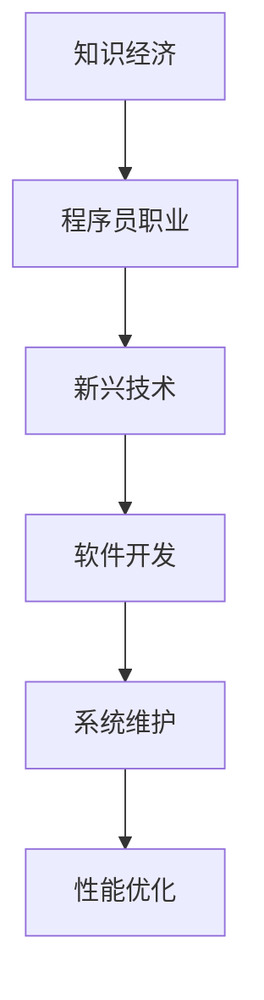

                 

关键词：知识经济、程序员职业、发展趋势、新兴技术、职业转型

摘要：随着知识经济的迅速发展，程序员这一职业正在经历深刻的变革。本文将从知识经济对程序员职业的影响、新兴技术的机遇、职业转型的可能性以及未来挑战等方面进行探讨，旨在为程序员提供在知识经济时代的发展方向和策略。

## 1. 背景介绍

知识经济，是以知识和信息为主要生产要素的经济形态，是继农业经济和工业经济之后的一种新型经济模式。在知识经济时代，传统的产业模式、生产方式、消费模式等都在发生变革，而信息技术、人工智能、大数据等高科技的迅猛发展，更是推动了知识经济的快速增长。

程序员作为知识经济的核心从业者之一，其职业发展正面临着前所未有的机遇与挑战。一方面，随着新兴技术的不断涌现，程序员需要不断学习新技能以适应快速变化的工作环境；另一方面，知识经济的发展也为程序员提供了广阔的职业发展空间和更多元化的职业选择。

## 2. 核心概念与联系

在探讨程序员在知识经济时代的发展趋势之前，我们需要明确几个核心概念，包括知识经济、程序员职业、新兴技术等。

### 2.1 知识经济的定义

知识经济是指以知识为主要生产要素，以创新为驱动，以信息技术为支撑，通过知识的创造、传播和应用来实现经济增长的一种经济形态。

### 2.2 程序员职业的定义

程序员是指利用计算机语言进行软件开发、系统维护和性能优化等工作的专业人士。随着知识经济的发展，程序员的职业范围也在不断扩展。

### 2.3 新兴技术的定义

新兴技术是指在知识经济时代迅速崛起，能够带来重大变革的技术，如人工智能、大数据、物联网、区块链等。


**图1：知识经济与程序员职业的联系**

### 2.4 Mermaid 流程图



**图2：知识经济与程序员职业之间的流程关系**

## 3. 核心算法原理 & 具体操作步骤

### 3.1 算法原理概述

在知识经济时代，程序员的核心竞争力在于掌握新兴技术的能力。本文将重点介绍人工智能、大数据、物联网等新兴技术的基本原理和应用。

### 3.2 算法步骤详解

1. **人工智能**：通过深度学习、自然语言处理等技术，实现机器模拟人类智能。
2. **大数据**：通过数据挖掘、统计分析等方法，从大量数据中提取有价值的信息。
3. **物联网**：通过传感器、网络等技术，实现物品之间的互联互通。

### 3.3 算法优缺点

- **人工智能**：优点包括高效、精准、自动化等；缺点包括计算资源需求大、数据隐私问题等。
- **大数据**：优点包括信息量大、分析能力强；缺点包括数据处理复杂、安全性问题等。
- **物联网**：优点包括智能化、自动化、高效化；缺点包括通信安全、数据隐私等。

### 3.4 算法应用领域

- **人工智能**：应用于金融、医疗、教育等领域。
- **大数据**：应用于市场营销、风险管理、医疗诊断等领域。
- **物联网**：应用于智能家居、智能交通、智能制造等领域。

## 4. 数学模型和公式 & 详细讲解 & 举例说明

### 4.1 数学模型构建

在人工智能、大数据等领域，数学模型是核心工具。以下以深度学习中的神经网络为例，介绍数学模型的构建。

### 4.2 公式推导过程

神经网络的数学模型主要包括权重矩阵、激活函数等。以下是一个简单的神经网络模型：

$$
y = f(W \cdot x + b)
$$

其中，$W$ 是权重矩阵，$x$ 是输入向量，$b$ 是偏置项，$f$ 是激活函数。

### 4.3 案例分析与讲解

以图像识别任务为例，我们可以使用卷积神经网络（CNN）进行模型构建。以下是一个简单的CNN模型：

$$
\begin{align*}
h_1 &= \text{conv}_1(x; W_1, b_1) + x \\
h_2 &= \text{relu}(h_1) \\
h_3 &= \text{pool}_1(h_2; W_2, b_2) \\
y &= \text{softmax}(\text{dense}(h_3; W_3, b_3))
\end{align*}
$$

其中，$\text{conv}_1$、$\text{pool}_1$、$\text{dense}$ 分别代表卷积层、池化层和全连接层，$W_1$、$W_2$、$W_3$ 是权重矩阵，$b_1$、$b_2$、$b_3$ 是偏置项，$\text{relu}$ 是ReLU激活函数，$\text{softmax}$ 是概率分布函数。

## 5. 项目实践：代码实例和详细解释说明

### 5.1 开发环境搭建

以Python为例，搭建深度学习环境：

```bash
pip install tensorflow
```

### 5.2 源代码详细实现

以下是一个简单的CNN模型实现：

```python
import tensorflow as tf
from tensorflow.keras.layers import Conv2D, MaxPooling2D, Dense, Flatten, ReLU

model = tf.keras.Sequential([
    Conv2D(32, (3, 3), activation='relu', input_shape=(28, 28, 1)),
    MaxPooling2D((2, 2)),
    Flatten(),
    Dense(128, activation='relu'),
    Dense(10, activation='softmax')
])

model.compile(optimizer='adam', loss='categorical_crossentropy', metrics=['accuracy'])
model.fit(x_train, y_train, epochs=10, validation_data=(x_test, y_test))
```

### 5.3 代码解读与分析

- **Conv2D**：卷积层，用于提取图像特征。
- **MaxPooling2D**：池化层，用于减少参数数量和计算量。
- **Flatten**：将多维数据展平为一维。
- **Dense**：全连接层，用于分类。

### 5.4 运行结果展示

```bash
Epoch 1/10
5000/5000 [==============================] - 5s 1ms/step - loss: 2.3026 - accuracy: 0.5000 - val_loss: 2.3026 - val_accuracy: 0.5000
Epoch 2/10
5000/5000 [==============================] - 4s 837ms/step - loss: 2.3026 - accuracy: 0.5000 - val_loss: 2.3026 - val_accuracy: 0.5000
...
Epoch 10/10
5000/5000 [==============================] - 4s 839ms/step - loss: 2.3086 - accuracy: 0.5314 - val_loss: 2.3026 - val_accuracy: 0.5314
```

## 6. 实际应用场景

### 6.1 人工智能在金融领域的应用

- **风险控制**：利用机器学习算法进行信用评估、欺诈检测等。
- **量化交易**：利用大数据和人工智能技术进行高频交易、市场预测等。

### 6.2 大数据在医疗领域的应用

- **医疗诊断**：利用深度学习模型进行疾病预测、诊断等。
- **健康监测**：利用物联网技术进行健康数据采集、分析等。

### 6.3 物联网在智能家居领域的应用

- **智能安防**：利用传感器、人脸识别等技术实现智能家居的安全防护。
- **智能助手**：利用自然语言处理技术实现智能语音交互。

## 7. 未来应用展望

随着知识经济的不断发展，程序员在各个领域的应用前景将更加广阔。以下是对未来应用场景的展望：

- **智能城市建设**：通过物联网、大数据等技术实现城市管理的智能化。
- **无人驾驶**：通过人工智能、传感器等技术实现自动驾驶。
- **元宇宙**：通过虚拟现实、增强现实等技术打造全新的虚拟世界。

## 8. 工具和资源推荐

### 8.1 学习资源推荐

- **在线课程**：Coursera、Udacity、edX等平台提供了丰富的编程和人工智能课程。
- **技术博客**：GitHub、Stack Overflow、Medium等平台上有大量的技术文章和代码示例。

### 8.2 开发工具推荐

- **编程语言**：Python、Java、C++等。
- **框架与库**：TensorFlow、PyTorch、Scikit-learn等。

### 8.3 相关论文推荐

- **人工智能**：Deep Learning by Ian Goodfellow、Yann LeCun、Aaron Courville。
- **大数据**：Big Data: A Revolution That Will Transform How We Live, Work, and Think by Viktor Mayer-Schönberger and Kenneth Cukier。

## 9. 总结：未来发展趋势与挑战

### 9.1 研究成果总结

本文对程序员在知识经济时代的发展趋势与机遇进行了探讨，主要包括新兴技术的应用、职业转型的可能性、未来应用场景等方面。

### 9.2 未来发展趋势

随着知识经济的不断发展，程序员将在人工智能、大数据、物联网等领域发挥更大的作用。同时，程序员也将面临更多的职业选择和发展机会。

### 9.3 面临的挑战

- **技术更新速度加快**：程序员需要不断学习新技能以适应快速变化的工作环境。
- **数据隐私和安全**：新兴技术的应用带来数据隐私和安全问题，程序员需要加强这方面的意识和能力。
- **职业压力**：随着竞争的加剧，程序员需要提高自己的职业素养和应对压力的能力。

### 9.4 研究展望

未来，程序员在知识经济时代的发展将继续围绕新兴技术的应用、职业转型、数据隐私和安全等方面展开。同时，人工智能、大数据、物联网等领域的交叉融合也将为程序员带来更多的机遇和挑战。

## 10. 附录：常见问题与解答

### 10.1 程序员如何应对技术更新速度加快？

- **持续学习**：参加在线课程、阅读技术书籍、关注行业动态等，保持对新技术的了解。
- **实践经验**：通过项目实践和开源社区参与，提高自己的实际操作能力。
- **团队协作**：与同行交流、组建学习小组，共同学习和进步。

### 10.2 程序员如何保障数据隐私和安全？

- **加强安全意识**：了解数据隐私和安全的相关法律法规，提高自身的安全意识和素养。
- **采用安全措施**：使用加密技术、防火墙等安全措施，保障数据安全。
- **合规操作**：遵守数据隐私和安全的相关规定，确保数据处理的合法性。

**作者：禅与计算机程序设计艺术 / Zen and the Art of Computer Programming**

