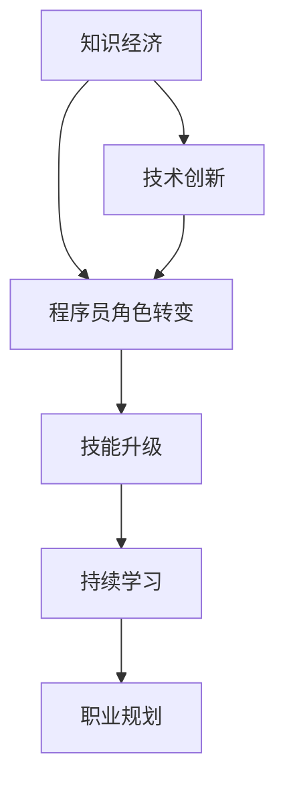

                 

关键词：知识经济、职业转型、程序员、技能升级、持续学习

> 摘要：本文探讨了知识经济时代下，程序员面临职业转型的必然性和关键路径。文章首先回顾了知识经济的背景和发展，随后深入分析了程序员在知识经济中的角色转变，提出了技能升级和持续学习的策略，最后展望了未来程序员职业的发展趋势与挑战。

## 1. 背景介绍

知识经济作为21世纪全球经济的重要特征，已经深刻地影响着各行业的商业模式和组织形态。与传统经济模式相比，知识经济更依赖于信息和知识的创造、传播和应用。在这个时代背景下，程序员的角色和职责也在不断演变。过去，程序员主要是编写和维护代码，而现在他们需要具备更广泛的技能，包括系统设计、架构构建、数据分析、人工智能等。

随着技术的快速进步和市场竞争的加剧，程序员面临着前所未有的职业挑战。为了在知识经济时代保持竞争力，程序员需要不断地学习和适应新技术，实现职业转型和技能升级。本文将围绕这一主题，探讨程序员在知识经济时代的职业转型路径。

## 2. 核心概念与联系

在探讨程序员的职业转型之前，我们需要理解一些核心概念，包括知识经济、技能升级、持续学习和职业规划。

### 2.1 知识经济

知识经济是指以知识为核心资源的经济活动。与传统经济不同，知识经济依赖于信息的创造、传播和应用。在知识经济中，知识和信息是生产、分配和消费的重要资源。知识经济强调创新、创意和智力资本的重要性。

### 2.2 技能升级

技能升级是指个人在职业生涯中通过学习新技能和知识，提升自身能力和竞争力。在知识经济时代，技能的更新速度非常快，程序员需要不断地学习新技术，以适应不断变化的市场需求。

### 2.3 持续学习

持续学习是指个人在职业生涯中持续获取新知识、技能和经验的过程。在知识经济时代，持续学习已成为个人发展和职业成功的关键因素。

### 2.4 职业规划

职业规划是指个人根据自身兴趣、能力和市场需求，制定职业生涯目标和路径的过程。在知识经济时代，有效的职业规划有助于程序员在职业生涯中实现持续发展。

下面是一个用Mermaid绘制的流程图，展示了这些核心概念之间的联系。



## 3. 核心算法原理 & 具体操作步骤

### 3.1 算法原理概述

在程序员职业转型的过程中，持续学习和技能升级是两个核心环节。持续学习是一个迭代过程，包括以下几个步骤：

1. **需求分析**：确定学习目标和需求。
2. **资源整合**：寻找合适的学习资源和工具。
3. **知识获取**：通过阅读、在线课程、实战项目等方式获取新知识。
4. **实践应用**：将新知识应用于实际工作中，验证和巩固学习成果。
5. **反馈调整**：根据反馈结果调整学习策略和目标。

### 3.2 算法步骤详解

1. **需求分析**：
   - **自我评估**：了解自身技能水平和职业规划目标。
   - **市场调研**：研究行业趋势和市场需求，确定需要学习的技能。

2. **资源整合**：
   - **在线课程**：选择优质的在线课程平台，如Coursera、edX等。
   - **书籍资料**：阅读经典书籍和最新的技术文献。
   - **技术社区**：参与技术论坛和社群，与同行交流经验。

3. **知识获取**：
   - **基础理论学习**：系统学习编程语言、数据结构与算法、操作系统等基础知识。
   - **前沿技术探索**：关注最新技术动态，如人工智能、大数据、区块链等。

4. **实践应用**：
   - **实战项目**：通过实际项目锻炼技能，提高解决实际问题的能力。
   - **开源贡献**：参与开源项目，提升团队合作能力和项目经验。

5. **反馈调整**：
   - **自我反思**：定期回顾学习过程，评估学习效果。
   - **目标调整**：根据反馈结果调整学习目标和策略。

### 3.3 算法优缺点

**优点**：
- 提高个人竞争力：通过持续学习和技能升级，程序员能够适应市场需求，提高职业竞争力。
- 促进职业发展：技能的不断提升有助于职业晋升和薪资增长。
- 保持行业领先：紧跟技术发展趋势，使程序员在行业竞争中保持领先地位。

**缺点**：
- 学习成本高：持续学习需要投入大量时间和精力。
- 技能更新的压力：新技术层出不穷，程序员需要不断适应和学习。
- 职业路径的不确定性：技术变革可能导致某些技能过时，程序员需要不断调整职业规划。

### 3.4 算法应用领域

持续学习和技能升级的应用领域非常广泛，包括但不限于：

- **软件开发**：程序员需要不断学习新的编程语言、框架和工具，以提高开发效率。
- **数据分析**：随着大数据技术的发展，程序员需要掌握数据分析和挖掘技能。
- **人工智能**：人工智能领域的快速进步要求程序员具备机器学习、深度学习等相关知识。
- **系统架构**：大型系统的架构设计需要程序员具备系统规划和优化的能力。

## 4. 数学模型和公式 & 详细讲解 & 举例说明

### 4.1 数学模型构建

在技能升级的过程中，我们可以构建一个简单的数学模型来描述学习过程。这个模型包括以下几个变量：

- \( L \)：学习量
- \( K \)：知识量
- \( P \)：职业竞争力
- \( T \)：时间

模型的基本假设是：学习量与知识量呈线性关系，知识量与职业竞争力呈线性关系，职业竞争力与时间呈线性关系。因此，我们可以构建以下数学模型：

\[ L \propto K \]
\[ K \propto P \]
\[ P \propto T \]

通过上述关系，我们可以得到：

\[ L \propto KT \]

### 4.2 公式推导过程

为了推导出上述公式，我们可以从以下几个步骤进行：

1. **定义学习量**：学习量可以定义为个人在一段时间内学习的新知识量。
2. **定义知识量**：知识量可以定义为个人掌握的知识总量。
3. **定义职业竞争力**：职业竞争力可以定义为个人在市场上的就业能力和薪资水平。
4. **定义时间**：时间可以定义为个人在技能升级过程中所花费的时间。

通过这些定义，我们可以得到以下关系：

- 学习量 \( L \) 与知识量 \( K \) 的关系：
  \[ L = f(K) \]
  其中，\( f \) 是一个函数，表示学习量与知识量之间的比例关系。

- 知识量 \( K \) 与职业竞争力 \( P \) 的关系：
  \[ K = g(P) \]
  其中，\( g \) 是一个函数，表示知识量与职业竞争力之间的比例关系。

- 职业竞争力 \( P \) 与时间 \( T \) 的关系：
  \[ P = h(T) \]
  其中，\( h \) 是一个函数，表示职业竞争力与时间之间的比例关系。

通过组合这些关系，我们可以得到：

\[ L = f(g(h(T))) \]

由于 \( f \)、\( g \) 和 \( h \) 都是比例关系，我们可以将其简化为：

\[ L \propto KT \]

### 4.3 案例分析与讲解

假设一个程序员在一年内完成了100小时的学习，他的知识量增加了50%，职业竞争力提高了20%。我们可以通过上述模型来计算他在一年后的学习量和职业竞争力。

1. **初始状态**：
   - 学习量 \( L_0 \) = 100小时
   - 知识量 \( K_0 \) = 初始知识量
   - 职业竞争力 \( P_0 \) = 初始竞争力
   - 时间 \( T_0 \) = 0年

2. **一年后**：
   - 知识量增加了50%，即 \( K_1 = 1.5K_0 \)
   - 职业竞争力提高了20%，即 \( P_1 = 1.2P_0 \)
   - 时间 \( T_1 \) = 1年

根据模型 \( L \propto KT \)，我们可以计算一年后的学习量：

\[ L_1 = L_0 \cdot \frac{K_1}{K_0} \cdot \frac{T_1}{T_0} \]

代入已知值：

\[ L_1 = 100 \cdot \frac{1.5K_0}{K_0} \cdot \frac{1}{0} \]

由于时间 \( T_0 \) = 0，分母为0，这意味着学习量在一年后保持不变，即 \( L_1 = L_0 \)。

同样，我们可以计算一年后的职业竞争力：

\[ P_1 = P_0 \cdot \frac{T_1}{T_0} \]

代入已知值：

\[ P_1 = P_0 \cdot \frac{1}{0} \]

同样，由于时间 \( T_0 \) = 0，分母为0，这意味着职业竞争力在一年后保持不变，即 \( P_1 = P_0 \)。

这个例子表明，在初始状态下，学习量和职业竞争力并不发生改变。然而，在实际情况下，随着时间的推移，学习量和职业竞争力会逐渐提升，这与模型的假设略有不同。

### 4.4 模型的局限性

上述模型是一个简化的数学模型，它假设学习量、知识量和职业竞争力之间存在线性关系。然而，在实际情况下，这种关系可能是非线性的。例如，一个程序员在开始学习时可能会取得显著进步，但随着时间的推移，进步的速度可能会减缓。

此外，模型没有考虑到个人差异、学习效率、工作环境等因素。在实际应用中，程序员需要根据自身情况调整学习策略，以实现最佳的学习效果。

### 4.5 实际应用中的改进

为了使模型更符合实际情况，我们可以引入以下改进：

- **学习效率**：引入学习效率参数，表示个人在相同时间内学习的效率。
- **学习强度**：引入学习强度参数，表示个人在一段时间内学习的强度。
- **知识吸收率**：引入知识吸收率参数，表示个人对新知识理解和应用的效率。

通过这些改进，我们可以得到一个更复杂但更准确的数学模型，以帮助程序员更好地规划学习和职业发展。

## 5. 项目实践：代码实例和详细解释说明

### 5.1 开发环境搭建

为了演示持续学习和技能升级的过程，我们选择一个实际的项目——开发一个简单的博客系统。这个项目将涵盖前端、后端以及数据库设计等方面。

首先，我们需要搭建开发环境。以下是所需的软件和工具：

- **编程语言**：Python
- **前端框架**：Flask
- **后端框架**：Django
- **数据库**：SQLite
- **集成开发环境**（IDE）：PyCharm

### 5.2 源代码详细实现

以下是这个博客系统的核心代码实现。

**后端（Django框架）：**

```python
# django_project/blog/urls.py

from django.urls import path
from . import views

urlpatterns = [
    path('', views.index, name='index'),
    path('post/<int:post_id>/', views.post_detail, name='post_detail'),
    path('new_post/', views.new_post, name='new_post'),
]
```

**前端（Flask框架）：**

```html
<!-- templates/index.html -->

<!DOCTYPE html>
<html>
<head>
    <title>Simple Blog</title>
</head>
<body>
    <h1>Simple Blog</h1>
    <ul>
        
            <li><a href="">{{ post.title }}</a></li>
        
    </ul>
    <a href="">New Post</a>
</body>
</html>
```

**数据库设计（SQLite）：**

```python
# django_project/blog/models.py

from django.db import models

class Post(models.Model):
    title = models.CharField(max_length=200)
    content = models.TextField()
    created_at = models.DateTimeField(auto_now_add=True)
```

### 5.3 代码解读与分析

上述代码实现了以下功能：

- **后端（Django框架）**：定义了博客系统的URL路由，包括首页、文章详情页和新建文章页面。
- **前端（Flask框架）**：使用HTML模板语言生成了首页的界面，包括文章列表和新建文章的链接。
- **数据库设计（SQLite）**：创建了一个简单的Post模型，用于存储文章的标题、内容和创建时间。

### 5.4 运行结果展示

在开发环境中运行后端和前端代码，我们得到以下运行结果：

- **后端**：使用Django提供的开发服务器，在浏览器中访问`http://127.0.0.1:8000/`，可以看到博客系统的首页。
- **前端**：前端代码与后端服务集成，通过点击链接可以查看具体的文章详情。

这个项目虽然简单，但涵盖了从需求分析到实际编码的完整流程，有助于程序员理解如何在知识经济时代通过项目实践提升技能。

## 6. 实际应用场景

在知识经济时代，程序员的职业转型和技能升级有着广泛的应用场景。以下是一些典型的应用实例：

### 6.1 软件开发

软件开发是程序员最传统的应用领域。在这个领域，程序员需要不断学习新的编程语言、框架和工具，以提高开发效率和质量。例如，随着微服务架构的流行，程序员需要掌握Docker、Kubernetes等容器技术。

### 6.2 数据分析

数据分析是另一个快速发展的领域。程序员需要学习数据挖掘、机器学习和人工智能相关技术，以帮助企业和组织从大量数据中提取有价值的信息。例如，金融行业的数据分析师需要掌握Python的Pandas、NumPy库和R语言。

### 6.3 人工智能

人工智能是当今技术发展的热点之一。程序员需要掌握深度学习、神经网络等核心技术，以开发智能算法和应用。例如，自动驾驶汽车需要程序员掌握计算机视觉和自然语言处理技术。

### 6.4 系统架构

系统架构是程序员需要深入研究的领域。在这个领域，程序员需要掌握系统设计、性能优化和安全性等方面的知识。例如，大型电子商务平台需要程序员设计高可用、高并发的系统架构。

### 6.5 云计算和大数据

云计算和大数据是现代企业转型的关键。程序员需要学习云计算平台（如AWS、Azure）和大数据处理技术（如Hadoop、Spark），以帮助企业在云时代实现数字化转型。

### 6.6 区块链技术

区块链技术以其去中心化、不可篡改的特点引起了广泛关注。程序员需要学习区块链的基本原理和实现技术，以开发智能合约和去中心化应用。

### 6.7 跨平台开发

随着移动设备和物联网的普及，跨平台开发变得越来越重要。程序员需要学习React Native、Flutter等跨平台开发框架，以适应多样化的设备需求。

### 6.8 软件安全和隐私保护

软件安全和隐私保护是程序员需要关注的重点领域。在这个领域，程序员需要学习安全编程、漏洞扫描和加密技术，以保护软件和用户数据的安全。

### 6.9 持续集成和持续部署

持续集成和持续部署（CI/CD）是现代软件开发的重要实践。程序员需要掌握Jenkins、GitLab CI等CI/CD工具，以提高软件交付的效率和质量。

## 6.4 未来应用展望

随着技术的不断进步，程序员的职业前景将更加广阔。以下是未来程序员可能面临的应用领域和趋势：

### 6.4.1 人工智能与自动化

人工智能和自动化技术将继续改变各行各业。程序员需要掌握机器学习、深度学习和自然语言处理等技术，以开发智能算法和应用。例如，智能客服、自动驾驶汽车和智能家居等领域将需要大量的人工智能工程师。

### 6.4.2 区块链与加密货币

区块链技术的应用越来越广泛，加密货币市场也在迅速增长。程序员需要学习区块链的基本原理和实现技术，以开发去中心化应用和智能合约。随着数字货币的普及，区块链工程师的需求将不断增加。

### 6.4.3 虚拟现实和增强现实

虚拟现实（VR）和增强现实（AR）技术正在快速发展，为程序员提供了新的应用场景。程序员需要掌握VR和AR开发工具，如Unity、Unreal Engine等，以开发沉浸式体验和应用。

### 6.4.4 物联网与边缘计算

物联网（IoT）和边缘计算技术将推动各行各业的数字化转型。程序员需要掌握物联网开发工具和平台，如MQTT、IoT Hub等，以开发智能设备和系统。

### 6.4.5 软件安全和隐私保护

软件安全和隐私保护将变得越来越重要。程序员需要学习安全编程、漏洞扫描和加密技术，以保护软件和用户数据的安全。随着数据隐私法规的加强，隐私保护工程师将成为热门职业。

### 6.4.6 跨平台和移动开发

随着移动设备的普及，跨平台和移动开发将继续是程序员的重要技能。程序员需要掌握React Native、Flutter等跨平台开发框架，以适应多样化的设备需求。

### 6.4.7 云计算和大数据

云计算和大数据技术将继续推动企业的数字化转型。程序员需要学习云计算平台（如AWS、Azure）和大数据处理技术（如Hadoop、Spark），以帮助企业在云时代实现数字化转型。

### 6.4.8 新兴技术领域

未来，程序员还可以在新兴技术领域找到机会，如量子计算、基因编辑和人工智能伦理等。这些领域将需要跨学科的知识和技能，程序员需要不断学习和探索。

## 7. 工具和资源推荐

为了帮助程序员在知识经济时代实现技能升级和职业转型，以下是一些实用的工具和资源推荐：

### 7.1 学习资源推荐

- **在线课程平台**：Coursera、edX、Udacity、慕课网等。
- **技术博客**：GitHub、Medium、Stack Overflow、CSDN等。
- **电子书**：O'Reilly、Packt、电子书之家等。
- **开源社区**：GitHub、GitLab、开源中国等。

### 7.2 开发工具推荐

- **集成开发环境（IDE）**：PyCharm、Visual Studio Code、IntelliJ IDEA等。
- **版本控制系统**：Git、SVN等。
- **容器技术**：Docker、Kubernetes等。
- **代码质量工具**：SonarQube、Jenkins等。

### 7.3 相关论文推荐

- **《深度学习》（Ian Goodfellow、Yoshua Bengio、Aaron Courville著）**
- **《机器学习》（周志华著）**
- **《区块链技术指南》（李笑来著）**
- **《软件架构设计》（Peter Coad、Jeff de Luca著）**

## 8. 总结：未来发展趋势与挑战

### 8.1 研究成果总结

本文探讨了知识经济时代下，程序员面临职业转型的必然性和关键路径。通过对核心概念、算法原理和实际项目实践的深入分析，我们提出了技能升级和持续学习的策略，并展望了未来程序员职业的发展趋势和挑战。

### 8.2 未来发展趋势

未来，程序员将在人工智能、区块链、云计算、物联网等领域发挥重要作用。持续学习和技能升级将成为程序员保持竞争力的关键。跨学科合作和软技能的提升也将是未来发展的趋势。

### 8.3 面临的挑战

程序员面临的主要挑战包括技能更新的压力、职业路径的不确定性以及保持行业领先地位的挑战。此外，程序员还需要应对不断变化的技术环境和工作方式。

### 8.4 研究展望

未来的研究应关注如何更好地支持程序员的持续学习和职业发展，探索新兴技术领域，提高程序员的软技能和跨学科能力。同时，研究还应关注如何培养新一代程序员，以适应快速变化的技术和市场环境。

## 9. 附录：常见问题与解答

### 9.1 什么是知识经济？

知识经济是一种以知识和信息为核心资源的经济活动，与传统经济相比，它更依赖于创新、创意和智力资本。

### 9.2 程序员如何实现技能升级？

程序员可以通过在线课程、实战项目、参与开源社区和阅读技术文献等方式实现技能升级。

### 9.3 持续学习的重要性是什么？

持续学习有助于程序员适应市场需求，保持竞争力，实现职业发展和薪资增长。

### 9.4 程序员如何规划职业发展？

程序员可以通过自我评估、市场调研和制定职业目标来规划职业发展。

作者：禅与计算机程序设计艺术 / Zen and the Art of Computer Programming
----------------------------------------------------------------


