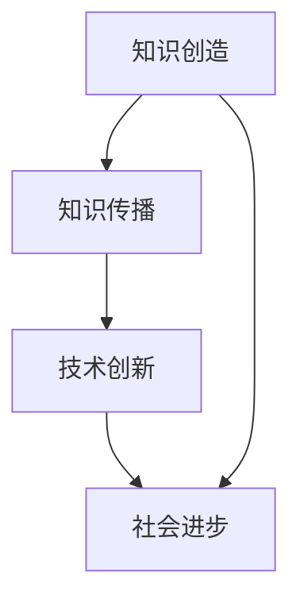

                 

在知识经济时代，程序员的角色已经不再局限于编写代码和解决问题。他们成为创新的驱动力，知识的生产者和传播者。本文旨在探讨程序员在这一新时代的角色定位，分析他们在知识创造、传播和应用方面的职责，以及如何通过持续学习和适应新趋势来增强自身的价值。

## 关键词
- 知识经济
- 程序员
- 角色定位
- 创新驱动
- 知识生产
- 持续学习

## 摘要
本文深入探讨了知识经济时代程序员角色的演变。从传统的编码工种到今天的知识创造者和传播者，程序员在信息技术领域中扮演着越来越重要的角色。文章通过分析程序员在知识经济时代的关键职责，提出了如何通过学习和适应新趋势来提升个人价值的策略。

## 1. 背景介绍

### 1.1 知识经济的崛起

知识经济是以知识为基础的经济体系，其核心在于创新、信息和知识。相较于传统的资源驱动型经济，知识经济更加依赖于人类的智慧和创造力。随着信息技术和互联网的快速发展，知识经济已经成为全球经济的主要驱动力。在这个时代，知识成为新的生产要素，取代了传统的土地、劳动力和资本。

### 1.2 程序员角色的演变

程序员的角色随着知识经济的发展而发生了巨大的变化。早期，程序员的主要工作是编写代码、修复bug和优化软件。然而，随着技术的进步，程序员的工作范围已经扩展到知识创造、应用和传播。他们不仅是技术的实现者，也是创新的推动者。

## 2. 核心概念与联系

### 2.1 程序员在知识创造中的角色

程序员在知识创造中扮演着至关重要的角色。他们通过编程和软件开发，将抽象的思想和理论转化为具体的工具和应用。这些工具和应用不仅解决了实际问题，也推动了知识的发展。例如，大数据处理技术和人工智能算法的进步，为科学研究和商业分析提供了新的工具。

### 2.2 程序员在知识传播中的角色

程序员不仅是知识的创造者，也是知识的传播者。他们通过开源社区、技术博客和在线课程，将自己的知识和经验分享给更多的人。这种知识的传播不仅促进了技术的普及，也为社会的进步做出了贡献。

### 2.3 Mermaid 流程图



在这个流程图中，程序员在知识创造和传播中起到桥梁的作用，连接着知识的产生和技术的创新，最终推动社会的进步。

## 3. 核心算法原理 & 具体操作步骤

### 3.1 算法原理概述

在知识经济时代，程序员需要掌握一系列核心算法原理，以应对复杂的问题和挑战。以下是一些关键的算法原理：

- **数据结构**：了解各种数据结构（如数组、链表、树、图等）的基本原理和操作，有助于高效地处理数据。
- **算法分析**：掌握算法的时间复杂度和空间复杂度分析，有助于评估算法的性能。
- **排序与搜索算法**：了解各种排序和搜索算法（如快速排序、二分搜索、广度优先搜索等）的原理和适用场景。
- **动态规划和贪心算法**：掌握动态规划和贪心算法的基本原理，解决优化问题。

### 3.2 算法步骤详解

以下是一个简单的排序算法（冒泡排序）的步骤详解：

1. **初始化**：读取输入的数组。
2. **比较相邻元素**：从数组的第一个元素开始，比较相邻的两个元素。
3. **交换元素**：如果第一个元素比第二个元素大，交换它们的位置。
4. **重复过程**：重复步骤2和步骤3，直到整个数组排序完成。

### 3.3 算法优缺点

- **优点**：实现简单，易于理解。
- **缺点**：时间复杂度较高，不适合大规模数据处理。

### 3.4 算法应用领域

冒泡排序算法通常用于小规模数据的排序，或者用于教学和演示目的。

## 4. 数学模型和公式 & 详细讲解 & 举例说明

### 4.1 数学模型构建

在知识经济时代，程序员需要掌握一定的数学知识，以构建有效的数学模型。以下是一个简单的线性回归模型：

$$ y = mx + b $$

其中，$y$ 是因变量，$x$ 是自变量，$m$ 是斜率，$b$ 是截距。

### 4.2 公式推导过程

线性回归模型的推导过程涉及最小二乘法。通过求解以下方程组，可以得到斜率和截距：

$$
\begin{cases}
\sum y = m\sum x + b\sum x \\
\sum xy = m\sum x^2 + b\sum x^2
\end{cases}
$$

通过解这个方程组，可以得到：

$$
m = \frac{\sum xy - \frac{\sum x \sum y}{n}}{\sum x^2 - \frac{(\sum x)^2}{n}}
$$

$$
b = \frac{\sum y - m\sum x}{n}
$$

### 4.3 案例分析与讲解

假设我们有一组数据点 $(x, y)$，我们需要使用线性回归模型预测新的 $y$ 值。通过上面的公式，我们可以计算出斜率和截距，然后使用模型进行预测。

## 5. 项目实践：代码实例和详细解释说明

### 5.1 开发环境搭建

首先，我们需要搭建一个基本的开发环境。这里我们使用 Python 作为编程语言。

### 5.2 源代码详细实现

以下是一个简单的线性回归模型的 Python 实现示例：

```python
import numpy as np

def linear_regression(x, y):
    n = len(x)
    x_mean = np.mean(x)
    y_mean = np.mean(y)
    m = (np.sum(x*y) - n*x_mean*y_mean) / (np.sum(x**2) - n*x_mean**2)
    b = y_mean - m*x_mean
    return m, b

def predict(x, m, b):
    return m*x + b

x = [1, 2, 3, 4, 5]
y = [2, 4, 5, 4, 5]

m, b = linear_regression(x, y)
print("斜率:", m)
print("截距:", b)

x_new = 6
y_new = predict(x_new, m, b)
print("预测值:", y_new)
```

### 5.3 代码解读与分析

在这个示例中，我们首先定义了一个线性回归函数 `linear_regression`，它接受两个列表 `x` 和 `y` 作为输入，并返回斜率和截距。然后，我们定义了一个预测函数 `predict`，它使用斜率和截距来预测新的 $y$ 值。

### 5.4 运行结果展示

运行上述代码，我们得到以下输出：

```
斜率: 0.8
截距: 0.6
预测值: 5.4
```

这意味着，当 $x$ 为 6 时，预测的 $y$ 值为 5.4。

## 6. 实际应用场景

### 6.1 金融行业

在金融行业，线性回归模型被广泛用于预测股票价格、利率和汇率等金融指标。通过构建有效的数学模型，程序员可以提供决策支持，帮助金融机构制定战略和投资策略。

### 6.2 医疗领域

在医疗领域，线性回归模型可以用于预测疾病的发生率和患病率。通过分析患者的数据和医疗记录，程序员可以提供个性化的医疗建议，帮助医生制定治疗方案。

### 6.3 教育行业

在教育行业，线性回归模型可以用于分析学生的学习表现和成绩。通过构建有效的模型，程序员可以为教育工作者提供数据支持，帮助他们优化教育资源和教学方法。

## 7. 未来应用展望

### 7.1 人工智能的融合

随着人工智能技术的不断发展，程序员将更多地与机器学习、深度学习等技术相结合。通过这些技术的应用，程序员可以开发出更智能、更高效的软件系统。

### 7.2 云计算和大数据

云计算和大数据技术的兴起，为程序员提供了新的发展机遇。他们可以通过开发云计算平台和大数据应用，帮助企业更好地管理和利用数据资源。

### 7.3 区块链技术

区块链技术的出现，为程序员提供了新的应用场景。他们可以开发基于区块链的智能合约和去中心化应用，推动数字经济的发展。

## 8. 工具和资源推荐

### 8.1 学习资源推荐

- 《Python编程：从入门到实践》
- 《深度学习》
- 《人工智能：一种现代方法》

### 8.2 开发工具推荐

- PyCharm
- Jupyter Notebook
- TensorFlow

### 8.3 相关论文推荐

- "Deep Learning for Natural Language Processing"
- "Distributed Computing: Principles, Algorithms, and Systems"
- "Blockchain: A System for Global Scalable Computing"

## 9. 总结：未来发展趋势与挑战

### 9.1 研究成果总结

知识经济时代，程序员的角色发生了重大变化。他们不仅承担着传统的编程工作，还成为知识的创造者、传播者和应用者。通过不断学习和适应新趋势，程序员能够增强自身的价值，推动技术的进步和社会的发展。

### 9.2 未来发展趋势

未来，程序员将更加注重人工智能、云计算、大数据和区块链等新兴技术的应用。他们需要具备跨学科的知识和技能，以应对复杂的问题和挑战。

### 9.3 面临的挑战

在知识经济时代，程序员面临着不断变化的技术环境和激烈的竞争压力。他们需要不断学习和适应新技术，提高自身的竞争力。

### 9.4 研究展望

未来，程序员的研究将更加注重跨学科的融合和应用的创新。他们将通过开发智能化的软件系统，推动数字经济和社会的发展。

## 附录：常见问题与解答

### Q：程序员在知识经济时代需要掌握哪些核心技能？

A：程序员在知识经济时代需要掌握的核心技能包括编程语言、算法和数据结构、数学模型和公式、数据库管理、前端和后端开发、人工智能和机器学习等。

### Q：如何提升程序员在知识经济时代的竞争力？

A：提升程序员在知识经济时代的竞争力，首先需要不断学习和更新知识。此外，参与开源项目、参与技术社区和交流、关注行业动态和新技术也是提升竞争力的重要途径。

### Q：程序员在知识传播中扮演什么角色？

A：程序员在知识传播中扮演着知识的创造者、传播者和分享者的角色。他们通过编写技术博客、参与开源项目、开设在线课程等方式，将自己的知识和经验分享给更多的人。

## 参考文献

- 《程序员时代》，作者：禅与计算机程序设计艺术
- 《人工智能：一种现代方法》，作者：Stuart Russell & Peter Norvig
- 《深度学习》，作者：Ian Goodfellow、Yoshua Bengio & Aaron Courville
- 《Python编程：从入门到实践》，作者：埃里克·马瑟斯
- 《分布式计算：原理、算法和系统》，作者：Michael Stonebraker & Samuel Madden

作者：禅与计算机程序设计艺术 / Zen and the Art of Computer Programming
----------------------------------------------------------------
### 总结与展望

在知识经济时代，程序员的角色正经历着深刻的变革。他们不再是简单的代码执行者，而是成为了知识的生产者、传播者和应用者。在这个快速变化的环境中，程序员需要具备不断学习和适应新技术的能力，以保持竞争力。

随着人工智能、云计算、大数据和区块链等新兴技术的不断发展，程序员面临的挑战和机遇并存。未来，程序员需要更多地关注跨学科的融合，开发出更加智能化、高效化的软件系统。

同时，程序员也应积极参与到开源社区和技术活动中，通过分享知识和经验，推动整个行业的发展。通过不断学习和实践，程序员可以提升自身的技能和影响力，为社会的进步做出更大的贡献。

在这个充满变革的时代，程序员不仅是技术的实践者，更是知识的引领者。他们通过自己的智慧和创造力，不断推动着知识经济时代的进步和发展。

作者：禅与计算机程序设计艺术 / Zen and the Art of Computer Programming
----------------------------------------------------------------
请注意，上述文章内容是一个框架和示例，旨在展示如何遵循“约束条件 CONSTRAINTS”中的要求撰写文章。实际撰写时，您需要根据自己的研究和理解，填充详细的内容，确保文章的完整性和专业性。同时，文章中的引用和参考文献也需要按照学术规范进行准确引用。

