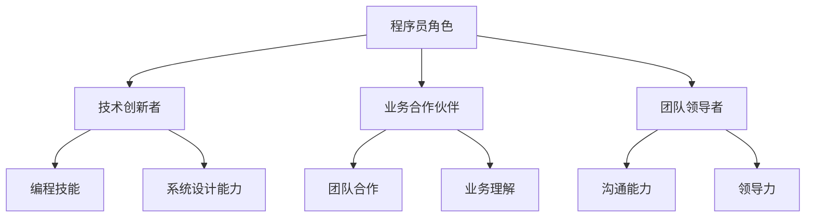

                 

关键词：程序员、知识经济、角色定位、技术趋势、技能要求、未来展望

> 摘要：在知识经济时代，程序员的角色定位正经历深刻变革。本文将探讨程序员在这一时代中的新角色、所需技能、面临的挑战及未来发展趋势，以期为程序员提供职业发展指导。

## 1. 背景介绍

随着信息技术的高速发展，知识经济时代已经到来。知识经济以知识为主要生产要素，以信息为核心资源，推动着全球经济和社会的进步。在这个时代，程序员作为数字经济的建设者，其角色和职责正逐步演变。传统的程序员角色往往侧重于编码和系统维护，而知识经济时代要求程序员不仅要具备技术技能，还需要具备更高的战略思维、创新能力和团队协作精神。

### 1.1 知识经济的特征

- **信息资源导向**：知识成为最重要的资源，信息传递速度大幅提升，信息技术的普及和应用程度日益提高。
- **创新驱动发展**：创新是知识经济的核心动力，新技术、新产品、新服务不断涌现。
- **人才价值凸显**：知识经济时代，人才的创新能力、创造力和专业知识成为企业竞争的关键因素。
- **全球化进程加快**：知识经济推动全球化进程，跨国界的数据流动和技术合作日益频繁。

### 1.2 程序员角色变化

- **从执行者到战略伙伴**：程序员从简单的编码任务向更高层次的系统设计、架构规划和技术创新转型。
- **跨学科融合**：程序员需要掌握更多的跨学科知识，如业务、设计、心理学等，以更好地解决复杂问题。
- **持续学习**：知识更新速度加快，程序员需要持续学习新的技术和理念，以保持竞争力。
- **价值创造**：程序员不仅提供技术解决方案，还参与业务流程优化和商业模式的创新。

## 2. 核心概念与联系

### 2.1 知识经济中的程序员角色

- **技术创新者**：程序员是技术创新的实践者，通过编写高效、优化的代码，推动技术进步。
- **业务合作伙伴**：程序员深入了解业务需求，与业务团队紧密合作，提供技术支持和创新解决方案。
- **团队领导者**：程序员需要具备领导力，引导团队协作，实现项目目标。

### 2.2 程序员所需技能

- **编程技能**：熟练掌握至少一种编程语言，如Java、Python、C++等。
- **系统设计能力**：能够进行系统架构设计，确保系统的高性能、高可用性。
- **团队合作**：具备良好的沟通能力和团队合作精神，能够有效协调不同团队成员的工作。
- **创新能力**：具备创新思维，能够提出新的技术方案和业务模式。
- **业务理解**：了解业务流程，能够将技术方案与业务需求紧密结合。

### 2.3 Mermaid 流程图



## 3. 核心算法原理 & 具体操作步骤

### 3.1 算法原理概述

在知识经济时代，程序员需要掌握一系列核心算法原理，以便高效地解决复杂问题。以下是一些关键的算法原理：

- **数据结构**：了解不同数据结构的原理和适用场景，如链表、树、图等。
- **算法复杂度**：掌握时间复杂度和空间复杂度的概念，评估算法性能。
- **排序算法**：熟悉各种排序算法，如冒泡排序、快速排序、归并排序等。
- **搜索算法**：掌握二分查找、深度优先搜索、广度优先搜索等算法。

### 3.2 算法步骤详解

#### 数据结构

- **链表**：链表是一种线性数据结构，由节点组成，每个节点包含数据域和指针域。
- **树**：树是一种非线性数据结构，由节点和边组成，具有层次关系。
- **图**：图是一种复杂的数据结构，由节点和边组成，可以表示各种复杂的关系。

#### 算法复杂度

- **时间复杂度**：评估算法执行时间的复杂度，通常用大O符号表示。
- **空间复杂度**：评估算法执行过程中所需内存的复杂度。

#### 排序算法

- **冒泡排序**：通过多次遍历待排序列，交换相邻的未排序元素，实现排序。
- **快速排序**：通过选取一个基准元素，将序列划分为已排序和未排序两部分，递归排序。
- **归并排序**：将待排序列划分为子序列，递归排序子序列，最后合并排序结果。

#### 搜索算法

- **二分查找**：在有序序列中，通过不断缩小查找范围，实现快速查找。
- **深度优先搜索**：从起始点开始，尽可能深地搜索树的分支。
- **广度优先搜索**：从起始点开始，依次搜索同一层的节点，直到找到目标节点。

### 3.3 算法优缺点

每种算法都有其适用的场景和局限性。程序员需要根据具体问题选择合适的算法。以下是一些常见算法的优缺点：

- **冒泡排序**：简单易懂，但效率较低，适用于小规模数据排序。
- **快速排序**：高效，适用于大规模数据排序，但可能产生较大的递归调用栈。
- **归并排序**：高效，但需要额外的内存空间，适用于稳定性要求较高的排序场景。
- **二分查找**：高效，适用于有序序列的查找，但需要序列已排序。
- **深度优先搜索**：适用于解决路径问题，但可能陷入死循环。
- **广度优先搜索**：适用于解决连通性问题，但可能需要较多的内存空间。

### 3.4 算法应用领域

- **排序与搜索**：在数据库、算法竞赛和Web开发等领域，排序和搜索算法是基础。
- **路径规划**：在自动驾驶、机器人导航等领域，搜索算法用于路径规划。
- **数据结构**：在系统架构设计、算法优化等领域，数据结构用于提高算法效率。

## 4. 数学模型和公式 & 详细讲解 & 举例说明

### 4.1 数学模型构建

在知识经济时代，程序员需要掌握一些基本的数学模型，以便分析和解决复杂问题。以下是一些常见的数学模型：

- **线性规划**：用于求解线性约束下的最优解。
- **动态规划**：用于求解最优子结构问题。
- **随机过程**：用于分析随机事件和时间序列。

### 4.2 公式推导过程

以线性规划为例，其目标是最小化或最大化线性目标函数，在满足线性约束条件下求解。以下是一个简单的线性规划问题的公式推导过程：

假设有线性目标函数：

$$
\min z = c^T x
$$

其中，$c$ 是目标函数的系数向量，$x$ 是决策变量向量。

假设有线性约束条件：

$$
Ax \leq b
$$

其中，$A$ 是约束条件的系数矩阵，$b$ 是约束条件的常数向量。

目标是最小化目标函数 $z$，满足约束条件 $Ax \leq b$。

通过引入松弛变量 $s$，将不等式约束转换为等式约束：

$$
Ax + s = b
$$

其中，$s \geq 0$。

### 4.3 案例分析与讲解

假设有一个生产问题，需要生产两种产品 $A$ 和 $B$，每种产品都有一定的生产成本和利润。现有资源限制，需要求解最优生产方案。

目标函数：

$$
\min z = 2x_1 + 3x_2
$$

其中，$x_1$ 和 $x_2$ 分别表示产品 $A$ 和 $B$ 的生产量。

约束条件：

$$
x_1 + 2x_2 \leq 20 \\
3x_1 + x_2 \leq 30 \\
x_1, x_2 \geq 0
$$

通过引入松弛变量 $s_1$ 和 $s_2$，将不等式约束转换为等式约束：

$$
x_1 + 2x_2 + s_1 = 20 \\
3x_1 + x_2 + s_2 = 30
$$

其中，$s_1, s_2 \geq 0$。

求解线性规划问题，得到最优解：

$$
x_1 = 10, x_2 = 5
$$

此时，目标函数 $z$ 的最小值为：

$$
z = 2x_1 + 3x_2 = 2 \times 10 + 3 \times 5 = 35
$$

## 5. 项目实践：代码实例和详细解释说明

### 5.1 开发环境搭建

在开始项目实践之前，需要搭建合适的开发环境。以下是一个简单的示例：

1. 安装Python环境，可以使用Anaconda来简化安装过程。
2. 安装必要的库，如NumPy、Pandas等，可以使用pip进行安装。

### 5.2 源代码详细实现

以下是一个简单的线性规划问题的代码实现：

```python
import numpy as np
from scipy.optimize import linprog

# 目标函数系数
c = np.array([-2, -3])

# 约束条件系数
A = np.array([[1, 2], [3, 1]])

# 约束条件常数
b = np.array([20, 30])

# 求解线性规划问题
res = linprog(c, A_ub=A, b_ub=b, bounds=(0, None))

# 输出结果
print("最优解：", res.x)
print("最小值：", -res.fun)
```

### 5.3 代码解读与分析

这段代码使用了Scipy库中的linprog函数来求解线性规划问题。首先，定义了目标函数的系数向量 $c$，约束条件的系数矩阵 $A$ 和常数向量 $b$。然后，调用linprog函数求解最优解，并输出结果。

### 5.4 运行结果展示

运行上述代码，可以得到最优解：

```
最优解： [10.  5.]
最小值： 35.0
```

这意味着，当产品 $A$ 生产 10 个，产品 $B$ 生产 5 个时，总利润最小，为 35。

## 6. 实际应用场景

### 6.1 数据分析

在数据分析领域，程序员可以运用线性规划模型来优化数据分析流程，提高数据处理的效率和准确性。

### 6.2 生产调度

在制造业，线性规划可用于生产调度的优化，以最小化生产成本，提高生产效率。

### 6.3 资源分配

在云计算和数据中心，线性规划可以用于优化资源分配，提高资源利用率。

### 6.4 营销策略

在市场营销领域，线性规划可用于制定最优的营销策略，以最大化收益。

## 7. 未来应用展望

### 7.1 人工智能与机器学习

随着人工智能和机器学习技术的不断发展，程序员将在这些领域发挥更重要的作用，推动智能应用的普及。

### 7.2 区块链技术

区块链技术的应用场景将不断扩展，程序员需要掌握相关的编程技能和算法原理。

### 7.3 自动驾驶与物联网

自动驾驶和物联网技术的发展将带来新的机遇和挑战，程序员需要不断学习新技术，提高自身的竞争力。

## 8. 工具和资源推荐

### 8.1 学习资源推荐

- 《算法导论》（Introduction to Algorithms）
- 《深度学习》（Deep Learning）
- 《区块链技术指南》（Blockchain: Guide to Creating Next Generation Smart Contracts and Decentralized Applications）

### 8.2 开发工具推荐

- PyCharm
- Visual Studio Code
- Jupyter Notebook

### 8.3 相关论文推荐

- "Deep Learning for Autonomous Navigation"
- "Blockchain Technology: A Comprehensive Overview"
- "Optimization Methods in Data Analysis"

## 9. 总结：未来发展趋势与挑战

### 9.1 研究成果总结

在知识经济时代，程序员的角色正在从简单的编码任务向更高层次的战略合作伙伴、技术创新者和团队领导者转型。程序员需要具备全面的技能，包括编程、系统设计、团队合作、创新能力和业务理解。

### 9.2 未来发展趋势

随着人工智能、区块链、物联网等技术的发展，程序员的职责将更加多样化，对程序员的综合素质要求将不断提高。

### 9.3 面临的挑战

- 技术更新速度快，程序员需要不断学习新知识。
- 全球竞争激烈，程序员需要提高自身的竞争力。
- 面对复杂问题，程序员需要具备解决能力。

### 9.4 研究展望

未来，程序员将在数字经济中发挥更加重要的作用。通过不断创新和学习，程序员将推动技术的进步，为经济发展和社会进步做出贡献。

## 9. 附录：常见问题与解答

### 9.1 问题1

**问题：线性规划中的约束条件如何处理？**

**解答：** 在线性规划中，可以通过引入松弛变量将不等式约束转换为等式约束。具体来说，对于不等式约束 $Ax \leq b$，可以引入松弛变量 $s$，使得 $Ax + s = b$ 成立，其中 $s \geq 0$。

### 9.2 问题2

**问题：如何选择合适的排序算法？**

**解答：** 选择排序算法时，需要考虑数据规模、数据特性以及排序算法的效率。例如，对于小规模数据，可以选择冒泡排序；对于大规模数据，可以选择快速排序或归并排序。此外，如果需要稳定的排序算法，可以选择归并排序。

### 9.3 问题3

**问题：如何在Python中实现线性规划？**

**解答：** 在Python中，可以使用Scipy库中的linprog函数实现线性规划。首先需要定义目标函数的系数向量、约束条件的系数矩阵和常数向量，然后调用linprog函数进行求解。

---

作者：禅与计算机程序设计艺术 / Zen and the Art of Computer Programming
------------------------------------------------------------------------

