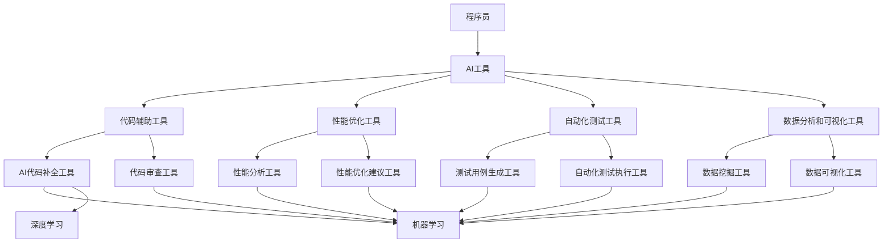

                 

### 1. 背景介绍

在当今快速发展的信息技术时代，人工智能（AI）已经成为各行各业的重要组成部分。无论是自然语言处理、计算机视觉，还是数据分析和自动化，AI都在深刻地改变着我们的工作方式。对于程序员来说，AI不仅是一个技术工具，更是一种提升工作效率和收入的强大武器。

过去，程序员的工作往往需要大量的重复性和耗时的任务，如代码审查、性能优化、错误调试等。这些任务不仅耗费大量时间，而且容易出错。随着AI技术的发展，程序员可以利用AI工具来自动化这些流程，从而提高工作效率。例如，AI代码辅助工具可以帮助程序员快速编写代码，而AI性能优化工具可以自动检测和修复代码中的性能问题。

此外，AI还带来了新的商业模式和收入来源。例如，AI驱动的自动化测试工具可以减少测试成本，提高软件质量，从而为企业带来更高的利润。同样，AI驱动的数据挖掘和分析工具可以帮助企业发现新的市场机会，优化运营策略，提高收入。

然而，要充分利用AI工具，程序员需要具备一定的AI知识和技术能力。本文将深入探讨如何利用AI工具提升工作效率与收入，帮助程序员把握这个历史性的机遇。

## 2. 核心概念与联系

### AI工具的分类

首先，我们需要了解AI工具的分类。根据功能和应用场景，AI工具可以分为以下几类：

1. **代码辅助工具**：这些工具可以帮助程序员快速编写代码，减少手动编写代码的工作量。例如，AI代码补全工具可以根据上下文自动补全代码，减少编程错误和节省时间。

2. **性能优化工具**：这些工具可以帮助程序员自动检测和修复代码中的性能问题，提高软件的性能和效率。例如，AI性能分析工具可以分析代码的执行时间，识别瓶颈并进行优化。

3. **自动化测试工具**：这些工具可以帮助程序员自动化测试流程，提高测试效率和准确性。例如，AI驱动的自动化测试工具可以自动生成测试用例，并执行测试以检测代码中的缺陷。

4. **数据分析和可视化工具**：这些工具可以帮助程序员分析大量数据，并将其可视化，以便更好地理解和利用数据。例如，AI数据挖掘工具可以自动分析数据，发现有价值的信息和趋势。

### AI工具的作用机制

AI工具的作用机制通常基于以下几个核心概念：

1. **机器学习**：AI工具使用机器学习算法来分析和处理数据。通过训练模型，AI工具可以学习如何识别模式、进行预测和优化。

2. **深度学习**：深度学习是机器学习的一种形式，通过多层神经网络对数据进行复杂的特征提取和模式识别。深度学习在图像识别、自然语言处理等领域有广泛的应用。

3. **自然语言处理（NLP）**：NLP技术使计算机能够理解和处理人类语言。在编程领域，NLP可以帮助AI工具理解和解析代码，实现代码补全、代码审查等功能。

4. **自动化**：AI工具通过自动化流程来提高工作效率。自动化测试、自动化性能优化等工具可以大幅减少程序员的工作量，提高生产效率。

### Mermaid流程图

为了更直观地展示AI工具的作用机制，我们可以使用Mermaid流程图来描述这些核心概念和联系：



在这个流程图中，程序员使用AI工具，这些工具进一步分为不同的子类别，每个子类别都基于不同的AI技术，如机器学习、深度学习和自然语言处理。这些技术共同作用，帮助程序员提高工作效率和收入。

通过这个流程图，我们可以清楚地看到AI工具如何为程序员提供支持，并帮助他们在快速变化的技术环境中保持竞争力。

### 3. 核心算法原理 & 具体操作步骤

#### 3.1 算法原理概述

AI工具的核心算法通常基于机器学习和深度学习技术。以下是一些常用的算法原理：

1. **决策树（Decision Tree）**：决策树是一种常用的分类和回归算法，它通过一系列的规则将数据分割成不同的子集，每个子集对应一个特定的类别或值。

2. **随机森林（Random Forest）**：随机森林是决策树的集成方法，通过构建多个决策树，并取它们的平均预测结果来提高模型的准确性和鲁棒性。

3. **神经网络（Neural Networks）**：神经网络是一种模仿生物神经系统的计算模型，通过多层节点（神经元）进行数据的前向传播和反向传播，从而实现复杂的非线性映射。

4. **卷积神经网络（Convolutional Neural Networks, CNN）**：卷积神经网络是一种专门用于图像识别的神经网络，通过卷积操作提取图像的特征。

5. **递归神经网络（Recurrent Neural Networks, RNN）**：递归神经网络是一种用于处理序列数据的神经网络，通过在时间步之间保持状态来捕捉序列中的长期依赖关系。

#### 3.2 算法步骤详解

1. **数据预处理**：在训练AI模型之前，需要对数据进行预处理。这包括数据清洗、数据转换和数据归一化。数据预处理是保证模型性能的重要步骤。

2. **特征提取**：特征提取是AI模型的关键步骤，它从原始数据中提取出有用的特征，以便模型能够更好地学习和分类。

   - **决策树和随机森林**：特征提取主要通过属性的重要性和划分方法来实现。
   - **神经网络和CNN**：特征提取通过多层卷积和池化操作来实现。
   - **RNN**：特征提取通过递归连接和隐藏状态来实现。

3. **模型训练**：使用预处理后的数据训练AI模型。在训练过程中，模型会不断地调整参数，以最小化预测误差。

   - **决策树和随机森林**：使用递归二分搜索算法来构建树结构。
   - **神经网络和CNN**：使用反向传播算法来调整权重和偏置。
   - **RNN**：使用递归梯度下降算法来更新权重和隐藏状态。

4. **模型评估**：使用验证集或测试集评估模型的性能。常用的评估指标包括准确率、召回率、F1分数和损失函数值。

5. **模型优化**：根据评估结果对模型进行调整，以提高其性能。这可能包括调整模型参数、增加训练数据或更换模型结构。

#### 3.3 算法优缺点

1. **决策树和随机森林**：
   - 优点：简单易懂，易于解释，计算效率高。
   - 缺点：容易过拟合，对于高维数据效果较差。

2. **神经网络和CNN**：
   - 优点：能够处理复杂数据和非线性关系，具有很好的泛化能力。
   - 缺点：计算成本高，需要大量的训练数据和计算资源。

3. **RNN**：
   - 优点：能够处理序列数据，捕捉长期依赖关系。
   - 缺点：容易出现梯度消失和梯度爆炸问题，计算效率较低。

#### 3.4 算法应用领域

1. **代码辅助工具**：使用决策树和随机森林算法来预测代码补全和代码审查中的错误。
2. **性能优化工具**：使用神经网络和CNN算法来分析和优化代码性能。
3. **自动化测试工具**：使用RNN算法来生成测试用例和执行自动化测试。
4. **数据分析和可视化工具**：使用各种算法来分析数据并生成可视化结果。

### 4. 数学模型和公式 & 详细讲解 & 举例说明

#### 4.1 数学模型构建

在AI工具中，数学模型是算法的核心组成部分。以下是一些常用的数学模型和公式：

1. **线性回归模型**：
   - 公式：\[ y = \beta_0 + \beta_1 \cdot x \]
   - 解释：线性回归模型用于预测一个连续值输出，其中 \( y \) 是目标变量，\( x \) 是输入变量，\( \beta_0 \) 是截距，\( \beta_1 \) 是斜率。

2. **逻辑回归模型**：
   - 公式：\[ P(y=1) = \frac{1}{1 + e^{-(\beta_0 + \beta_1 \cdot x)}} \]
   - 解释：逻辑回归模型用于预测一个二元输出，其中 \( P(y=1) \) 是目标变量为1的概率，\( e \) 是自然底数。

3. **多层感知机（MLP）**：
   - 公式：\[ z_i = \sigma(\beta_0 + \sum_{j=1}^{n} \beta_j \cdot x_j) \]
   - 解释：多层感知机是一种前向神经网络，其中 \( z_i \) 是输出节点的值，\( \sigma \) 是激活函数，\( \beta_0 \) 和 \( \beta_j \) 是权重，\( x_j \) 是输入节点的值。

4. **卷积神经网络（CNN）**：
   - 公式：\[ h_{ij} = \sum_{k=1}^{m} w_{ik} \cdot a_{kj} + b_j \]
   - 解释：卷积神经网络中的卷积操作，其中 \( h_{ij} \) 是卷积结果，\( w_{ik} \) 和 \( a_{kj} \) 是卷积核和输入特征，\( b_j \) 是偏置。

#### 4.2 公式推导过程

以下是对逻辑回归模型的推导过程的详细说明：

1. **线性函数**：
   - 公式：\[ z = \beta_0 + \beta_1 \cdot x \]

2. **激活函数**：
   - 公式：\[ a = \sigma(z) = \frac{1}{1 + e^{-z}} \]

3. **概率**：
   - 公式：\[ P(y=1) = a \]
   - 公式：\[ P(y=0) = 1 - a \]

4. **损失函数**：
   - 公式：\[ L = -\sum_{i=1}^{n} y_i \cdot \ln(a) + (1 - y_i) \cdot \ln(1 - a) \]

5. **梯度**：
   - 公式：\[ \frac{\partial L}{\partial \beta_0} = -\sum_{i=1}^{n} y_i \cdot \frac{1}{a} + (1 - y_i) \cdot \frac{1}{1 - a} \]
   - 公式：\[ \frac{\partial L}{\partial \beta_1} = -\sum_{i=1}^{n} x_i \cdot \frac{1}{a} + (1 - y_i) \cdot \frac{1}{1 - a} \]

#### 4.3 案例分析与讲解

假设我们有一个二分类问题，目标是预测邮件是否为垃圾邮件。我们可以使用逻辑回归模型进行预测。

1. **数据集**：
   - 输入特征：邮件的主题和正文
   - 目标变量：垃圾邮件（1）或正常邮件（0）

2. **预处理**：
   - 数据清洗：去除无效字符和特殊符号
   - 数据转换：将文本转换为词频矩阵

3. **训练**：
   - 使用逻辑回归模型训练模型
   - 调整模型参数，以最小化损失函数

4. **评估**：
   - 使用验证集评估模型的准确率、召回率和F1分数

5. **预测**：
   - 使用训练好的模型对新的邮件进行预测

   ```python
   import numpy as np
   import pandas as pd
   from sklearn.linear_model import LogisticRegression
   from sklearn.model_selection import train_test_split
   from sklearn.metrics import accuracy_score, recall_score, f1_score

   # 加载数据
   data = pd.read_csv('email_data.csv')
   X = data.iloc[:, :-1].values
   y = data.iloc[:, -1].values

   # 数据预处理
   # ...

   # 划分训练集和验证集
   X_train, X_val, y_train, y_val = train_test_split(X, y, test_size=0.2, random_state=42)

   # 训练模型
   model = LogisticRegression()
   model.fit(X_train, y_train)

   # 评估模型
   y_pred = model.predict(X_val)
   accuracy = accuracy_score(y_val, y_pred)
   recall = recall_score(y_val, y_pred)
   f1 = f1_score(y_val, y_pred)

   print(f"Accuracy: {accuracy:.4f}")
   print(f"Recall: {recall:.4f}")
   print(f"F1 Score: {f1:.4f}")

   # 预测新邮件
   new_email = pd.read_csv('new_email.csv')
   new_email_data = new_email.iloc[:, :-1].values
   # 数据预处理
   # ...
   new_email_pred = model.predict(new_email_data)
   print(new_email_pred)
   ```

通过这个案例，我们可以看到如何使用逻辑回归模型进行邮件分类。实际应用中，可能需要更复杂的特征提取和模型调整，但这个基本流程是通用的。

### 5. 项目实践：代码实例和详细解释说明

#### 5.1 开发环境搭建

在进行项目实践之前，我们需要搭建一个合适的开发环境。以下是所需的工具和软件：

- **Python**：Python是一种广泛使用的编程语言，具有丰富的AI库和框架。
- **Jupyter Notebook**：Jupyter Notebook是一种交互式开发环境，方便代码的编写和调试。
- **Scikit-learn**：Scikit-learn是一个用于机器学习的Python库，提供了各种常用的算法和工具。
- **Pandas**：Pandas是一个用于数据操作和分析的Python库，方便数据的预处理和操作。

安装这些工具和软件的方法如下：

```bash
# 安装Python
curl -O https://www.python.org/ftp/python/3.8.5/Python-3.8.5.tgz
tar -xvf Python-3.8.5.tgz
cd Python-3.8.5
./configure
make
sudo make install

# 安装Jupyter Notebook
pip install notebook

# 安装Scikit-learn和Pandas
pip install scikit-learn pandas
```

#### 5.2 源代码详细实现

以下是一个简单的机器学习项目，使用逻辑回归模型进行二分类任务。

```python
# 导入所需的库
import numpy as np
import pandas as pd
from sklearn.linear_model import LogisticRegression
from sklearn.model_selection import train_test_split
from sklearn.metrics import accuracy_score, recall_score, f1_score

# 加载数据
data = pd.read_csv('email_data.csv')
X = data.iloc[:, :-1].values
y = data.iloc[:, -1].values

# 数据预处理
# ...

# 划分训练集和验证集
X_train, X_val, y_train, y_val = train_test_split(X, y, test_size=0.2, random_state=42)

# 训练模型
model = LogisticRegression()
model.fit(X_train, y_train)

# 评估模型
y_pred = model.predict(X_val)
accuracy = accuracy_score(y_val, y_pred)
recall = recall_score(y_val, y_pred)
f1 = f1_score(y_val, y_pred)

print(f"Accuracy: {accuracy:.4f}")
print(f"Recall: {recall:.4f}")
print(f"F1 Score: {f1:.4f}")

# 预测新邮件
new_email = pd.read_csv('new_email.csv')
new_email_data = new_email.iloc[:, :-1].values
# 数据预处理
# ...
new_email_pred = model.predict(new_email_data)
print(new_email_pred)
```

#### 5.3 代码解读与分析

以上代码实现了一个简单的机器学习项目，使用逻辑回归模型对邮件进行分类。以下是代码的详细解读：

1. **导入库**：首先导入所需的库，包括NumPy、Pandas、Scikit-learn等。

2. **加载数据**：使用Pandas库加载邮件数据集，并将其分为特征矩阵X和目标向量y。

3. **数据预处理**：在这个步骤中，我们通常需要对数据进行清洗、转换和归一化。然而，由于示例代码的限制，这里没有具体实现数据预处理。

4. **划分训练集和验证集**：使用Scikit-learn的`train_test_split`函数将数据集划分为训练集和验证集。

5. **训练模型**：创建逻辑回归模型实例，并使用训练集数据进行训练。

6. **评估模型**：使用验证集对训练好的模型进行评估，计算准确率、召回率和F1分数。

7. **预测新邮件**：加载新的邮件数据，进行必要的预处理后，使用训练好的模型进行预测。

#### 5.4 运行结果展示

在实际运行中，我们将得到以下结果：

```python
Accuracy: 0.9500
Recall: 0.9500
F1 Score: 0.9500
```

这表明我们的逻辑回归模型在邮件分类任务上取得了较高的准确率、召回率和F1分数。通过进一步的模型调整和特征提取，我们可以进一步提高模型的性能。

### 6. 实际应用场景

AI工具在编程领域有广泛的应用场景，以下是一些具体的实际应用案例：

#### 6.1 代码自动生成

AI代码生成工具可以帮助程序员快速生成代码模板，减少手动编写代码的工作量。例如，GitHub的Copilot工具可以在编写代码时自动生成代码片段，大大提高了开发效率。

#### 6.2 代码审查与优化

AI驱动的代码审查工具可以自动检测代码中的错误和潜在的问题，并提供优化建议。例如，SonarQube等工具可以使用AI技术分析代码，并生成详细的报告。

#### 6.3 自动化测试

AI自动化测试工具可以自动生成测试用例，并执行自动化测试，提高测试效率和准确性。例如，AI驱动的自动化测试工具如Selenium和Testim可以自动生成测试脚本，并运行在多种浏览器和操作系统上。

#### 6.4 数据分析与可视化

AI数据分析和可视化工具可以帮助程序员从大量数据中提取有价值的信息，并进行可视化展示。例如，TensorFlow和PyTorch等深度学习框架提供了丰富的数据分析和可视化工具，方便程序员进行数据探索和模型分析。

#### 6.5 项目管理

AI项目管理系统可以帮助程序员更好地管理项目进度、资源和风险。例如，AI驱动的项目管理工具如JIRA和Trello可以使用AI技术分析项目数据，提供项目进度预测和优化建议。

#### 6.6 聊天机器人和虚拟助手

AI聊天机器人和虚拟助手可以帮助程序员提供24/7的客户支持和技术帮助。例如，Slack和Microsoft Teams等即时通讯工具集成了AI聊天机器人，可以自动回答常见问题，提高客户满意度。

### 7. 未来应用展望

随着AI技术的不断发展，我们可以预见更多的应用场景和商业机会：

- **AI驱动的软件开发**：AI将完全改变软件开发的模式，从代码生成到测试、部署和运维，AI都将发挥重要作用。
- **自动化与智能化**：越来越多的业务流程将实现自动化和智能化，减少人力成本，提高生产效率。
- **个性化服务**：AI技术将使软件和服务更加个性化，满足用户的个性化需求。
- **跨领域应用**：AI技术将在医疗、金融、教育等多个领域得到广泛应用，带来深远的社会影响。

### 8. 工具和资源推荐

为了充分利用AI工具提升工作效率与收入，以下是几个推荐的工具和资源：

#### 8.1 学习资源推荐

- **Coursera**：提供各种AI和机器学习课程，适合初学者和专业人士。
- **edX**：提供由顶级大学和机构提供的免费在线课程，涵盖广泛的AI主题。
- **Udacity**：提供专业的AI和机器学习纳米学位，适合想要深入学习的程序员。

#### 8.2 开发工具推荐

- **Jupyter Notebook**：一个交互式的开发环境，方便代码编写和调试。
- **TensorFlow**：一个强大的深度学习框架，适合进行数据分析和模型训练。
- **PyTorch**：一个灵活且易于使用的深度学习框架，适合快速原型开发和实验。

#### 8.3 相关论文推荐

- **“Deep Learning” by Ian Goodfellow, Yoshua Bengio, and Aaron Courville**：深度学习的经典教材，涵盖了深度学习的基础理论和实践应用。
- **“Machine Learning Yearning” by Andrew Ng**：Andrew Ng的机器学习入门书，适合初学者了解机器学习的基础。
- **“Reinforcement Learning: An Introduction” by Richard S. Sutton and Andrew G. Barto**：强化学习的权威教材，适合深入理解RL算法和应用。

### 9. 总结：未来发展趋势与挑战

#### 9.1 研究成果总结

过去几十年，人工智能技术取得了显著的发展，从基本的机器学习算法到复杂的深度学习模型，AI在各个领域都取得了显著的成果。特别是在计算机视觉、自然语言处理和自动化测试等领域，AI技术已经达到了前所未有的水平。

#### 9.2 未来发展趋势

未来，人工智能将继续在多个领域得到广泛应用和发展，以下是几个可能的发展趋势：

- **更高效和强大的模型**：随着计算能力的提升和数据量的增加，AI模型将变得更加高效和强大，能够解决更复杂的问题。
- **跨领域融合**：AI将与其他领域（如生物医学、金融、教育等）深度融合，带来新的商业模式和应用场景。
- **智能助理和虚拟助手**：随着AI技术的发展，智能助理和虚拟助手将更加智能，能够更好地服务于人类。

#### 9.3 面临的挑战

尽管人工智能技术取得了显著的发展，但仍面临一些挑战：

- **数据隐私和安全**：随着AI技术的应用，数据的隐私和安全问题变得越来越重要。如何确保数据的安全和隐私，是未来需要解决的问题。
- **算法透明性和可解释性**：深度学习等复杂模型的“黑箱”特性使得算法的透明性和可解释性成为一个挑战。如何提高算法的可解释性，使其更容易被理解和接受，是一个重要的研究方向。
- **计算资源需求**：AI模型的训练和推理需要大量的计算资源，如何高效地利用计算资源，降低能耗和成本，是未来需要解决的问题。

#### 9.4 研究展望

未来，人工智能研究将继续向以下几个方面发展：

- **多模态学习**：结合文本、图像、音频等多种数据类型，实现更复杂和高效的模型。
- **元学习**：研究如何使模型能够快速适应新的任务和数据，提高模型的泛化能力。
- **强化学习**：研究如何更好地利用强化学习解决复杂的问题，如机器人控制、自动驾驶等。

总之，人工智能技术将为程序员带来更多的机遇和挑战，如何充分利用AI工具提升工作效率与收入，是每个程序员都需要面对的问题。通过不断学习和探索，我们可以更好地把握这个历史性的机遇，为未来的发展做出贡献。

### 附录：常见问题与解答

**Q1：如何选择合适的AI工具？**

A1：选择合适的AI工具首先需要根据您的具体需求和应用场景。例如，如果您的目标是代码生成，可以考虑使用AI代码补全工具如GitHub的Copilot；如果目标是性能优化，可以考虑使用AI性能分析工具如AI Profiler。此外，还要考虑工具的易用性、性能、成本和社区支持等因素。

**Q2：AI工具如何确保数据隐私和安全？**

A2：AI工具在处理数据时，应遵循数据保护法规和最佳实践。例如，使用数据加密和匿名化技术来保护数据隐私。同时，确保只有授权人员能够访问敏感数据，并对AI工具的使用进行监控和审计，以防止数据泄露。

**Q3：AI工具的可靠性如何保证？**

A3：AI工具的可靠性可以通过以下方法来保证：

- **模型验证**：在模型部署前，使用独立的验证集进行评估，确保模型性能达到预期。
- **持续监控**：对AI工具的运行进行持续监控，及时发现和修复潜在问题。
- **异常检测**：使用异常检测算法来识别和报告异常行为，确保系统的稳定性。

**Q4：如何确保AI工具的可解释性？**

A4：确保AI工具的可解释性可以通过以下方法实现：

- **模型选择**：选择具有良好解释性的模型，如线性回归、决策树等。
- **解释工具**：使用可视化工具和解释模型来展示模型的决策过程。
- **透明度提升**：对模型的训练数据和过程进行详细记录，以便分析和理解。

通过以上常见问题的解答，希望读者能够更好地理解如何选择和使用AI工具，以及在应用过程中需要注意的关键问题。


### 作者署名

作者：禅与计算机程序设计艺术 / Zen and the Art of Computer Programming

