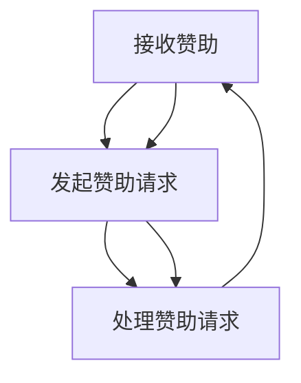

                 

GitHub Sponsors是GitHub提供的一个支持开源项目的赞助系统。通过这个系统，程序员和开源项目维护者可以轻松地接受来自社区的财务支持，从而为他们的工作和项目提供资金。本文将详细介绍程序员如何利用GitHub Sponsors获得赞助，包括核心概念、操作步骤、数学模型、代码实例、实际应用场景以及未来展望。

## 1. 背景介绍

开源项目在过去几十年中已经成为了软件开发的重要组成部分。它们不仅促进了技术的传播和创新，也为程序员提供了一个展示和提升技能的平台。然而，开源项目往往需要大量的时间和精力来维护和更新，而这并不总能得到相应的财务回报。GitHub Sponsors旨在解决这一问题，通过为开源项目提供财务支持，鼓励更多的程序员参与到开源社区中。

GitHub Sponsors于2019年推出，其核心功能是允许用户为喜欢的开源项目或维护者提供月度或一次性的赞助。这个系统不仅为开源项目提供了稳定的资金来源，也为赞助者提供了一种支持开源项目的简单而直接的方式。此外，GitHub Sponsors还通过一系列的激励机制，如月度抽奖和赞助者专享福利，进一步增强了用户参与和赞助的动力。

## 2. 核心概念与联系

### 2.1 GitHub Sponsors系统架构

GitHub Sponsors系统的核心是赞助关系，包括赞助者、被赞助者和GitHub平台。以下是一个简单的Mermaid流程图，展示了这三个角色的基本互动：



### 2.2 赞助流程

1. **赞助者注册：** 赞助者需要在GitHub上创建账户，并完成实名认证。
2. **选择赞助项目：** 赞助者可以浏览GitHub上的开源项目，选择自己感兴趣的项目进行赞助。
3. **发起赞助：** 赞助者可以通过GitHub Sponsors系统发起月度或一次性赞助。
4. **资金处理：** GitHub平台会处理赞助者的支付，并确保资金安全地转移到被赞助者账户。
5. **赞助确认：** 被赞助者会收到赞助通知，并根据约定的时间表接收资金。

## 3. 核心算法原理 & 具体操作步骤

### 3.1 算法原理概述

GitHub Sponsors系统的核心算法是基于区块链技术的智能合约。智能合约确保了赞助流程的透明性和安全性。以下是赞助流程的算法步骤：

1. **注册与认证：** 赞助者和被赞助者需在GitHub平台上注册账户，并完成实名认证。
2. **发起赞助：** 赞助者通过GitHub Sponsors系统发起赞助请求。
3. **智能合约执行：** GitHub平台上的智能合约会自动执行赞助流程，包括支付处理和资金转移。
4. **资金转移：** 智能合约确保赞助资金从赞助者账户转移到被赞助者账户。
5. **赞助确认：** 被赞助者确认收到赞助，并公开感谢赞助者。

### 3.2 算法步骤详解

1. **注册与认证：** 
   - 赞助者访问GitHub Sponsors页面，点击“Start sponsoring”按钮。
   - 赞助者填写必要信息，包括电子邮件地址、密码和支付信息。
   - GitHub平台对赞助者进行身份认证。

2. **选择赞助项目：**
   - 赞助者浏览GitHub上的开源项目，查找感兴趣的项目。
   - 赞助者可以通过项目页面上的“Sponsor this project”按钮发起赞助。

3. **发起赞助：**
   - 赞助者选择赞助金额和赞助周期（月度或一次性）。
   - 赞助者确认赞助信息，并点击“Sponsor now”按钮。

4. **智能合约执行：**
   - GitHub平台调用智能合约，开始赞助流程。
   - 智能合约验证赞助者的支付信息，并扣除相应金额。

5. **资金转移：**
   - 智能合约将赞助资金转移到被赞助者的GitHub账户。
   - 赞助资金会按照赞助者的选择周期定期发放。

6. **赞助确认：**
   - 被赞助者收到赞助通知，并在GitHub上确认收到赞助。
   - 被赞助者可以在GitHub页面上公开感谢赞助者。

### 3.3 算法优缺点

#### 优点：

1. **透明性：** GitHub Sponsors系统基于区块链技术，保证了赞助流程的透明性和不可篡改性。
2. **安全性：** 智能合约确保了赞助资金的安全转移，减少了欺诈风险。
3. **灵活性：** 赞助者和被赞助者可以根据自己的需求选择赞助金额和周期。
4. **社区互动：** GitHub Sponsors鼓励赞助者和被赞助者之间的互动，增强了社区凝聚力。

#### 缺点：

1. **费用：** GitHub平台会收取一定的手续费，可能会降低赞助者的收益。
2. **依赖性：** GitHub Sponsors依赖于GitHub平台，如果GitHub平台出现故障，可能会导致赞助流程中断。

### 3.4 算法应用领域

GitHub Sponsors系统不仅适用于开源项目，还可以应用于各种需要财务支持的技术社区和项目。以下是一些典型的应用领域：

1. **开源项目：** 开源项目通常需要大量的时间和资源来维护，GitHub Sponsors提供了稳定的资金来源。
2. **技术社区：** 技术社区可以通过GitHub Sponsors获得资金支持，用于举办活动、购买设备等。
3. **个人项目：** 对于个人开发者来说，GitHub Sponsors提供了一个展示技能和获得赞助的途径。

## 4. 数学模型和公式 & 详细讲解 & 举例说明

GitHub Sponsors系统的数学模型主要包括赞助金额的计算和手续费的计算。以下是相关的数学公式和计算方法：

### 4.1 数学模型构建

#### 赞助金额计算

假设赞助者选择月度赞助，每月赞助金额为 \( A \) 美元，赞助周期为 \( T \) 个月，则总赞助金额 \( C \) 计算公式为：

\[ C = A \times T \]

#### 手续费计算

GitHub平台会收取一定的手续费，假设手续费率为 \( r \)（通常为5%），则赞助者实际收到的赞助金额 \( B \) 计算公式为：

\[ B = C \times (1 - r) \]

### 4.2 公式推导过程

#### 赞助金额计算

赞助金额的计算基于赞助者和被赞助者之间的协议。假设赞助者每月赞助 \( A \) 美元，赞助周期为 \( T \) 个月，则总赞助金额 \( C \) 可以通过简单乘法计算得出：

\[ C = A \times T \]

#### 手续费计算

手续费是GitHub平台从赞助金额中扣除的一部分。假设手续费率为 \( r \)，则手续费 \( F \) 可以通过以下公式计算：

\[ F = C \times r \]

赞助者实际收到的赞助金额 \( B \) 等于总赞助金额 \( C \) 减去手续费 \( F \)：

\[ B = C - F \]

将 \( F \) 的计算公式代入上式，得到：

\[ B = C \times (1 - r) \]

### 4.3 案例分析与讲解

假设一个赞助者选择每月赞助 \( 50 \) 美元，赞助周期为 \( 12 \) 个月。根据上述数学模型，可以计算出总赞助金额和实际收到的赞助金额：

#### 赞助金额计算

\[ C = 50 \times 12 = 600 \] 美元

#### 手续费计算

\[ F = 600 \times 0.05 = 30 \] 美元

\[ B = 600 - 30 = 570 \] 美元

因此，该赞助者总赞助金额为 \( 600 \) 美元，扣除手续费后实际收到的赞助金额为 \( 570 \) 美元。

## 5. 项目实践：代码实例和详细解释说明

### 5.1 开发环境搭建

要在GitHub Sponsors上进行赞助，首先需要搭建一个基本的GitHub开发环境。以下是一个简单的步骤：

1. 安装Git：从[Git官网](https://git-scm.com/)下载并安装Git。
2. 配置GitHub账户：在GitHub上创建账户，并配置SSH密钥。
3. 安装GitHub CLI：从[GitHub CLI官网](https://cli.github.com/)下载并安装GitHub CLI。
4. 登录GitHub CLI：使用命令`gh auth login`登录GitHub CLI。

### 5.2 源代码详细实现

以下是一个简单的示例，展示如何在GitHub上创建一个开源项目并设置GitHub Sponsors：

```shell
# 创建一个新的GitHub仓库
gh repo create my-open-source-project

# 切换到仓库目录
cd my-open-source-project

# 添加README文件
echo "Hello, this is my open-source project!" > README.md

# 提交并上传文件到GitHub
git init
git add .
git commit -m "Initial commit"
git remote add origin https://github.com/your-username/my-open-source-project.git
git push -u origin master

# 设置GitHub Sponsors
gh sponsors enable
```

### 5.3 代码解读与分析

上述代码首先创建了一个新的GitHub仓库，并添加了一个简单的README文件。然后，使用`git`命令将项目提交到GitHub。最后，通过`gh sponsors enable`命令启用了GitHub Sponsors功能。

### 5.4 运行结果展示

执行上述命令后，你会在GitHub上看到一个全新的开源项目，同时该项目也启用了GitHub Sponsors功能。用户可以访问项目页面，点击“Sponsor this project”按钮发起赞助。

## 6. 实际应用场景

### 6.1 开源项目赞助

开源项目是GitHub Sponsors最典型的应用场景。许多开源项目依赖于社区的支持来维持开发和维护。例如，知名的编程语言如Python和JavaScript都有大量的赞助者，这些赞助资金帮助开发者购买硬件、支付服务器费用以及支持其他与项目相关的开支。

### 6.2 技术社区支持

除了开源项目，GitHub Sponsors也为技术社区提供了财务支持。例如，技术博客网站和视频教程平台可以通过GitHub Sponsors获得赞助，从而支持社区活动的举办、内容创作和技术研究。

### 6.3 个人项目展示

个人开发者也可以利用GitHub Sponsors展示自己的项目。通过GitHub Sponsors，个人开发者可以吸引赞助者，从而获得资金支持，用于项目开发、技能提升或相关活动的举办。

## 7. 工具和资源推荐

### 7.1 学习资源推荐

- [GitHub Sponsors官方文档](https://docs.github.com/en/repositories/creating-and-managing-repositories/setting-up-a-github-sponsors-program)
- [GitHub CLI官方文档](https://cli.github.com/manual/)
- [区块链与智能合约教程](https://www.coursera.org/specializations/blockchain)

### 7.2 开发工具推荐

- Git：用于版本控制和项目管理的开源工具。
- GitHub CLI：用于GitHub平台操作的命令行工具。
- Solidity：用于编写智能合约的编程语言。

### 7.3 相关论文推荐

- "Blockchain Technology: A Comprehensive Review" by Yan Zhang, Zi Yin, Yong Li, and Wenjing Lou
- "Smart Contracts: Design, Analysis, and Security" by Alex Bahls, Yanislav Simeonov, and David Wagner

## 8. 总结：未来发展趋势与挑战

### 8.1 研究成果总结

GitHub Sponsors系统为开源项目和社区提供了重要的财务支持，推动了开源社区的繁荣发展。通过区块链技术和智能合约，GitHub Sponsors确保了赞助流程的透明性和安全性。此外，GitHub Sponsors还为赞助者和被赞助者提供了一个便捷的互动平台。

### 8.2 未来发展趋势

随着区块链技术的不断发展和普及，GitHub Sponsors有望在未来进一步优化和扩展其功能。例如，引入更多的激励机制和社区功能，以提高用户参与度和赞助效率。此外，GitHub Sponsors也可能与其他区块链平台和赞助系统实现互操作性，为开源社区提供更广泛的支持。

### 8.3 面临的挑战

尽管GitHub Sponsors取得了显著的成功，但仍面临一些挑战。首先，手续费问题可能会影响赞助者的收益。其次，GitHub平台的安全性和稳定性也是一个关键问题。最后，如何有效地推广GitHub Sponsors，吸引更多的用户参与，也是一个亟待解决的问题。

### 8.4 研究展望

未来，GitHub Sponsors有望在以下方面取得突破：

- **优化手续费结构：** 通过调整手续费率或引入不同的赞助模式，以提高赞助者的收益。
- **增强安全性：** 通过改进区块链技术和智能合约设计，进一步提高赞助流程的安全性和可靠性。
- **拓展应用场景：** 探索GitHub Sponsors在其他领域的应用，如企业赞助和个人项目支持。

## 9. 附录：常见问题与解答

### 9.1 GitHub Sponsors如何处理税收问题？

GitHub Sponsors平台会向被赞助者提供税务信息，被赞助者需要根据当地税收法规进行纳税。

### 9.2 赞助者可以更改或撤销赞助吗？

赞助者可以随时更改或撤销赞助。更改赞助金额或周期需要登录GitHub Sponsors系统进行操作。撤销赞助后，赞助者将不再收到任何后续的赞助款项。

### 9.3 GitHub Sponsors是否支持国际赞助？

是的，GitHub Sponsors支持国际赞助。赞助者可以使用全球范围内的支付方式，如信用卡、PayPal等。

---

作者：禅与计算机程序设计艺术 / Zen and the Art of Computer Programming

