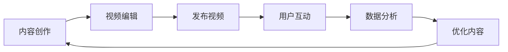

                 

 在这个数字时代，社交媒体不仅是一种沟通工具，更是一个庞大的知识分享平台。TikTok，作为当前最受欢迎的短视频应用之一，拥有庞大的用户基础和丰富的内容生态系统。本文将探讨程序员如何利用TikTok进行知识变现，通过分享专业知识和技能来吸引关注、建立个人品牌，并最终实现收入增长。

> **关键词：** TikTok, 知识变现, 程序员, 社交媒体, 个人品牌

> **摘要：** 本文将介绍程序员如何利用TikTok这个平台进行知识分享和变现。我们将探讨内容创作、受众分析、营销策略以及如何通过TikTok实现收入增长。同时，还会提供实用的工具和资源推荐，帮助程序员更有效地开展这一过程。

## 1. 背景介绍

在过去的几年中，社交媒体平台经历了巨大的变革。从Facebook、Twitter到Instagram，这些平台都在不断演进，以适应用户的需求和市场的变化。然而，随着短视频的兴起，TikTok迅速崛起，成为全球最受欢迎的应用之一。根据统计，TikTok在全球拥有超过10亿的活跃用户，每天产生数亿条短视频。

程序员作为一个专业群体，不仅拥有丰富的技术知识和实践经验，而且有着强烈的分享欲望。然而，传统的知识分享平台如GitHub、Stack Overflow等更多地侧重于代码和技术文档的分享。而TikTok提供了更加直观、生动的内容形式，使得程序员能够以短视频的形式展示自己的技术知识和项目实践。

知识变现是指通过知识分享获得收入的过程。在TikTok上，程序员可以通过多种方式实现知识变现，包括广告收入、品牌合作、课程销售和付费内容等。这种模式不仅为程序员提供了额外的收入来源，也有助于他们建立个人品牌，提升行业影响力。

## 2. 核心概念与联系

### 2.1 TikTok平台概述

TikTok是一个基于短视频的社交媒体平台，用户可以通过上传、观看和分享短视频来互动。TikTok的特点包括：

- **短视频格式：** 视频时长通常在15秒到60秒之间。
- **算法推荐：** TikTok使用先进的人工智能算法，根据用户的兴趣和行为推荐内容。
- **互动性：** 用户可以通过点赞、评论、分享等方式互动。

### 2.2 程序员知识分享形式

程序员在TikTok上的知识分享形式多种多样，包括：

- **教程视频：** 介绍编程语言、框架、工具的使用方法。
- **项目展示：** 展示程序员完成的项目和作品，包括开发过程和技术细节。
- **技术讨论：** 就热点话题、行业趋势进行深入讨论。
- **代码实战：** 展示编程过程中的技巧和优化方法。

### 2.3 知识变现模式

程序员在TikTok上实现知识变现的模式包括：

- **广告收入：** 通过平台广告分成获得收入。
- **品牌合作：** 与企业合作，进行产品推广和品牌宣传。
- **课程销售：** 出售在线编程课程和电子书。
- **付费内容：** 提供独家内容和会员服务。

### 2.4 Mermaid 流程图

下面是一个简单的Mermaid流程图，展示程序员在TikTok上进行知识变现的流程：



## 3. 核心算法原理 & 具体操作步骤

### 3.1 算法原理概述

程序员在TikTok上进行知识变现的核心算法是基于用户行为的数据分析和内容推荐。平台通过收集用户的浏览记录、点赞、评论和分享等行为数据，使用机器学习算法进行用户画像和内容推荐。

### 3.2 算法步骤详解

1. **数据收集：** TikTok收集用户的各项行为数据。
2. **用户画像：** 使用机器学习算法对用户进行画像，包括兴趣、行为习惯等。
3. **内容推荐：** 根据用户画像推荐相关的内容。
4. **内容反馈：** 用户观看、点赞、评论、分享等行为反馈给平台，用于优化推荐算法。
5. **内容优化：** 根据反馈数据调整内容策略，提高用户参与度和满意度。

### 3.3 算法优缺点

**优点：**

- **个性化推荐：** 根据用户行为数据推荐个性化的内容，提高用户满意度。
- **高效传播：** 短视频形式易于传播，能够迅速获得大量关注。
- **多样变现：** 提供多种变现模式，为程序员提供多样化的收入来源。

**缺点：**

- **竞争激烈：** TikTok上内容丰富，竞争激烈，需要创新和高质量的内容才能脱颖而出。
- **平台政策：** 平台政策变化可能影响内容变现的效果。

### 3.4 算法应用领域

- **教育：** 分享编程教程、项目实战和行业知识。
- **技术讨论：** 展开技术辩论、分享技术趋势。
- **项目展示：** 展示个人或团队的项目成果。
- **品牌推广：** 与企业合作，进行品牌推广和产品展示。

## 4. 数学模型和公式 & 详细讲解 & 举例说明

### 4.1 数学模型构建

在TikTok上，程序员的知识变现可以通过以下数学模型进行构建：

\[ 收入 = 观看量 \times 广告分成率 + 品牌合作收入 + 课程销售额 \]

其中：

- **观看量：** 视频被观看的次数。
- **广告分成率：** 平台广告分成比例，通常为观看量的百分比。
- **品牌合作收入：** 与企业合作所获得的收入。
- **课程销售额：** 通过课程销售所获得的收入。

### 4.2 公式推导过程

公式推导过程主要涉及对各项收入来源的估计和计算。例如：

- **观看量：** 通过视频发布后的数据统计得出。
- **广告分成率：** 根据平台政策确定。
- **品牌合作收入：** 与企业协商确定。
- **课程销售额：** 通过课程销售的数据统计得出。

### 4.3 案例分析与讲解

假设一位程序员发布了10条编程教程视频，每条视频平均有1000次观看，平台广告分成率为20%。此外，他还与一家技术公司进行了品牌合作，获得了一笔5000元的收入。他还销售了一本编程电子书，获得了2000元的收入。

根据上述模型，我们可以计算出他的月收入为：

\[ 收入 = (10 \times 1000 \times 0.2) + 5000 + 2000 = 7000元 \]

这是一个基本的计算示例，实际情况会更加复杂，需要考虑更多因素，如用户互动数据、课程销售量等。

## 5. 项目实践：代码实例和详细解释说明

### 5.1 开发环境搭建

为了在TikTok上进行知识变现，程序员需要搭建一个合适的内容创作和发布环境。以下是一个基本的开发环境搭建流程：

1. **安装TikTok应用：** 在手机上下载并安装TikTok应用。
2. **注册账号：** 使用手机号码或电子邮件注册TikTok账号。
3. **完善个人资料：** 设置头像、昵称和简介，突出个人技术专长。
4. **配置设备：** 使用手机或相机录制高质量的视频。

### 5.2 源代码详细实现

以下是一个简单的Python编程教程视频的示例代码：

```python
# 示例：Python基础教程 - Hello World

print("Hello, World!")
```

这段代码非常简单，只包含一个打印语句，用于展示Python的基础语法。在录制视频时，程序员可以逐步解释代码的每一行，并介绍Python的基本概念。

### 5.3 代码解读与分析

在这个示例中，`print("Hello, World!")` 是一个函数调用，用于在屏幕上打印文本。这个简单的代码片段展示了Python编程语言的基本结构，是学习编程的起点。

### 5.4 运行结果展示

在视频录制过程中，程序员可以展示代码的运行结果，即屏幕上出现 "Hello, World!" 的文本输出。此外，还可以解释这个结果的意义，例如如何在编程中表达问候。

## 6. 实际应用场景

### 6.1 教程视频

程序员可以通过录制编程教程视频，分享编程语言、框架、工具的使用方法。这些视频可以是基础教程，也可以是高级教程，针对不同的受众群体。

### 6.2 技术讨论

程序员可以就技术热点、行业趋势进行深入讨论，吸引对技术感兴趣的观众。这种内容形式有助于建立个人品牌，提升知名度。

### 6.3 项目展示

通过展示个人或团队的项目，程序员可以展示自己的技术实力和项目成果。这种内容形式有助于吸引潜在客户和合作伙伴。

### 6.4 未来应用展望

随着TikTok用户基数的增长，程序员可以利用TikTok进行知识变现的场景将更加多样化。未来，可能会有更多编程竞赛、技术沙龙等活动在TikTok上举行，为程序员提供更多展示和交流的机会。

## 7. 工具和资源推荐

### 7.1 学习资源推荐

- **TikTok官方教程：** 学习如何使用TikTok进行内容创作和推广。
- **编程学习平台：** 如Coursera、edX等，提供丰富的编程课程。
- **技术博客：** 阅读技术博客，了解最新的技术动态和趋势。

### 7.2 开发工具推荐

- **视频编辑工具：** 如Adobe Premiere、Final Cut Pro等，用于剪辑和制作高质量视频。
- **编程工具：** 如Visual Studio Code、PyCharm等，用于编写和调试代码。

### 7.3 相关论文推荐

- **《社交媒体与知识传播：基于TikTok的研究》**
- **《程序员个人品牌建设与知识变现》**
- **《基于TikTok的编程教育研究》**

## 8. 总结：未来发展趋势与挑战

### 8.1 研究成果总结

本文总结了程序员如何利用TikTok进行知识变现的方法和策略。通过内容创作、用户互动和数据分析，程序员可以在TikTok上实现知识变现，建立个人品牌，提升行业影响力。

### 8.2 未来发展趋势

- **更多编程教育内容：** 随着编程教育的普及，TikTok上编程教程视频将更加丰富。
- **多元化变现模式：** 平台可能会推出更多变现模式，为程序员提供更多收入来源。
- **技术沙龙和竞赛：** TikTok可能成为程序员交流、学习和展示技术的平台。

### 8.3 面临的挑战

- **内容质量竞争：** 程序员需要创作高质量、有吸引力的内容，才能在激烈的竞争中脱颖而出。
- **平台政策变化：** 平台政策变化可能会影响内容变现效果。

### 8.4 研究展望

未来的研究可以进一步探讨如何优化TikTok内容创作和变现策略，提高程序员在TikTok上的知识变现效率。同时，还可以研究如何利用TikTok进行跨界合作，拓宽编程教育的应用场景。

## 9. 附录：常见问题与解答

### 9.1 如何提高视频观看量？

- **内容质量：** 创作高质量、有吸引力的内容。
- **标题和描述：** 使用吸引人的标题和描述，突出视频亮点。
- **发布时间：** 选择用户活跃的时间发布视频。
- **互动：** 与用户互动，回答评论，提高用户参与度。

### 9.2 如何进行品牌合作？

- **建立个人品牌：** 提升知名度，吸引品牌注意。
- **主动联系：** 寻找感兴趣的合作伙伴，发送合作提案。
- **谈判：** 根据自身价值，与合作伙伴进行价格谈判。

### 9.3 如何制作高质量的教程视频？

- **清晰的教程：** 确保教程内容清晰易懂。
- **演示：** 通过演示操作过程，让用户更好地理解。
- **剪辑：** 使用剪辑工具，去除不必要的部分，提高视频流畅度。

### 9.4 如何评估内容变现效果？

- **数据监测：** 通过平台数据监测工具，了解观看量、点赞量、评论量等指标。
- **用户反馈：** 收集用户评论和建议，优化内容策略。
- **定期总结：** 定期总结数据，分析内容变现效果。

---

作者：禅与计算机程序设计艺术 / Zen and the Art of Computer Programming

本文旨在帮助程序员利用TikTok进行知识变现，通过内容创作、用户互动和数据分析，实现收入增长和个人品牌建设。希望本文能为程序员在TikTok上开展知识分享和变现提供有价值的参考。

