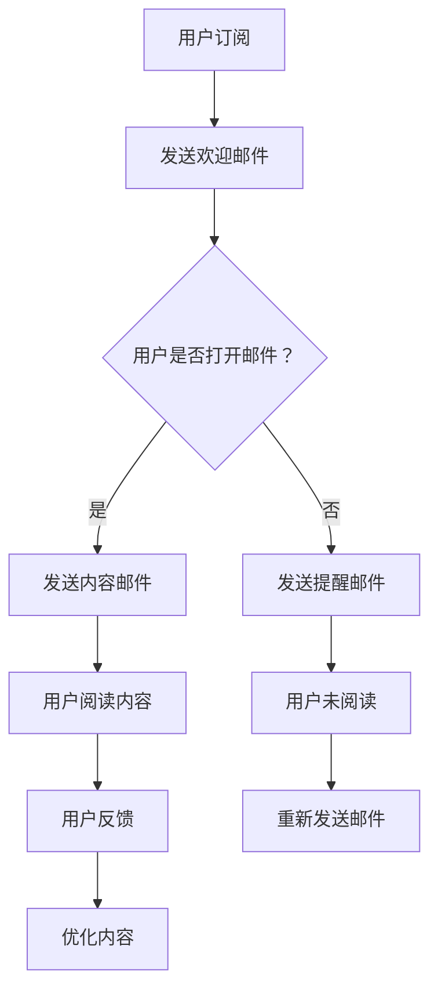

                 

关键词：电子邮件营销、知识付费、程序员、策略、技巧、实践、案例分析

> 摘要：本文将深入探讨程序员如何通过电子邮件营销实现知识付费。我们将从背景、核心概念、算法原理、数学模型、项目实践、实际应用、工具资源推荐以及未来展望等方面，全面解析这一策略的各个方面。

## 1. 背景介绍

在数字化时代，知识付费已成为一种流行的商业模式。程序员作为技术领域的核心力量，他们不仅需要不断更新自己的知识体系，还希望通过分享自己的知识和技能来创造价值。而电子邮件营销作为一种高效的营销手段，为程序员提供了一个便捷的途径来实现知识付费。

### 1.1 知识付费的定义与现状

知识付费指的是用户为获取专业知识或技能而付费的行为。随着互联网的发展，知识付费平台如雨后春笋般涌现，满足了用户对优质内容的强烈需求。程序员的知识付费主要体现在在线课程、电子书籍、直播讲座等形式上。

### 1.2 电子邮件营销的兴起

电子邮件营销是一种通过发送电子邮件来推广产品或服务的营销方式。它具有成本低、覆盖面广、互动性强等优点，成为许多企业首选的营销手段。对于程序员而言，电子邮件营销不仅可以帮助他们建立个人品牌，还能有效地推广自己的知识付费产品。

## 2. 核心概念与联系

为了更好地理解电子邮件营销在知识付费中的应用，我们需要了解一些核心概念，并展示其之间的联系。

### 2.1 电子邮件营销的概念

电子邮件营销是指利用电子邮件与潜在或现有客户进行沟通、建立关系并促进销售的过程。其主要形式包括：

- **新闻简报**：定期向订阅者发送包含新闻、文章、优惠信息等内容。
- **促销邮件**：针对特定产品或服务的营销邮件。
- **确认邮件**：用于确认交易或订阅等行为的邮件。
- **忠诚度邮件**：用于维护客户关系、提高客户忠诚度的邮件。

### 2.2 知识付费与电子邮件营销的联系

- **用户获取**：通过电子邮件营销，程序员可以吸引潜在用户关注自己的知识付费产品。
- **用户留存**：定期发送有价值的内容，可以增加用户的粘性，提高转化率。
- **客户反馈**：通过电子邮件收集用户反馈，优化知识付费产品和服务。

### 2.3 Mermaid 流程图

下面是一个展示电子邮件营销在知识付费中应用流程的Mermaid流程图：



## 3. 核心算法原理 & 具体操作步骤

### 3.1 算法原理概述

电子邮件营销的核心在于数据的收集和分析。以下是几个关键步骤：

- **用户行为分析**：通过分析用户在邮件中的行为，如打开、点击、转发等，了解用户的兴趣和偏好。
- **邮件内容优化**：根据用户行为数据，调整邮件内容，提高打开率和点击率。
- **自动化流程**：利用自动化工具，实现邮件的发送和跟进，节省人力成本。

### 3.2 算法步骤详解

1. **收集用户数据**：通过网站、社交媒体、活动等方式收集潜在用户的电子邮件地址。
2. **构建邮件列表**：将收集到的电子邮件地址导入邮件营销工具，建立邮件列表。
3. **设计邮件模板**：根据知识付费产品的特点，设计吸引人的邮件模板。
4. **发送欢迎邮件**：用户订阅后，立即发送欢迎邮件，建立良好印象。
5. **定期发送内容邮件**：定期发送包含有价值内容（如文章、视频链接等）的邮件。
6. **分析邮件数据**：通过分析邮件的打开率、点击率等数据，优化邮件内容。
7. **自动化跟进**：根据用户行为，自动化发送跟进邮件，提高用户参与度。

### 3.3 算法优缺点

#### 优点

- **成本低**：电子邮件营销相比其他营销方式，成本较低。
- **覆盖面广**：电子邮件是一种广泛使用的通讯工具，覆盖面广。
- **灵活性强**：可以根据用户行为实时调整邮件内容。

#### 缺点

- **邮件过滤**：用户可能会将邮件误认为是垃圾邮件，导致邮件无法送达。
- **效果评估困难**：与传统营销方式相比，电子邮件营销的效果评估较为困难。

### 3.4 算法应用领域

- **在线教育**：通过电子邮件营销，推广在线课程和培训。
- **软件产品**：通过电子邮件营销，推广软件产品和服务。
- **技术咨询**：通过电子邮件营销，推广咨询服务。

## 4. 数学模型和公式 & 详细讲解 & 举例说明

### 4.1 数学模型构建

在电子邮件营销中，我们可以使用以下数学模型来评估邮件营销的效果：

\[ E = \frac{C \times L \times O \times P}{1 + R} \]

其中：

- \( E \)：邮件营销效果
- \( C \)：邮件成本
- \( L \)：邮件送达率
- \( O \)：打开率
- \( P \)：点击率
- \( R \)：响应率

### 4.2 公式推导过程

该公式的推导过程如下：

1. \( C \)：邮件成本，包括邮件发送平台费用、邮件模板设计费用等。
2. \( L \)：邮件送达率，即邮件送达用户邮箱的比例。
3. \( O \)：打开率，即用户打开邮件的比例。
4. \( P \)：点击率，即用户点击邮件中链接的比例。
5. \( R \)：响应率，即用户对邮件产生响应的比例。

通过上述因素的综合计算，可以得到邮件营销的效果。

### 4.3 案例分析与讲解

假设我们有一个电子邮件营销案例，数据如下：

- \( C = 100 \) 元
- \( L = 90\% \)
- \( O = 20\% \)
- \( P = 5\% \)
- \( R = 1\% \)

代入公式计算：

\[ E = \frac{100 \times 0.9 \times 0.2 \times 0.05}{1 + 0.01} \approx 8.57 \]

这意味着，这次电子邮件营销的效果为8.57元。

## 5. 项目实践：代码实例和详细解释说明

### 5.1 开发环境搭建

在本节中，我们将使用Python语言和几个常用的库（如`requests`、`BeautifulSoup`、`pandas`等）来搭建一个简单的电子邮件营销系统。以下是所需的环境搭建步骤：

1. 安装Python 3.8及以上版本。
2. 安装相关库：`pip install requests beautifulsoup4 pandas`
3. 配置邮件发送服务，如使用SMTP服务。

### 5.2 源代码详细实现

下面是一个简单的电子邮件营销系统的示例代码：

```python
import smtplib
from email.mime.text import MIMEText
from email.header import Header

def send_email(subject, content, to_email):
    # SMTP服务器配置
    smtp_server = "smtp.example.com"
    smtp_port = 587
    smtp_user = "your_email@example.com"
    smtp_password = "your_password"

    # 创建邮件对象
    msg = MIMEText(content, "plain", "utf-8")
    msg["Subject"] = Header(subject, "utf-8")
    msg["From"] = smtp_user
    msg["To"] = to_email

    # 发送邮件
    try:
        server = smtplib.SMTP(smtp_server, smtp_port)
        server.starttls()
        server.login(smtp_user, smtp_password)
        server.send_message(msg)
        print("邮件发送成功！")
    except smtplib.SMTPException as e:
        print("邮件发送失败：", e)
    finally:
        server.quit()

# 发送邮件示例
send_email("欢迎订阅", "感谢您订阅我们的知识付费服务，我们将定期为您发送有价值的内容。", "user@example.com")
```

### 5.3 代码解读与分析

- **MIMEText**：用于创建邮件内容，其中`"plain"`表示邮件内容为纯文本格式。
- **Header**：用于设置邮件标题，支持中文字符编码。
- **SMTP**：用于发送邮件，其中`starttls()`用于启用安全传输层协议。
- **try-except-finally**：用于处理邮件发送过程中的异常，确保邮件发送过程的安全性和稳定性。

### 5.4 运行结果展示

运行上述代码后，将向指定邮箱发送一封欢迎邮件。如果邮件发送成功，将输出"邮件发送成功！"提示。

## 6. 实际应用场景

### 6.1 在线教育

在线教育机构可以通过电子邮件营销向用户推荐课程、发布教学资源和通知课程更新。通过个性化邮件内容，提高用户参与度和满意度。

### 6.2 软件开发

软件公司可以通过电子邮件营销向客户介绍新产品、提供技术支持和服务更新。同时，可以通过邮件收集用户反馈，优化产品和服务。

### 6.3 技术咨询

技术咨询公司可以通过电子邮件营销推广咨询服务，向潜在客户介绍服务内容、优势和案例。通过定期发送有价值的内容，建立专业形象。

## 7. 工具和资源推荐

### 7.1 学习资源推荐

- 《电子邮件营销：策略、技巧与实践》
- 《Python 电子邮件编程》
- 《如何通过电子邮件营销实现商业增长》

### 7.2 开发工具推荐

- **Mailchimp**：一款功能强大的电子邮件营销工具，提供模板、自动化流程等。
- **SendGrid**：专业的电子邮件服务提供商，提供API接口和丰富的邮件分析功能。
- **HubSpot**：一款集成营销平台，包括电子邮件营销、社交媒体管理等功能。

### 7.3 相关论文推荐

- “Email Marketing: A Guide to Best Practices”
- “The Impact of Email Marketing on Customer Relationships”
- “A Study on the Effectiveness of Email Marketing in E-commerce”

## 8. 总结：未来发展趋势与挑战

### 8.1 研究成果总结

电子邮件营销在知识付费领域表现出良好的效果，通过个性化内容和自动化流程，实现了用户获取、用户留存和客户反馈的有机结合。

### 8.2 未来发展趋势

随着人工智能和大数据技术的发展，电子邮件营销将更加智能化和个性化。同时，邮件营销工具将提供更多功能和更丰富的数据分析能力。

### 8.3 面临的挑战

邮件过滤、隐私保护、法律法规合规等仍然是电子邮件营销面临的主要挑战。如何提高邮件送达率和用户参与度，将是未来研究的重要方向。

### 8.4 研究展望

结合人工智能和大数据技术，开发更加智能和高效的电子邮件营销系统，将有助于提升知识付费产品的市场竞争力。

## 9. 附录：常见问题与解答

### 9.1 电子邮件营销是否合法？

电子邮件营销需要遵守相关法律法规，如《中华人民共和国网络安全法》和《中华人民共和国电信与信息服务管理条例》。未经用户同意，不得向其发送商业邮件。

### 9.2 如何避免邮件被误认为垃圾邮件？

- 使用合法渠道获取邮件地址。
- 遵循邮件发送规则，如限制发送频率和内容质量。
- 使用专业的邮件营销工具，优化邮件格式和内容。

### 9.3 电子邮件营销的效果如何评估？

可以通过以下指标评估电子邮件营销效果：邮件送达率、打开率、点击率、响应率等。同时，结合销售数据，分析邮件营销对整体业务的影响。

---

作者：禅与计算机程序设计艺术 / Zen and the Art of Computer Programming

---

以上，就是关于“程序员如何利用电子邮件营销进行知识付费”的详细文章内容。通过本文的阐述，相信读者可以了解到电子邮件营销在知识付费领域的应用策略、实践方法以及未来发展趋势。希望本文对您在技术领域的发展有所帮助。

