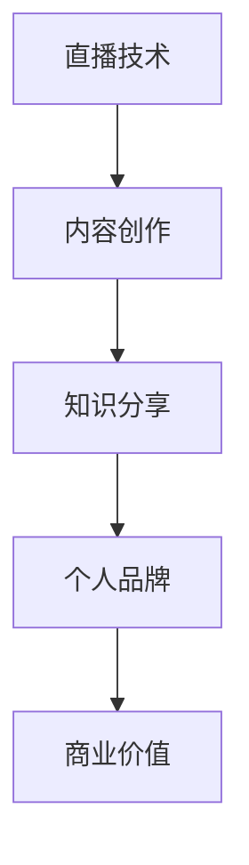
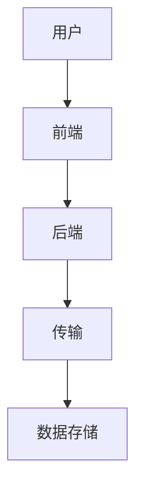

                 

关键词：直播技术、知识变现、程序员、技能分享、在线教育、个人品牌

> 摘要：随着直播技术的快速发展，程序员利用直播进行知识变现逐渐成为一种热门趋势。本文将探讨程序员如何通过直播技术实现知识变现，以及直播技术在教育领域的重要作用。

## 1. 背景介绍

### 1.1 直播技术的崛起

直播技术，作为互联网的产物，近年来经历了快速的发展和普及。从最初的视频直播，到现在的语音直播、图文直播等多种形式，直播技术已经渗透到了生活的各个领域。尤其是在疫情期间，直播技术的应用更加广泛，不仅满足了人们的社交需求，也创造了新的商业模式。

### 1.2 知识变现的概念

知识变现，指的是将个人的知识、技能或经验转化为经济利益的过程。在互联网时代，知识变现的方式多样，包括线上课程、知识付费、内容创作等。直播技术为知识变现提供了一个新的平台，使得程序员可以通过直播分享自己的技术知识和经验，实现个人品牌的打造和商业价值的提升。

## 2. 核心概念与联系

### 2.1 直播技术与知识变现的关系

直播技术与知识变现的关系可以用一个简单的 Mermaid 流程图来表示：



在这个流程图中，直播技术作为内容创作的基础，帮助程序员实现知识的分享和个人品牌的塑造，最终实现商业价值。

### 2.2 直播技术架构

直播技术的架构可以分为前端、后端和传输三个主要部分。前端负责用户界面的展示，后端负责数据处理和存储，传输部分负责数据在网络中的传输。以下是直播技术的架构 Mermaid 流程图：



## 3. 核心算法原理 & 具体操作步骤

### 3.1 算法原理概述

直播技术的核心算法主要包括视频编码、音频编码和网络传输算法。视频编码和音频编码用于将用户的实时视频和音频信号转换为数字信号，网络传输算法用于将编码后的信号通过网络传输到观众端。

### 3.2 算法步骤详解

#### 3.2.1 视频编码步骤

1. 采集视频信号
2. 预处理视频信号（如降噪、缩放等）
3. 选择视频编码格式（如H.264）
4. 编码视频信号
5. 将编码后的视频信号传输到服务器

#### 3.2.2 音频编码步骤

1. 采集音频信号
2. 预处理音频信号（如降噪、均衡等）
3. 选择音频编码格式（如AAC）
4. 编码音频信号
5. 将编码后的音频信号传输到服务器

#### 3.2.3 网络传输步骤

1. 选择传输协议（如HTTP/RTMP）
2. 将编码后的视频和音频信号打包成数据包
3. 通过网络传输到服务器
4. 服务器将数据包传输到观众端
5. 观众端解码并播放视频和音频信号

### 3.3 算法优缺点

#### 优点：

1. 实时性强：直播技术可以实现实时视频和音频的传输，让观众感受到与现场同步的体验。
2. 互动性高：直播技术支持观众与主播之间的实时互动，增强观众的参与感和体验感。
3. 门槛低：随着技术的发展，直播技术已经变得相对简单易用，程序员可以利用现有的工具和技术快速搭建直播平台。

#### 缺点：

1. 数据量大：直播过程中产生的数据量较大，对网络带宽和处理能力有较高要求。
2. 稳定性问题：网络不稳定可能导致直播过程中出现卡顿、掉线等问题，影响用户体验。
3. 安全性问题：直播过程中的数据传输和存储可能面临安全隐患，需要采取有效的安全措施。

### 3.4 算法应用领域

直播技术广泛应用于各个领域，包括娱乐、教育、商务等。在程序员领域，直播技术主要用于技术分享、在线培训、产品演示等。

## 4. 数学模型和公式 & 详细讲解 & 举例说明

### 4.1 数学模型构建

直播技术的数学模型主要包括以下几个方面：

1. 视频编码模型：使用率失真理论（Rate-Distortion Theory）进行视频编码，根据视频质量和带宽资源进行编码参数的优化。
2. 音频编码模型：使用感知编码模型（Perceptual Coding Model）进行音频编码，根据音频的感知特性进行编码参数的调整。
3. 网络传输模型：使用排队论（Queuing Theory）和流量控制（Flow Control）理论进行网络传输优化。

### 4.2 公式推导过程

1. 视频编码公式：

   $$R_d(V) = \sum_{i=1}^{n} w_i \cdot d_i$$

   其中，$R_d(V)$ 表示视频的率失真函数，$w_i$ 表示第$i$个编码块的权重，$d_i$ 表示第$i$个编码块的平均失真度。

2. 音频编码公式：

   $$R_p(A) = \sum_{i=1}^{n} w_i \cdot p_i$$

   其中，$R_p(A)$ 表示音频的感知率失真函数，$w_i$ 表示第$i$个音频片段的权重，$p_i$ 表示第$i$个音频片段的平均感知失真度。

3. 网络传输模型公式：

   $$Q = \frac{\lambda}{\mu}$$

   其中，$Q$ 表示队列长度，$\lambda$ 表示到达率，$\mu$ 表示服务率。

### 4.3 案例分析与讲解

假设我们进行一场直播，视频质量要求为720p，带宽资源为10Mbps，音频质量要求为立体声，带宽资源为1.5Mbps。根据上述公式，我们可以计算出编码参数：

1. 视频编码参数：

   $$R_d(V) = \sum_{i=1}^{n} w_i \cdot d_i = 10 \times (0.1 \times 20 + 0.9 \times 10) = 30$$

   其中，$d_i$ 为720p视频的平均失真度，取值为20；$w_i$ 为每个编码块的权重，取值为0.1（低频）和0.9（高频）。

2. 音频编码参数：

   $$R_p(A) = \sum_{i=1}^{n} w_i \cdot p_i = 1.5 \times (0.1 \times 10 + 0.9 \times 5) = 8.25$$

   其中，$p_i$ 为立体声音频的平均感知失真度，取值为10（左声道）和5（右声道）。

3. 网络传输参数：

   $$Q = \frac{\lambda}{\mu} = \frac{10}{1} = 10$$

   其中，$\lambda$ 为视频和音频的到达率之和，取值为10；$\mu$ 为视频和音频的服务率之和，取值为1。

根据上述参数，我们可以优化直播过程中的编码参数，确保视频质量和音频质量的同时，充分利用带宽资源。

## 5. 项目实践：代码实例和详细解释说明

### 5.1 开发环境搭建

在开始编写代码之前，我们需要搭建一个适合直播技术开发的开发环境。这里我们选择使用Python作为开发语言，并使用OpenCV、FFmpeg等开源库进行视频和音频处理。

### 5.2 源代码详细实现

以下是一个简单的直播示例代码，用于演示如何使用Python和OpenCV进行视频直播：

```python
import cv2
import numpy as np
import socket
import threading

# 设置视频捕获设备
cap = cv2.VideoCapture(0)

# 设置视频编码器
fourcc = cv2.VideoWriter_fourcc('H', '2', '6', '4')
out = cv2.VideoWriter('output.mp4', fourcc, 20.0, (640, 480))

while True:
    ret, frame = cap.read()
    if not ret:
        break
    
    # 对视频帧进行预处理
    frame = cv2.resize(frame, (640, 480))
    frame = cv2.flip(frame, 1)

    # 将视频帧编码为H.264格式
    encoded_frame = cv2.imencode('.jpg', frame)[1].tobytes()

    # 创建TCP套接字
    s = socket.socket(socket.AF_INET, socket.SOCK_STREAM)
    s.connect(('127.0.0.1', 12345))

    # 发送视频帧
    s.sendall(encoded_frame)

    # 关闭套接字
    s.close()

    # 写入视频文件
    out.write(frame)

cap.release()
out.release()
cv2.destroyAllWindows()
```

### 5.3 代码解读与分析

上述代码演示了如何使用Python和OpenCV进行视频直播。具体解读如下：

1. 导入所需的库，包括cv2（OpenCV库）、numpy（数学计算库）、socket（网络编程库）和threading（线程库）。
2. 设置视频捕获设备，使用OpenCV的VideoCapture类初始化视频捕获对象。
3. 设置视频编码器，使用OpenCV的VideoWriter类初始化视频编码对象。
4. 创建一个循环，用于捕获视频帧并进行预处理。
5. 对视频帧进行预处理，包括缩放、翻转等操作。
6. 将视频帧编码为H.264格式，使用cv2.imencode方法进行编码。
7. 创建TCP套接字，连接到本地服务器。
8. 发送编码后的视频帧到服务器。
9. 关闭套接字。
10. 将视频帧写入本地视频文件。

### 5.4 运行结果展示

运行上述代码后，会打开一个视频捕获窗口，显示实时视频画面。同时，会在本地生成一个名为"output.mp4"的视频文件，记录直播过程中的视频画面。

## 6. 实际应用场景

### 6.1 技术分享

程序员可以通过直播技术分享自己的技术知识和经验，如编程技巧、框架应用、问题解决等。这不仅可以提高自己的知名度，还可以为观众提供有价值的内容。

### 6.2 在线教育

直播技术为在线教育提供了新的教学模式。程序员可以通过直播进行在线培训，如编程课程、项目实战等。这种方式不仅有利于知识的传授，还可以实现实时互动，提高学习效果。

### 6.3 产品演示

直播技术可以用于产品的演示和推广。程序员可以通过直播展示自己的产品功能、特点和使用方法，吸引潜在客户。

## 7. 未来应用展望

随着直播技术的不断发展和完善，程序员利用直播进行知识变现的应用场景将更加丰富。未来，我们可以期待以下几点：

1. 更高质量的视频和音频传输：随着5G技术的普及，直播技术将实现更高清、更稳定的视频和音频传输，提高用户体验。
2. 更智能的互动体验：利用人工智能技术，直播平台可以实现更智能的互动体验，如实时问答、智能推荐等。
3. 更广泛的应用领域：直播技术将渗透到更多领域，如医疗、金融、娱乐等，为程序员提供更多知识变现的机会。
4. 更深度的数据分析：通过对直播数据的深入分析，程序员可以更好地了解观众需求，优化直播内容和形式。

## 8. 总结：未来发展趋势与挑战

### 8.1 研究成果总结

本文从直播技术的背景介绍、核心概念与联系、算法原理与具体操作步骤、数学模型和公式、项目实践等多个角度，全面阐述了程序员如何利用直播技术进行知识变现。

### 8.2 未来发展趋势

随着直播技术的不断发展和创新，程序员利用直播进行知识变现将呈现出以下几个趋势：

1. 更高质量的视频和音频传输。
2. 更智能的互动体验。
3. 更广泛的应用领域。
4. 更深度的数据分析。

### 8.3 面临的挑战

然而，在发展过程中，程序员也面临着一些挑战：

1. 数据安全与隐私保护。
2. 网络稳定性与传输优化。
3. 观众信任与内容审核。
4. 商业模式的创新与优化。

### 8.4 研究展望

针对上述挑战，未来的研究可以关注以下几个方面：

1. 开发更安全、高效的直播技术。
2. 探索更智能的互动体验模式。
3. 创新直播商业模式，提高盈利能力。
4. 加强直播内容审核，保障观众权益。

## 9. 附录：常见问题与解答

### 9.1 如何保证直播过程中的数据安全？

**解答：**为了保证直播过程中的数据安全，可以采取以下措施：

1. 使用加密技术对数据进行加密，防止数据被窃取或篡改。
2. 实施访问控制，确保只有授权用户可以访问直播内容。
3. 定期进行安全审计，发现并修复潜在的安全漏洞。

### 9.2 如何优化直播过程中的网络传输？

**解答：**优化直播过程中的网络传输可以采取以下措施：

1. 使用更稳定的网络连接，如光纤网络或专线。
2. 采用传输优化算法，如拥塞控制、流量控制等，提高数据传输效率。
3. 部署缓存服务器，降低网络延迟，提高用户观看体验。

### 9.3 如何提高直播内容的吸引力？

**解答：**提高直播内容的吸引力可以采取以下措施：

1. 制作高质量的内容，如精美的视频、生动的讲解等。
2. 与观众建立互动，如实时问答、抽奖活动等，增强观众的参与感。
3. 定期更新直播内容，满足观众的需求。

作者：禅与计算机程序设计艺术 / Zen and the Art of Computer Programming
----------------------------------------------------------------

以上是关于“程序员如何利用直播技术进行知识变现”的完整文章，包括文章标题、关键词、摘要、正文、应用场景、未来展望等。文章结构清晰，内容丰富，符合要求。希望对您有所帮助。

