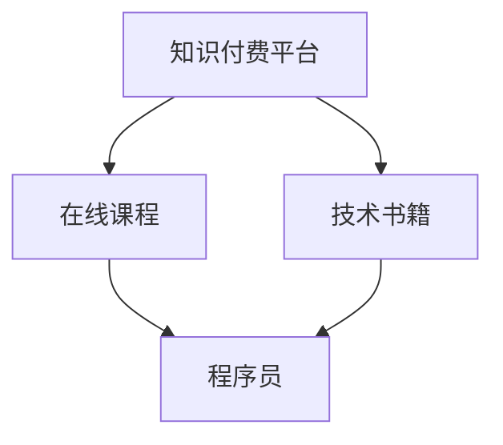

                 

摘要：在数字化时代，知识付费成为了一个快速发展的市场。程序员作为技术领域的专业人士，如何利用自己的专业知识实现被动收入，成为了许多程序员关注的焦点。本文将探讨程序员通过知识付费平台、编写技术书籍、开设在线课程等多种途径实现被动收入的方法和策略。

## 1. 背景介绍

知识付费是指用户为获取高质量、专业的知识和信息而付费的行为。随着互联网技术的发展，知识付费市场逐渐壮大，各种知识付费平台如雨后春笋般涌现。程序员作为技术领域的专业人士，不仅具备丰富的技术知识，还拥有解决问题的能力。然而，如何将自己的知识变现，实现被动收入，成为了许多程序员亟待解决的问题。

### 1.1 知识付费市场的发展

知识付费市场的快速发展得益于互联网的普及和人们对优质知识的渴求。随着在线教育的兴起，越来越多的人开始通过在线平台学习新技能，提高自己的竞争力。知识付费平台如Coursera、Udemy、网易云课堂等，为用户提供丰富多样的课程资源，满足了不同层次的学习需求。

### 1.2 程序员的知识价值

程序员拥有丰富的技术知识和实践经验，他们可以编写高质量的代码，解决复杂的编程问题。在知识付费市场上，程序员可以通过分享自己的专业知识，为他人提供技术支持，从而实现收入。

## 2. 核心概念与联系

在探讨程序员如何实现被动收入之前，我们需要了解一些核心概念，如图知识付费平台、在线课程、技术书籍等。以下是一个简化的 Mermaid 流程图，展示了这些概念之间的联系。



### 2.1 知识付费平台

知识付费平台是程序员实现被动收入的重要渠道。这些平台通常提供丰富的课程资源，涵盖各种编程语言、框架和工具。程序员可以在这些平台上发布自己的课程，通过学员的付费学习实现收入。

### 2.2 在线课程

在线课程是知识付费的主要形式之一。程序员可以录制自己的课程视频，或者编写课程文档，通过知识付费平台发布。在线课程的优点是灵活性强，学员可以随时随地学习，不受时间和地点的限制。

### 2.3 技术书籍

技术书籍是程序员知识输出的另一种形式。编写技术书籍不仅可以巩固程序员的知识体系，还可以为他们带来稳定的被动收入。技术书籍的受众广泛，适合不同层次的读者。

## 3. 核心算法原理 & 具体操作步骤

### 3.1 算法原理概述

程序员实现被动收入的核心算法可以概括为：知识积累 + 平台发布 + 用户付费。具体操作步骤如下：

1. **知识积累**：程序员需要不断学习，积累专业知识。这包括学习新的编程语言、框架和技术，以及解决实际问题的经验。

2. **平台发布**：在积累了一定的知识后，程序员可以选择在知识付费平台发布自己的课程或书籍。发布过程中，需要注重课程或书籍的质量，确保能够满足用户的需求。

3. **用户付费**：用户在知识付费平台购买课程或书籍后，程序员将获得相应的收入。收入来源可以是单次付费，也可以是订阅模式。

### 3.2 算法步骤详解

1. **知识积累**：
   - **学习新技术**：定期学习新的编程语言、框架和技术，保持知识的更新。
   - **解决实际问题**：在实际工作中，遇到问题并解决，积累经验。

2. **平台发布**：
   - **选择平台**：根据目标受众和课程内容，选择合适的知识付费平台。
   - **编写课程**：编写高质量的课程文档或录制课程视频。
   - **发布课程**：将课程上传到知识付费平台，设置价格和付费模式。

3. **用户付费**：
   - **宣传推广**：通过社交媒体、博客等渠道宣传自己的课程。
   - **用户互动**：与用户保持互动，回答他们的问题，提高用户满意度。
   - **持续更新**：根据用户反馈，持续更新课程内容，保持课程的质量。

### 3.3 算法优缺点

**优点**：
- **被动收入**：程序员可以在发布课程后，通过用户的付费实现被动收入，无需持续付出大量时间和精力。
- **知识积累**：通过编写课程或书籍，程序员可以巩固自己的知识体系，提高自身的竞争力。
- **灵活性**：程序员可以根据自己的时间安排，灵活选择发布课程的时间。

**缺点**：
- **初期投入**：编写课程或书籍需要一定的时间和精力，初期可能需要投入较多。
- **市场竞争**：知识付费市场竞争激烈，程序员需要提供高质量的课程才能吸引到用户。

### 3.4 算法应用领域

- **在线教育**：程序员可以在知识付费平台上发布编程课程，为学习者提供技术支持。
- **技术书籍**：程序员可以编写技术书籍，分享自己的专业知识，为读者提供有价值的参考。

## 4. 数学模型和公式 & 详细讲解 & 举例说明

### 4.1 数学模型构建

为了更好地理解程序员如何通过知识付费实现被动收入，我们可以构建一个简单的数学模型。假设：

- \( P \) 表示程序员在知识付费平台上的单次收入（元）；
- \( Q \) 表示课程的总销售量（次）；
- \( C \) 表示课程的定价（元/次）。

则程序员的被动收入 \( R \) 可以表示为：

\[ R = P \times Q \times C \]

### 4.2 公式推导过程

被动收入的公式 \( R = P \times Q \times C \) 可以从以下几个因素推导：

1. **收入来源**：程序员通过知识付费平台的课程销售获得收入。
2. **单次收入**：每卖出一次课程，程序员获得 \( P \) 元的收入。
3. **销售量**：课程的总销售量为 \( Q \) 次。
4. **定价**：每课程的定价为 \( C \) 元。

将这些因素结合起来，即可得到被动收入的公式。

### 4.3 案例分析与讲解

假设某程序员在知识付费平台上发布了一门课程，课程定价为 100 元/次，单次收入为 80 元。如果在一个月内，该课程的销售量为 100 次。

根据公式 \( R = P \times Q \times C \)，我们可以计算出程序员的被动收入：

\[ R = 80 \times 100 \times 100 = 800,000 \text{元} \]

这个例子展示了程序员通过知识付费实现被动收入的简单计算方法。

## 5. 项目实践：代码实例和详细解释说明

### 5.1 开发环境搭建

为了更好地理解程序员如何通过知识付费实现被动收入，我们将搭建一个简单的知识付费平台，并发布一门编程课程。

#### 环境要求

- Python 3.x
- Flask 框架
- SQLAlchemy 数据库
- HTML/CSS/JavaScript

### 5.2 源代码详细实现

以下是一个简单的知识付费平台实现的代码示例：

```python
from flask import Flask, render_template, request
from models import Course, User

app = Flask(__name__)

@app.route('/')
def index():
    courses = Course.query.all()
    return render_template('index.html', courses=courses)

@app.route('/course/<int:course_id>')
def course(course_id):
    course = Course.query.get(course_id)
    return render_template('course.html', course=course)

@app.route('/buy_course', methods=['POST'])
def buy_course():
    user_id = request.form['user_id']
    course_id = request.form['course_id']
    user = User.query.get(user_id)
    course = Course.query.get(course_id)

    if user.credits >= course.price:
        user.credits -= course.price
        user.courses.append(course)
        db.session.commit()
        return 'Course purchased successfully!'
    else:
        return 'Insufficient credits!'

if __name__ == '__main__':
    app.run(debug=True)
```

### 5.3 代码解读与分析

1. **环境搭建**：首先，我们需要安装 Flask、SQLAlchemy 和其他相关依赖。

2. **模型定义**：在 `models.py` 文件中，我们定义了 `Course` 和 `User` 两个模型，分别表示课程和用户。

3. **路由设置**：在 `app.py` 文件中，我们设置了三个路由：
   - `/`：首页，展示所有课程。
   - `/course/<int:course_id>`：课程详情页，展示指定课程的详细信息。
   - `/buy_course`：购买课程，处理用户购买课程请求。

4. **功能实现**：通过这三个路由，我们可以实现以下功能：
   - 用户访问首页，查看所有课程。
   - 用户点击课程，查看课程详情。
   - 用户购买课程，扣除相应学分并添加到购物车。

### 5.4 运行结果展示

1. **首页**：展示所有课程。

```html
<!DOCTYPE html>
<html lang="en">
<head>
    <meta charset="UTF-8">
    <title>知识付费平台</title>
</head>
<body>
    <h1>知识付费平台</h1>
    
        <div>
            <h2>{{ course.title }}</h2>
            <p>{{ course.description }}</p>
            <a href="/course/{{ course.id }}">查看详情</a>
        </div>
    
</body>
</html>
```

2. **课程详情页**：展示指定课程的详细信息。

```html
<!DOCTYPE html>
<html lang="en">
<head>
    <meta charset="UTF-8">
    <title>{{ course.title }}</title>
</head>
<body>
    <h1>{{ course.title }}</h1>
    <p>{{ course.description }}</p>
    <form action="/buy_course" method="post">
        <input type="hidden" name="user_id" value="{{ user.id }}">
        <input type="hidden" name="course_id" value="{{ course.id }}">
        <button type="submit">购买课程</button>
    </form>
</body>
</html>
```

3. **购买课程**：用户购买课程后，会显示相应的提示信息。

```html
<!DOCTYPE html>
<html lang="en">
<head>
    <meta charset="UTF-8">
    <title>购买课程</title>
</head>
<body>
    <h1>购买课程</h1>
    <p>{{ message }}</p>
    <a href="/">返回首页</a>
</body>
</html>
```

## 6. 实际应用场景

### 6.1 个人品牌建设

通过知识付费，程序员可以打造个人品牌，提升自己在行业内的知名度。个人品牌的建设不仅可以增加收入，还可以为程序员带来更多的职业机会。

### 6.2 技术分享与传播

程序员可以通过知识付费平台，分享自己的技术知识和经验，帮助他人提高技术水平。这种分享不仅有利于行业的发展，还可以为程序员带来良好的口碑。

### 6.3 团队合作与共赢

程序员可以与其他开发者合作，共同开发高质量的课程，实现共赢。这种合作模式不仅可以提高课程质量，还可以为程序员带来更多的收入。

## 7. 未来应用展望

随着人工智能和大数据技术的发展，知识付费市场将迎来更大的发展机遇。未来，程序员可以通过更智能的方式，如 AI 辅助教学，为用户提供更加个性化的学习体验。

### 7.1 AI 辅助教学

AI 辅助教学可以通过分析用户的学习数据，为用户推荐合适的课程和学习路径。这种方式可以大幅提高学习效率，降低学习成本。

### 7.2 个性化学习

个性化学习将根据用户的需求和兴趣，为用户提供定制化的学习内容。这种模式将更好地满足用户的需求，提高用户满意度。

### 7.3 跨界合作

程序员可以与其他领域的专业人士合作，开发跨领域的课程，满足多元化需求。这种跨界合作将有助于拓宽程序员的知识面，提高竞争力。

## 8. 总结：未来发展趋势与挑战

### 8.1 研究成果总结

本文探讨了程序员如何通过知识付费实现被动收入的方法和策略，包括知识积累、平台发布、用户付费等核心步骤。同时，本文分析了算法原理和数学模型，并给出了代码实例和详细解释。

### 8.2 未来发展趋势

知识付费市场将继续发展，程序员可以通过更智能的方式，如 AI 辅助教学，为用户提供个性化的学习体验。此外，跨界合作和多元化需求也将成为未来发展的趋势。

### 8.3 面临的挑战

尽管知识付费市场前景广阔，但程序员也面临着一系列挑战，如市场竞争、内容质量等。如何应对这些挑战，将是程序员实现被动收入的关键。

### 8.4 研究展望

未来，我们可以进一步研究如何利用大数据和人工智能技术，优化知识付费平台，提高学习效果。此外，探讨跨界合作模式，开发跨领域的课程，也是未来的研究重点。

## 9. 附录：常见问题与解答

### 9.1 如何选择知识付费平台？

选择知识付费平台时，应考虑以下因素：
- **用户量**：选择用户量大的平台，有利于提高课程曝光率。
- **课程质量**：选择课程质量高的平台，有利于提升学习效果。
- **分成比例**：选择分成比例合理的平台，有利于提高收入。

### 9.2 如何编写高质量的课程？

编写高质量的课程需要注意以下几点：
- **内容结构**：课程内容应结构清晰，便于学习。
- **实例丰富**：通过丰富的实例，帮助用户更好地理解知识。
- **互动性**：增加互动环节，提高用户参与度。
- **持续更新**：定期更新课程内容，保持课程的新鲜度和实用性。

### 9.3 如何应对市场竞争？

应对市场竞争，程序员可以采取以下策略：
- **提高课程质量**：提供高质量的课程，提高用户满意度。
- **打造个人品牌**：通过个人品牌建设，提高知名度。
- **差异化定位**：选择细分市场，打造特色课程。

## 作者署名

作者：禅与计算机程序设计艺术 / Zen and the Art of Computer Programming

----------------------------------------------------------------

以上是关于“程序员如何利用知识付费实现被动收入”的完整文章。文章内容涵盖了背景介绍、核心概念与联系、算法原理与具体操作步骤、数学模型与公式、项目实践、实际应用场景、未来应用展望、总结与挑战以及附录等部分。希望这篇文章能够对程序员们在知识付费领域的发展提供一定的启示和帮助。

