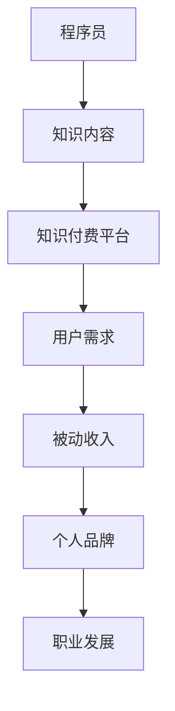

                 

在当今数字化时代，知识付费已经成为一种趋势，对于程序员来说，这不仅仅是一个获取收入的方式，更是提升个人品牌和职业价值的重要途径。本文将探讨程序员如何通过知识付费实现被动收入，详细解析其中的关键环节和策略。

> 关键词：程序员、知识付费、被动收入、个人品牌、职业发展

## 摘要

本文旨在为程序员提供一套系统化的策略，帮助他们在知识付费领域中实现被动收入。通过分析知识付费的原理、平台选择、内容创作、营销推广以及维护和升级等环节，本文将揭示程序员如何利用自己的专业技能和知识积累，打造可持续的被动收入流。

## 1. 背景介绍

随着互联网技术的飞速发展，知识付费市场呈现出爆炸式增长。越来越多的用户愿意为有价值的内容和服务付费，这为程序员提供了广阔的舞台。知识付费不仅包括在线课程、技术博客、专业文章，还涵盖了咨询服务、编程工具开发、软件定制等多个领域。

然而，对于大多数程序员来说，如何利用知识付费实现被动收入仍是一个难题。本文将帮助程序员了解知识付费市场的现状，掌握关键策略，实现职业发展的新突破。

### 1.1 知识付费的兴起

知识付费的兴起主要得益于以下几个方面：

- **用户需求增加**：随着知识经济时代的到来，用户对于高质量、专业化内容的需求日益增长。
- **互联网普及**：互联网的普及为知识付费提供了便捷的渠道和平台。
- **内容创作便利**：数字化工具和平台使得内容创作、编辑和分发变得更加高效。

### 1.2 程序员的机遇

对于程序员而言，知识付费市场蕴含着以下几个重要机遇：

- **专业技能变现**：程序员可以将其编程技能、项目经验转化为可销售的知识产品。
- **个人品牌建设**：通过知识付费，程序员可以提升个人知名度，建立强大的个人品牌。
- **职业发展**：知识付费不仅能够带来收入，还可以为程序员提供职业发展的新方向。

## 2. 核心概念与联系

在探讨程序员如何利用知识付费实现被动收入之前，我们需要了解一些核心概念和它们之间的联系。以下是一个简单的Mermaid流程图，用于描述这些概念及其关系：



### 2.1 知识内容

程序员的知识内容是他们成功的关键。这些内容可以包括：

- **技术教程**：如编程语言学习、框架应用、算法讲解等。
- **项目实战**：分享实际的编程项目和解决方案。
- **行业洞察**：对当前技术趋势、行业动态的分析和预测。

### 2.2 知识付费平台

知识付费平台是程序员实现被动收入的重要渠道。这些平台包括：

- **在线教育平台**：如Coursera、Udemy、网易云课堂等。
- **博客平台**：如Medium、CSDN、知乎专栏等。
- **专业社群**：如GitHub、Stack Overflow等。

### 2.3 用户需求

用户需求是知识付费市场的驱动力。程序员需要了解用户的需求，创作出符合市场需求的内容。

### 2.4 被动收入

被动收入是程序员通过知识付费实现的主要目标。这些收入可以来自课程的持续销售、咨询服务的重复购买、广告收入等。

### 2.5 个人品牌

个人品牌是程序员在知识付费市场中获得成功的关键。一个强大的个人品牌可以吸引更多的用户和机会。

### 2.6 职业发展

知识付费不仅能够带来收入，还可以为程序员的职业发展提供新方向。通过知识付费，程序员可以获得更多的曝光、合作机会和职业晋升。

## 3. 核心算法原理 & 具体操作步骤

### 3.1 算法原理概述

程序员通过知识付费实现被动收入的原理可以概括为以下几个步骤：

1. **内容创作**：根据用户需求和市场需求，创作高质量的知识内容。
2. **平台选择**：选择合适的知识付费平台，进行内容发布和推广。
3. **用户引流**：通过SEO、社交媒体等手段，吸引潜在用户。
4. **内容升级**：根据用户反馈和市场变化，持续优化和更新内容。
5. **收入变现**：通过课程销售、咨询服务等方式，实现收入变现。

### 3.2 算法步骤详解

1. **内容创作**
   - **确定主题**：根据个人优势和市场需求，选择合适的主题。
   - **准备素材**：收集相关的参考资料、代码示例等。
   - **编写内容**：使用专业的语言和结构，将知识内容系统化地表达出来。

2. **平台选择**
   - **评估平台**：根据平台的影响力、用户基数、内容分类等因素，选择合适的平台。
   - **注册账号**：在选定平台上注册账号，熟悉平台规则和操作流程。

3. **用户引流**
   - **SEO优化**：优化标题、关键词、内容结构等，提高内容在搜索引擎中的排名。
   - **社交媒体推广**：利用微博、微信、知乎等社交媒体平台，进行内容推广和互动。

4. **内容升级**
   - **收集反馈**：定期收集用户反馈，了解用户需求和市场变化。
   - **更新内容**：根据反馈，对内容进行优化和更新，提高内容的实用性和吸引力。

5. **收入变现**
   - **课程销售**：设置合理的课程价格，并通过平台进行销售。
   - **咨询服务**：提供专业的咨询服务，根据服务内容进行收费。
   - **广告收入**：利用平台的广告系统，通过广告收入增加额外收益。

### 3.3 算法优缺点

**优点**：

- **收入稳定**：被动收入可以持续产生，减少了对时间精力的依赖。
- **职业发展**：通过知识付费，程序员可以提升个人品牌，获得更多的职业机会。
- **技能提升**：在创作内容的过程中，程序员可以不断巩固和提升自己的技能。

**缺点**：

- **初期投入大**：创作高质量的内容需要大量的时间和精力。
- **市场波动**：知识付费市场存在一定的波动性，需要不断调整策略。

### 3.4 算法应用领域

- **在线教育**：如编程课程、数据分析课程等。
- **专业咨询**：如软件开发咨询、系统架构咨询等。
- **工具开发**：如编程工具、数据分析工具等。

## 4. 数学模型和公式 & 详细讲解 & 举例说明

在知识付费的过程中，一些数学模型和公式可以帮助程序员更好地理解和优化他们的收入策略。以下是一个简单的数学模型，用于描述程序员的收入增长：

### 4.1 数学模型构建

假设程序员的收入（R）由以下几个因素决定：

- **内容质量（Q）**：表示内容的受欢迎程度，通常与用户评价、点赞数等正相关。
- **市场影响力（M）**：表示程序员的知名度，通常与粉丝数、社交媒体关注者数等正相关。
- **内容更新频率（U）**：表示程序员持续更新内容的速度，通常与收入增长正相关。

收入增长模型可以表示为：

\[ R(t) = Q(t) \times M(t) \times U(t) \]

其中，\( R(t) \) 表示时间 \( t \) 时的收入，\( Q(t) \)、\( M(t) \)、\( U(t) \) 分别表示时间 \( t \) 时的内容质量、市场影响力和内容更新频率。

### 4.2 公式推导过程

为了推导这个模型，我们首先考虑以下几个假设：

1. **用户满意度与收入成正比**：用户满意度越高，用户愿意支付的费用越高。
2. **内容质量与用户满意度成正比**：内容质量越高，用户满意度越高。
3. **市场影响力与用户基数成正比**：市场影响力越大，潜在的用户基数越大。
4. **内容更新频率与用户活跃度成正比**：内容更新频率越高，用户的活跃度越高。

根据以上假设，我们可以得到以下关系：

\[ 收入 = 用户满意度 \times 用户基数 \]

进一步，我们可以将用户满意度、用户基数和内容更新频率表示为：

\[ 用户满意度 = 内容质量 \times 市场影响力 \]
\[ 用户基数 = 市场影响力 \]
\[ 用户活跃度 = 内容更新频率 \]

将以上关系代入收入公式，得到：

\[ 收入 = 内容质量 \times 市场影响力 \times 内容更新频率 \]

为了简化表达，我们引入变量 \( Q \)、\( M \) 和 \( U \) 分别表示内容质量、市场影响力和内容更新频率，得到：

\[ R(t) = Q(t) \times M(t) \times U(t) \]

### 4.3 案例分析与讲解

以下是一个具体的案例，假设程序员A在某个在线教育平台发布了关于Python编程的教程，教程质量高、更新频繁，同时在社交媒体上积极推广。通过以下数据，我们可以计算程序员A的收入增长：

- **内容质量（Q）**：根据用户评价和点赞数，内容质量得分为90分。
- **市场影响力（M）**：根据粉丝数和社交媒体关注者数，市场影响力得分为80分。
- **内容更新频率（U）**：每周发布一篇新的教程，内容更新频率得分为100分。

根据收入增长模型，我们可以计算出程序员A的收入增长：

\[ R(t) = Q(t) \times M(t) \times U(t) \]
\[ R(t) = 90 \times 80 \times 100 \]
\[ R(t) = 720,000 \]

这意味着在当前情况下，程序员A的月收入约为720,000元。

### 4.4 进一步优化

为了进一步提高收入，程序员A可以采取以下措施：

- **提高内容质量**：通过学习新的编程语言和技术，提高教程的专业性和实用性。
- **扩大市场影响力**：通过参与技术社区、发表专业文章等方式，提升个人知名度。
- **增加内容更新频率**：定期发布新的教程，保持内容的时效性和活跃度。

通过这些措施，程序员A的收入有望进一步增长。

## 5. 项目实践：代码实例和详细解释说明

为了更好地理解知识付费的实现过程，我们将通过一个实际的编程项目来讲解。以下是一个简单的Python教程项目，用于介绍如何利用知识付费实现被动收入。

### 5.1 开发环境搭建

在开始项目之前，我们需要搭建一个适合开发和发布的开发环境。以下是所需的工具和步骤：

- **Python环境**：安装Python 3.x版本。
- **代码编辑器**：如Visual Studio Code、PyCharm等。
- **版本控制工具**：如Git。
- **在线教育平台**：如Udemy、网易云课堂等。

### 5.2 源代码详细实现

以下是一个简单的Python项目，用于介绍如何利用知识付费实现被动收入。项目包括一个Python脚本，用于生成教程的代码示例和解释说明。

```python
# tutorial_generator.py

import random
import os

# 教程主题列表
topics = [
    "Python基础语法",
    "面向对象编程",
    "Web开发基础",
    "数据分析入门",
    "机器学习应用"
]

# 教程标题模板
title_templates = [
    "深入浅出{}",
    "{}实战技巧",
    "{}进阶指南",
    "{}项目实战",
    "{}案例分析"
]

# 生成教程标题
def generate_title(topic):
    template = random.choice(title_templates)
    return template.format(topic)

# 生成教程代码示例
def generate_code_example(topic):
    if topic == "Python基础语法":
        return "print('Hello, world!')"
    elif topic == "面向对象编程":
        return "class Person:\n    def __init__(self, name, age):\n        self.name = name\n        self.age = age\n    def say_hello(self):\n        print('Hello, my name is {}!'.format(self.name))"
    elif topic == "Web开发基础":
        return "from flask import Flask\napp = Flask(__name__)\n@app.route('/')\ndef hello():\n    return 'Hello, world!'\nif __name__ == '__main__':\n    app.run()"
    elif topic == "数据分析入门":
        return "import pandas as pd\ndata = {'name': ['Alice', 'Bob', 'Charlie'], 'age': [25, 30, 35]}\ndf = pd.DataFrame(data)\nprint(df)"
    elif topic == "机器学习应用":
        return "from sklearn.datasets import load_iris\nfrom sklearn.model_selection import train_test_split\nfrom sklearn.neighbors import KNeighborsClassifier\niris = load_iris()\ndata = iris.data\ntargets = iris.target\nX_train, X_test, y_train, y_test = train_test_split(data, targets, test_size=0.2)\nmodel = KNeighborsClassifier(n_neighbors=3)\nmodel.fit(X_train, y_train)\npred = model.predict(X_test)\nprint(pred)"
    else:
        return ""

# 生成教程说明
def generate_description(topic):
    if topic == "Python基础语法":
        return "本节将介绍Python的基础语法，包括变量、数据类型、运算符等。"
    elif topic == "面向对象编程":
        return "本节将介绍面向对象编程的基本概念，包括类、对象、方法等。"
    elif topic == "Web开发基础":
        return "本节将介绍Web开发的基本概念和常用技术，包括Flask框架的使用。"
    elif topic == "数据分析入门":
        return "本节将介绍数据分析的基本概念和常用工具，包括Pandas库的使用。"
    elif topic == "机器学习应用":
        return "本节将介绍机器学习的基本概念和常用算法，包括K-近邻算法的使用。"
    else:
        return ""

# 主函数
def main():
    topic = random.choice(topics)
    title = generate_title(topic)
    code_example = generate_code_example(topic)
    description = generate_description(topic)

    print("教程标题：", title)
    print("教程描述：", description)
    print("教程代码示例：")
    print(code_example)

    # 保存教程文件
    file_path = f"{title}.txt"
    with open(file_path, "w") as f:
        f.write(description + "\n\n" + code_example)

if __name__ == "__main__":
    main()
```

### 5.3 代码解读与分析

上述脚本主要用于生成Python教程的标题、描述和代码示例。以下是对代码的详细解读：

- **import语句**：导入所需的Python库，包括random（用于随机选择）、os（用于文件操作）。
- **topics列表**：定义教程主题列表，包括Python基础语法、面向对象编程、Web开发基础、数据分析入门和机器学习应用。
- **title_templates列表**：定义教程标题模板列表，用于生成具有吸引力的标题。
- **generate_title函数**：根据教程主题生成教程标题。
- **generate_code_example函数**：根据教程主题生成教程代码示例。不同主题对应的代码示例不同，确保教程内容丰富且具有实用性。
- **generate_description函数**：根据教程主题生成教程描述，介绍教程的主要内容和学习目标。
- **main函数**：主函数，调用其他函数生成教程标题、描述和代码示例，并将结果保存到文件。

通过上述代码，程序员可以快速生成具有高质量内容的Python教程，然后将其发布到在线教育平台，从而实现被动收入。

### 5.4 运行结果展示

在运行上述脚本后，我们将得到一个包含教程标题、描述和代码示例的文本文件。以下是一个示例输出：

```plaintext
教程标题：深入浅出Python基础语法
教程描述：本节将介绍Python的基础语法，包括变量、数据类型、运算符等。
教程代码示例：
print('Hello, world!')
```

这个结果表示我们成功生成了一个关于Python基础语法的教程，包括标题、描述和代码示例。我们可以将这个教程发布到在线教育平台，供用户学习和购买。

## 6. 实际应用场景

知识付费在程序员领域有广泛的应用场景，以下是一些具体的应用场景：

### 6.1 在线课程

程序员可以开设在线课程，教授编程语言、框架、算法等专业知识。例如，程序员可以开设Python课程，涵盖基础语法、面向对象编程、Web开发、数据分析等方面。

### 6.2 技术博客

程序员可以撰写技术博客，分享编程经验、项目实战、行业洞察等。通过博客，程序员可以建立个人品牌，吸引更多的关注者和粉丝。

### 6.3 专业咨询

程序员可以提供专业的咨询服务，如软件开发咨询、系统架构咨询、性能优化咨询等。通过咨询服务，程序员可以解决实际问题，为客户提供价值。

### 6.4 编程工具开发

程序员可以开发编程工具，如代码编辑器插件、调试工具、自动化脚本等。通过编程工具，程序员可以提升开发效率，为客户提供便捷的解决方案。

### 6.5 人工智能应用

随着人工智能技术的发展，程序员可以开发人工智能应用，如聊天机器人、语音识别系统、图像处理系统等。通过人工智能应用，程序员可以为各行各业提供智能化解决方案。

### 6.6 未来应用展望

未来，知识付费在程序员领域将有更广阔的应用前景。以下是一些可能的未来应用方向：

- **个性化学习**：利用人工智能技术，为用户提供个性化的学习内容和路径。
- **远程办公协作**：随着远程办公的普及，程序员可以提供远程协作工具和解决方案。
- **智能制造**：利用物联网和人工智能技术，为制造业提供智能化解决方案。
- **医疗健康**：利用人工智能技术，为医疗健康领域提供智能诊断、智能药物研发等解决方案。

## 7. 工具和资源推荐

为了更好地利用知识付费实现被动收入，程序员可以借助以下工具和资源：

### 7.1 学习资源推荐

- **在线课程平台**：如Udemy、Coursera、网易云课堂等，提供丰富的编程课程。
- **技术博客平台**：如Medium、CSDN、知乎专栏等，方便程序员发布技术文章和博客。
- **编程工具**：如Visual Studio Code、PyCharm、Eclipse等，提供高效的编程环境。

### 7.2 开发工具推荐

- **版本控制工具**：如Git，方便程序员进行代码管理和协作。
- **项目管理工具**：如JIRA、Trello等，帮助程序员高效管理项目进度。
- **自动化工具**：如Jenkins、Travis CI等，自动化构建和部署应用程序。

### 7.3 相关论文推荐

- **《深度学习》**：由Ian Goodfellow等编写的深度学习经典教材，适合程序员学习人工智能相关技术。
- **《编程珠玑》**：由Jon Bentley编写的编程经典，包含大量实用的编程技巧和算法。
- **《代码大全》**：由Steve McConnell编写的软件工程经典，涵盖编程实践和项目管理的各个方面。

## 8. 总结：未来发展趋势与挑战

### 8.1 研究成果总结

本文从多个角度分析了程序员如何利用知识付费实现被动收入。通过对知识付费的背景、核心概念、算法原理、数学模型、项目实践和实际应用场景的探讨，本文总结了程序员在知识付费领域的优势、策略和方法。

### 8.2 未来发展趋势

未来，知识付费将在程序员领域继续发展。随着人工智能、大数据、云计算等技术的不断进步，程序员将有更多的机会利用知识付费实现被动收入。以下是一些未来发展趋势：

- **个性化学习**：通过人工智能技术，为用户提供个性化的学习内容和路径。
- **远程办公协作**：随着远程办公的普及，程序员可以提供远程协作工具和解决方案。
- **智能制造**：利用物联网和人工智能技术，为制造业提供智能化解决方案。
- **医疗健康**：利用人工智能技术，为医疗健康领域提供智能诊断、智能药物研发等解决方案。

### 8.3 面临的挑战

尽管知识付费为程序员提供了广阔的发展空间，但也面临一些挑战：

- **内容质量**：创作高质量的内容是关键，需要不断学习和提升技能。
- **市场竞争**：知识付费市场竞争激烈，需要创新和差异化策略。
- **版权保护**：确保内容版权，防止侵权和盗版问题。

### 8.4 研究展望

未来，程序员在知识付费领域的研究可以进一步深入以下几个方面：

- **算法优化**：研究如何通过算法优化提高知识付费的效果和收益。
- **用户体验**：关注用户需求，优化内容和平台设计，提升用户体验。
- **跨领域应用**：探索知识付费在跨领域中的应用，如教育与人工智能、医疗与大数据等。

## 9. 附录：常见问题与解答

### 9.1 如何选择知识付费平台？

选择知识付费平台时，可以考虑以下几个方面：

- **用户基数**：选择用户基数大的平台，有助于提高内容的曝光率。
- **内容分类**：选择与个人专业领域相关的平台，确保内容能够满足用户需求。
- **平台规则**：了解平台的规则和收益分配机制，确保自己能够获得合理的收益。
- **推广支持**：选择提供推广支持的平台，帮助自己提高内容的知名度和销量。

### 9.2 如何提高内容质量？

提高内容质量可以从以下几个方面入手：

- **学习新知识**：不断学习新的编程语言和技术，确保内容具有前沿性和实用性。
- **实战经验**：结合自己的实际项目经验，分享实际应用中的问题和解决方案。
- **用户反馈**：定期收集用户反馈，根据用户需求优化内容。
- **专业校对**：请专业人士对内容进行校对和审核，确保内容的准确性和专业性。

### 9.3 如何进行内容推广？

内容推广可以从以下几个方面入手：

- **社交媒体**：利用微博、微信、知乎等社交媒体平台，进行内容推广和互动。
- **搜索引擎优化（SEO）**：优化标题、关键词、内容结构等，提高内容在搜索引擎中的排名。
- **合作推广**：与其他领域的影响者或机构进行合作推广，扩大内容的传播范围。
- **广告投放**：利用平台广告系统，进行精准广告投放，提高内容的曝光率。

### 9.4 如何应对市场竞争？

应对市场竞争可以从以下几个方面入手：

- **差异化策略**：通过差异化策略，如独特的内容主题、创新的教学方法等，吸引目标用户。
- **持续创新**：不断更新和优化内容，确保内容的时效性和实用性。
- **专业认证**：获得专业认证，提高个人和内容的可信度。
- **用户口碑**：重视用户口碑，通过优质的课程和服务赢得用户信任。

通过以上策略，程序员可以在激烈的市场竞争中脱颖而出，实现知识付费的被动收入。

## 作者署名

本文由禅与计算机程序设计艺术 / Zen and the Art of Computer Programming撰写。如果您有任何问题或建议，欢迎在评论区留言，我将竭诚为您解答。希望本文对您在知识付费领域的探索和实现有所帮助！

