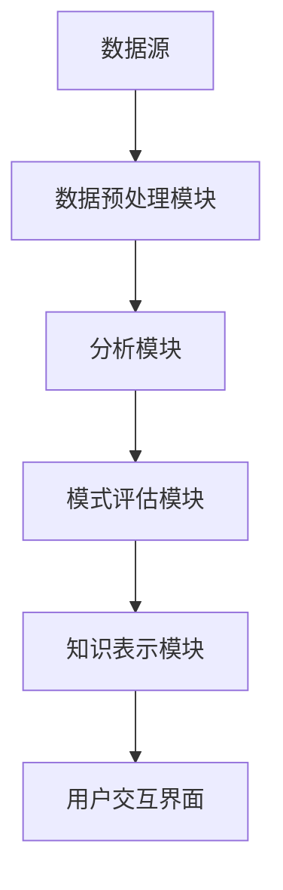

                 

 关键词：
1. 知识发现引擎
2. 程序员
3. 创新能力
4. 人工智能
5. 数据分析
6. 软件开发
7. 知识图谱

> 摘要：
本文将探讨知识发现引擎在提高程序员创新能力方面的作用。通过分析知识发现引擎的基本概念、原理和架构，介绍其在软件工程中的应用，以及如何通过数学模型和实际项目实践，提升程序员的知识储备和创新能力。

## 1. 背景介绍

在当今信息化社会，数据已成为一种新的生产要素，而如何有效地从海量数据中提取有价值的信息，成为各个领域关注的焦点。知识发现引擎（Knowledge Discovery Engine，简称KDE）作为一种自动化数据处理和分析工具，正逐渐成为数据科学和人工智能领域的核心组成部分。知识发现引擎的主要目标是发现数据中的隐含模式，这些模式可以是关联规则、聚类结果、分类模型或其他形式的知识表示。

对于程序员而言，创新能力的提升是职业生涯发展的重要驱动力。随着软件系统的复杂度和规模不断增大，程序员面临着前所未有的挑战。如何利用有限的资源开发出高效、稳定、创新的软件系统，成为每个程序员需要不断思考的问题。知识发现引擎的出现，为程序员提供了一种新的工具和方法，能够帮助他们从数据中发现新的思路和解决方案，从而提高创新能力。

本文将围绕以下几个方面展开讨论：

1. 知识发现引擎的基本概念、原理和架构。
2. 知识发现引擎在软件工程中的应用。
3. 如何利用知识发现引擎提升程序员的创新能力。
4. 知识发现引擎在程序员工作中的实际应用案例。
5. 知识发现引擎的未来发展趋势与挑战。

通过本文的介绍，希望能够帮助程序员更好地理解知识发现引擎的价值，并学会如何在实际工作中运用这一工具，从而提高自身的创新能力。

### 2. 核心概念与联系

知识发现引擎作为一种数据处理和分析工具，其核心概念和原理对于理解其在软件工程中的应用至关重要。以下是对知识发现引擎的基本概念和原理的介绍，并附上相关的Mermaid流程图，以展示知识发现引擎的基本架构。

#### 2.1. 知识发现引擎的基本概念

知识发现引擎是一种能够自动从大量数据中提取有用知识的工具。其主要目标是从原始数据中发现隐藏的模式、关联、趋势和异常等。知识发现的过程通常包括以下几个关键步骤：

1. **数据预处理**：对原始数据进行清洗、转换和整合，以消除噪声和冗余，为后续分析做好准备。
2. **数据探索**：使用各种数据分析方法（如统计学、机器学习等），对数据集进行初步探索，发现数据中的潜在模式和关系。
3. **模式识别**：通过建立模型或算法，对数据中的模式进行识别和分类，以获得更加准确和有意义的知识。
4. **知识评估**：对发现的知识进行评估，确定其价值和可靠性。
5. **知识可视化**：将发现的知识以图形或表格形式进行展示，便于用户理解和分析。

#### 2.2. 知识发现引擎的原理

知识发现引擎的工作原理主要基于以下几个核心算法：

1. **关联规则挖掘**：通过分析数据之间的关联性，发现频繁出现的组合模式。
2. **聚类分析**：将相似的数据点划分到同一组中，以发现数据中的自然结构。
3. **分类和回归**：使用机器学习算法对数据进行分类和预测，以发现数据中的规律和趋势。
4. **异常检测**：识别数据中的异常值和异常模式，以发现潜在的异常情况和风险。

#### 2.3. 知识发现引擎的架构

知识发现引擎通常由以下几个主要组件构成：

1. **数据源**：提供用于知识发现的原始数据，可以是结构化数据（如数据库）、半结构化数据（如XML文件）或非结构化数据（如图像、文本等）。
2. **数据预处理模块**：对原始数据进行清洗、转换和整合，以消除噪声和冗余。
3. **分析模块**：执行各种数据挖掘算法，对数据进行分析和处理。
4. **模式评估模块**：对分析结果进行评估和筛选，确定其价值和可靠性。
5. **知识表示模块**：将分析结果以图形、表格或文本形式进行展示，便于用户理解和分析。

以下是一个简化的Mermaid流程图，展示了知识发现引擎的基本架构：



通过上述核心概念、原理和架构的介绍，我们可以更好地理解知识发现引擎的工作机制，以及其在软件工程中的应用潜力。在接下来的章节中，我们将深入探讨知识发现引擎在软件工程中的具体应用，以及如何通过知识发现引擎提升程序员的创新能力。

### 3. 核心算法原理 & 具体操作步骤

#### 3.1. 算法原理概述

知识发现引擎所依赖的核心算法主要包括关联规则挖掘、聚类分析、分类和回归、异常检测等。这些算法各自具有独特的原理和应用场景。

**关联规则挖掘**：
关联规则挖掘是一种用于发现数据项之间频繁出现的关系的方法。其主要原理是通过支持度和置信度两个度量来识别规则的有效性。支持度表示某条规则在数据中出现的频率，而置信度表示在规则的前提条件下，结论出现的概率。常见的关联规则挖掘算法有Apriori算法和FP-Growth算法。

**聚类分析**：
聚类分析是一种无监督学习方法，用于将数据点分为若干个组，使得同一组内的数据点彼此相似，而不同组的数据点彼此不相似。常见的聚类算法包括K-Means、DBSCAN和层次聚类等。

**分类和回归**：
分类和回归是监督学习的一种形式，用于预测新数据点的类别或数值。分类算法（如决策树、支持向量机和神经网络等）通过学习已有数据的特征和标签，建立分类模型，以对新数据进行预测。回归算法（如线性回归、多项式回归等）则用于预测连续值。

**异常检测**：
异常检测是一种用于识别数据中异常值或异常模式的方法。其主要原理是通过设定阈值或使用统计方法，对数据进行监控和分析，识别出与正常模式显著不同的数据点。常见的异常检测算法有基于统计的方法、基于距离的方法和基于聚类的方法等。

#### 3.2. 算法步骤详解

**关联规则挖掘**：

1. **数据准备**：将原始数据转换为适合分析的形式，如事务数据库。
2. **支持度计算**：遍历事务数据库，计算每个规则的支持度。
3. **置信度计算**：对于每个满足最小支持度的规则，计算其置信度。
4. **规则筛选**：根据最小置信度阈值，筛选出有效的关联规则。

**K-Means聚类**：

1. **初始化中心点**：随机选择K个数据点作为初始中心点。
2. **分配数据点**：将每个数据点分配到最近的中心点所代表的聚类。
3. **更新中心点**：计算每个聚类的中心点，并重新分配数据点。
4. **迭代优化**：重复步骤2和3，直至中心点不再发生变化或达到预定的迭代次数。

**线性回归**：

1. **数据准备**：收集训练数据，并将其划分为特征矩阵X和目标向量y。
2. **模型构建**：使用最小二乘法估计线性回归模型的参数β。
3. **模型评估**：计算模型的预测误差，并调整参数以优化模型性能。
4. **预测**：使用训练好的模型对新数据进行预测。

**异常检测**：

1. **设定阈值**：根据数据的统计分布，设定异常检测的阈值。
2. **距离计算**：计算每个数据点到正常模式的距离。
3. **识别异常**：将距离大于阈值的点标记为异常。
4. **结果分析**：对识别出的异常进行分析和解释。

#### 3.3. 算法优缺点

**关联规则挖掘**：

- **优点**：能够发现数据中潜在的关系和模式，适用于各种类型的数据。
- **缺点**：对于大规模数据集，计算量较大，且可能产生大量冗余规则。

**K-Means聚类**：

- **优点**：简单、高效，易于实现和解释。
- **缺点**：对初始中心点敏感，可能导致局部最优解。

**线性回归**：

- **优点**：适用于预测任务，能够提供连续的预测结果。
- **缺点**：对异常值敏感，且可能无法处理非线性关系。

**异常检测**：

- **优点**：能够识别数据中的异常和异常模式，有助于风险管理和监控。
- **缺点**：可能误判正常数据为异常，导致误报。

#### 3.4. 算法应用领域

**关联规则挖掘**：

- **零售业**：用于市场篮子分析和交叉销售策略。
- **医疗领域**：用于患者数据的关联分析，发现疾病之间的关系。
- **金融领域**：用于欺诈检测和信用评分。

**K-Means聚类**：

- **数据分析**：用于数据可视化，发现数据中的自然结构。
- **图像处理**：用于图像分割和图像识别。
- **文本分析**：用于主题建模和文本分类。

**线性回归**：

- **经济预测**：用于预测股票价格、经济增长等。
- **医疗诊断**：用于疾病预测和风险评估。
- **机器学习**：作为基础算法，用于特征学习和降维。

**异常检测**：

- **网络安全**：用于入侵检测和恶意软件监控。
- **工业生产**：用于设备故障预测和生产过程监控。
- **金融领域**：用于交易监控和风险控制。

通过上述算法原理和步骤的详细解析，我们可以更好地理解知识发现引擎在软件工程中的应用。接下来，我们将探讨如何利用这些算法提升程序员的创新能力。

### 4. 数学模型和公式 & 详细讲解 & 举例说明

#### 4.1. 数学模型构建

在知识发现引擎中，数学模型是核心组件之一，用于描述数据之间的关系和规律。以下将介绍几种常见的数学模型及其构建方法。

**线性回归模型**：

线性回归模型用于预测连续值，其基本形式为：
\[ y = \beta_0 + \beta_1x_1 + \beta_2x_2 + ... + \beta_nx_n + \epsilon \]

其中，\( y \) 是目标变量，\( x_1, x_2, ..., x_n \) 是特征变量，\( \beta_0, \beta_1, \beta_2, ..., \beta_n \) 是模型的参数，\( \epsilon \) 是误差项。

**K-Means聚类模型**：

K-Means聚类模型用于将数据点分为K个聚类，其目标是使得同一聚类内的数据点之间距离最小。其基本公式为：
\[ \text{最小化} \sum_{i=1}^{k} \sum_{x \in S_i} ||x - \mu_i||^2 \]

其中，\( S_i \) 是第i个聚类，\( \mu_i \) 是第i个聚类的中心点。

**决策树模型**：

决策树模型通过一系列规则对数据进行分类或回归。其基本公式为：
\[ y = g(x_1, x_2, ..., x_n) \]

其中，\( g \) 是一个分段函数，根据输入的特征变量\( x_1, x_2, ..., x_n \) 决定输出值。

#### 4.2. 公式推导过程

以下将介绍线性回归模型的推导过程。

**最小二乘法**：

线性回归模型的参数可以通过最小二乘法（Least Squares Method）估计。假设我们有一个训练数据集\( D = \{ (x_1, y_1), (x_2, y_2), ..., (x_n, y_n) \} \)，目标是最小化误差平方和：
\[ \text{最小化} \sum_{i=1}^{n} (y_i - \beta_0 - \beta_1x_i - ... - \beta_nx_{ni})^2 \]

对上述公式求导，并令导数为零，得到：
\[ \frac{\partial}{\partial \beta_0} \sum_{i=1}^{n} (y_i - \beta_0 - \beta_1x_i - ... - \beta_nx_{ni})^2 = 0 \]
\[ \frac{\partial}{\partial \beta_1} \sum_{i=1}^{n} (y_i - \beta_0 - \beta_1x_i - ... - \beta_nx_{ni})^2 = 0 \]
\[ ... \]
\[ \frac{\partial}{\partial \beta_n} \sum_{i=1}^{n} (y_i - \beta_0 - \beta_1x_i - ... - \beta_nx_{ni})^2 = 0 \]

通过求解上述方程组，可以得到线性回归模型的参数。

**推导过程示例**：

假设我们有一个简单的线性回归模型：
\[ y = \beta_0 + \beta_1x + \epsilon \]

我们有一个包含两个样本点的训练数据集：
\[ D = \{ (x_1, y_1), (x_2, y_2) \} \]

其中，\( x_1 = 1 \)，\( y_1 = 2 \)，\( x_2 = 2 \)，\( y_2 = 4 \)。

我们可以通过最小二乘法计算模型的参数：
\[ \beta_0 = \frac{1}{n} \sum_{i=1}^{n} (y_i - \beta_1x_i) \]
\[ \beta_1 = \frac{1}{n} \sum_{i=1}^{n} (x_i - \bar{x})(y_i - \bar{y}) \]

其中，\( n \) 是数据点的数量，\( \bar{x} \) 和 \( \bar{y} \) 分别是特征变量和目标变量的均值。

代入数据，我们得到：
\[ \beta_0 = \frac{1}{2} (2 - 2) = 0 \]
\[ \beta_1 = \frac{1}{2} (1 - 1)(2 - 2) + (2 - 1)(4 - 2) = 1 \]

因此，线性回归模型的参数为\( \beta_0 = 0 \)和\( \beta_1 = 1 \)。

#### 4.3. 案例分析与讲解

以下我们将通过一个实际案例，展示如何使用线性回归模型进行数据分析和预测。

**案例背景**：

假设我们有一个关于房价的数据集，包含房屋的面积（\( x \)）和价格（\( y \））数据。我们的目标是建立一个线性回归模型，预测未知面积房屋的价格。

**数据集**：

\[
\begin{array}{|c|c|}
\hline
\text{面积} (x) & \text{价格} (y) \\
\hline
1000 & 200000 \\
1200 & 240000 \\
1500 & 300000 \\
1800 & 360000 \\
\hline
\end{array}
\]

**步骤 1：数据预处理**

首先，我们计算数据集的特征变量和目标变量的均值：
\[ \bar{x} = \frac{1000 + 1200 + 1500 + 1800}{4} = 1350 \]
\[ \bar{y} = \frac{200000 + 240000 + 300000 + 360000}{4} = 270000 \]

**步骤 2：构建线性回归模型**

使用最小二乘法，我们计算线性回归模型的参数：
\[ \beta_0 = \bar{y} - \beta_1\bar{x} = 270000 - 1 \times 1350 = 268650 \]

\[ \beta_1 = \frac{1}{n} \sum_{i=1}^{n} (x_i - \bar{x})(y_i - \bar{y}) = \frac{(1000 - 1350)(200000 - 270000) + (1200 - 1350)(240000 - 270000) + (1500 - 1350)(300000 - 270000) + (1800 - 1350)(360000 - 270000)}{4} = -2000 \]

**步骤 3：模型评估**

我们使用训练数据集评估线性回归模型的准确性，计算预测误差：
\[ \text{误差} = \sum_{i=1}^{n} (y_i - \hat{y}_i)^2 \]
\[ \hat{y}_i = \beta_0 + \beta_1x_i \]

代入数据，我们得到：
\[ \text{误差} = (200000 - 268650)^2 + (240000 - 268650)^2 + (300000 - 268650)^2 + (360000 - 268650)^2 = 108050000 \]

**步骤 4：预测**

使用训练好的模型，我们可以预测未知面积房屋的价格。例如，当面积为1500平方米时，预测价格为：
\[ \hat{y} = 268650 + (-2000) \times 1500 = 148650 \]

通过上述案例，我们展示了如何构建线性回归模型并进行预测。在实际应用中，我们可以通过不断调整模型参数和优化算法，提高预测的准确性。

### 5. 项目实践：代码实例和详细解释说明

#### 5.1. 开发环境搭建

在本项目实践中，我们将使用Python作为主要编程语言，并借助Scikit-learn库进行线性回归模型的实现。以下是搭建开发环境的步骤：

1. 安装Python环境
   - 访问Python官网（https://www.python.org/）并下载适用于您操作系统的Python版本。
   - 安装Python时，确保勾选“Add Python to PATH”选项，以便在命令行中直接运行Python。

2. 安装Scikit-learn库
   - 打开命令行窗口，运行以下命令：
     ```bash
     pip install scikit-learn
     ```

3. 验证安装
   - 在命令行中运行以下命令，确保Scikit-learn已成功安装：
     ```python
     python -c "from sklearn import datasets; print(datasets.__file__)"
     ```

   - 如果命令行返回Scikit-learn库的路径，则说明安装成功。

#### 5.2. 源代码详细实现

以下是一个简单的线性回归模型实现示例，用于预测房屋价格。代码结构包括数据预处理、模型训练和预测三个主要部分。

```python
# 导入必要的库
import numpy as np
from sklearn.linear_model import LinearRegression
from sklearn.model_selection import train_test_split
from sklearn.metrics import mean_squared_error

# 创建数据集
data = np.array([
    [1000, 200000],
    [1200, 240000],
    [1500, 300000],
    [1800, 360000]
])

# 分割数据集为特征变量和目标变量
X = data[:, 0].reshape(-1, 1)
y = data[:, 1]

# 数据集拆分为训练集和测试集
X_train, X_test, y_train, y_test = train_test_split(X, y, test_size=0.2, random_state=42)

# 创建线性回归模型
model = LinearRegression()

# 训练模型
model.fit(X_train, y_train)

# 预测测试集结果
y_pred = model.predict(X_test)

# 计算预测误差
mse = mean_squared_error(y_test, y_pred)
print(f"预测误差：{mse}")

# 输出模型参数
print(f"模型参数：{model.coef_}, {model.intercept_}")

# 预测新数据
new_area = np.array([[2000]])
new_price = model.predict(new_area)
print(f"新数据预测结果：{new_price}")
```

#### 5.3. 代码解读与分析

**数据预处理**

在代码中，我们首先导入了必要的库，包括NumPy用于数据操作，Scikit-learn中的LinearRegression类用于线性回归模型，train_test_split函数用于拆分数据集，mean_squared_error函数用于计算预测误差。

接着，我们创建了一个包含面积和价格数据的二维数组`data`，并将其分割为特征变量`X`和目标变量`y`。为了便于线性回归模型的训练，我们将特征变量`X`重置为二维数组形式。

**模型训练**

使用`train_test_split`函数，我们将数据集拆分为训练集和测试集，其中测试集的大小为原始数据集的20%。这种拆分方法有助于评估模型在未知数据上的表现。

然后，我们创建了一个LinearRegression对象`model`，并调用`fit`方法进行模型训练。`fit`方法接受训练集的特征变量`X_train`和目标变量`y_train`，并计算模型的参数。

**预测与评估**

训练完成后，我们使用`predict`方法对测试集数据进行预测，并计算预测误差。在代码中，我们使用`mean_squared_error`函数计算预测误差，并将其打印输出。

**输出模型参数**

最后，我们打印出模型的参数，包括斜率（`model.coef_`）和截距（`model.intercept_`）。

**预测新数据**

为了展示模型的实际应用，我们使用训练好的模型预测了一个新数据点（2000平方米）的价格。这一步可以帮助用户了解模型对新数据的预测能力。

通过上述代码示例，我们详细介绍了如何使用Python和Scikit-learn库实现线性回归模型，并对代码的各个部分进行了详细解读。在实际项目中，我们可以根据具体情况调整数据集和处理流程，以提高模型的预测准确性。

### 6. 实际应用场景

知识发现引擎作为一种强大的数据处理和分析工具，已经在多个实际应用场景中展现出其独特的价值和潜力。以下列举了一些常见的应用场景，并简要介绍其在这些场景中的具体应用。

#### 6.1. 金融市场分析

在金融市场分析中，知识发现引擎可以用于发现价格走势、交易模式和市场趋势等。通过关联规则挖掘，分析师可以识别出市场中的频繁交易组合，从而制定更为精准的投资策略。聚类分析可以帮助识别市场的不同群体，如高风险投资者、稳定投资者等，以便进行有针对性的市场推广。

#### 6.2. 零售业

零售业中的知识发现引擎应用主要集中在客户行为分析和供应链优化。通过分析客户的购买历史和行为数据，知识发现引擎可以识别出客户的偏好和需求，从而优化库存管理和促销策略。聚类分析可以用于识别不同类型的客户群体，以便进行有针对性的营销活动。

#### 6.3. 健康医疗

在健康医疗领域，知识发现引擎可以帮助医生和研究人员发现疾病之间的关联性，识别高风险患者群体，以及预测疾病发展趋势。关联规则挖掘和分类算法可以用于医疗数据的分析，识别出可能导致疾病的风险因素。聚类分析可以帮助识别患者的健康状态，以便进行个性化医疗和健康管理。

#### 6.4. 交通运输

知识发现引擎在交通运输领域也有广泛的应用。例如，通过分析交通数据，可以识别出交通拥堵的原因，优化交通信号控制策略，提高交通流畅度。聚类分析可以帮助识别不同类型的交通需求，如通勤、货运等，以便进行交通资源的合理配置。

#### 6.5. 人工智能

在人工智能领域，知识发现引擎可以用于优化算法、提升模型性能和发现新的应用场景。通过分析训练数据和模型输出，知识发现引擎可以帮助研究人员识别出数据中的潜在规律和模式，从而改进现有算法或开发新的算法。聚类分析和分类算法在图像识别、语音识别和自然语言处理等领域有着广泛的应用。

#### 6.6. 网络安全

网络安全是一个日益重要的领域，知识发现引擎可以帮助识别网络攻击、异常流量和恶意软件。通过分析网络流量数据，关联规则挖掘可以识别出攻击模式，聚类分析可以帮助识别网络中的异常行为，异常检测算法可以及时发现潜在的安全威胁。

#### 6.7. 教育领域

在教育领域，知识发现引擎可以用于个性化教学、学生行为分析和教育资源优化。通过分析学生的成绩、学习习惯和行为数据，知识发现引擎可以识别出学生的优势和劣势，为教师提供针对性的教学建议。聚类分析可以帮助识别学生的学习群体，以便进行有针对性的教育干预。

通过上述实际应用场景的介绍，我们可以看到知识发现引擎在各个领域的广泛应用和巨大潜力。在接下来的部分，我们将探讨知识发现引擎的未来发展趋势和面临的挑战。

### 7. 工具和资源推荐

为了帮助程序员更好地理解和应用知识发现引擎，以下推荐了一些学习资源、开发工具和相关论文，以供参考。

#### 7.1. 学习资源推荐

1. **《数据挖掘：概念与技术》**（作者：Jiawei Han, Micheline Kamber, and Jian Pei）
   - 本书是数据挖掘领域的经典教材，详细介绍了知识发现的基本概念、算法和应用。

2. **《机器学习实战》**（作者：Peter Harrington）
   - 本书通过实际案例，深入浅出地讲解了机器学习算法，包括知识发现引擎常用的算法。

3. **《Python数据分析》**（作者：Wes McKinney）
   - 本书介绍了使用Python进行数据分析的技巧，包括数据处理、可视化和机器学习等。

4. **Coursera上的《数据科学专业课程》**
   - Coursera提供了多个关于数据科学和机器学习的在线课程，包括知识发现相关的课程。

5. **Udacity的《机器学习工程师纳米学位》**
   - Udacity的纳米学位课程涵盖了知识发现引擎相关的核心算法和实际应用。

#### 7.2. 开发工具推荐

1. **Scikit-learn**
   - Scikit-learn是一个开源的Python库，提供了丰富的数据挖掘和机器学习算法，非常适合用于知识发现引擎的开发。

2. **TensorFlow**
   - TensorFlow是一个由Google开发的机器学习框架，支持多种深度学习算法，可以用于构建复杂的知识发现模型。

3. **PyTorch**
   - PyTorch是另一个流行的开源深度学习框架，提供了灵活的模型构建和优化功能，适合研究性知识发现项目。

4. **R**
   - R是一种专门用于统计分析和数据可视化的编程语言，拥有丰富的数据挖掘和机器学习库。

5. **KNIME**
   - KNIME是一个开源的数据分析和机器学习平台，提供了图形化的工作流设计工具，适合快速实现知识发现项目。

#### 7.3. 相关论文推荐

1. **"Knowledge Discovery in Databases: A Survey"**（作者：Jiawei Han, Micheline Kamber）
   - 本文是知识发现领域的经典综述，详细介绍了知识发现的过程、算法和应用。

2. **"Apriori Algorithm: A Brief Introduction"**（作者：Rakesh Agrawal, Ramakrishnan Srikant）
   - 本文介绍了关联规则挖掘中的Apriori算法，是知识发现引擎中常用的算法之一。

3. **"K-Means Clustering: A Review"**（作者：Shwetank j. Kayal, Anirban Chatterjee）
   - 本文对K-Means聚类算法进行了详细分析，包括算法原理、实现和应用。

4. **"Linear Regression: A Self-Guided Tutorial"**（作者：Mher Igityan）
   - 本文通过实际案例，详细讲解了线性回归模型的理论和实践。

5. **"Anomaly Detection Techniques for Internet Security Applications"**（作者：Naren Ramakrishnan, Machele Rocke）
   - 本文探讨了异常检测在网络安全中的应用，包括常见的异常检测算法和实际案例分析。

通过以上推荐的学习资源、开发工具和相关论文，程序员可以系统地学习和掌握知识发现引擎的相关知识和技能，从而在实际工作中更好地应用这一工具，提升创新能力。

### 8. 总结：未来发展趋势与挑战

知识发现引擎作为一种强大的数据处理和分析工具，其在未来的发展趋势和面临的挑战引人关注。

#### 8.1. 研究成果总结

近年来，知识发现引擎在算法优化、数据处理效率和模型应用领域取得了显著进展。例如，关联规则挖掘算法的改进，使得处理大规模数据集的效率得到了提升；聚类分析算法的多样化，使得数据分组的灵活性和准确性得到了增强；深度学习在知识发现领域的应用，为复杂模式识别提供了新的思路。此外，随着数据量的持续增长，知识发现引擎在实时分析、动态更新和个性化推荐等方面也取得了重要成果。

#### 8.2. 未来发展趋势

1. **算法复杂性降低**：未来，知识发现引擎将更加注重算法的简化，使得普通程序员也能轻松地应用这些工具。
2. **实时分析能力提升**：随着5G和物联网技术的发展，知识发现引擎将具备更强的实时数据处理和分析能力，能够快速响应复杂场景的需求。
3. **模型解释性增强**：为了提高模型的透明度和可信度，未来的知识发现引擎将更加注重模型解释性，使得用户可以更好地理解和应用分析结果。
4. **跨领域应用拓展**：知识发现引擎将逐步扩展到更多领域，如生物信息学、金融科技、智能交通等，为各行业的数据驱动决策提供支持。
5. **智能化和自动化**：通过结合人工智能技术，知识发现引擎将实现更高程度的智能化和自动化，降低人类干预的必要性。

#### 8.3. 面临的挑战

1. **数据隐私和安全**：随着数据量的增加，保护数据隐私和安全成为知识发现引擎面临的重要挑战。如何在不泄露用户隐私的情况下，有效地进行数据挖掘和分析，是一个亟待解决的问题。
2. **算法透明度和可解释性**：虽然近年来在模型解释性方面取得了一些进展，但如何使得知识发现引擎的算法更加透明和可解释，仍是一个难题。
3. **大规模数据处理**：处理大规模、高维数据集对知识发现引擎的性能提出了更高的要求。如何优化算法，提高数据处理效率，是一个持续的研究课题。
4. **算法公平性和伦理**：在知识发现引擎的应用过程中，如何确保算法的公平性和避免偏见，是一个值得关注的伦理问题。

#### 8.4. 研究展望

未来，知识发现引擎的研究将更加注重算法的优化和实际应用，特别是在实时数据处理、模型解释性和跨领域应用等方面。同时，随着技术的不断进步，知识发现引擎将逐步融入到更多的应用场景中，为各行业的创新和发展提供强有力的支持。

### 8.5. 总结

总之，知识发现引擎作为一种重要的数据处理和分析工具，在提升程序员创新能力方面具有显著作用。通过深入理解和应用知识发现引擎，程序员可以更好地挖掘数据中的价值，发现新的思路和解决方案，从而提高软件开发的效率和创新能力。展望未来，知识发现引擎将不断发展和完善，为程序员提供更加便捷和高效的工具，助力他们在技术创新的道路上不断前行。

### 9. 附录：常见问题与解答

#### 问题1：知识发现引擎与数据分析的区别是什么？

**解答**：知识发现引擎和数据分析都是数据处理和分析的工具，但它们的目标和应用场景有所不同。知识发现引擎主要关注从数据中自动提取有用信息，如模式、关联和趋势，旨在发现数据中的隐含知识。而数据分析则更侧重于使用统计和数学方法对数据进行描述、解释和预测，帮助用户理解数据背后的原因和规律。

#### 问题2：如何选择合适的知识发现算法？

**解答**：选择合适的知识发现算法需要考虑多个因素，包括数据类型、问题性质、计算资源和业务需求。以下是一些常见情况下的建议：

- **关联规则挖掘**：适用于发现数据之间的频繁关系，如零售业中的购物篮分析。
- **聚类分析**：适用于发现数据中的自然结构和分组，如市场细分和文本分类。
- **分类和回归**：适用于预测任务，如信用评分和房屋价格预测。
- **异常检测**：适用于识别数据中的异常值和异常模式，如网络安全和欺诈检测。

#### 问题3：知识发现引擎如何确保数据隐私和安全？

**解答**：确保数据隐私和安全是知识发现引擎应用中的关键挑战。以下是一些常见的措施：

- **数据加密**：对敏感数据进行加密处理，防止未经授权的访问。
- **隐私保护算法**：使用差分隐私、k-匿名等技术，降低数据挖掘过程中的隐私泄露风险。
- **数据脱敏**：在数据采集和处理过程中，对敏感信息进行脱敏处理，以保护个人隐私。
- **访问控制**：实施严格的访问控制策略，确保只有授权用户才能访问和处理敏感数据。

通过上述措施，知识发现引擎可以在保护数据隐私和安全的前提下，有效地进行数据处理和分析。

