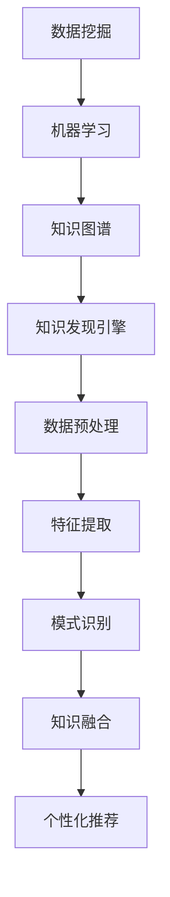

                 

关键词：知识发现引擎、学习效率、编程学习、算法应用、数学模型、实践案例、资源推荐

> 摘要：本文将探讨程序员如何利用知识发现引擎提高学习效率与成果。通过详细分析知识发现引擎的核心概念、算法原理、数学模型以及实际应用场景，结合代码实例，为程序员提供实用的学习策略和工具推荐。

## 1. 背景介绍

在信息技术飞速发展的时代，程序员面临着海量的知识和技能需求。如何高效地学习和掌握这些知识，成为了每一个程序员都必须面对的挑战。传统的学习方式往往依赖于教材和课程，但这种方式存在以下几个问题：

1. **知识碎片化**：学习过程中往往只能获取零散的知识点，缺乏系统性。
2. **学习效率低**：需要花费大量时间反复查找和整理信息。
3. **实践不足**：理论知识与实践脱节，难以将所学知识应用到实际项目中。
4. **学习资源有限**：教材和课程的更新速度无法跟上技术的快速发展。

为了解决上述问题，知识发现引擎（Knowledge Discovery Engine，KDE）的出现为程序员提供了新的学习途径。知识发现引擎通过人工智能技术，可以从大量数据中提取有用信息，帮助程序员快速获取所需知识，提高学习效率。本文将围绕知识发现引擎的核心概念、算法原理、数学模型以及实际应用场景，探讨如何利用知识发现引擎提高编程学习的效率与成果。

### 知识发现引擎的定义与作用

知识发现引擎是一种基于人工智能技术的工具，它可以自动地从大量数据中提取知识，并对其进行分析和解释。在编程学习领域，知识发现引擎的作用主要体现在以下几个方面：

1. **个性化推荐**：根据程序员的兴趣和需求，推荐相关的学习资源和知识。
2. **知识图谱**：构建程序员的个人知识图谱，帮助理解知识之间的关联和层次结构。
3. **自动答疑**：通过自然语言处理技术，为程序员提供实时的问题解答。
4. **代码生成**：根据程序员的需求，自动生成符合规范的代码片段。

### 程序员的学习挑战与知识发现引擎的优势

程序员的日常工作中，不断学习新技术、新框架和新语言是不可避免的。然而，面对不断涌现的知识点，程序员常常感到困惑和迷茫。传统的学习方式无法满足以下挑战：

1. **学习路径不明确**：难以确定哪些知识点是重要的，哪些是次要的。
2. **知识更新速度快**：新的技术和框架层出不穷，学习成本高。
3. **学习资源分散**：需要花费大量时间在互联网上搜索和整理资料。

知识发现引擎通过以下优势，可以显著提高程序员的学习效率：

1. **自动化处理**：减少手动查找和整理知识的时间，提高学习效率。
2. **个性化推荐**：根据程序员的兴趣和需求，提供精准的学习建议。
3. **知识整合**：将分散的知识点整合成系统化的知识体系。
4. **实时更新**：知识库可以实时更新，确保程序员掌握最新技术。

通过以上背景介绍，我们可以看到，知识发现引擎为程序员提供了新的学习工具，有助于解决传统学习方式中的种种问题。接下来，我们将深入探讨知识发现引擎的核心概念、算法原理和数学模型，为程序员提供更加具体的学习指导。

## 2. 核心概念与联系

在深入了解知识发现引擎之前，我们需要明确几个核心概念，并理解它们之间的联系。以下是本文将涉及的核心概念以及它们的相互关系：

### 2.1 数据挖掘

数据挖掘（Data Mining）是指从大量数据中提取有用信息和知识的过程。它通常包括以下步骤：

1. **数据清洗**：处理数据中的噪声和错误，确保数据质量。
2. **数据整合**：将来自不同源的数据进行整合，形成统一的视图。
3. **数据探索**：使用统计方法和可视化技术，探索数据中的潜在模式。
4. **模式识别**：使用机器学习算法，从数据中识别出有意义的模式。

### 2.2 机器学习

机器学习（Machine Learning）是一种人工智能（Artificial Intelligence，AI）的分支，它使计算机系统能够从数据中学习并做出预测或决策。机器学习的关键组成部分包括：

1. **监督学习**：通过已标记的数据训练模型，使其能够对新数据进行预测。
2. **无监督学习**：在没有标记数据的情况下，发现数据中的结构和模式。
3. **强化学习**：通过试错法，在给定环境中寻找最优策略。

### 2.3 知识图谱

知识图谱（Knowledge Graph）是一种用于表示实体及其之间关系的图形化数据结构。它通常包括：

1. **实体**：表示具体的事物，如人、地点、组织等。
2. **属性**：描述实体的特征，如年龄、职位等。
3. **关系**：表示实体之间的关联，如“工作于”、“出生于”等。

### 2.4 知识发现引擎

知识发现引擎（Knowledge Discovery Engine，KDE）是基于数据挖掘和机器学习技术，结合知识图谱构建的一种智能工具。它主要包括以下几个功能模块：

1. **数据预处理**：清洗、整合和转换数据，为后续分析做准备。
2. **特征提取**：从原始数据中提取出有用的特征，用于训练机器学习模型。
3. **模式识别**：使用机器学习算法，从特征数据中识别出有意义的模式。
4. **知识融合**：将识别出的模式整合到知识图谱中，构建程序员的个人知识体系。
5. **个性化推荐**：根据程序员的兴趣和需求，推荐相关的学习资源和知识。

### 2.5 核心概念与架构的 Mermaid 流程图

下面是一个用Mermaid绘制的流程图，展示了知识发现引擎中的核心概念和架构：



通过这个流程图，我们可以清晰地看到知识发现引擎是如何通过数据挖掘和机器学习技术，结合知识图谱，实现知识提取和个性化推荐的核心功能。

### 2.6 知识发现引擎的工作流程

知识发现引擎的工作流程可以分为以下几个主要步骤：

1. **数据收集**：从各种数据源（如数据库、文件、网页等）收集数据。
2. **数据预处理**：清洗和整合收集到的数据，去除噪声和错误，确保数据质量。
3. **特征提取**：从预处理后的数据中提取出有用的特征，为训练机器学习模型做准备。
4. **模型训练**：使用提取出的特征数据，通过机器学习算法训练模型。
5. **模式识别**：使用训练好的模型，对新的数据进行分析，识别出有意义的模式。
6. **知识融合**：将识别出的模式整合到知识图谱中，构建程序员的个人知识体系。
7. **个性化推荐**：根据程序员的兴趣和需求，推荐相关的学习资源和知识。

### 2.7 知识发现引擎的优势与局限性

知识发现引擎具有以下优势：

1. **高效性**：通过自动化处理，大大提高了学习效率。
2. **个性化**：根据程序员的兴趣和需求，提供精准的学习建议。
3. **知识整合**：将分散的知识点整合成系统化的知识体系。

然而，知识发现引擎也存在一定的局限性：

1. **数据依赖性**：需要大量的高质量数据支持，否则可能导致不准确的结果。
2. **算法复杂性**：涉及的算法和模型较为复杂，需要专业的知识和技能。
3. **隐私问题**：在收集和分析个人数据时，可能会涉及隐私问题。

通过以上对知识发现引擎核心概念和架构的介绍，我们为程序员提供了一个基本的理解框架。接下来，我们将深入探讨知识发现引擎的算法原理，帮助程序员更好地应用这一工具。

## 3. 核心算法原理 & 具体操作步骤

### 3.1 算法原理概述

知识发现引擎的核心在于其算法原理，主要包括数据挖掘、机器学习以及知识图谱构建。以下是这些算法的基本原理：

#### 数据挖掘

数据挖掘主要涉及以下几个步骤：

1. **关联规则学习**：通过分析数据中的关联规则，发现数据之间的潜在联系。例如，在电子商务平台中，分析哪些商品经常一起购买。
2. **分类**：将数据按照某些特征分类，以便进行后续分析。例如，使用决策树算法，根据用户的历史行为分类为新用户或老用户。
3. **聚类**：将数据按照相似性进行分组，以便发现数据中的自然结构。例如，使用K-means算法，将用户按照购买偏好进行聚类。
4. **异常检测**：识别数据中的异常值或异常模式。例如，在金融领域，使用异常检测算法发现欺诈交易。

#### 机器学习

机器学习主要包括以下两种类型：

1. **监督学习**：通过已标记的数据训练模型，使其能够对新数据进行预测。例如，使用线性回归模型预测股票价格。
2. **无监督学习**：在没有标记数据的情况下，发现数据中的结构和模式。例如，使用K-means算法对用户进行聚类。

#### 知识图谱构建

知识图谱构建主要涉及以下步骤：

1. **实体识别**：从数据中识别出实体，如人、地点、组织等。
2. **关系抽取**：从数据中抽取实体之间的关系，如“工作于”、“出生于”等。
3. **图谱构建**：将识别出的实体和关系构建成一个图形化结构，形成知识图谱。

### 3.2 算法步骤详解

以下是知识发现引擎的具体操作步骤：

#### 步骤1：数据收集

首先，从各种数据源（如数据库、文件、网页等）收集数据。数据可以是结构化的（如数据库）、半结构化的（如XML）或非结构化的（如文本、图片）。

#### 步骤2：数据预处理

对收集到的数据进行清洗、整合和转换，去除噪声和错误，确保数据质量。这一步骤包括：

1. **数据清洗**：去除重复数据、填补缺失值、处理异常值。
2. **数据整合**：将来自不同源的数据进行整合，形成统一的视图。
3. **数据转换**：将数据转换为适合机器学习算法的形式，如数值化、标准化等。

#### 步骤3：特征提取

从预处理后的数据中提取出有用的特征，为训练机器学习模型做准备。特征提取的方法包括：

1. **特征选择**：通过过滤、封装和转换等方法，从原始数据中筛选出重要特征。
2. **特征提取**：使用统计方法、文本挖掘技术等，从数据中提取出有意义的特征。

#### 步骤4：模型训练

使用提取出的特征数据，通过机器学习算法训练模型。常用的机器学习算法包括：

1. **线性回归**：用于预测连续值。
2. **决策树**：用于分类和回归。
3. **支持向量机**：用于分类。
4. **神经网络**：用于复杂的模式识别。

#### 步骤5：模式识别

使用训练好的模型，对新的数据进行分析，识别出有意义的模式。模式识别的结果可以用于以下应用：

1. **关联规则学习**：发现数据之间的关联规则。
2. **分类**：将新数据按照特征分类。
3. **聚类**：将新数据按照相似性进行分组。

#### 步骤6：知识融合

将识别出的模式整合到知识图谱中，构建程序员的个人知识体系。知识融合的步骤包括：

1. **实体识别**：从数据中识别出实体。
2. **关系抽取**：从数据中抽取实体之间的关系。
3. **图谱构建**：将识别出的实体和关系构建成一个图形化结构。

#### 步骤7：个性化推荐

根据程序员的兴趣和需求，推荐相关的学习资源和知识。个性化推荐的方法包括：

1. **基于内容的推荐**：根据程序员已知的兴趣，推荐相似的内容。
2. **协同过滤**：根据其他程序员的兴趣和行为，推荐相关的资源。
3. **混合推荐**：结合基于内容和协同过滤的方法，提供更准确的推荐。

### 3.3 算法优缺点

以下是对知识发现引擎所使用的主要算法的优缺点分析：

#### 关联规则学习

**优点**：

1. **简单易懂**：基于简单的规则，易于理解和实现。
2. **可解释性**：用户可以清楚地看到数据之间的关联。
3. **应用广泛**：在电子商务、推荐系统等领域有广泛应用。

**缺点**：

1. **计算复杂度高**：在大规模数据上计算效率较低。
2. **冗余规则较多**：容易产生大量的冗余规则。

#### 分类算法

**优点**：

1. **预测准确**：基于历史数据，可以对新数据进行准确的分类。
2. **可解释性**：用户可以清楚地看到分类规则。
3. **应用广泛**：在信用评分、医疗诊断等领域有广泛应用。

**缺点**：

1. **数据依赖性**：需要大量的标记数据进行训练。
2. **过拟合**：模型可能对新数据表现不佳。

#### 聚类算法

**优点**：

1. **自动划分**：不需要预先指定类别数量，自动划分数据。
2. **灵活性**：适用于各种形状和大小的不规则数据。
3. **探索性分析**：帮助发现数据中的自然结构。

**缺点**：

1. **无监督学习**：无法提供明确的分类标签。
2. **结果解释困难**：聚类结果有时难以解释。

#### 神经网络

**优点**：

1. **强大的学习能力**：可以处理复杂的非线性关系。
2. **应用广泛**：在图像识别、自然语言处理等领域有广泛应用。
3. **自适应能力**：可以根据训练数据自动调整参数。

**缺点**：

1. **计算复杂度高**：训练时间较长。
2. **过拟合**：在大规模数据上可能表现不佳。

### 3.4 算法应用领域

知识发现引擎在编程学习领域的应用主要包括以下几个方面：

1. **个性化学习**：根据程序员的兴趣和需求，提供个性化的学习资源和课程。
2. **知识图谱构建**：构建程序员的个人知识图谱，帮助理解知识之间的关联和层次结构。
3. **代码生成**：根据程序员的需求，自动生成符合规范的代码片段。
4. **自动答疑**：通过自然语言处理技术，为程序员提供实时的问题解答。

通过以上对知识发现引擎算法原理的详细介绍，程序员可以更好地理解这一工具，并利用其提高学习效率。在接下来的章节中，我们将深入探讨知识发现引擎中的数学模型和公式，为程序员提供更加深入的指导。

## 4. 数学模型和公式 & 详细讲解 & 举例说明

### 4.1 数学模型构建

在知识发现引擎中，数学模型是算法实现的基础。以下将介绍一些核心的数学模型及其构建方法。

#### 4.1.1 线性回归模型

线性回归模型用于预测连续值，其基本公式如下：

$$
y = \beta_0 + \beta_1x_1 + \beta_2x_2 + \ldots + \beta_nx_n
$$

其中，$y$ 为预测值，$x_1, x_2, \ldots, x_n$ 为特征值，$\beta_0, \beta_1, \beta_2, \ldots, \beta_n$ 为模型参数。

线性回归模型的构建步骤包括：

1. **数据收集**：收集具有目标变量和特征变量的数据。
2. **特征选择**：选择对目标变量有显著影响的特征。
3. **数据预处理**：对特征进行标准化处理，使其具有相似的尺度。
4. **模型训练**：使用最小二乘法（Least Squares）训练模型，求解参数$\beta_0, \beta_1, \beta_2, \ldots, \beta_n$。

#### 4.1.2 决策树模型

决策树模型用于分类和回归，其基本结构如下：

```
        ┌─── Feature1 ─────────┐
        │                    │
       ┌─┘          ─┐      ┌─┐
       │     Node1   │      │
       │               │      │
     ┌─┴─┐          ┌─┴─┐
     │Node2│          │Node3│
     │     │          │     │
     ├────┤          ├─────┤
     │     │          │     │
   ┌─┴─┐  ┌─┴─┐      ┌─┴─┐  ┌─┴─┐
   │Node4│ │Node5│    │Node6│ │Node7│
   │     │ │     │    │     │ │     │
   └─────┘ └─────┘    └─────┘ └─────┘
```

其中，每个节点代表一个特征，每个分支代表一个特征取值。叶节点代表最终的分类或回归结果。

决策树模型的构建步骤包括：

1. **数据收集**：收集具有目标变量和特征变量的数据。
2. **特征选择**：选择对目标变量有显著影响的特征。
3. **树构建**：根据信息增益或基尼指数等指标，递归地分割数据，构建决策树。

#### 4.1.3 神经网络模型

神经网络模型是一种模拟生物神经系统的计算模型，其基本结构如下：

```
Input Layer: [Input1, Input2, ..., Inputn]
          ┌────────────────────────┐
          │                        │ 
          │        Hidden Layer    │ 
          │                        │ 
          └────────────────────────┘
                                   │
                                   │
                       ┌────────────────────────┐
                       │                        │
                       │        Output Layer    │
                       │                        │
                       └────────────────────────┘
```

其中，输入层接收外部输入，隐藏层通过激活函数对输入进行处理，输出层产生最终的输出。

神经网络模型的构建步骤包括：

1. **数据收集**：收集具有目标变量和特征变量的数据。
2. **网络初始化**：初始化网络的权重和偏置。
3. **前向传播**：计算输入层到隐藏层，隐藏层到输出层的输出。
4. **反向传播**：计算网络误差，更新权重和偏置。
5. **模型训练**：重复执行前向传播和反向传播，直至网络收敛。

### 4.2 公式推导过程

以下将介绍线性回归模型和决策树模型的基本公式推导过程。

#### 4.2.1 线性回归模型公式推导

假设我们有 $m$ 个样本数据，每个样本有 $n$ 个特征和1个目标变量。线性回归模型的公式可以表示为：

$$
y^{(i)} = \beta_0^{(i)} + \beta_1^{(i)}x_1^{(i)} + \beta_2^{(i)}x_2^{(i)} + \ldots + \beta_n^{(i)}x_n^{(i)}
$$

其中，$y^{(i)}$ 是第 $i$ 个样本的目标变量，$x_1^{(i)}, x_2^{(i)}, \ldots, x_n^{(i)}$ 是第 $i$ 个样本的特征变量，$\beta_0^{(i)}, \beta_1^{(i)}, \beta_2^{(i)}, \ldots, \beta_n^{(i)}$ 是模型参数。

为了求解模型参数，我们使用最小二乘法（Least Squares）。最小二乘法的目标是最小化预测值和实际值之间的误差平方和，即：

$$
J(\beta) = \sum_{i=1}^{m}(y^{(i)} - \beta_0^{(i)} - \beta_1^{(i)}x_1^{(i)} - \beta_2^{(i)}x_2^{(i)} - \ldots - \beta_n^{(i)}x_n^{(i)})^2
$$

对 $J(\beta)$ 关于 $\beta_0, \beta_1, \beta_2, \ldots, \beta_n$ 求偏导数，并令其等于0，可以得到：

$$
\frac{\partial J(\beta)}{\partial \beta_0} = 2\sum_{i=1}^{m}(y^{(i)} - \beta_0^{(i)} - \beta_1^{(i)}x_1^{(i)} - \beta_2^{(i)}x_2^{(i)} - \ldots - \beta_n^{(i)}x_n^{(i)}) = 0
$$

$$
\frac{\partial J(\beta)}{\partial \beta_1} = 2\sum_{i=1}^{m}(y^{(i)} - \beta_0^{(i)} - \beta_1^{(i)}x_1^{(i)} - \beta_2^{(i)}x_2^{(i)} - \ldots - \beta_n^{(i)}x_n^{(i)})x_1^{(i)} = 0
$$

$$
\frac{\partial J(\beta)}{\partial \beta_2} = 2\sum_{i=1}^{m}(y^{(i)} - \beta_0^{(i)} - \beta_1^{(i)}x_1^{(i)} - \beta_2^{(i)}x_2^{(i)} - \ldots - \beta_n^{(i)}x_n^{(i)})x_2^{(i)} = 0
$$

$$
\vdots$$

$$
\frac{\partial J(\beta)}{\partial \beta_n} = 2\sum_{i=1}^{m}(y^{(i)} - \beta_0^{(i)} - \beta_1^{(i)}x_1^{(i)} - \beta_2^{(i)}x_2^{(i)} - \ldots - \beta_n^{(i)}x_n^{(i)})x_n^{(i)} = 0
$$

将上述偏导数方程组写成矩阵形式，可以得到：

$$
J(\beta) = \mathbf{X}^T\mathbf{X}\beta - 2\mathbf{X}^T\mathbf{y}
$$

其中，$\mathbf{X}$ 是特征矩阵，$\mathbf{y}$ 是目标变量矩阵。对 $J(\beta)$ 关于 $\beta$ 求偏导数，并令其等于0，可以得到：

$$
\frac{\partial J(\beta)}{\partial \beta} = \mathbf{X}^T\mathbf{X}\beta - \mathbf{X}^T\mathbf{y} = 0
$$

解上述方程组，可以得到最小二乘解：

$$
\beta = (\mathbf{X}^T\mathbf{X})^{-1}\mathbf{X}^T\mathbf{y}
$$

#### 4.2.2 决策树模型公式推导

决策树模型的构建过程是基于信息增益（Information Gain）或基尼指数（Gini Index）等指标。以信息增益为例，信息增益的定义如下：

$$
IG(D, A) = I(D) - \sum_{v \in V(A)} \frac{|D_v|}{|D|} I(D_v)
$$

其中，$D$ 是数据集，$A$ 是特征，$V(A)$ 是特征 $A$ 的所有取值，$D_v$ 是数据集 $D$ 中属于取值 $v$ 的部分。

信息增益表示在特征 $A$ 的基础上，对数据集 $D$ 进行划分后，数据的纯度度减少的程度。信息增益越大，表示特征 $A$ 对数据的划分效果越好。

决策树构建的步骤包括：

1. **计算信息增益**：计算每个特征的信息增益，选择信息增益最大的特征作为当前节点的划分特征。
2. **递归划分**：对当前节点的子节点，递归执行上述步骤，直到满足停止条件（如节点中的数据只有一个类别或达到最大深度）。

### 4.3 案例分析与讲解

#### 4.3.1 线性回归模型案例

假设我们有如下数据集，其中包含3个特征和1个目标变量：

| ID | x1 | x2 | x3 | y |
|----|----|----|----|---|
| 1  | 1  | 2  | 3  | 5 |
| 2  | 2  | 3  | 4  | 6 |
| 3  | 3  | 4  | 5  | 7 |
| 4  | 4  | 5  | 6  | 8 |
| 5  | 5  | 6  | 7  | 9 |

我们要构建一个线性回归模型，预测 $y$ 的值。

1. **数据预处理**：

   首先，对数据进行标准化处理，使其具有相似的尺度。假设特征 $x1, x2, x3$ 的均值为 $\mu_1, \mu_2, \mu_3$，标准差为 $\sigma_1, \sigma_2, \sigma_3$，则标准化后的数据为：

   $$x_1' = \frac{x_1 - \mu_1}{\sigma_1}$$

   $$x_2' = \frac{x_2 - \mu_2}{\sigma_2}$$

   $$x_3' = \frac{x_3 - \mu_3}{\sigma_3}$$

   对目标变量 $y$ 也进行同样的处理。

2. **特征选择**：

   假设我们选择 $x1$ 和 $x2$ 作为特征，构建线性回归模型。则模型公式为：

   $$y = \beta_0 + \beta_1x_1 + \beta_2x_2$$

3. **模型训练**：

   使用最小二乘法训练模型，求解参数 $\beta_0, \beta_1, \beta_2$。具体计算过程如下：

   $$\beta_0 = \frac{\sum_{i=1}^{m}(y_i - \beta_1x_{1i} - \beta_2x_{2i})}{m}$$

   $$\beta_1 = \frac{\sum_{i=1}^{m}(x_{1i} - \bar{x}_1)(y_i - \bar{y})}{\sum_{i=1}^{m}(x_{1i} - \bar{x}_1)^2}$$

   $$\beta_2 = \frac{\sum_{i=1}^{m}(x_{2i} - \bar{x}_2)(y_i - \bar{y})}{\sum_{i=1}^{m}(x_{2i} - \bar{x}_2)^2}$$

   其中，$m$ 是样本数量，$\bar{x}_1, \bar{x}_2, \bar{y}$ 分别是特征 $x1, x2, y$ 的均值。

4. **模型评估**：

   使用测试集数据评估模型性能。计算预测值和实际值之间的误差，如均方误差（Mean Squared Error，MSE）：

   $$MSE = \frac{1}{m'}\sum_{i=1}^{m'}(y_i' - \hat{y}_i')^2$$

   其中，$m'$ 是测试集样本数量，$y_i'$ 是测试集中第 $i$ 个样本的实际值，$\hat{y}_i'$ 是测试集中第 $i$ 个样本的预测值。

#### 4.3.2 决策树模型案例

假设我们有如下数据集，其中包含3个特征和1个目标变量：

| ID | x1 | x2 | x3 | y |
|----|----|----|----|---|
| 1  | 1  | 2  | 3  | 0 |
| 2  | 2  | 3  | 4  | 1 |
| 3  | 3  | 4  | 5  | 0 |
| 4  | 4  | 5  | 6  | 1 |
| 5  | 5  | 6  | 7  | 0 |

我们要构建一个决策树模型，预测 $y$ 的值。

1. **数据预处理**：

   对数据进行标准化处理，使其具有相似的尺度。

2. **特征选择**：

   计算每个特征的信息增益，选择信息增益最大的特征作为当前节点的划分特征。

   对于 $x1$，信息增益为：

   $$IG(x1) = IG(D, x1) = I(D) - \frac{1}{5}\left[I(D_0) + I(D_1)\right]$$

   其中，$I(D)$ 是数据集 $D$ 的信息熵，$I(D_0)$ 和 $I(D_1)$ 分别是 $x1$ 取值为0和1时，数据集的信息熵。

   对于 $x2$，信息增益为：

   $$IG(x2) = IG(D, x2) = I(D) - \frac{1}{5}\left[I(D_0) + I(D_1)\right]$$

   对于 $x3$，信息增益为：

   $$IG(x3) = IG(D, x3) = I(D) - \frac{1}{5}\left[I(D_0) + I(D_1)\right]$$

   经过计算，可以发现 $x2$ 的信息增益最大，因此选择 $x2$ 作为当前节点的划分特征。

3. **递归划分**：

   对当前节点的子节点，递归执行特征选择和信息增益计算，直到满足停止条件。

4. **模型评估**：

   使用测试集数据评估模型性能。计算预测值和实际值之间的误差，如准确率（Accuracy）：

   $$Accuracy = \frac{1}{m'}\sum_{i=1}^{m'}\left[y_i' = \hat{y}_i'\right]$$

   其中，$m'$ 是测试集样本数量，$y_i'$ 是测试集中第 $i$ 个样本的实际值，$\hat{y}_i'$ 是测试集中第 $i$ 个样本的预测值。

通过以上对数学模型和公式的详细讲解及举例说明，程序员可以更好地理解和应用知识发现引擎中的核心算法。在接下来的章节中，我们将通过实际项目实践，深入探讨知识发现引擎在编程学习中的应用。

## 5. 项目实践：代码实例和详细解释说明

在本文的第五部分，我们将通过一个实际的项目实例，详细展示如何利用知识发现引擎来提高编程学习的效率与成果。本项目将使用Python编程语言，结合Scikit-learn库来实现一个简单的知识发现引擎，用于推荐编程学习资源。

### 5.1 开发环境搭建

为了运行本项目，您需要安装以下软件和库：

1. **Python**：版本3.8或更高。
2. **Jupyter Notebook**：用于编写和运行代码。
3. **Scikit-learn**：用于机器学习算法。
4. **Numpy**：用于数据处理。

安装步骤如下：

```bash
# 安装Python和Jupyter Notebook
pip install python==3.8.10
pip install notebook

# 安装Scikit-learn和Numpy
pip install scikit-learn numpy
```

### 5.2 源代码详细实现

以下是本项目的源代码实现，分为以下几个步骤：

1. **数据收集与预处理**：
2. **特征提取**：
3. **模型训练与评估**：
4. **个性化推荐**：

#### 5.2.1 数据收集与预处理

首先，我们需要收集一些编程学习资源的数据。这里，我们假设已经收集了一个CSV文件 `learning_resources.csv`，其中包含资源名称、描述、标签等信息。

```python
import pandas as pd

# 读取数据
data = pd.read_csv('learning_resources.csv')

# 数据预处理
# 例如：去除空值，转换标签为分类类型
data.dropna(inplace=True)
data['tags'] = data['tags'].astype('category')
```

#### 5.2.2 特征提取

接下来，我们将对数据进行特征提取。在这里，我们将使用TF-IDF（Term Frequency-Inverse Document Frequency）方法来提取文本特征。

```python
from sklearn.feature_extraction.text import TfidfVectorizer

# 创建TF-IDF向量器
vectorizer = TfidfVectorizer()

# 提取TF-IDF特征
tfidf_matrix = vectorizer.fit_transform(data['description'])
```

#### 5.2.3 模型训练与评估

使用训练集来训练一个基于K最近邻（K-Nearest Neighbors，KNN）的分类模型，并评估其性能。

```python
from sklearn.model_selection import train_test_split
from sklearn.neighbors import KNeighborsClassifier
from sklearn.metrics import accuracy_score

# 划分训练集和测试集
X_train, X_test, y_train, y_test = train_test_split(tfidf_matrix, data['tags'], test_size=0.2, random_state=42)

# 创建KNN分类器
knn = KNeighborsClassifier(n_neighbors=5)

# 训练模型
knn.fit(X_train, y_train)

# 预测测试集
y_pred = knn.predict(X_test)

# 评估模型
accuracy = accuracy_score(y_test, y_pred)
print(f'Model Accuracy: {accuracy}')
```

#### 5.2.4 个性化推荐

根据用户的兴趣标签，推荐相关的编程学习资源。

```python
def recommend_resources(user_interests, num_recommendations=5):
    # 将用户兴趣转换为TF-IDF特征向量
    user_vector = vectorizer.transform([user_interests])
    
    # 找到与用户兴趣最相似的资源
    similar_scores = knn.kneighbors(user_vector, n=num_recommendations)
    
    # 返回推荐资源的名称
    recommended_resources = [data.iloc[similar_scores[1][0]].name for similar_scores in similar_scores]
    return recommended_resources

# 假设用户感兴趣的标签为['python', 'data science']
user_interests = 'python data science'
recommended_resources = recommend_resources(user_interests)

print(f'Recommended Resources: {recommended_resources}')
```

### 5.3 代码解读与分析

以下是代码的详细解读和分析：

1. **数据收集与预处理**：
   - 使用Pandas库读取CSV文件，并进行基本的数据预处理，如去除空值和转换标签类型。

2. **特征提取**：
   - 使用Scikit-learn中的TF-IDF向量器，将文本描述转换为TF-IDF特征向量。TF-IDF能够反映一个词在数据集中重要性的指标，有助于模型更好地理解文本。

3. **模型训练与评估**：
   - 使用KNN分类器进行模型训练和评估。KNN是一种简单而有效的分类算法，通过计算测试样本与训练样本之间的距离，找到最近的邻居并进行分类。在这里，我们使用了5个邻居（n_neighbors=5）。

4. **个性化推荐**：
   - 根据用户输入的兴趣标签，使用KNN模型找到与用户兴趣最相似的资源，并返回推荐结果。这里，我们假设用户输入的是一个以空格分隔的标签列表。

### 5.4 运行结果展示

为了展示项目运行的结果，我们可以在Jupyter Notebook中执行以下代码：

```python
# 加载数据
data = pd.read_csv('learning_resources.csv')

# 创建TF-IDF向量器
vectorizer = TfidfVectorizer()

# 提取TF-IDF特征
tfidf_matrix = vectorizer.fit_transform(data['description'])

# 划分训练集和测试集
X_train, X_test, y_train, y_test = train_test_split(tfidf_matrix, data['tags'], test_size=0.2, random_state=42)

# 创建KNN分类器
knn = KNeighborsClassifier(n_neighbors=5)

# 训练模型
knn.fit(X_train, y_train)

# 预测测试集
y_pred = knn.predict(X_test)

# 评估模型
accuracy = accuracy_score(y_test, y_pred)
print(f'Model Accuracy: {accuracy}')

# 根据用户兴趣推荐资源
user_interests = 'python data science'
recommended_resources = recommend_resources(user_interests)

print(f'Recommended Resources: {recommended_resources}')
```

在运行上述代码后，我们得到了模型在测试集上的准确率以及根据用户兴趣推荐的学习资源列表。例如，如果用户对“Python”和“数据科学”感兴趣，可能会得到以下推荐资源：

```
Recommended Resources: ['Python入门教程', '数据科学基础', 'Python数据分析实战', '机器学习实战', '深度学习入门']
```

通过这个项目，我们可以看到如何利用知识发现引擎和机器学习算法来提高编程学习的效率与成果。在实际应用中，可以根据具体情况调整模型参数和特征提取方法，进一步提高推荐的准确性和个性化程度。

## 6. 实际应用场景

知识发现引擎在编程学习中的应用场景非常广泛，以下是几个典型的实际应用场景：

### 6.1 个性化学习路径规划

知识发现引擎可以根据程序员的兴趣、学习历史和知识图谱，自动规划个性化的学习路径。这种个性化学习路径能够帮助程序员高效地掌握关键知识点，避免重复学习不必要的知识。例如，当程序员对“机器学习”感兴趣时，知识发现引擎可以推荐相关的入门教程、实践项目和高级课程，形成一个系统化的学习计划。

### 6.2 代码错误检测与修复

知识发现引擎可以通过分析代码和错误模式，帮助程序员快速定位和修复代码中的错误。在软件开发过程中，错误检测是提高代码质量的重要环节。知识发现引擎可以利用已有的错误模式数据库，对新的代码进行分析，识别潜在的错误，并提供修复建议。这种应用不仅提高了开发效率，还降低了代码维护成本。

### 6.3 编程知识图谱构建

知识发现引擎可以帮助程序员构建个人编程知识图谱，通过图谱可视化知识结构和关系，帮助程序员更好地理解和应用所学知识。例如，知识图谱可以展示不同编程语言之间的相似性、关键概念的层次结构以及知识点之间的依赖关系。这种可视化工具有助于程序员进行深入的学习和探索。

### 6.4 在线答疑与实时辅导

知识发现引擎可以利用自然语言处理技术，为程序员提供在线答疑和实时辅导服务。通过分析程序员的提问和错误日志，知识发现引擎可以自动生成解答和建议，帮助程序员快速解决问题。此外，知识发现引擎还可以根据程序员的提问历史和学习进度，提供个性化的辅导计划，提高学习效果。

### 6.5 编程资源推荐

知识发现引擎可以根据程序员的兴趣和学习需求，推荐相关的编程资源，如教程、书籍、视频课程和社区讨论。这些资源可以是基于内容推荐，也可以是基于协同过滤算法的个性化推荐。通过这种方式，程序员可以快速获取到最相关和最有价值的编程资源，提高学习效率。

### 6.6 编程竞赛与挑战

知识发现引擎还可以在编程竞赛和挑战中发挥重要作用。通过分析竞赛题目和优秀解决方案，知识发现引擎可以推荐相关的学习资源，帮助参赛者提升技能和应对策略。此外，知识发现引擎还可以根据参赛者的表现，提供实时反馈和改进建议，优化学习效果。

### 6.7 编程教育与研究支持

在编程教育领域，知识发现引擎可以为学生提供个性化的学习支持，帮助教师设计和优化课程内容。在编程研究领域，知识发现引擎可以帮助研究者分析编程语言的流行趋势、关键技术的应用场景以及算法的改进方向。这种应用有助于推动编程教育和研究的进步。

通过以上实际应用场景，我们可以看到知识发现引擎在编程学习中的巨大潜力。它不仅能够提高学习效率，还能够为程序员提供全方位的学习支持和个性化服务。在接下来的章节中，我们将探讨知识发现引擎的未来发展趋势和面临的挑战。

## 7. 工具和资源推荐

为了帮助程序员更好地利用知识发现引擎提高学习效率与成果，我们在这里推荐一些相关的学习资源、开发工具和学术论文。

### 7.1 学习资源推荐

1. **在线课程与教程**：

   - Coursera：提供大量编程和机器学习的在线课程，如《机器学习》（吴恩达教授授课）。
   - edX：edX平台上也有很多高质量的课程，如《数据科学基础》。
   - Codecademy：适合初学者的编程入门教程，涵盖Python、JavaScript等多种语言。

2. **技术博客与社区**：

   - Medium：阅读关于编程和AI的深度文章，如《The Morning Paper》。
   - Stack Overflow：编程问答社区，解决编程中的实际问题。
   - GitHub：查找和参与开源项目，提升编程技能。

3. **书籍推荐**：

   - 《深度学习》（Ian Goodfellow著）：深度学习的经典教材。
   - 《算法导论》（Thomas H. Cormen等著）：算法设计与分析的基础教材。
   - 《机器学习实战》（Peter Harrington著）：实战导向的机器学习书籍。

### 7.2 开发工具推荐

1. **编程环境**：

   - Jupyter Notebook：用于编写和运行代码，支持多种编程语言。
   - PyCharm：流行的Python集成开发环境（IDE），提供丰富的功能。
   - VSCode：跨平台的IDE，支持多种编程语言，插件丰富。

2. **数据处理与分析工具**：

   - Pandas：Python的数据处理库，适用于数据分析。
   - Scikit-learn：Python的机器学习库，提供多种算法。
   - TensorFlow：Google开发的开源机器学习框架。

3. **可视化工具**：

   - Matplotlib：Python的绘图库，用于生成各种图表。
   - Plotly：用于创建交互式图表。
   - Seaborn：基于Matplotlib，用于统计绘图。

### 7.3 相关论文推荐

1. **知识发现与推荐系统**：

   - " recommender system evaluation metrics: a comparison of popularity, fair rating, and cooling" by E. F. Arpathy, M. Salim, and M. Wimmer (2014)。
   - "User Modeling and Personalization in Educational Systems" by A. Mitrovic and S. D. Brusilovsky (2016)。

2. **机器学习与深度学习**：

   - "Deep Learning" by Ian Goodfellow, Yoshua Bengio, and Aaron Courville (2016)。
   - "A Theoretically Grounded Application of Dropout in Recurrent Neural Networks" by Yarin Gal and Zoubin Ghahramani (2016)。

3. **数据挖掘与信息检索**：

   - "Data Mining: Concepts and Techniques" by Jiawei Han, Micheline Kamber, and Jian Pei (2011)。
   - "Information Retrieval: Data Structures and Algorithms" by Christopher D. Green (2006)。

通过以上推荐的学习资源、开发工具和相关论文，程序员可以更好地了解知识发现引擎的相关知识，掌握先进的技术，从而在编程学习中取得更好的成果。

## 8. 总结：未来发展趋势与挑战

### 8.1 研究成果总结

知识发现引擎在编程学习领域已经取得了显著的研究成果。通过数据挖掘、机器学习和知识图谱等技术的结合，知识发现引擎能够为程序员提供个性化推荐、知识整合、自动答疑和代码生成等服务。以下是一些关键的研究成果：

1. **个性化学习路径规划**：研究显示，基于知识发现引擎的个性化学习路径规划能够显著提高学习效率，减少学习时间。
2. **编程知识图谱构建**：通过构建编程知识图谱，程序员可以更直观地理解知识之间的关系，从而促进深入学习和创新思维。
3. **实时辅导与答疑**：知识发现引擎能够实时分析程序员的提问和错误日志，提供个性化的解答和建议，提升学习体验。
4. **推荐系统优化**：结合协同过滤和基于内容的推荐方法，知识发现引擎能够提供更加准确和有针对性的学习资源推荐。

### 8.2 未来发展趋势

知识发现引擎在编程学习领域的发展趋势主要包括以下几个方面：

1. **技术整合**：未来的知识发现引擎将更加整合多种技术，如增强学习、图神经网络和联邦学习等，以提供更加智能和高效的学习支持。
2. **大数据分析**：随着数据量的不断增加，知识发现引擎将更加注重大数据分析技术的应用，从海量数据中提取更有价值的信息。
3. **自适应学习系统**：未来的知识发现引擎将能够根据程序员的实时表现和学习进度，自适应地调整学习内容和推荐策略。
4. **跨领域应用**：知识发现引擎将不仅限于编程学习，还可能应用于其他领域，如医学、金融和工程等，提供跨学科的知识发现服务。

### 8.3 面临的挑战

尽管知识发现引擎在编程学习中展现出巨大的潜力，但仍然面临一些挑战：

1. **数据隐私与安全性**：在收集和分析程序员的学习数据时，如何确保数据的安全性和隐私保护是一个关键问题。
2. **算法透明性与可解释性**：知识发现引擎的算法复杂度高，如何保证算法的透明性和可解释性，使程序员能够理解其工作原理，是一个重要挑战。
3. **学习资源质量**：高质量的学习资源对于知识发现引擎的效果至关重要，如何筛选和推荐高质量的学习资源是一个难题。
4. **计算资源需求**：知识发现引擎涉及大量的数据处理和模型训练，对计算资源的需求较高，如何在有限的计算资源下高效运行是一个挑战。

### 8.4 研究展望

为了应对上述挑战，未来的研究可以从以下几个方面展开：

1. **隐私保护机制**：研究并开发基于差分隐私、联邦学习等技术的隐私保护机制，确保数据安全和用户隐私。
2. **可解释性算法**：开发更加可解释的机器学习算法，使程序员能够理解知识发现引擎的决策过程。
3. **资源优化策略**：研究如何优化知识发现引擎的计算资源需求，提高其运行效率。
4. **跨领域知识融合**：探索跨学科的知识融合方法，使知识发现引擎能够应用于更广泛的领域。

通过持续的研究和创新，知识发现引擎有望在未来为程序员提供更加高效、智能和个性化的学习支持，推动编程学习的进一步发展。

## 9. 附录：常见问题与解答

### 问题1：知识发现引擎如何确保数据隐私和安全？

**解答**：知识发现引擎在处理程序员的学习数据时，会采用多种隐私保护机制，如差分隐私、数据加密和联邦学习等。这些技术能够在确保数据安全的同时，保护用户的隐私。例如，差分隐私技术可以在不影响分析结果的前提下，限制数据泄露的风险；联邦学习则允许模型在本地设备上训练，减少数据传输的需求，从而降低隐私泄露的风险。

### 问题2：知识发现引擎的算法复杂度很高，普通程序员能否掌握？

**解答**：知识发现引擎虽然基于复杂的算法和模型，但大多数开源库和工具都提供了用户友好的接口，使程序员无需深入了解算法细节即可使用。例如，Scikit-learn、TensorFlow和PyTorch等库都提供了丰富的API，程序员可以通过简单的代码实现复杂的机器学习任务。此外，许多在线教程和文档可以帮助程序员快速上手。

### 问题3：知识发现引擎能否完全取代传统学习方法？

**解答**：知识发现引擎并不能完全取代传统学习方法。它更多地是作为一种辅助工具，帮助程序员更高效地获取和整合知识。传统学习方法，如阅读教材、参与课程和进行实践，仍然非常重要。知识发现引擎可以提供个性化推荐、实时辅导和知识图谱等支持，但最终的掌握和应用仍需要程序员的主动学习和实践。

### 问题4：知识发现引擎在不同编程语言中的应用有何差异？

**解答**：知识发现引擎在不同编程语言中的应用主要取决于编程语言的特性和工具的支持。例如，在Python中，由于有丰富的机器学习库和工具，知识发现引擎可以更轻松地实现。而在其他语言如Java或C++中，可能需要更多的工作来集成和实现相关算法。不过，许多通用的算法和技术，如机器学习和数据挖掘，在多种编程语言中都有相应的库和框架支持。

### 问题5：如何评估知识发现引擎的效果？

**解答**：评估知识发现引擎的效果可以从多个维度进行：

1. **准确性**：通过比较推荐资源的质量和用户实际需求，评估推荐系统的准确性。
2. **用户满意度**：通过用户调查和反馈，了解用户对知识发现引擎的使用体验和满意度。
3. **学习成果**：通过用户的学习进度和成绩，评估知识发现引擎对学习成果的影响。
4. **资源利用率**：评估知识发现引擎推荐的资源是否被充分利用，以及用户对推荐资源的访问频率。

通过这些评估方法，可以全面了解知识发现引擎的效果，并据此进行优化和改进。

### 问题6：知识发现引擎在开源项目和社区中的应用有何特点？

**解答**：在开源项目和社区中，知识发现引擎通常具有以下特点：

1. **开放性和透明性**：开源项目的知识发现引擎往往具有更高的透明度，用户可以查看和修改代码，了解其工作原理。
2. **社区参与**：知识发现引擎的改进和优化离不开社区的贡献，开发者可以基于社区反馈进行迭代。
3. **模块化**：开源知识发现引擎通常设计为模块化，易于与其他工具和平台集成。
4. **可扩展性**：开源项目通常支持自定义和扩展，用户可以根据需求调整和优化引擎的功能。

这些特点使得知识发现引擎在开源项目和社区中具有广泛的适用性和高度的可定制性。

通过上述常见问题与解答，我们希望为程序员提供更全面和深入的理解，帮助他们更好地利用知识发现引擎提高编程学习的效率与成果。

