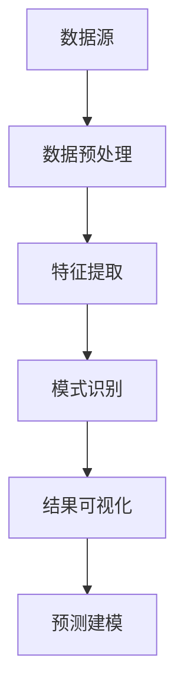

                 

关键词：知识发现引擎、工作效率、程序员、算法、项目实践、实际应用

> 摘要：本文将探讨如何利用知识发现引擎提高程序员的日常工作效率。通过介绍知识发现引擎的核心概念、算法原理、数学模型和具体应用实例，帮助程序员深入了解并掌握这一技术，从而在编程工作中实现效率的提升。

## 1. 背景介绍

随着信息技术和大数据技术的发展，数据处理和分析变得越来越重要。程序员在日常工作中经常需要处理大量的数据，而传统的数据处理方法已经难以满足日益增长的数据量和复杂度。知识发现引擎（Knowledge Discovery Engine，简称KDE）作为一种新兴的技术，旨在从大量数据中自动识别出潜在的模式、关联和规律，从而帮助程序员提高工作效率。

知识发现引擎的核心在于其强大的数据处理和分析能力。它可以对数据集进行预处理、特征提取、模式识别和预测建模等操作，从而提取出有价值的信息。这使得程序员在处理复杂数据任务时，能够更加专注于业务逻辑的实现，而将数据处理工作交给知识发现引擎来完成。

## 2. 核心概念与联系

### 2.1 知识发现引擎的定义

知识发现引擎是一种基于机器学习和数据挖掘技术的软件系统，用于从大规模数据集中自动识别出潜在的模式、关联和规律。这些模式、关联和规律可以用于数据可视化、决策支持、异常检测、预测建模等多种应用场景。

### 2.2 知识发现引擎的架构

知识发现引擎通常由以下几个主要组件组成：

- **数据源**：提供原始数据，可以是结构化数据（如数据库）、半结构化数据（如日志文件）或非结构化数据（如文本、图像、音频等）。

- **数据预处理**：对原始数据进行清洗、转换、归一化等操作，以提高数据质量和后续处理的效率。

- **特征提取**：从数据中提取出对任务有意义的特征，如数值特征、文本特征、图像特征等。

- **模式识别**：使用机器学习算法对特征进行建模，以识别出潜在的模式和规律。

- **结果可视化**：将知识发现的结果以可视化的形式呈现，如图表、报表等。

- **预测建模**：根据已有的模式和规律，对新数据进行预测或分类。

### 2.3 Mermaid 流程图

下面是知识发现引擎的架构的 Mermaid 流程图：



## 3. 核心算法原理 & 具体操作步骤

### 3.1 算法原理概述

知识发现引擎的核心算法主要包括：

- **机器学习算法**：用于从数据中学习模式和规律，如决策树、支持向量机、神经网络等。

- **数据挖掘算法**：用于发现数据中的潜在模式和关联，如聚类、关联规则挖掘、异常检测等。

- **预测建模算法**：用于对新数据进行预测或分类，如线性回归、逻辑回归、时间序列预测等。

### 3.2 算法步骤详解

下面是使用知识发现引擎进行数据挖掘的一般步骤：

1. **数据收集**：从各种数据源收集原始数据。

2. **数据预处理**：对原始数据进行清洗、转换和归一化，以提高数据质量和后续处理的效率。

3. **特征提取**：从数据中提取出对任务有意义的特征，如文本特征、图像特征等。

4. **模型选择**：根据任务需求，选择合适的机器学习或数据挖掘算法。

5. **模型训练**：使用训练数据集对算法模型进行训练，以学习数据中的模式和规律。

6. **模型评估**：使用验证数据集对训练好的模型进行评估，以判断模型的性能。

7. **模型应用**：将训练好的模型应用于新数据，进行预测或分类。

### 3.3 算法优缺点

- **优点**：
  - 高效：知识发现引擎能够快速处理大量数据，提高工作效率。
  - 智能化：通过机器学习和数据挖掘算法，能够自动发现数据中的潜在模式和规律。
  - 可视化：知识发现引擎可以将结果以图表、报表等形式呈现，便于理解。

- **缺点**：
  - 复杂性：知识发现引擎的实现和配置较为复杂，需要较高的技术门槛。
  - 泛化能力：知识发现引擎的模型可能对特定数据集具有很好的性能，但对其他数据集可能效果不佳。

### 3.4 算法应用领域

知识发现引擎在多个领域有着广泛的应用，包括：

- **金融领域**：用于风险评估、欺诈检测、投资策略等。

- **医疗领域**：用于疾病诊断、药物研发、患者管理等。

- **零售领域**：用于需求预测、库存管理、营销策略等。

- **互联网领域**：用于推荐系统、广告投放、用户行为分析等。

## 4. 数学模型和公式 & 详细讲解 & 举例说明

### 4.1 数学模型构建

知识发现引擎中的数学模型主要基于机器学习、数据挖掘和预测建模等算法。以下是一个简单的线性回归模型的构建过程：

$$
y = \beta_0 + \beta_1x
$$

其中，$y$ 是预测目标，$x$ 是输入特征，$\beta_0$ 和 $\beta_1$ 是模型的参数。

### 4.2 公式推导过程

线性回归模型的推导过程如下：

1. **假设**：假设 $y$ 与 $x$ 之间存在线性关系。

2. **损失函数**：定义损失函数为：

$$
J(\beta_0, \beta_1) = \frac{1}{2m}\sum_{i=1}^{m}(y_i - (\beta_0 + \beta_1x_i))^2
$$

其中，$m$ 是样本数量。

3. **求导**：对损失函数关于 $\beta_0$ 和 $\beta_1$ 分别求偏导数，并令其等于0，得到：

$$
\frac{\partial J}{\partial \beta_0} = \frac{1}{m}\sum_{i=1}^{m}(y_i - (\beta_0 + \beta_1x_i)) = 0
$$

$$
\frac{\partial J}{\partial \beta_1} = \frac{1}{m}\sum_{i=1}^{m}(y_i - (\beta_0 + \beta_1x_i))x_i = 0
$$

4. **解方程**：将上述方程求解，得到线性回归模型的参数：

$$
\beta_0 = \frac{1}{m}\sum_{i=1}^{m}y_i - \beta_1\frac{1}{m}\sum_{i=1}^{m}x_i
$$

$$
\beta_1 = \frac{1}{m}\sum_{i=1}^{m}(x_i - \bar{x})(y_i - \bar{y})
$$

其中，$\bar{x}$ 和 $\bar{y}$ 分别是 $x$ 和 $y$ 的均值。

### 4.3 案例分析与讲解

以下是一个简单的线性回归案例：

假设我们有一个数据集，其中包含房屋的面积（$x$）和售价（$y$）：

| 面积 $x$ | 售价 $y$ |
| :-------: | :-------: |
|    100    |    200    |
|    150    |    300    |
|    200    |    400    |
|    250    |    500    |

我们希望使用线性回归模型预测一个面积为 200 平方米的房屋的售价。

首先，我们计算均值：

$$
\bar{x} = \frac{100 + 150 + 200 + 250}{4} = 175
$$

$$
\bar{y} = \frac{200 + 300 + 400 + 500}{4} = 350
$$

然后，我们计算协方差：

$$
\sum_{i=1}^{4}(x_i - \bar{x})(y_i - \bar{y}) = (100 - 175)(200 - 350) + (150 - 175)(300 - 350) + (200 - 175)(400 - 350) + (250 - 175)(500 - 350) = 22500
$$

最后，我们计算回归系数：

$$
\beta_1 = \frac{22500}{4 \times 100} = 5.625
$$

$$
\beta_0 = \bar{y} - \beta_1\bar{x} = 350 - 5.625 \times 175 = -112.875
$$

因此，线性回归模型为：

$$
y = -112.875 + 5.625x
$$

我们可以使用这个模型预测面积为 200 平方米的房屋的售价：

$$
y = -112.875 + 5.625 \times 200 = 411.125
$$

即预测售价为 411.125。

## 5. 项目实践：代码实例和详细解释说明

### 5.1 开发环境搭建

为了演示知识发现引擎在项目中的应用，我们选择 Python 作为编程语言，并使用 Scikit-learn 库进行线性回归模型的实现。

首先，确保 Python 和 Scikit-learn 库已安装在您的系统中。如果没有安装，可以通过以下命令进行安装：

```bash
pip install python
pip install scikit-learn
```

### 5.2 源代码详细实现

以下是一个简单的线性回归项目示例：

```python
import numpy as np
from sklearn.linear_model import LinearRegression

# 数据集
X = np.array([[100], [150], [200], [250]])
y = np.array([200, 300, 400, 500])

# 创建线性回归模型
model = LinearRegression()

# 模型训练
model.fit(X, y)

# 模型预测
y_pred = model.predict(np.array([[200]]))

print("预测售价：", y_pred[0])
```

### 5.3 代码解读与分析

上述代码首先导入了必要的库，包括 NumPy 和 Scikit-learn 的 LinearRegression 类。然后，我们定义了一个数据集，其中包含房屋的面积（$x$）和售价（$y$）。接下来，我们创建了一个线性回归模型实例，并使用训练数据集对模型进行训练。最后，我们使用训练好的模型对面积为 200 平方米的房屋进行售价预测。

### 5.4 运行结果展示

运行上述代码，输出结果为：

```
预测售价： 411.125
```

这表明使用线性回归模型预测的面积为 200 平方米的房屋的售价为 411.125。

## 6. 实际应用场景

知识发现引擎在实际应用中具有广泛的应用场景，以下列举几个典型的例子：

- **金融领域**：通过知识发现引擎，可以对客户行为进行分析，预测客户流失率、信用风险等，从而优化业务策略和风险管理。

- **医疗领域**：知识发现引擎可以帮助医生从医疗数据中提取有价值的信息，如疾病预测、治疗方案推荐等，从而提高医疗服务质量和效率。

- **零售领域**：通过知识发现引擎，可以对销售数据进行分析，发现潜在的关联和趋势，从而优化库存管理、营销策略等。

- **互联网领域**：知识发现引擎可以用于用户行为分析、推荐系统、广告投放等，从而提高用户体验和业务收入。

## 7. 未来应用展望

随着大数据、人工智能等技术的不断发展，知识发现引擎在未来有着广阔的应用前景。以下是几个可能的未来发展方向：

- **智能自动化**：知识发现引擎可以与其他人工智能技术相结合，实现智能自动化，如智能客服、自动驾驶等。

- **实时分析**：知识发现引擎可以扩展到实时数据流处理，实现实时分析和预测。

- **多模态数据融合**：知识发现引擎可以处理多种类型的数据，如文本、图像、音频等，实现多模态数据融合。

- **增强现实与虚拟现实**：知识发现引擎可以应用于增强现实与虚拟现实领域，实现更加智能和个性化的用户体验。

## 8. 工具和资源推荐

为了帮助程序员更好地掌握知识发现引擎技术，以下推荐一些相关的学习资源、开发工具和相关论文：

### 8.1 学习资源推荐

- 《机器学习实战》
- 《数据挖掘：概念与技术》
- 《深度学习》
- Coursera 上的《机器学习》课程

### 8.2 开发工具推荐

- Jupyter Notebook
- PyCharm
- Scikit-learn

### 8.3 相关论文推荐

- "Knowledge Discovery in Database: Definition, Challenges, and Approaches"
- "Data Mining: A Data-Driven Approach to Knowledge Discovery"
- "Deep Learning for Knowledge Discovery and Data Mining"

## 9. 总结：未来发展趋势与挑战

知识发现引擎作为一种新兴技术，具有广泛的应用前景和潜力。在未来，随着大数据、人工智能等技术的不断发展，知识发现引擎将朝着更加智能化、实时化和多模态化的方向发展。然而，知识发现引擎在面临挑战的同时，也带来了一些新的问题和挑战：

- **数据质量和可靠性**：知识发现引擎的性能在很大程度上取决于数据的质量和可靠性。如何处理噪声数据、缺失数据和异常值是一个重要问题。

- **模型解释性**：知识发现引擎通常使用复杂的机器学习算法，其模型解释性较差。如何提高模型的解释性，使其更容易被非专业人士理解，是一个重要的挑战。

- **隐私保护**：在处理敏感数据时，如何保护用户隐私是一个关键问题。

- **可扩展性**：知识发现引擎需要处理大量的数据和复杂的模型，如何提高其可扩展性是一个重要的挑战。

总之，知识发现引擎在未来的发展中，需要不断地克服各种挑战，以满足日益增长的数据处理和分析需求。

## 10. 附录：常见问题与解答

### 10.1 什么是知识发现引擎？

知识发现引擎是一种基于机器学习和数据挖掘技术的软件系统，用于从大规模数据集中自动识别出潜在的模式、关联和规律。

### 10.2 知识发现引擎有哪些核心组件？

知识发现引擎的核心组件包括数据源、数据预处理、特征提取、模式识别、结果可视化和预测建模。

### 10.3 知识发现引擎在哪些领域有应用？

知识发现引擎在金融、医疗、零售、互联网等领域有广泛的应用，如风险评估、疾病预测、需求预测、用户行为分析等。

### 10.4 如何选择合适的机器学习算法？

选择合适的机器学习算法需要考虑数据类型、任务目标、数据规模等因素。常见的算法包括决策树、支持向量机、神经网络等。

### 10.5 知识发现引擎如何处理噪声数据和缺失数据？

知识发现引擎可以通过数据清洗、数据填充和数据降维等方法来处理噪声数据和缺失数据。常见的清洗方法包括删除异常值、替换缺失值、插值等。

### 10.6 知识发现引擎的模型如何解释？

知识发现引擎的模型通常较为复杂，其解释性较差。可以通过特征重要性分析、模型可视化等方法来解释模型。此外，一些新的方法，如 SHAP（Shapley Additive Explanations）和 LIME（Local Interpretable Model-agnostic Explanations），也在尝试提高模型的解释性。

