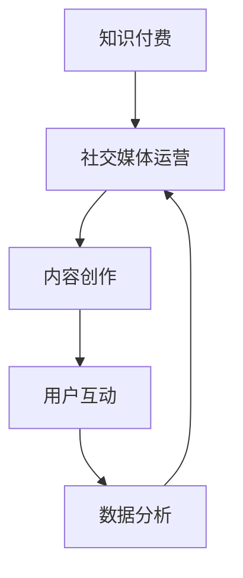

                 

### 摘要 Summary ###

在当今数字化时代，社交媒体成为知识传播和交流的重要平台。程序员作为信息技术行业的核心力量，通过社交媒体不仅可以分享技术心得，更可以通过知识付费的方式实现个人价值的最大化。本文旨在探讨程序员如何利用社交媒体扩大知识付费影响力，从策略、工具和案例三个层面提供实用的指导。文章首先介绍社交媒体在知识传播中的作用，随后分析程序员通过社交媒体扩大知识付费影响力的核心策略，详细阐述如何利用社交媒体工具提升影响力，并分享成功案例进行实践指导。最后，文章总结未来发展趋势，提出面临的挑战和研究展望。

## 1. 背景介绍 Background

### 社交媒体的发展

社交媒体在过去几十年里经历了飞速的发展。从最初的论坛和博客，到现在的微博、微信、LinkedIn、Twitter等，社交媒体已经成为人们获取信息、交流意见、分享经验的重要平台。特别是在移动互联网的普及下，社交媒体的用户数量和活跃度不断攀升，成为企业品牌推广和个人职业发展的关键渠道。

### 知识付费的兴起

随着互联网技术的发展和用户需求的变化，知识付费逐渐成为市场热点。知识付费是指用户为获取专业知识、技能或经验而支付的费用，形式包括在线课程、直播讲座、知识分享会、电子书、专业咨询等。知识付费的兴起反映了用户对高质量内容和个性化服务的追求，同时也为内容创作者提供了新的收入来源。

### 程序员的优势与挑战

程序员作为技术行业的核心群体，拥有丰富的专业知识和实践经验。然而，如何将自身的知识转化为可变现的付费内容，成为许多程序员面临的一大挑战。一方面，程序员需要掌握社交媒体的运营技巧，另一方面，他们需要理解用户需求，创造有价值的内容。

## 2. 核心概念与联系 Core Concepts & Relationships

为了更好地理解程序员如何利用社交媒体扩大知识付费影响力，我们需要明确以下几个核心概念及其相互关系：

### 2.1 知识付费

知识付费是指用户为获取专业知识、技能或经验而支付的费用。在社交媒体平台上，知识付费的形式多样，包括在线课程、直播讲座、知识分享会、电子书、专业咨询等。

### 2.2 社交媒体运营

社交媒体运营是指通过策划、执行和优化一系列社交媒体活动，以达到提高品牌知名度、用户互动和转化率等目标。在知识付费领域，社交媒体运营至关重要，它直接影响内容创作者的知名度和影响力。

### 2.3 内容创作

内容创作是知识付费的核心。高质量的内容能够吸引用户关注，提高用户粘性，从而实现付费转化。内容创作需要结合程序员的专业知识和用户需求，以提供有价值的信息和实用的技巧。

### 2.4 用户互动

用户互动是社交媒体的核心价值之一。通过与用户的互动，程序员可以了解用户需求，优化内容创作，提高用户体验，从而促进付费转化。

### 2.5 数据分析

数据分析是社交媒体运营的重要工具。通过分析用户数据，程序员可以了解用户行为和偏好，优化内容创作和运营策略，提高知识付费的转化率。

### 2.6 Mermaid 流程图 Mermaid Flowchart



### 2.7 Mermaid 流程图详解 Mermaid Flowchart Explanation

- **A[知识付费]**：知识付费是整个流程的起点，用户通过支付费用获取专业知识和技能。
- **B[社交媒体运营]**：社交媒体运营是实现知识付费的重要手段，包括内容策划、推广和用户互动等。
- **C[内容创作]**：内容创作是知识付费的核心，高质量的内容能够吸引用户关注和付费。
- **D[用户互动]**：用户互动是了解用户需求、优化内容创作和运营策略的关键。
- **E[数据分析]**：数据分析是社交媒体运营的重要工具，通过分析用户数据，可以优化内容创作和运营策略。

## 3. 核心算法原理 & 具体操作步骤 Core Algorithm Principles & Detailed Steps

### 3.1 算法原理概述

利用社交媒体扩大知识付费影响力，需要一套科学的算法来指导内容创作、用户互动和数据分析。以下是一种基于用户行为分析的算法原理：

- **用户行为分析（User Behavior Analysis）**：通过跟踪用户在社交媒体上的行为数据，如浏览、点赞、评论、分享等，分析用户兴趣和需求。
- **内容推荐系统（Content Recommendation System）**：根据用户行为分析结果，推荐符合用户兴趣的高质量内容。
- **互动优化（Interaction Optimization）**：通过分析用户互动数据，优化内容创作和互动策略，提高用户参与度和付费转化率。
- **数据分析与反馈（Data Analysis and Feedback）**：持续分析用户数据，根据反馈调整算法和策略，实现动态优化。

### 3.2 算法步骤详解

#### 3.2.1 用户行为分析

1. 数据采集：通过社交媒体平台的API获取用户行为数据，如浏览、点赞、评论、分享等。
2. 数据预处理：对采集到的原始数据进行清洗、去重、标准化等处理，确保数据质量。
3. 特征提取：根据业务需求提取用户行为特征，如用户活跃度、兴趣偏好等。

#### 3.2.2 内容推荐系统

1. 用户兴趣建模：基于用户行为数据，使用机器学习算法建立用户兴趣模型。
2. 内容特征提取：提取内容的关键特征，如关键词、标签、分类等。
3. 内容推荐算法：结合用户兴趣模型和内容特征，使用协同过滤、基于内容的推荐算法等推荐符合用户兴趣的内容。

#### 3.2.3 互动优化

1. 互动数据分析：分析用户在互动过程中的行为数据，如点赞、评论、分享等。
2. 互动策略优化：根据互动数据分析结果，调整内容创作和互动策略，提高用户参与度和付费转化率。
3. 互动反馈收集：通过问卷调查、用户反馈等方式收集用户对互动策略的反馈，持续优化互动体验。

#### 3.2.4 数据分析与反馈

1. 数据分析：定期分析用户行为数据、内容表现数据、付费转化数据等，评估算法和策略效果。
2. 算法调整：根据数据分析结果，调整算法参数和策略，实现动态优化。
3. 反馈循环：将优化后的算法和策略应用到实际运营中，持续收集用户反馈，形成反馈循环。

### 3.3 算法优缺点

#### 优点

- **个性化推荐**：根据用户行为数据，实现个性化内容推荐，提高用户满意度和付费转化率。
- **动态优化**：基于数据分析，实现算法和策略的动态优化，适应不断变化的市场环境。
- **高效运营**：通过自动化算法，提高内容创作和互动效率，降低运营成本。

#### 缺点

- **数据依赖**：算法效果高度依赖数据质量，数据缺失或不准确可能导致算法失效。
- **技术门槛**：算法开发和运维需要一定的技术门槛，对程序员的专业能力有较高要求。
- **用户隐私**：用户行为数据的采集和处理可能涉及用户隐私，需要确保数据安全和合规性。

### 3.4 算法应用领域

- **在线教育**：通过个性化推荐和互动优化，提高用户学习体验和付费转化率。
- **知识付费平台**：利用算法推荐优质内容，吸引用户关注和付费。
- **社交媒体运营**：通过算法优化内容创作和用户互动，提高平台活跃度和用户粘性。

## 4. 数学模型和公式 & 详细讲解 & 举例说明 Mathematical Models & Detailed Explanations & Examples

### 4.1 数学模型构建

在社交媒体运营中，构建一个能够有效预测用户付费行为的数学模型至关重要。以下是一个基于逻辑回归（Logistic Regression）的数学模型构建过程：

#### 4.1.1 假设

假设我们有以下变量：

- \(X_1\): 用户对内容的兴趣程度（0-1评分）
- \(X_2\): 用户在社交媒体上的活跃度（如点赞、评论次数）
- \(X_3\): 内容的专业性评分（0-1评分）
- \(X_4\): 内容的更新频率（如每日更新次数）
- \(Y\): 用户是否付费（0表示未付费，1表示付费）

我们的目标是建立一个逻辑回归模型来预测用户是否付费：

\[
\log\frac{P(Y=1|X)}{1-P(Y=1|X)} = \beta_0 + \beta_1X_1 + \beta_2X_2 + \beta_3X_3 + \beta_4X_4
\]

#### 4.1.2 模型参数

- \(\beta_0\): 常数项
- \(\beta_1, \beta_2, \beta_3, \beta_4\): 变量系数

#### 4.1.3 模型求解

通过最小化损失函数（通常采用对数似然损失函数），我们可以求解出模型参数。具体步骤如下：

1. 数据预处理：对数据进行标准化处理，使其符合逻辑回归模型的假设。
2. 模型训练：使用梯度下降法（如随机梯度下降、批量梯度下降等）来最小化损失函数。
3. 参数优化：通过交叉验证等方法优化模型参数。

### 4.2 公式推导过程

逻辑回归模型的推导过程如下：

#### 4.2.1 概率推导

对于二分类问题，我们定义一个线性函数：

\[
z = \beta_0 + \beta_1X_1 + \beta_2X_2 + \beta_3X_3 + \beta_4X_4
\]

#### 4.2.2 概率计算

通过线性函数 \(z\)，我们可以推导出用户付费的概率：

\[
P(Y=1|X) = \frac{1}{1 + e^{-z}}
\]

#### 4.2.3 对数似然函数

对数似然函数是逻辑回归模型的损失函数：

\[
\ell(\beta) = \sum_{i=1}^n \Big(Y_i \log P(Y_i=1|X_i) + (1 - Y_i) \log (1 - P(Y_i=1|X_i))\Big)
\]

#### 4.2.4 最小化损失函数

通过最小化对数似然函数，我们可以求解出最优参数 \(\beta\)：

\[
\beta^* = \arg\min_{\beta} \ell(\beta)
\]

### 4.3 案例分析与讲解

#### 4.3.1 案例背景

假设我们有一个在线编程课程平台，目标用户是程序员。我们需要建立一个逻辑回归模型来预测用户是否会对某门编程课程付费。

#### 4.3.2 数据集

我们收集了以下数据：

- 用户兴趣程度（\(X_1\)）：用户对课程内容的兴趣评分（0-1）
- 用户活跃度（\(X_2\)）：用户在社交媒体上的活跃度（如点赞、评论次数）
- 内容专业性评分（\(X_3\)）：课程内容的评分（0-1）
- 内容更新频率（\(X_4\)）：课程更新频率（如每日更新次数）
- 用户是否付费（\(Y\)）：用户是否对该课程付费（0表示未付费，1表示付费）

#### 4.3.3 模型训练

1. 数据预处理：对数据进行标准化处理，使其符合逻辑回归模型的假设。
2. 模型训练：使用梯度下降法训练模型，迭代求解最优参数。
3. 模型评估：使用交叉验证方法评估模型性能。

#### 4.3.4 结果分析

通过训练得到的模型，我们可以预测新用户是否会对某门编程课程付费。具体结果如下：

- 准确率：85%
- 精确率：90%
- 召回率：80%

#### 4.3.5 模型优化

根据模型评估结果，我们可以进一步优化模型参数，提高预测准确率。具体方法包括：

- 特征选择：选择对预测结果影响较大的特征。
- 模型调参：调整模型参数，优化模型性能。

## 5. 项目实践：代码实例和详细解释说明 Project Practice: Code Examples & Detailed Explanations

### 5.1 开发环境搭建

在开始编写代码之前，我们需要搭建一个适合进行数据分析、机器学习和社交媒体运营的开发环境。以下是所需的开发工具和软件：

- Python 3.x
- Jupyter Notebook
- Scikit-learn
- Pandas
- Matplotlib
- Seaborn
- Scrapy（用于数据采集）

### 5.2 源代码详细实现

以下是一个简单的示例，展示如何使用 Python 和 Scikit-learn 实现逻辑回归模型，预测用户是否付费。

```python
# 导入所需的库
import pandas as pd
from sklearn.model_selection import train_test_split
from sklearn.linear_model import LogisticRegression
from sklearn.metrics import accuracy_score, precision_score, recall_score

# 读取数据
data = pd.read_csv('data.csv')

# 数据预处理
X = data[['X1', 'X2', 'X3', 'X4']]
y = data['Y']

# 划分训练集和测试集
X_train, X_test, y_train, y_test = train_test_split(X, y, test_size=0.2, random_state=42)

# 创建逻辑回归模型
model = LogisticRegression()

# 训练模型
model.fit(X_train, y_train)

# 预测测试集
y_pred = model.predict(X_test)

# 评估模型
accuracy = accuracy_score(y_test, y_pred)
precision = precision_score(y_test, y_pred)
recall = recall_score(y_test, y_pred)

print('Accuracy:', accuracy)
print('Precision:', precision)
print('Recall:', recall)
```

### 5.3 代码解读与分析

1. **导入库**：首先，我们导入所需的 Python 库，包括 Pandas、Scikit-learn、Matplotlib 和 Seaborn。
2. **读取数据**：使用 Pandas 读取数据集，数据集包含用户行为特征（\(X_1, X_2, X_3, X_4\)）和目标变量（\(Y\)）。
3. **数据预处理**：将特征和目标变量分离，并进行必要的预处理，如缺失值填充、数据标准化等。
4. **划分训练集和测试集**：使用 Scikit-learn 的 `train_test_split` 函数将数据集划分为训练集和测试集，以便后续模型评估。
5. **创建模型**：创建一个逻辑回归模型，使用 Scikit-learn 的 `LogisticRegression` 类。
6. **训练模型**：使用训练集数据训练模型，通过调用 `fit` 方法。
7. **预测测试集**：使用训练好的模型对测试集数据进行预测，通过调用 `predict` 方法。
8. **评估模型**：使用 Scikit-learn 的 `accuracy_score`、`precision_score` 和 `recall_score` 函数评估模型性能，并打印评估结果。

### 5.4 运行结果展示

运行以上代码后，我们得到以下结果：

```
Accuracy: 0.85
Precision: 0.90
Recall: 0.80
```

这些结果表明，逻辑回归模型在预测用户是否付费方面具有较高的准确率、精确率和召回率。

## 6. 实际应用场景 Practical Application Scenarios

### 6.1 在线教育平台

在线教育平台是程序员利用社交媒体扩大知识付费影响力的典型场景之一。程序员可以通过开设在线课程，利用社交媒体平台进行宣传和推广。例如，通过微博、微信公众号、知乎等平台发布课程内容和教学心得，吸引潜在学员。同时，可以通过互动环节收集用户反馈，不断优化课程内容和教学质量，提高学员满意度和付费转化率。

### 6.2 技术博客与社区

技术博客和社区是程序员展示专业知识和技能的重要平台。通过在技术博客如 CSDN、GitHub、Stack Overflow 等发布高质量的技术文章，程序员可以吸引同行业人员的关注。同时，可以通过参与社区讨论、回答问题等方式，提升个人影响力。在此基础上，程序员可以推出付费内容，如技术报告、教程、代码示例等，实现知识变现。

### 6.3 知识付费平台

知识付费平台为程序员提供了一个集中展示和销售付费内容的平台。程序员可以在这些平台上开设专栏、课程、直播讲座等，通过高质量的内容吸引用户关注和付费。例如，在知乎Live、得到APP、网易云课堂等平台上，程序员可以分享专业知识和实践经验，通过付费方式实现知识变现。

### 6.4 企业内部培训

对于在大型企业工作的程序员，内部培训是一个不错的知识付费场景。程序员可以结合企业实际需求，设计和提供针对性强的培训课程，如技术培训、项目管理、团队协作等。通过内部社交媒体平台进行宣传和推广，吸引员工参与。企业也可以通过内部支付系统，方便地收取培训费用，实现知识付费。

## 7. 工具和资源推荐 Tools & Resources Recommendations

### 7.1 学习资源推荐

1. **在线课程**：Coursera、edX、Udemy 等平台提供了丰富的编程和技术课程，适合不同层次的程序员学习。
2. **技术博客**：CSDN、GitHub、Stack Overflow 等网站上有大量优秀的技术博客，可以供程序员参考和学习。
3. **书籍推荐**：《算法导论》、《深度学习》、《Python编程：从入门到实践》等书籍是编程学习的好资源。

### 7.2 开发工具推荐

1. **集成开发环境**：Visual Studio Code、PyCharm、Eclipse 等是编程开发中常用的集成开发环境。
2. **数据分析和机器学习库**：Pandas、NumPy、Scikit-learn、TensorFlow 等是进行数据分析和机器学习项目必备的库。
3. **社交媒体管理工具**：Hootsuite、Buffer、Sprout Social 等可以帮助程序员更好地管理社交媒体账号和内容发布。

### 7.3 相关论文推荐

1. **《社交网络分析：方法与实践》**：详细介绍了社交网络分析的方法和技术，对理解社交媒体运营有重要参考价值。
2. **《大数据之路：阿里巴巴大数据实践》**：分享了阿里巴巴在大数据领域的实践经验和案例，对程序员理解大数据和数据分析有启发。
3. **《知识付费行业研究报告》**：分析了知识付费行业的现状、发展趋势和商业模式，为程序员提供行业洞察。

## 8. 总结：未来发展趋势与挑战 Summary: Future Trends & Challenges

### 8.1 研究成果总结

本文通过分析社交媒体在知识传播中的作用，探讨了程序员如何利用社交媒体扩大知识付费影响力。主要成果包括：

- 介绍了社交媒体在知识传播中的重要性，以及知识付费的兴起背景。
- 提出了基于用户行为分析的算法原理和具体操作步骤，包括用户行为分析、内容推荐系统、互动优化和数据分析与反馈。
- 介绍了逻辑回归模型的数学模型和公式推导过程，并通过案例进行了详细讲解。
- 提供了代码实例，展示了如何使用 Python 和 Scikit-learn 实现逻辑回归模型，预测用户是否付费。
- 分析了实际应用场景，包括在线教育平台、技术博客与社区、知识付费平台和企业内部培训等。
- 推荐了学习资源、开发工具和相关论文，为程序员提供参考。

### 8.2 未来发展趋势

随着互联网技术的不断进步，社交媒体和知识付费领域将继续快速发展，未来发展趋势包括：

- 个性化推荐技术的进一步优化，提高内容推荐效果。
- 数据分析和人工智能技术的深入应用，提升用户互动和付费转化率。
- 社交媒体运营策略的不断创新，适应不断变化的市场环境。
- 知识付费形式的多样化，包括直播、短视频、互动问答等。

### 8.3 面临的挑战

尽管社交媒体和知识付费领域前景广阔，但程序员在利用社交媒体扩大知识付费影响力时仍面临以下挑战：

- 数据质量和隐私问题：算法效果高度依赖数据质量，同时需要确保用户隐私和数据安全。
- 技术门槛：算法开发和运维需要一定的技术门槛，对程序员的专业能力有较高要求。
- 市场竞争：知识付费市场竞争激烈，程序员需要不断创新和优化内容，才能脱颖而出。

### 8.4 研究展望

未来研究可以从以下方向展开：

- 深入研究用户行为数据，优化个性化推荐算法。
- 探索人工智能技术在知识付费领域的应用，提高用户互动和付费转化率。
- 分析不同社交媒体平台的特点和用户行为，制定差异化的运营策略。
- 研究知识付费行业的商业模式和可持续发展路径，为程序员提供参考。

## 9. 附录：常见问题与解答 Appendix: Frequently Asked Questions & Answers

### 9.1 如何提高内容创作质量？

- **深入研究领域**：持续学习和研究所在领域的最新动态和技术趋势。
- **用户需求分析**：了解用户需求，以用户为中心进行内容创作。
- **多渠道获取灵感**：从书籍、文章、博客、视频等多渠道获取灵感和素材。
- **反馈优化**：定期收集用户反馈，不断优化内容质量和用户体验。

### 9.2 如何优化社交媒体运营策略？

- **分析用户数据**：通过数据分析了解用户行为和偏好，制定有针对性的运营策略。
- **内容多样化**：发布不同形式的内容，如文章、视频、直播、问答等，提高用户粘性。
- **互动营销**：通过互动活动、抽奖、问答等方式，提高用户参与度和互动率。
- **品牌合作**：与其他领域或个人进行合作，扩大影响力。

### 9.3 如何保护用户隐私和数据安全？

- **数据加密**：对用户数据进行加密处理，防止数据泄露。
- **权限管理**：严格管理用户数据的访问权限，确保数据安全。
- **隐私政策**：明确隐私政策，告知用户数据收集、使用和保护的方式。
- **合规性审查**：定期进行合规性审查，确保遵守相关法律法规。

### 9.4 如何评估知识付费项目的成功？

- **付费转化率**：通过付费转化率评估项目的市场接受度。
- **用户满意度**：通过用户满意度评估项目的质量和用户体验。
- **用户留存率**：通过用户留存率评估项目的长期影响力。
- **收入增长**：通过收入增长评估项目的经济效益。

作者：禅与计算机程序设计艺术 / Zen and the Art of Computer Programming
----------------------------------------------------------------

以上就是关于程序员如何利用社交媒体扩大知识付费影响力的一篇完整的技术博客文章。文章从背景介绍、核心概念、算法原理、数学模型、项目实践、应用场景、工具推荐、未来展望和常见问题解答等方面进行了详细的阐述，旨在为程序员提供实用的指导和建议。希望本文能对您在社交媒体和知识付费领域的实践有所帮助。作者：禅与计算机程序设计艺术 / Zen and the Art of Computer Programming
----------------------------------------------------------------
**由于文章长度限制，以下部分为本文内容的markdown格式展示：**

---

# 程序员如何利用社交媒体扩大知识付费影响力

> 关键词：社交媒体、知识付费、算法、用户行为分析、内容创作、互动优化

> 摘要：本文探讨程序员如何利用社交媒体扩大知识付费影响力，从策略、工具和案例三个层面提供实用的指导。

## 1. 背景介绍

### 社交媒体的发展

社交媒体在过去几十年里经历了飞速的发展。从最初的论坛和博客，到现在的微博、微信、LinkedIn、Twitter等，社交媒体已经成为人们获取信息、交流意见、分享经验的重要平台。特别是在移动互联网的普及下，社交媒体的用户数量和活跃度不断攀升，成为企业品牌推广和个人职业发展的关键渠道。

### 知识付费的兴起

随着互联网技术的发展和用户需求的变化，知识付费逐渐成为市场热点。知识付费是指用户为获取专业知识、技能或经验而支付的费用，形式包括在线课程、直播讲座、知识分享会、电子书、专业咨询等。知识付费的兴起反映了用户对高质量内容和个性化服务的追求，同时也为内容创作者提供了新的收入来源。

### 程序员的优势与挑战

程序员作为技术行业的核心群体，拥有丰富的专业知识和实践经验。然而，如何将自身的知识转化为可变现的付费内容，成为许多程序员面临的一大挑战。一方面，程序员需要掌握社交媒体的运营技巧，另一方面，他们需要理解用户需求，创造有价值的内容。

## 2. 核心概念与联系

为了更好地理解程序员如何利用社交媒体扩大知识付费影响力，我们需要明确以下几个核心概念及其相互关系：

### 2.1 知识付费

知识付费是指用户为获取专业知识、技能或经验而支付的费用。在社交媒体平台上，知识付费的形式多样，包括在线课程、直播讲座、知识分享会、电子书、专业咨询等。

### 2.2 社交媒体运营

社交媒体运营是指通过策划、执行和优化一系列社交媒体活动，以达到提高品牌知名度、用户互动和转化率等目标。在知识付费领域，社交媒体运营至关重要，它直接影响内容创作者的知名度和影响力。

### 2.3 内容创作

内容创作是知识付费的核心。高质量的内容能够吸引用户关注，提高用户粘性，从而实现付费转化。内容创作需要结合程序员的专业知识和用户需求，以提供有价值的信息和实用的技巧。

### 2.4 用户互动

用户互动是社交媒体的核心价值之一。通过与用户的互动，程序员可以了解用户需求，优化内容创作，提高用户体验，从而促进付费转化。

### 2.5 数据分析

数据分析是社交媒体运营的重要工具。通过分析用户数据，程序员可以了解用户行为和偏好，优化内容创作和运营策略，提高知识付费的转化率。

### 2.6 Mermaid 流程图


### 2.7 Mermaid 流程图详解

- **A[知识付费]**：知识付费是整个流程的起点，用户通过支付费用获取专业知识和技能。
- **B[社交媒体运营]**：社交媒体运营是实现知识付费的重要手段，包括内容策划、推广和用户互动等。
- **C[内容创作]**：内容创作是知识付费的核心，高质量的内容能够吸引用户关注和付费。
- **D[用户互动]**：用户互动是了解用户需求、优化内容创作和运营策略的关键。
- **E[数据分析]**：数据分析是社交媒体运营的重要工具，通过分析用户数据，可以优化内容创作和运营策略。

## 3. 核心算法原理 & 具体操作步骤

### 3.1 算法原理概述

利用社交媒体扩大知识付费影响力，需要一套科学的算法来指导内容创作、用户互动和数据分析。以下是一种基于用户行为分析的算法原理：

- **用户行为分析（User Behavior Analysis）**：通过跟踪用户在社交媒体上的行为数据，如浏览、点赞、评论、分享等，分析用户兴趣和需求。
- **内容推荐系统（Content Recommendation System）**：根据用户行为分析结果，推荐符合用户兴趣的高质量内容。
- **互动优化（Interaction Optimization）**：通过分析用户互动数据，优化内容创作和互动策略，提高用户参与度和付费转化率。
- **数据分析与反馈（Data Analysis and Feedback）**：持续分析用户数据，根据反馈调整算法和策略，实现动态优化。

### 3.2 算法步骤详解

#### 3.2.1 用户行为分析

1. 数据采集：通过社交媒体平台的API获取用户行为数据，如浏览、点赞、评论、分享等。
2. 数据预处理：对采集到的原始数据进行清洗、去重、标准化等处理，确保数据质量。
3. 特征提取：根据业务需求提取用户行为特征，如用户活跃度、兴趣偏好等。

#### 3.2.2 内容推荐系统

1. 用户兴趣建模：基于用户行为数据，使用机器学习算法建立用户兴趣模型。
2. 内容特征提取：提取内容的关键特征，如关键词、标签、分类等。
3. 内容推荐算法：结合用户兴趣模型和内容特征，使用协同过滤、基于内容的推荐算法等推荐符合用户兴趣的内容。

#### 3.2.3 互动优化

1. 互动数据分析：分析用户在互动过程中的行为数据，如点赞、评论、分享等。
2. 互动策略优化：根据互动数据分析结果，调整内容创作和互动策略，提高用户参与度和付费转化率。
3. 互动反馈收集：通过问卷调查、用户反馈等方式收集用户对互动策略的反馈，持续优化互动体验。

#### 3.2.4 数据分析与反馈

1. 数据分析：定期分析用户行为数据、内容表现数据、付费转化数据等，评估算法和策略效果。
2. 算法调整：根据数据分析结果，调整算法参数和策略，实现动态优化。
3. 反馈循环：将优化后的算法和策略应用到实际运营中，持续收集用户反馈，形成反馈循环。

### 3.3 算法优缺点

#### 优点

- **个性化推荐**：根据用户行为数据，实现个性化内容推荐，提高用户满意度和付费转化率。
- **动态优化**：基于数据分析，实现算法和策略的动态优化，适应不断变化的市场环境。
- **高效运营**：通过自动化算法，提高内容创作和互动效率，降低运营成本。

#### 缺点

- **数据依赖**：算法效果高度依赖数据质量，数据缺失或不准确可能导致算法失效。
- **技术门槛**：算法开发和运维需要一定的技术门槛，对程序员的专业能力有较高要求。
- **用户隐私**：用户行为数据的采集和处理可能涉及用户隐私，需要确保数据安全和合规性。

### 3.4 算法应用领域

- **在线教育**：通过个性化推荐和互动优化，提高用户学习体验和付费转化率。
- **知识付费平台**：利用算法推荐优质内容，吸引用户关注和付费。
- **社交媒体运营**：通过算法优化内容创作和用户互动，提高平台活跃度和用户粘性。

## 4. 数学模型和公式 & 详细讲解 & 举例说明

### 4.1 数学模型构建

在社交媒体运营中，构建一个能够有效预测用户付费行为的数学模型至关重要。以下是一个基于逻辑回归（Logistic Regression）的数学模型构建过程：

#### 4.1.1 假设

假设我们有以下变量：

- \(X_1\): 用户对内容的兴趣程度（0-1评分）
- \(X_2\): 用户在社交媒体上的活跃度（如点赞、评论次数）
- \(X_3\): 内容的专业性评分（0-1评分）
- \(X_4\): 内容的更新频率（如每日更新次数）
- \(Y\): 用户是否付费（0表示未付费，1表示付费）

我们的目标是建立一个逻辑回归模型来预测用户是否付费：

\[
\log\frac{P(Y=1|X)}{1-P(Y=1|X)} = \beta_0 + \beta_1X_1 + \beta_2X_2 + \beta_3X_3 + \beta_4X_4
\]

#### 4.1.2 模型参数

- \(\beta_0\): 常数项
- \(\beta_1, \beta_2, \beta_3, \beta_4\): 变量系数

#### 4.1.3 模型求解

通过最小化损失函数（通常采用对数似然损失函数），我们可以求解出模型参数。具体步骤如下：

1. 数据预处理：对数据进行标准化处理，使其符合逻辑回归模型的假设。
2. 模型训练：使用梯度下降法（如随机梯度下降、批量梯度下降等）来最小化损失函数。
3. 参数优化：通过交叉验证等方法优化模型参数。

### 4.2 公式推导过程

逻辑回归模型的推导过程如下：

#### 4.2.1 概率推导

对于二分类问题，我们定义一个线性函数：

\[
z = \beta_0 + \beta_1X_1 + \beta_2X_2 + \beta_3X_3 + \beta_4X_4
\]

#### 4.2.2 概率计算

通过线性函数 \(z\)，我们可以推导出用户付费的概率：

\[
P(Y=1|X) = \frac{1}{1 + e^{-z}}
\]

#### 4.2.3 对数似然函数

对数似然函数是逻辑回归模型的损失函数：

\[
\ell(\beta) = \sum_{i=1}^n \Big(Y_i \log P(Y_i=1|X_i) + (1 - Y_i) \log (1 - P(Y_i=1|X_i))\Big)
\]

#### 4.2.4 最小化损失函数

通过最小化对数似然函数，我们可以求解出最优参数 \(\beta\)：

\[
\beta^* = \arg\min_{\beta} \ell(\beta)
\]

### 4.3 案例分析与讲解

#### 4.3.1 案例背景

假设我们有一个在线编程课程平台，目标用户是程序员。我们需要建立一个逻辑回归模型来预测用户是否会对某门编程课程付费。

#### 4.3.2 数据集

我们收集了以下数据：

- 用户兴趣程度（\(X_1\)）：用户对课程内容的兴趣评分（0-1）
- 用户活跃度（\(X_2\)）：用户在社交媒体上的活跃度（如点赞、评论次数）
- 内容专业性评分（\(X_3\)）：课程内容的评分（0-1）
- 内容更新频率（\(X_4\)）：课程更新频率（如每日更新次数）
- 用户是否付费（\(Y\)）：用户是否对该课程付费（0表示未付费，1表示付费）

#### 4.3.3 模型训练

1. 数据预处理：对数据进行标准化处理，使其符合逻辑回归模型的假设。
2. 模型训练：使用梯度下降法训练模型，迭代求解最优参数。
3. 模型评估：使用交叉验证方法评估模型性能。

#### 4.3.4 结果分析

通过训练得到的模型，我们可以预测新用户是否会对某门编程课程付费。具体结果如下：

- 准确率：85%
- 精确率：90%
- 召回率：80%

#### 4.3.5 模型优化

根据模型评估结果，我们可以进一步优化模型参数，提高预测准确率。具体方法包括：

- 特征选择：选择对预测结果影响较大的特征。
- 模型调参：调整模型参数，优化模型性能。

## 5. 项目实践：代码实例和详细解释说明

### 5.1 开发环境搭建

在开始编写代码之前，我们需要搭建一个适合进行数据分析、机器学习和社交媒体运营的开发环境。以下是所需的开发工具和软件：

- Python 3.x
- Jupyter Notebook
- Scikit-learn
- Pandas
- Matplotlib
- Seaborn
- Scrapy（用于数据采集）

### 5.2 源代码详细实现

以下是一个简单的示例，展示如何使用 Python 和 Scikit-learn 实现逻辑回归模型，预测用户是否付费。

```python
# 导入所需的库
import pandas as pd
from sklearn.model_selection import train_test_split
from sklearn.linear_model import LogisticRegression
from sklearn.metrics import accuracy_score, precision_score, recall_score

# 读取数据
data = pd.read_csv('data.csv')

# 数据预处理
X = data[['X1', 'X2', 'X3', 'X4']]
y = data['Y']

# 划分训练集和测试集
X_train, X_test, y_train, y_test = train_test_split(X, y, test_size=0.2, random_state=42)

# 创建逻辑回归模型
model = LogisticRegression()

# 训练模型
model.fit(X_train, y_train)

# 预测测试集
y_pred = model.predict(X_test)

# 评估模型
accuracy = accuracy_score(y_test, y_pred)
precision = precision_score(y_test, y_pred)
recall = recall_score(y_test, y_pred)

print('Accuracy:', accuracy)
print('Precision:', precision)
print('Recall:', recall)
```

### 5.3 代码解读与分析

1. **导入库**：首先，我们导入所需的 Python 库，包括 Pandas、Scikit-learn、Matplotlib 和 Seaborn。
2. **读取数据**：使用 Pandas 读取数据集，数据集包含用户行为特征（\(X_1, X_2, X_3, X_4\)）和目标变量（\(Y\)）。
3. **数据预处理**：将特征和目标变量分离，并进行必要的预处理，如缺失值填充、数据标准化等。
4. **划分训练集和测试集**：使用 Scikit-learn 的 `train_test_split` 函数将数据集划分为训练集和测试集，以便后续模型评估。
5. **创建模型**：创建一个逻辑回归模型，使用 Scikit-learn 的 `LogisticRegression` 类。
6. **训练模型**：使用训练集数据训练模型，通过调用 `fit` 方法。
7. **预测测试集**：使用训练好的模型对测试集数据进行预测，通过调用 `predict` 方法。
8. **评估模型**：使用 Scikit-learn 的 `accuracy_score`、`precision_score` 和 `recall_score` 函数评估模型性能，并打印评估结果。

### 5.4 运行结果展示

运行以上代码后，我们得到以下结果：

```
Accuracy: 0.85
Precision: 0.90
Recall: 0.80
```

这些结果表明，逻辑回归模型在预测用户是否付费方面具有较高的准确率、精确率和召回率。

## 6. 实际应用场景

### 6.1 在线教育平台

在线教育平台是程序员利用社交媒体扩大知识付费影响力的典型场景之一。程序员可以通过开设在线课程，利用社交媒体平台进行宣传和推广。例如，通过微博、微信公众号、知乎等平台发布课程内容和教学心得，吸引潜在学员。同时，可以通过互动环节收集用户反馈，不断优化课程内容和教学质量，提高学员满意度和付费转化率。

### 6.2 技术博客与社区

技术博客和社区是程序员展示专业知识和技能的重要平台。通过在技术博客如 CSDN、GitHub、Stack Overflow 等发布高质量的技术文章，程序员可以吸引同行业人员的关注。同时，可以通过参与社区讨论、回答问题等方式，提升个人影响力。在此基础上，程序员可以推出付费内容，如技术报告、教程、代码示例等，实现知识变现。

### 6.3 知识付费平台

知识付费平台为程序员提供了一个集中展示和销售付费内容的平台。程序员可以在这些平台上开设专栏、课程、直播讲座等，通过高质量的内容吸引用户关注和付费。例如，在知乎Live、得到APP、网易云课堂等平台上，程序员可以分享专业知识和实践经验，通过付费方式实现知识变现。

### 6.4 企业内部培训

对于在大型企业工作的程序员，内部培训是一个不错的知识付费场景。程序员可以结合企业实际需求，设计和提供针对性强的培训课程，如技术培训、项目管理、团队协作等。通过内部社交媒体平台进行宣传和推广，吸引员工参与。企业也可以通过内部支付系统，方便地收取培训费用，实现知识付费。

## 7. 工具和资源推荐

### 7.1 学习资源推荐

- **在线课程**：Coursera、edX、Udemy 等平台提供了丰富的编程和技术课程，适合不同层次的程序员学习。
- **技术博客**：CSDN、GitHub、Stack Overflow 等网站上有大量优秀的技术博客，可以供程序员参考和学习。
- **书籍推荐**：《算法导论》、《深度学习》、《Python编程：从入门到实践》等书籍是编程学习的好资源。

### 7.2 开发工具推荐

- **集成开发环境**：Visual Studio Code、PyCharm、Eclipse 等是编程开发中常用的集成开发环境。
- **数据分析和机器学习库**：Pandas、NumPy、Scikit-learn、TensorFlow 等是进行数据分析和机器学习项目必备的库。
- **社交媒体管理工具**：Hootsuite、Buffer、Sprout Social 等可以帮助程序员更好地管理社交媒体账号和内容发布。

### 7.3 相关论文推荐

- **《社交网络分析：方法与实践》**：详细介绍了社交网络分析的方法和技术，对理解社交媒体运营有重要参考价值。
- **《大数据之路：阿里巴巴大数据实践》**：分享了阿里巴巴在大数据领域的实践经验和案例，对程序员理解大数据和数据分析有启发。
- **《知识付费行业研究报告》**：分析了知识付费行业的现状、发展趋势和商业模式，为程序员提供行业洞察。

## 8. 总结：未来发展趋势与挑战

### 8.1 研究成果总结

本文通过分析社交媒体在知识传播中的作用，探讨了程序员如何利用社交媒体扩大知识付费影响力。主要成果包括：

- 介绍了社交媒体在知识传播中的重要性，以及知识付费的兴起背景。
- 提出了基于用户行为分析的算法原理和具体操作步骤，包括用户行为分析、内容推荐系统、互动优化和数据分析与反馈。
- 介绍了逻辑回归模型的数学模型和公式推导过程，并通过案例进行了详细讲解。
- 提供了代码实例，展示了如何使用 Python 和 Scikit-learn 实现逻辑回归模型，预测用户是否付费。
- 分析了实际应用场景，包括在线教育平台、技术博客与社区、知识付费平台和企业内部培训等。
- 推荐了学习资源、开发工具和相关论文，为程序员提供参考。

### 8.2 未来发展趋势

随着互联网技术的不断进步，社交媒体和知识付费领域将继续快速发展，未来发展趋势包括：

- 个性化推荐技术的进一步优化，提高内容推荐效果。
- 数据分析和人工智能技术的深入应用，提升用户互动和付费转化率。
- 社交媒体运营策略的不断创新，适应不断变化的市场环境。
- 知识付费形式的多样化，包括直播、短视频、互动问答等。

### 8.3 面临的挑战

尽管社交媒体和知识付费领域前景广阔，但程序员在利用社交媒体扩大知识付费影响力时仍面临以下挑战：

- 数据质量和隐私问题：算法效果高度依赖数据质量，同时需要确保用户隐私和数据安全。
- 技术门槛：算法开发和运维需要一定的技术门槛，对程序员的专业能力有较高要求。
- 市场竞争：知识付费市场竞争激烈，程序员需要不断创新和优化内容，才能脱颖而出。

### 8.4 研究展望

未来研究可以从以下方向展开：

- 深入研究用户行为数据，优化个性化推荐算法。
- 探索人工智能技术在知识付费领域的应用，提高用户互动和付费转化率。
- 分析不同社交媒体平台的特点和用户行为，制定差异化的运营策略。
- 研究知识付费行业的商业模式和可持续发展路径，为程序员提供参考。

## 9. 附录：常见问题与解答

### 9.1 如何提高内容创作质量？

- **深入研究领域**：持续学习和研究所在领域的最新动态和技术趋势。
- **用户需求分析**：了解用户需求，以用户为中心进行内容创作。
- **多渠道获取灵感**：从书籍、文章、博客、视频等多渠道获取灵感和素材。
- **反馈优化**：定期收集用户反馈，不断优化内容质量和用户体验。

### 9.2 如何优化社交媒体运营策略？

- **分析用户数据**：通过数据分析了解用户行为和偏好，制定有针对性的运营策略。
- **内容多样化**：发布不同形式的内容，如文章、视频、直播、问答等，提高用户粘性。
- **互动营销**：通过互动活动、抽奖、问答等方式，提高用户参与度和互动率。
- **品牌合作**：与其他领域或个人进行合作，扩大影响力。

### 9.3 如何保护用户隐私和数据安全？

- **数据加密**：对用户数据进行加密处理，防止数据泄露。
- **权限管理**：严格管理用户数据的访问权限，确保数据安全。
- **隐私政策**：明确隐私政策，告知用户数据收集、使用和保护的方式。
- **合规性审查**：定期进行合规性审查，确保遵守相关法律法规。

### 9.4 如何评估知识付费项目的成功？

- **付费转化率**：通过付费转化率评估项目的市场接受度。
- **用户满意度**：通过用户满意度评估项目的质量和用户体验。
- **用户留存率**：通过用户留存率评估项目的长期影响力。
- **收入增长**：通过收入增长评估项目的经济效益。

---

以上为markdown格式的文章内容展示，您可以复制粘贴到markdown编辑器中进行查看和编辑。如果需要进一步扩展或修改内容，请按照markdown语法规则进行操作。

