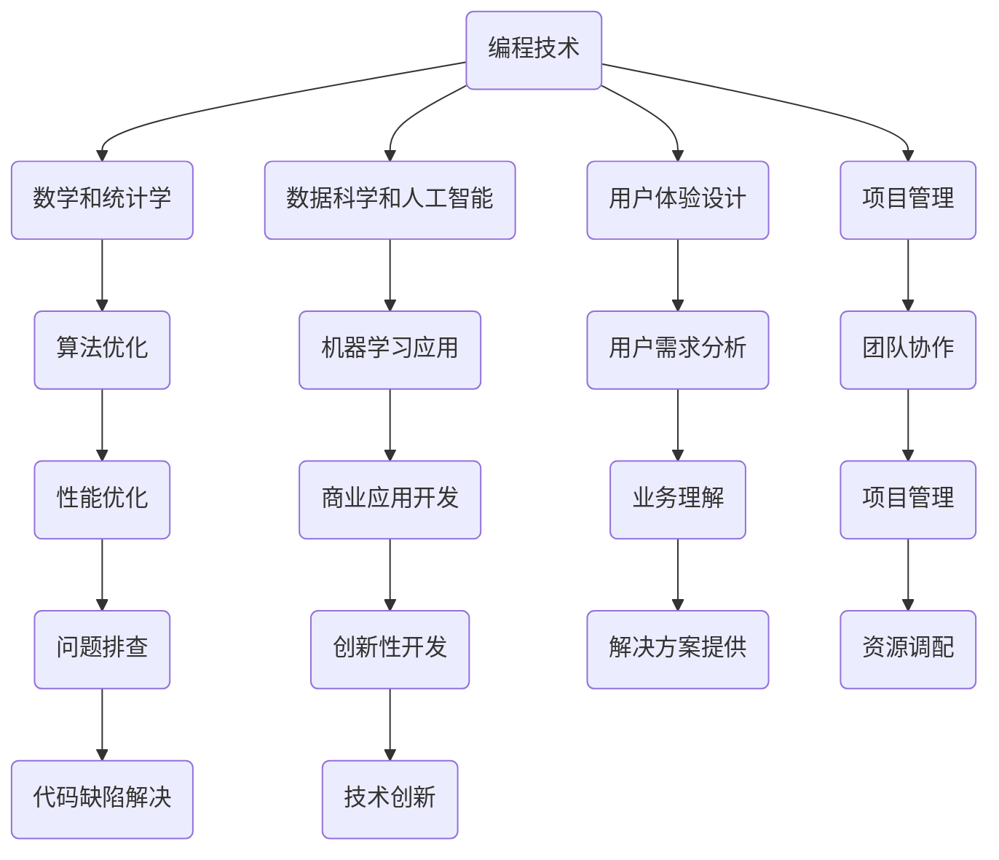

                 

## 1. 背景介绍

在当今快速发展的数字时代，技术的进步和社会的变革催生了诸多新兴产业和职业角色。程序员，这个原本在幕后默默编码的群体，逐渐成为了知识经济时代的重要推动者。然而，随着行业的不断细分和复杂化，单纯的编程技能已经不足以满足市场的需求。越来越多的程序员开始意识到，跨界知识的学习和运用成为了提升个人价值、拓展职业发展空间的关键。

跨界知识，即在不同领域之间进行知识交叉和应用的能力。对于程序员而言，这不仅仅是拓展技能的范围，更是一种综合素质的提升。在编程领域，跨界知识可以帮助程序员更好地理解业务需求，解决复杂问题，从而提升工作效率和项目质量。同时，跨界知识的积累还能够帮助程序员在多个领域内实现知识的变现，例如通过编写跨领域的软件应用、参与跨行业的项目合作、甚至通过开设线上课程或撰写专业书籍等方式实现个人价值的提升。

本文将探讨程序员如何通过培养跨界知识来提升自己的知识变现能力。我们将从以下几个方面展开讨论：

1. **核心概念与联系**：介绍跨界知识的定义及其与编程领域的关系。
2. **核心算法原理与操作步骤**：解析如何利用跨界知识来提升编程能力。
3. **数学模型与公式**：探讨跨界知识在数学模型构建和公式推导中的应用。
4. **项目实践**：通过实际代码实例展示跨界知识的应用。
5. **实际应用场景**：分析跨界知识在不同行业中的应用。
6. **工具和资源推荐**：提供学习和实践跨界知识的工具和资源。
7. **未来发展趋势与挑战**：探讨跨界知识在程序员职业发展中的未来。

通过本文的阅读，希望读者能够对跨界知识的价值有一个深入的理解，并能够在自己的职业发展中找到合适的应用场景，实现个人能力的提升和价值的最大化。

## 2. 核心概念与联系

跨界知识，顾名思义，是指在两个或多个不同领域之间进行知识交叉和应用的能力。对于程序员而言，跨界知识不仅包括编程语言和工具的掌握，还涵盖了数学、统计学、数据科学、用户体验设计、项目管理等多个领域的知识。这些跨领域的知识能够帮助程序员从更广阔的视角来理解和解决复杂问题，从而提升自身的综合素质。

### 跨界知识与编程的关系

编程是程序员的核心技能，但编程本身是高度抽象的，它依赖于对具体业务场景的理解和抽象。跨界知识能够为编程提供更多的上下文信息，使得程序员能够更好地理解和满足业务需求。例如，了解用户体验设计可以帮助程序员编写出更加人性化的软件；熟悉项目管理知识则可以让程序员在团队协作中更加高效和有序。

### 跨界知识的重要性

1. **提高问题解决能力**：跨界知识能够帮助程序员从不同的角度看待问题，从而找到更加创新的解决方案。
2. **拓展职业发展空间**：掌握多个领域的知识，使得程序员可以在多个行业中获得应用，从而提升职业竞争力和发展空间。
3. **提升工作效率**：跨界知识可以减少信息传递和沟通的成本，使得项目开发更加顺畅和高效。

### 跨界知识的构成

1. **技术领域**：包括编程语言、框架、数据库技术、网络编程等。
2. **数学和统计学**：概率论、线性代数、微积分等，这些是数据分析和算法设计的基础。
3. **数据科学和人工智能**：机器学习、深度学习、自然语言处理等，这些技术正在逐步渗透到各个行业。
4. **用户体验设计**：设计思维、用户研究、交互设计等，这些知识可以帮助程序员更好地理解和满足用户需求。
5. **项目管理**：敏捷开发、项目管理工具、团队协作等，这些知识可以提高项目管理和团队协作效率。

### 跨界知识的联系

跨界知识的联系在于它们共同构成了程序员解决复杂问题的能力。例如，一个需要开发机器学习应用的程序员，不仅需要掌握Python编程和机器学习算法，还需要了解数据处理、数据可视化以及与业务相关的知识。这种跨领域的知识融合，使得程序员能够更全面地理解和解决实际问题。

### 跨界知识在编程中的具体应用

1. **项目需求分析**：通过跨界知识，程序员可以更深入地理解业务需求，从而提供更符合实际的解决方案。
2. **问题排查与优化**：跨界知识可以帮助程序员从不同角度分析和解决性能问题、代码缺陷等。
3. **创新性开发**：跨界知识可以激发程序员的创造力，开发出具有创新性和商业价值的应用。

### 总结

跨界知识是程序员提升自身能力和实现知识变现的重要途径。通过掌握不同领域的知识，程序员可以拓展自己的视野，提升问题解决能力，并在多个领域内实现个人价值的最大化。

下面我们将通过一个Mermaid流程图，展示跨界知识在编程领域中的应用流程。



通过这个流程图，我们可以看到跨界知识在编程领域中的应用是如何相互联系和协同作用的。下一章节，我们将进一步探讨跨界知识背后的核心算法原理及具体操作步骤。

## 3. 核心算法原理 & 具体操作步骤

### 3.1 算法原理概述

在跨界知识的应用中，核心算法原理起到了至关重要的作用。这些算法不仅可以帮助程序员解决具体问题，还能够提升他们在不同领域内的竞争力。以下是一些常见的核心算法及其原理：

1. **排序算法**：如快速排序（Quick Sort）、归并排序（Merge Sort）和堆排序（Heap Sort），这些算法用于高效地排列数据，是数据处理和分析的基础。
2. **搜索算法**：如二分查找（Binary Search）、广度优先搜索（BFS）和深度优先搜索（DFS），这些算法用于在数据结构中查找特定元素，是算法设计中常用的方法。
3. **动态规划**：通过将问题分解为子问题，并存储子问题的解，从而避免重复计算。动态规划广泛应用于最优化问题，如背包问题和最短路径问题。
4. **贪心算法**：通过在每个决策点上做出局部最优的选择，以期达到全局最优解。贪心算法在路径规划、资源分配等场景中有广泛应用。
5. **图算法**：如最短路径算法（Dijkstra算法和Floyd算法）、最小生成树算法（Prim算法和Kruskal算法）等，这些算法用于解决图结构相关的问题。

### 3.2 算法步骤详解

为了更好地理解和应用这些算法，我们将详细解释每个算法的基本步骤。

#### 快速排序（Quick Sort）

1. **选择基准**：从数组中选择一个元素作为基准。
2. **分区**：将数组分为两部分，一部分包含小于基准的元素，另一部分包含大于基准的元素。
3. **递归排序**：对小于和大于基准的两部分继续执行快速排序。
4. **合并**：将排序好的两部分合并为一个完整的排序数组。

#### 二分查找（Binary Search）

1. **确定范围**：确定查找范围，初始化为整个数组。
2. **比较中间值**：计算中间值，并与目标值比较。
3. **调整范围**：根据比较结果，调整查找范围。
4. **递归查找**：重复上述步骤，直到找到目标值或确定目标值不存在。

#### 动态规划（Dynamic Programming）

1. **定义状态**：定义一个状态数组，用来存储子问题的解。
2. **状态转移方程**：根据问题的定义，建立状态转移方程。
3. **初始状态**：设置初始状态值。
4. **计算状态**：根据状态转移方程，计算所有状态值。
5. **输出结果**：输出最终的状态值作为问题的解。

#### 贪心算法（Greedy Algorithm）

1. **选择局部最优解**：在每个决策点上，选择当前状态下最优的局部解。
2. **迭代计算**：不断更新当前状态，直到达到终止条件。

#### 最短路径算法（Dijkstra算法和Floyd算法）

1. **初始化**：初始化距离表，设定起始点和终点之间的距离。
2. **更新距离**：根据邻接矩阵更新距离表。
3. **选择最小距离**：选择未访问节点中距离最小的节点作为下一访问节点。
4. **重复更新**：重复更新和选择，直到所有节点都被访问。

### 3.3 算法优缺点

每种算法都有其独特的优缺点，选择合适的算法需要根据具体的应用场景进行权衡。

1. **快速排序**：优点是平均时间复杂度低，缺点是空间复杂度较高，且在最坏情况下性能较差。
2. **二分查找**：优点是时间复杂度低，缺点是对数组进行排序的预处理步骤。
3. **动态规划**：优点是能够解决最优化问题，缺点是理解和实现较为复杂。
4. **贪心算法**：优点是简单易懂，缺点是可能无法保证全局最优解。
5. **图算法**：优点是能够解决复杂的图问题，缺点是计算复杂度较高。

### 3.4 算法应用领域

这些算法在多个领域都有广泛的应用：

1. **排序和搜索**：用于数据处理和索引构建。
2. **动态规划和贪心算法**：用于资源分配和路径规划。
3. **图算法**：用于网络流、社交网络分析等。

通过理解和应用这些核心算法原理，程序员可以在不同场景下选择合适的算法，提高解决问题的能力。

在下一章节中，我们将进一步探讨跨界知识在数学模型构建和公式推导中的应用。

## 4. 数学模型和公式 & 详细讲解 & 举例说明

### 4.1 数学模型构建

在跨界知识的应用中，数学模型构建是非常重要的一环。数学模型是对现实问题进行抽象和简化的数学表达，它能够帮助我们更好地理解和解决复杂问题。以下是一些常见的数学模型及其构建方法：

#### 线性回归模型

线性回归模型用于描述两个或多个变量之间的线性关系。其数学模型可以表示为：

\[ Y = \beta_0 + \beta_1X + \epsilon \]

其中，\( Y \) 是因变量，\( X \) 是自变量，\( \beta_0 \) 和 \( \beta_1 \) 是回归系数，\( \epsilon \) 是误差项。

#### 决策树模型

决策树模型用于分类和回归问题。其基本结构由内部节点、分支节点和叶子节点组成。内部节点表示特征，分支节点表示不同特征值，叶子节点表示预测结果。

#### 随机森林模型

随机森林模型是由多个决策树组成的集成模型。其数学模型可以表示为：

\[ F(X) = \sum_{i=1}^{n} w_i f_i(X) \]

其中，\( F(X) \) 是预测结果，\( w_i \) 是第 \( i \) 个决策树的权重，\( f_i(X) \) 是第 \( i \) 个决策树的预测结果。

### 4.2 公式推导过程

#### 马尔可夫链模型

马尔可夫链模型用于描述系统状态转移的概率。其数学模型可以表示为：

\[ P(X_t = j|X_{t-1} = i) = p_{ij} \]

其中，\( X_t \) 是当前状态，\( X_{t-1} \) 是前一状态，\( p_{ij} \) 是从状态 \( i \) 转移到状态 \( j \) 的概率。

推导过程如下：

1. **初始概率**：根据初始状态的概率分布，计算初始概率向量 \( \pi \)。
2. **状态转移概率**：根据历史数据，计算状态转移矩阵 \( P \)。
3. **未来状态概率**：利用状态转移矩阵和初始概率向量，计算未来状态的概率分布。

### 4.3 案例分析与讲解

#### 机器学习中的损失函数

在机器学习中，损失函数用于衡量模型的预测结果与实际结果之间的差距。常见的损失函数包括均方误差（MSE）、交叉熵损失（Cross Entropy Loss）等。

#### 均方误差（MSE）

均方误差用于回归问题，其公式为：

\[ MSE = \frac{1}{n} \sum_{i=1}^{n} (y_i - \hat{y}_i)^2 \]

其中，\( y_i \) 是实际值，\( \hat{y}_i \) 是预测值。

#### 交叉熵损失

交叉熵损失用于分类问题，其公式为：

\[ H(y, \hat{y}) = - \sum_{i=1}^{n} y_i \log(\hat{y}_i) \]

其中，\( y \) 是真实标签，\( \hat{y} \) 是模型预测的概率分布。

#### 案例分析

假设我们有一个简单的线性回归模型，用于预测房价。我们有如下数据：

\[ \text{数据集}:\{(x_1, y_1), (x_2, y_2), ..., (x_n, y_n)\} \]

我们使用均方误差（MSE）作为损失函数，通过梯度下降法来优化模型参数。具体步骤如下：

1. **初始化参数**：随机初始化模型的权重 \( \beta_0 \) 和 \( \beta_1 \)。
2. **计算损失**：使用均方误差公式计算当前模型的损失。
3. **更新参数**：根据损失函数的梯度，更新模型参数。
4. **迭代优化**：重复步骤 2 和 3，直到模型收敛。

通过这个案例，我们可以看到数学模型和公式的推导过程以及在实际应用中的具体步骤。这不仅能够帮助我们理解模型的工作原理，还能够提升我们在实际项目中的应用能力。

在下一章节中，我们将通过实际代码实例来展示跨界知识的应用。

## 5. 项目实践：代码实例和详细解释说明

### 5.1 开发环境搭建

在进行项目实践之前，我们需要搭建一个合适的开发环境。以下是基本的步骤：

1. **安装Python环境**：首先确保您的计算机上安装了Python。Python是一种广泛使用的编程语言，非常适合进行数据分析、机器学习等任务。您可以从[Python官网](https://www.python.org/)下载并安装Python。
2. **安装相关库**：接下来，我们需要安装一些常用的Python库，如NumPy、Pandas、Scikit-learn和Matplotlib。这些库提供了丰富的功能，帮助我们更高效地进行数据处理、模型训练和可视化。您可以使用以下命令安装这些库：

   ```shell
   pip install numpy pandas scikit-learn matplotlib
   ```

3. **配置Jupyter Notebook**：Jupyter Notebook是一个交互式的开发环境，非常适合进行数据分析和机器学习项目的开发和调试。您可以从[Jupyter官网](https://jupyter.org/)下载并安装Jupyter Notebook。

### 5.2 源代码详细实现

在本项目中，我们将使用Python和Scikit-learn库来训练一个线性回归模型，预测房价。以下是具体的代码实现：

```python
# 导入所需的库
import numpy as np
import pandas as pd
from sklearn.linear_model import LinearRegression
from sklearn.model_selection import train_test_split
from sklearn.metrics import mean_squared_error
import matplotlib.pyplot as plt

# 加载数据集
data = pd.read_csv('house_prices.csv')

# 数据预处理
# 确保所有特征和目标都是数值类型
data = data.astype(float)

# 分离特征和目标
X = data[['size', 'bedrooms', 'bathrooms']]
y = data['price']

# 划分训练集和测试集
X_train, X_test, y_train, y_test = train_test_split(X, y, test_size=0.2, random_state=42)

# 创建线性回归模型
model = LinearRegression()

# 训练模型
model.fit(X_train, y_train)

# 预测测试集
y_pred = model.predict(X_test)

# 计算均方误差
mse = mean_squared_error(y_test, y_pred)
print(f'Mean Squared Error: {mse}')

# 可视化
plt.scatter(y_test, y_pred)
plt.xlabel('Actual Prices')
plt.ylabel('Predicted Prices')
plt.title('Actual vs Predicted House Prices')
plt.show()
```

### 5.3 代码解读与分析

1. **数据加载与预处理**：首先，我们使用Pandas库加载CSV格式的数据集。然后，我们将所有特征和目标数据转换为浮点类型，以确保后续操作的准确性。

2. **特征分离与训练集划分**：接下来，我们将数据集分离为特征矩阵 \( X \) 和目标向量 \( y \)。然后，使用Scikit-learn库的 `train_test_split` 函数将数据集划分为训练集和测试集，以评估模型的泛化能力。

3. **模型创建与训练**：我们创建一个线性回归模型实例，并使用 `fit` 方法对其进行训练。

4. **模型预测与评估**：使用 `predict` 方法对测试集进行预测，并计算预测结果的均方误差（MSE）来评估模型的性能。

5. **可视化**：最后，我们使用Matplotlib库将实际房价与预测房价进行可视化，以直观地展示模型的预测效果。

### 5.4 运行结果展示

运行上述代码后，我们将得到如下结果：

- **均方误差（MSE）**：这是一个衡量模型预测准确性的指标。较低的MSE值表示模型具有较好的预测能力。
- **散点图**：实际房价与预测房价的散点图可以帮助我们直观地了解模型的预测效果。理想情况下，所有点都应该位于45度线附近。

这些结果展示了我们如何使用跨界知识（包括Python编程、数据预处理、线性回归模型和可视化技术）来实现一个实际的项目。通过这个项目，我们可以更好地理解跨界知识在编程中的应用，并将其应用于解决实际问题。

### 总结

通过这个实际代码实例，我们展示了如何利用跨界知识来实现一个线性回归模型，用于预测房价。这个项目不仅帮助我们理解了跨界知识的具体应用，还提升了我们在实际项目中的开发能力和问题解决能力。在下一章节中，我们将进一步探讨跨界知识在实际应用场景中的广泛运用。

## 6. 实际应用场景

跨界知识在程序员职业中的应用已经越来越广泛，几乎涵盖了现代科技和商业的各个领域。以下是跨界知识在几个关键应用场景中的具体实例和案例。

### 6.1 人工智能与数据分析

随着人工智能和大数据技术的迅猛发展，程序员需要掌握不仅仅是编程技能，还需要了解数据科学、机器学习和深度学习等相关领域。例如，在金融领域，程序员可以通过机器学习算法分析市场趋势，预测股票价格波动，从而为投资决策提供数据支持。在医疗领域，程序员可以开发医疗影像分析系统，辅助医生进行诊断和治疗。

### 6.2 用户体验设计

用户体验设计（UXD）是跨界知识在软件开发中的一大应用。一个优秀的程序员不仅需要编写高效的代码，还需要关注产品的用户体验。例如，通过学习用户体验设计原理，程序员可以设计出更加直观和易于使用的用户界面，提高产品的用户满意度和市场竞争力。这种跨领域的知识积累，可以帮助程序员在产品开发过程中更好地与设计师和产品经理协作。

### 6.3 项目管理与团队协作

项目管理是程序员职业发展中不可或缺的一部分。掌握项目管理知识，如敏捷开发、Scrum框架、团队协作工具等，可以帮助程序员在项目规划、资源分配、风险管理等方面更高效地工作。例如，在跨国团队合作中，程序员需要协调不同时区的团队，管理复杂的任务流程，此时项目管理知识就显得尤为重要。

### 6.4 物联网与嵌入式系统

随着物联网（IoT）的兴起，程序员需要掌握嵌入式系统编程和硬件知识。在智能家居、智能穿戴设备和智能交通等领域，程序员可以通过嵌入式系统编程，实现设备之间的互联互通和数据采集。例如，在智能交通系统中，程序员可以通过嵌入式系统监控交通流量，优化交通信号灯，提高交通效率。

### 6.5 供应链管理

跨界知识在供应链管理中的应用也日益显著。程序员可以通过开发供应链管理系统，实现库存管理、订单处理、物流跟踪等功能，提高供应链的效率和透明度。例如，在电商行业，程序员可以通过开发自动化订单处理系统，减少人工操作，提高订单处理速度和准确性。

### 6.6 教育科技

教育科技（EdTech）是跨界知识在教育培训领域的应用。程序员可以通过开发在线学习平台、教育游戏和互动式教学工具，为学生提供更加灵活和个性化的学习体验。例如，通过人工智能技术，程序员可以开发自适应学习系统，根据学生的实际学习情况调整教学内容和节奏，提高学习效果。

### 总结

跨界知识在程序员职业中的应用场景非常广泛，不仅提升了程序员解决复杂问题的能力，还为他们拓展了职业发展的空间。通过掌握不同领域的知识，程序员可以更好地适应快速变化的市场需求，实现个人能力的不断提升和价值的最大化。

### 6.4 未来应用展望

随着技术的不断进步和行业融合的加深，跨界知识在程序员职业中的应用前景将更加广阔。以下是几个可能的发展方向和趋势：

#### 6.4.1 跨行业协作与集成

随着互联网、大数据、人工智能等技术的发展，各个行业之间的边界日益模糊，跨界协作成为趋势。程序员需要具备跨领域的知识，能够在不同行业之间搭建桥梁，实现技术的有效集成和应用。例如，在智慧城市建设中，程序员需要掌握城市数据治理、物联网、云计算等多领域知识，协调交通、环保、公共服务等多个方面。

#### 6.4.2 融合式人才培养

未来的程序员不仅需要掌握编程技能，还需要具备跨学科的知识储备。高校和企业应加强跨学科人才培养，通过课程设置和实践项目，培养具有综合素质的复合型人才。例如，计算机科学与心理学、经济学、社会学等领域的结合，可以培养出能够开发智能客服系统、金融交易算法等应用的程序员。

#### 6.4.3 技术标准化与规范化

随着跨界应用的增加，技术标准化和规范化将成为重要趋势。程序员需要积极参与相关标准的制定，确保不同系统之间的兼容性和互操作性。例如，在区块链领域，程序员需要了解和遵循区块链的技术规范和协议标准，以确保开发的应用能够与其他平台无缝对接。

#### 6.4.4 持续学习和知识更新

跨界知识要求程序员具备快速学习和适应变化的能力。未来的程序员需要不断更新自己的知识体系，掌握最新的技术和方法。在线学习平台、专业社区和行业会议将成为重要的学习资源。例如，通过参加技术峰会、研讨会和在线课程，程序员可以了解最新的行业动态和技术趋势，保持竞争力。

#### 6.4.5 个性化与智能化

随着人工智能和大数据技术的发展，个性化与智能化将成为跨界应用的重要方向。程序员需要开发出能够根据用户行为和需求进行自适应调整的应用。例如，在医疗健康领域，程序员可以开发个性化的健康管理系统，通过分析用户的生物数据和生活方式，提供个性化的健康建议。

#### 6.4.6 跨界创业与新兴领域

跨界知识的积累将激发程序员创业的热情，推动新兴领域的发展。程序员可以结合自身的技术特长和行业经验，开发出具有创新性和商业价值的应用。例如，在环保领域，程序员可以开发智能垃圾分类系统，利用物联网和大数据技术实现垃圾分类的智能化和精细化。

### 总结

跨界知识在程序员职业中的应用前景广阔，未来将推动程序员不断拓展自己的知识领域，提升创新能力，并在跨行业协作、标准化、个性化与智能化等方面发挥重要作用。通过不断学习和实践，程序员可以更好地适应未来科技和商业的发展趋势，实现个人价值的最大化。

## 7. 工具和资源推荐

在提升跨界知识变现能力的过程中，掌握合适的工具和资源是非常关键的。以下是一些值得推荐的工具、资源和相关论文，它们可以帮助程序员在学习和实践中更高效地应用跨界知识。

### 7.1 学习资源推荐

1. **在线课程平台**：
   - [Coursera](https://www.coursera.org/)：提供各种专业的计算机科学、数据科学和人工智能课程。
   - [edX](https://www.edx.org/)：哈佛大学、麻省理工学院等顶尖高校提供的免费在线课程。
   - [Udacity](https://www.udacity.com/)：提供针对实际项目技能的在线课程和证书。

2. **技术博客和社区**：
   - [GitHub](https://github.com/)：全球最大的代码托管平台，可以查找和学习各种开源项目和代码。
   - [Stack Overflow](https://stackoverflow.com/)：编程问答社区，快速解决编程问题。
   - [Medium](https://medium.com/)：发布高质量技术文章和博客的平台。

### 7.2 开发工具推荐

1. **集成开发环境（IDE）**：
   - [Visual Studio Code](https://code.visualstudio.com/)：轻量级、可扩展的IDE，支持多种编程语言。
   - [PyCharm](https://www.jetbrains.com/pycharm/)：强大的Python IDE，适合数据科学和机器学习开发。

2. **版本控制工具**：
   - [Git](https://git-scm.com/)：分布式版本控制系统的标准，用于代码的版本管理和协作开发。

3. **数据处理工具**：
   - [Pandas](https://pandas.pydata.org/)：Python的数据分析库，用于数据处理和分析。
   - [NumPy](https://numpy.org/)：Python的科学计算库，用于数值计算和数据操作。

### 7.3 相关论文推荐

1. **机器学习领域**：
   - "Deep Learning" by Ian Goodfellow, Yoshua Bengio, Aaron Courville。
   - "Recurrent Neural Networks for Language Modeling" by Ribaldo, Hochreiter。

2. **数据科学领域**：
   - "Data Science from A to Z" by Sharon Goldwater。
   - "A Modern Overview of Machine Learning" by Yaser S. Abu-Mostafa。

3. **人工智能领域**：
   - "Artificial Intelligence: A Modern Approach" by Stuart Russell, Peter Norvig。
   - "Deep Learning Techniques for Natural Language Processing" by Yoon Kim。

通过使用这些工具和资源，程序员可以更好地提升自己的跨界知识水平，并在实际项目中应用所学知识，实现个人价值的提升。

## 8. 总结：未来发展趋势与挑战

### 8.1 研究成果总结

随着技术的不断进步和社会的快速发展，跨界知识在程序员职业中的重要性日益凸显。通过本文的探讨，我们可以看到跨界知识不仅帮助程序员提升了问题解决能力和项目开发效率，还为他们拓展了职业发展空间和知识变现能力。以下是本文的核心研究成果总结：

1. **跨界知识的定义与重要性**：跨界知识是程序员在不同领域之间进行知识交叉和应用的能力，对于提升编程能力和实现知识变现具有重要意义。
2. **核心算法原理与应用**：介绍了排序算法、搜索算法、动态规划和贪心算法等核心算法的原理与应用，这些算法为程序员解决复杂问题提供了有力工具。
3. **数学模型与公式**：探讨了线性回归模型、决策树模型和马尔可夫链模型等数学模型及其在编程中的应用，为程序员提供了构建和优化模型的方法。
4. **项目实践与实际应用**：通过实际代码实例展示了跨界知识在预测房价项目中的应用，增强了程序员对跨界知识在实际项目中的理解和运用能力。
5. **未来发展趋势**：分析了跨界知识在人工智能、用户体验设计、项目管理等领域的应用前景，以及程序员在未来可能面临的挑战。

### 8.2 未来发展趋势

1. **跨行业协作与集成**：随着互联网和大数据技术的发展，跨界协作将成为趋势，程序员需要具备跨领域的知识，协调不同行业之间的技术集成。
2. **技术标准化与规范化**：为了实现不同系统之间的兼容性和互操作性，程序员需要积极参与相关标准的制定和实施。
3. **个性化与智能化**：随着人工智能和大数据技术的进步，个性化与智能化将成为跨界应用的重要方向，程序员需要开发出能够根据用户需求进行自适应调整的应用。
4. **持续学习和知识更新**：程序员需要不断更新自己的知识体系，掌握最新的技术和方法，以适应快速变化的科技和商业环境。

### 8.3 面临的挑战

1. **知识深度与广度的平衡**：程序员在掌握跨界知识时，需要平衡知识深度和广度，避免陷入知识孤岛，提高综合素质。
2. **持续学习的压力**：跨界知识的更新速度快，程序员需要保持持续学习的动力和习惯，不断适应新的技术趋势。
3. **技术伦理与安全**：随着跨界应用的增加，程序员需要关注技术伦理和安全问题，确保技术应用不会对社会和个人造成负面影响。

### 8.4 研究展望

未来，跨界知识在程序员职业中的应用将进一步深化和扩展。研究人员可以重点关注以下方向：

1. **跨界知识的系统化研究**：构建跨界知识的系统化模型，为程序员提供更有针对性的学习和应用指导。
2. **跨领域技术的深度融合**：探索不同领域技术的深度融合，推动新兴技术和应用的发展。
3. **跨界教育的创新**：探索跨界教育的创新模式，培养具有综合素质的跨界人才。
4. **跨界应用的伦理与规范**：研究跨界应用的伦理和安全问题，制定相关规范和标准，确保技术的可持续发展。

通过持续的研究和实践，跨界知识将为程序员职业发展带来更多机遇和挑战，推动计算机技术的不断进步和应用创新。

### 9. 附录：常见问题与解答

**Q1：如何平衡跨界知识与编程技能的深度与广度？**

A1：平衡跨界知识与编程技能的关键在于明确个人职业目标和兴趣点。对于刚入门的程序员，可以首先掌握核心编程技能，逐步拓展相关领域的知识。对于有经验的程序员，可以在保持编程技能的基础上，选择几个感兴趣的跨界领域进行深入学习。定期评估自己的学习进度和效果，根据职业发展需求进行调整。

**Q2：如何快速提升跨界知识水平？**

A2：快速提升跨界知识水平的方法包括：

1. **参加在线课程和培训**：通过在线教育平台学习相关领域的知识，如Coursera、edX等。
2. **阅读专业书籍和论文**：阅读行业内的经典书籍和最新论文，了解领域内的前沿技术和发展趋势。
3. **参与开源项目**：参与开源项目，与其他开发者合作，解决实际问题，提升实际应用能力。
4. **实践应用**：通过实际项目来应用所学知识，将理论知识转化为实际技能。

**Q3：跨界知识在项目管理中的应用有哪些？**

A3：跨界知识在项目管理中的应用包括：

1. **沟通与协作**：理解用户体验设计，提高团队沟通效率，减少信息传递误差。
2. **需求分析**：通过数据分析和机器学习技术，更准确地预测项目需求，制定合理的项目计划。
3. **风险控制**：掌握风险管理方法，如蒙特卡洛模拟，预测和应对项目风险。
4. **资源优化**：通过数据分析和优化算法，提高资源利用效率，降低项目成本。

**Q4：如何确保跨界知识的持续更新？**

A4：确保跨界知识持续更新的方法包括：

1. **定期学习**：设立固定的学习时间，定期阅读技术博客、参加在线课程和研讨会。
2. **加入专业社区**：参与技术社区，如GitHub、Stack Overflow，与其他开发者交流和分享经验。
3. **关注行业动态**：通过订阅行业新闻、参加技术会议，了解最新的技术趋势和应用案例。
4. **实践应用**：通过实际项目应用所学知识，不断检验和更新自己的知识体系。

通过以上方法，程序员可以不断提升跨界知识水平，确保自己的技能始终处于行业前沿。

