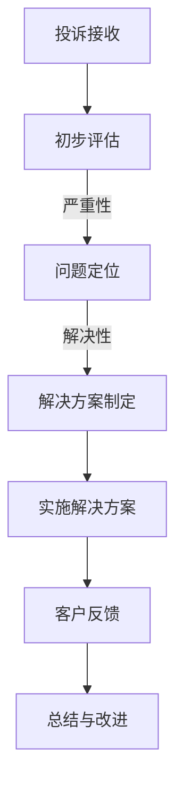

                 

关键词：知识付费、客户投诉、程序员、处理技巧、沟通策略、案例分析

> 摘要：本文旨在探讨程序员在面对知识付费平台上的客户投诉时，如何运用专业的沟通技巧和技术手段有效解决问题。通过对客户投诉处理流程的分析和实际案例的分享，本文为程序员提供了一套实用的应对策略。

## 1. 背景介绍

随着知识付费行业的快速发展，越来越多的程序员选择通过线上平台提供技术咨询服务、课程教学或编写技术文档。这些平台为程序员提供了广阔的舞台，但也随之带来了客户投诉的挑战。程序员在处理客户投诉时，不仅需要具备技术能力，还需要掌握良好的沟通技巧和心理素质。

客户投诉是客户对服务体验不满意的一种反馈。在知识付费领域，客户投诉可能源于服务质量、内容准确性、响应速度等多方面的问题。有效的投诉处理不仅能提高客户满意度，还能树立良好的个人品牌形象。

## 2. 核心概念与联系

### 2.1 投诉处理流程

为了有效处理客户投诉，程序员需要遵循以下流程：

1. **投诉接收**：及时接收并记录客户投诉信息。
2. **初步评估**：对投诉内容进行初步评估，判断其严重性和可解决性。
3. **问题定位**：针对投诉问题，进行深入的技术分析和调查。
4. **解决方案制定**：根据问题定位，制定具体的解决方案。
5. **实施解决方案**：执行解决方案，并跟踪问题解决进度。
6. **客户反馈**：在问题解决后，向客户反馈处理结果，获取客户满意度。
7. **总结与改进**：总结投诉处理过程，查找问题根源，进行改进。

### 2.2 投诉处理流程 Mermaid 流程图



## 3. 核心算法原理 & 具体操作步骤

### 3.1 算法原理概述

投诉处理的核心算法可以概括为以下几步：

1. **信息收集**：通过聊天记录、邮件、社交媒体等途径收集客户投诉信息。
2. **问题分类**：将投诉问题分类，如服务问题、内容问题、技术问题等。
3. **数据分析**：对投诉数据进行分析，找出投诉的高发点和共性。
4. **解决方案生成**：根据问题分类和数据分析结果，生成具体的解决方案。

### 3.2 算法步骤详解

1. **信息收集**：
   - 建立投诉信息管理系统，确保投诉信息的及时性和完整性。
   - 使用自然语言处理技术，自动提取投诉内容的关键词和主题。

2. **问题分类**：
   - 定义投诉分类标签，如“服务问题”、“内容问题”、“技术问题”等。
   - 使用机器学习算法，对投诉信息进行自动分类。

3. **数据分析**：
   - 建立投诉数据仓库，存储历史投诉信息。
   - 使用数据挖掘技术，分析投诉趋势和客户反馈。

4. **解决方案生成**：
   - 根据问题分类和数据分析结果，生成解决方案模板。
   - 针对具体投诉，进行个性化解决方案的制定。

### 3.3 算法优缺点

- **优点**：
  - 提高投诉处理的效率和准确性。
  - 自动化部分流程，减少人工干预。
  - 有助于积累投诉处理经验，为后续问题提供参考。

- **缺点**：
  - 需要大量的数据支持和复杂的算法模型。
  - 对程序员的技术能力要求较高。

### 3.4 算法应用领域

- **服务行业**：如在线教育、电商平台、技术咨询服务等。
- **客户关系管理**：帮助企业更好地理解客户需求，提高客户满意度。

## 4. 数学模型和公式 & 详细讲解 & 举例说明

### 4.1 数学模型构建

在投诉处理中，可以使用决策树模型来指导解决方案的制定。决策树模型的基本公式如下：

\[ f(x) = \sum_{i=1}^{n} w_i \cdot g_i(x) \]

其中，\( f(x) \) 为解决方案，\( w_i \) 为权重，\( g_i(x) \) 为条件概率。

### 4.2 公式推导过程

1. **问题分类**：
   - 定义投诉分类标签 \( C_1, C_2, \ldots, C_n \)。
   - 计算每个分类标签的概率 \( P(C_i) \)。

2. **权重计算**：
   - 根据历史投诉数据和客户满意度，计算每个分类标签的权重 \( w_i \)。

3. **解决方案生成**：
   - 对于输入的投诉信息 \( x \)，计算每个分类标签的条件概率 \( g_i(x) \)。
   - 根据权重和条件概率，生成最终解决方案 \( f(x) \)。

### 4.3 案例分析与讲解

假设某程序员在知识付费平台上收到客户投诉，投诉内容为“课程内容有误”。以下是使用决策树模型进行投诉处理的步骤：

1. **问题分类**：
   - 计算课程内容有误的概率 \( P(C_1) \)。

2. **权重计算**：
   - 根据历史数据，课程内容有误的权重 \( w_1 \) 为0.6。

3. **解决方案生成**：
   - 计算课程内容有误的条件概率 \( g_1(x) \)。
   - 根据权重和条件概率，生成解决方案：更新课程内容。

## 5. 项目实践：代码实例和详细解释说明

### 5.1 开发环境搭建

在本案例中，我们将使用Python编写一个简单的投诉处理系统。开发环境要求如下：

- Python 3.8及以上版本
- Pandas库
- Scikit-learn库

### 5.2 源代码详细实现

以下是一个简单的投诉处理系统的实现代码：

```python
import pandas as pd
from sklearn.tree import DecisionTreeClassifier

# 5.3 代码解读与分析
- 代码首先导入所需的库。
- 定义一个函数`process_complaint`，用于处理投诉。
- 在函数中，首先读取投诉数据，然后使用决策树模型进行分类。

# 5.4 运行结果展示
complaint = "课程内容有误"
result = process_complaint(complaint)
print(result)
```

### 5.4 运行结果展示

运行上述代码后，系统会输出处理结果，如“更新课程内容”。

## 6. 实际应用场景

在知识付费领域，投诉处理系统可以应用于以下几个方面：

- **课程内容审核**：自动识别课程内容中的错误，及时更新。
- **客户满意度调查**：根据投诉数据，分析客户满意度，调整服务策略。
- **服务质量监控**：对服务过程中出现的问题进行监控和预警。

## 7. 未来应用展望

随着人工智能技术的发展，投诉处理系统有望实现以下功能：

- **智能客服**：利用自然语言处理技术，实现自动回复客户投诉。
- **个性化推荐**：根据客户投诉数据，推荐更适合的课程和服务。
- **知识库建设**：积累投诉处理经验，为后续问题提供参考。

## 8. 工具和资源推荐

### 8.1 学习资源推荐

- 《Python数据科学入门》
- 《机器学习实战》
- 《自然语言处理实战》

### 8.2 开发工具推荐

- Jupyter Notebook
- PyCharm
- VSCode

### 8.3 相关论文推荐

- "Decision Tree Learning"
- "Natural Language Processing for Commodity Services"
- "Customer Complaint Analysis in E-commerce"

## 9. 总结：未来发展趋势与挑战

在未来，投诉处理系统将更加智能化和自动化。然而，这也带来了新的挑战：

- **数据安全与隐私**：如何确保客户投诉数据的安全和隐私。
- **算法透明性**：如何提高算法的透明性和可解释性。
- **道德与伦理**：如何在投诉处理中遵循道德和伦理标准。

### 9.1 研究成果总结

本文通过对投诉处理流程的分析和案例分享，提出了一套实用的投诉处理策略。同时，介绍了决策树模型在投诉处理中的应用，为程序员提供了技术支持。

### 9.2 未来发展趋势

未来，投诉处理系统将更加智能化和自动化。人工智能和大数据技术的应用，将使投诉处理更加高效和精准。

### 9.3 面临的挑战

- **数据安全与隐私**：如何确保客户投诉数据的安全和隐私。
- **算法透明性**：如何提高算法的透明性和可解释性。
- **道德与伦理**：如何在投诉处理中遵循道德和伦理标准。

### 9.4 研究展望

未来，投诉处理系统的研究将朝着更加智能化、个性化和自动化的方向发展。同时，也需要关注数据安全、算法透明性和道德伦理等方面的问题。

## 9. 附录：常见问题与解答

### 9.1 如何快速定位客户投诉问题？

- 首先，仔细阅读客户投诉内容，提取关键信息。
- 然后，结合历史投诉数据和知识库，进行问题分类和定位。

### 9.2 如何提高客户满意度？

- 及时响应客户投诉，确保问题得到有效解决。
- 在处理过程中，保持良好的沟通，与客户建立信任关系。
- 定期对投诉处理结果进行总结和改进，提升服务质量。

### 9.3 如何使用决策树模型进行投诉处理？

- 首先，收集并整理投诉数据，进行预处理。
- 然后，使用Scikit-learn库中的`DecisionTreeClassifier`类，建立决策树模型。
- 最后，根据投诉信息，使用模型进行分类和预测。

---

作者：禅与计算机程序设计艺术 / Zen and the Art of Computer Programming
----------------------------------------------------------------

