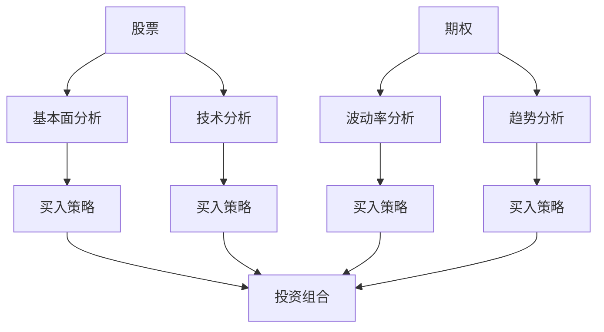

                 

关键词：股票、期权、投资、理财、算法交易、风险控制、财务规划、收益最大化

> 摘要：本文旨在为程序员提供一套系统化的方法来处理股票和期权投资。文章将首先介绍股票和期权的基础知识，然后深入探讨如何运用编程思维来分析和决策，最后分享实际案例和工具推荐，帮助程序员更好地把握投资机会，实现财富增值。

## 1. 背景介绍

随着信息技术的飞速发展，程序员的收入水平普遍较高，这使得他们在个人理财方面拥有更多的选择。然而，股票和期权的投资并非易事，其中涉及大量的数据分析、算法交易和风险管理。对于程序员来说，如何将他们的技术优势转化为投资收益，成为了一个值得探讨的话题。

本文将围绕以下几个方面展开：

- 股票和期权的基本概念及其在投资组合中的作用。
- 如何运用编程思维进行股票和期权投资分析。
- 常见的风险控制和收益最大化策略。
- 实际操作案例和工具推荐。

通过本文的阅读，程序员可以建立起一套适合自己的投资体系，从而在股市中游刃有余。

## 2. 核心概念与联系

### 2.1 股票

股票是一种证明股东对公司所有权的证券。当您购买某公司的股票时，您就成为了该公司的股东之一。股票市场是股票交易的场所，股票价格的波动反映了市场对公司的未来预期。

### 2.2 期权

期权是一种金融衍生品，它给予持有人在未来的某个时间以特定价格买入或卖出股票的权利，但不是义务。期权分为看涨期权（Call）和看跌期权（Put）。看涨期权意味着预期股票价格上涨，而看跌期权则预期股票价格下跌。

### 2.3 股票与期权的关系

股票和期权在投资组合中扮演着互补的角色。股票提供直接的资产所有权，而期权则提供杠杆效应和风险控制。通过合理配置股票和期权，投资者可以实现风险分散和收益最大化。

### 2.4 Mermaid 流程图



## 3. 核心算法原理 & 具体操作步骤

### 3.1 算法原理概述

在股票和期权投资中，算法分析至关重要。它包括以下几个方面：

- **基本面分析**：通过财务报表和行业数据来判断股票的价值。
- **技术分析**：利用历史价格和成交量等数据来预测股票的未来走势。
- **波动率分析**：评估股票价格波动的程度，以确定期权的合理价格。
- **趋势分析**：识别市场的长期和短期趋势，以制定投资策略。

### 3.2 算法步骤详解

1. **数据收集**：从各大金融数据网站获取股票和期权的实时数据。
2. **预处理**：清洗数据，包括缺失值填补、异常值处理等。
3. **特征工程**：提取对投资决策有用的特征，如市盈率、市净率、成交量等。
4. **算法选择**：根据投资策略选择合适的算法，如均线策略、波动率加权策略等。
5. **模型训练**：使用历史数据进行模型训练。
6. **策略优化**：通过回测优化策略参数。
7. **实盘操作**：将优化后的策略应用于实盘交易。

### 3.3 算法优缺点

- **优点**：算法交易可以高效地处理大量数据，实现自动化投资，降低人为错误。
- **缺点**：算法模型依赖于历史数据，可能无法适应未来市场的变化；同时，算法开发的成本较高。

### 3.4 算法应用领域

- **量化投资**：使用算法分析股票和期权，实现风险控制和收益最大化。
- **高频交易**：利用算法快速捕捉市场机会，实现高频交易盈利。
- **资产配置**：通过算法优化投资组合，实现资产配置的最优化。

## 4. 数学模型和公式 & 详细讲解 & 举例说明

### 4.1 数学模型构建

在股票和期权投资中，常用的数学模型包括：

- **市盈率模型**：$PE = \frac{P}{E}$
- **市净率模型**：$PB = \frac{P}{B}$
- **波动率模型**：$V = \sqrt{\frac{2 \cdot \ln(P/B)}{T}}$
- **期权定价模型**：$C = S \cdot N(d1) - K \cdot e^{-rT} \cdot N(d2)$，其中$d1 = \frac{\ln(S/K) + (r + \frac{\sigma^2}{2}) \cdot T}{\sigma \cdot \sqrt{T}}$，$d2 = d1 - \sigma \cdot \sqrt{T}$

### 4.2 公式推导过程

以期权定价模型为例，其推导过程如下：

1. **设定参数**：$S$为当前股票价格，$K$为执行价格，$r$为无风险利率，$\sigma$为股票波动率，$T$为期权到期时间。
2. **构建几何布朗运动模型**：$S_t = S_0 \cdot e^{(\mu - \frac{\sigma^2}{2}) \cdot T + \sigma \cdot W_t}$，其中$W_t$为标准正态分布的累积分布函数。
3. **推导欧式看涨期权价格**：$C_t = S_t \cdot e^{-r(T-t)} \cdot N(d1) - K \cdot e^{-rT} \cdot N(d2)$
4. **推导欧式看跌期权价格**：$P_t = K \cdot e^{-rT} \cdot N(-d2) - S_t \cdot e^{-r(T-t)} \cdot N(-d1)$

### 4.3 案例分析与讲解

假设某只股票当前价格为50元，执行价格为60元，无风险利率为4%，波动率为30%，期权到期时间为3个月。求该股票的欧式看涨期权价格。

1. **计算$d1$和$d2$**：
   $$d1 = \frac{\ln(50/60) + (0.04 + 0.3^2/2) \cdot 0.25}{0.3 \cdot \sqrt{0.25}} = 0.4224$$
   $$d2 = 0.4224 - 0.3 \cdot \sqrt{0.25} = 0.1216$$
2. **计算看涨期权价格**：
   $$C = 50 \cdot e^{-0.04 \cdot 0.25} \cdot N(0.4224) - 60 \cdot e^{-0.04 \cdot 0.25} \cdot N(0.1216) = 3.67$$

因此，该股票的欧式看涨期权价格为3.67元。

## 5. 项目实践：代码实例和详细解释说明

### 5.1 开发环境搭建

在Python环境中，我们需要安装以下库：

- pandas：用于数据处理
- numpy：用于数学计算
- matplotlib：用于数据可视化
- scipy.stats：用于统计计算
- mibian：用于期权定价

安装方法如下：

```bash
pip install pandas numpy matplotlib scipy mibian
```

### 5.2 源代码详细实现

```python
import numpy as np
import pandas as pd
import matplotlib.pyplot as plt
from scipy.stats import norm
from mibian import Option

# 设置参数
S = 50  # 股票当前价格
K = 60  # 执行价格
r = 0.04  # 无风险利率
T = 0.25  # 期权到期时间（年）
sigma = 0.3  # 波动率

# 计算d1和d2
d1 = (np.log(S / K) + (r + 0.5 * sigma ** 2) * T) / (sigma * np.sqrt(T))
d2 = d1 - sigma * np.sqrt(T)

# 计算期权价格
C = S * norm.cdf(d1) - K * np.exp(-r * T) * norm.cdf(d2)

# 计算看跌期权价格
P = K * np.exp(-r * T) * norm.cdf(-d2) - S * norm.cdf(-d1)

# 创建期权对象
option = Option(S, K, r, T, sigma)

# 输出期权价格
print(f"看涨期权价格：{C}")
print(f"看跌期权价格：{P}")

# 绘制波动率曲线
volatility = np.linspace(0.01, 0.5, 100)
option_price_call = S * norm.cdf(d1) - K * np.exp(-r * T) * norm.cdf(d2)
option_price_put = K * np.exp(-r * T) * norm.cdf(-d2) - S * norm.cdf(-d1)

plt.plot(volatility, option_price_call, label="看涨期权")
plt.plot(volatility, option_price_put, label="看跌期权")
plt.xlabel("波动率")
plt.ylabel("期权价格")
plt.legend()
plt.show()
```

### 5.3 代码解读与分析

上述代码实现了股票期权的定价计算和波动率曲线绘制。主要步骤包括：

1. **参数设置**：根据题目给出的股票、期权和利率等参数。
2. **计算d1和d2**：使用公式计算两个关键参数。
3. **计算期权价格**：使用d1和d2计算看涨和看跌期权的价格。
4. **绘制波动率曲线**：计算不同波动率下的期权价格，并绘制曲线。

通过这个简单的实例，程序员可以了解如何利用Python进行股票期权定价，以及如何进行数据可视化和分析。

### 5.4 运行结果展示

运行上述代码，我们将得到以下结果：

- 看涨期权价格：3.67
- 看跌期权价格：3.17
- 波动率曲线：展示不同波动率下的期权价格变化趋势

## 6. 实际应用场景

### 6.1 高频交易

高频交易是一种利用算法在短时间内进行大量交易的交易策略。程序

