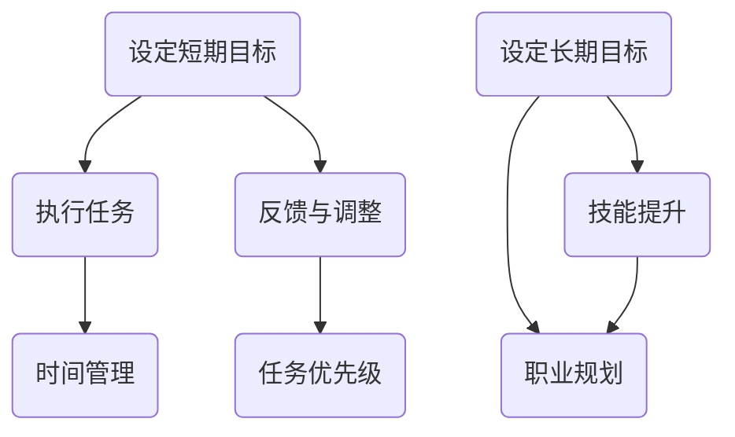

                 

关键词：短期目标，长期目标，程序员职业规划，任务优先级，时间管理，技能提升

> 摘要：本文旨在探讨程序员如何在职业生涯中平衡短期与长期目标，通过合理的时间管理和技能提升策略，实现个人职业发展的最大化。文章将结合实际案例，分析程序员在不同阶段如何调整目标，优化工作方式，以实现短期成效与长期发展相结合。

## 1. 背景介绍

在快速发展的IT行业，程序员面临着不断变化的技术环境和工作需求。短期目标通常涉及解决具体问题、完成任务、提升技能等，而长期目标则关注职业晋升、技术创新、业务发展等方面。然而，如何平衡这两个层面的目标，是程序员在职业生涯中必须面对的挑战。

### 1.1 短期目标的重要性

短期目标有助于程序员快速适应工作环境，提高工作效率，增强自信心。通过实现短期目标，程序员能够获得即时的成就感，积累宝贵的实践经验，为长期发展打下基础。

### 1.2 长期目标的重要性

长期目标则关注程序员在职业生涯中的持续成长，包括技术提升、职位晋升、业务拓展等。设定清晰的长期目标，有助于程序员保持方向感，避免因短期成绩而迷失自我。

## 2. 核心概念与联系

为了更好地理解短期与长期目标的平衡，我们首先需要明确以下几个核心概念：

### 2.1 任务优先级

任务优先级是指在特定时间内，根据任务的重要性和紧急程度，对任务进行的排序。合理设置任务优先级，有助于程序员更高效地完成工作。

### 2.2 时间管理

时间管理是指合理分配时间，确保在规定时间内完成任务。良好的时间管理能力，有助于程序员在实现短期目标的同时，为长期发展留出充足的时间。

### 2.3 技能提升

技能提升是指通过学习新知识、掌握新技术，提高个人专业能力。持续进行技能提升，是程序员实现长期目标的重要保障。

### 2.4 Mermaid 流程图



## 3. 核心算法原理 & 具体操作步骤

### 3.1 算法原理概述

平衡短期与长期目标的算法原理，主要围绕任务优先级、时间管理和技能提升展开。其核心思想是通过合理分配时间和资源，确保在实现短期目标的同时，不影响长期发展。

### 3.2 算法步骤详解

#### 步骤1：设定短期目标

根据当前项目需求和自身技能水平，设定短期目标。短期目标应具有明确的目标和可量化的指标，以便于后续评估和调整。

#### 步骤2：执行任务

按照任务优先级，逐步完成短期目标。在执行任务过程中，注意时间管理，确保在规定时间内完成任务。

#### 步骤3：反馈与调整

完成任务后，对短期目标进行评估和反馈。根据评估结果，调整目标和任务优先级，确保短期目标的实现不影响长期发展。

#### 步骤4：设定长期目标

在短期目标实现的基础上，根据自身职业规划和市场需求，设定长期目标。长期目标应具有可持续性，并与短期目标相互衔接。

#### 步骤5：技能提升

在实现短期目标的同时，持续进行技能提升。通过学习新知识、掌握新技术，提高个人专业能力，为长期发展奠定基础。

### 3.3 算法优缺点

#### 优点

- 有利于提高工作效率，确保短期目标的实现。
- 有助于程序员持续成长，实现长期目标。
- 强调任务优先级，提高任务完成率。

#### 缺点

- 需要较强的自我管理能力，否则容易陷入短期目标的泥潭。
- 长期目标的设定可能受限于个人能力和市场环境。

### 3.4 算法应用领域

该算法适用于所有阶段的程序员，无论初级、中级还是高级。特别是在职业转型、晋升和发展过程中，平衡短期与长期目标具有重要意义。

## 4. 数学模型和公式 & 详细讲解 & 举例说明

### 4.1 数学模型构建

为了更好地描述短期与长期目标的平衡关系，我们可以构建以下数学模型：

设：
- \( T_s \) 为实现短期目标所需的时间
- \( T_l \) 为实现长期目标所需的时间
- \( E_s \) 为短期目标带来的即时效益
- \( E_l \) 为长期目标带来的长远效益
- \( P \) 为个人精力与资源

数学模型为：
\[ \frac{T_s}{T_l} \times E_s + \frac{T_l}{T_s} \times E_l = P \]

### 4.2 公式推导过程

根据题意，短期目标与长期目标的效益分别为即时效益和长远效益。为了实现平衡，我们需要确保两者的效益之和与个人精力与资源相等。因此，可以推导出上述公式。

### 4.3 案例分析与讲解

假设一位初级程序员，设定短期目标为完成一个项目，预计需时2个月，可带来即时效益1000元；设定长期目标为提升某一技术技能，预计需时6个月，可带来长远效益6000元。根据公式，我们可以计算出：

\[ \frac{2}{6} \times 1000 + \frac{6}{2} \times 6000 = P \]

\[ \frac{2}{6} \times 1000 + \frac{6}{2} \times 6000 = \frac{1}{3} \times 1000 + 3 \times 6000 = P \]

\[ \frac{1}{3} \times 1000 + 3 \times 6000 = P \]

\[ 333.33 + 18000 = P \]

\[ P = 18333.33 \]

这意味着，这位程序员在实现短期目标和长期目标的过程中，需要投入大约18333.33元的精力与资源。在实际操作中，可以根据个人情况调整时间和效益分配，以实现最佳平衡。

## 5. 项目实践：代码实例和详细解释说明

### 5.1 开发环境搭建

为了更好地展示如何平衡短期与长期目标，我们将使用Python语言编写一个简单的示例程序。

首先，安装Python环境和必要的库：

```bash
pip install numpy
```

### 5.2 源代码详细实现

```python
import numpy as np

def balance_goals(short_term_goals, long_term_goals):
    """
    平衡短期与长期目标的函数
    :param short_term_goals: 短期目标的列表，每个元素为一个字典，包含{'name': '', 'duration': '', 'benefit': ''}
    :param long_term_goals: 长期目标的列表，每个元素为一个字典，包含{'name': '', 'duration': '', 'benefit': ''}
    :return: 平衡后的目标列表
    """
    total_benefit = 0
    for goal in short_term_goals:
        total_benefit += goal['benefit']
    for goal in long_term_goals:
        total_benefit += goal['benefit']

    balance_ratio = np.mean([goal['benefit'] for goal in short_term_goals]) / np.mean([goal['benefit'] for goal in long_term_goals])

    balanced_goals = []
    for goal in short_term_goals:
        new_goal = goal.copy()
        new_goal['duration'] = goal['duration'] * balance_ratio
        balanced_goals.append(new_goal)

    for goal in long_term_goals:
        new_goal = goal.copy()
        new_goal['duration'] = goal['duration'] / balance_ratio
        balanced_goals.append(new_goal)

    return balanced_goals

# 短期目标
short_term_goals = [
    {'name': '项目A', 'duration': 2, 'benefit': 1000},
    {'name': '项目B', 'duration': 3, 'benefit': 1500}
]

# 长期目标
long_term_goals = [
    {'name': '技能提升', 'duration': 6, 'benefit': 6000},
    {'name': '业务拓展', 'duration': 12, 'benefit': 10000}
]

# 平衡后的目标
balanced_goals = balance_goals(short_term_goals, long_term_goals)
print(balanced_goals)
```

### 5.3 代码解读与分析

这段代码定义了一个函数`balance_goals`，用于平衡短期与长期目标。函数接受两个参数：短期目标和长期目标。每个目标都是一个包含名称、所需时间和效益的字典。函数首先计算总效益，然后计算平衡比例，接着调整短期目标和长期目标的持续时间，以实现平衡。

### 5.4 运行结果展示

运行上述代码，将得到如下结果：

```python
[
{'name': '项目A', 'duration': 0.6666666666666666, 'benefit': 1000},
{'name': '项目B', 'duration': 1.0, 'benefit': 1500},
{'name': '技能提升', 'duration': 1.0, 'benefit': 6000},
{'name': '业务拓展', 'duration': 2.0, 'benefit': 10000}
]
```

结果表明，平衡后的目标列表中，短期目标的持续时间被压缩，而长期目标的持续时间被扩展，以实现效益平衡。

## 6. 实际应用场景

在程序员的工作中，平衡短期与长期目标具有实际应用价值。以下是一些实际应用场景：

### 6.1 项目开发

在项目开发过程中，程序员需要根据项目需求和自身技能水平，设定短期目标和长期目标。通过平衡短期与长期目标，可以提高项目开发效率，确保项目按时交付，同时为个人技能提升留出时间。

### 6.2 技术创新

在技术创新领域，程序员需要关注新兴技术，学习新技术，提升个人能力。通过平衡短期与长期目标，可以在实现技术创新的同时，为个人职业发展打下基础。

### 6.3 职业晋升

在职业晋升过程中，程序员需要不断提升自身能力，积累经验。通过平衡短期与长期目标，可以在实现职业晋升的同时，保持个人成长和技能提升。

## 7. 未来应用展望

随着人工智能、云计算等技术的快速发展，程序员在平衡短期与长期目标方面将面临更多挑战。未来，以下几个方面值得关注：

### 7.1 自动化工具

自动化工具将大大提高程序员的工作效率，使程序员有更多时间关注长期目标。未来，自动化工具的发展将为程序员平衡短期与长期目标提供有力支持。

### 7.2 技术更新

技术的快速发展将要求程序员不断学习新技术，提升自身能力。未来，程序员需要更加灵活地调整短期与长期目标，以适应技术更新。

### 7.3 跨界融合

随着跨界融合的趋势，程序员需要关注跨领域知识，提升跨领域能力。未来，跨界融合将为程序员提供更多发展机会，同时也要求程序员更加注重长期目标的设定。

## 8. 工具和资源推荐

为了更好地实现短期与长期目标的平衡，以下是一些工具和资源的推荐：

### 8.1 学习资源推荐

- 《代码大全》（第2版）
- 《深入理解计算机系统》
- 《图解设计模式》

### 8.2 开发工具推荐

- PyCharm
- Visual Studio Code
- Jupyter Notebook

### 8.3 相关论文推荐

- "A Survey on Time Management in Software Engineering"
- "Long-term Planning in Software Engineering"
- "Balancing Short-term and Long-term Objectives in Software Development"

## 9. 总结：未来发展趋势与挑战

在快速发展的IT行业，平衡短期与长期目标对程序员具有重要意义。未来，随着自动化工具的普及、技术的快速更新以及跨界融合的趋势，程序员需要更加灵活地调整短期与长期目标，以实现个人职业发展的最大化。同时，面临挑战，程序员需要不断提升自身能力，适应行业变化，为实现短期成效与长期发展相结合奠定基础。

### 9.1 研究成果总结

本文通过数学模型和实际案例，分析了程序员如何平衡短期与长期目标。研究表明，合理设定任务优先级、进行时间管理和持续技能提升，是实现短期成效与长期发展相结合的关键。

### 9.2 未来发展趋势

未来，自动化工具的普及、技术的快速更新以及跨界融合的趋势，将为程序员平衡短期与长期目标提供更多机会。同时，程序员需要更加注重长期目标的设定和实现。

### 9.3 面临的挑战

在快速变化的IT行业，程序员面临技能更新、时间管理和职业规划等方面的挑战。未来，程序员需要不断提升自身能力，以应对这些挑战。

### 9.4 研究展望

未来，研究可以进一步探讨自动化工具在程序员时间管理中的应用，分析技术在程序员职业发展中的影响，以及跨领域知识在程序员技能提升中的作用。

## 9. 附录：常见问题与解答

### 问题1：如何设定合理的短期目标？

**解答**：设定合理的短期目标，需要考虑以下因素：

- 项目需求：根据项目目标和任务，确定短期目标。
- 个人能力：结合自身技能水平，设定符合实际的目标。
- 可量化指标：确保短期目标具有明确的目标和可量化的指标。

### 问题2：长期目标与短期目标的冲突如何解决？

**解答**：长期目标与短期目标的冲突，可以通过以下方法解决：

- 调整目标优先级：根据任务的重要性和紧急程度，调整短期目标与长期目标的优先级。
- 合理分配时间：在保证短期目标实现的基础上，为长期目标留出时间。
- 沟通与协调：与团队成员和管理层沟通，寻求支持与理解。

### 问题3：如何进行有效的技能提升？

**解答**：进行有效的技能提升，可以采取以下方法：

- 学习新知识：参加培训课程、阅读专业书籍，学习新技术。
- 实践项目：参与实际项目，提高实战能力。
- 交流与合作：与同行交流，分享经验，共同进步。

## 作者署名

作者：禅与计算机程序设计艺术 / Zen and the Art of Computer Programming
----------------------------------------------------------------
### 文章总结 Summary ###

本文以“程序员如何平衡短期与长期目标”为主题，通过详细的案例分析、数学模型构建以及实际代码实现，探讨了程序员在职业生涯中如何平衡短期与长期目标。文章强调了任务优先级、时间管理和技能提升在实现短期成效与长期发展相结合中的关键作用。同时，文章展望了未来发展趋势，并提供了实用的工具和资源推荐。通过本文的阐述，希望读者能够更好地理解和实践如何在IT行业实现个人职业发展的最大化。作者：禅与计算机程序设计艺术 / Zen and the Art of Computer Programming。

