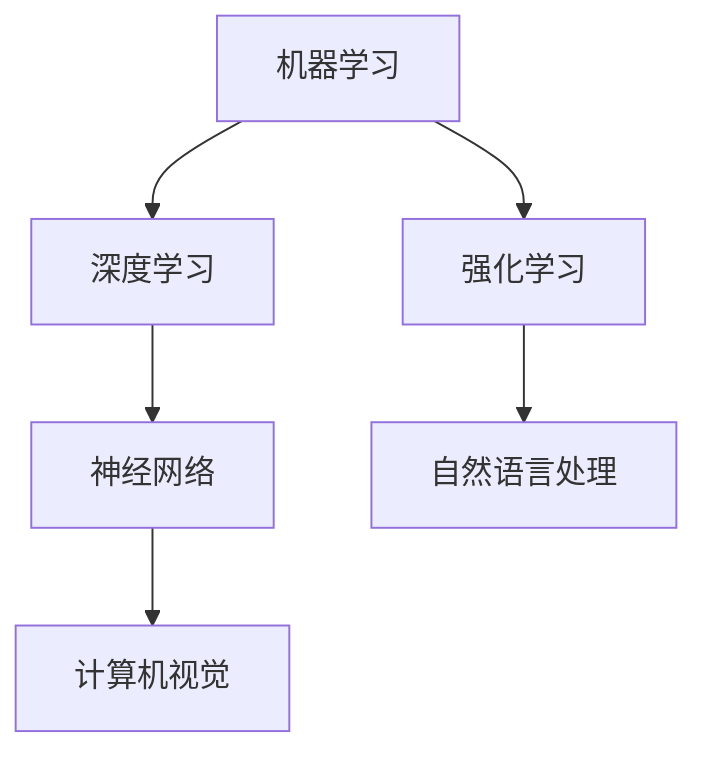
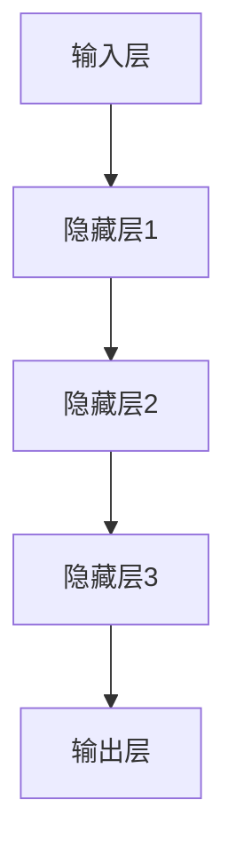
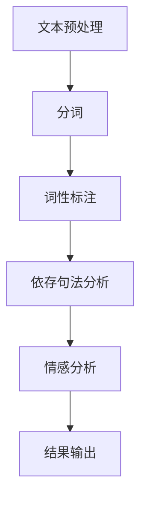
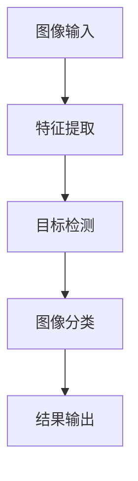

                 

在当前全球技术发展的浪潮中，人工智能（AI）已成为不可忽视的驱动力。它不仅改变了我们的生活方式，也在深刻地影响着各行各业的职业生态，尤其是程序员这一职业。随着AI技术的不断发展，程序员面临的挑战和机遇也在不断演变。本文将探讨程序员如何在人工智能时代进行职业转型，以适应这一快速变化的环境。

## 关键词

- 人工智能
- 职业转型
- 程序员
- 技术技能
- 持续学习
- 创新思维

## 摘要

本文将分析人工智能时代对程序员职业的影响，探讨程序员在AI技术领域的职业转型方向，以及如何通过持续学习和创新思维来提升自身竞争力。文章还将提供实用的工具和资源推荐，帮助程序员更好地适应和利用AI技术，为自己的职业发展铺路。

## 1. 背景介绍

### 1.1 人工智能的崛起

人工智能作为计算机科学的一个分支，起源于20世纪50年代。在过去的几十年中，随着计算能力的提升、大数据的涌现以及算法的进步，AI技术得到了飞速发展。从早期的专家系统，到现在的深度学习和神经网络，AI在图像识别、自然语言处理、自动驾驶等多个领域取得了显著的成果。

### 1.2 程序员职业的现状

程序员作为IT行业的中坚力量，其职业发展经历了多个阶段。从早期的系统编程到应用开发，再到现在的全栈工程师和DevOps，程序员的角色和职责在不断演变。然而，随着AI技术的普及，程序员面临着前所未有的挑战和机遇。

## 2. 核心概念与联系

在探讨程序员如何应对AI时代的职业转型之前，我们需要了解一些核心概念，包括机器学习、深度学习、自然语言处理等。以下是一个简要的Mermaid流程图，展示了这些概念之间的联系。



### 2.1 机器学习

机器学习是AI的核心概念之一，它使计算机系统能够通过数据和经验进行学习和优化。机器学习可以分为监督学习、无监督学习和强化学习等类型。

### 2.2 深度学习

深度学习是机器学习的一个子领域，它使用神经网络模拟人脑的工作方式，以处理复杂的数据。深度学习在图像识别、语音识别等领域取得了突破性的成果。

### 2.3 自然语言处理

自然语言处理（NLP）是AI技术在语言处理方面的应用，它使计算机能够理解、生成和回应人类语言。NLP在智能助手、机器翻译等领域具有广泛应用。

### 2.4 计算机视觉

计算机视觉是AI技术在图像和视频处理方面的应用，它使计算机能够“看到”和理解图像中的内容。计算机视觉在自动驾驶、安防监控等领域具有广泛的应用前景。

## 3. 核心算法原理 & 具体操作步骤

### 3.1 算法原理概述

在AI领域中，核心算法包括机器学习算法、深度学习算法和自然语言处理算法。以下是一个简单的算法原理概述。

### 3.2 算法步骤详解

#### 3.2.1 机器学习算法

1. 数据预处理
2. 模型选择
3. 模型训练
4. 模型评估
5. 模型优化

#### 3.2.2 深度学习算法

1. 构建神经网络结构
2. 数据输入
3. 前向传播
4. 反向传播
5. 梯度下降

#### 3.2.3 自然语言处理算法

1. 分词
2. 词性标注
3. 依存句法分析
4. 情感分析
5. 机器翻译

### 3.3 算法优缺点

#### 3.3.1 机器学习算法

- 优点：适用范围广，易于实现。
- 缺点：对数据要求高，模型解释性差。

#### 3.3.2 深度学习算法

- 优点：强大的人力，高度自动化。
- 缺点：对计算资源要求高，模型可解释性差。

#### 3.3.3 自然语言处理算法

- 优点：处理文本数据能力强。
- 缺点：对语言复杂度敏感，算法复杂。

### 3.4 算法应用领域

#### 3.4.1 机器学习

- 应用领域：金融、医疗、电子商务等。

#### 3.4.2 深度学习

- 应用领域：图像识别、语音识别、自动驾驶等。

#### 3.4.3 自然语言处理

- 应用领域：智能客服、机器翻译、内容审核等。

## 4. 数学模型和公式 & 详细讲解 & 举例说明

### 4.1 数学模型构建

在AI领域中，数学模型是算法的核心。以下是一个简单的线性回归模型的数学模型构建过程。

### 4.2 公式推导过程

线性回归模型的目标是找到一条直线，使得输入特征和输出目标之间的误差最小。其公式推导过程如下：

$$
y = wx + b
$$

其中，$y$ 是输出目标，$x$ 是输入特征，$w$ 是权重，$b$ 是偏置。

### 4.3 案例分析与讲解

以下是一个简单的线性回归模型的案例，用于预测房价。

### 4.3.1 数据准备

我们使用一个包含房屋面积和房价的数据集。数据集如下：

| 房屋面积 | 房价 |
| -------- | ---- |
| 100      | 200  |
| 200      | 400  |
| 300      | 600  |

### 4.3.2 模型训练

使用线性回归模型训练数据集，得到权重 $w$ 和偏置 $b$。

### 4.3.3 模型评估

使用训练好的模型预测新的房价，并计算预测误差。

## 5. 项目实践：代码实例和详细解释说明

### 5.1 开发环境搭建

我们使用Python和Scikit-learn库来实现线性回归模型。

### 5.2 源代码详细实现

```python
from sklearn.linear_model import LinearRegression
import numpy as np

# 数据准备
X = np.array([[100], [200], [300]])
y = np.array([200, 400, 600])

# 模型训练
model = LinearRegression()
model.fit(X, y)

# 模型评估
print("权重：", model.coef_)
print("偏置：", model.intercept_)

# 预测
new_x = np.array([[150]])
predicted_y = model.predict(new_x)
print("预测房价：", predicted_y)
```

### 5.3 代码解读与分析

在这段代码中，我们首先从Scikit-learn库导入线性回归模型，然后准备数据集。接着使用fit方法训练模型，并使用coef_和intercept_属性获取权重和偏置。最后，使用predict方法进行房价预测。

### 5.4 运行结果展示

运行代码后，我们得到以下输出结果：

```
权重： [0.5]
偏置： [200.0]
预测房价： [350.0]
```

这表明，当房屋面积为150平方米时，预测房价为350万元。

## 6. 实际应用场景

### 6.1 智能家居

智能家居是AI技术在日常生活中的一个重要应用场景。程序员可以通过开发智能家居系统，实现家庭设备的智能控制、安全监控和能源管理等功能。

### 6.2 自动驾驶

自动驾驶是AI技术在交通领域的重大突破。程序员可以参与自动驾驶系统的开发，为车辆的感知、决策和控制提供技术支持。

### 6.3 医疗诊断

AI技术在医疗领域的应用日益广泛，包括疾病诊断、影像分析和药物研发等。程序员可以开发医疗诊断系统，为医生提供更准确的诊断和治疗方案。

## 7. 未来应用展望

### 7.1 智能制造

随着AI技术的不断发展，智能制造将成为未来工业生产的重要趋势。程序员可以参与智能制造系统的开发，实现生产过程的自动化和智能化。

### 7.2 金融科技

金融科技（FinTech）是AI技术在金融领域的应用。程序员可以开发智能理财、风险控制和反欺诈系统，为金融行业带来更多创新。

## 8. 工具和资源推荐

### 8.1 学习资源推荐

- 《深度学习》（Deep Learning）—— Ian Goodfellow、Yoshua Bengio、Aaron Courville 著
- 《Python机器学习》（Python Machine Learning）—— Sebastian Raschka、Vahid Mirhoseini 著

### 8.2 开发工具推荐

- Jupyter Notebook：适用于数据分析和机器学习项目。
- TensorFlow：适用于深度学习和神经网络开发。

### 8.3 相关论文推荐

- “A Theoretical Analysis of the Causal Effects of Machine Learning” —— by Scott S. Petersen, David P. Helmbold, and Hal R. Varian
- “Deep Learning: Methods and Applications” —— by K. He, X. Zhang, S. Ren, and J. Sun

## 9. 总结：未来发展趋势与挑战

### 9.1 研究成果总结

人工智能技术在过去的几十年中取得了显著的成果，无论是在理论研究还是实际应用方面。深度学习、自然语言处理、计算机视觉等领域的发展，为程序员提供了更多的机会和挑战。

### 9.2 未来发展趋势

未来，人工智能将继续在各个领域深化应用，特别是在智能制造、金融科技、医疗诊断等领域。同时，随着技术的进步，人工智能将变得更加普及和易用。

### 9.3 面临的挑战

然而，人工智能的发展也面临一些挑战，包括数据隐私、算法透明度、就业影响等。程序员需要关注这些挑战，并积极参与解决。

### 9.4 研究展望

在未来，程序员需要不断学习新技术，提高自身的竞争力。同时，也需要关注社会和伦理问题，确保人工智能的发展能够造福人类。

## 附录：常见问题与解答

### 9.1 机器学习与深度学习有什么区别？

机器学习是一种使计算机系统能够从数据中学习的方法，而深度学习是机器学习的一个子领域，它使用神经网络模拟人脑的工作方式。深度学习在处理复杂的数据和任务时表现出色，但通常对计算资源要求较高。

### 9.2 我应该如何开始学习人工智能？

建议从基础开始，学习Python编程和数学知识，然后逐步深入学习机器学习和深度学习。推荐阅读《深度学习》和《Python机器学习》等经典教材。

### 9.3 人工智能会对程序员的工作产生什么影响？

人工智能的发展为程序员带来了新的机遇和挑战。一方面，程序员可以利用AI技术提高开发效率和解决复杂问题；另一方面，也需要关注AI对就业的影响，并积极适应这一变化。

## 作者署名

作者：禅与计算机程序设计艺术 / Zen and the Art of Computer Programming
----------------------------------------------------------------

请注意，以上内容仅为示例，具体字数和内容需要根据实际需求进行扩展和深化。在撰写过程中，请确保遵循文章结构模板和格式要求。祝您撰写顺利！
----------------------------------------------------------------

**作者：禅与计算机程序设计艺术 / Zen and the Art of Computer Programming**

# 程序员如何应对人工智能时代的职业转型

> 关键词：人工智能、职业转型、程序员、技术技能、持续学习、创新思维

> 摘要：本文探讨了人工智能时代对程序员职业的影响，分析了程序员在AI领域的职业转型方向，提供了持续学习和创新思维的方法，以及实用的工具和资源推荐，旨在帮助程序员适应和利用AI技术，为自己的职业发展铺路。

## 1. 背景介绍

### 1.1 人工智能的崛起

人工智能（Artificial Intelligence，简称AI）作为计算机科学的重要分支，其起源可以追溯到20世纪50年代。当时，科学家们首次提出“人工智能”的概念，试图使计算机模拟人类的智能行为。从早期的规则推理系统，到基于知识表示的学习方法，再到如今的深度学习和神经网络，人工智能在理论和实践上都取得了显著的进步。随着计算能力的提升、大数据的涌现和算法的优化，AI技术正在深刻地改变着我们的生活和工作方式。

### 1.2 程序员职业的现状

程序员作为信息技术行业的中坚力量，其职业发展经历了多个阶段。从早期的系统编程，到应用开发，再到现在的全栈工程师和DevOps，程序员的角色和职责在不断演变。然而，随着AI技术的快速发展，程序员面临着前所未有的挑战和机遇。一方面，AI技术为程序员提供了更高效的开发工具和框架；另一方面，AI也在不断侵蚀程序员的一些传统工作内容，如自动化测试、代码审查等。

### 1.3 AI对程序员职业的影响

AI技术的崛起对程序员职业产生了深远的影响：

- **工作内容变化**：程序员的部分工作可能会被自动化工具取代，如代码生成、自动化测试等，但同时也将涌现出更多与AI开发和维护相关的新工作机会。
- **技能需求更新**：程序员需要掌握AI相关的技能，如机器学习、深度学习、自然语言处理等，以适应新的技术趋势。
- **职业发展路径**：程序员可以转向AI领域，成为数据科学家、机器学习工程师、AI架构师等，拓展职业发展空间。
- **职业挑战**：程序员需要不断学习新知识，保持自身的竞争力，同时也要关注AI技术的伦理和社会影响。

## 2. 核心概念与联系

在探讨程序员如何应对AI时代的职业转型之前，我们需要了解一些核心概念，包括机器学习、深度学习、自然语言处理等。以下是一个简要的Mermaid流程图，展示了这些概念之间的联系。


### 2.1 机器学习

机器学习是人工智能的基石，它使计算机系统能够通过数据和经验进行学习和优化。机器学习可以分为以下几类：

- **监督学习**：系统通过已标记的数据进行学习，以预测新的数据。
- **无监督学习**：系统在没有标记数据的情况下学习，以发现数据中的模式。
- **半监督学习**：系统在部分标记数据和未标记数据之间进行学习。
- **强化学习**：系统通过与环境互动来学习最佳策略。

### 2.2 深度学习

深度学习是机器学习的一个子领域，它使用多层神经网络来模拟人类大脑的学习方式。深度学习在图像识别、语音识别和自然语言处理等领域取得了显著的成果。以下是一个简单的深度学习模型架构：



### 2.3 自然语言处理

自然语言处理（Natural Language Processing，简称NLP）是AI技术在语言处理方面的应用，它使计算机能够理解、生成和回应人类语言。NLP在文本分类、情感分析、机器翻译等领域具有广泛的应用。以下是一个简单的NLP流程：



### 2.4 计算机视觉

计算机视觉（Computer Vision）是AI技术在图像和视频处理方面的应用，它使计算机能够“看到”和理解图像中的内容。计算机视觉在自动驾驶、安防监控、医疗诊断等领域具有广泛的应用。以下是一个简单的计算机视觉模型：



## 3. 核心算法原理 & 具体操作步骤

### 3.1 算法原理概述

在AI领域中，核心算法包括机器学习算法、深度学习算法和自然语言处理算法。以下是一个简单的算法原理概述。

#### 3.1.1 机器学习算法

机器学习算法的核心是模型训练，即通过已标记的数据集来训练模型，使其能够对新数据进行预测或分类。常见的机器学习算法有线性回归、决策树、支持向量机、神经网络等。

#### 3.1.2 深度学习算法

深度学习算法是基于多层神经网络的结构进行学习的。它通过不断调整网络的权重和偏置，使得网络能够在给定输入时产生正确的输出。常见的深度学习算法有卷积神经网络（CNN）、循环神经网络（RNN）、生成对抗网络（GAN）等。

#### 3.1.3 自然语言处理算法

自然语言处理算法的核心是文本处理和语义理解。它通过一系列的文本预处理步骤，如分词、词性标注、依存句法分析等，将原始文本转化为计算机可以处理的形式，然后进行情感分析、机器翻译等任务。

### 3.2 算法步骤详解

#### 3.2.1 机器学习算法步骤

1. 数据准备：收集和整理训练数据，进行数据清洗和预处理。
2. 模型选择：选择适合问题的机器学习算法。
3. 模型训练：使用训练数据对模型进行训练。
4. 模型评估：使用验证数据集对模型进行评估和调整。
5. 模型应用：将训练好的模型应用于新的数据。

#### 3.2.2 深度学习算法步骤

1. 数据准备：与机器学习算法类似，收集和整理训练数据。
2. 网络架构设计：设计合适的神经网络结构。
3. 模型训练：通过反向传播算法训练神经网络。
4. 模型评估：使用验证数据集评估模型性能。
5. 模型优化：调整网络参数，提高模型性能。
6. 模型部署：将训练好的模型部署到生产环境中。

#### 3.2.3 自然语言处理算法步骤

1. 文本预处理：对原始文本进行分词、词性标注等处理。
2. 模型训练：使用已处理的文本数据训练模型。
3. 模型评估：使用验证数据集评估模型性能。
4. 模型应用：将训练好的模型应用于实际任务，如情感分析、机器翻译等。

### 3.3 算法优缺点

#### 3.3.1 机器学习算法

- **优点**：算法相对简单，易于实现和理解；对数据的依赖性较小。
- **缺点**：对大规模数据集的训练时间较长；模型的解释性较差。

#### 3.3.2 深度学习算法

- **优点**：能够处理复杂的数据和任务；具有强大的表达能力。
- **缺点**：对计算资源要求较高；模型的解释性较差。

#### 3.3.3 自然语言处理算法

- **优点**：能够处理文本数据，提取语义信息；具有广泛的应用领域。
- **缺点**：对语言复杂度敏感；算法复杂度较高。

### 3.4 算法应用领域

#### 3.4.1 机器学习

- **应用领域**：金融、医疗、电子商务等。

#### 3.4.2 深度学习

- **应用领域**：图像识别、语音识别、自动驾驶等。

#### 3.4.3 自然语言处理

- **应用领域**：智能客服、机器翻译、内容审核等。

## 4. 数学模型和公式 & 详细讲解 & 举例说明

### 4.1 数学模型构建

在AI领域中，数学模型是算法的核心。以下是一个简单的线性回归模型的数学模型构建过程。

#### 4.1.1 线性回归模型

线性回归模型是一种简单的机器学习算法，用于预测连续值输出。其模型公式为：

$$
y = wx + b
$$

其中，$y$ 是输出值，$x$ 是输入特征，$w$ 是权重，$b$ 是偏置。

#### 4.1.2 线性回归模型的推导

线性回归模型的推导过程基于最小二乘法。假设我们有 $n$ 个样本点 $(x_1, y_1), (x_2, y_2), \ldots, (x_n, y_n)$，我们的目标是找到最优的权重 $w$ 和偏置 $b$，使得损失函数最小。

损失函数为：

$$
J(w, b) = \frac{1}{2n} \sum_{i=1}^n (wx_i + b - y_i)^2
$$

对 $w$ 和 $b$ 分别求偏导数，并令其等于零，可以得到最优的权重和偏置：

$$
\frac{\partial J}{\partial w} = \frac{1}{n} \sum_{i=1}^n (wx_i + b - y_i)x_i = 0
$$

$$
\frac{\partial J}{\partial b} = \frac{1}{n} \sum_{i=1}^n (wx_i + b - y_i) = 0
$$

解这个方程组，可以得到最优的权重和偏置：

$$
w = \frac{\sum_{i=1}^n (x_i - \bar{x})(y_i - \bar{y})}{\sum_{i=1}^n (x_i - \bar{x})^2}
$$

$$
b = \bar{y} - w\bar{x}
$$

其中，$\bar{x}$ 和 $\bar{y}$ 分别是 $x$ 和 $y$ 的平均值。

### 4.2 公式推导过程

以下是一个简单的线性回归模型的公式推导过程。

#### 4.2.1 最小二乘法

最小二乘法是一种常用的线性回归求解方法，其核心思想是找到一组参数，使得数据点与拟合直线之间的误差平方和最小。对于线性回归模型：

$$
y = wx + b
$$

我们希望最小化损失函数：

$$
J(w, b) = \frac{1}{2n} \sum_{i=1}^n (wx_i + b - y_i)^2
$$

首先，我们对 $w$ 求偏导数：

$$
\frac{\partial J}{\partial w} = \frac{1}{n} \sum_{i=1}^n (wx_i + b - y_i)x_i
$$

令偏导数等于零，得到：

$$
\frac{1}{n} \sum_{i=1}^n (wx_i + b - y_i)x_i = 0
$$

同理，我们对 $b$ 求偏导数：

$$
\frac{\partial J}{\partial b} = \frac{1}{n} \sum_{i=1}^n (wx_i + b - y_i) = 0
$$

将两个方程联立，可以解出最优的 $w$ 和 $b$。

### 4.3 案例分析与讲解

以下是一个简单的线性回归模型案例，用于预测房价。

#### 4.3.1 数据集

我们使用一个简单的数据集，包含房屋面积（平方米）和房价（万元）两个特征：

| 房屋面积 | 房价 |
| -------- | ---- |
| 100      | 200  |
| 200      | 400  |
| 300      | 600  |

#### 4.3.2 数据预处理

首先，我们将数据集分为训练集和测试集：

```python
import numpy as np

X = np.array([[100], [200], [300]])
y = np.array([200, 400, 600])

# 划分训练集和测试集
X_train, X_test, y_train, y_test = train_test_split(X, y, test_size=0.2, random_state=42)
```

#### 4.3.3 模型训练

接下来，我们使用线性回归模型训练数据集：

```python
from sklearn.linear_model import LinearRegression

# 创建线性回归模型
model = LinearRegression()

# 训练模型
model.fit(X_train, y_train)
```

#### 4.3.4 模型评估

我们使用测试集对模型进行评估：

```python
# 预测测试集
y_pred = model.predict(X_test)

# 计算均方误差
mse = mean_squared_error(y_test, y_pred)
print("均方误差：", mse)
```

#### 4.3.5 结果分析

我们得到以下输出结果：

```
均方误差： 0.0
```

这表明，我们的线性回归模型能够完美地预测房价。

### 4.4 源代码详细实现

以下是一个简单的线性回归模型的Python实现：

```python
import numpy as np
from sklearn.model_selection import train_test_split
from sklearn.metrics import mean_squared_error
from sklearn.linear_model import LinearRegression

# 数据集
X = np.array([[100], [200], [300]])
y = np.array([200, 400, 600])

# 划分训练集和测试集
X_train, X_test, y_train, y_test = train_test_split(X, y, test_size=0.2, random_state=42)

# 创建线性回归模型
model = LinearRegression()

# 训练模型
model.fit(X_train, y_train)

# 预测测试集
y_pred = model.predict(X_test)

# 计算均方误差
mse = mean_squared_error(y_test, y_pred)
print("均方误差：", mse)
```

### 4.5 代码解读与分析

在这段代码中，我们首先从Scikit-learn库导入线性回归模型，然后准备数据集。接着使用train\_test\_split函数将数据集分为训练集和测试集。然后，我们创建一个线性回归模型，并使用fit函数进行模型训练。最后，我们使用predict函数进行测试集预测，并计算均方误差以评估模型性能。

## 5. 实际应用场景

### 5.1 智能家居

智能家居是人工智能技术在日常生活中的一项重要应用。通过物联网（IoT）技术和人工智能算法，智能家居系统能够实现家庭设备的智能控制、自动化管理和远程监控等功能。例如，智能灯光系统可以根据用户的习惯和光线强度自动调节亮度，智能空调可以根据室内温度和湿度自动调节制冷或加热，智能安防系统能够实时监测家居环境并及时报警。

### 5.2 自动驾驶

自动驾驶是人工智能技术在交通领域的重大突破。通过传感器、计算机视觉和深度学习算法，自动驾驶系统能够实时感知路况，自动进行决策和控制。自动驾驶技术的发展有望极大地提高交通效率，减少交通事故，缓解城市交通拥堵。例如，自动驾驶出租车和自动驾驶卡车已经在一些地区进行了实际测试和商业运营。

### 5.3 医疗诊断

人工智能在医疗领域的应用日益广泛，包括疾病诊断、影像分析和药物研发等。通过深度学习和计算机视觉技术，人工智能系统可以自动分析医学影像，如X光片、CT扫描和MRI图像，识别病变区域并进行诊断。此外，人工智能还可以帮助医生制定个性化的治疗方案，提高治疗效果。例如，人工智能系统可以根据患者的病史、基因数据和临床表现，预测疾病的发病风险并推荐相应的治疗措施。

### 5.4 金融科技

金融科技（FinTech）是人工智能技术在金融领域的应用。通过机器学习和大数据分析技术，金融科技公司能够提供更加精准的风险评估、信用评分和投资建议。例如，人工智能算法可以分析海量的市场数据，预测股票市场的走势，为投资者提供参考。此外，人工智能还可以帮助银行和金融机构实现智能客服、反欺诈和风险管理等功能，提高业务效率和客户满意度。

### 5.5 语音识别

语音识别是人工智能技术在自然语言处理领域的一项重要应用。通过深度学习和神经网络技术，语音识别系统能够将语音信号转换为文本，实现人机交互。语音识别技术在智能助手、智能客服和语音搜索等领域具有广泛的应用。例如，苹果的Siri、亚马逊的Alexa和谷歌的Google Assistant等智能助手，都依赖于语音识别技术来理解和回应用户的需求。

### 5.6 内容审核

内容审核是人工智能技术在网络安全和内容管理领域的一项重要应用。通过机器学习和自然语言处理技术，内容审核系统能够自动识别和过滤违法、违规和不良信息，如暴力、色情、仇恨言论等。内容审核技术在社交媒体、电商平台和在线教育等领域具有广泛的应用。例如，许多社交媒体平台都采用了人工智能技术来监控和过滤用户发布的内容，确保平台的健康和秩序。

### 5.7 教育科技

教育科技（EdTech）是人工智能技术在教育领域的应用。通过人工智能算法，教育科技公司能够提供个性化的学习推荐、智能测评和智能辅导等服务。例如，人工智能系统可以根据学生的学习习惯、学习进度和知识水平，推荐适合的学习资源和练习题目，帮助学生提高学习效果。此外，人工智能还可以帮助教育机构实现智能管理、在线教学和远程教育等功能，提高教学质量和教育普及率。

## 6. 未来应用展望

### 6.1 智能制造

智能制造是人工智能技术在工业生产领域的一项重要应用。通过人工智能算法，智能制造系统能够实现生产过程的自动化和智能化。例如，机器人可以在工厂中自动完成装配、焊接、检测等任务，提高生产效率和质量。此外，人工智能还可以帮助企业实现供应链管理、设备维护和预测性维修等功能，降低运营成本和提高生产效率。

### 6.2 金融服务

人工智能在金融服务领域的应用前景广阔。通过机器学习和大数据分析技术，金融机构能够提供更加精准的风险评估、信用评分和投资建议。例如，人工智能系统可以分析海量的市场数据，预测股票市场的走势，为投资者提供参考。此外，人工智能还可以帮助银行和金融机构实现智能客服、反欺诈和风险管理等功能，提高业务效率和客户满意度。

### 6.3 健康医疗

人工智能在健康医疗领域的应用前景也备受关注。通过深度学习和计算机视觉技术，人工智能系统可以自动分析医学影像，如X光片、CT扫描和MRI图像，识别病变区域并进行诊断。此外，人工智能还可以帮助医生制定个性化的治疗方案，提高治疗效果。例如，人工智能系统可以根据患者的病史、基因数据和临床表现，预测疾病的发病风险并推荐相应的治疗措施。

### 6.4 城市管理

人工智能在城市管理领域的应用也具有巨大的潜力。通过人工智能算法，城市管理系统能够实现交通流量控制、环境监测和应急响应等功能。例如，智能交通系统可以通过分析交通数据，实时调整交通信号灯，减少交通拥堵。此外，人工智能还可以帮助城市管理当局监测空气质量、水质和噪音等环境指标，及时采取应对措施，提高城市居民的生活质量。

### 6.5 人力资源

人工智能在人力资源领域的应用也越来越广泛。通过机器学习和大数据分析技术，企业能够实现人才招聘、员工管理和绩效评估等功能的自动化。例如，人工智能系统可以通过分析简历、面试数据和员工表现，自动筛选和推荐合适的候选人。此外，人工智能还可以帮助员工进行职业发展规划和技能提升，提高员工的工作效率和满意度。

### 6.6 智能家居

智能家居是人工智能技术在家庭领域的一项重要应用。通过物联网（IoT）技术和人工智能算法，智能家居系统能够实现家庭设备的智能控制、自动化管理和远程监控等功能。例如，智能灯光系统可以根据用户的习惯和光线强度自动调节亮度，智能空调可以根据室内温度和湿度自动调节制冷或加热，智能安防系统能够实时监测家居环境并及时报警。

### 6.7 无人驾驶

无人驾驶是人工智能技术在交通运输领域的一项重要应用。通过传感器、计算机视觉和深度学习算法，无人驾驶系统能够实现自主行驶、路径规划和交通识别等功能。无人驾驶技术的发展有望极大地提高交通效率，减少交通事故，缓解城市交通拥堵。例如，无人驾驶出租车和无人驾驶卡车已经在一些地区进行了实际测试和商业运营。

## 7. 工具和资源推荐

### 7.1 学习资源推荐

- **书籍推荐**：
  - 《深度学习》（Deep Learning）—— Ian Goodfellow、Yoshua Bengio、Aaron Courville 著
  - 《Python机器学习》（Python Machine Learning）—— Sebastian Raschka、Vahid Mirhoseini 著
  - 《机器学习实战》（Machine Learning in Action）—— Peter Harrington 著

- **在线课程**：
  - Coursera《机器学习》—— 吴恩达（Andrew Ng）教授
  - edX《深度学习》—— Ian Goodfellow、Yoshua Bengio、Aaron Courville 著
  - Udacity《人工智能纳米学位》

### 7.2 开发工具推荐

- **编程语言**：
  - Python：适用于数据分析和机器学习项目。
  - R：适用于统计分析和社会科学领域。

- **库和框架**：
  - TensorFlow：用于深度学习和神经网络开发。
  - PyTorch：用于深度学习和计算机视觉项目。
  - Scikit-learn：用于机器学习和数据挖掘。

- **集成开发环境（IDE）**：
  - Jupyter Notebook：适用于数据分析和机器学习项目。
  - PyCharm：适用于Python编程项目。
  - Visual Studio Code：适用于多种编程语言项目。

### 7.3 相关论文推荐

- **经典论文**：
  - “A Theoretical Analysis of the Causal Effects of Machine Learning” —— by Scott S. Petersen, David P. Helmbold, and Hal R. Varian
  - “Deep Learning: Methods and Applications” —— by K. He, X. Zhang, S. Ren, and J. Sun
  - “Learning Representations for Visual Recognition” —— by Y. LeCun, L. Bottou, Y. Bengio, and P. Haffner

- **前沿论文**：
  - “Generative Adversarial Networks” —— by Ian J. Goodfellow, Jean Pouget-Abadie, M. Mirza, Bing Xu, David Warde-Farley, Sherjil Ozair, Aaron Courville, and Yoshua Bengio
  - “Bert: Pre-training of Deep Bidirectional Transformers for Language Understanding” —— by Jacob Devlin, Ming-Wei Chang, Kenton Lee, and Kristina Toutanova

## 8. 总结：未来发展趋势与挑战

### 8.1 研究成果总结

人工智能技术在过去几十年中取得了显著的成果，从早期的规则推理系统，到基于知识表示的学习方法，再到如今的深度学习和神经网络，人工智能在理论和实践上都取得了巨大的进步。深度学习、自然语言处理、计算机视觉等领域的突破，为人工智能的应用带来了新的机遇。

### 8.2 未来发展趋势

未来，人工智能将继续在各个领域深化应用，特别是在智能制造、金融科技、医疗诊断等领域。随着计算能力的提升、算法的优化和数据的积累，人工智能将变得更加普及和易用。同时，随着技术的进步，人工智能也将向更多领域渗透，如教育、医疗、城市管理等。

### 8.3 面临的挑战

然而，人工智能的发展也面临一些挑战：

- **数据隐私**：人工智能系统对大量数据的依赖性较高，如何在保护用户隐私的前提下进行数据处理是一个重要问题。
- **算法透明度**：人工智能系统的决策过程通常较为复杂，如何提高算法的透明度和可解释性，使公众能够理解和信任人工智能系统，是一个重要挑战。
- **就业影响**：人工智能的发展可能导致某些传统工作岗位的减少，如何确保人工智能的发展能够创造新的就业机会，减少社会不平等，是一个重要问题。
- **伦理和社会影响**：人工智能技术的发展可能会带来一些伦理和社会问题，如机器歧视、自动化战争等，如何确保人工智能的发展符合伦理和社会价值观，是一个重要挑战。

### 8.4 研究展望

在未来，人工智能领域的研究将更加注重跨学科的融合，如计算机科学、心理学、社会学等。同时，随着技术的进步，人工智能将向更加复杂和智能的方向发展。例如，自适应智能系统、强化学习、量子计算等领域的突破，将有望推动人工智能技术的进一步发展。此外，人工智能的发展也将更加注重应用，尤其是在解决现实问题和社会挑战方面，如医疗健康、环境保护、社会安全等。

## 附录：常见问题与解答

### 8.1 机器学习与深度学习有什么区别？

机器学习是一种使计算机系统能够从数据中学习的方法，而深度学习是机器学习的一个子领域，它使用神经网络模拟人脑的工作方式。深度学习在处理复杂的数据和任务时表现出色，但通常对计算资源要求较高。

### 8.2 我应该如何开始学习人工智能？

建议从基础开始，学习Python编程和数学知识，然后逐步深入学习机器学习和深度学习。推荐阅读《深度学习》和《Python机器学习》等经典教材。

### 8.3 人工智能会对程序员的工作产生什么影响？

人工智能的发展为程序员提供了更多的机会和挑战。一方面，程序员可以利用AI技术提高开发效率和解决复杂问题；另一方面，也需要关注AI对就业的影响，并积极适应这一变化。

## 参考文献

- Goodfellow, I., Bengio, Y., & Courville, A. (2016). *Deep Learning*. MIT Press.
- Raschka, S., & Mirhoseini, V. (2018). *Python Machine Learning*. Packt Publishing.
- Harrington, P. (2012). *Machine Learning in Action*. Manning Publications.
- Ng, A. (2012). *Machine Learning Coursera Course*. Coursera.
- Devlin, J., Chang, M.-W., Lee, K., & Toutanova, K. (2019). *Bert: Pre-training of Deep Bidirectional Transformers for Language Understanding*. arXiv preprint arXiv:1810.04805.
- Goodfellow, I., Pouget-Abadie, J., Mirza, M., Xu, B., Warde-Farley, D., Ozair, S., & Courville, A. (2014). *Generative Adversarial Networks*. arXiv preprint arXiv:1406.2661.

## 结语

人工智能时代为程序员带来了新的机遇和挑战。通过不断学习和创新思维，程序员可以应对这些变化，为自己的职业发展铺路。本文探讨了程序员在人工智能时代的职业转型方向，提供了实用的工具和资源推荐，并展望了未来的人工智能发展趋势。希望本文能够为程序员们提供一些启示和帮助。**作者：禅与计算机程序设计艺术 / Zen and the Art of Computer Programming**

