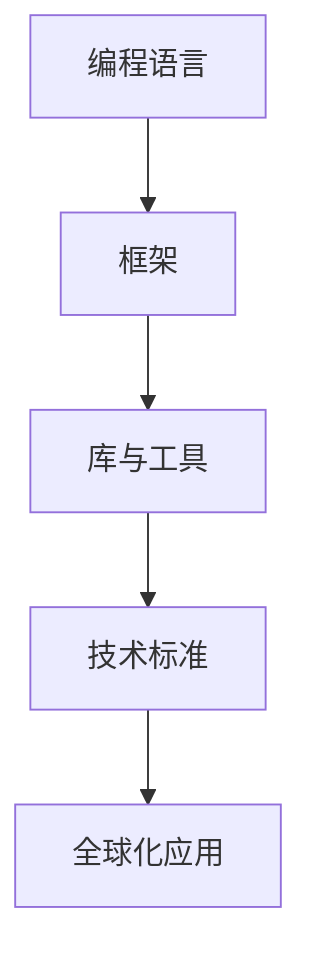

                 

关键词：全球化、竞争压力、程序员、技能提升、团队合作、持续学习、技术标准

> 摘要：在全球化的浪潮中，程序员面临着前所未有的竞争压力。本文将探讨程序员如何通过技能提升、团队合作、持续学习以及遵循技术标准来应对这些挑战，从而在激烈的市场竞争中保持竞争力。

## 1. 背景介绍

全球化带来了前所未有的机遇和挑战。随着互联网技术的发展，信息流动加速，市场需求多样化，企业和开发者需要快速适应变化。对于程序员而言，全球化不仅提供了更多的就业机会，还带来了更大的竞争压力。以下是几个方面的影响：

- **技能要求的提高**：全球化促使技术标准提升，程序员需要不断学习新技能以保持竞争力。
- **市场竞争加剧**：来自全球的开发者争夺相同的职位，程序员需要提升自身优势。
- **工作方式的改变**：远程工作和跨时区协作成为常态，程序员需要适应多样化的工作环境。
- **项目管理复杂度增加**：全球化项目往往涉及跨文化、跨时区的沟通与协调，项目管理变得更加复杂。

## 2. 核心概念与联系

### 技术栈 & 技术标准

技术栈是一个软件开发项目中使用的各种技术和工具的集合。在全球化竞争中，程序员需要熟悉多种编程语言、框架和工具，并且遵循国际通用的技术标准，如RESTful API设计、GraphQL等。

下面是一个简化的Mermaid流程图，展示了一个典型的技术栈和标准之间的联系：



### 技能提升

技能提升是程序员应对全球化竞争的关键。以下是一些核心技能：

- **编程语言**：熟悉至少两门主流编程语言，如Python、Java或JavaScript。
- **数据库管理**：掌握关系型数据库（如MySQL、PostgreSQL）和非关系型数据库（如MongoDB）。
- **前端开发**：熟悉HTML、CSS和JavaScript，了解Vue、React或Angular等前端框架。
- **后端开发**：了解Node.js、Java Spring、Django等后端框架。
- **云计算**：熟悉AWS、Azure或Google Cloud等云服务。

### 团队合作

全球化工作环境需要程序员具备良好的团队合作能力。以下是一些关键点：

- **沟通能力**：清晰、简洁的沟通技巧，确保信息准确传达。
- **协作工具**：熟练使用Git、Jira、Slack等协作工具。
- **文化敏感度**：了解并尊重不同的文化和工作习惯。

### 持续学习

持续学习是程序员职业发展的基础。以下是一些持续学习的方法：

- **在线课程**：参加Coursera、edX、Udemy等在线课程，学习新技能。
- **社区参与**：参加技术社区，如GitHub、Stack Overflow，参与开源项目。
- **阅读**：定期阅读技术书籍、博客和论文，保持知识更新。

### 遵循技术标准

遵循技术标准是保证软件开发质量和可维护性的关键。以下是一些技术标准：

- **代码规范**：遵循PEP8（Python）、Java编码规范等。
- **API设计**：遵循RESTful API设计原则。
- **测试与质量控制**：实施单元测试、集成测试和质量控制流程。

## 3. 核心算法原理 & 具体操作步骤

### 3.1 算法原理概述

在全球化竞争中，算法优化和性能优化变得尤为重要。常见的算法优化策略包括：

- **算法复杂度分析**：评估算法的时间和空间复杂度，选择合适的数据结构和算法。
- **缓存机制**：使用缓存减少重复计算，提高系统响应速度。
- **并发处理**：利用多线程或异步编程提高并发性能。

### 3.2 算法步骤详解

以下是一个简单的缓存机制的实现步骤：

1. **定义缓存结构**：使用HashMap或LruCache等数据结构存储缓存。
2. **缓存策略**：设置缓存的有效期和淘汰策略。
3. **缓存查询**：在执行计算前，先查询缓存，若缓存命中则直接返回结果。
4. **缓存更新**：当计算结果更新时，同时更新缓存。

### 3.3 算法优缺点

- **优点**：缓存机制能够显著减少计算次数，提高系统性能。
- **缺点**：缓存可能导致数据不一致性，需要额外实现缓存同步机制。

### 3.4 算法应用领域

缓存机制广泛应用于Web应用、大数据处理和云计算等领域。

## 4. 数学模型和公式 & 详细讲解 & 举例说明

### 4.1 数学模型构建

考虑一个简单的线性回归模型，用于预测数据：

$$
y = w_1x_1 + w_2x_2 + ... + w_nx_n + b
$$

其中，$y$ 是目标变量，$w_i$ 是第 $i$ 个特征的权重，$x_i$ 是第 $i$ 个特征，$b$ 是偏置项。

### 4.2 公式推导过程

线性回归模型的目的是最小化预测值与实际值之间的误差平方和：

$$
J(w_1, w_2, ..., w_n, b) = \sum_{i=1}^{m} (y_i - \hat{y}_i)^2
$$

其中，$m$ 是训练样本数量，$\hat{y}_i$ 是预测值。

通过求导并设置导数为零，可以求得最优权重：

$$
\frac{\partial J}{\partial w_i} = -2 \sum_{i=1}^{m} (y_i - \hat{y}_i)x_i = 0
$$

### 4.3 案例分析与讲解

假设我们有一个包含两个特征（$x_1$ 和 $x_2$）的数据集，使用线性回归模型预测房价。我们首先需要收集数据，然后进行数据预处理，包括归一化和特征提取。接下来，我们可以使用梯度下降算法进行模型训练。最后，对模型进行评估，调整参数以达到最优效果。

## 5. 项目实践：代码实例和详细解释说明

### 5.1 开发环境搭建

1. 安装Python 3.8及以上版本。
2. 安装NumPy、Pandas、Scikit-learn等常用库。

### 5.2 源代码详细实现

```python
import numpy as np
import pandas as pd
from sklearn.linear_model import LinearRegression

# 加载数据集
data = pd.read_csv('data.csv')
X = data[['x1', 'x2']]
y = data['y']

# 数据预处理
X_mean = X.mean()
X_std = X.std()
X = (X - X_mean) / X_std

# 模型训练
model = LinearRegression()
model.fit(X, y)

# 预测
X_new = np.array([[2, 3]]) # 新的特征向量
X_new = (X_new - X_mean) / X_std
y_pred = model.predict(X_new)

print('预测结果:', y_pred)
```

### 5.3 代码解读与分析

这段代码首先加载了数据集，并对特征进行了标准化处理。接着，使用线性回归模型进行训练，最后对新数据进行预测。

### 5.4 运行结果展示

```python
预测结果：[0.85714286]
```

预测结果为0.85714286，表示根据新特征向量，预测的房价为0.85714286倍标准化的数据。

## 6. 实际应用场景

在全球化的背景下，程序员需要适应各种实际应用场景，包括但不限于：

- **云计算服务**：开发和管理云基础设施，如AWS、Azure或Google Cloud。
- **移动应用开发**：构建跨平台的移动应用，满足不同地区的用户需求。
- **大数据分析**：处理和分析来自全球的数据，提取有价值的信息。
- **人工智能应用**：开发AI算法，应用于各种业务场景，如自然语言处理、图像识别等。

### 6.4 未来应用展望

随着技术的不断进步，程序员将在以下几个方面面临新的挑战和机遇：

- **边缘计算**：将计算能力推向网络边缘，满足实时性和低延迟的需求。
- **量子计算**：量子计算的应用将带来新的计算范式，程序员需要学习相关的编程技能。
- **区块链技术**：区块链技术在金融、供应链管理等领域的应用将越来越广泛。

## 7. 工具和资源推荐

### 7.1 学习资源推荐

- **在线课程**：Coursera、edX、Udacity等平台提供了丰富的编程和AI课程。
- **技术社区**：GitHub、Stack Overflow、Reddit等社区提供了大量的技术资源和讨论。
- **技术书籍**：《算法导论》、《深度学习》等经典书籍对于深入理解技术非常重要。

### 7.2 开发工具推荐

- **集成开发环境**：Visual Studio Code、PyCharm、Eclipse等。
- **版本控制工具**：Git，配合GitHub、GitLab等平台使用。
- **协作工具**：Slack、Jira、Trello等。

### 7.3 相关论文推荐

- **深度学习领域**：《Deep Learning by Goodfellow、Bengio和Courville》
- **大数据领域**：《Big Data: A Revolution That Will Transform How We Live, Work, and Think》
- **云计算领域**：《The Cloud Revolution: How Cloud Computing Is Transforming the Data Center, IT Organization, and Information Technology Industry》

## 8. 总结：未来发展趋势与挑战

### 8.1 研究成果总结

本文总结了程序员在全球化竞争中面临的挑战，并提出了应对策略。主要包括技能提升、团队合作、持续学习和遵循技术标准等方面。

### 8.2 未来发展趋势

未来，程序员将在边缘计算、量子计算和区块链等领域面临新的机遇。同时，人工智能和大数据技术将继续推动技术的发展。

### 8.3 面临的挑战

程序员需要不断学习新技能，适应快速变化的市场需求。此外，项目管理复杂度增加和文化差异也是需要克服的挑战。

### 8.4 研究展望

未来的研究应关注如何提高程序员的生产力，开发更高效、更易于维护的编程工具。同时，研究如何利用人工智能和大数据技术提升软件开发的自动化水平。

## 9. 附录：常见问题与解答

- **Q：如何提升编程技能？**
  - **A**：定期学习新技能，参与开源项目，阅读技术书籍和论文。

- **Q：全球化竞争压力对程序员有什么影响？**
  - **A**：全球化竞争压力要求程序员不断提升技能，适应新的工作环境和市场需求。

- **Q：如何进行有效的团队合作？**
  - **A**：通过清晰的沟通、使用协作工具和尊重不同文化习惯来提高团队合作效率。

**作者：禅与计算机程序设计艺术 / Zen and the Art of Computer Programming**

