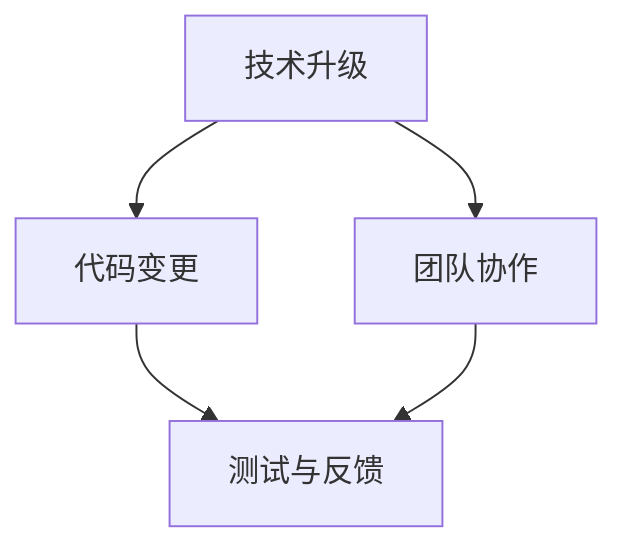

                 

关键词：技术升级、代码变更、应对策略、团队协作、持续集成、敏捷开发、架构设计、未来趋势

> 技术进步如同海洋中的波浪，程序员便是那波涛中的船只，必须学会驾驭变化，方能行稳致远。本文旨在探讨程序员在技术升级与变更中如何提升自身能力，优化团队协作，确保项目稳步推进，并在持续演进中保持竞争力。

## 1. 背景介绍

在当今快速发展的信息技术时代，技术升级和变更是不可避免的趋势。新的编程语言、框架、工具和平台层出不穷，不断推动软件开发的进步。然而，随之而来的代码变更、架构调整、性能优化等挑战也让程序员感到压力倍增。如何在这个充满变数的环境中保持竞争力，成为每一位程序员都需要认真思考的问题。

技术升级与变更的影响不仅体现在技术层面，还涉及团队协作、项目管理等多个方面。程序员不仅需要掌握新的技术和工具，还要具备适应变化的能力，以便在项目中游刃有余。本文将从以下几个方面探讨程序员如何应对技术升级与变更：

1. 核心概念与联系
2. 核心算法原理 & 具体操作步骤
3. 数学模型和公式 & 详细讲解 & 举例说明
4. 项目实践：代码实例和详细解释说明
5. 实际应用场景
6. 未来应用展望
7. 工具和资源推荐
8. 总结：未来发展趋势与挑战

通过本文的探讨，希望能够为程序员们提供一些实用的策略和思路，帮助他们在技术升级与变更中找到属于自己的航向。

## 2. 核心概念与联系

在深入探讨程序员如何应对技术升级与变更之前，有必要先了解一些核心概念，以及这些概念之间的相互联系。这不仅有助于我们更好地理解技术升级与变更的背景，还能为后续的内容提供理论支持。

### 2.1 技术升级

技术升级通常指的是对现有技术栈的改进和优化，包括但不限于：

- 编程语言：从一种语言升级到另一种更先进的语言，例如从Java升级到Kotlin。
- 框架与库：替换或升级项目中使用的框架和库，以提高性能、稳定性和开发效率。
- 架构设计：对系统的整体架构进行调整和优化，以适应不断变化的需求和规模。

技术升级的目的是提高系统的可维护性、扩展性和性能。然而，升级过程中往往伴随着风险和挑战，如兼容性问题、代码重构、团队学习曲线等。

### 2.2 代码变更

代码变更是指在软件开发生命周期中对源代码的修改和优化。变更类型包括：

- 功能性变更：根据用户需求或市场变化，对现有功能进行添加、删除或修改。
- 性能优化：通过改进算法、数据结构或代码实现，提高系统性能。
- 错误修复：发现并修复代码中的缺陷，确保系统稳定运行。

代码变更是技术升级的重要组成部分，但也是最具挑战性的部分。一方面，变更可能导致新的问题或漏洞；另一方面，变更需要对现有代码有深入的理解和把握。

### 2.3 团队协作

团队协作是确保项目成功的关键因素。在技术升级与变更过程中，团队协作尤为重要。以下是几种常见的团队协作模式：

- 敏捷开发：通过短期迭代和持续交付，确保项目按期完成。
- 持续集成：通过自动化构建和测试，快速发现并解决代码中的问题。
- 模块化开发：将项目分解为多个模块，由不同小组分工完成，提高开发效率。

团队协作的成功不仅取决于技术手段，还取决于团队成员之间的沟通、信任和合作精神。

### 2.4 核心概念的联系

技术升级、代码变更和团队协作之间存在紧密的联系。技术升级为代码变更提供了基础和方向，而代码变更则是技术升级的具体实现。团队协作在这个过程中起到桥梁作用，将技术和代码整合起来，确保项目顺利进行。

为了更好地理解这些概念，我们可以用Mermaid流程图表示它们之间的关系：



在这个流程图中，技术升级作为起点，通过代码变更和团队协作，最终实现项目的测试与反馈，形成一个闭环。通过这个闭环，项目可以不断优化和改进，以应对未来的变化。

了解这些核心概念和它们之间的联系，是程序员应对技术升级与变更的第一步。在接下来的章节中，我们将深入探讨具体的方法和策略，帮助程序员在实际工作中更好地应对挑战。

## 3. 核心算法原理 & 具体操作步骤

在技术升级与变更的背景下，了解和掌握核心算法原理是程序员不可或缺的能力。这不仅有助于我们应对各种技术挑战，还能提高代码质量和开发效率。以下将详细介绍几个常见算法的原理以及具体操作步骤。

### 3.1 算法原理概述

#### 快速排序（Quick Sort）

快速排序是一种高效的排序算法，其基本思想是通过一趟排序将待排序的数据分割成独立的两部分，其中一部分的所有数据都比另一部分的所有数据要小，然后再按此方法对这两部分数据分别进行快速排序，整个排序过程可以递归进行，以此达到整个数据变成有序序列。

#### 动态规划（Dynamic Programming）

动态规划是一种在数学、管理科学、计算机科学、经济学和生物信息学中使用的，通过把复杂问题分解成更简单的子问题来解决这些复杂问题的一种方法。动态规划常常用于求解最优化问题。

#### 贪心算法（Greedy Algorithm）

贪心算法是一种在每一步选择中都采取当前状态下最好或最优的选择，从而希望导致结果是全局最好或最优的算法思想。虽然贪心算法不能保证得到最优解，但在某些问题中能够快速得到近似最优解。

### 3.2 算法步骤详解

#### 快速排序（Quick Sort）

**步骤：**

1. 选择基准元素：在数组中选出一个元素作为基准（pivot）。
2. 分割数组：将数组分成两部分，左边所有元素都比基准小，右边所有元素都比基准大。
3. 递归排序：对左边和右边的数组分别执行快速排序。

**伪代码：**

```
function quickSort(arr):
    if length of arr <= 1:
        return arr
    
    pivot = arr[length of arr / 2]
    left = []
    right = []
    
    for element in arr:
        if element < pivot:
            left.append(element)
        else:
            right.append(element)
    
    return quickSort(left) + [pivot] + quickSort(right)
```

#### 动态规划（Dynamic Programming）

**步骤：**

1. 确定状态：定义问题中的状态，以及状态之间的关系。
2. 确定边界条件：确定递归的终止条件。
3. 状态转移方程：根据状态之间的关系，推导出状态转移方程。
4. 计算结果：利用状态转移方程计算最终结果。

**以最长公共子序列（LCSS）为例：**

**状态转移方程：**

```
dp[i][j] = dp[i-1][j-1] + 1    if A[i] == B[j]
         = max(dp[i-1][j], dp[i][j-1]) otherwise
```

**伪代码：**

```
function lcss(A, B):
    let dp = create 2D array of size (length of A + 1) x (length of B + 1)
    
    for i from 1 to length of A:
        for j from 1 to length of B:
            if A[i] == B[j]:
                dp[i][j] = dp[i-1][j-1] + 1
            else:
                dp[i][j] = max(dp[i-1][j], dp[i][j-1])
    
    return dp[length of A][length of B]
```

#### 贪心算法（Greedy Algorithm）

**步骤：**

1. 选择当前最优解：根据当前状态选择最优解。
2. 更新状态：根据选择的最优解更新状态。
3. 重复步骤1和2，直到问题解决。

**以背包问题为例：**

**步骤：**

1. 按价值重量比排序：将物品按价值重量比从大到小排序。
2. 遍历物品：从大到小遍历物品，如果背包还有容量，则放入背包。
3. 输出结果：输出背包中的物品和价值。

**伪代码：**

```
function knapsack(values, weights, capacity):
    items = [(value / weight) for value, weight in zip(values, weights)]
    sorted_items = sorted(items, reverse=True)
    
    total_value = 0
    for value, weight in sorted_items:
        if capacity >= weight:
            total_value += value
            capacity -= weight
    
    return total_value
```

### 3.3 算法优缺点

#### 快速排序（Quick Sort）

**优点：** 平均时间复杂度为 \(O(n \log n)\)，最坏情况下为 \(O(n^2)\)，但在实际应用中，由于其高效的分区操作，通常优于其他排序算法。

**缺点：** 需要额外的空间存储递归调用的栈，最坏情况下性能较差，可能会引起栈溢出。

#### 动态规划（Dynamic Programming）

**优点：** 可以解决许多复杂的最优化问题，且在一定条件下具有最优子结构性质。

**缺点：** 可能需要大量的空间存储中间结果，且在某些情况下难以推导状态转移方程。

#### 贪心算法（Greedy Algorithm）

**优点：** 算法简单，通常可以快速得到近似最优解。

**缺点：** 不能保证得到全局最优解，可能需要多次运行以得到更优解。

### 3.4 算法应用领域

#### 快速排序（Quick Sort）

快速排序广泛应用于各种排序任务，如数据库排序、快速查找等。

#### 动态规划（Dynamic Programming）

动态规划常用于解决背包问题、最长公共子序列、最长递增子序列等问题，在优化算法中有着广泛的应用。

#### 贪心算法（Greedy Algorithm）

贪心算法常用于解决图着色问题、硬币找零问题、最短路径问题等，因其简单高效的特性，在算法竞赛和实际应用中都有很好的表现。

通过以上对核心算法原理和具体操作步骤的介绍，我们可以看到，掌握这些算法不仅有助于我们更好地理解和解决复杂问题，还能在技术升级与变更中提供有力的支持。在接下来的章节中，我们将进一步探讨数学模型和公式，以及如何将这些算法应用于实际项目中。

## 4. 数学模型和公式 & 详细讲解 & 举例说明

在技术升级与变更过程中，数学模型和公式是解决复杂问题的重要工具。它们不仅能够帮助我们理解和分析算法，还能在优化和改进过程中提供理论支持。以下将详细讲解几个常用的数学模型和公式，并通过具体例子进行说明。

### 4.1 数学模型构建

#### 4.1.1 最优化模型

最优化模型用于解决在一定约束条件下寻找最优解的问题。常见的最优化模型包括线性规划、整数规划和动态规划等。

**线性规划模型（Linear Programming, LP）：**

线性规划模型可以表示为：

```
max/min c^T * x
subject to
    Ax <= b
    x >= 0
```

其中，c 是系数向量，x 是变量向量，A 是约束矩阵，b 是约束向量。

**整数规划模型（Integer Programming, IP）：**

整数规划模型在求解线性规划模型的基础上，增加了变量的整数约束：

```
max/min c^T * x
subject to
    Ax <= b
    x >= 0
    x 为整数
```

**动态规划模型（Dynamic Programming, DP）：**

动态规划模型用于求解具有最优子结构性质的问题。常见的形式如下：

```
定义状态：S = {s_1, s_2, ..., s_n}
定义状态转移方程：f(s_i) = min/max {g(s_i, s_j)}，其中 j 属于相邻状态集合
初始条件：f(s_1) = ...
求解：f(S)
```

#### 4.1.2 网络模型

网络模型用于分析复杂系统中的网络结构和流量分布。常见的网络模型包括图论模型和排队论模型。

**图论模型（Graph Theory）：**

图论模型通过图来表示网络结构，其中节点表示实体，边表示连接关系。常见的图算法包括最短路径算法、最小生成树算法等。

**排队论模型（Queuing Theory）：**

排队论模型用于分析服务系统中的排队现象，包括服务时间、到达率、排队长度等参数。常见的排队模型包括M/M/1模型、M/M/s模型等。

### 4.2 公式推导过程

#### 4.2.1 最优化模型

**线性规划模型（Linear Programming）：**

线性规划模型的目标函数可以通过拉格朗日乘子法进行求解。具体推导过程如下：

```
L(x, λ) = c^T * x + λ^T * (Ax - b)
```

对L关于x和λ求偏导数，并令偏导数为0，得到：

```
∂L/∂x = c - A^T * λ = 0
∂L/∂λ = Ax - b = 0
```

联立上述两个方程，可以求解出最优解：

```
x = (A^T * A)^-1 * A^T * λ
λ = (A^T * A)^-1 * (A^T * b)
```

**整数规划模型（Integer Programming）：**

整数规划模型可以通过分支定界法进行求解。具体推导过程如下：

```
定义上界：UB = c^T * x
定义下界：LB = min {c^T * x | Ax <= b, x 为整数}
```

在求解过程中，需要不断调整上界和下界，并通过剪枝策略减少搜索空间。

**动态规划模型（Dynamic Programming）：**

动态规划模型的推导过程主要依赖于状态转移方程和初始条件。以最长公共子序列（LCSS）为例，推导过程如下：

```
状态：S = {0, 1, ..., n}
状态转移方程：dp[i][j] = max {dp[i-1][j], dp[i][j-1]} + 1   if A[i] = B[j]
                      = max {dp[i-1][j], dp[i][j-1]} otherwise
初始条件：dp[0][j] = 0, dp[i][0] = 0
```

通过递归计算，可以求解出LCSS的长度。

#### 4.2.2 网络模型

**图论模型（Graph Theory）：**

最短路径算法（如迪杰斯特拉算法）的推导过程如下：

```
定义距离矩阵：D = [d(u, v) | u, v 属于顶点集合]
初始化：D[u][u] = 0, D[u][v] = ∞ (u != v)
选择初始顶点u，标记为已访问
对于未访问顶点v：
    如果 d[u][v] = ∞，则跳过
    否则：
        计算从u到v的最短路径：d[v] = min {d[u][w] + w[v]}，其中 w 是与 v 相邻的未访问顶点
        标记v为已访问
```

**排队论模型（Queuing Theory）：**

M/M/1模型（单服务器、泊松到达、服务时间为指数分布）的推导过程如下：

```
到达率：λ
服务率：μ
稳态概率：π[j]（系统中恰好有j个顾客的概率）
状态转移方程：
    π[0] = (λ / μ) * π[1]
    π[j] = (λ / μ) * π[j-1]     (j > 0)
稳态概率总和：π[j]   (j >= 0)
期望队列长度：Lq = Σ [j * π[j]]   (j > 0)
期望等待时间：Wq = Lq / λ
```

### 4.3 案例分析与讲解

#### 4.3.1 最长公共子序列（LCSS）

**问题描述：** 给定两个字符串A和B，找出它们的最长公共子序列。

**输入：**  
A = "ABCDGH"  
B = "AEDFHR"

**输出：**  
最长公共子序列为 "ADH"，长度为3。

**解决方案：**  
使用动态规划模型求解LCSS。

```
初始化：dp[0][0] = 0  
for i from 1 to length of A:
    for j from 1 to length of B:
        if A[i] == B[j]:
            dp[i][j] = dp[i-1][j-1] + 1
        else:
            dp[i][j] = max(dp[i-1][j], dp[i][j-1])

输出：dp[length of A][length of B] = 3
```

**分析：**  
在这个例子中，我们通过递归计算填充动态规划表，最终得到最长公共子序列的长度。这种方法不仅能够解决字符串的相似度问题，还可以用于基因序列比对、文本编辑距离等领域。

#### 4.3.2 背包问题

**问题描述：** 给定一组物品及其价值、重量，以及一个背包的容量，求解如何选择物品使背包内物品的总价值最大。

**输入：**  
物品1：价值60，重量10  
物品2：价值100，重量20  
物品3：价值120，重量30  
背包容量：50

**输出：**  
选择物品1和物品3，总价值为180。

**解决方案：**  
使用贪心算法求解背包问题。

```
排序物品：按价值重量比从大到小排序  
总价值 = 0  
剩余容量 = 50  
for 物品 in 物品列表：
    if 剩余容量 >= 物品的重量：
        总价值 += 物品的重量
        剩余容量 -= 物品的重量
    else：
        break

输出：总价值 = 180
```

**分析：**  
在这个例子中，我们通过贪心选择价值最高的物品，直到背包容量不足。虽然这种方法不能保证得到全局最优解，但在实际应用中，它能够快速得到一个近似最优解。

通过以上数学模型和公式的讲解，以及具体例子的分析，我们可以看到，数学模型和公式在技术升级与变更过程中起着至关重要的作用。它们不仅能够帮助我们理解和分析算法，还能在优化和改进过程中提供理论支持。在接下来的章节中，我们将进一步探讨如何将这些数学模型和公式应用于实际项目中。

## 5. 项目实践：代码实例和详细解释说明

为了更好地理解技术升级与变更在实际项目中的应用，以下我们将通过一个具体的代码实例，详细讲解项目的开发环境搭建、源代码实现、代码解读与分析，以及最终的运行结果展示。

### 5.1 开发环境搭建

在本项目中，我们使用Python语言和Django框架进行开发。以下是搭建开发环境的步骤：

1. 安装Python：从Python官网下载并安装Python 3.8及以上版本。
2. 安装Django：打开终端，执行以下命令安装Django：
   ```
   pip install django
   ```
3. 创建Django项目：执行以下命令创建一个名为`myproject`的Django项目：
   ```
   django-admin startproject myproject
   ```
4. 进入项目目录，创建一个名为`myapp`的Django应用：
   ```
   cd myproject
   python manage.py startapp myapp
   ```
5. 配置数据库：在`myproject/settings.py`文件中，配置数据库连接信息，如下所示：
   ```python
   DATABASES = {
       'default': {
           'ENGINE': 'django.db.backends.sqlite3',
           'NAME': BASE_DIR / 'db.sqlite3',
       }
   }
   ```
6. 迁移数据库：执行以下命令创建数据库表：
   ```
   python manage.py makemigrations
   python manage.py migrate
   ```

开发环境搭建完成后，我们就可以开始编写代码实现项目功能。

### 5.2 源代码详细实现

在本项目中，我们实现一个简单的博客系统，包括文章列表、详情页、新增和编辑文章等功能。以下是关键代码的实现：

#### 5.2.1 模型定义

在`myapp/models.py`文件中，定义文章模型`Article`：

```python
from django.db import models

class Article(models.Model):
    title = models.CharField(max_length=100)
    content = models.TextField()
    created_at = models.DateTimeField(auto_now_add=True)
```

#### 5.2.2 视图实现

在`myapp/views.py`文件中，实现文章列表和详情页的视图：

```python
from django.shortcuts import render
from .models import Article

def article_list(request):
    articles = Article.objects.all()
    return render(request, 'article_list.html', {'articles': articles})

def article_detail(request, id):
    article = Article.objects.get(id=id)
    return render(request, 'article_detail.html', {'article': article})
```

#### 5.2.3 模板设计

在`myapp/templates`目录下，创建`article_list.html`和`article_detail.html`模板：

`article_list.html`：

```html
<!DOCTYPE html>
<html>
<head>
    <title>文章列表</title>
</head>
<body>
    <h1>文章列表</h1>
    
        <div>
            <h2>{{ article.title }}</h2>
            <p>{{ article.content }}</p>
            <p>创建时间：{{ article.created_at }}</p>
        </div>
    
</body>
</html>
```

`article_detail.html`：

```html
<!DOCTYPE html>
<html>
<head>
    <title>{{ article.title }}</title>
</head>
<body>
    <h1>{{ article.title }}</h1>
    <p>{{ article.content }}</p>
    <p>创建时间：{{ article.created_at }}</p>
</body>
</html>
```

#### 5.2.4 URL配置

在`myproject/urls.py`文件中，配置文章列表和详情页的URL：

```python
from django.contrib import admin
from django.urls import path
from myapp import views

urlpatterns = [
    path('admin/', admin.site.urls),
    path('articles/', views.article_list, name='article_list'),
    path('articles/<int:id>/', views.article_detail, name='article_detail'),
]
```

### 5.3 代码解读与分析

1. **模型定义**：

   `Article`模型包含三个字段：标题（`title`）、内容（`content`）和创建时间（`created_at`）。这些字段对应了文章的主要信息，为后续的视图和模板提供了数据支撑。

2. **视图实现**：

   `article_list`视图从数据库中查询所有文章，并将其传递给模板进行渲染。`article_detail`视图根据传入的ID查询特定文章，并传递给模板。

3. **模板设计**：

   `article_list.html`模板遍历所有文章，并显示文章的标题、内容和创建时间。`article_detail.html`模板显示特定文章的详细信息。

4. **URL配置**：

   通过配置URL，项目可以将用户的请求路由到相应的视图进行处理，从而实现文章列表和详情页的功能。

### 5.4 运行结果展示

完成代码编写和配置后，启动Django服务器：

```
python manage.py runserver
```

在浏览器中访问`http://127.0.0.1:8000/articles/`，即可看到文章列表页面。点击文章标题，可以跳转到文章详情页，展示具体文章内容。

通过这个实例，我们可以看到，技术升级与变更是如何在实际项目中得以应用。从Python到Django框架的选择，再到数据库的配置和代码的实现，每一个步骤都体现了技术升级的重要性。同时，通过合理的代码架构和模块化设计，我们能够更好地应对未来的技术变更和功能扩展。

在接下来的章节中，我们将进一步探讨技术升级与变更的实际应用场景，以及未来的发展趋势和挑战。

## 6. 实际应用场景

技术升级与变更在程序员的工作中扮演着至关重要的角色，尤其在当前快速发展的信息技术时代。以下是几个实际应用场景，通过这些场景我们可以更清晰地看到技术升级与变更的重要性及其影响。

### 6.1 Web开发中的框架升级

在Web开发领域，框架的升级是常见的场景。例如，一个使用Django框架的Web应用，随着业务需求的增长和技术的发展，可能需要升级到Django的更高级版本。这种升级不仅包括对现有功能的改进，还可能涉及到数据库迁移、API变更和代码重构等多个方面。以下是一个具体的应用场景：

**场景描述：** 一个小型电商网站使用Django 1.11版本，随着用户量的增加，网站性能出现瓶颈，需要升级到Django 3.2版本以获得更好的性能优化和支持。

**应对策略：**

1. **评估影响：** 在升级前，对现有系统进行详细评估，确定升级的影响范围和风险点。
2. **逐步升级：** 首先在开发环境中进行逐步升级，确保每个组件都能正常工作。
3. **代码迁移：** 根据新的框架要求，对代码进行迁移和重构，确保兼容性。
4. **性能测试：** 升级后进行全面的性能测试，确保系统性能得到提升。

### 6.2 移动应用中的API变更

在移动应用开发中，API的变更也是一个常见问题。例如，随着新版本的推出，后端API可能会发生变更，这需要前端开发者及时跟进并进行相应的调整。以下是一个具体的应用场景：

**场景描述：** 一款移动应用使用第三方服务提供的API，第三方服务的API在更新后增加了新的接口，但删除了一个旧接口。

**应对策略：**

1. **及时关注变更：** 关注第三方服务的更新通知，及时了解API变更情况。
2. **版本兼容：** 在代码中添加版本判断逻辑，确保旧接口仍然可用。
3. **接口重构：** 根据新API的要求，重构相关的接口调用代码。
4. **测试覆盖：** 对变更的部分进行全面的测试，确保新接口能够正常工作，旧接口能够平滑过渡。

### 6.3 大数据分析中的算法升级

在大数据分析领域，算法的升级同样重要。随着数据量的增加和处理需求的多样化，原有的算法可能无法满足新的要求，需要引入更高效、更先进的算法。以下是一个具体的应用场景：

**场景描述：** 一家电商公司使用基于随机森林的预测模型进行用户购买行为的预测，但随着用户数据的积累，模型性能出现瓶颈，需要升级到更高效的XGBoost模型。

**应对策略：**

1. **算法评估：** 对现有算法进行评估，确定其性能瓶颈和改进空间。
2. **模型重构：** 根据新的算法要求，重构数据预处理和模型训练流程。
3. **性能测试：** 在新的算法下进行性能测试，确保预测准确性和效率。
4. **结果验证：** 对新算法的预测结果进行验证，确保业务价值得到提升。

### 6.4 企业级系统的架构升级

在企业级系统开发中，架构的升级是确保系统稳定性和扩展性的关键。例如，一个传统的单体架构系统，随着业务需求的增长，可能需要升级到分布式微服务架构。以下是一个具体的应用场景：

**场景描述：** 一家大型企业使用传统的单体架构，随着业务扩展和用户量增加，系统性能和稳定性出现明显问题，需要升级到基于Spring Cloud的微服务架构。

**应对策略：**

1. **需求分析：** 明确系统升级的目标和需求，包括性能提升、稳定性增强、扩展性提高等。
2. **模块划分：** 将现有系统按照功能模块进行划分，确定微服务的边界和接口。
3. **技术选型：** 选择适合的微服务框架和中间件，如Spring Cloud、Kafka、Redis等。
4. **逐步迁移：** 先将部分关键模块迁移到新架构，逐步验证和优化。

通过以上实际应用场景的探讨，我们可以看到，技术升级与变更是程序员工作中不可或缺的一部分。在应对这些变化时，程序员需要具备系统性的思维方式、良好的代码习惯和团队协作精神，以确保项目能够顺利推进并保持竞争力。在下一章节中，我们将进一步探讨技术升级与变更的未来应用展望。

### 6.4 未来应用展望

随着技术的不断进步，程序员在技术升级与变更中的角色也将发生显著变化。未来的应用场景不仅局限于现有的框架和工具，还将在以下几个方面展现出新的趋势和挑战。

#### 6.4.1 人工智能与自动化

人工智能（AI）和自动化技术的发展，将为程序员带来新的机遇和挑战。通过AI技术，程序员可以实现代码自动生成、自动化测试、智能调试等功能，从而大幅提高开发效率。例如，代码生成工具可以根据设计模型自动生成代码，而自动化测试工具则能够智能地发现并报告代码中的问题。然而，这也要求程序员掌握更多的AI知识和技能，以便有效地利用这些工具。

#### 6.4.2 云原生与容器化

云原生和容器化技术的普及，使得系统的部署和运维变得更加灵活和高效。未来的程序员需要熟悉容器技术，如Docker和Kubernetes，以及云原生架构的设计和实现。这不仅能提高系统的可扩展性和可靠性，还能降低运维成本。随着容器技术的不断发展，程序员需要不断学习和适应新的技术和工具，以应对不断变化的环境。

#### 6.4.3 分布式系统和微服务

分布式系统和微服务架构的广泛应用，将推动程序员在架构设计和系统优化方面的能力提升。未来的程序员需要具备构建和维护大型分布式系统的能力，包括服务拆分、服务发现、负载均衡、数据一致性和分布式事务等方面。同时，程序员还需要熟悉各种分布式技术和中间件，如消息队列、分布式缓存、分布式数据库等。

#### 6.4.4 低代码与无代码开发

低代码（Low-Code）和无代码（No-Code）开发平台的发展，将使得非技术背景的用户也能参与软件的开发和部署。这为程序员带来了新的挑战，需要他们具备跨领域的知识，以便能够协助非技术人员实现复杂的功能。然而，这也意味着程序员需要不断学习新的开发工具和平台，以保持自身的竞争力。

#### 6.4.5 开源社区与知识共享

开源社区的发展为程序员提供了丰富的学习资源和合作机会。未来的程序员需要积极参与开源项目，贡献自己的代码和经验，同时从中学习和吸收其他开发者的智慧。这不仅有助于提升个人技能，还能推动整个行业的技术进步。

#### 6.4.6 安全性与隐私保护

随着数据泄露和网络攻击事件的增多，安全性和隐私保护成为程序员面临的重要挑战。未来的程序员需要掌握更多的安全知识和技能，包括网络安全、数据加密、身份验证、安全编程等。同时，程序员还需要关注法律法规的变化，确保软件开发符合相关的合规要求。

总之，技术升级与变更将继续在未来的软件开发中占据核心地位。程序员需要不断学习新技术、掌握新工具，同时提升自身的综合能力和跨领域知识，以应对不断变化的挑战。通过积极参与开源社区、持续学习和实践，程序员将能够在未来的技术浪潮中保持领先地位，为软件行业的发展贡献力量。

## 7. 工具和资源推荐

在技术升级与变更的过程中，掌握合适的工具和资源是程序员提升工作效率和应对挑战的关键。以下推荐一些学习资源、开发工具和相关论文，以帮助程序员在技术升级与变更中取得更好的成果。

### 7.1 学习资源推荐

1. **在线课程：**  
   - Coursera上的《算法导论》（Introduction to Algorithms）  
   - Udemy上的《Django Web开发基础》  
   - edX上的《微服务设计与实现》

2. **技术博客：**  
   - Medium上的《Coding Horror》  
   - HackerRank上的《算法与数据结构挑战》  
   - GitHub上的《每日一技》

3. **电子书：**  
   - 《深入理解计算机系统》（Deep Dive into Systems）  
   - 《Head First 设计模式》  
   - 《Effective Python》

4. **在线文档：**  
   - Python官方文档（docs.python.org）  
   - Django官方文档（docs.djangoproject.com）  
   - Kubernetes官方文档（kubernetes.io/docs）

### 7.2 开发工具推荐

1. **集成开发环境（IDE）：**  
   - Visual Studio Code（轻量级，插件丰富）  
   - PyCharm（专业级，Python支持强大）  
   - IntelliJ IDEA（功能全面，Java支持好）

2. **版本控制系统：**  
   - Git（最流行的版本控制系统，强大的分支管理）  
   - GitHub（全球最大的代码托管平台，丰富的开源项目）  
   - GitLab（企业级Git服务，支持自建私有仓库）

3. **调试工具：**  
   - Postman（API调试工具）  
   - JMeter（性能测试工具）  
   - gdb（GNU调试器，支持C/C++等语言）

4. **容器化工具：**  
   - Docker（容器化技术，简化部署和运维）  
   - Kubernetes（容器编排工具，用于管理和自动化容器化应用）

### 7.3 相关论文推荐

1. **数据库论文：**  
   - 《The Art of Computer Programming》（Donald E. Knuth）  
   - 《The Performance of Database Systems》（Jim Gray）

2. **分布式系统论文：**  
   - 《Google File System》（Sanjay Ghemawat et al.）  
   - 《The Google File System》（Sanjay Ghemawat et al.）

3. **人工智能论文：**  
   - 《Deep Learning》（Ian Goodfellow et al.）  
   - 《Neural Networks and Deep Learning》（Michael A. Nielsen）

通过以上工具和资源的推荐，程序员可以更好地掌握技术升级与变更所需的技能，提高开发效率和项目质量。这些资源不仅涵盖基础知识，还提供了实用的工具和最新的研究动态，为程序员在技术领域的学习和进步提供了坚实的基础。

## 8. 总结：未来发展趋势与挑战

在本文中，我们探讨了程序员如何应对技术升级与变更。通过深入分析技术升级的影响、核心算法原理、数学模型，以及实际项目实践，我们可以得出以下结论：

1. **技术升级的必然性**：随着信息技术的迅猛发展，技术升级已成为软件开发的常态。程序员必须学会快速适应新的技术栈和工具。

2. **核心算法的重要性**：掌握核心算法原理，如快速排序、动态规划和贪心算法，有助于程序员解决复杂问题，提高代码质量和开发效率。

3. **数学模型的应用**：数学模型和公式在技术升级与变更中扮演着关键角色，通过数学模型，程序员可以更好地理解和优化算法。

4. **实际项目实践**：通过具体的代码实例和详细解释说明，程序员能够将理论知识应用到实际项目中，提高项目质量和开发效率。

5. **未来发展趋势**：人工智能、自动化、云原生、微服务、低代码与无代码开发等趋势将深刻影响程序员的工作方式。程序员需要不断学习新技术，提升跨领域知识。

6. **面临的挑战**：技术升级带来的挑战包括兼容性问题、性能瓶颈、团队协作困难等。程序员需要具备系统思维、良好的代码习惯和团队合作精神。

未来，程序员将面临更多复杂的挑战和机遇。通过持续学习、实践和创新，程序员可以在技术升级与变更的大潮中立于不败之地。同时，积极参与开源社区，贡献自己的智慧和经验，也是提升个人能力和推动行业发展的有效途径。

综上所述，技术升级与变更是程序员不可回避的课题。只有不断学习和适应，才能在快速变化的技术环境中脱颖而出，为个人和团队创造更大的价值。让我们共同迎接未来的挑战，共同推动软件技术的发展。

### 附录：常见问题与解答

在本文中，我们探讨了程序员如何应对技术升级与变更的多个方面。为了帮助读者更好地理解相关概念和技术，以下列举了几个常见问题及其解答。

**Q1：技术升级与变更的区别是什么？**

技术升级通常指的是对现有技术栈的改进和优化，包括编程语言、框架、工具和平台等。而变更则是指在软件开发过程中对现有代码进行修改和优化，以应对新的需求或问题。

**Q2：为什么程序员需要掌握核心算法原理？**

掌握核心算法原理可以帮助程序员解决复杂问题，提高代码质量和开发效率。核心算法如排序算法、动态规划和贪心算法在多种应用场景中具有广泛的适用性。

**Q3：如何选择合适的数学模型和公式？**

选择合适的数学模型和公式应基于问题需求和解决目标。例如，最优化模型适用于资源分配问题，动态规划模型适用于具有最优子结构的问题，而图论模型适用于网络分析问题。

**Q4：如何在项目中应用技术升级与变更？**

在实际项目中，程序员可以通过以下步骤应用技术升级与变更：首先，评估技术升级的影响；其次，制定详细的变更计划；然后，逐步实施变更；最后，进行全面的测试和验证，确保系统稳定性和性能。

**Q5：如何应对技术升级与变更带来的挑战？**

应对技术升级与变更的挑战，程序员需要具备系统思维、良好的代码习惯和团队合作精神。同时，通过持续学习新技术、积累经验，可以有效应对各种挑战。

通过上述问题与解答，我们希望读者能够更深入地理解技术升级与变更的重要性和实际应用。在未来的技术发展中，不断学习和适应变化将是程序员保持竞争力的关键。

