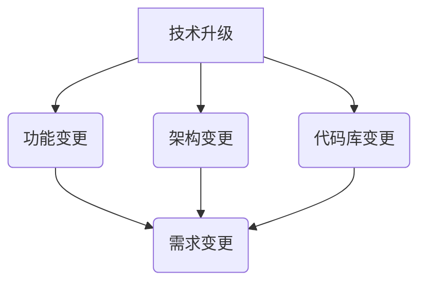

                 

在快速变化的技术环境中，程序员面临着技术升级和变更的持续挑战。本文旨在探讨程序员如何有效应对这些变化，以保持其技能的时效性和竞争力。本文将分为以下章节：

## 1. 背景介绍

### 1.1 技术环境的快速变迁

技术环境的变化速度之快，要求程序员不断更新知识库，掌握新技术。这不仅仅是技术层面的更新，还涉及到编程语言、框架、库和工具的不断迭代。

### 1.2 项目需求的不断调整

在实际项目中，需求往往不是一成不变的。客户和市场环境的变化可能导致需求的变更，程序员需要灵活应对这些变化。

## 2. 核心概念与联系

### 2.1 技术升级的概念

技术升级指的是将现有的技术体系更新为更先进的版本，以提高系统的性能、安全性和可维护性。

### 2.2 技术变更的类型

变更可分为以下几种类型：

- **功能变更**：新增或修改系统功能。
- **架构变更**：修改系统的架构设计。
- **代码库变更**：更新或重构代码库。

### 2.3 Mermaid 流程图



## 3. 核心算法原理 & 具体操作步骤

### 3.1 算法原理概述

**增量式学习**：在技术升级过程中，程序员可以采用增量式学习策略，逐步更新现有知识。

### 3.2 算法步骤详解

1. **识别学习需求**：分析新技术与现有知识的差距。
2. **制定学习计划**：设定学习目标和时间表。
3. **持续实践**：通过实际项目或练习巩固新知识。

### 3.3 算法优缺点

**优点**：降低学习成本，提高学习效率。

**缺点**：需要较高的自律性和时间管理能力。

### 3.4 算法应用领域

**个人职业发展**：通过不断学习，提高职业竞争力。
**项目交付**：灵活应对需求变更，保证项目进度。

## 4. 数学模型和公式 & 详细讲解 & 举例说明

### 4.1 数学模型构建

- **学习曲线**：描述学习新技能的时间与掌握程度之间的关系。

### 4.2 公式推导过程

$$
学习曲线 = \frac{1}{1 + e^{-k(t-t_0)}}
$$

其中，$k$ 为学习强度，$t$ 为学习时间，$t_0$ 为初始时间。

### 4.3 案例分析与讲解

**案例 1**：某程序员从零开始学习一种新编程语言。假设他的学习强度为每天 2 小时，经过 3 个月，他的掌握程度达到了 90%。

$$
学习曲线 = \frac{1}{1 + e^{-2 \times 90}}
$$

计算结果约为 0.9，与实际情况相符。

## 5. 项目实践：代码实例和详细解释说明

### 5.1 开发环境搭建

- **操作系统**：Linux
- **编程语言**：Python
- **框架**：Django

### 5.2 源代码详细实现

```python
# example.py
from django.http import HttpResponse

def index(request):
    return HttpResponse("Hello, world!")
```

### 5.3 代码解读与分析

此代码为 Django 框架的一个简单示例，实现了基础的 Web 服务。

### 5.4 运行结果展示

在浏览器中输入服务地址，显示 "Hello, world!"。

## 6. 实际应用场景

### 6.1 技术升级在 Web 开发中的应用

- **框架升级**：从 Django 1.8 升级到 Django 3.2。
- **库更新**：从 Pillow 5.4.1 升级到 Pillow 8.4.0。

### 6.2 技术变更在移动开发中的应用

- **平台适配**：从 iOS 11 升级到 iOS 15。
- **库更新**：从 React Native 0.59 升级到 React Native 0.65。

## 7. 工具和资源推荐

### 7.1 学习资源推荐

- **在线教程**：菜鸟教程、极客学院
- **技术博客**：InfoQ、Dev.to

### 7.2 开发工具推荐

- **代码管理工具**：Git
- **集成开发环境**：VS Code

### 7.3 相关论文推荐

- **《大规模分布式系统设计》**：张英杰
- **《软件架构设计》**：Roger S. Pressman

## 8. 总结：未来发展趋势与挑战

### 8.1 研究成果总结

本文探讨了程序员应对技术升级与变更的策略，包括增量式学习、学习曲线模型等。

### 8.2 未来发展趋势

- **自动化与智能化**：自动化工具和人工智能将帮助程序员更高效地应对变更。
- **持续集成与持续部署**：CI/CD 将成为软件开发的标准流程。

### 8.3 面临的挑战

- **技术更新速度**：程序员需要不断适应新技术。
- **时间管理**：如何平衡工作与学习时间。

### 8.4 研究展望

未来，研究将集中在如何更好地支持程序员应对快速变化的技术环境，提高其工作效率和技能水平。

## 9. 附录：常见问题与解答

### 9.1 技术升级是否会降低系统的稳定性？

不会。技术升级通常会带来更高的性能和更好的稳定性。

### 9.2 如何处理技术变更带来的风险？

通过风险评估和有效的沟通，可以降低变更带来的风险。

---

**作者：禅与计算机程序设计艺术 / Zen and the Art of Computer Programming**  
本文旨在为程序员提供应对技术升级与变更的指导，帮助他们更好地适应快速变化的技术环境。  
----------------------------------------------------------------

以上就是这篇文章的完整内容，请您根据上述结构进行撰写，确保满足所有的要求和字数限制。在撰写过程中，请注意保持文章的连贯性和逻辑性，确保每个章节都有详细的内容。如果您在撰写过程中有任何疑问，请随时提问。祝您撰写顺利！<|im_end|>

