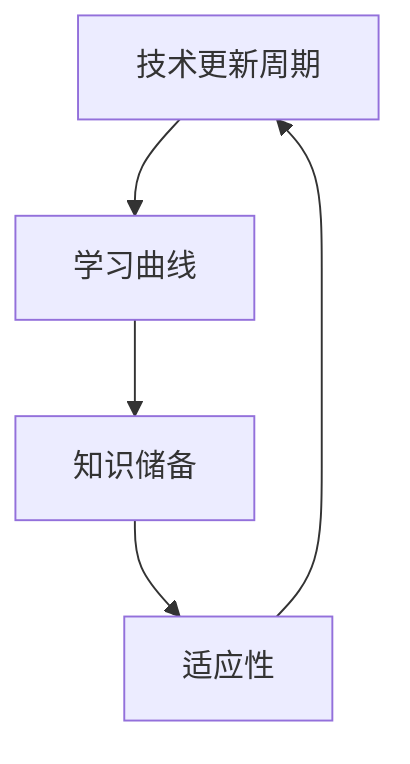

                 

关键词：技术更新，程序员，适应，学习，算法，工具，最佳实践

> 摘要：在快速变化的技术环境中，程序员面临着持续学习和适应新技术的重要挑战。本文旨在探讨程序员如何有效地应对技术更新，从核心算法原理到实际项目实践，提供一系列策略和最佳实践，帮助程序员在技术变革中保持竞争力。

## 1. 背景介绍

随着计算机科学和信息技术领域的飞速发展，新技术、新算法、新工具层出不穷。这给程序员带来了巨大的挑战，同时也提供了前所未有的机遇。技术更新不仅影响软件开发的方法，还改变了整个IT行业的格局。对于程序员而言，能否及时掌握新技术，不仅关系到个人职业发展，也直接影响到项目的成功和团队的效率。

然而，技术更新的速度往往超出大多数程序员的预期，学习成本和压力也随之增加。许多程序员可能会感到困惑，甚至沮丧，不知道如何高效地学习和应用新技术。因此，本文将探讨一系列策略，帮助程序员更好地适应技术更新，提升自身技能和职业竞争力。

## 2. 核心概念与联系

在探讨如何应对技术更新之前，我们需要了解几个核心概念和它们之间的关系。这些概念包括但不限于：

- **技术更新周期**：指的是从新技术的概念提出到广泛应用的时间间隔。
- **学习曲线**：指的是程序员学习新技术的难度和所需的时间。
- **知识储备**：指的是程序员现有的技能和知识体系。
- **适应性**：指的是程序员应对变化的能力。

下图展示了这些概念之间的相互关系：



### 2.1 技术更新周期

技术更新周期是影响程序员学习新技术的关键因素。一个较短的技术更新周期意味着程序员需要更快地适应新技术，而一个较长的更新周期则提供了更多的学习时间。了解技术更新周期的长度和变化趋势对于制定学习计划至关重要。

### 2.2 学习曲线

学习曲线描述了程序员在学习和掌握新技术过程中的难度和所需时间。学习曲线通常呈现为初始阶段陡峭，随后逐渐平缓。理解学习曲线有助于程序员合理安排学习时间和资源，避免过早放弃。

### 2.3 知识储备

知识储备是程序员应对技术更新的基础。一个深厚的知识储备不仅有助于更快地理解和应用新技术，还能为解决复杂问题提供更多思路。因此，不断更新和扩展知识储备是程序员长期发展的关键。

### 2.4 适应性

适应性是指程序员在面临技术更新时的应对能力。高适应性的程序员能够快速学习新技术，灵活应对变化。这种能力通常来自于良好的学习习惯、持续的实践和开放的思维方式。

## 3. 核心算法原理 & 具体操作步骤

### 3.1 算法原理概述

在应对技术更新时，掌握核心算法原理至关重要。算法不仅提高了程序员的逻辑思维能力，还为他们提供了解决问题的工具。以下是一些常见算法原理：

- **排序算法**：如快速排序、归并排序、堆排序等。
- **查找算法**：如二分查找、散列表查找等。
- **图算法**：如深度优先搜索、广度优先搜索、最短路径算法等。

### 3.2 算法步骤详解

以下是快速排序算法的具体步骤：

1. **选择基准**：从数组中选择一个元素作为基准。
2. **分区**：将数组分为两部分，一部分包含小于基准的元素，另一部分包含大于基准的元素。
3. **递归**：对基准两侧的子数组重复上述步骤。

### 3.3 算法优缺点

快速排序是一种高效的排序算法，其平均时间复杂度为 \(O(n\log n)\)。然而，在最坏情况下，其时间复杂度可能降至 \(O(n^2)\)。此外，快速排序的空间复杂度为 \(O(\log n)\)。

### 3.4 算法应用领域

快速排序广泛应用于各种场景，如数据库排序、数据挖掘、文本搜索等。

## 4. 数学模型和公式 & 详细讲解 & 举例说明

在编程中，数学模型和公式不仅是算法设计的基础，也是优化程序性能的关键。以下是一个常见的数学模型：动态规划。

### 4.1 数学模型构建

动态规划是一种将复杂问题分解为更简单子问题的方法。它通常使用递归关系和状态转移方程来构建模型。

### 4.2 公式推导过程

假设我们有一个数组 `dp`，其中 `dp[i]` 表示解决子问题 `i` 的最优解。状态转移方程可以表示为：

$$
dp[i] = \min_{j < i} (dp[j] + C(i, j))
$$

其中，`C(i, j)` 是将子问题 `j` 与子问题 `i` 合并时所需付出的成本。

### 4.3 案例分析与讲解

以最长公共子序列（LCS）为例，我们可以使用动态规划求解。以下是具体步骤：

1. **初始化**：创建一个二维数组 `dp`，初始化所有元素为0。
2. **填表**：遍历字符串 `s1` 和 `s2` 的所有字符，更新 `dp` 数组。
3. **回溯**：从 `dp[m][n]` 开始，回溯找到最长公共子序列。

## 5. 项目实践：代码实例和详细解释说明

在本节中，我们将通过一个简单的项目实践来展示如何应对技术更新。项目是一个基于Web的待办事项应用，使用Vue.js框架和Firebase进行后端服务。

### 5.1 开发环境搭建

- **安装Node.js和npm**：从 [Node.js 官网](https://nodejs.org/) 下载并安装 Node.js，同时安装 npm。
- **安装Vue CLI**：运行 `npm install -g @vue/cli`。
- **创建新项目**：运行 `vue create todo-app`。

### 5.2 源代码详细实现

以下是项目的核心代码：

```vue
<template>
  <div>
    <input v-model="newTodo" @keyup.enter="addTodo" />
    <button @click="addTodo">Add</button>
    <ul>
      <li v-for="(todo, index) in todos" :key="index">
        {{ todo.text }}
        <button @click="removeTodo(index)">Remove</button>
      </li>
    </ul>
  </div>
</template>

<script>
export default {
  data() {
    return {
      newTodo: '',
      todos: []
    };
  },
  methods: {
    addTodo() {
      this.todos.push({ text: this.newTodo });
      this.newTodo = '';
    },
    removeTodo(index) {
      this.todos.splice(index, 1);
    }
  }
};
</script>
```

### 5.3 代码解读与分析

该代码使用 Vue.js 框架创建了一个简单的待办事项应用。核心功能包括添加和删除待办事项。以下是对代码的解读：

- **数据绑定**：使用 `v-model` 绑定输入框和 `newTodo` 数据属性。
- **事件监听**：使用 `@keyup.enter` 和 `@click` 监听用户的输入和点击事件。
- **列表渲染**：使用 `v-for` 渲染待办事项列表。

### 5.4 运行结果展示

运行该项目，用户可以在输入框中输入待办事项，并通过点击按钮将其添加到列表中。同样，用户可以点击待办事项旁的删除按钮来移除它们。

## 6. 实际应用场景

技术更新的实际应用场景广泛，以下是一些常见例子：

- **人工智能与机器学习**：在金融、医疗、交通等多个领域都有广泛应用。
- **云计算与容器化**：如 Docker 和 Kubernetes 在开发、部署和扩展应用方面的应用。
- **区块链技术**：在供应链管理、数字身份验证等领域提供新的解决方案。

## 7. 工具和资源推荐

为了更好地应对技术更新，以下是几款推荐的工具和资源：

- **工具**：
  - Git：版本控制系统，用于代码管理和协作。
  - Jupyter Notebook：交互式开发环境，适用于数据分析和机器学习。
  - Postman：API测试工具，用于开发和测试API。

- **资源**：
  - FreeCodeCamp：免费的编程学习平台。
  - Pluralsight：提供各种技术课程和认证。
  - arXiv：提供最新的学术论文。

## 8. 总结：未来发展趋势与挑战

未来，技术更新将继续加速，程序员需要不断提升自己的技能和知识储备。以下是一些未来发展趋势和挑战：

- **持续学习**：技术更新要求程序员不断学习新技能。
- **技术多样性**：程序员需要掌握多种技术栈。
- **跨领域融合**：如人工智能与生物技术的融合。

## 9. 附录：常见问题与解答

### Q：如何高效学习新技术？

A：制定明确的学习目标，合理规划学习时间，结合实际项目进行实践。

### Q：如何保持学习的动力？

A：设定短期和长期目标，与他人交流学习成果，保持对技术的热情。

### Q：如何应对技术焦虑？

A：认识到技术更新是不可避免的，保持开放的心态，积极面对挑战。

---

作者：禅与计算机程序设计艺术 / Zen and the Art of Computer Programming
----------------------------------------------------------------

以上就是关于“程序员如何应对技术更新”的详细文章。文章涵盖了背景介绍、核心概念、算法原理、数学模型、项目实践、实际应用场景、工具和资源推荐、未来发展趋势与挑战，以及常见问题与解答等多个方面，旨在为程序员提供全面、实用的指导和建议。希望这篇文章能够帮助到您，在应对技术更新的过程中更加从容和高效。

