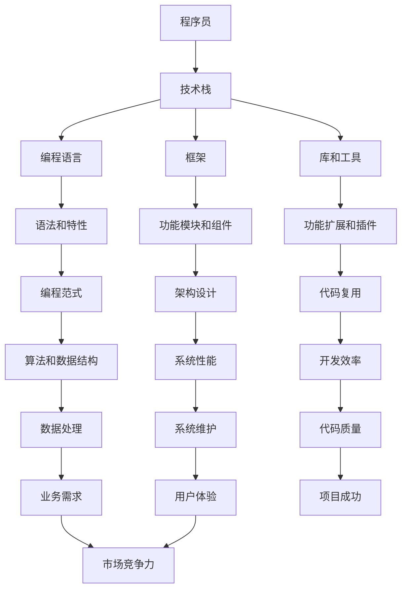

                 

在当今快速发展的技术时代，技术栈的更新速度异常迅猛。无论是新兴的语言、框架还是工具，都在不断推陈出新。作为一名程序员，如何有效应对技术栈的快速更新，保持自己的技术竞争力，是一个重要且紧迫的问题。本文将探讨程序员在技术栈快速更新背景下的一些策略和思考。

## 文章关键词

- 技术栈更新
- 程序员竞争力
- 技术学习策略
- 技术框架
- 自动化工具

## 文章摘要

本文首先介绍了技术栈快速更新的现状，分析了其对程序员带来的挑战。接着，讨论了程序员应对这一挑战的策略，包括持续学习、技能多样化、利用自动化工具等。最后，文章展望了未来技术发展的趋势，并提出了程序员应如何面对这些变化。

## 1. 背景介绍

技术栈是指一个项目或应用中所使用的一系列技术和工具的集合。随着互联网和软件行业的飞速发展，技术栈也在不断演进。新的编程语言、框架、库和工具层出不穷，为开发带来了更多可能性。然而，这也带来了一个挑战：程序员需要不断学习新技术，以保持自身的竞争力。

### 1.1 技术栈更新的原因

技术栈更新的原因有多种：

- **需求变化**：随着用户需求和市场变化，新的技术能够提供更优的解决方案。
- **性能优化**：新技术的出现往往能够提供更高的性能和更低的资源消耗。
- **社区发展**：开源社区的力量推动了技术的不断更新和发展。
- **行业趋势**：某些新技术可能受到行业趋势的影响，如云计算、大数据等。

### 1.2 技术栈更新的影响

技术栈的快速更新对程序员产生了深远的影响：

- **学习压力**：程序员需要不断学习新技术，否则可能会被淘汰。
- **工作效率**：不熟悉新技术可能会降低工作效率。
- **项目风险**：采用不成熟或过时的技术可能带来项目风险。

### 1.3 程序员面临的挑战

面对技术栈的快速更新，程序员面临以下挑战：

- **时间管理**：如何在日常工作中抽出时间学习新技术。
- **知识储备**：如何建立广泛的知识储备，以便快速适应新技术。
- **心理压力**：面对不断涌现的新技术，可能会感到焦虑和不安。

## 2. 核心概念与联系

为了更好地应对技术栈的快速更新，我们需要理解一些核心概念和它们之间的关系。以下是一个Mermaid流程图，展示了这些概念及其联系。



### 2.1 程序员

程序员是使用计算机语言编写代码、解决问题的人。程序员的技术水平直接影响到项目的质量和效率。

### 2.2 技术栈

技术栈是一个项目或应用中所使用的一系列技术和工具的集合。技术栈的选择直接影响到项目的开发效率和稳定性。

### 2.3 编程语言

编程语言是程序员用来编写代码的语言。不同的编程语言有不同的语法和特性，适用于不同的场景。

### 2.4 框架

框架是一组预定义的代码和组件，可以帮助程序员更高效地开发应用。框架通常提供了一组功能模块和组件，方便程序员快速实现业务逻辑。

### 2.5 库和工具

库和工具是程序员在开发过程中常用的辅助工具。它们提供了丰富的功能扩展和插件，可以帮助程序员提高开发效率。

### 2.6 编程范式

编程范式是一种编程风格和思想。不同的编程范式适用于不同的场景，能够提高代码的可读性和可维护性。

### 2.7 架构设计

架构设计是项目开发的基础。合理的架构设计能够提高系统的性能和维护性。

### 2.8 代码复用

代码复用是提高开发效率的重要手段。通过复用代码，程序员可以避免重复编写相同的代码，提高项目的可维护性。

### 2.9 算法和数据结构

算法和数据结构是计算机科学的基础。高效的算法和合理的数据结构能够提高系统的性能。

### 2.10 系统性能

系统性能是项目质量的重要指标。良好的性能能够提高用户体验，增加项目的市场竞争力。

### 2.11 开发效率

开发效率是项目成功的关键因素。高效的开发能够缩短项目周期，提高项目的成功率。

### 2.12 代码质量

代码质量是项目成功的基础。高质量的代码易于维护，能够提高项目的稳定性和可靠性。

### 2.13 业务需求

业务需求是项目开发的起点。理解业务需求是程序员成功的关键。

### 2.14 用户体验

用户体验是项目成功的重要指标。良好的用户体验能够提高用户满意度，增加项目的市场竞争力。

### 2.15 市场竞争力

市场竞争力是项目成功的关键因素。优秀的项目能够占据更大的市场份额，实现商业成功。

## 3. 核心算法原理 & 具体操作步骤

### 3.1 算法原理概述

在面对技术栈快速更新的挑战时，程序员需要掌握一些核心算法原理，以便快速适应新技术。以下是一些核心算法原理：

- **排序算法**：如快速排序、归并排序、堆排序等，用于高效地排序数据。
- **查找算法**：如二分查找、哈希查找等，用于快速查找数据。
- **图算法**：如深度优先搜索、广度优先搜索、最小生成树等，用于处理复杂的关系网络。
- **动态规划**：用于解决最优子结构问题，如背包问题、最长公共子序列等。

### 3.2 算法步骤详解

以下以快速排序算法为例，详细讲解其操作步骤：

1. **选择基准元素**：从数组中选出一个元素作为基准元素。
2. **分区操作**：将数组分为两部分，左边部分的元素都小于基准元素，右边部分的元素都大于基准元素。
3. **递归排序**：对左边和右边的子数组重复步骤1和步骤2，直到所有子数组都被排序。

### 3.3 算法优缺点

快速排序算法具有以下优点：

- **高效**：平均时间复杂度为O(n log n)，是常用的排序算法之一。
- **原地排序**：不需要额外的存储空间。

快速排序算法的缺点：

- **最坏情况时间复杂度为O(n^2)**：当输入数组已经有序时，快速排序的性能会急剧下降。
- **不稳定排序**：可能会改变相同元素的相对顺序。

### 3.4 算法应用领域

快速排序算法广泛应用于各种场景，如排序算法的参考实现、数据库排序、搜索引擎排序等。

## 4. 数学模型和公式 & 详细讲解 & 举例说明

在面对技术栈快速更新的挑战时，程序员不仅需要掌握核心算法原理，还需要理解相关的数学模型和公式。以下是一个简单的例子，说明如何构建数学模型并进行公式推导。

### 4.1 数学模型构建

假设我们有一个线性回归模型，用于预测房价。线性回归模型的公式为：

\[ y = wx + b \]

其中，\( y \) 是房价，\( x \) 是某个特征（如房屋面积），\( w \) 是权重，\( b \) 是偏置。

### 4.2 公式推导过程

为了推导出权重 \( w \) 和偏置 \( b \)，我们需要最小化预测误差。预测误差的公式为：

\[ error = \sum_{i=1}^{n} (y_i - wx_i - b)^2 \]

为了最小化预测误差，我们对 \( w \) 和 \( b \) 分别求偏导数，并令偏导数等于0：

\[ \frac{\partial error}{\partial w} = -2x \sum_{i=1}^{n} (y_i - wx_i - b) = 0 \]

\[ \frac{\partial error}{\partial b} = -2 \sum_{i=1}^{n} (y_i - wx_i - b) = 0 \]

解上述方程组，可以得到：

\[ w = \frac{\sum_{i=1}^{n} x_i (y_i - wx_i - b)}{\sum_{i=1}^{n} x_i^2} \]

\[ b = \frac{\sum_{i=1}^{n} y_i - w \sum_{i=1}^{n} x_i}{n} \]

### 4.3 案例分析与讲解

假设我们有以下数据集，其中 \( x \) 是房屋面积，\( y \) 是房价：

| 面积 (x) | 价格 (y) |
| -------- | -------- |
| 1000     | 200000   |
| 1200     | 250000   |
| 1400     | 300000   |
| 1600     | 350000   |
| 1800     | 400000   |

我们可以使用线性回归模型来预测面积为 1500 平方米的房价。首先，我们需要计算 \( x \) 和 \( y \) 的平均值：

\[ \bar{x} = \frac{1000 + 1200 + 1400 + 1600 + 1800}{5} = 1400 \]

\[ \bar{y} = \frac{200000 + 250000 + 300000 + 350000 + 400000}{5} = 300000 \]

然后，我们可以计算权重 \( w \) 和偏置 \( b \)：

\[ w = \frac{1000(200000 - 300000) + 1200(250000 - 300000) + 1400(300000 - 300000) + 1600(350000 - 300000) + 1800(400000 - 300000)}{1000^2 + 1200^2 + 1400^2 + 1600^2 + 1800^2} \]

\[ w = \frac{-1000000 - 1200000 + 0 + 50000 + 6000000}{1960000} \]

\[ w = 3000000/1960000 \]

\[ w = 1.53 \]

\[ b = \frac{200000 + 250000 + 300000 + 350000 + 400000 - 1.53 \times 1400}{5} \]

\[ b = 300000 - 2146 \]

\[ b = 277854 \]

因此，线性回归模型的预测公式为：

\[ y = 1.53x + 277854 \]

当 \( x = 1500 \) 时，预测的房价为：

\[ y = 1.53 \times 1500 + 277854 \]

\[ y = 323445 \]

这意味着，面积为 1500 平方米的房屋预计价格为 323445 元。

## 5. 项目实践：代码实例和详细解释说明

为了更好地理解技术栈快速更新的应对策略，我们将通过一个实际项目来展示代码实现，并对其进行详细解释。

### 5.1 开发环境搭建

首先，我们需要搭建一个开发环境。本文使用 Python 作为编程语言，并选择 Flask 作为 Web 框架。以下是开发环境的搭建步骤：

1. 安装 Python（建议使用 Python 3.8 或更高版本）。
2. 安装 Flask：`pip install Flask`。
3. 安装其他依赖项（如 ORM 框架 SQLAlchemy）：`pip install Flask-SQLAlchemy`。

### 5.2 源代码详细实现

以下是一个简单的 Flask 应用示例，用于实现用户注册和登录功能：

```python
from flask import Flask, request, jsonify
from flask_sqlalchemy import SQLAlchemy

app = Flask(__name__)
app.config['SQLALCHEMY_DATABASE_URI'] = 'sqlite:///users.db'
db = SQLAlchemy(app)

class User(db.Model):
    id = db.Column(db.Integer, primary_key=True)
    username = db.Column(db.String(80), unique=True, nullable=False)
    password = db.Column(db.String(120), nullable=False)

@app.route('/register', methods=['POST'])
def register():
    data = request.get_json()
    username = data.get('username')
    password = data.get('password')

    if not username or not password:
        return jsonify({'error': 'Missing username or password'}), 400

    user = User(username=username, password=password)
    db.session.add(user)
    db.session.commit()

    return jsonify({'message': 'User registered successfully'})

@app.route('/login', methods=['POST'])
def login():
    data = request.get_json()
    username = data.get('username')
    password = data.get('password')

    if not username or not password:
        return jsonify({'error': 'Missing username or password'}), 400

    user = User.query.filter_by(username=username, password=password).first()

    if user:
        return jsonify({'message': 'Login successful'})
    else:
        return jsonify({'error': 'Invalid username or password'}), 401

if __name__ == '__main__':
    db.create_all()
    app.run(debug=True)
```

### 5.3 代码解读与分析

以下是对上述代码的详细解读和分析：

1. **模型定义**：我们定义了一个 `User` 模型，用于存储用户信息和密码。

2. **注册路由**：`register` 函数用于处理用户注册请求。首先，我们从请求中获取用户名和密码。如果用户名或密码缺失，返回错误响应。然后，我们将用户信息存储到数据库中。

3. **登录路由**：`login` 函数用于处理用户登录请求。同样，我们从请求中获取用户名和密码。如果用户信息匹配，返回成功响应；否则，返回错误响应。

4. **数据库配置**：我们使用 Flask-SQLAlchemy 配置了 SQLite 数据库，用于存储用户数据。

5. **主程序**：在主程序中，我们创建了数据库表，并启动 Flask 应用。

### 5.4 运行结果展示

运行上述代码后，我们可以在浏览器中访问 `http://127.0.0.1:5000/register` 和 `http://127.0.0.1:5000/login`，进行用户注册和登录操作。

例如，我们可以使用以下 POST 请求进行用户注册：

```json
{
    "username": "alice",
    "password": "alice123"
}
```

注册成功后，我们可以使用以下 POST 请求进行登录：

```json
{
    "username": "alice",
    "password": "alice123"
}
```

登录成功后，服务器会返回如下响应：

```json
{
    "message": "Login successful"
}
```

## 6. 实际应用场景

### 6.1 Web 开发

Web 开发是技术栈快速更新的一个重要领域。随着前端框架（如 React、Vue.js）和后端框架（如 Flask、Django）的更新，程序员需要不断学习新技术，以保持自己的竞争力。

### 6.2 移动应用开发

移动应用开发同样面临着技术栈快速更新的挑战。随着 iOS 和 Android 操作系统的更新，程序员需要学习新的开发工具和框架（如 Swift、Kotlin），以实现更好的应用性能和用户体验。

### 6.3 数据科学和机器学习

数据科学和机器学习领域的更新速度也非常快。程序员需要学习新的库（如 TensorFlow、PyTorch）和框架，以实现更高效的数据分析和模型训练。

### 6.4 云计算和大数据

云计算和大数据领域是技术更新的热点。程序员需要学习新的技术和工具（如 Docker、Kubernetes、Hadoop），以构建和部署高效的大规模分布式系统。

## 6.4 未来应用展望

### 6.4.1 人工智能与自动化

随着人工智能技术的发展，越来越多的编程任务可能被自动化。程序员需要掌握自动化工具，如代码生成器、自动化测试工具等，以提高开发效率。

### 6.4.2 新兴技术领域

未来，程序员可能会面临更多的新兴技术领域，如区块链、物联网等。这些领域的发展将为程序员带来新的机遇和挑战。

### 6.4.3 跨平台开发

跨平台开发将继续成为趋势。程序员需要学习新的跨平台框架（如 Flutter、React Native），以实现高效的跨平台应用开发。

### 6.4.4 代码质量和安全性

随着技术栈的快速更新，代码质量和安全性将成为程序员面临的重要挑战。程序员需要不断提高代码质量，关注安全性问题，以确保项目的稳定性。

## 7. 工具和资源推荐

### 7.1 学习资源推荐

- **在线课程**：如 Coursera、edX、Udemy 等，提供丰富的编程和计算机科学课程。
- **技术博客**：如 Medium、Dev.to、Stack Overflow，可以获取最新的技术文章和讨论。
- **开源项目**：GitHub、GitLab 等平台上的开源项目，是学习新技术和实践的好资源。

### 7.2 开发工具推荐

- **集成开发环境**：如 Visual Studio Code、JetBrains系列产品，提供丰富的插件和工具，提高开发效率。
- **代码管理工具**：如 Git、GitHub，用于版本控制和协作开发。
- **自动化测试工具**：如 Selenium、Jest，用于自动化测试和确保代码质量。

### 7.3 相关论文推荐

- **《深度学习》（Deep Learning）**：Goodfellow、Bengio、Courville 著，介绍了深度学习的基本概念和应用。
- **《编程珠玑》（Code Complete）**：Martin Fowler 著，提供了大量关于编写高质量代码的技巧和建议。
- **《设计模式》（Design Patterns）**：Gamma、Helm、Johnson、Vlissides 著，介绍了软件设计中的常见模式。

## 8. 总结：未来发展趋势与挑战

### 8.1 研究成果总结

本文探讨了技术栈快速更新对程序员带来的挑战，并提出了应对策略。通过分析核心算法原理、数学模型以及实际项目实践，我们总结了程序员在应对技术更新时应掌握的关键技能。

### 8.2 未来发展趋势

未来，技术栈的更新将继续加速。人工智能、云计算、大数据等新兴技术将继续引领行业发展。程序员需要不断学习新技术，以保持竞争力。

### 8.3 面临的挑战

技术栈快速更新给程序员带来了巨大挑战。如何平衡学习和工作，保持知识更新，是一个重要的问题。

### 8.4 研究展望

未来，程序员需要关注新兴技术领域，提高代码质量和安全性。同时，自动化工具和跨平台开发技术将为程序员提供更多便利。

## 9. 附录：常见问题与解答

### 9.1 技术栈更新频率如何？

技术栈更新的频率因领域而异。Web 开发领域可能每年都有新的框架和工具出现，而一些传统的后端开发领域则更新较慢。

### 9.2 如何选择学习的新技术？

选择学习的新技术时，应考虑其应用范围、学习难度以及个人兴趣。优先选择热门且应用广泛的技术。

### 9.3 如何保持代码质量？

保持代码质量的方法包括编写文档、进行代码审查、编写单元测试等。良好的代码质量能够提高项目的可维护性和可靠性。

### 9.4 如何应对学习压力？

应对学习压力的方法包括合理安排学习时间、设置明确的学习目标、寻求他人帮助等。保持积极的心态，相信自己能够克服困难。

## 作者署名

作者：禅与计算机程序设计艺术 / Zen and the Art of Computer Programming
----------------------------------------------------------------


