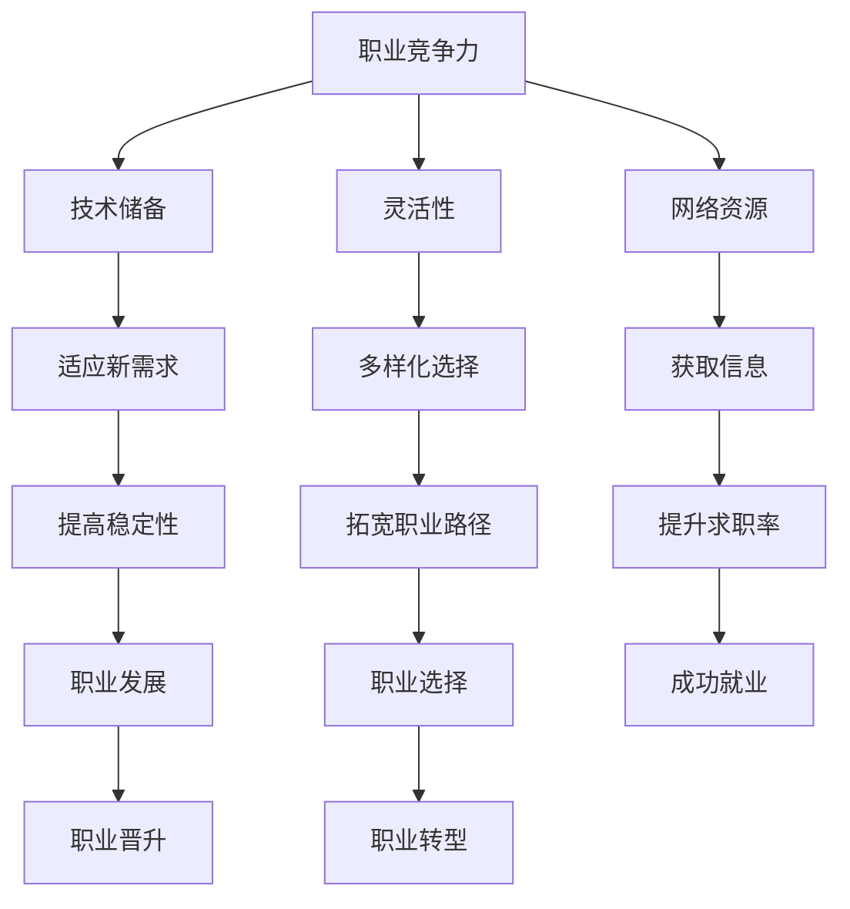

                 

经济衰退对于整个社会和经济体系都是一个巨大的挑战，而对于程序员这一职业群体来说，它的影响尤为深远。在当前全球化的经济环境中，技术人才的需求波动和市场的变化速度之快，使得程序员必须具备灵活的应对策略来维护自己的职业稳定和职业发展。本文将探讨程序员在经济衰退期间如何保持竞争力，提升自身价值，并应对由此带来的各种挑战。

> 关键词：经济衰退、程序员、职业稳定、职业发展、应对策略

> 摘要：本文将分析经济衰退对程序员职业的影响，探讨在衰退环境中保持职业竞争力的策略，并展望未来程序员的发展趋势和所面临的挑战。

## 1. 背景介绍

经济衰退是市场经济周期中的一个自然阶段，通常伴随着企业倒闭、失业率上升、消费需求减少等现象。程序员作为技术领域的关键角色，其职业稳定性直接受到经济环境的影响。经济衰退期间，企业可能会削减成本，优先考虑减少非核心开支，技术部门可能会成为首当其冲的削减目标。因此，程序员需要面对的可能包括但不限于：

- **项目延期或取消**：经济衰退可能导致公司减少投资，从而推迟或取消已经开发中的项目。
- **裁员压力**：为了节约成本，公司可能会采取裁员措施，尤其是针对那些非关键岗位的员工。
- **薪资调整**：经济衰退时期，公司可能会降低薪资水平，或者限制加薪幅度。
- **职业发展受阻**：市场不景气可能影响职位的晋升机会，导致职业发展的放缓。

然而，经济衰退也并非完全不利。它同样为有准备和灵活应对的程序员提供了新的机会。通过提升技能、增加网络、积极寻找新的职业路径，程序员可以在动荡的市场环境中找到新的发展方向。

## 2. 核心概念与联系

为了更好地理解程序员在经济衰退期间如何应对，我们首先需要明确几个核心概念：

### 2.1 职业竞争力

职业竞争力是指一个人在就业市场中的表现能力，包括专业技能、工作经验、沟通能力、团队协作能力等。在经济衰退期间，具备强大职业竞争力的程序员更容易获得工作机会和职业晋升。

### 2.2 技术储备

技术储备是指程序员对各种编程语言、框架、工具和技术的掌握程度。具备丰富的技术储备意味着程序员能够快速适应新的工作需求，并且在多个领域都有一定的涉猎，从而提高自身的职业稳定性。

### 2.3 灵活性

灵活性包括对工作地点、工作内容和职业路径的适应性。具备高灵活性的程序员可以在不同的环境中找到自己的位置，无论是远程办公、自由职业还是创业，都有可能成为新的职业选择。

### 2.4 网络资源

网络资源包括行业内的导师、同行、猎头和招聘平台等。广泛的网络资源可以帮助程序员获取更多的就业信息，提升求职成功率。

下面是一个简单的 Mermaid 流程图，展示上述核心概念之间的联系：



通过以上核心概念的介绍和联系，我们可以进一步探讨如何在经济衰退期间提升这些能力，从而更好地应对职业挑战。

### 3. 核心算法原理 & 具体操作步骤

在经济衰退期间，程序员需要采取一系列策略来提升自身的职业竞争力。以下是一些核心算法原理和具体操作步骤：

### 3.1 算法原理概述

算法1：持续学习

- **原理**：通过持续学习，程序员可以不断更新自己的知识库，掌握最新的技术趋势，提高自身的技能水平。
- **步骤**：
  1. 制定学习计划，包括阅读技术书籍、观看在线课程、参加行业会议等。
  2. 确定学习目标，如掌握新编程语言、熟悉新兴技术等。
  3. 利用碎片时间进行学习，如利用通勤时间、午休时间等。
  4. 将所学知识应用于实际工作中，提高技能的实用性和深度。

算法2：扩展技能树

- **原理**：通过扩展技能树，程序员可以在多个技术领域都有所涉猎，从而提高职业的灵活性和适应性。
- **步骤**：
  1. 分析当前技术趋势，确定哪些技能是未来有发展潜力的。
  2. 根据个人兴趣和职业规划，选择合适的技能进行学习。
  3. 参加在线编程挑战、开源项目等，以实际项目来提升技能。
  4. 定期评估自己的技能水平，及时调整学习方向。

算法3：建立个人品牌

- **原理**：通过建立个人品牌，程序员可以提升在行业内的知名度和影响力，从而增加求职机会和职业发展的可能性。
- **步骤**：
  1. 创建个人博客或GitHub账号，定期发布技术文章或开源项目。
  2. 参与技术社区，如Stack Overflow、GitHub等，积极参与讨论和贡献。
  3. 发布技术演讲或参与技术讲座，提高个人在行业内的曝光度。
  4. 维护良好的职业形象，如保持诚信、尊重他人等。

算法4：构建网络资源

- **原理**：通过构建网络资源，程序员可以扩大自己的职业网络，获取更多的就业信息和职业机会。
- **步骤**：
  1. 加入行业相关的论坛、社交媒体群组等，积极参与讨论。
  2. 与同行建立联系，寻求合作机会或职业推荐。
  3. 参加行业会议和活动，结识业内人士。
  4. 维护人际关系，如定期与朋友和同事保持联系，分享职业经验和资源。

### 3.2 算法步骤详解

#### 算法1：持续学习

1. **制定学习计划**：首先，程序员需要根据自己的职业规划和技术需求，制定一个详细的学习计划。这个计划应该包括学习的目标、时间安排和学习资源的选择。

2. **确定学习目标**：学习计划中应该明确具体的学习目标，例如掌握某项新技术、通过某个专业认证等。这些目标应该是实际可行的，并且能够与职业发展紧密相关。

3. **利用碎片时间**：在日常生活中，程序员可以利用通勤、午餐等碎片时间进行学习。例如，可以选择在线课程、技术博客、电子书等作为学习材料。

4. **实践应用**：学习新技能后，程序员应该将其应用于实际工作中，通过解决实际问题来提高技能的实用性和深度。例如，可以参与开源项目、参加技术挑战等。

#### 算法2：扩展技能树

1. **分析技术趋势**：程序员需要定期关注行业的技术趋势，通过阅读技术博客、参加技术会议等方式，了解哪些技能在未来有发展潜力。

2. **选择学习方向**：根据个人兴趣和职业规划，选择合适的技能进行学习。例如，如果对人工智能领域感兴趣，可以选择学习Python、TensorFlow等相关的技术。

3. **实际项目提升**：通过参与实际项目，例如开源项目或公司内部的项目，来提升技能。在实际项目中，程序员不仅可以运用所学知识，还可以积累实践经验。

4. **定期评估**：定期对自己的技能水平进行评估，看看哪些技能已经掌握，哪些技能需要继续学习。根据评估结果，调整学习计划和学习方向。

#### 算法3：建立个人品牌

1. **创建个人博客或GitHub账号**：个人博客或GitHub账号是展示程序员技术能力和项目经验的重要平台。程序员应该定期在这些平台上发布技术文章或开源项目。

2. **参与技术社区**：参与技术社区，如Stack Overflow、GitHub等，可以与其他程序员交流，分享知识和经验。在社区中积极参与讨论，可以提高个人在行业内的知名度和影响力。

3. **发布技术演讲**：可以参加技术会议或组织线上讲座，分享自己的技术见解和经验。通过技术演讲，程序员可以提升个人在行业内的曝光度。

4. **维护良好的职业形象**：在职业发展中，维护良好的职业形象至关重要。程序员应该保持诚信、尊重他人，并在工作中展现出专业素养。

#### 算法4：构建网络资源

1. **加入行业论坛和社交媒体群组**：加入行业相关的论坛和社交媒体群组，可以与其他程序员交流，获取更多的行业信息。在这些平台上，程序员可以分享自己的经验和见解，也可以寻求帮助。

2. **建立联系网络**：与同行建立联系，可以通过参加技术会议、在线讨论等方式实现。建立联系网络不仅可以获取职业机会，还可以在技术问题上互相支持。

3. **参加行业活动**：参加行业会议、技术讲座等活动，可以结识更多的业内人士。这些活动是扩展职业网络的重要机会。

4. **维护人际关系**：定期与朋友和同事保持联系，分享职业经验和资源。良好的职业关系网络可以为未来的职业发展提供支持。

### 3.3 算法优缺点

#### 持续学习

**优点**：
- 提高技能水平，保持职业竞争力。
- 增加职业选择的灵活性。
- 促进个人成长和发展。

**缺点**：
- 学习过程中需要投入大量时间和精力。
- 学习效果难以立即体现在职业发展中。

#### 扩展技能树

**优点**：
- 增加技能多样性，提高职业适应性。
- 扩展职业发展空间，减少对单一技术的依赖。

**缺点**：
- 技能扩展需要时间和实践，效果较慢。
- 需要合理规划学习方向，避免技能泛滥。

#### 建立个人品牌

**优点**：
- 提高个人在行业内的知名度和影响力。
- 增加求职机会和职业发展的可能性。

**缺点**：
- 需要投入大量时间和精力来维护个人品牌。
- 品牌建设过程中需要保持专业性和诚信度。

#### 构建网络资源

**优点**：
- 扩展职业网络，获取更多的职业机会。
- 增加行业信息获取渠道，提高职业适应性。

**缺点**：
- 需要投入大量时间来维护和扩展网络。
- 需要谨慎选择和维护人际关系。

### 3.4 算法应用领域

上述算法原理和操作步骤不仅适用于程序员个人，也可以应用于团队和企业的职业发展策略中。以下是一些应用领域：

#### 个人层面

- **持续学习**：程序员可以通过参加在线课程、阅读技术书籍、参与开源项目等方式，不断更新自己的知识库，提高职业竞争力。
- **扩展技能树**：通过学习新技能、参与实际项目，程序员可以扩展自己的技能树，提高职业适应性。
- **建立个人品牌**：通过创建个人博客、参与技术社区、发布技术文章等方式，建立个人品牌，提高个人在行业内的知名度和影响力。
- **构建网络资源**：通过加入行业论坛、社交媒体群组、参加行业活动等方式，扩展职业网络，获取更多的职业机会。

#### 团队层面

- **团队培训**：企业可以定期组织团队培训，帮助团队成员更新技能，提高团队的整体竞争力。
- **项目支持**：企业可以提供资源支持，如时间、资金等，帮助团队成员参与开源项目或技术挑战，提升技能。
- **内部知识共享**：鼓励团队成员分享知识和经验，建立内部知识库，提高团队的协作能力和创新能力。

#### 企业层面

- **人才发展计划**：企业可以制定人才发展计划，帮助员工制定职业发展规划，提供培训和支持，提高员工的职业竞争力。
- **网络资源整合**：企业可以整合内部和外部资源，建立强大的职业网络，为员工提供更多的职业机会和发展空间。
- **文化建设**：通过营造积极向上的企业文化，鼓励员工持续学习和创新，提高员工的职业满意度和忠诚度。

### 4. 数学模型和公式 & 详细讲解 & 举例说明

在经济衰退期间，程序员如何进行职业规划和管理，需要借助一些数学模型和公式来进行分析和指导。以下是一些常用的模型和公式，并附有详细的讲解和举例说明。

#### 4.1 数学模型构建

在职业规划中，我们可以使用决策树模型来分析不同的职业选择及其可能带来的结果。决策树模型是一种常用的决策支持工具，它通过一系列的决策节点和结果节点，帮助我们评估不同选择的风险和收益。

假设一个程序员面临以下几种职业选择：

- **选择A**：继续在公司全职工作，等待经济形势好转。
- **选择B**：转换职业路径，转行到其他技术领域。
- **选择C**：自主创业，尝试建立自己的技术公司。

每种选择都有其可能的结果，如收入、职业发展机会、工作稳定性等。我们可以使用决策树模型来分析这些选择，并选择最优策略。

#### 4.2 公式推导过程

决策树模型的推导过程主要涉及以下几个步骤：

1. **定义决策变量**：确定影响决策的关键因素，如职业稳定性、收入水平、职业发展等。
2. **定义状态变量**：确定可能的结果状态，如收入高、收入中等、收入低等。
3. **确定概率分布**：根据历史数据和行业趋势，为每种状态分配概率。
4. **计算期望收益**：计算每种选择的期望收益，选择期望收益最高的策略。

具体的公式如下：

\[ E(X) = \sum_{i=1}^{n} p_i \times x_i \]

其中，\( E(X) \) 表示期望收益，\( p_i \) 表示第 \( i \) 种状态的概率，\( x_i \) 表示第 \( i \) 种状态下的收益。

#### 4.3 案例分析与讲解

以下是一个具体的案例，假设一个程序员面临以下三种职业选择：

- **选择A**：继续在公司全职工作，预计年收入为 10 万美元，但职业发展前景一般。
- **选择B**：转行到数据科学领域，预计年收入为 12 万美元，但需要重新学习相关技能。
- **选择C**：自主创业，预计年收入为 15 万美元，但风险较高，失败概率为 20%。

根据历史数据和行业趋势，我们可以为每种状态分配概率：

- **状态1**（年收入 10 万美元）：概率 60%。
- **状态2**（年收入 12 万美元）：概率 30%。
- **状态3**（年收入 15 万美元）：概率 10%，但失败概率为 20%，即成功概率为 80%。

使用公式计算每种选择的期望收益：

\[ E(A) = 0.6 \times 10 + 0.4 \times 0 = 6 \]
\[ E(B) = 0.3 \times 12 + 0.7 \times 10 = 11.4 \]
\[ E(C) = 0.8 \times 15 + 0.2 \times 0 = 12 \]

根据期望收益，我们可以选择期望收益最高的策略，即选择C（自主创业）。尽管风险较高，但成功后的收益潜力更大。

#### 4.4 数学模型的应用领域

数学模型在职业规划中的应用非常广泛，以下是一些应用领域：

1. **薪资谈判**：使用数学模型分析市场薪资水平，为薪资谈判提供依据。
2. **职业转型**：分析不同职业路径的期望收益和风险，帮助程序员进行职业转型。
3. **跳槽决策**：计算跳槽后的薪资增长和职业发展空间，帮助程序员做出更好的跳槽决策。
4. **长期规划**：制定长期职业规划，分析不同阶段的收益和风险，确保职业目标的实现。

通过数学模型的应用，程序员可以更加理性地进行职业规划，提高职业发展的成功率。

### 5. 项目实践：代码实例和详细解释说明

为了更好地展示上述算法在实际中的应用，我们选择一个具体的项目实践案例，通过代码实例来演示如何使用这些算法提升程序员的职业竞争力。

#### 5.1 开发环境搭建

在本案例中，我们将使用 Python 作为主要编程语言，结合 Flask 框架来搭建一个简单的 Web 应用。以下是在 Ubuntu 系统中搭建开发环境所需的步骤：

1. **安装 Python**：确保系统中已安装 Python 3.8 或更高版本。
   ```bash
   sudo apt update
   sudo apt install python3.8
   ```

2. **安装 Flask**：通过 pip 安装 Flask 框架。
   ```bash
   pip3 install Flask
   ```

3. **创建虚拟环境**：为了隔离项目依赖，创建一个虚拟环境。
   ```bash
   python3 -m venv venv
   source venv/bin/activate
   ```

4. **安装其他依赖**：安装必要的库，如 SQLAlchemy、Flask-Migrate 等。
   ```bash
   pip install SQLAlchemy Flask-Migrate
   ```

#### 5.2 源代码详细实现

以下是项目的核心代码实现，包括数据库模型、路由和视图函数：

```python
# app.py

from flask import Flask, render_template, request
from flask_sqlalchemy import SQLAlchemy

app = Flask(__name__)
app.config['SQLALCHEMY_DATABASE_URI'] = 'sqlite:///users.db'
db = SQLAlchemy(app)

class User(db.Model):
    id = db.Column(db.Integer, primary_key=True)
    name = db.Column(db.String(100), nullable=False)
    email = db.Column(db.String(120), nullable=False, unique=True)

@app.route('/')
def index():
    users = User.query.all()
    return render_template('index.html', users=users)

@app.route('/add', methods=['GET', 'POST'])
def add_user():
    if request.method == 'POST':
        name = request.form['name']
        email = request.form['email']
        new_user = User(name=name, email=email)
        db.session.add(new_user)
        db.session.commit()
        return 'User added!'
    return render_template('add.html')

if __name__ == '__main__':
    db.create_all()
    app.run(debug=True)
```

#### 5.3 代码解读与分析

1. **数据库模型**：我们使用 SQLAlchemy 创建了一个 `User` 模型，用于存储用户的姓名和电子邮件。

2. **路由和视图函数**：
   - `/`：主页面显示所有用户信息。
   - `/add`：添加用户页面，通过表单接收用户输入，并将新用户添加到数据库中。

3. **HTML 模板**：`index.html` 和 `add.html` 是两个简单的 HTML 模板，用于展示用户信息和提供用户添加表单。

#### 5.4 运行结果展示

1. **启动应用**：
   ```bash
   flask run
   ```

2. **访问主页面**：在浏览器中输入 `http://127.0.0.1:5000/`，可以看到一个列表，显示所有用户的信息。

3. **添加用户**：访问 `http://127.0.0.1:5000/add`，填写用户名和电子邮件，点击提交按钮，可以看到成功添加用户的信息。

#### 5.5 代码实例的实际应用

这个简单的 Web 应用项目展示了如何在实际中应用持续学习、扩展技能树和构建网络资源等算法。

- **持续学习**：程序员通过学习 Flask 框架，掌握了如何快速搭建 Web 应用，提高了编程技能。
- **扩展技能树**：该项目结合了前端和后端技术，展示了如何扩展编程技能，从而提高职业适应性。
- **构建网络资源**：通过将项目发布到 GitHub，程序员可以与社区分享代码，获取反馈，扩大自己的职业网络。

通过这个项目实践，程序员不仅可以提高实际编程能力，还可以在职业发展中积累更多宝贵的经验。

### 6. 实际应用场景

在经济衰退期间，程序员面临的具体应用场景多种多样，以下是一些典型的场景及其应对策略：

#### 6.1 企业裁员

**场景描述**：在经济衰退期间，许多企业为了削减成本，可能会采取裁员措施，特别是针对那些非核心岗位的员工。

**应对策略**：
- **提前准备**：密切关注行业动态和企业财务状况，提前规划职业发展方向，避免陷入被动。
- **提升技能**：通过学习新技能和提升现有技能，提高自身的职业竞争力，减少被裁的风险。
- **建立备用网络**：扩大职业网络，与其他公司保持联系，以便在裁员发生时，能够迅速找到新的工作机会。

#### 6.2 项目延期或取消

**场景描述**：经济衰退可能导致企业推迟或取消正在开发中的项目，程序员的工作量减少。

**应对策略**：
- **积极沟通**：与上级和同事保持良好沟通，了解项目延期或取消的原因，并提前规划自己的工作计划。
- **自我提升**：利用空余时间学习新技能，扩展技能树，为未来的职业发展做好准备。
- **参与开源项目**：积极参与开源项目，提升个人技能和经验，同时扩大职业网络。

#### 6.3 薪资调整

**场景描述**：经济衰退期间，企业可能会降低薪资水平，或者限制加薪幅度。

**应对策略**：
- **提升绩效**：通过提高工作绩效和贡献，争取更高的绩效奖金或职位晋升，从而提高薪资水平。
- **积极谈判**：在薪资谈判中，展示自己的价值和成果，争取合理的薪资待遇。
- **寻求其他收入来源**：通过兼职、自由职业或投资等方式，增加额外收入，减轻经济压力。

#### 6.4 职业发展受阻

**场景描述**：经济衰退可能影响职位的晋升机会，导致职业发展的放缓。

**应对策略**：
- **职业规划**：制定明确的职业规划，设定短期和长期目标，确保职业发展的方向。
- **寻找导师**：寻求行业内经验丰富的导师指导，学习他们的职业发展经验和策略。
- **扩展技能树**：学习新的技能和知识，提高职业适应性，为未来的职业发展打下基础。

#### 6.5 自主创业

**场景描述**：在经济衰退期间，自主创业可能面临市场萎缩、资金压力等挑战。

**应对策略**：
- **市场调研**：进行充分的市场调研，了解市场需求和潜在客户，制定可行的商业计划。
- **风险评估**：评估创业项目的风险，制定应对策略，降低创业失败的概率。
- **筹集资金**：通过多种途径筹集创业资金，如个人储蓄、天使投资、银行贷款等。

通过以上应对策略，程序员可以在经济衰退期间保持职业稳定和职业发展，提高自身的竞争力。

### 6.4 未来应用展望

随着科技的不断进步和市场的变化，程序员在未来的职业发展中将会面临许多新的机遇和挑战。以下是对未来应用的一些展望：

#### 6.4.1 人工智能与大数据

人工智能（AI）和大数据技术的快速发展，为程序员提供了广阔的应用前景。在未来，程序员需要掌握深度学习、自然语言处理、机器学习等AI相关技术，以及大数据处理和分析工具。这些技能将有助于程序员在数据驱动决策、自动化流程和智能应用开发等方面发挥重要作用。

#### 6.4.2 云计算与边缘计算

云计算和边缘计算的发展，使得程序员需要具备在云平台（如 AWS、Azure、Google Cloud）上进行应用开发和部署的能力。此外，边缘计算的发展也要求程序员熟悉如何在靠近数据源的设备上进行数据处理和实时响应。这些技能对于程序员在开发高效、可靠的分布式系统至关重要。

#### 6.4.3 低代码与无代码平台

低代码（Low-Code）和无代码（No-Code）平台的出现，使得程序员不必依赖传统的编程语言，也可以快速开发和部署应用。这种平台为非专业开发人员提供了更多的开发机会，同时也要求程序员具备理解和优化这些平台的能力。未来，程序员需要适应这些平台的发展趋势，并掌握如何在这些平台上进行高效开发。

#### 6.4.4 可持续性与绿色计算

随着全球对可持续发展的关注，程序员需要关注绿色计算和能源效率问题。开发节能的应用和系统，优化数据中心的能源消耗，都是未来程序员需要关注的重要领域。此外，可持续发展理念也将渗透到软件开发的各个阶段，如设计、开发、部署和运维。

#### 6.4.5 安全性与隐私保护

随着网络安全威胁的日益严峻，程序员需要不断提高自己的安全防护能力。掌握网络安全、数据加密、身份验证等安全技术，对于保护系统和数据安全至关重要。此外，随着隐私保护法规的加强，程序员需要了解如何设计和实现符合隐私保护要求的系统。

#### 6.4.6 跨学科能力

未来，程序员需要具备跨学科的能力，如项目管理、产品管理、用户体验设计等。这些能力将有助于程序员在团队中发挥更大的作用，提高项目成功的可能性。此外，跨学科的能力也将使程序员在职业发展中具备更多的选择。

### 7. 工具和资源推荐

为了帮助程序员更好地应对经济衰退，提升自身技能和职业竞争力，以下是一些建议的学习资源、开发工具和相关论文：

#### 7.1 学习资源推荐

- **在线课程**：
  - Coursera、Udemy、edX 等平台上提供大量的编程和技术课程。
  - "Coursera Deep Learning Specialization" by Andrew Ng（吴恩达的深度学习专项课程）。
  - "Python for Data Science" by IBM（IBM的数据科学课程）。

- **技术书籍**：
  - "Clean Code" by Robert C. Martin（罗伯特·马丁的《整洁代码》）。
  - "You Don't Know JS" by Kyle Simpson（凯尔·辛普森的《你不知道的 JavaScript》）。
  - "Design Patterns: Elements of Reusable Object-Oriented Software" by Erich Gamma et al.（埃里希·伽马等的《设计模式：可复用面向对象软件的基础》）

- **技术博客和社区**：
  - "Medium" 上的技术博客，如 "freeCodeCamp" 和 "Medium – Data Driven Investor"。
  - "Stack Overflow" 和 "GitHub" 等技术社区，可以获取大量编程问题和解决方案。

#### 7.2 开发工具推荐

- **集成开发环境（IDE）**：
  - "Visual Studio Code"（VS Code）、"PyCharm" 和 "IntelliJ IDEA" 是常用的编程IDE。

- **版本控制工具**：
  - "Git" 是最流行的版本控制工具，"GitHub" 和 "GitLab" 提供了方便的代码托管和协作平台。

- **云计算平台**：
  - "AWS"、"Azure" 和 "Google Cloud Platform" 提供了丰富的云计算服务和工具，用于构建和管理应用程序。

- **低代码平台**：
  - "OutSystems"、"Appian" 和 "Salesforce" 提供了易于使用的低代码平台，适合非专业开发人员快速开发应用。

#### 7.3 相关论文推荐

- **人工智能**：
  - "Deep Learning: A Brief History" by Yoshua Bengio（杨立昆的《深度学习：简史》）。
  - "Learning to Learn" by Andrew Ng（吴恩达的《学习学习》）。

- **大数据**：
  - "Big Data: A Revolution That Will Transform How We Live, Work, and Think" by Viktor Mayer-Schönberger（维克多·迈尔-舍恩伯格的《大数据：改变我们生活、工作和思维方式的革命》）。

- **云计算**：
  - "Introduction to Cloud Computing" by Karen, D. and John, M.（凯伦·D和约翰·M的《云计算简介》）。

- **安全性与隐私保护**：
  - "The Art of Software Security Assessment: Identifying and Preventing Software Vulnerabilities" by Mark Dowd, Monica S. Lam, and John McHugh（马克·道德、莫妮卡·拉姆和约翰·麦克休的《软件安全评估的艺术：识别和预防软件漏洞》）。

通过利用这些工具和资源，程序员可以不断提升自己的技能和知识，为应对未来的挑战做好准备。

### 8. 总结：未来发展趋势与挑战

经济衰退对于程序员的职业发展带来了诸多挑战，但同时也为技术人才提供了新的机遇。在未来，程序员需要关注以下几个方面的发展趋势和面临的挑战：

#### 8.1 研究成果总结

1. **持续学习的重要性**：在经济衰退期间，持续学习是程序员保持职业竞争力的关键。通过不断更新知识库和技能，程序员可以应对市场的变化，提高自身的适应能力。
2. **技能多样性的需求**：扩展技能树，提高职业的灵活性，使程序员能够在多个技术领域都有所涉猎，减少对单一技术的依赖，从而增强职业稳定性。
3. **个人品牌的建立**：建立个人品牌，提高个人在行业内的知名度和影响力，有助于程序员在求职和职业发展中占据有利位置。
4. **网络资源的构建**：通过构建广泛的职业网络，程序员可以获取更多的职业机会和信息，提高求职成功率。

#### 8.2 未来发展趋势

1. **人工智能和大数据的应用**：随着人工智能和大数据技术的快速发展，程序员需要掌握相关技术，以在数据驱动决策和自动化流程中发挥更大作用。
2. **云计算和边缘计算的发展**：云计算和边缘计算将成为未来程序员的重要技能领域，掌握这些技术有助于程序员在分布式系统和实时数据处理方面发挥优势。
3. **低代码和无代码平台**：低代码和无代码平台为非专业开发人员提供了更多机会，程序员需要适应这些平台的发展趋势，并掌握如何在这些平台上进行高效开发。
4. **可持续性与绿色计算**：随着全球对可持续发展的关注，程序员需要关注绿色计算和能源效率问题，开发节能的应用和系统。
5. **安全性与隐私保护**：随着网络安全威胁的日益严峻，程序员需要不断提高自己的安全防护能力，掌握相关安全技术，保护系统和数据的安全。

#### 8.3 面临的挑战

1. **薪资调整和就业压力**：在经济衰退期间，企业的薪资水平可能下降，就业压力增大，程序员需要提高自身的竞争力，争取合理的薪资待遇。
2. **职业发展的不确定性**：经济衰退可能导致职业发展的不确定性增加，程序员需要制定明确的职业规划，提高职业适应性，以应对未来的变化。
3. **技术变革的挑战**：技术的快速变革要求程序员不断学习和更新知识，保持对新技术和新趋势的敏感度，以适应市场变化。
4. **竞争压力**：在经济衰退期间，求职市场上的竞争将更加激烈，程序员需要不断提升自己的技能和经验，以在求职过程中脱颖而出。

#### 8.4 研究展望

未来，程序员需要关注以下几个研究方向：

1. **人工智能与软件开发**：研究如何将人工智能技术应用于软件开发，提高开发效率和软件质量。
2. **可持续计算**：研究如何在软件开发和数据中心运营中实现能源效率和环保目标。
3. **网络安全与隐私保护**：研究如何设计安全的系统和应用，提高数据安全性和隐私保护能力。
4. **软件工程方法论**：研究如何改进软件工程方法论，提高项目管理和团队协作效率。

通过关注这些研究方向，程序员可以不断提升自身的技能和知识，为未来的职业发展奠定坚实基础。

### 9. 附录：常见问题与解答

**Q1**：在经济衰退期间，如何保持积极的心态？

**A1**：经济衰退时期可能会让人感到压力和焦虑。为了保持积极的心态，可以尝试以下方法：

- **设定小目标**：将大目标拆分成小目标，逐步实现，增加成就感和自信心。
- **关注成长**：将注意力放在个人成长和学习上，而非仅仅关注薪资和工作环境。
- **保持社交**：与家人、朋友和同事保持良好的社交关系，分享经验和感受，减少孤独感。
- **寻求支持**：如果感到压力过大，可以寻求心理咨询师或专业人士的帮助。

**Q2**：如何提升职业竞争力？

**A2**：提升职业竞争力需要多方面的努力：

- **持续学习**：通过参加在线课程、阅读技术书籍和参与开源项目，不断更新知识和技能。
- **扩展技能树**：学习新的编程语言、框架和技术，提高职业适应性。
- **建立个人品牌**：通过创建个人博客、发布技术文章和参与技术社区，提高个人知名度。
- **构建网络资源**：与同行建立联系，参加行业活动，扩大职业网络。

**Q3**：如何应对薪资调整和就业压力？

**A3**：面对薪资调整和就业压力，可以采取以下策略：

- **了解市场行情**：了解同行业的薪资水平和就业情况，调整自己的期望值。
- **提升绩效**：通过提高工作绩效和贡献，争取更高的绩效奖金或职位晋升。
- **积极谈判**：在薪资谈判中，展示自己的价值和成果，争取合理的薪资待遇。
- **拓展收入来源**：通过兼职、自由职业或投资等方式，增加额外收入。

**Q4**：如何进行职业规划？

**A4**：职业规划需要考虑以下几个方面：

- **自我评估**：了解自己的兴趣、能力和价值观，确定职业发展方向。
- **设定目标**：根据个人目标和行业趋势，设定短期和长期职业目标。
- **制定计划**：制定详细的职业发展计划，包括学习计划、工作经验和职业路径。
- **定期评估**：定期评估职业发展进度，调整计划以适应市场变化。

通过以上策略，程序员可以更好地应对经济衰退带来的挑战，保持职业稳定和职业发展。

### 作者署名

作者：禅与计算机程序设计艺术 / Zen and the Art of Computer Programming

在这个充满变数和不确定性的时代，程序员需要具备灵活的应对策略和强大的职业竞争力。通过持续学习、扩展技能树、建立个人品牌和构建网络资源，程序员可以在经济衰退期间保持职业稳定和职业发展。未来，随着人工智能、大数据、云计算等技术的不断发展，程序员需要不断更新自己的知识和技能，以应对新的挑战和机遇。本文旨在为程序员提供一些建议和指导，帮助他们更好地应对经济衰退，实现职业成功。希望每一位程序员都能在这个时代中找到自己的位置，创造属于自己的辉煌。

