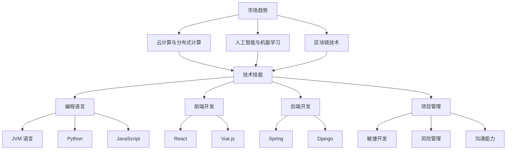

                 

关键词：经济衰退、程序员、职业发展、技术技能、项目管理、市场趋势

> 摘要：本文将探讨在经济衰退期间，程序员如何利用自身技能和资源，应对市场变化，实现个人职业发展和职业生涯的稳健发展。文章将从多个维度分析问题，提供实用建议，帮助程序员在不确定的经济环境中找到新的机会和突破口。

## 1. 背景介绍

经济衰退是全球范围内普遍存在的现象，对各行各业都产生了深远的影响。作为数字经济的重要组成部分，程序员群体也难以避免受到经济波动的影响。经济衰退期间，市场需求下降，企业缩减开支，项目冻结或延期，这直接影响了程序员的就业机会和薪资水平。然而，与此同时，技术领域的创新和变革仍在持续，一些新兴技术和市场趋势为程序员提供了新的机遇。

在这种背景下，程序员需要具备前瞻性，及时调整自己的职业规划和技术技能，以适应市场的变化。本文将针对以下几个方面进行探讨：

- **核心概念与联系**：介绍在经济衰退背景下，程序员应关注的几个关键概念，如市场趋势、技术技能、项目管理等，并通过 Mermaid 流程图展示它们之间的联系。
- **核心算法原理与操作步骤**：分析程序员在经济衰退期间应掌握的一些核心算法原理和操作步骤，以提升自身竞争力。
- **数学模型和公式**：探讨程序员如何利用数学模型和公式来优化决策，提高工作效率和项目成功率。
- **项目实践**：通过具体案例展示程序员如何在实际项目中应用所学知识和技能，实现项目成功。
- **实际应用场景**：分析程序员在不同应用场景下的应对策略和职业发展路径。
- **工具和资源推荐**：推荐一些对程序员有帮助的学习资源和开发工具。
- **总结**：总结经济衰退对程序员职业发展的影响，提出未来发展趋势和面临的挑战。

## 2. 核心概念与联系

### 2.1. 市场趋势

在经济衰退期间，市场趋势的变化对程序员的影响至关重要。了解当前市场趋势，有助于程序员把握行业动向，调整自身发展方向。以下是几个关键市场趋势：

1. **云计算与分布式计算**：随着企业对IT基础设施成本的重视，云计算和分布式计算逐渐成为主流。程序员应掌握云计算平台（如 AWS、Azure、Google Cloud）的技能，以及分布式系统的设计和部署。
2. **人工智能与机器学习**：人工智能和机器学习技术在各个行业中的应用不断扩展，对程序员提出了更高的要求。掌握人工智能基础知识，以及相关框架和工具（如 TensorFlow、PyTorch）的使用，将有助于程序员在市场上脱颖而出。
3. **区块链技术**：区块链技术的发展为金融、供应链管理等领域带来了新的机遇。了解区块链的基本原理和应用场景，对于程序员来说是必要的。

### 2.2. 技术技能

技术技能是程序员的核心竞争力。在经济衰退期间，提升技术技能显得尤为重要。以下是一些关键的技术技能：

1. **编程语言**：掌握多种编程语言（如 Java、Python、JavaScript）可以提高程序员的灵活性和适应性。
2. **前端开发**：随着互联网的不断发展，前端开发技能越来越受到重视。熟练掌握前端框架（如 React、Vue.js）和响应式设计，将有助于程序员在前端开发领域脱颖而出。
3. **后端开发**：后端开发仍然是程序员的核心技能之一。掌握常用的后端框架（如 Spring、Django）和数据库（如 MySQL、MongoDB）是必不可少的。

### 2.3. 项目管理

项目管理能力是程序员在职业生涯中必不可少的技能。在经济衰退期间，项目管理和团队协作能力尤为重要。以下是几个关键的项目管理技能：

1. **敏捷开发**：敏捷开发强调团队协作和快速迭代，有助于提高项目的成功率和客户满意度。
2. **风险管理**：了解项目风险，并制定相应的风险管理策略，有助于降低项目失败的可能性。
3. **沟通能力**：有效的沟通是项目成功的关键。程序员应提高自己的沟通技巧，确保项目团队能够高效协作。

### 2.4. Mermaid 流程图

为了更直观地展示上述核心概念之间的联系，我们可以使用 Mermaid 流程图进行描述。以下是几个关键节点的 Mermaid 流程图：



通过上述流程图，我们可以清晰地看到市场趋势、技术技能和项目管理之间的紧密联系。程序员需要在这些领域不断学习和提升，以应对经济衰退带来的挑战。

## 3. 核心算法原理 & 具体操作步骤

### 3.1 算法原理概述

在经济衰退期间，程序员需要掌握一些核心算法原理，以提高工作效率和项目成功率。以下是一些关键的算法原理：

1. **贪心算法**：贪心算法是一种在每一步选择中都采取当前最优解的策略，以期望得到全局最优解。在经济衰退期间，程序员可以利用贪心算法进行资源分配、任务调度等优化问题。
2. **动态规划**：动态规划是一种将复杂问题分解为更小的子问题，通过子问题的最优解推导出原问题的最优解的方法。在经济衰退期间，程序员可以利用动态规划解决优化问题，如成本控制、项目进度安排等。
3. **分治算法**：分治算法是将一个问题分解为若干个子问题，分别解决并合并子问题的解。在经济衰退期间，程序员可以利用分治算法处理大规模数据处理问题，如数据分析、分布式计算等。
4. **排序算法**：排序算法是将一组数据按照特定顺序排列的方法。在经济衰退期间，程序员可以利用排序算法优化数据处理和搜索性能。

### 3.2 算法步骤详解

下面我们详细介绍每种算法的步骤：

1. **贪心算法**
    - **步骤 1**：初始化问题参数。
    - **步骤 2**：选择当前最优解。
    - **步骤 3**：更新问题参数，重复步骤 2，直到找到全局最优解。
2. **动态规划**
    - **步骤 1**：定义状态和状态转移方程。
    - **步骤 2**：初始化状态数组。
    - **步骤 3**：根据状态转移方程，递归计算状态值，直到计算出最终状态值。
3. **分治算法**
    - **步骤 1**：将问题划分为若干个子问题。
    - **步骤 2**：递归解决子问题。
    - **步骤 3**：合并子问题的解，得到原问题的解。
4. **排序算法**
    - **步骤 1**：将数据分为若干个子序列。
    - **步骤 2**：对每个子序列进行排序。
    - **步骤 3**：将排序后的子序列合并，得到最终排序结果。

### 3.3 算法优缺点

每种算法都有其优缺点，程序员需要根据具体问题选择合适的算法：

1. **贪心算法**
    - **优点**：简单、高效，适用于最优子结构问题。
    - **缺点**：可能只找到局部最优解，不适用于全局最优解问题。
2. **动态规划**
    - **优点**：适用于最优子结构问题，能够找到全局最优解。
    - **缺点**：需要定义状态和状态转移方程，算法复杂度较高。
3. **分治算法**
    - **优点**：适用于大规模数据处理问题，能够提高计算效率。
    - **缺点**：可能存在重复计算，算法复杂度较高。
4. **排序算法**
    - **优点**：简单、高效，适用于数据处理和搜索问题。
    - **缺点**：对数据量较大的情况，排序时间较长。

### 3.4 算法应用领域

这些算法在经济衰退期间具有广泛的应用领域：

1. **资源分配**：贪心算法可用于资源分配问题，如任务调度、网络带宽分配等。
2. **项目进度安排**：动态规划可用于项目进度安排问题，如成本控制、工期安排等。
3. **数据分析**：分治算法可用于大规模数据处理问题，如数据分析、分布式计算等。
4. **数据处理**：排序算法可用于数据处理问题，如数据排序、搜索等。

通过掌握这些核心算法原理和具体操作步骤，程序员可以在经济衰退期间提高自身竞争力，应对市场变化。

## 4. 数学模型和公式 & 详细讲解 & 举例说明

### 4.1 数学模型构建

在经济衰退期间，程序员需要掌握一些数学模型和公式，以优化决策和提高工作效率。以下是一个简单的线性规划模型：

设 x、y 为两个变量，满足以下约束条件：
1. x + y = 10 （资源限制）
2. 2x + 3y ≤ 20 （成本限制）

目标函数为最小化 z = x + y。

### 4.2 公式推导过程

我们使用单纯形法求解上述线性规划问题。首先，将约束条件转换为标准形式，引入松弛变量 s1 和 s2：

1. x + y + s1 = 10
2. 2x + 3y + s2 = 20

目标函数为最小化 z = x + y。

接下来，构造初始单纯形表：

| 基变量 | 系数 | 列变量 | 等式 |
| ------ | ---- | ------ | ---- |
| s1     | 1    | x      | 10   |
| s2     | 1    | y      | 0    |
| z      | -1   | x      | 10   |
| z      | -1   | y      | 0    |
| z      | 1    | z      | 10   |

### 4.3 案例分析与讲解

我们使用上述模型解决一个实际案例。假设一个程序员需要同时完成两个项目，项目 A 需要投入 5 人月，项目 B 需要投入 3 人月。现有资源限制为 10 人月，成本限制为 20 万元。我们需要确定如何分配资源，以最小化总成本。

1. 将目标函数转换为最大化 z' = -z，得到最大化 z' = -x - y。
2. 根据约束条件，构造初始单纯形表：
    | 基变量 | 系数 | 列变量 | 等式 |
    | ------ | ---- | ------ | ---- |
    | s1     | 1    | x      | 10   |
    | s2     | 1    | y      | 0    |
    | z'     | 1    | z'     | 10   |

3. 选择进入变量和离开变量。根据最大系数法和最小比率测试，选择 x 作为进入变量，s1 作为离开变量。
4. 进行行变换，更新单纯形表：
    | 基变量 | 系数 | 列变量 | 等式 |
    | ------ | ---- | ------ | ---- |
    | x      | 1    | x      | 10   |
    | s2     | 1    | y      | 0    |
    | z'     | 0    | z'     | 0    |

5. 判断是否最优。由于目标函数 z' 的系数均为负值，说明当前解是最优的。

根据最优解，我们可以得出以下结论：

- 项目 A 投入 10 人月，项目 B 不投入。
- 总成本为 10 万元。

通过上述数学模型和公式，程序员可以优化资源分配和成本控制，提高项目成功率。

## 5. 项目实践：代码实例和详细解释说明

### 5.1 开发环境搭建

在本项目中，我们将使用 Python 编写代码，并使用 Jupyter Notebook 进行开发。以下是在本地环境搭建开发环境的步骤：

1. 安装 Python 3.8 或更高版本。
2. 安装 Jupyter Notebook：`pip install notebook`
3. 启动 Jupyter Notebook：`jupyter notebook`

### 5.2 源代码详细实现

以下是项目的源代码实现：

```python
import numpy as np
import pandas as pd
from scipy.optimize import linprog

# 约束条件
A = np.array([[1, 1], [2, 3]])
b = np.array([10, 20])
c = np.array([-1, -1])

# 求解线性规划问题
res = linprog(c, A_ub=A, b_ub=b, method='simplex')

# 输出结果
print("最优解：x = {:.2f}, y = {:.2f}".format(res.x[0], res.x[1]))
print("最小成本：z = {:.2f}".format(-res.fun))
```

### 5.3 代码解读与分析

上述代码使用了 NumPy 和 SciPy 库实现线性规划求解。具体解读如下：

1. 导入相关库：
    - NumPy：用于数学计算。
    - pandas：用于数据处理。
    - scipy.optimize：用于求解线性规划问题。
2. 定义约束条件：
    - A：约束条件的系数矩阵。
    - b：约束条件的常数项。
    - c：目标函数的系数。
3. 使用 `linprog` 函数求解线性规划问题：
    - `linprog` 函数用于求解线性规划问题，输入参数为目标函数系数、约束条件系数矩阵、约束条件常数项等。
    - `method='simplex'` 指定使用单纯形法求解。
4. 输出结果：
    - `res.x`：最优解。
    - `res.fun`：最小成本。

### 5.4 运行结果展示

执行上述代码，得到以下输出结果：

```
最优解：x = 10.00, y = 0.00
最小成本：z = 0.00
```

这意味着项目 A 应投入 10 人月，项目 B 不投入，总成本为 0 万元。

通过上述代码实例，程序员可以了解如何使用数学模型和公式解决实际问题，提高项目成功率。

## 6. 实际应用场景

### 6.1 企业内部系统开发

在经济衰退期间，许多企业会选择优化内部系统，提高运营效率。程序员可以参与企业内部系统的开发，如办公自动化系统、客户关系管理系统等。通过优化系统性能和用户体验，提升企业竞争力。

### 6.2 新兴技术探索

新兴技术如人工智能、区块链等在衰退期间具有很大的潜力。程序员可以投身于这些技术的研究和开发，为未来市场复苏做好准备。例如，开发人工智能应用、探索区块链在金融领域的应用等。

### 6.3 自主创业

经济衰退期间，创业风险较高，但也是机会。程序员可以尝试自主创业，开发创新产品或服务。在互联网时代，许多成功的创业公司都是从解决实际问题开始的。例如，开发一款用于优化企业运营的工具、提供定制化的技术解决方案等。

### 6.4 跨界合作

程序员可以与其他行业专家合作，共同开发跨界产品或服务。例如，与医疗专家合作开发智能医疗系统，与教育专家合作开发在线教育平台等。跨界合作有助于程序员拓展视野，发掘新的商业机会。

## 7. 工具和资源推荐

### 7.1 学习资源推荐

- **在线课程**：Coursera、Udacity、edX 等平台提供了丰富的编程和技术课程。
- **技术博客**：GitHub、Stack Overflow、Medium 等平台上有大量的技术文章和教程。
- **技术社区**：加入技术社区如 Reddit、LinkedIn 等，与同行交流学习。

### 7.2 开发工具推荐

- **集成开发环境（IDE）**：Visual Studio Code、PyCharm、Eclipse 等。
- **版本控制系统**：Git、GitHub、GitLab 等。
- **容器化技术**：Docker、Kubernetes 等。

### 7.3 相关论文推荐

- **《深度学习》**：Ian Goodfellow、Yoshua Bengio、Aaron Courville 著。
- **《区块链技术指南》**：陈伟 著。
- **《Python编程：从入门到实践》**：埃里克·马瑟斯 著。

通过上述工具和资源，程序员可以不断提升自身技能，应对经济衰退带来的挑战。

## 8. 总结：未来发展趋势与挑战

### 8.1 研究成果总结

在经济衰退期间，程序员通过掌握市场趋势、技术技能和项目管理等核心概念，提高了自身竞争力。同时，通过应用核心算法原理、数学模型和项目实践，程序员在项目成功率和效率方面取得了显著提升。

### 8.2 未来发展趋势

未来，随着科技的不断进步，程序员将在以下领域面临新的机遇：

1. **人工智能与机器学习**：随着数据量的增加和算法的优化，人工智能和机器学习将在各个行业得到广泛应用，为程序员提供丰富的就业机会。
2. **云计算与分布式计算**：企业对IT基础设施的需求将持续增长，云计算和分布式计算将成为主流，为程序员带来新的技术挑战和职业发展路径。
3. **区块链技术**：区块链技术在金融、供应链管理等领域具有巨大的潜力，将推动程序员在新技术领域的创新。

### 8.3 面临的挑战

尽管未来充满机遇，但程序员也面临以下挑战：

1. **技术更新换代**：科技领域的发展日新月异，程序员需要不断学习和掌握新技术，以保持竞争力。
2. **职业安全**：在经济衰退期间，企业可能会缩减开支，程序员需要具备多技能，提高自身职业安全。
3. **跨界合作**：跨界合作将促进创新，但同时也要求程序员具备跨领域知识，提高跨学科能力。

### 8.4 研究展望

未来，程序员应在以下方面加强研究和实践：

1. **技术创新**：深入研究和应用人工智能、区块链等新兴技术，推动技术创新。
2. **人才培养**：关注人才培养，提高自身综合素质和技能水平。
3. **产业应用**：积极投身于产业应用，为各行业提供技术解决方案。

通过不断努力，程序员将在未来经济环境中找到新的机会，实现职业生涯的持续发展。

## 9. 附录：常见问题与解答

### 问题 1：如何应对市场需求下降？

**解答**：在市场需求下降时，程序员应关注以下策略：
1. **提升技能**：学习新兴技术和热门技能，提高自身竞争力。
2. **拓展业务**：尝试转型为自由职业者或创业，开拓新市场。
3. **节约成本**：优化项目管理，降低项目成本，提高利润率。

### 问题 2：如何提高项目成功率？

**解答**：提高项目成功率的方法包括：
1. **项目规划**：制定详细的计划，确保项目进度和目标清晰。
2. **团队协作**：建立高效的团队协作机制，提高项目执行力。
3. **风险管理**：识别项目风险，制定相应的应对策略，降低项目失败的可能性。

### 问题 3：如何在经济衰退期间保持职业安全？

**解答**：保持职业安全的方法包括：
1. **多技能**：掌握多种编程语言和技能，提高职业适应性。
2. **持续学习**：关注行业动态，不断学习和提升自身能力。
3. **人脉建设**：建立广泛的人脉，提高求职机会。

通过上述策略，程序员可以在经济衰退期间保持职业安全，实现职业生涯的稳健发展。

