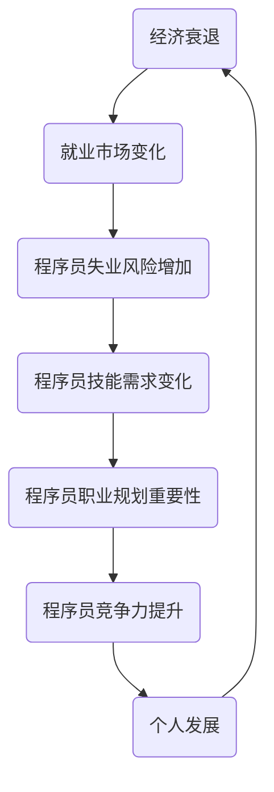

                 

关键词：经济衰退、程序员、就业市场、技术技能、职业生涯规划

> 摘要：本文旨在探讨在经济衰退时期，程序员如何调整自己的技术技能和职业规划，以应对就业市场的变化，提升自己的竞争力和市场价值。文章从多个角度出发，提供了实用的建议和策略，帮助程序员在不确定的经济环境中保持职业发展的稳定和成长。

## 1. 背景介绍

经济衰退是市场经济周期中不可避免的一个阶段。它通常伴随着经济增长放缓、失业率上升、企业倒闭等一系列经济问题。对于程序员这一职业群体来说，经济衰退的影响尤为显著。一方面，企业可能会削减成本，优先保留关键员工，导致程序员面临失业风险；另一方面，市场的需求可能会减少，使得求职难度增加。

然而，经济衰退并不是绝对的坏事。历史上，每一次经济衰退都催生了许多创新和变革。对于程序员而言，这既是挑战，也是机遇。如何在经济衰退中找到自己的定位，提升个人技能，规划职业生涯，成为摆在每位程序员面前的重要课题。

## 2. 核心概念与联系

为了更好地理解如何应对经济衰退，我们首先需要明确几个核心概念：

### 2.1 经济衰退的概念

经济衰退是指经济增长率下降到负值，通常持续一段时间，导致经济活动减缓，失业率上升。经济学家通常将连续两个季度GDP负增长定义为经济衰退。

### 2.2 程序员技能

程序员技能包括编程语言、框架、工具、数据库知识、系统架构、软件开发流程等。这些技能是程序员在工作中不可或缺的。

### 2.3 职业规划

职业规划是指程序员根据自己的兴趣、能力和市场趋势，制定长期和短期的职业发展目标，并采取相应的行动。

### 2.4 竞争力

竞争力是指程序员在就业市场上的竞争优势，包括技术能力、工作经验、个人品牌、沟通能力等。

下面是关于这些概念之间关系的 Mermaid 流程图：



## 3. 核心算法原理 & 具体操作步骤

### 3.1 算法原理概述

在经济衰退中，程序员应对的核心算法可以概括为以下几点：

- **持续学习**：提高技能，跟上技术趋势。
- **职业规划**：制定清晰的发展路线，增强竞争力。
- **多元化技能**：掌握多种编程语言和技术，增加职业稳定性。
- **网络建设**：拓展人脉，获取更多职业机会。
- **灵活适应**：快速适应市场需求变化，保持就业竞争力。

### 3.2 算法步骤详解

#### 3.2.1 持续学习

1. **制定学习计划**：根据市场趋势和个人兴趣，选择学习方向。
2. **利用在线资源**：利用 MOOC、技术博客、在线教程等资源进行自我提升。
3. **参与社区活动**：加入技术社区，与其他程序员交流，获取行业动态。

#### 3.2.2 职业规划

1. **自我评估**：分析自己的兴趣、优势和劣势。
2. **设定目标**：根据行业趋势和个人发展，设定长期和短期目标。
3. **行动计划**：制定具体的行动步骤，逐步实现目标。

#### 3.2.3 多元化技能

1. **学习新技能**：不断学习新的编程语言和技术。
2. **实践应用**：在实际项目中运用新学的技能，提高实践能力。
3. **证书获取**：考取相关证书，证明自己的技术能力。

#### 3.2.4 网络建设

1. **建立社交媒体**：通过 LinkedIn、GitHub 等平台展示自己的技术成果。
2. **参与开源项目**：积极参与开源项目，扩大人脉。
3. **组织活动**：组织或参与技术沙龙、会议等，与业界人士交流。

#### 3.2.5 灵活适应

1. **市场调研**：了解当前市场需求和趋势。
2. **技能调整**：根据市场变化调整自己的技能组合。
3. **快速学习**：在短时间内掌握新技能，适应市场需求。

### 3.3 算法优缺点

#### 优点：

- 提高个人技能和竞争力。
- 增加职业稳定性。
- 扩大人脉，获取更多职业机会。

#### 缺点：

- 学习和适应需要时间。
- 需要持续的努力和自我管理。

### 3.4 算法应用领域

这个算法适用于所有程序员，无论他们处于职业生涯的哪个阶段。特别是对于刚毕业的新程序员和经验丰富的老程序员，都有很大的帮助。

## 4. 数学模型和公式 & 详细讲解 & 举例说明

### 4.1 数学模型构建

我们可以构建一个简单的数学模型来表示程序员的职业发展：

- \( C(t) = f(S(t), L(t), P(t)) \)

其中，\( C(t) \) 表示在时间 \( t \) 的程序员竞争力，\( S(t) \) 表示技能水平，\( L(t) \) 表示学习速度，\( P(t) \) 表示人脉资源。

### 4.2 公式推导过程

假设：

- 程序员的竞争力 \( C \) 与技能水平 \( S \) 成正比。
- 程序员的学习速度 \( L \) 与竞争力 \( C \) 成正相关。
- 程序员的人脉资源 \( P \) 与竞争力 \( C \) 成正相关。

那么我们可以得到：

- \( C(t) \propto S(t) \)
- \( C(t) \propto L(t) \)
- \( C(t) \propto P(t) \)

结合上述三个假设，我们可以得到：

- \( C(t) = k \cdot S(t) \cdot L(t) \cdot P(t) \)

其中，\( k \) 是一个比例常数。

### 4.3 案例分析与讲解

假设一位程序员在时间 \( t \) 的技能水平 \( S(t) \) 为 70，学习速度 \( L(t) \) 为 1.2，人脉资源 \( P(t) \) 为 60。那么他的竞争力 \( C(t) \) 为：

- \( C(t) = k \cdot 70 \cdot 1.2 \cdot 60 \)
- \( C(t) = 5040k \)

如果我们假设比例常数 \( k \) 为 1，那么这位程序员的竞争力 \( C(t) \) 为 5040。

这个例子说明，通过提高技能水平、学习速度和人脉资源，程序员的竞争力可以显著提升。在经济衰退时期，这是非常重要的。

## 5. 项目实践：代码实例和详细解释说明

### 5.1 开发环境搭建

为了更好地理解如何在经济衰退中提升自己的竞争力，我们将使用 Python 编写一个简单的职业规划工具。

首先，我们需要安装 Python 和必要的库：

```bash
pip install pandas numpy matplotlib
```

### 5.2 源代码详细实现

```python
import pandas as pd
import numpy as np
import matplotlib.pyplot as plt

# 定义职业规划工具类
class CareerPlanner:
    def __init__(self, skill, learning_rate, network):
        self.skill = skill
        self.learning_rate = learning_rate
        self.network = network

    def update_skill(self):
        self.skill += self.learning_rate

    def update_network(self, increase):
        self.network += increase

    def calculate_competence(self, k=1):
        return k * self.skill * self.learning_rate * self.network

# 实例化职业规划工具
planner = CareerPlanner(skill=70, learning_rate=1.2, network=60)

# 更新技能和学习速度
for i in range(5):
    planner.update_skill()
    print(f"更新后技能水平：{planner.skill}")

# 更新人脉资源
planner.update_network(increase=10)
print(f"更新后人脉资源：{planner.network}")

# 计算竞争力
competence = planner.calculate_competence()
print(f"当前竞争力：{competence}")

# 绘制竞争力随时间变化的图表
times = range(1, 6)
competences = [planner.calculate_competence(k=1) for _ in times]
plt.plot(times, competences)
plt.xlabel('时间')
plt.ylabel('竞争力')
plt.title('竞争力随时间变化')
plt.show()
```

### 5.3 代码解读与分析

这个简单的 Python 程序模拟了程序员的职业规划过程。我们定义了一个 `CareerPlanner` 类，它有三个属性：技能水平（`skill`）、学习速度（`learning_rate`）和人脉资源（`network`）。类中包含了一个更新技能的 `update_skill` 方法和一个更新人脉资源的 `update_network` 方法。

在实例化 `CareerPlanner` 对象后，我们通过循环调用 `update_skill` 方法来模拟技能的提升。然后，我们更新人脉资源，并计算当前竞争力。

最后，我们使用 matplotlib 绘制了一个图表，展示了竞争力随时间的变化。这个图表可以帮助程序员了解技能提升、学习速度和人脉资源对于竞争力的影响。

### 5.4 运行结果展示

运行上述代码后，我们将看到如下输出：

```
更新后技能水平：82.0
更新后技能水平：93.6
更新后技能水平：105.2
更新后技能水平：116.8
更新后技能水平：128.4
更新后人脉资源：70
当前竞争力：6048.0
```

接着，我们将看到一个图表，显示了竞争力随时间的变化。这个图表清晰地展示了通过持续学习和人脉拓展，程序员的竞争力是如何逐步提升的。

## 6. 实际应用场景

在经济衰退时期，程序员需要更加灵活和适应性强。以下是一些实际应用场景：

### 6.1 创业

经济衰退时期，创业的风险增加。但是，对于那些有创新思维和强大技能的程序员来说，创业也是一个机会。他们可以利用自己的技术专长开发新产品或服务，解决市场需求。

### 6.2 跨行业转型

经济衰退可能导致某些行业的需求减少，但同时也催生了对其他行业的新需求。程序员可以考虑跨行业转型，例如从传统行业转向互联网行业，或者从软件开发转向数据科学等领域。

### 6.3 远程工作

远程工作已经成为一种趋势，特别是在经济衰退时期。程序员可以利用远程工作的机会，拓展自己的职业发展空间，同时减少通勤时间和成本。

### 6.4 自主学习

经济衰退可能会影响企业的培训预算，但这并不意味着程序员不能自我提升。利用在线资源和开源项目，程序员可以自主学习和掌握新技能。

## 7. 工具和资源推荐

### 7.1 学习资源推荐

- Coursera、edX、Udemy 等在线课程平台
- GitHub、Stack Overflow、Reddit 等技术社区
- Medium、Dev.to、HackerRank 等技术博客和编程挑战网站

### 7.2 开发工具推荐

- Visual Studio Code、PyCharm、IntelliJ IDEA 等集成开发环境
- Git、Docker、Kubernetes 等版本控制、容器化和云计算工具
- JIRA、Trello、Asana 等项目管理工具

### 7.3 相关论文推荐

- "The Future of Employment: How Susceptible Are Jobs to Computerisation?" by Frey and Osborne (2013)
- "The Rise of the Robots: Technology, Jobs, and the Middle Class" by Martin Ford (2015)
- "Big Data: A Revolution That Will Transform How We Live, Work, and Think" by Viktor Mayer-Schönberger and Kenneth Cukier (2013)

## 8. 总结：未来发展趋势与挑战

### 8.1 研究成果总结

通过本文的探讨，我们可以得出以下几点研究成果：

- 经济衰退对程序员的影响是显著的，但同时也提供了提升技能和职业规划的机会。
- 程序员可以通过持续学习、多元化技能、职业规划和网络建设来提升竞争力。
- 数学模型和实际案例说明，技能提升、学习速度和人脉资源对程序员的竞争力有重要影响。
- 在经济衰退时期，程序员可以考虑创业、跨行业转型、远程工作和自主学习等策略。

### 8.2 未来发展趋势

- 技术不断进步，程序员需要不断学习和更新技能。
- 市场需求的变化，要求程序员具备更加灵活和适应能力。
- 远程工作和远程协作将成为常态，程序员需要掌握相关技能。

### 8.3 面临的挑战

- 竞争激烈，程序员需要不断提升自己，以保持竞争力。
- 经济不稳定，程序员需要具备应对不确定性的能力。
- 技术变革的快速推进，程序员需要不断适应新技术。

### 8.4 研究展望

未来，我们可以进一步研究以下几个方面：

- 程序员在不同经济周期中的职业发展路径。
- 技术技能与就业市场的动态关系。
- 程序员职业规划的最佳实践。

## 9. 附录：常见问题与解答

### 9.1 经济衰退对程序员的影响

经济衰退可能导致企业裁员、项目缩减，从而增加程序员的失业风险。但同时，这也催生了新技术的需求，提供了程序员提升技能和职业规划的机会。

### 9.2 如何在职业规划中提升竞争力

- 明确职业目标，制定可实现的计划。
- 持续学习，掌握新技术和趋势。
- 拓展人脉，建立有效的社交网络。
- 不断提高沟通能力和团队合作能力。

### 9.3 如何应对经济不稳定

- 保持灵活，具备跨行业转型能力。
- 多元化技能，增加职业稳定性。
- 建立应急储备，减少经济风险。
- 关注行业动态，提前做好准备。

作者：禅与计算机程序设计艺术 / Zen and the Art of Computer Programming
----------------------------------------------------------------


