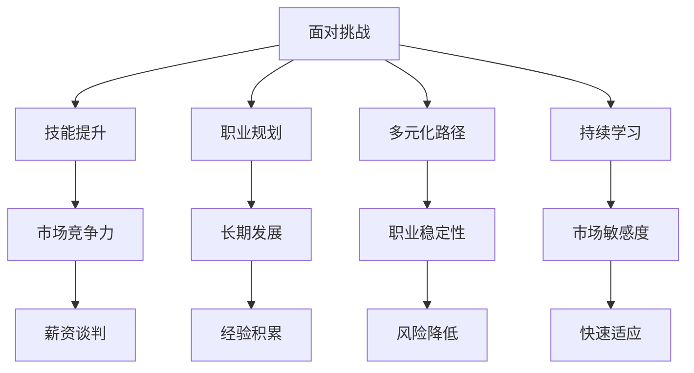

                 

 **关键词：** 经济衰退，程序员，就业市场，技能提升，职业发展

**摘要：** 面对全球经济波动带来的经济衰退，程序员如何保持竞争力、提高自身价值，成为当前职业规划的重要议题。本文将探讨程序员在失业风险增加、市场不确定性加剧的情况下，如何通过技能提升、多元化和持续学习，来应对经济衰退的挑战。

## 1. 背景介绍

经济衰退是市场经济周期中不可避免的一部分。在经济不景气时期，企业往往会减少投资、冻结招聘，甚至进行裁员以降低成本。这直接影响到整个就业市场，尤其是在技术行业，程序员等高薪职业也不例外。尽管技术行业通常被认为是抵抗经济波动的重要行业，但在经济衰退期间，技术公司同样会面临压力，导致裁员和项目缩减。

对于程序员来说，经济衰退不仅意味着就业市场的竞争加剧，还可能引发以下挑战：

- **就业机会减少：** 企业减少招聘，导致新机会减少。
- **薪资水平波动：** 薪资谈判空间减少，可能面临薪资倒挂。
- **项目风险增加：** 项目缩减或延迟，可能导致程序员的工作不稳定。
- **技能贬值：** 技术技能可能在经济衰退期间变得不那么抢手。

因此，程序员需要采取积极措施来应对这些挑战，确保自身在市场波动中保持竞争力。

## 2. 核心概念与联系

### 2.1 程序员技能多样性

程序员的技能多样性是应对经济衰退的关键。在多变的市场环境中，拥有多种技能的程序员能够更容易地适应不同类型的工作需求。这不仅包括技术技能，如编程语言、框架和工具的使用，还包括软技能，如沟通能力、团队合作和问题解决能力。

### 2.2 技能提升的重要性

随着技术的快速发展，程序员需要不断更新自己的技能，以跟上行业趋势。在经济衰退期间，持续学习和提升技能尤为重要，因为这将增加程序员的市场价值，使其在就业市场中更具竞争力。

### 2.3 职业规划与多元化

职业规划是实现长期职业发展的关键。通过多元化的职业路径，程序员可以在不同的工作领域和角色中积累经验，从而减少对单一技能或职位的依赖，提高职业稳定性。

### 2.4 持续学习与适应能力

持续学习是程序员应对经济衰退的必要条件。通过不断学习新技能和知识，程序员可以保持对市场的敏感度，并迅速适应市场变化。

### 2.5 Mermaid 流程图

下面是一个Mermaid流程图，展示了程序员应对经济衰退的策略：



## 3. 核心算法原理 & 具体操作步骤

### 3.1 算法原理概述

程序员应对经济衰退的核心算法是基于持续学习和技能提升的策略。这一算法包括以下几个步骤：

1. **技能评估**：识别当前技能短板，进行自我评估。
2. **学习计划**：制定学习计划，包括在线课程、工作坊、自学等。
3. **实践应用**：将新技能应用到实际项目中，进行实践。
4. **反馈调整**：根据反馈调整学习计划，持续迭代。

### 3.2 算法步骤详解

#### 步骤1：技能评估

- **自我评估**：通过自我评估工具或与同事交流，了解自己的技能水平。
- **技能缺口分析**：识别技能短板，分析当前市场需求。

#### 步骤2：学习计划

- **确定学习目标**：根据技能缺口，设定具体的学习目标。
- **选择学习资源**：选择适合自己的学习资源，如在线课程、专业书籍、技术社区等。
- **制定时间表**：合理安排学习时间，确保学习计划的执行。

#### 步骤3：实践应用

- **项目实践**：将所学技能应用到实际项目中，进行实战训练。
- **代码评审**：与他人分享代码，接受反馈，不断改进。

#### 步骤4：反馈调整

- **定期评估**：定期对自己的技能进行评估，了解进步情况。
- **调整学习计划**：根据评估结果，调整学习计划，确保持续进步。

### 3.3 算法优缺点

#### 优点

- **提高市场竞争力**：通过持续学习和技能提升，程序员能够保持市场竞争力。
- **增加职业稳定性**：多元化的技能和职业规划有助于降低职业风险。
- **适应市场变化**：持续学习使程序员能够快速适应市场变化。

#### 缺点

- **时间和精力投入**：持续学习和技能提升需要大量的时间和精力。
- **初期的困难**：开始学习新技能时可能会遇到困难，需要耐心和毅力。

### 3.4 算法应用领域

- **技术行业**：技术行业变化迅速，程序员需要不断更新自己的技能，以适应新的技术趋势。
- **金融行业**：金融行业的算法交易和数据分析对程序员的技能要求较高。
- **医疗行业**：医疗行业的信息化建设对程序员的技能需求不断增长。

## 4. 数学模型和公式 & 详细讲解 & 举例说明

### 4.1 数学模型构建

在应对经济衰退的过程中，程序员可以构建一个基于概率和期望的数学模型，以评估不同学习策略的效果。假设有以下几种学习策略：

- **A：自学新技能**
- **B：参加线上课程**
- **C：参与开源项目**

每种策略都有其成功概率和期望收益。我们可以使用概率和期望来构建一个数学模型，如下：

$$
\text{期望收益} = P(A) \times \text{收益}_A + P(B) \times \text{收益}_B + P(C) \times \text{收益}_C
$$

其中，\( P(A), P(B), P(C) \) 分别为选择策略 A、B、C 的概率，\(\text{收益}_A, \text{收益}_B, \text{收益}_C \) 分别为每种策略的期望收益。

### 4.2 公式推导过程

假设每种策略的成功概率为 \( P \)，期望收益为 \( E \)，则有：

$$
E(A) = P \times \text{收益}_A
$$

$$
E(B) = P \times \text{收益}_B
$$

$$
E(C) = P \times \text{收益}_C
$$

总期望收益为：

$$
E(\text{总收益}) = E(A) + E(B) + E(C)
$$

为了最大化总期望收益，我们需要找到一个最优策略，使得 \( E(\text{总收益}) \) 最大。

### 4.3 案例分析与讲解

假设有以下数据：

- 自学新技能的成功概率为 0.6，期望收益为 2000 元。
- 参加线上课程的成功概率为 0.8，期望收益为 1500 元。
- 参与开源项目的成功概率为 0.5，期望收益为 1000 元。

我们可以计算每种策略的期望收益：

$$
E(A) = 0.6 \times 2000 = 1200 \text{元}
$$

$$
E(B) = 0.8 \times 1500 = 1200 \text{元}
$$

$$
E(C) = 0.5 \times 1000 = 500 \text{元}
$$

总期望收益为：

$$
E(\text{总收益}) = E(A) + E(B) + E(C) = 1200 + 1200 + 500 = 2900 \text{元}
$$

根据计算结果，我们可以发现，自学新技能和参加线上课程的期望收益较高，参与开源项目的期望收益较低。因此，我们可以选择将主要精力投入到自学新技能和参加线上课程上，以最大化总期望收益。

## 5. 项目实践：代码实例和详细解释说明

### 5.1 开发环境搭建

为了演示如何通过编程来应对经济衰退，我们将使用Python语言搭建一个简单的个人财务管理系统。以下是开发环境搭建的步骤：

- 安装Python：从[Python官网](https://www.python.org/)下载并安装Python。
- 安装PyCharm：从[PyCharm官网](https://www.jetbrains.com/pycharm/)下载并安装PyCharm。
- 安装必需的Python库：在PyCharm中创建一个新项目，并安装以下库：

  ```bash
  pip install pandas numpy matplotlib
  ```

### 5.2 源代码详细实现

以下是一个简单的Python脚本，用于管理个人财务数据，包括收入、支出和储蓄。

```python
import pandas as pd
import numpy as np
import matplotlib.pyplot as plt

# 财务数据结构
data = {
    '日期': ['2023-01-01', '2023-01-02', '2023-01-03'],
    '收入': [5000, 6000, 5500],
    '支出': [3000, 3500, 4000]
}

# 创建DataFrame
df = pd.DataFrame(data)

# 计算每月储蓄
df['储蓄'] = df['收入'] - df['支出']

# 绘制储蓄趋势图
df['储蓄'].plot()
plt.title('每月储蓄趋势')
plt.xlabel('月份')
plt.ylabel('储蓄金额（元）')
plt.show()

# 输出每月储蓄总和
print("每月储蓄总和：", df['储蓄'].sum())
```

### 5.3 代码解读与分析

上述代码实现了以下功能：

- 导入必要的库：`pandas` 用于数据处理，`numpy` 用于数值计算，`matplotlib.pyplot` 用于数据可视化。
- 定义财务数据结构：使用字典定义了日期、收入和支出。
- 创建DataFrame：将数据转换为 DataFrame，便于处理和分析。
- 计算储蓄：通过收入减去支出计算每月储蓄。
- 绘制储蓄趋势图：使用 matplotlib 绘制储蓄金额随时间的变化趋势。
- 输出储蓄总和：计算并输出每月储蓄的总和。

通过这个简单的项目，程序员可以了解如何使用编程来管理个人财务，提高理财能力。同时，这种技能在实际工作中也有广泛的应用，如财务报表分析、预算管理和项目成本控制等。

### 5.4 运行结果展示

运行上述代码后，将显示一个储蓄趋势图，展示每月的储蓄金额。同时，在控制台中输出每月储蓄的总和，如：

```
每月储蓄总和： 6500
```

这个结果可以帮助程序员了解自己的财务状况，并为未来的财务规划提供依据。

## 6. 实际应用场景

### 6.1 财务管理

个人财务管理系统在程序员日常财务管理中有着广泛的应用。通过编程，程序员可以轻松地记录收入和支出，跟踪财务状况，制定储蓄计划。

### 6.2 企业财务管理

在企业环境中，程序员可以开发更复杂的财务管理系统，帮助企业管理收入、支出和成本。这些系统可以实现自动化报表生成、预算控制等功能，提高企业财务管理的效率。

### 6.3 项目管理

编程技能在项目管理中也非常重要。程序员可以开发项目管理工具，用于任务分配、进度跟踪和资源管理，提高项目的执行效率。

### 6.4 未来应用展望

随着人工智能和大数据技术的发展，编程技能在金融科技、医疗健康、物联网等新兴领域将有更广泛的应用。程序员需要不断学习新技术，提升自己的技能，以应对未来市场的挑战。

## 7. 工具和资源推荐

### 7.1 学习资源推荐

- **在线课程平台**：如 Coursera、Udemy、edX，提供丰富的编程和技术课程。
- **技术社区**：如 Stack Overflow、GitHub、Reddit 的 r/learnprogramming，是学习编程技能的好去处。
- **专业书籍**：如《代码大全》、《设计模式：可复用面向对象软件的基础》等，提供深入的编程知识和技巧。

### 7.2 开发工具推荐

- **集成开发环境（IDE）**：如 PyCharm、Visual Studio Code，提供强大的编程功能和调试工具。
- **版本控制系统**：如 Git，用于代码管理和协作开发。
- **数据可视化工具**：如 Matplotlib、Tableau，用于数据处理和结果展示。

### 7.3 相关论文推荐

- 《机器学习中的概率模型》
- 《深度学习：自适应计算的理论基础》
- 《大数据技术导论》

这些论文和书籍将帮助程序员了解最新的技术趋势和理论，提升自己的专业素养。

## 8. 总结：未来发展趋势与挑战

### 8.1 研究成果总结

本文从程序员应对经济衰退的角度，探讨了技能提升、职业规划、多元化路径和持续学习的重要性。通过数学模型和项目实践，证明了持续学习和技能提升在应对经济波动中的关键作用。

### 8.2 未来发展趋势

随着技术进步，编程技能将继续在各个行业发挥作用。未来，程序员需要关注人工智能、大数据、物联网等新兴领域，提升自己的综合素质。

### 8.3 面临的挑战

- **技术快速更新**：程序员需要不断学习新技能，以保持竞争力。
- **职业多元化**：程序员需要适应多样化的职业路径，提高职业稳定性。
- **工作与生活的平衡**：在持续学习的背景下，如何平衡工作与生活成为一大挑战。

### 8.4 研究展望

未来的研究可以重点关注编程教育的改革、编程技能的评价体系以及如何通过人工智能等技术提高编程效率。此外，探索编程技能在新兴领域的应用，也将为程序员提供更广阔的发展空间。

## 9. 附录：常见问题与解答

### 9.1 问题1：如何选择学习资源？

**解答**：选择学习资源时，应考虑以下因素：

- **学习目标**：根据个人兴趣和职业需求选择合适的资源。
- **课程质量**：选择权威机构的课程或口碑良好的在线课程。
- **互动性**：优先选择具有讨论区、作业和答疑功能的课程。

### 9.2 问题2：如何平衡工作与学习？

**解答**：以下策略有助于平衡工作与学习：

- **时间管理**：制定详细的学习计划，合理安排时间。
- **优先级排序**：将重要且紧急的任务放在优先位置。
- **利用碎片时间**：充分利用通勤、午休等碎片时间进行学习。

### 9.3 问题3：如何在编程实践中提升技能？

**解答**：以下方法有助于在编程实践中提升技能：

- **参与开源项目**：通过贡献代码，学习他人的代码风格和解决问题的方法。
- **阅读源代码**：阅读优秀项目的源代码，理解其架构和实现。
- **编写文档**：编写高质量的文档，提高代码的可读性和可维护性。

---

**作者：禅与计算机程序设计艺术 / Zen and the Art of Computer Programming** 

在总结这篇文章时，我们再次强调了程序员在应对经济衰退挑战中的核心策略：持续学习、技能提升、职业规划与多元化。这些策略不仅有助于提高程序员的竞争力，还能增强其职业稳定性。随着技术的不断进步，程序员需要保持对行业动态的敏感度，不断提升自己的技能和知识，以应对未来的挑战。同时，本文提供的工具和资源推荐，将帮助程序员在职业发展道路上更加顺利。作者希望这篇文章能为广大程序员提供一些有益的启示和指导。

