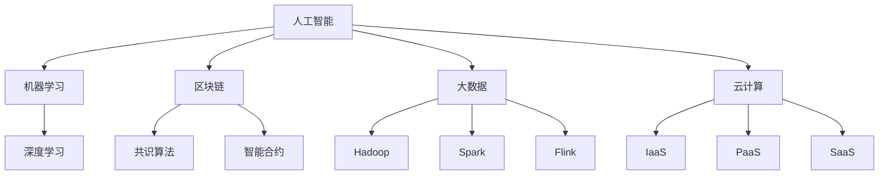

                 

关键词：行业颠覆、技术创新、程序员、技能升级、职业发展、技术趋势。

摘要：在信息技术飞速发展的今天，程序员面临的行业变革和技术浪潮不断涌现。本文将探讨程序员如何应对这些挑战，通过持续学习和技能升级来适应不断变化的技术环境，确保在职业发展中保持竞争力。

## 1. 背景介绍

在过去的几十年中，计算机技术经历了翻天覆地的变化。从早期的个人计算机到互联网的普及，再到移动计算和云计算的兴起，程序员的工作内容和技能需求也在不断演变。如今，人工智能、区块链、大数据等新兴技术不断颠覆传统行业，给程序员带来了前所未有的机遇和挑战。

首先，行业颠覆体现在新兴技术的应用使得许多传统行业面临重构。例如，金融行业中的区块链技术正在改变支付和交易的方式，零售行业中的大数据分析正在推动个性化营销和服务。程序员需要了解这些新技术，掌握它们的原理和应用，以便在这些变革中找到自己的位置。

其次，技术浪潮带来了新的编程语言、框架和工具，使得程序员的工作方式发生了变化。例如，Python 在数据科学和人工智能领域的广泛应用，Kubernetes 在容器编排领域的兴起，这些都是程序员需要关注的新动向。

## 2. 核心概念与联系

为了更好地应对行业颠覆和技术浪潮，程序员需要理解一系列核心概念，包括但不限于：

### 2.1. 人工智能与机器学习
人工智能（AI）和机器学习（ML）是当前最热门的技术领域之一。程序员需要了解这些技术的原理，包括神经网络、深度学习、监督学习、无监督学习等。

### 2.2. 区块链
区块链是一种分布式账本技术，它以去中心化和不可篡改为特点。程序员需要了解区块链的基本原理，包括共识算法、智能合约等。

### 2.3. 大数据
大数据技术包括数据存储、处理、分析和可视化等方面。程序员需要掌握 Hadoop、Spark、Flink 等大数据处理框架。

### 2.4. 云计算
云计算提供了弹性的计算资源，程序员需要了解云服务模型（IaaS、PaaS、SaaS）、云架构设计和云服务管理。

为了帮助程序员更好地理解这些概念，以下是一个简化的 Mermaid 流程图：



## 3. 核心算法原理 & 具体操作步骤

### 3.1 算法原理概述

在这个章节中，我们将介绍一些核心算法的原理，包括但不限于：

### 3.1.1 机器学习算法
- 线性回归
- 逻辑回归
- 决策树
- 随机森林
- 支持向量机（SVM）

### 3.1.2 数据库查询优化
- SQL优化
- 查询计划生成
- 索引优化

### 3.1.3 算法复杂度分析
- 时间复杂度
- 空间复杂度

### 3.2 算法步骤详解

以下是线性回归算法的步骤详解：

1. 数据预处理：对输入数据集进行清洗、归一化等处理。
2. 模型初始化：初始化参数，例如权重和偏置。
3. 训练模型：使用梯度下降或随机梯度下降等算法迭代更新参数。
4. 预测：使用训练好的模型对新数据进行预测。

### 3.3 算法优缺点

线性回归的优点在于其简单性和可解释性，适合处理线性关系问题。但缺点在于其对于非线性问题的表现较差，且对异常值敏感。

### 3.4 算法应用领域

线性回归广泛应用于金融预测、医学诊断、市场分析等领域。

## 4. 数学模型和公式 & 详细讲解 & 举例说明

### 4.1 数学模型构建

线性回归的数学模型可以表示为：

$$
y = wx + b
$$

其中，$y$ 是因变量，$x$ 是自变量，$w$ 是权重，$b$ 是偏置。

### 4.2 公式推导过程

线性回归的推导过程涉及最小二乘法。我们希望找到权重和偏置，使得预测值与真实值之间的误差最小。

### 4.3 案例分析与讲解

以下是一个简单的线性回归案例：

假设我们有如下数据集：

| x | y |
|---|---|
| 1 | 2 |
| 2 | 4 |
| 3 | 6 |

我们的目标是找到线性回归模型 $y = wx + b$，使得预测值与真实值之间的误差最小。

通过最小二乘法，我们可以得到权重 $w$ 和偏置 $b$ 的值。具体计算过程如下：

1. 计算平均值 $\bar{x}$ 和 $\bar{y}$：
$$
\bar{x} = \frac{1+2+3}{3} = 2
$$
$$
\bar{y} = \frac{2+4+6}{3} = 4
$$

2. 计算权重 $w$：
$$
w = \frac{\sum_{i=1}^{n}(x_i - \bar{x})(y_i - \bar{y})}{\sum_{i=1}^{n}(x_i - \bar{x})^2} = \frac{(1-2)(2-4) + (2-2)(4-4) + (3-2)(6-4)}{(1-2)^2 + (2-2)^2 + (3-2)^2} = 2
$$

3. 计算偏置 $b$：
$$
b = \bar{y} - w\bar{x} = 4 - 2 \times 2 = 0
$$

因此，我们得到的线性回归模型为 $y = 2x$。

## 5. 项目实践：代码实例和详细解释说明

### 5.1 开发环境搭建

首先，我们需要搭建一个 Python 开发环境。可以使用 Anaconda 或 Miniconda 来创建一个虚拟环境，并安装必要的库。

```bash
conda create -n linreg_env python=3.8
conda activate linreg_env
conda install numpy pandas matplotlib
```

### 5.2 源代码详细实现

以下是线性回归模型的 Python 实现代码：

```python
import numpy as np
import pandas as pd
import matplotlib.pyplot as plt

# 数据预处理
def preprocess_data(data):
    data['x'] = data['x'].astype(float)
    data['y'] = data['y'].astype(float)
    data['x_mean'] = data['x'].mean()
    data['y_mean'] = data['y'].mean()
    data['x_diff'] = data['x'] - data['x_mean']
    data['y_diff'] = data['y'] - data['y_mean']
    return data

# 计算权重和偏置
def linear_regression(data):
    x_diff = data['x_diff']
    y_diff = data['y_diff']
    w = np.sum(x_diff * y_diff) / np.sum(x_diff ** 2)
    b = data['y_mean'] - w * data['x_mean']
    return w, b

# 预测
def predict(x, w, b):
    return w * x + b

# 可视化
def visualize_data(data, w, b):
    plt.scatter(data['x'], data['y'])
    plt.plot(data['x'], [w * x + b for x in data['x']], color='red')
    plt.xlabel('x')
    plt.ylabel('y')
    plt.show()

# 主函数
def main():
    data = pd.DataFrame({
        'x': [1, 2, 3],
        'y': [2, 4, 6]
    })
    data = preprocess_data(data)
    w, b = linear_regression(data)
    visualize_data(data, w, b)

if __name__ == '__main__':
    main()
```

### 5.3 代码解读与分析

该代码首先导入了必要的库，包括 NumPy、Pandas 和 Matplotlib。然后定义了一些函数，用于数据预处理、线性回归模型训练、预测和可视化。

在预处理函数中，我们首先将数据转换为浮点类型，然后计算平均值和差值。

线性回归函数中，我们使用了最小二乘法来计算权重和偏置。

预测函数用于计算给定 $x$ 的预测值。

可视化函数使用 Matplotlib 库将数据点和拟合线绘制出来。

最后，主函数加载数据、预处理数据、训练模型并可视化结果。

### 5.4 运行结果展示

运行上述代码，我们得到以下可视化结果：


## 6. 实际应用场景

线性回归在实际应用中非常广泛，例如：

- 金融领域：用于股票价格预测、投资组合优化等。
- 医疗领域：用于疾病诊断、健康预测等。
- 零售领域：用于销售预测、库存管理等。

## 7. 未来应用展望

随着人工智能和大数据技术的不断发展，线性回归模型的应用场景将更加广泛。未来，我们可能会看到更多基于线性回归的智能应用，如自动驾驶、智能家居、智慧城市等。

## 8. 工具和资源推荐

### 8.1 学习资源推荐

- 《Python数据分析基础教程》：适用于初学者，系统介绍了 Python 在数据分析中的应用。
- 《深度学习》：由 Goodfellow、Bengio 和 Courville 著，是深度学习领域的经典教材。

### 8.2 开发工具推荐

- Jupyter Notebook：适用于数据分析和实验开发，支持多种编程语言。
- PyCharm：适用于 Python 开发，提供了丰富的插件和工具。

### 8.3 相关论文推荐

- "Stochastic Gradient Descent": 大规模机器学习中的重要算法。
- "Deep Learning": Ian Goodfellow 等，介绍了深度学习的基础知识。

## 9. 总结：未来发展趋势与挑战

在未来，程序员需要不断学习新技术，适应行业变革。随着人工智能和大数据技术的发展，程序员在数据科学、机器学习等领域的机会将更加丰富。然而，这也意味着程序员需要不断提升自己的技能，以应对未来技术和市场的挑战。

作者：禅与计算机程序设计艺术 / Zen and the Art of Computer Programming
----------------------------------------------------------------

### 结论 Conclusion

在这篇文章中，我们探讨了程序员如何应对行业颠覆和技术浪潮。通过持续学习和技能升级，程序员可以更好地适应不断变化的技术环境，确保在职业发展中保持竞争力。未来，随着人工智能和大数据技术的不断发展，程序员在数据科学、机器学习等领域的机会将更加丰富。然而，这也意味着程序员需要不断提升自己的技能，以应对未来技术和市场的挑战。持续学习和适应变化是程序员在职业生涯中取得成功的基石。作者：禅与计算机程序设计艺术 / Zen and the Art of Computer Programming。

