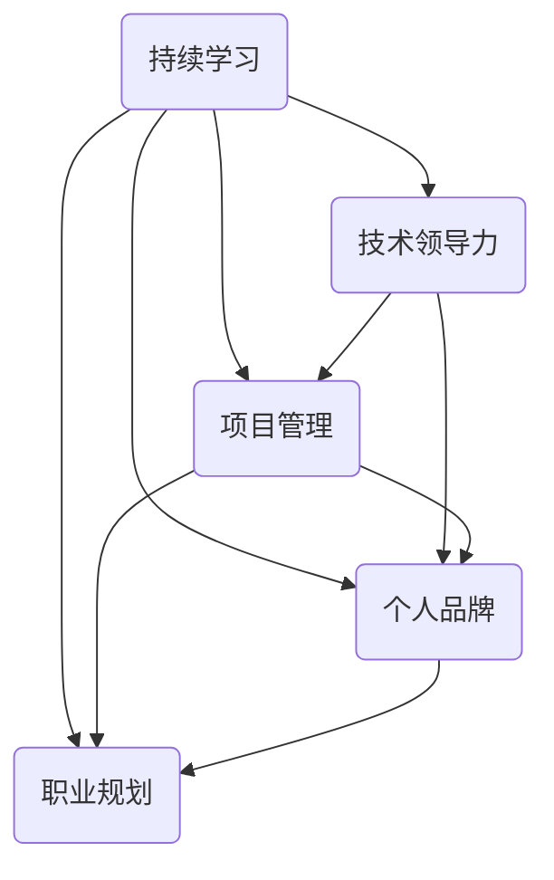
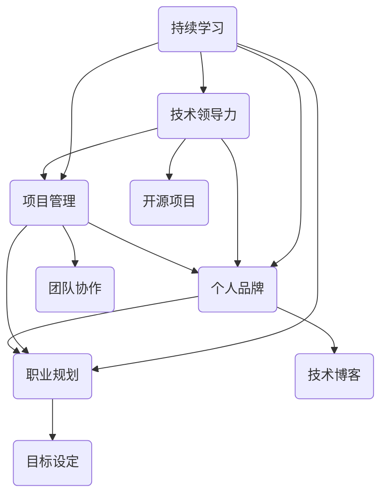

                 

关键词：职业竞争力、影响力、持续学习、技术领导力、项目管理、沟通技巧、个人品牌、职业规划

> 摘要：本文旨在探讨程序员如何在竞争激烈的职场中建立持久的职业竞争力与影响力。通过分析技术、沟通、管理等多个维度，本文提供了一系列实用策略，帮助程序员不断提升自身价值，实现职业发展与个人成长的双重目标。

## 1. 背景介绍

在当今快速变化的技术领域中，程序员面临着巨大的挑战。不仅需要不断更新技术知识，还需在职业竞争中脱颖而出，建立持久的职业竞争力与影响力。传统的编程技能已不足以支撑程序员在职业生涯中的长远发展。为了在激烈的职场中站稳脚跟，程序员需要具备全面的技能组合，包括技术深度、软技能、领导力以及沟通能力。

职业竞争力指的是一个人在职场中凭借专业技能和经验所展现出的竞争能力。它不仅决定了个人在市场上的价值，还影响了职业晋升和收入水平。而影响力则是指个人在团队、社区或行业内的影响力，通过分享知识、解决问题和引领创新来塑造行业趋势。

本文将围绕以下几个方面展开讨论：

1. **核心技能的深化与扩展**：探讨程序员如何通过持续学习不断提升技术深度和广度。
2. **软技能的培养**：分析沟通技巧、团队合作能力、领导力等软技能在职业发展中的重要性。
3. **项目管理能力**：讨论如何通过有效的项目管理提升工作效率和团队协作。
4. **个人品牌的建立**：分享如何通过社交媒体、技术博客等方式塑造个人品牌。
5. **职业规划**：提供实用的职业规划方法，帮助程序员制定清晰的职业发展路线。

通过上述内容，本文旨在为程序员提供一套全面的策略，帮助他们建立持久的职业竞争力与影响力。

### 1.1 技术变革与职业挑战

随着互联网、云计算、大数据、人工智能等技术的迅猛发展，程序员所面临的技术变革是前所未有的。新的编程语言、框架和工具层出不穷，不断推动软件开发领域的创新。然而，技术变革也带来了职业挑战。程序员需要不断更新知识储备，掌握新技术，否则将面临被淘汰的风险。

此外，职业竞争愈发激烈。越来越多的年轻程序员进入职场，他们不仅拥有最新的技术知识，还具备更强的学习能力和创新思维。这使得程序员在职业晋升和薪酬待遇方面面临更大的压力。

在这样一个充满变革和竞争的环境中，程序员如何建立持久的职业竞争力与影响力，成为了亟待解决的问题。本文将结合实际案例，为程序员提供实用的策略和方法，帮助他们应对职业挑战，实现职业生涯的长期发展。

### 1.2 重要性

建立持久的职业竞争力与影响力对于程序员的职业生涯至关重要。首先，职业竞争力决定了程序员在职场中的价值和地位。拥有深厚技术功底和丰富经验的程序员，更容易获得高薪职位和晋升机会。同时，他们还能在项目中承担更重要的角色，发挥更大的影响力。

其次，影响力是程序员在行业内建立个人品牌的重要途径。通过分享技术知识、解决行业痛点、参与开源项目等，程序员可以在行业内获得认可和尊重。这不仅有助于提升个人声誉，还能为未来的职业发展铺平道路。

此外，职业竞争力与影响力还能帮助程序员建立稳定的人脉网络。在职场中，拥有良好人脉的人往往更容易获得重要的项目机会和合作伙伴资源。通过积极参与行业活动和社区交流，程序员可以拓展人脉，提升自身在职场中的影响力。

总之，建立持久的职业竞争力与影响力是程序员实现职业生涯成功的必要条件。通过不断提升自身能力、拓展技能广度、建立个人品牌，程序员可以在职场中脱颖而出，实现长期发展。

### 1.3 职业竞争力与影响力的关系

职业竞争力与影响力之间存在密切的关系。职业竞争力是建立影响力的基础，而影响力则是职业竞争力的体现。具体来说，以下几点解释了它们之间的相互关系。

首先，职业竞争力决定了程序员的实际工作能力和项目贡献。拥有深厚技术功底和丰富经验的程序员，能够在项目中迅速解决问题，提高开发效率，从而获得同事和上级的认可。这种认可和信任为程序员建立个人影响力创造了条件。

其次，影响力是程序员在行业内和团队中发挥作用的体现。通过分享技术知识、发表技术博客、参与开源项目等方式，程序员可以在行业内获得声誉和认可。这种认可不仅提升了个人品牌，还增加了在其他项目中的合作机会，从而扩大了职业影响力。

此外，职业竞争力和影响力相互促进。拥有高职业竞争力的程序员，更容易在项目中脱颖而出，获得更多的机会展示自己的实力。而随着个人影响力的提升，程序员在职场中的话语权和地位也会相应提高，从而进一步巩固职业竞争力。

一个典型的案例是某知名技术社区的一位资深程序员。他通过在社区中分享技术心得和解决难题，逐渐赢得了广泛的关注和认可。随着影响力的提升，他被邀请参与多个重要的开源项目，成为项目核心成员。这不仅提升了他的职业竞争力，也为他在职场中赢得了更多的机会。

总之，职业竞争力和影响力相互依存，共同推动程序员的职业发展。通过不断提升职业竞争力，程序员可以建立和扩大自己的影响力；而通过积极展现个人影响力，程序员可以进一步巩固和提升职业竞争力。

### 1.4 文章结构

本文将围绕职业竞争力与影响力的构建展开讨论，具体结构如下：

1. **核心技能的深化与扩展**：首先，探讨程序员如何通过学习新技术、掌握新工具、参与开源项目等方式，不断提升技术深度和广度。
2. **软技能的培养**：接着，分析沟通技巧、团队合作能力、领导力等软技能在职业发展中的重要性，并提供实用的培养方法。
3. **项目管理能力**：然后，讨论如何通过有效的项目管理提升工作效率和团队协作，分享项目管理的最佳实践。
4. **个人品牌的建立**：介绍如何利用社交媒体、技术博客等平台，建立和维护个人品牌，提升在行业内的知名度。
5. **职业规划**：最后，提供实用的职业规划方法，帮助程序员制定清晰的职业发展路线，实现长期职业目标。

通过上述内容，本文旨在为程序员提供一套全面的策略，帮助他们建立持久的职业竞争力与影响力。

### 2. 核心概念与联系

在本文中，我们将讨论几个核心概念，这些概念对于建立持久的职业竞争力与影响力至关重要。这些概念包括：持续学习、技术领导力、项目管理、个人品牌和职业规划。以下是一个使用Mermaid绘制的流程图，展示了这些核心概念之间的关系。



#### 2.1 持续学习

持续学习是程序员职业生涯中的核心驱动力。随着技术的快速发展，程序员需要不断学习新知识、新技能，以适应不断变化的技术环境。持续学习不仅有助于提升个人技术能力，还能增加对行业动态的了解，从而在职业发展中保持竞争力。

#### 2.2 技术领导力

技术领导力是程序员在团队中发挥重要作用的关键因素。它包括技术深度、视野宽广和解决问题的能力。具备技术领导力的程序员能够在项目中起到引领作用，推动技术创新，并带领团队克服各种挑战。

#### 2.3 项目管理

项目管理是程序员工作中必不可少的一部分。良好的项目管理能力可以提高工作效率，确保项目按时交付，并降低项目风险。程序员需要掌握项目规划、资源管理、风险评估和沟通协调等项目管理技能。

#### 2.4 个人品牌

个人品牌是程序员在职场中的形象和声誉。通过建立和维护个人品牌，程序员可以在行业内获得更多的机会和认可。个人品牌可以通过技术博客、社交媒体、开源项目等方式建立，是实现职业发展的重要途径。

#### 2.5 职业规划

职业规划是程序员实现长期职业目标的重要工具。通过制定清晰的职业规划，程序员可以明确自己的职业发展方向，合理分配时间和精力，实现职业目标的逐步实现。

这些核心概念相互关联，共同构成了程序员建立持久职业竞争力与影响力的基础。以下图表详细展示了这些概念之间的关系：



通过这个流程图，我们可以清晰地看到持续学习、技术领导力、项目管理、个人品牌和职业规划之间的相互作用，以及它们如何共同推动程序员的职业发展。

### 3. 核心算法原理 & 具体操作步骤

在探讨程序员如何提升职业竞争力与影响力之前，我们首先需要了解几个核心算法原理及其具体操作步骤。这些算法不仅适用于程序员的工作实践，还能够帮助他们在技术讨论和项目中展示深厚的专业素养。以下是三个关键算法的原理与步骤：

#### 3.1 算法原理概述

1. **动态规划**：动态规划是一种解决最优化问题的算法思想，通过将问题分解成子问题，并存储子问题的解，避免重复计算，从而提高算法效率。

2. **贪心算法**：贪心算法是一种在每一步选择中选择当前最优解的策略，它不保证全局最优解，但在某些特定问题中可以取得较好的性能。

3. **图论算法**：图论算法用于解决与图相关的问题，如最短路径、最小生成树和图着色等。这些算法在社交网络分析、路由算法和优化调度等方面有广泛应用。

#### 3.2 算法步骤详解

##### 动态规划

**算法步骤**：

1. **定义状态**：将问题分解为多个子问题，并为每个子问题定义一个状态。
2. **状态转移方程**：根据问题的性质，建立状态转移方程，描述子问题之间的关系。
3. **初始化边界条件**：为最基础的状态设定初始值。
4. **递推计算**：根据状态转移方程，从基础状态开始，逐步计算得到最终状态。
5. **存储子问题解**：使用数组或哈希表存储已计算的子问题解，避免重复计算。

**示例**：使用动态规划求解斐波那契数列。

```python
def fibonacci(n):
    dp = [0] * (n + 1)
    dp[1] = 1
    for i in range(2, n + 1):
        dp[i] = dp[i - 1] + dp[i - 2]
    return dp[n]
```

##### 贪心算法

**算法步骤**：

1. **初始化**：初始化一个解，通常为空。
2. **选择最优解**：在每一步选择中，选择当前最优的解。
3. **更新解**：将选择的最优解加入当前解，并更新问题的状态。
4. **迭代**：重复步骤2和3，直到问题解决。

**示例**：使用贪心算法求解背包问题。

```python
def knapsack(values, weights, capacity):
    items = sorted(zip(values, weights), key=lambda x: x[0] / x[1], reverse=True)
    result = []
    total_weight = 0
    for value, weight in items:
        if total_weight + weight <= capacity:
            result.append((value, weight))
            total_weight += weight
    return result
```

##### 图论算法

**算法步骤**：

1. **定义图**：建立图的邻接表或邻接矩阵表示。
2. **选择算法**：根据具体问题选择合适的算法，如最短路径算法（迪杰斯特拉算法、贝尔曼-福特算法）或最小生成树算法（普里姆算法、克鲁斯卡尔算法）。
3. **计算路径或树**：执行算法，计算最短路径或最小生成树。
4. **分析结果**：根据计算结果进行分析和应用。

**示例**：使用迪杰斯特拉算法求解单源最短路径问题。

```python
import heapq

def dijkstra(graph, start):
    dist = {vertex: float('infinity') for vertex in graph}
    dist[start] = 0
    priority_queue = [(0, start)]
    while priority_queue:
        current_distance, current_vertex = heapq.heappop(priority_queue)
        if current_distance > dist[current_vertex]:
            continue
        for neighbor, weight in graph[current_vertex].items():
            distance = current_distance + weight
            if distance < dist[neighbor]:
                dist[neighbor] = distance
                heapq.heappush(priority_queue, (distance, neighbor))
    return dist
```

#### 3.3 算法优缺点

**动态规划**：

- **优点**：避免了重复计算，适用于求解具有重叠子问题的最优化问题。
- **缺点**：需要定义状态和状态转移方程，实现复杂度较高。

**贪心算法**：

- **优点**：实现简单，效率高，适用于一些特殊问题的最优解。
- **缺点**：不保证全局最优解，适用范围有限。

**图论算法**：

- **优点**：解决与图相关的问题，适用于网络优化、路径规划等。
- **缺点**：实现复杂，需要对图结构和算法有深入理解。

#### 3.4 算法应用领域

**动态规划**：适用于求解背包问题、最短路径问题、最长公共子序列等。

**贪心算法**：适用于求解背包问题、最小生成树问题、活动选择问题等。

**图论算法**：适用于求解最短路径、最小生成树、图着色等问题，广泛应用于网络设计、社交网络分析等领域。

通过了解和掌握这些核心算法原理及其具体操作步骤，程序员不仅能够在项目中展示出色的技术能力，还能在职业竞争中占据有利地位，为建立持久的职业竞争力与影响力奠定坚实基础。

### 4. 数学模型和公式 & 详细讲解 & 举例说明

在程序员的工作中，数学模型和公式是解决问题的重要工具。这些模型和公式不仅能帮助我们理解问题的本质，还能为优化算法提供理论基础。以下我们将详细讲解几个常用的数学模型和公式，并通过具体例子进行说明。

#### 4.1 数学模型构建

首先，我们需要了解一些基本的数学模型构建方法。一个典型的数学模型通常包括以下几个步骤：

1. **定义变量**：根据问题性质，定义所需的变量。
2. **建立关系**：通过分析问题，建立变量之间的关系。
3. **构建公式**：利用关系式构建数学公式。
4. **求解公式**：对公式进行求解，得到问题的解。

#### 4.2 公式推导过程

以下我们通过一个例子来说明数学公式的推导过程。

**例子**：假设我们有一个背包问题，背包容量为C，物品有n个，每个物品的重量为w_i，价值为v_i。我们的目标是选择一些物品放入背包中，使得总价值最大，同时不超过背包容量。

1. **定义变量**：

   - C：背包容量
   - w_i：第i个物品的重量
   - v_i：第i个物品的价值
   - x_i：第i个物品是否放入背包（0或1）

2. **建立关系**：

   根据背包问题的性质，我们有以下关系式：
   - 总重量：Σ(w_i * x_i) ≤ C
   - 总价值：Σ(v_i * x_i) 最大

3. **构建公式**：

   目标是最大化总价值，同时满足重量限制。因此，我们的公式为：
   $$ \max \sum_{i=1}^{n} v_i \cdot x_i $$
   $$ \text{s.t.} \quad \sum_{i=1}^{n} w_i \cdot x_i \leq C $$
   $$ x_i \in \{0, 1\} \quad \forall i $$

4. **求解公式**：

   背包问题的求解通常采用动态规划或贪心算法。动态规划通过定义状态并递推求解，可以得到最优解。贪心算法则通过每次选择最优解，逐步逼近最优解。

   动态规划的具体实现如下：

   ```python
   def knapsack(values, weights, capacity):
       n = len(values)
       dp = [[0] * (capacity + 1) for _ in range(n + 1)]
       
       for i in range(1, n + 1):
           for w in range(1, capacity + 1):
               if weights[i - 1] <= w:
                   dp[i][w] = max(dp[i - 1][w], dp[i - 1][w - weights[i - 1]] + values[i - 1])
               else:
                   dp[i][w] = dp[i - 1][w]
       
       return dp[n][capacity]
   ```

#### 4.3 案例分析与讲解

**案例**：有5个物品，背包容量为10kg，物品的重量和价值如下表所示。求解最大总价值。

| 物品 | 重量(kg) | 价值(元) |
|------|-----------|----------|
| 1    | 2         | 10       |
| 2    | 3         | 20       |
| 3    | 5         | 30       |
| 4    | 2         | 15       |
| 5    | 3         | 25       |

**步骤**：

1. **初始化动态规划表**：

   ```python
   n = 5
   capacity = 10
   dp = [[0] * (capacity + 1) for _ in range(n + 1)]
   ```

2. **填充动态规划表**：

   ```python
   weights = [2, 3, 5, 2, 3]
   values = [10, 20, 30, 15, 25]
   for i in range(1, n + 1):
       for w in range(1, capacity + 1):
           if weights[i - 1] <= w:
               dp[i][w] = max(dp[i - 1][w], dp[i - 1][w - weights[i - 1]] + values[i - 1])
           else:
               dp[i][w] = dp[i - 1][w]
   ```

3. **求解最大总价值**：

   ```python
   max_value = dp[n][capacity]
   ```

   运行结果为最大总价值为85元。

**解释**：

在求解过程中，我们逐步更新动态规划表，记录每个子问题的最优解。最终得到的最优解即为问题的解。通过这个例子，我们可以看到数学模型和公式在解决实际问题中的应用效果。

#### 4.4 总结

数学模型和公式在程序员的日常工作中发挥着重要作用。通过理解和掌握这些模型和公式，程序员可以更高效地解决问题，优化算法，提升工作效率。在实际应用中，程序员需要根据问题的具体情况进行模型构建和公式推导，并结合具体算法进行求解。通过不断练习和应用，程序员可以逐渐掌握这些数学工具，为职业生涯的发展奠定坚实基础。

### 5. 项目实践：代码实例和详细解释说明

在本节中，我们将通过一个实际项目来展示代码的实现过程，并详细解释每一步的关键代码和逻辑。此项目为一个简单的用户管理系统，旨在实现用户注册、登录和权限管理等功能。

#### 5.1 开发环境搭建

在开始项目之前，我们需要搭建一个合适的开发环境。以下是所需的环境和工具：

- **编程语言**：Python 3.x
- **开发环境**：PyCharm 或 Visual Studio Code
- **依赖库**：Flask（一个轻量级Web框架）、SQLAlchemy（数据库ORM）、Flask-Login（用户认证）

1. **安装Python**：从[Python官网](https://www.python.org/)下载并安装Python 3.x版本。
2. **安装开发环境**：选择PyCharm或Visual Studio Code进行开发，并根据提示安装相关插件。
3. **安装依赖库**：在终端或命令提示符中执行以下命令：

   ```shell
   pip install flask sqlalchemy flask-login
   ```

#### 5.2 源代码详细实现

**1. 项目结构**

我们的项目结构如下：

```
user_management/
|-- app.py
|-- models.py
|-- forms.py
|-- templates/
    |-- base.html
    |-- login.html
    |-- register.html
    |-- dashboard.html
```

**2. app.py**

app.py 是项目的入口文件，负责创建应用实例并定义路由。

```python
from flask import Flask, render_template, request, redirect, url_for, flash
from flask_login import LoginManager, login_user, logout_user, login_required, current_user
from models import User, db
from forms import LoginForm, RegisterForm

app = Flask(__name__)
app.secret_key = 'your_secret_key'
app.config['SQLALCHEMY_DATABASE_URI'] = 'sqlite:///users.db'
app.config['SQLALCHEMY_TRACK_MODIFICATIONS'] = False

db.init_app(app)
login_manager = LoginManager()
login_manager.init_app(app)
login_manager.login_view = 'login'

@login_manager.user_loader
def load_user(user_id):
    return User.query.get(int(user_id))

@app.route('/')
@login_required
def dashboard():
    return render_template('dashboard.html')

@app.route('/login', methods=['GET', 'POST'])
def login():
    form = LoginForm()
    if form.validate_on_submit():
        user = User.query.filter_by(username=form.username.data).first()
        if user and user.check_password(form.password.data):
            login_user(user)
            return redirect(url_for('dashboard'))
        flash('Invalid username or password')
    return render_template('login.html', form=form)

@app.route('/register', methods=['GET', 'POST'])
def register():
    form = RegisterForm()
    if form.validate_on_submit():
        user = User(username=form.username.data, email=form.email.data)
        user.set_password(form.password.data)
        db.session.add(user)
        db.session.commit()
        return redirect(url_for('login'))
    return render_template('register.html', form=form)

@app.route('/logout')
@login_required
def logout():
    logout_user()
    return redirect(url_for('login'))

if __name__ == '__main__':
    app.run(debug=True)
```

**3. models.py**

models.py 用于定义数据库模型，包括用户表。

```python
from flask_login import UserMixin
from werkzeug.security import generate_password_hash, check_password_hash
from sqlalchemy import Column, Integer, String, Boolean, DateTime
from sqlalchemy.ext.declarative import declarative_base
from datetime import datetime

Base = declarative_base()

class User(UserMixin, Base):
    __tablename__ = 'users'
    id = Column(Integer, primary_key=True)
    username = Column(String(150), unique=True, nullable=False)
    email = Column(String(150), unique=True, nullable=False)
    password_hash = Column(String(150), nullable=False)
    active = Column(Boolean, default=True)
    confirmed_at = Column(DateTime, default=datetime.utcnow)

    def set_password(self, password):
        self.password_hash = generate_password_hash(password)

    def check_password(self, password):
        return check_password_hash(self.password_hash, password)
```

**4. forms.py**

forms.py 定义了登录表单和注册表单。

```python
from flask_wtf import FlaskForm
from wtforms import StringField, PasswordField, BooleanField, SubmitField
from wtforms.validators import DataRequired, Email, EqualTo

class LoginForm(FlaskForm):
    username = StringField('Username', validators=[DataRequired()])
    password = PasswordField('Password', validators=[DataRequired()])
    remember = BooleanField('Remember Me')
    submit = SubmitField('Log In')

class RegisterForm(FlaskForm):
    username = StringField('Username', validators=[DataRequired()])
    email = StringField('Email', validators=[DataRequired(), Email()])
    password = PasswordField('Password', validators=[DataRequired(), EqualTo('password2')])
    password2 = PasswordField('Repeat Password', validators=[DataRequired()])
    submit = SubmitField('Register')
```

**5. templates文件夹**

templates文件夹包含了所有的HTML模板文件。以下是对每个文件的基本解释。

- base.html：定义了页面的基本结构和布局。
- login.html：登录表单页面。
- register.html：注册表单页面。
- dashboard.html：用户仪表盘页面。

#### 5.3 代码解读与分析

**1. 用户注册**

用户注册是通过`register`路由实现的。首先，我们定义了`RegisterForm`表单，包含用户名、邮箱、密码和确认密码字段。表单提交后，通过`validate_on_submit`方法验证表单数据。如果数据有效，我们创建一个新的`User`对象，设置密码并保存到数据库。

```python
@app.route('/register', methods=['GET', 'POST'])
def register():
    form = RegisterForm()
    if form.validate_on_submit():
        user = User(username=form.username.data, email=form.email.data)
        user.set_password(form.password.data)
        db.session.add(user)
        db.session.commit()
        return redirect(url_for('login'))
    return render_template('register.html', form=form)
```

**2. 用户登录**

用户登录是通过`login`路由实现的。表单提交后，我们查询用户名是否存在，并验证密码是否正确。如果验证通过，我们使用`login_user`函数登录用户，并重定向到用户仪表盘。

```python
@app.route('/login', methods=['GET', 'POST'])
def login():
    form = LoginForm()
    if form.validate_on_submit():
        user = User.query.filter_by(username=form.username.data).first()
        if user and user.check_password(form.password.data):
            login_user(user)
            return redirect(url_for('dashboard'))
        flash('Invalid username or password')
    return render_template('login.html', form=form)
```

**3. 用户仪表盘**

用户仪表盘是通过`dashboard`路由实现的。用户登录后，可以访问仪表盘页面，查看个人信息和其他功能。

```python
@app.route('/')
@login_required
def dashboard():
    return render_template('dashboard.html')
```

#### 5.4 运行结果展示

1. **启动服务器**：

   在终端中运行以下命令启动服务器：

   ```shell
   flask run
   ```

2. **访问登录页面**：

   打开浏览器，访问`http://127.0.0.1:5000/login`，可以看到登录页面。

3. **注册新用户**：

   在登录页面输入用户名、邮箱和密码，点击“Register”按钮，注册新用户。

4. **登录用户**：

   在登录页面输入用户名和密码，点击“Log In”按钮，登录用户。

5. **访问用户仪表盘**：

   登录成功后，访问`http://127.0.0.1:5000/`，可以看到用户仪表盘页面。

通过这个实际项目，我们可以看到如何利用Flask框架实现用户管理系统。这个项目不仅涵盖了用户注册、登录和权限管理等功能，还展示了如何使用Flask-Login和SQLAlchemy进行用户认证和数据库操作。通过这个项目，程序员可以学习到实际开发中的关键技术和实现方法，为未来的项目开发打下坚实基础。

### 6. 实际应用场景

在现实工作中，程序员面临的实际应用场景多种多样，从简单的代码维护到复杂的系统架构设计，每一个环节都需要程序员具备扎实的技能和丰富的经验。以下是几个典型的应用场景及如何应对这些场景的建议：

#### 6.1 软件开发项目

在软件开发项目中，程序员通常需要参与需求分析、设计、编码、测试和维护等多个阶段。以下是一些建议：

- **需求分析**：与产品经理和业务人员进行深入沟通，确保理解需求，并合理评估项目难度和时间。
- **设计**：根据需求设计系统架构和模块划分，确保系统具有良好的可扩展性和可维护性。
- **编码**：遵循良好的编程规范和代码风格，编写高效、可读的代码，避免重复劳动。
- **测试**：编写测试用例，进行单元测试、集成测试和系统测试，确保软件质量。

**应对策略**：

- **敏捷开发**：采用敏捷开发方法，快速迭代，及时反馈和调整。
- **持续集成**：使用CI/CD工具，如Jenkins或GitHub Actions，自动化构建和部署，提高开发效率。
- **代码审查**：定期进行代码审查，确保代码质量和一致性。

#### 6.2 技术支持与维护

技术支持与维护是程序员日常工作中不可或缺的一部分，涉及解决用户问题、处理系统故障和进行系统升级等。

- **问题定位**：通过日志分析、调试工具和现场检查等方式，快速定位问题原因。
- **故障处理**：按照预案进行故障处理，确保系统稳定运行。
- **系统升级**：在升级过程中，进行充分的测试，确保新版本不影响现有功能。

**应对策略**：

- **应急预案**：提前制定应急预案，确保在出现故障时能够快速响应。
- **自动化运维**：使用自动化工具，如Ansible或Puppet，进行系统配置和管理。
- **文档记录**：及时记录问题和处理过程，便于后续参考和改进。

#### 6.3 架构设计与优化

在大型系统或关键业务系统中，架构设计和优化至关重要，关系到系统的性能、可靠性和可扩展性。

- **性能优化**：通过分析系统瓶颈，进行代码优化、数据库查询优化和系统资源调优等。
- **安全性提升**：确保系统符合安全标准，采用加密、认证和授权等手段保护数据和系统安全。
- **可扩展性设计**：设计可扩展的架构，如分布式系统、微服务架构等，以应对业务增长。

**应对策略**：

- **系统监控**：使用监控系统，如Prometheus或Grafana，实时监控系统性能和状态。
- **容器化与微服务**：使用Docker和Kubernetes等工具实现容器化和微服务架构，提高系统的灵活性和可扩展性。
- **持续集成与持续部署**：采用CI/CD流程，确保代码质量，提高部署效率。

#### 6.4 代码优化与重构

代码优化与重构是提升代码质量、提高开发效率和降低维护成本的重要手段。

- **代码审查**：通过代码审查，发现潜在问题和改进空间。
- **性能调优**：分析代码性能瓶颈，进行针对性的优化。
- **重构**：在保证功能不变的情况下，对代码进行重构，提高代码可读性和可维护性。

**应对策略**：

- **自动化测试**：编写自动化测试用例，确保重构过程中不引入新的bug。
- **代码规范**：遵循统一的代码规范，提高代码质量和一致性。
- **持续改进**：定期对代码进行审查和优化，形成持续改进的文化。

通过以上实际应用场景的分析和建议，程序员可以更好地应对工作中的各种挑战，提升自身的职业竞争力与影响力。在实际操作中，程序员需要不断学习和实践，积累经验，逐步成长为技术专家和领导者。

#### 6.5 未来应用展望

随着技术的不断进步，程序员的职业前景充满机遇与挑战。未来，人工智能、物联网、区块链等新兴技术的应用将进一步拓宽程序员的职业领域，为他们提供更多的机会。以下是未来程序员在技术发展和应用中的几个关键趋势：

1. **人工智能的深入应用**：人工智能（AI）技术的发展将深刻影响程序员的职业需求。越来越多的企业将采用AI技术来提升业务效率和决策能力，从而对AI算法工程师、数据科学家等职位的需求增加。程序员需要掌握机器学习、深度学习等AI技术，以便在未来的AI应用中占据一席之地。

2. **物联网（IoT）的普及**：物联网技术的发展将使程序员的视野从传统的计算机系统扩展到物理世界。智能家居、智能城市、工业物联网等领域对程序员的需求将持续增长。程序员需要了解物联网协议、边缘计算和实时数据处理技术，以应对物联网应用的开发和优化需求。

3. **区块链技术的发展**：区块链技术的兴起为程序员带来了新的挑战和机遇。区块链在金融、供应链管理、身份验证等领域的应用日益广泛，对区块链开发人员的需求不断增加。程序员需要掌握区块链的基本原理和开发技术，如智能合约、去中心化应用（DApps）等，以在区块链行业中脱颖而出。

4. **云计算与容器化**：随着云计算和容器技术的普及，程序员需要掌握云计算平台（如AWS、Azure、Google Cloud）和容器技术（如Docker、Kubernetes）的应用。云计算和容器化技术的应用将使系统架构更加灵活、高效，程序员需要具备部署和管理云服务的能力。

5. **混合现实（MR）与虚拟现实（VR）**：混合现实和虚拟现实技术的发展为程序员提供了全新的应用场景。游戏、教育、医疗等领域将广泛应用MR和VR技术，对相关开发人才的需求将增加。程序员需要掌握三维图形学、音视频处理和交互设计等技术，以实现丰富的MR和VR应用。

6. **量子计算**：虽然量子计算目前仍处于早期阶段，但其长远前景令人期待。量子计算有望在药物设计、金融分析、密码破解等领域带来革命性变化。程序员需要关注量子计算的发展，并尝试掌握量子编程语言和算法，为未来的量子计算应用做好准备。

面对未来技术发展的机遇和挑战，程序员需要具备持续学习的能力，不断更新知识体系，提升自身技能。同时，他们还需关注行业动态，积极参与开源社区和行业交流，拓宽视野，积累经验。通过不断学习和实践，程序员将能够抓住未来技术变革的机遇，实现职业生涯的持续发展。

### 7. 工具和资源推荐

在不断提升职业竞争力的过程中，程序员需要掌握一系列工具和资源，以便更高效地学习和工作。以下是一些推荐的工具和资源，涵盖了学习资源、开发工具和论文推荐，帮助程序员在职业发展中取得更大突破。

#### 7.1 学习资源推荐

1. **在线课程平台**：
   - **Coursera**：提供众多由全球顶尖大学和机构开设的免费或付费课程，涵盖计算机科学、数据科学等多个领域。
   - **edX**：类似于Coursera，提供丰富的在线课程，包括哈佛大学、麻省理工学院等顶尖机构的课程。
   - **Udemy**：提供各种专业课程，包括编程语言、框架、项目管理等。

2. **编程书籍**：
   - **《代码大全》（Code Complete）**：史蒂夫·迈尔赫德（Steve McConnell）的经典著作，全面介绍了编写优质代码的技巧和最佳实践。
   - **《设计模式：可复用面向对象软件的基础》（Design Patterns: Elements of Reusable Object-Oriented Software）**：埃里希·伽玛（Erich Gamma）等人撰写的经典著作，介绍了多种设计模式及其应用。

3. **技术博客和论坛**：
   - **GitHub**：全球最大的代码托管平台，程序员可以在GitHub上找到大量开源项目、技术博客和讨论。
   - **Stack Overflow**：编程问答社区，程序员可以在Stack Overflow上解决技术问题，分享经验。

#### 7.2 开发工具推荐

1. **集成开发环境（IDE）**：
   - **Visual Studio Code**：轻量级、开源的IDE，支持多种编程语言，插件丰富，适合各种开发场景。
   - **PyCharm**：由JetBrains开发的Python IDE，功能强大，支持多种编程语言和框架。

2. **版本控制工具**：
   - **Git**：最流行的分布式版本控制系统，用于代码的版本管理和协同工作。
   - **GitHub Actions**：GitHub提供的自动化工具，支持CI/CD流程，自动部署和测试代码。

3. **测试工具**：
   - **Jest**：JavaScript测试框架，用于编写和运行测试用例，确保代码质量。
   - **pytest**：Python测试框架，支持多种测试类型，如单元测试、集成测试等。

4. **容器化与云服务**：
   - **Docker**：用于容器化应用的工具，便于开发、测试和部署。
   - **Kubernetes**：用于容器编排和管理的平台，确保容器化应用的高可用性和可扩展性。

#### 7.3 相关论文推荐

1. **论文数据库**：
   - **IEEE Xplore**：提供大量的计算机科学和工程领域的研究论文。
   - **ACM Digital Library**：涵盖计算机科学、人工智能、网络等多个领域的学术论文。

2. **经典论文**：
   - **“The Art of Computer Programming”系列**：唐纳德·克努特（Donald Knuth）的经典著作，介绍了算法设计和分析的基础知识。
   - **“Bitcoin: A Peer-to-Peer Electronic Cash System”**：中本聪（Satoshi Nakamoto）撰写的论文，介绍了比特币的基本原理和设计。

通过利用上述工具和资源，程序员可以不断提升自身技能，拓宽知识视野，为职业生涯的持续发展打下坚实基础。

### 8. 总结：未来发展趋势与挑战

在快速变化的技术环境中，程序员面临着诸多发展趋势和挑战。未来，持续学习、技术创新、团队合作和个人品牌建设将成为程序员职业发展的关键驱动力。

#### 8.1 研究成果总结

本文通过详细分析，总结了程序员在职业发展过程中需要关注的核心技能和策略。主要包括：

1. **持续学习**：技术日新月异，程序员需要不断更新知识，掌握新技术。
2. **软技能**：沟通技巧、团队合作能力和领导力在职业发展中至关重要。
3. **项目管理能力**：通过有效项目管理提升工作效率和团队协作。
4. **个人品牌**：建立和维护个人品牌，提升在行业内的知名度。
5. **职业规划**：制定清晰的职业发展路线，实现长期职业目标。

#### 8.2 未来发展趋势

1. **人工智能和自动化**：随着AI和自动化技术的发展，程序员将面临更多自动化工具和框架的使用，提高开发效率和自动化水平。
2. **云计算与容器化**：云计算和容器化技术的普及将使程序员需要掌握更多云服务和容器管理技能。
3. **区块链和加密技术**：区块链和加密技术的发展将为程序员提供新的应用场景和职业机会。
4. **混合现实和虚拟现实**：MR和VR技术的兴起将带来全新的用户体验和开发需求。

#### 8.3 面临的挑战

1. **技术快速迭代**：技术变革带来的快速迭代要求程序员具备较强的学习和适应能力。
2. **职业竞争**：随着程序员数量的增加，职业竞争将更加激烈，程序员需要不断提升自身竞争力。
3. **职业安全**：技术领域的变革可能导致某些职位被淘汰，程序员需要关注职业发展的可持续性。

#### 8.4 研究展望

未来，程序员需要关注以下研究方向：

1. **AI与开发工具的结合**：探索AI技术在开发工具中的应用，提高开发效率和代码质量。
2. **开源社区与协作**：积极参与开源社区，通过合作和贡献提升个人品牌和职业影响力。
3. **职业发展和心理健康**：关注职业发展和心理健康，实现工作与生活的平衡。

通过不断学习和实践，程序员可以在未来技术发展中抓住机遇，应对挑战，实现职业生涯的持续成功。

### 8.5 常见问题与解答

在探讨程序员如何建立持久的职业竞争力与影响力时，许多读者可能会产生一些疑问。以下列出并解答了几个常见问题，以帮助大家更好地理解本文内容。

#### 问题1：如何平衡技术深度与广度？

**解答**：技术深度与广度的平衡是程序员职业发展的关键。在技术深度方面，程序员应专注于掌握一门或几门核心技术的深入应用。例如，在编程领域，可以选择一个主要的编程语言并深入理解其底层原理和高级特性。在技术广度方面，程序员应广泛了解多种技术领域，以便在不同项目中灵活应用。建议是定期学习新技术，阅读相关书籍和论文，参与开源项目，拓宽知识面。

#### 问题2：如何培养软技能？

**解答**：软技能的培养需要长期实践和积累。以下是几个建议：

- **沟通技巧**：通过参与团队合作和项目交流，提高沟通表达能力和倾听技巧。
- **团队合作能力**：在团队项目中积极参与，学会协作和分工，提升团队合作效果。
- **领导力**：参与组织或领导项目，锻炼领导能力和决策能力。

此外，参加培训课程、工作坊和讲座，阅读相关书籍，以及观看在线教程，都是培养软技能的有效途径。

#### 问题3：如何建立个人品牌？

**解答**：建立个人品牌需要持续的努力和策略。以下是一些建议：

- **技术博客**：定期撰写技术博客，分享自己的学习和工作经验，提高知名度。
- **社交媒体**：利用LinkedIn、Twitter等平台，分享技术见解和行业动态，扩大影响力。
- **开源项目**：参与开源项目，贡献代码和解决方案，展示技术实力。
- **在线课程**：开设在线课程或工作坊，分享自己的知识和经验。

通过这些方式，程序员可以在行业中树立专业形象，建立个人品牌。

#### 问题4：如何进行职业规划？

**解答**：职业规划是程序员实现长期职业目标的重要工具。以下步骤可以帮助进行职业规划：

- **自我评估**：分析自己的技能、兴趣和职业目标，确定职业发展方向。
- **目标设定**：设定清晰的短期和长期职业目标，制定实现这些目标的计划。
- **持续学习**：根据职业目标，选择合适的学习资源，不断提升自身技能。
- **定期回顾**：定期回顾职业规划的实施情况，根据实际情况进行调整。

通过这些步骤，程序员可以明确自己的职业发展方向，制定合理的职业规划。

通过解答这些问题，希望读者对如何建立持久的职业竞争力与影响力有了更清晰的认识。不断学习和实践，持续提升自身能力，是程序员实现职业成功的必经之路。

### 附录：常见问题与解答

在探讨程序员如何建立持久的职业竞争力与影响力过程中，读者可能会对某些概念或策略有进一步的疑问。以下是对一些常见问题的解答，旨在提供更深入的指导。

#### 问题1：什么是持续学习？

**解答**：持续学习是指不断获取新知识和技能的过程，以适应快速变化的技术环境。持续学习不仅包括学习新技术，还涉及对新理论、新工具和最佳实践的了解。程序员应通过阅读专业书籍、参加在线课程、参与技术社区和开源项目等方式，保持学习的动力和习惯。

#### 问题2：如何选择适合自己的技术方向？

**解答**：选择适合自己的技术方向应考虑个人兴趣、职业目标和市场需求。首先，评估自己的技能和知识，确定擅长和感兴趣的技术领域。其次，分析行业趋势，了解当前和未来需求。可以通过阅读行业报告、参加技术会议和与行业专家交流来获取相关信息。最后，选择具有长期发展潜力的技术方向，确保自己的职业规划与市场需求相匹配。

#### 问题3：如何平衡工作与个人生活？

**解答**：平衡工作与个人生活对程序员的长期职业发展和心理健康至关重要。以下是一些建议：

- **时间管理**：合理规划工作时间，确保工作与休息时间平衡。
- **设置优先级**：明确工作重点，优先处理重要和紧急的任务。
- **避免加班**：尽量避免长期加班，保证充足的休息时间。
- **健康生活方式**：保持健康饮食、定期锻炼和充足的睡眠，提高工作效率。

通过这些方法，程序员可以在保持高效工作的同时，保障个人生活的质量。

#### 问题4：如何提高团队合作能力？

**解答**：提高团队合作能力需要多方面的努力：

- **沟通**：积极沟通，确保团队成员对项目的目标和进展有清晰的理解。
- **分工协作**：合理分工，根据团队成员的技能和兴趣分配任务，提高协作效率。
- **共同目标**：确保团队成员有共同的目标，共同努力达成项目目标。
- **冲突解决**：学会在团队中处理冲突，通过沟通和协商找到解决方案。
- **相互支持**：在团队中建立信任和支持的文化，鼓励成员相互学习和成长。

通过这些策略，程序员可以提升团队合作能力，提高项目成功的机会。

#### 问题5：什么是个人品牌？

**解答**：个人品牌是指一个人在职场或行业内通过专业技能、知识和价值观所建立的形象和声誉。一个强大的个人品牌能够帮助程序员在职业竞争中脱颖而出，获得更多的机会和认可。建立个人品牌的方法包括：撰写技术博客、参与开源项目、发表技术论文、开设在线课程、在社交媒体上分享见解等。

通过这些常见问题的解答，我们希望为读者提供更全面的指导，帮助他们在职业发展道路上取得成功。

---

在本文中，我们深入探讨了程序员如何建立持久的职业竞争力与影响力。通过持续学习、提升软技能、项目管理能力、建立个人品牌以及进行有效的职业规划，程序员可以在竞争激烈的职场中脱颖而出，实现职业生涯的长期发展。同时，我们还讨论了核心算法原理、数学模型、项目实践和未来应用趋势，为程序员提供了全面的技术指导。

然而，职业发展并非一蹴而就，需要程序员在学习和实践中不断积累经验。在此，我们鼓励读者积极参与技术社区，持续关注行业动态，不断提升自身技能。同时，希望本文提供的方法和建议能够为你的职业发展带来启示和帮助。

最后，感谢你的阅读。希望本文能够为你提供有价值的指导，助你在职业道路上取得更大的成就。作者：禅与计算机程序设计艺术 / Zen and the Art of Computer Programming。祝你成功！

