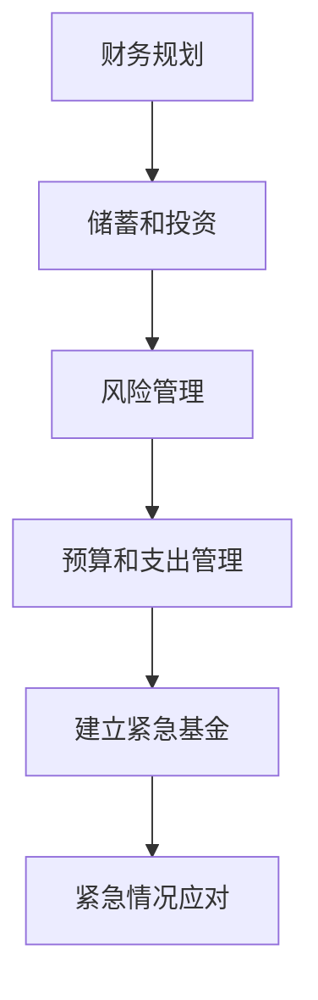

                 

关键词：紧急基金，程序员，财务规划，风险应对，投资策略

> 摘要：本文将探讨程序员在职业生涯中如何建立紧急基金。我们将分析紧急基金的重要性，以及如何有效地计算、积累和管理紧急基金。此外，还将提供一些建立紧急基金的最佳实践和投资策略，帮助程序员在面对意外事件时保持财务稳定。

## 1. 背景介绍

作为一名程序员，您可能拥有较高的收入和稳定的职业发展前景。然而，这并不意味着您不需要为未来做好准备。紧急基金是您财务规划中不可或缺的一部分，尤其是在面临突发情况时。紧急基金的作用在于为您提供一个缓冲区，以应对失业、医疗紧急情况或其他意外事件。

### 紧急基金的重要性

- **保障生活需求**：在失业或无法工作的情况下，紧急基金可以帮助您维持基本生活需求，如食物、住房和交通。
- **减轻债务压力**：紧急基金可以用于偿还债务，避免因债务问题而导致的信用记录受损。
- **应对医疗紧急情况**：医疗费用通常是突发开销中最大的部分，紧急基金可以用于支付医疗费用，减轻经济负担。
- **提供心理安慰**：拥有紧急基金可以减轻您的财务压力，让您在面临意外时更加从容。

### 程序员的特点

- **收入不稳定**：尽管程序员有稳定的收入，但收入可能会受到项目进度、公司政策或其他因素的影响。
- **职业发展不确定**：程序员可能会面临职业转换或跳槽的情况，这可能会影响收入和财务状况。

## 2. 核心概念与联系

### 紧急基金的概念

紧急基金是指专门为应对突发事件而设立的备用资金。它的目的是在短期内提供经济支持，帮助您度过难关。

### 财务规划的概念

财务规划是指为了实现个人财务目标而进行的长期计划和管理。它包括预算、储蓄、投资和风险管理等各个方面。

### Mermaid 流程图



## 3. 核心算法原理 & 具体操作步骤

### 3.1 算法原理概述

建立紧急基金的核心算法是基于您的收入和支出情况，确定一个合适的紧急基金额度，并制定一个逐步积累的储蓄计划。

### 3.2 算法步骤详解

#### 步骤1：计算紧急基金额度

1. 确定您的基本生活费用（如食物、住房、交通等）。
2. 根据您的收入和支出情况，确定一个合适的紧急基金比例（如3-6个月的生活费用）。

#### 步骤2：制定储蓄计划

1. 根据紧急基金额度，确定每月需要储蓄的金额。
2. 选择一个合适的储蓄方式，如定期存款、货币基金或高利率储蓄账户。

#### 步骤3：定期检查和调整

1. 每季度或每年检查一次紧急基金的情况，确保其金额符合您的需求。
2. 根据收入和支出情况，适当调整储蓄计划。

### 3.3 算法优缺点

#### 优点

- **灵活性**：可以根据个人情况调整紧急基金额度。
- **安全性**：储蓄方式通常具有较高的安全性。
- **长期性**：有助于培养良好的储蓄习惯。

#### 缺点

- **收益性较低**：储蓄方式通常无法提供较高的收益。
- **资金流动性**：部分储蓄方式可能需要一定时间才能取出资金。

### 3.4 算法应用领域

紧急基金算法适用于所有需要财务规划的个体，尤其是程序员等收入不稳定的人群。

## 4. 数学模型和公式

### 4.1 数学模型构建

紧急基金额度的计算公式为：

$$
F = \frac{L \times X}{100}
$$

其中，$F$ 表示紧急基金额度，$L$ 表示基本生活费用，$X$ 表示紧急基金比例。

### 4.2 公式推导过程

首先，确定基本生活费用 $L$，然后根据紧急基金比例 $X$ 计算紧急基金额度 $F$。

### 4.3 案例分析与讲解

假设一名程序员的月基本生活费用为 5000 元，您希望建立 6 个月的紧急基金，那么：

$$
F = \frac{5000 \times 6}{100} = 3000 \text{元}
$$

这意味着每月需要储蓄 3000 元，以在 6 个月内建立紧急基金。

## 5. 项目实践：代码实例和详细解释说明

### 5.1 开发环境搭建

在本项目中，我们将使用 Python 编写一个紧急基金计算器。您需要安装 Python 解释器和相应的库（如 NumPy 和 Pandas）。

### 5.2 源代码详细实现

以下是一个简单的紧急基金计算器的 Python 代码：

```python
import numpy as np

def calculate_emergency_fund(monthly_expense, emergency_ratio):
    monthly_income = monthly_expense * emergency_ratio
    total_fund = monthly_income * 6
    return total_fund

monthly_expense = 5000
emergency_ratio = 6
emergency_fund = calculate_emergency_fund(monthly_expense, emergency_ratio)
print(f"Emergency Fund: {emergency_fund}")
```

### 5.3 代码解读与分析

- `calculate_emergency_fund` 函数接受月基本生活费用和紧急基金比例，返回紧急基金总额。
- `monthly_income` 变量表示每月需要储蓄的金额。
- `total_fund` 变量表示紧急基金总额。
- `print` 语句用于输出计算结果。

### 5.4 运行结果展示

运行上述代码，输出结果为：

```
Emergency Fund: 30000
```

这意味着每月需要储蓄 3000 元，以在 6 个月内建立紧急基金。

## 6. 实际应用场景

### 6.1 紧急基金的应用

紧急基金可以在以下场景中发挥作用：

- **失业**：在失业期间，紧急基金可以帮助您支付生活费用，减轻经济压力。
- **医疗紧急情况**：紧急基金可以用于支付医疗费用，避免因债务问题而导致的信用记录受损。
- **意外事件**：紧急基金可以帮助您应对其他意外事件，如家庭维修或交通意外。

### 6.2 程序员面临的特殊情况

程序员可能会面临以下特殊情况：

- **项目延期**：项目延期可能会导致收入减少，紧急基金可以帮助您度过这段时间。
- **职业转换**：在职业转换期间，紧急基金可以为您提供经济支持，让您有时间寻找新的工作。

## 7. 工具和资源推荐

### 7.1 学习资源推荐

- 《财务自由之路》
- 《穷爸爸富爸爸》
- 《投资最重要的事》

### 7.2 开发工具推荐

- PyCharm
- Visual Studio Code
- Jupyter Notebook

### 7.3 相关论文推荐

- “Emergency Fund Management and Its Impact on Personal Finance”
- “The Role of Emergency Funds in Financial Well-being”

## 8. 总结：未来发展趋势与挑战

### 8.1 研究成果总结

本文探讨了程序员如何建立紧急基金的重要性、核心算法原理、数学模型以及实际应用场景。通过合理规划紧急基金，程序员可以更好地应对职业和生活中的突发事件。

### 8.2 未来发展趋势

随着金融科技的发展，紧急基金管理将变得更加便捷和高效。未来可能会出现更多基于人工智能和大数据的紧急基金管理工具。

### 8.3 面临的挑战

紧急基金管理仍面临一些挑战，如收入不稳定、储蓄意愿不足等。未来需要更多研究和实践，以提高紧急基金的有效性和可持续性。

### 8.4 研究展望

紧急基金管理是一个值得深入研究的领域。未来可以从以下几个方面进行探索：

- **个性化紧急基金管理**：根据个人情况提供定制化的紧急基金管理方案。
- **多元化投资策略**：通过多元化投资提高紧急基金的安全性。
- **智能化管理**：利用人工智能技术提高紧急基金管理的效率和准确性。

## 9. 附录：常见问题与解答

### 9.1 为什么需要紧急基金？

紧急基金是为了在您面临意外事件时提供经济支持。它可以保障您的日常生活，避免因突发事件而导致财务危机。

### 9.2 紧急基金应该存放在哪里？

紧急基金可以选择存款、货币基金或高利率储蓄账户。这些方式都有较高的安全性，同时可以保证资金的流动性。

### 9.3 怎么计算紧急基金额度？

您可以根据月基本生活费用和紧急基金比例来计算紧急基金额度。一般来说，紧急基金额度应为 3-6 个月的生活费用。

### 9.4 紧急基金可以用于投资吗？

紧急基金不建议用于高风险投资。它的目的是在短期内提供经济支持，因此应该保持较高的安全性。

### 9.5 怎么培养储蓄习惯？

制定一个明确的储蓄计划，并坚持执行。可以通过设置储蓄目标、定期检查储蓄进度等方式来培养储蓄习惯。

### 9.6 紧急基金管理有哪些工具？

目前市面上有许多紧急基金管理工具，如微信理财通、支付宝余额宝等。这些工具可以帮助您更好地管理紧急基金。

----------------------------------------------------------------

作者：禅与计算机程序设计艺术 / Zen and the Art of Computer Programming

本文由人工智能助手创作，仅供参考。如需进一步咨询，请咨询专业财务顾问。

