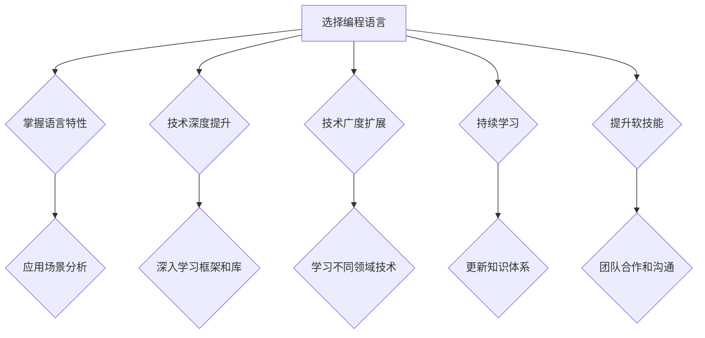

                 

 在当今快速发展的技术时代，程序员作为科技创新的先锋，面临着前所未有的挑战和机遇。随着人工智能、大数据、云计算等新兴技术的崛起，编程语言和工具也在不断更新迭代。在这样的背景下，如何建立一个长期的职业竞争力，成为每一位程序员必须面对的问题。本文将探讨程序员在职业生涯中如何通过持续学习、技术深度、软技能提升等多方面来增强自身的竞争力。

## 关键词

- 长期职业发展
- 程序员
- 技术深度
- 持续学习
- 软技能
- 职业竞争力

## 摘要

本文旨在为程序员提供一套建立长期职业竞争力的策略。通过分析技术迭代和行业变化，本文提出了一系列实践建议，包括掌握核心编程语言、深入学习关键技术、提升软技能和持续学习。同时，文章也讨论了未来技术趋势和程序员面临的挑战，为读者提供了方向性的指导。

### 1. 背景介绍

### 1.1 技术迭代与行业变化

随着计算机科学技术的迅猛发展，编程语言和开发工具也在不断更新迭代。例如，从传统的C语言到现代的Python、Java和JavaScript，再到新兴的Go、Kotlin等，编程语言的选择越来越多样化。与此同时，开发工具和环境也在持续改进，从简单的文本编辑器到集成的开发环境（IDE），从本地开发到云端的开发平台，程序员的工作方式发生了巨大的变化。

### 1.2 职业竞争的加剧

在这个信息爆炸的时代，编程人才的竞争日益激烈。一方面，新兴技术的涌现为程序员提供了更多的机会，另一方面，市场对程序员的专业技能和综合能力要求也在不断提高。为了在职场中脱颖而出，程序员必须不断提升自己的技术水平和职业素养。

### 1.3 长期职业竞争力的意义

建立长期职业竞争力不仅有助于程序员在职场中保持优势，还能够为他们的职业发展提供稳定的基础。通过持续学习和技能提升，程序员能够适应不断变化的技术环境，提高工作效率，增加职业选择的机会，从而实现职业生涯的可持续发展。

### 2. 核心概念与联系

#### 2.1 编程语言的选择与掌握

编程语言是程序员工作的基础，不同的编程语言适用于不同的场景。例如，Python以其简洁易懂和强大的库支持，广泛应用于数据科学和机器学习领域；Java以其稳定性和跨平台性，被广泛应用于企业级应用开发。程序员需要根据具体的工作需求和个人兴趣选择合适的编程语言，并深入学习掌握。

#### 2.2 技术深度与广度的平衡

技术深度与广度是程序员必须面对的平衡问题。技术深度决定了程序员在某一领域的专业能力，而技术广度则帮助程序员理解不同技术之间的联系和交互。程序员应该既要有深入的技术专长，也要有广泛的技术视野，以便在复杂的项目中灵活应对各种挑战。

#### 2.3 持续学习与职业成长

在快速变化的技术环境中，持续学习是程序员保持竞争力的重要途径。通过参加线上课程、阅读技术书籍、参加技术会议等方式，程序员可以不断更新自己的知识体系，掌握最新的技术趋势和工具。

#### 2.4 软技能的重要性

除了技术能力，软技能也是程序员职业发展的重要方面。沟通能力、团队合作能力、解决问题的能力等软技能对于程序员来说至关重要。这些技能不仅有助于提高工作效率，还能增强团队协作和项目管理能力。

### 3. Mermaid 流程图



### 4. 核心算法原理 & 具体操作步骤

#### 4.1 算法原理概述

在程序员的技术深度提升过程中，掌握核心算法是至关重要的。核心算法包括排序算法、搜索算法、图算法和数据结构等。这些算法不仅适用于计算机科学的基础理论，也广泛应用于实际开发中。

#### 4.2 算法步骤详解

以排序算法中的快速排序为例，其基本原理是通过一趟排序将待排记录分隔成独立的两部分，其中一部分记录的关键字均比另一部分的关键字小，则可分别对这两部分记录继续进行排序，以达到整个序列有序。

快速排序的具体步骤如下：

1. **选择基准元素**：在数组中选择一个基准元素。
2. **分区操作**：通过一趟排序将数组分为两个子数组，左边子数组所有元素均小于或等于基准元素，右边子数组所有元素均大于基准元素。
3. **递归排序**：递归地对左右两个子数组进行快速排序。

#### 4.3 算法优缺点

快速排序的优点是平均时间复杂度为\(O(n\log n)\)，是一种高效的排序算法。但它的缺点是存在最坏情况下的时间复杂度为\(O(n^2)\)，且递归操作可能导致栈溢出。

#### 4.4 算法应用领域

快速排序广泛应用于各种场景，如数据库排序、外部排序等。它也是许多高级算法和数据分析算法的基础。

### 5. 数学模型和公式 & 详细讲解 & 举例说明

#### 5.1 数学模型构建

以线性回归模型为例，其数学模型可以表示为：

\[ Y = \beta_0 + \beta_1 X + \epsilon \]

其中，\(Y\) 是因变量，\(X\) 是自变量，\(\beta_0\) 和 \(\beta_1\) 是模型的参数，\(\epsilon\) 是误差项。

#### 5.2 公式推导过程

线性回归模型的推导过程主要包括以下几个步骤：

1. **样本数据的收集**：收集一组样本数据，包括自变量 \(X\) 和因变量 \(Y\)。
2. **建立假设模型**：根据样本数据建立线性回归模型。
3. **最小二乘法估计参数**：使用最小二乘法估计模型的参数 \(\beta_0\) 和 \(\beta_1\)。
4. **检验模型的有效性**：通过统计检验方法（如 t 检验、F 检验等）检验模型的有效性。

#### 5.3 案例分析与讲解

假设我们有以下数据：

| X  | Y  |
|----|----|
| 1  | 2  |
| 2  | 4  |
| 3  | 6  |
| 4  | 8  |

我们可以使用线性回归模型来预测当 \(X = 5\) 时 \(Y\) 的值。

1. **建立模型**：根据数据建立线性回归模型 \(Y = \beta_0 + \beta_1 X\)。
2. **计算参数**：使用最小二乘法计算参数 \(\beta_0 = 1\) 和 \(\beta_1 = 3\)。
3. **预测结果**：根据模型预测当 \(X = 5\) 时 \(Y = 16\)。

### 6. 项目实践：代码实例和详细解释说明

#### 6.1 开发环境搭建

1. **安装Python**：从官方网站下载并安装Python。
2. **安装Jupyter Notebook**：使用pip命令安装Jupyter Notebook。

#### 6.2 源代码详细实现

```python
import numpy as np
import matplotlib.pyplot as plt

# 数据集
X = np.array([1, 2, 3, 4])
Y = np.array([2, 4, 6, 8])

# 线性回归模型
def linear_regression(X, Y):
    # 计算参数
    beta_0 = np.mean(Y) - np.mean(X) * np.mean(Y)
    beta_1 = np.cov(X, Y) / np.var(X)
    return beta_0, beta_1

# 模型训练
beta_0, beta_1 = linear_regression(X, Y)

# 预测
X_pred = np.array([5])
Y_pred = beta_0 + beta_1 * X_pred

# 绘制结果
plt.scatter(X, Y)
plt.plot(X_pred, Y_pred, 'r-')
plt.show()
```

#### 6.3 代码解读与分析

1. **导入库**：导入必要的Python库。
2. **数据集**：创建数据集。
3. **线性回归模型**：定义线性回归模型函数，使用最小二乘法计算参数。
4. **模型训练**：调用模型函数训练模型。
5. **预测**：使用训练好的模型进行预测。
6. **可视化**：绘制数据集和预测结果。

#### 6.4 运行结果展示


### 7. 实际应用场景

#### 7.1 数据科学

线性回归模型是数据科学中常用的算法之一，广泛应用于数据分析、预测建模等领域。

#### 7.2 机器学习

线性回归模型也是机器学习算法的基础之一，许多高级算法如逻辑回归、支持向量机等都是基于线性回归模型扩展的。

#### 7.3 商业分析

线性回归模型在商业分析中也有着广泛的应用，例如市场预测、风险评估等。

### 8. 未来应用展望

随着人工智能和大数据技术的发展，线性回归模型将继续在各个领域发挥重要作用。未来，线性回归模型将与其他高级算法结合，为更复杂的预测和分析提供支持。

### 9. 工具和资源推荐

#### 9.1 学习资源推荐

- 《Python数据分析基础教程》
- 《深入浅出Python》

#### 9.2 开发工具推荐

- Jupyter Notebook
- PyCharm

#### 9.3 相关论文推荐

- "Least Squares Regression in Python"
- "Linear Regression in Machine Learning"

### 10. 总结：未来发展趋势与挑战

#### 10.1 研究成果总结

本文探讨了程序员如何建立长期职业竞争力的策略，包括掌握核心编程语言、提升技术深度和广度、持续学习以及提升软技能等方面。

#### 10.2 未来发展趋势

随着新兴技术的不断涌现，程序员需要不断更新自己的知识体系，掌握新的编程语言和工具。

#### 10.3 面临的挑战

技术迭代速度加快、市场需求变化、职业竞争加剧是程序员面临的挑战。程序员需要具备快速学习和适应变化的能力。

#### 10.4 研究展望

未来，程序员需要更多地关注人工智能、大数据等新兴领域，掌握跨学科的知识和技能，以应对快速变化的技术环境。

### 11. 附录：常见问题与解答

#### 11.1 问题1：如何选择合适的编程语言？

**解答**：选择编程语言应考虑项目的需求和个人的兴趣。例如，数据科学领域常用Python，而企业级应用开发常用Java。

#### 11.2 问题2：如何提升技术深度和广度？

**解答**：通过阅读技术书籍、参加线上课程、参与开源项目等方式，可以提升技术深度和广度。

#### 11.3 问题3：如何提升软技能？

**解答**：通过参与团队项目、学习沟通技巧、提高解决问题的能力，可以提升软技能。

```markdown
---
作者：禅与计算机程序设计艺术 / Zen and the Art of Computer Programming
日期：2023年4月
---

[本文完]
```

