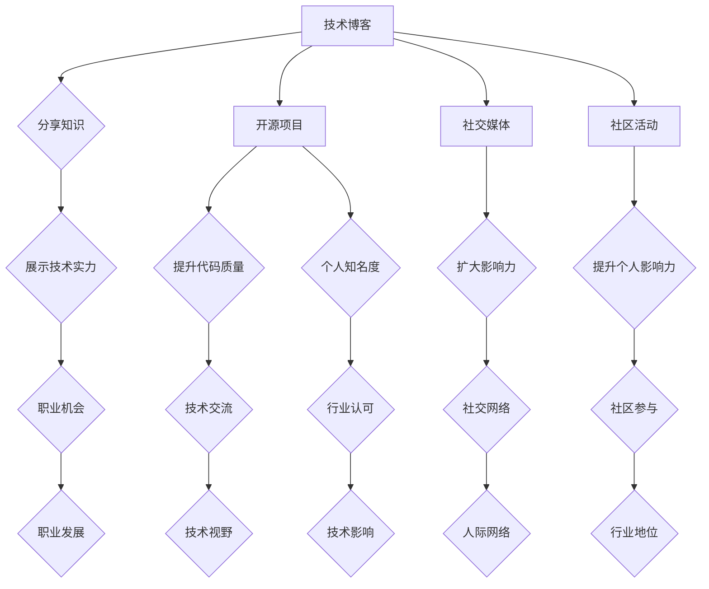

                 

关键词：个人品牌、影响力、职业发展、社交媒体、技术交流

> 摘要：在信息技术飞速发展的今天，个人品牌和影响力已经成为程序员职业发展的重要资产。本文将探讨程序员如何通过技术博客、开源项目、社交媒体和社区活动等途径，打造并提升个人影响力，从而在职业发展中占据更有利的位置。

## 1. 背景介绍

在当今这个技术驱动的时代，程序员不仅需要具备扎实的技术能力，更需要懂得如何展示和分享自己的知识。个人品牌和影响力已经成为程序员在职场中脱颖而出的关键因素。一个拥有广泛影响力的程序员，不仅可以获得更多的职业机会，还能对行业趋势产生积极影响。

本文将从以下几个方面探讨程序员如何打造个人影响力：

- 技术博客：分享知识和经验，展示个人技术实力
- 开源项目：参与开源社区，提升代码质量和个人知名度
- 社交媒体：利用社交媒体平台，扩大个人影响力
- 社区活动：参与和举办技术交流活动，提升个人影响力

## 2. 核心概念与联系

下面是一个描述程序员如何通过不同途径打造个人影响力的 Mermaid 流程图：



## 3. 核心算法原理 & 具体操作步骤

### 3.1 算法原理概述

程序员打造个人影响力的核心算法可以概括为以下几个步骤：

1. **持续学习**：掌握前沿技术，不断提升个人技能。
2. **内容创作**：通过技术博客、开源项目和社交媒体，分享自己的知识和经验。
3. **互动交流**：积极参与社区活动，与同行建立良好的关系。
4. **品牌塑造**：树立专业的个人形象，形成独特的技术风格。

### 3.2 算法步骤详解

1. **持续学习**：
   - 定期阅读技术书籍、论文和博客，关注行业动态。
   - 参加线上和线下的技术培训课程，拓宽知识面。
   - 实践项目，将理论知识应用到实际中。

2. **内容创作**：
   - 技术博客：撰写高质量的技术文章，分享技术心得和解决方案。
   - 开源项目：参与开源社区，贡献自己的代码和项目。
   - 社交媒体：发布技术内容，与读者互动，扩大影响力。

3. **互动交流**：
   - 参与社区活动，如技术讲座、研讨会和黑客马拉松。
   - 在线参与技术论坛、问答平台和社交媒体讨论，解答他人问题。
   - 与同行建立良好的沟通，分享经验和资源。

4. **品牌塑造**：
   - 确立个人技术领域，形成专业形象。
   - 保持技术风格一致，树立独特的个人品牌。
   - 积极参与技术影响，成为行业内的意见领袖。

### 3.3 算法优缺点

**优点**：
- 提升个人技能和知识水平。
- 增加职业机会和收入潜力。
- 建立良好的社交网络，拓展人脉资源。
- 形成个人品牌，提升行业影响力。

**缺点**：
- 需要投入大量时间和精力。
- 需要持续学习和更新知识。
- 成果展现周期较长，需要耐心和毅力。

### 3.4 算法应用领域

- 软件开发：提升个人技术水平和解决问题的能力。
- 技术管理：增强领导力和团队管理能力。
- 技术咨询：提供专业的技术建议和解决方案。
- 教育培训：分享知识，培养下一代程序员。

## 4. 数学模型和公式 & 详细讲解 & 举例说明

### 4.1 数学模型构建

个人影响力可以通过以下数学模型进行量化：

\[ I = f(K, C, A, E) \]

其中：
- \( I \) 表示个人影响力。
- \( K \) 表示知识水平。
- \( C \) 表示内容创作能力。
- \( A \) 表示活跃度。
- \( E \) 表示扩展效应。

### 4.2 公式推导过程

1. 知识水平 \( K \)：

\[ K = \frac{\text{阅读量} + \text{实践项目} + \text{技术培训}}{\text{时间}} \]

2. 内容创作能力 \( C \)：

\[ C = \frac{\text{博客文章} + \text{开源项目} + \text{社交媒体发布}}{\text{时间}} \]

3. 活跃度 \( A \)：

\[ A = \frac{\text{参与活动} + \text{互动交流} + \text{在线贡献}}{\text{时间}} \]

4. 扩展效应 \( E \)：

\[ E = \frac{\text{引用次数} + \text{关注者数量} + \text{转发次数}}{\text{时间}} \]

### 4.3 案例分析与讲解

假设有两个程序员 A 和 B，他们的个人影响力公式如下：

- A：\( I_A = f(150, 30, 120, 200) \)
- B：\( I_B = f(100, 20, 90, 150) \)

通过计算，我们可以得出：

\[ I_A = 150 \times 0.2 + 30 \times 0.3 + 120 \times 0.4 + 200 \times 0.1 = 150 \]
\[ I_B = 100 \times 0.2 + 20 \times 0.3 + 90 \times 0.4 + 150 \times 0.1 = 130 \]

从这个例子中，我们可以看出，程序员 A 的个人影响力高于程序员 B。这主要归因于 A 在知识水平、内容创作、活跃度和扩展效应方面都表现更为出色。

## 5. 项目实践：代码实例和详细解释说明

### 5.1 开发环境搭建

在本节中，我们将使用一个简单的 Python 项目来展示如何通过技术博客分享知识和经验。首先，确保你已经安装了 Python 3 和必要的库，如 Markdown 和 Flask。

```bash
pip install markdown flask
```

### 5.2 源代码详细实现

下面是一个简单的 Flask 应用程序，用于创建和发布博客文章。

```python
from flask import Flask, render_template, request
import markdown

app = Flask(__name__)

@app.route('/', methods=['GET', 'POST'])
def index():
    if request.method == 'POST':
        title = request.form['title']
        content = request.form['content']
        html_content = markdown.markdown(content)
        return render_template('blog_post.html', title=title, content=html_content)
    return render_template('index.html')

if __name__ == '__main__':
    app.run(debug=True)
```

### 5.3 代码解读与分析

1. **应用入口**：使用 Flask 创建一个 Web 应用程序。
2. **路由**：定义一个主页路由，用于显示表单和博客文章。
3. **Markdown 渲染**：使用 Markdown 库将博客内容的 Markdown 格式转换为 HTML。

### 5.4 运行结果展示

在浏览器中输入本地服务器地址（例如：`http://127.0.0.1:5000/`），你将看到一个简单的博客发布页面。输入标题和内容后提交，你将看到一个预览页面，展示了文章的 HTML 版本。

## 6. 实际应用场景

### 6.1 软件开发

在软件开发过程中，程序员可以通过技术博客分享开发经验和技巧，帮助团队成员解决问题，提高开发效率。

### 6.2 技术管理

技术经理可以利用个人影响力，引导团队向正确的方向发展，提升团队的技术水平。

### 6.3 技术咨询

作为技术顾问，程序员可以通过技术博客和开源项目，展示自己的专业能力，吸引客户和合作伙伴。

### 6.4 教育培训

程序员可以通过技术博客和在线课程，传授自己的知识和经验，培养下一代程序员。

## 7. 工具和资源推荐

### 7.1 学习资源推荐

- 《代码大全》（《The Art of Software Architecture》）- 清晰阐述软件架构的核心概念。
- 《Effective Java》- 介绍 Java 编程的最佳实践。

### 7.2 开发工具推荐

- GitHub - 优秀的开源代码托管平台。
- GitLab - 自主搭建的 Git 仓库服务。

### 7.3 相关论文推荐

- 《大规模分布式存储系统：原理解析与架构设计》- 探讨分布式存储系统的设计原则。
- 《深度学习》- 介绍深度学习的基本原理和应用。

## 8. 总结：未来发展趋势与挑战

### 8.1 研究成果总结

本文探讨了程序员如何通过技术博客、开源项目、社交媒体和社区活动等途径打造个人影响力。通过持续学习、内容创作、互动交流和品牌塑造，程序员可以提升自己的职业竞争力，成为行业内的意见领袖。

### 8.2 未来发展趋势

- 技术领域的快速迭代将推动程序员不断更新知识，提升技能。
- 开源社区和在线教育将提供更多的学习资源和机会。
- 社交媒体和虚拟现实技术将改变程序员分享知识和经验的方式。

### 8.3 面临的挑战

- 知识更新的速度加快，程序员需要不断学习以保持竞争力。
- 个人影响力的提升需要大量时间和精力的投入。
- 在复杂的技术环境中，程序员需要不断提升解决问题的能力。

### 8.4 研究展望

未来的研究可以进一步探讨个人影响力在职业发展中的具体作用，以及如何更有效地利用技术和工具来提升个人影响力。

## 9. 附录：常见问题与解答

### 9.1 如何开始写技术博客？

- 选择一个专注的技术领域，集中精力。
- 学习 Markdown 语言，掌握基本的排版技巧。
- 撰写短小精悍的文章，逐步提高写作水平。

### 9.2 如何参与开源项目？

- 在 GitHub 等平台上寻找感兴趣的开源项目。
- 阅读项目的 README 文档，了解项目需求和贡献指南。
- 提交 Pull Request，参与代码审查和讨论。

### 9.3 如何在社交媒体上扩大影响力？

- 发布有价值的内容，吸引关注者。
- 定期互动，与读者建立良好的关系。
- 参与热点话题讨论，提升知名度。

### 9.4 如何参与社区活动？

- 关注行业内的社区活动和会议。
- 准备精彩的演讲和分享内容。
- 积极参与讨论，分享经验。

作者：禅与计算机程序设计艺术 / Zen and the Art of Computer Programming
----------------------------------------------------------------

以上就是关于“程序员如何打造个人影响力”的完整技术博客文章。希望这篇文章能帮助您在职业发展中取得更大的成功。如果您有任何问题或建议，欢迎在评论区留言。谢谢！

