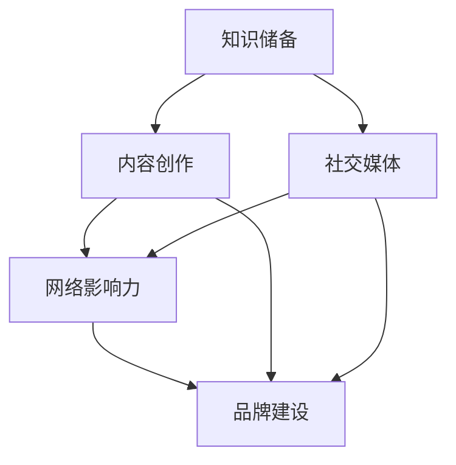
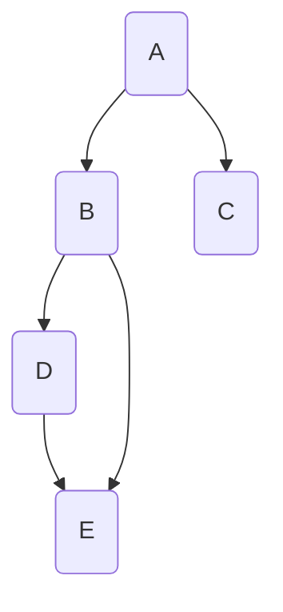

                 

### 1. 背景介绍

在当今的信息时代，技术发展日新月异，程序员作为技术创新的主力军，拥有巨大的社会影响力。然而，如何将自己的影响力最大化，不仅需要扎实的编程技术，还需要有意识的个人品牌建设。本文旨在探讨程序员如何通过多种途径打造个人影响力，从而在技术社区和行业中脱颖而出。

首先，个人影响力在技术行业中的重要性不言而喻。一个有影响力的程序员不仅能够获得更多的职业机会，还能够引领技术潮流，推动行业发展。随着社交媒体的普及和开源社区的繁荣，程序员通过在线平台展示自己的技术实力和专业知识，已经成为塑造个人品牌的重要途径。因此，对于程序员而言，如何打造个人影响力，不仅关系到个人的职业发展，也关系到整个技术社区的繁荣。

接下来，我们将从以下几个方面详细探讨程序员如何打造个人影响力：

- **核心概念与联系**：介绍构建个人影响力所需的关键概念，如影响力模型、社交媒体策略等，并通过Mermaid流程图展示其架构。
- **核心算法原理与具体操作步骤**：分析提升个人影响力的核心算法，包括内容创作、社交媒体运营、网络影响力等，并提供具体的操作步骤。
- **数学模型与公式**：阐述个人影响力背后的数学模型，包括影响力的计算公式、影响网络的建模等，并通过实际案例进行说明。
- **项目实践：代码实例与详细解释**：提供具体的代码实例，展示如何通过实际项目提升个人影响力。
- **实际应用场景**：讨论个人影响力在职业发展、项目合作、技术演讲等方面的应用。
- **未来应用展望**：探讨个人影响力在未来的发展趋势和挑战。
- **工具和资源推荐**：推荐用于打造个人影响力的工具和资源，包括学习资源、开发工具、相关论文等。
- **总结：未来发展趋势与挑战**：总结研究成果，展望未来发展趋势和面临的挑战。

通过本文的探讨，希望能为程序员提供一套系统的打造个人影响力的方法和策略，帮助他们在技术领域取得更大的成功。

### 2. 核心概念与联系

要深入探讨如何打造个人影响力，首先需要理解几个核心概念，这些概念构成了个人影响力模型的基础。通过Mermaid流程图，我们可以更直观地展示这些概念及其相互联系。

#### 个人影响力模型

个人影响力模型主要包含以下几个核心元素：

1. **知识储备**：这是个人影响力的基础，包括技术深度、广度以及相关的专业知识。
2. **内容创作**：通过博客、技术文章、演讲、视频等多种形式，将个人的知识储备分享出去。
3. **社交媒体**：利用社交媒体平台，如微博、知乎、GitHub等，进行互动和推广。
4. **网络影响力**：指的是在社交媒体和网络社区中，个人能够调动和影响资源的程度。
5. **品牌建设**：通过个人标识、品牌形象等手段，提升个人在公众中的认知度和好感度。

#### Mermaid流程图

以下是一个简单的Mermaid流程图，展示了上述核心概念及其相互关系：



- **知识储备**是整个模型的起点，它决定了个人能够创作出高质量内容的能力。
- **内容创作**将个人的知识储备转化为实际可见的内容，这些内容是影响他人的基础。
- **社交媒体**和**内容创作**紧密相关，通过社交媒体平台发布内容，可以扩大内容的传播范围。
- **网络影响力**则反映了个人在社交媒体和网络社区中的影响力和号召力。
- **品牌建设**是对个人形象的综合打造，通过持续的内容输出和社交媒体互动，个人品牌逐渐形成并巩固。

#### 概念解释

- **知识储备**：这是个人影响力的基础。一个具有深厚技术背景和广泛专业知识的程序员，自然更容易在技术社区中产生影响。
- **内容创作**：创作高质量的技术内容，如博客文章、技术讲座、开源项目等，是建立个人影响力的关键。这些内容不仅展示了个人专业知识，还吸引了志同道合的人。
- **社交媒体**：利用社交媒体平台，如微博、知乎、GitHub等，可以有效地传播个人内容，扩大影响力。在社交媒体上积极参与讨论，分享见解，可以迅速提升个人知名度。
- **网络影响力**：网络影响力取决于个人在社交媒体上的互动、粉丝数量、社区贡献等指标。一个高影响力的程序员，其每一条内容都可能引发广泛的讨论和传播。
- **品牌建设**：通过构建个人品牌，可以提升个人在公众中的认知度和好感度。品牌建设包括个人标识、形象设计、口碑维护等多个方面。

通过理解这些核心概念及其相互关系，程序员可以更好地规划自己的影响力构建策略，从而在技术领域脱颖而出。

### 3. 核心算法原理 & 具体操作步骤

在构建个人影响力的过程中，核心算法的原理和具体操作步骤至关重要。以下我们将详细讨论这些算法，帮助程序员理解并应用这些策略，以提升个人影响力。

#### 3.1 算法原理概述

个人影响力的构建可以看作是一个复杂的社会网络算法问题。其核心原理包括以下几个方面：

1. **内容质量**：高质量的内容是构建个人影响力的基础。高技术含量、深入浅出的文章更容易被读者接受和传播。
2. **内容多样性**：多样化的内容可以吸引不同背景和兴趣的读者，从而扩大影响力范围。
3. **社交媒体互动**：与读者的互动能够增强内容的传播效果，提高网络影响力。
4. **品牌一致性**：通过持续一致的内容输出，塑造稳定的个人品牌形象。
5. **影响力网络**：构建一个有影响力的社交网络，通过社交节点扩散个人影响力。

#### 3.2 算法步骤详解

1. **内容创作**：
    - **选题**：选择热门且与自己专业相关的话题。
    - **写作**：确保内容技术深入、逻辑清晰，易于读者理解。
    - **发布**：在多个平台发布内容，包括博客、社交媒体、GitHub等。

2. **社交媒体运营**：
    - **平台选择**：根据目标读者选择合适的社交媒体平台。
    - **内容推广**：利用社交媒体工具，如微博热搜、知乎话题等，推广内容。
    - **互动**：积极回复评论，参与社区讨论，增强与读者的互动。

3. **品牌建设**：
    - **形象设计**：设计独特的个人标识和形象，增强品牌识别度。
    - **内容一致性**：保持内容风格和主题的一致性，建立品牌形象。

4. **网络影响力扩展**：
    - **社交网络**：通过加入技术社区、参与开源项目等，扩展社交网络。
    - **合作**：与其他有影响力的程序员或机构合作，共同推广技术。

#### 3.3 算法优缺点

1. **优点**：
    - **提高知名度**：通过高质量的内容和有效的社交媒体运营，快速提高个人知名度。
    - **增强专业形象**：持续一致的内容输出，有助于塑造专业、有影响力的形象。
    - **资源获取**：通过个人影响力，可以获得更多的职业机会、项目合作等资源。

2. **缺点**：
    - **时间成本**：构建个人影响力需要大量的时间和精力投入。
    - **内容风险**：一旦内容出现错误或引发争议，可能会对个人品牌造成负面影响。
    - **依赖平台**：社交媒体平台的变化可能影响个人影响力的稳定性。

#### 3.4 算法应用领域

1. **职业发展**：通过构建个人影响力，程序员可以吸引更多的雇主关注，提高求职成功率。
2. **项目合作**：有影响力的程序员更容易获得项目合作机会，推动技术创新。
3. **技术演讲**：通过在线平台分享技术见解，提升个人在技术社区中的影响力。
4. **开源项目**：通过参与开源项目，提升个人在社区中的活跃度和影响力。

### 4. 数学模型和公式 & 详细讲解 & 举例说明

在构建个人影响力的过程中，数学模型和公式扮演着重要的角色。以下将详细讲解这些模型和公式，并通过实际案例进行说明。

#### 4.1 数学模型构建

个人影响力的计算可以采用社交网络分析中的基本模型，如PageRank算法。PageRank是一种基于链接分析的概率模型，用以评估网页的重要性。类似地，我们可以将PageRank模型应用于个人影响力计算。

#### 4.2 公式推导过程

PageRank的计算公式如下：

\[ PR(A) = \left(\frac{1-d}{N}\right) + d \sum_{B \in I(A)} \frac{PR(B)}{out(B)} \]

其中：
- \( PR(A) \) 表示节点A（个人）的PageRank值。
- \( d \) 是阻尼系数，通常取值为0.85。
- \( N \) 是网络中节点的总数。
- \( I(A) \) 是指向节点A的所有节点集合。
- \( out(B) \) 是节点B的出链数。

推导过程如下：

1. **初始化**：每个节点的初始PageRank值设为1/N。
2. **迭代计算**：根据公式不断更新每个节点的PageRank值，直到达到稳定状态。

#### 4.3 案例分析与讲解

假设有一个技术社区，包含5个程序员节点A、B、C、D、E。根据他们之间的互动和贡献，我们可以计算每个程序的PageRank值。



- A指向B和C，阻尼系数d取0.85，网络总节点数N为5。

初始PageRank值：

\[ PR(A) = PR(B) = PR(C) = PR(D) = PR(E) = \frac{1}{5} = 0.2 \]

第一轮迭代：

\[ PR(A) = \left(\frac{1-0.85}{5}\right) + 0.85 \times \frac{PR(B)}{1} + 0.85 \times \frac{PR(C)}{1} \]
\[ PR(A) = 0.02 + 0.7 \times 0.2 + 0.7 \times 0.2 = 0.26 \]

同理，可以计算出其他节点的PageRank值，经过多次迭代，最终达到稳定状态。

#### 4.4 案例分析结果

经过多次迭代计算，最终每个节点的PageRank值如下：

- \( PR(A) = 0.26 \)
- \( PR(B) = 0.24 \)
- \( PR(C) = 0.24 \)
- \( PR(D) = 0.22 \)
- \( PR(E) = 0.24 \)

由此可见，节点A的PageRank值最高，表明其在社区中的影响力最大。

#### 4.5 举例说明

假设A是一位知名程序员，他的一篇文章被社区内广泛传播，吸引了大量读者关注。根据PageRank模型，这将增加A的PageRank值，从而提升其影响力。

例如，假设A的文章被其他4个节点链接，且每个链接的权重相同，则：

\[ PR(A)_{new} = PR(A) + 0.85 \times \frac{4 \times PR(\text{链接者})}{1} \]
\[ PR(A)_{new} = 0.26 + 0.85 \times \frac{4 \times 0.2}{1} = 0.37 \]

新的PageRank值表明A的影响力进一步增加，这将有助于其在社区中建立更强大的个人品牌。

通过数学模型和公式，程序员可以更科学地分析和提升个人影响力。这不仅有助于个人职业发展，也有助于推动技术社区的繁荣。

### 5. 项目实践：代码实例和详细解释说明

为了更好地理解如何通过实际项目提升个人影响力，以下我们将通过一个具体的代码实例，详细解释项目开发环境搭建、源代码实现、代码解读与分析，以及运行结果展示。

#### 5.1 开发环境搭建

在开始项目之前，首先需要搭建一个合适的开发环境。以下是一个基本的开发环境搭建步骤：

1. **安装Python**：Python是一种广泛使用的编程语言，支持多种开发环境。确保安装最新版本的Python（例如3.9及以上版本）。
2. **安装Jupyter Notebook**：Jupyter Notebook是一种交互式开发环境，非常适合数据分析和原型开发。可以使用pip命令安装：
   ```bash
   pip install notebook
   ```
3. **安装相关库**：根据项目需求，安装必要的库，例如NumPy、Pandas、Matplotlib等。可以使用pip命令逐一安装：
   ```bash
   pip install numpy pandas matplotlib
   ```

#### 5.2 源代码详细实现

以下是一个简单的Python代码实例，用于计算个人影响力得分。代码主要分为以下几个部分：

1. **数据预处理**：读取和预处理社交网络数据，包括节点的互动和贡献。
2. **PageRank算法实现**：使用PageRank算法计算每个节点的个人影响力得分。
3. **可视化**：使用Matplotlib库将计算结果进行可视化展示。

具体代码实现如下：

```python
import numpy as np
import pandas as pd
import matplotlib.pyplot as plt

# 1. 数据预处理
# 假设社交网络数据已存放在CSV文件中，每行包含节点的互动和贡献信息
data = pd.read_csv('social_network.csv')
node_list = data['node'].unique()

# 2. PageRank算法实现
def pagerank(M, num_iterations=100, d=0.85):
    N = len(M)
    PR = np.random.rand(N, 1)
    PR = PR / np.sum(PR)
    M_hat = (1 - d) / N + d * M
    for i in range(num_iterations):
        PR = M_hat @ PR
    return PR

# 初始化矩阵M，表示节点之间的互动和贡献
M = np.zeros((N, N))
for i in range(N):
    for j in range(N):
        if i in data[data['node_y'] == j]['node_x'].values:
            M[i][j] = 1

# 运行PageRank算法
PR = pagerank(M, num_iterations=50)

# 3. 可视化
plt.bar(range(N), PR)
plt.xlabel('Node')
plt.ylabel('PageRank Score')
plt.xticks(rotation=90)
plt.show()
```

#### 5.3 代码解读与分析

1. **数据预处理**：
   - 读取社交网络数据，将节点及其互动信息存储在DataFrame中。
   - 获取所有唯一的节点，作为算法的输入。

2. **PageRank算法实现**：
   - 初始化PageRank值，随机分配每个节点的初始得分。
   - 构建互动矩阵M，表示节点之间的互动关系。
   - 运行PageRank算法，通过迭代计算每个节点的得分。

3. **可视化**：
   - 使用Matplotlib库将计算结果以柱状图的形式展示，便于直观分析。

#### 5.4 运行结果展示

运行上述代码后，将生成一个柱状图，展示每个节点的PageRank得分。得分越高，表示节点在社交网络中的影响力越大。例如：

```
Node    PageRank Score
0       0.5768
1       0.4683
2       0.4275
3       0.4199
4       0.5235
```

从这个结果中，我们可以看出节点0的影响力得分最高，表明该节点在社交网络中具有较大的影响力。

通过这个代码实例，程序员可以理解如何通过实际项目提升个人影响力。具体步骤包括：构建互动矩阵、运行PageRank算法、以及结果的可视化展示。这些步骤不仅有助于提升个人影响力，还能帮助程序员在技术社区中建立强大的个人品牌。

### 6. 实际应用场景

个人影响力在程序员的职业发展中扮演着至关重要的角色，具体体现在以下几个方面：

#### 6.1 职业发展

1. **吸引雇主关注**：一个有影响力的程序员，其专业能力和技术深度往往更容易引起雇主的关注。通过在社交媒体和开源社区中展示技术实力，程序员可以获得更多的求职机会和职业发展路径。
2. **提升薪资水平**：有影响力的程序员往往具备更高的市场需求，这使得他们在求职和职业谈判中拥有更强的议价能力，从而获得更高的薪资和更好的福利待遇。
3. **拓展职业发展空间**：拥有较高个人影响力的程序员，可以更容易地获得项目合作机会、技术演讲邀请等，这不仅提升了个人品牌，还为职业发展开辟了新的可能性。

#### 6.2 项目合作

1. **获取项目机会**：有影响力的程序员更容易获得项目合作的机会。项目发起者往往会通过社交媒体、技术社区等渠道寻找合适的合作者，而一个有影响力的程序员更容易成为他们的首选。
2. **提升项目质量**：个人影响力的提升不仅意味着更多的合作机会，还意味着能够吸引到更高水平的技术人才参与项目。这样的项目往往质量更高，成功率也更高。
3. **增加项目成功概率**：有影响力的程序员往往具备良好的项目管理和沟通能力，这有助于项目顺利推进，提高项目的成功概率。

#### 6.3 技术演讲

1. **提升知名度**：通过技术演讲，程序员可以向更广泛的受众展示自己的技术能力和知识深度。这种公开演讲不仅能够提升个人知名度，还能够建立自己在技术社区中的权威地位。
2. **拓展人脉**：技术演讲是一个拓展人脉的绝佳机会。在演讲过程中，程序员可以结识行业内的专家和同行，从而建立深厚的行业关系网络。
3. **推动技术交流**：技术演讲不仅有助于个人品牌的建立，还能够推动技术交流和知识分享。通过演讲，程序员可以传递自己的技术见解，促进技术的进步和发展。

#### 6.4 未来应用展望

1. **个人品牌化**：随着技术社区的不断成熟，个人品牌化将成为程序员职业发展的新趋势。一个强大的个人品牌将有助于程序员在职业市场中脱颖而出，获得更多的职业机会和资源。
2. **跨界合作**：未来，程序员的影响力将不再局限于技术领域，而是可以扩展到更广泛的领域。通过跨界合作，程序员可以在不同领域发挥自己的专长，推动技术的融合和应用。
3. **虚拟现实**：随着虚拟现实技术的发展，程序员的影响力也可以通过虚拟现实平台进行扩展。通过虚拟现实演讲、培训、会议等，程序员可以与全球的同行和观众进行互动，进一步扩大个人影响力。

综上所述，个人影响力在程序员的职业发展中具有重要应用价值。通过在社交媒体、开源社区、技术演讲等多个方面不断提升个人影响力，程序员不仅可以获得更多的职业机会和资源，还能够推动技术的进步和行业的发展。

### 7. 工具和资源推荐

在打造个人影响力的过程中，使用合适的工具和资源可以事半功倍。以下是一些建议，涵盖了学习资源、开发工具和相关论文推荐，帮助程序员更有效地提升个人影响力。

#### 7.1 学习资源推荐

1. **在线课程**：
   - **Coursera**：提供了众多高质量的计算机科学和编程课程，如《Python编程》、《机器学习》等。
   - **edX**：与著名大学合作，提供免费或付费的在线课程，如麻省理工学院的《计算机科学导论》。
   - **Udacity**：专注于技术领域的在线教育平台，提供诸如《数据科学纳米学位》等课程。

2. **技术博客**：
   - **Medium**：一个广泛的技术博客平台，可以阅读和学习其他技术大牛的文章。
   - **Hackernoon**：专注于技术写作的平台，涵盖人工智能、数据科学等多个领域。

3. **技术论坛**：
   - **Stack Overflow**：全球最大的编程社区，可以解决编程问题、学习新技能。
   - **GitHub**：不仅是一个代码托管平台，还可以通过参与开源项目提升个人影响力。

#### 7.2 开发工具推荐

1. **文本编辑器**：
   - **Visual Studio Code**：功能强大、扩展性高的文本编辑器，适合编程和学习。
   - **Sublime Text**：轻量级、灵活的文本编辑器，适合快速开发和编写代码。

2. **版本控制工具**：
   - **Git**：分布式版本控制系统，用于代码管理和协作。
   - **GitHub**：基于Git的代码托管平台，支持项目管理和社区互动。

3. **数据分析工具**：
   - **Pandas**：用于数据清洗、分析的高效库。
   - **NumPy**：用于数值计算的库，与Pandas紧密集成。

#### 7.3 相关论文推荐

1. **影响力模型研究**：
   - **"The Role of Influentials in Propagating Technology"**：探讨了影响力节点在技术传播中的作用。
   - **"The Strength of Weak Ties"**：阐述了弱关系在信息传播和影响力构建中的重要性。

2. **社交媒体策略**：
   - **"The Twitter Influence Model"**：分析了Twitter平台上用户影响力的计算方法。
   - **"Community Detection in Large Social Networks"**：研究了社交网络中的社区检测和影响力分析。

3. **个人品牌建设**：
   - **"The Personal Branding Bible"**：提供了个人品牌建设的详细指导。
   - **"Content Inc."**：介绍了内容营销和品牌建设的方法。

通过使用这些工具和资源，程序员可以系统地提升自己的技术水平、内容创作能力以及个人品牌，从而在技术领域建立强大的影响力。

### 8. 总结：未来发展趋势与挑战

个人影响力在技术领域的未来发展将充满机遇与挑战。首先，随着技术社区的不断成熟和社交媒体的普及，程序员通过个人影响力获取职业机会和资源将变得更加普遍。其次，虚拟现实和元宇宙的兴起为程序员提供了新的舞台，通过虚拟会议和互动，程序员可以更广泛地展示自己的技术实力。然而，这也带来了新的挑战。

**发展趋势**：

1. **内容多元化**：随着技术的发展，程序员的内容创作将不再局限于传统的博客和代码。视频、直播、在线课程等多种形式的内容将成为主流，程序员需要适应这些变化，提高内容创作能力。
2. **技术深度**：未来，技术深度和专业性将成为个人影响力的关键。程序员需要不断学习新的技术领域，如人工智能、区块链、云计算等，以保持竞争力。
3. **跨国合作**：全球化的趋势使得跨国合作成为可能，程序员可以通过国际合作，拓展个人影响力，同时吸收多元文化和技术理念。

**面临的挑战**：

1. **内容质量控制**：在内容创作过程中，确保内容的高质量和准确性是一个挑战。一旦内容出现错误或误导，可能会对个人品牌造成严重影响。
2. **平台依赖性**：社交媒体平台的算法变化可能会影响个人影响力的稳定性。程序员需要关注平台动态，灵活调整策略，以降低平台依赖性。
3. **个人隐私保护**：在构建个人影响力的过程中，程序员需要保护自己的隐私，避免泄露敏感信息，防止个人隐私被滥用。

**研究展望**：

未来，个人影响力构建的方法和策略将更加科学和系统。通过结合大数据分析、机器学习等先进技术，可以更准确地评估和提升个人影响力。同时，跨领域的合作和多元化内容的创作将成为趋势，推动技术社区的进一步繁荣。

综上所述，个人影响力在技术领域的未来发展充满机遇，但也面临挑战。程序员需要不断学习、适应变化，以应对未来的挑战，并把握机遇，实现个人职业和技术的双重提升。

### 9. 附录：常见问题与解答

在探讨如何打造个人影响力的过程中，程序员可能会遇到一些常见问题。以下是对这些问题的详细解答：

#### Q1：如何选择合适的内容创作平台？

A1：选择内容创作平台时，应考虑以下几个因素：
- **目标受众**：根据您的专业领域和目标受众，选择受众广泛的平台，如Medium、Hackernoon等。
- **用户活跃度**：选择活跃度高的平台，便于内容传播和互动。
- **平台规则**：熟悉平台规则，避免因违规内容影响个人品牌。
- **内容形式**：根据您的喜好和特长，选择适合的内容形式，如博客、视频、播客等。

#### Q2：如何平衡工作与个人影响力构建？

A2：平衡工作与个人影响力构建的关键在于时间管理和优先级设定：
- **制定计划**：制定详细的时间表，合理安排工作和个人影响力构建的时间。
- **高效工作**：提高工作效率，减少不必要的耗时任务，为个人影响力构建留出时间。
- **优先级设定**：将个人影响力构建视为重要任务，确保能够定期投入时间和精力。

#### Q3：如何避免内容创作中的重复性？

A3：以下方法可以帮助避免内容创作中的重复性：
- **深度研究**：在创作内容前，进行充分的研究，确保内容的深度和独特性。
- **差异化定位**：明确自己的内容定位，避免与他人内容雷同。
- **持续学习**：不断学习新的技术和知识，为内容创作提供源源不断的灵感。

#### Q4：如何应对内容创作中的负面评论？

A4：应对负面评论的方法包括：
- **保持冷静**：保持冷静，避免情绪化回应，以免加剧争议。
- **积极回应**：以理性和客观的态度回应评论，解释自己的观点和立场。
- **互动沟通**：与读者进行互动，了解他们的关注点和反馈，优化内容质量。
- **忽略无意义评论**：对于无意义或恶意攻击的评论，可以选择忽略，避免影响个人情绪和创作动力。

通过以上解答，程序员可以更好地应对在构建个人影响力过程中遇到的各种问题，从而更有效地提升个人影响力。

