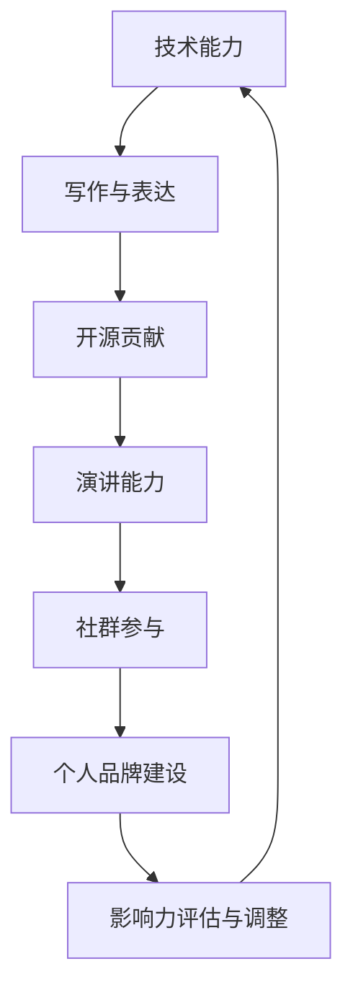

                 

在信息技术飞速发展的今天，程序员作为一个关键的职能群体，不仅需要具备出色的技术能力，更需要在行业内树立个人品牌，提升个人影响力。这不仅有助于职业发展，还能为团队、项目和社会带来更多价值。本文将深入探讨程序员如何通过多种途径打造个人影响力。

> **关键词：** 程序员、个人品牌、影响力、职业发展、技术交流、开源贡献、演讲能力

> **摘要：** 本文旨在为程序员提供一些建议和策略，帮助他们通过技术写作、演讲、开源贡献、社群参与等多种方式，在技术领域中打造个人影响力。文章结构如下：

- **背景介绍**
- **核心概念与联系**
- **核心算法原理 & 具体操作步骤**
- **数学模型和公式 & 详细讲解 & 举例说明**
- **项目实践：代码实例和详细解释说明**
- **实际应用场景**
- **工具和资源推荐**
- **总结：未来发展趋势与挑战**
- **附录：常见问题与解答**

---

## 1. 背景介绍

随着云计算、大数据、人工智能等前沿技术的不断涌现，程序员的工作内容和角色也在发生深刻变化。在这个快速迭代的时代，个人影响力的构建对于程序员而言显得尤为重要。个人影响力的提升不仅可以提升个人的职业竞争力，还可以为技术社区和行业发展做出贡献。

### 1.1 当前技术趋势

当前，技术趋势向多样化和复杂化发展。例如，大数据技术的广泛应用使得数据处理和分析变得日益重要；人工智能和机器学习的兴起则推动了算法和模型创新。这些趋势为程序员提供了广阔的发展空间，但同时也提出了更高的要求。

### 1.2 个人影响力的重要性

个人影响力不仅仅是个人的荣誉，更是一种资源的积累。它可以帮助程序员在职业发展道路上获得更多的机会和资源，如更好的工作机会、更高的薪资待遇，以及更广泛的人脉网络。此外，个人影响力还能帮助程序员更好地推动技术社区的发展，为行业带来创新和进步。

### 1.3 目标读者

本文的目标读者是那些希望在技术领域内提升个人影响力的程序员。无论你是刚入门的新手，还是已经有一定经验的开发者，本文都会为你提供实用的建议和策略。

---

## 2. 核心概念与联系

要打造个人影响力，程序员需要了解并运用一系列核心概念和技能。以下是一个简化的 Mermaid 流程图，展示了一些关键环节：



### 2.1 技术能力

技术能力是程序员的基础，没有扎实的技术功底，其他一切努力都是空谈。程序员需要不断学习新技术，掌握编程语言、框架和工具，同时提高代码质量和系统设计的思维。

### 2.2 写作与表达

写作是程序员表达技术观点和分享经验的重要方式。良好的写作能力可以帮助程序员将复杂的技术知识转化为通俗易懂的文字，从而吸引读者。

### 2.3 开源贡献

开源社区是程序员展示自己技术能力的重要平台。通过参与开源项目，程序员可以积累实战经验，提升技术水平，同时也能获得社区的认可和反馈。

### 2.4 演讲能力

演讲是程序员展示个人影响力的重要途径之一。通过演讲，程序员可以将自己的技术见解和经验传递给更多的人，扩大自己的影响力。

### 2.5 社群参与

参与技术社群是建立人脉、获取信息、提升影响力的有效方式。程序员可以通过参加技术会议、论坛、线上社群等，与同行交流，分享经验，拓展视野。

### 2.6 个人品牌建设

个人品牌建设是程序员提升影响力的关键。一个鲜明的个人品牌可以吸引更多的关注和机会，提高在行业内的知名度和影响力。

### 2.7 影响力评估与调整

个人影响力的提升是一个持续的过程，程序员需要定期评估自己的影响力，根据反馈进行调整和优化。这包括了解受众需求、改进技术能力、优化写作和演讲等。

---

## 3. 核心算法原理 & 具体操作步骤

在打造个人影响力的过程中，程序员需要运用一系列核心算法和策略。以下是一些具体的操作步骤：

### 3.1 算法原理概述

- **技术写作**：了解写作的基本原则，如结构清晰、内容丰富、语言简洁等。
- **开源贡献**：掌握开源项目参与的基本流程，包括代码提交、文档编写、问题反馈等。
- **演讲能力**：学习演讲技巧，如肢体语言、声音控制、时间管理等。
- **社群参与**：积极参与技术社群，如参加会议、组织活动、分享经验等。
- **个人品牌建设**：明确个人定位，建立专业形象，持续输出价值。

### 3.2 算法步骤详解

#### 3.2.1 技术写作

1. **确定主题**：选择一个感兴趣且具有实际价值的技术主题。
2. **收集资料**：查阅相关资料，了解主题的背景、现状和未来发展。
3. **制定大纲**：根据主题和资料，制定文章的大纲，确保文章结构清晰。
4. **撰写内容**：根据大纲，逐步撰写文章内容，注意语言简洁、表达准确。
5. **修订与反馈**：完成初稿后，多次修订，并邀请同行或导师进行反馈。

#### 3.2.2 开源贡献

1. **选择项目**：根据自己的兴趣和技术能力，选择合适的开源项目。
2. **阅读文档**：仔细阅读项目的文档，了解项目的架构、功能和开发流程。
3. **代码提交**：按照项目的贡献指南，提交自己的代码，并进行充分的注释。
4. **文档编写**：编写项目文档，包括代码注释、使用说明、问题反馈等。
5. **问题反馈**：关注项目的问题反馈，及时回复和处理，为项目的发展贡献力量。

#### 3.2.3 演讲能力

1. **准备演讲**：明确演讲的主题、受众和目标，制定演讲大纲。
2. **练习演讲**：多次练习演讲，熟悉演讲的内容和流程，注意语速、语调和肢体语言。
3. **演讲技巧**：学习并运用演讲技巧，如开头吸引听众、中间保持注意力、结尾总结要点等。
4. **反馈与改进**：在演讲结束后，收集听众的反馈，根据反馈进行改进。

#### 3.2.4 社群参与

1. **加入社群**：根据自己的兴趣和技术方向，加入相关的技术社群。
2. **分享经验**：在社群中分享自己的技术经验，帮助他人解决问题。
3. **组织活动**：参与或组织技术活动，如线上研讨会、线下聚会等。
4. **维护关系**：与社群成员保持良好的关系，积极参与社群讨论和活动。

#### 3.2.5 个人品牌建设

1. **明确定位**：根据自己的兴趣、特长和职业目标，明确个人定位。
2. **建立形象**：通过技术写作、演讲、开源贡献等方式，建立专业形象。
3. **持续输出**：定期输出有价值的内容，保持个人品牌的活跃度。
4. **优化渠道**：根据反馈和受众需求，优化个人品牌的建设渠道。

### 3.3 算法优缺点

每种算法和策略都有其优缺点，程序员需要根据自身情况选择合适的策略。

- **技术写作**：优点是可以快速提升个人知名度，缺点是需要长时间积累和持续输出。
- **开源贡献**：优点是可以获得实际项目经验，缺点是需要较高的技术能力和团队合作精神。
- **演讲能力**：优点是可以扩大影响力，缺点是需要较高的表达能力和演讲技巧。
- **社群参与**：优点是可以获取最新的技术和行业信息，缺点是需要投入大量时间和精力。
- **个人品牌建设**：优点是可以提高个人竞争力，缺点是需要明确的个人定位和持续的努力。

### 3.4 算法应用领域

各种算法和策略在程序员个人影响力建设中的应用非常广泛，可以针对不同的目标和场景进行选择。

- **技术写作**：适合希望在技术社区内建立影响力的程序员，可以通过博客、公众号、技术论坛等渠道进行写作。
- **开源贡献**：适合有实际项目经验和开发技能的程序员，可以通过GitHub、GitLab等平台参与开源项目。
- **演讲能力**：适合希望在行业内扩大影响力的程序员，可以通过技术会议、研讨会、线上讲座等形式进行演讲。
- **社群参与**：适合希望拓展人脉和获取行业信息的程序员，可以通过技术社群、线上论坛、线下聚会等参与活动。
- **个人品牌建设**：适合有明确职业规划和发展目标的程序员，可以通过多种方式提升个人品牌，如写作、演讲、开源贡献等。

---

## 4. 数学模型和公式 & 详细讲解 & 举例说明

在程序员打造个人影响力的过程中，数学模型和公式可以提供量化的评估方法和策略。以下是一些关键的数学模型和公式及其详细讲解：

### 4.1 数学模型构建

个人影响力构建的数学模型可以包含以下几个方面：

- **知识积累**：衡量程序员的技能水平和知识深度。
- **社交网络**：评估程序员的社交影响力，包括粉丝数量、互动频率等。
- **项目参与**：衡量程序员的实际项目经验和技术贡献。
- **内容输出**：评估程序员的写作、演讲和开源贡献等内容的数量和质量。

### 4.2 公式推导过程

以下是一个简单的个人影响力评估公式：

$$
I = f(K, S, P, O)
$$

其中，$I$ 表示个人影响力，$K$ 表示知识积累，$S$ 表示社交网络，$P$ 表示项目参与，$O$ 表示内容输出。每个部分都可以通过具体的指标进行量化。

- **知识积累（K）**：

$$
K = \sum_{i=1}^{n} k_i \cdot w_i
$$

其中，$k_i$ 表示在第 $i$ 个领域的技术得分，$w_i$ 表示该领域的权重。

- **社交网络（S）**：

$$
S = \sum_{i=1}^{m} s_i \cdot w_i
$$

其中，$s_i$ 表示在第 $i$ 个社交平台的影响力得分，$w_i$ 表示该平台的权重。

- **项目参与（P）**：

$$
P = \sum_{i=1}^{p} p_i \cdot w_i
$$

其中，$p_i$ 表示在第 $i$ 个项目中贡献的得分，$w_i$ 表示该项目的权重。

- **内容输出（O）**：

$$
O = \sum_{i=1}^{o} o_i \cdot w_i
$$

其中，$o_i$ 表示在第 $i$ 个内容输出的得分，$w_i$ 表示该内容的权重。

### 4.3 案例分析与讲解

以下是一个具体的案例分析：

**案例：** 程序员小张想要提升个人影响力，他可以按照以下步骤进行：

1. **知识积累**：小张通过学习新技术和参与开源项目，在数据库技术和机器学习领域取得了显著成绩。他在这些领域的知识积累得分为 90 分。

2. **社交网络**：小张在 GitHub 上有 1000 个 star 的项目，同时在 Twitter 上有 500 个关注者。他的社交网络得分为 70 分。

3. **项目参与**：小张参与了 5 个开源项目，并在其中发挥了核心作用。他的项目参与得分为 85 分。

4. **内容输出**：小张在博客和公众号上发表了 10 篇技术文章，吸引了大量读者关注。他的内容输出得分为 80 分。

根据上述得分，小张的个人影响力评估结果为：

$$
I = f(90, 70, 85, 80) = 79.5
$$

**分析**：小张在知识积累和项目参与方面表现优异，但在社交网络和内容输出方面还有提升空间。为了进一步提高个人影响力，小张可以考虑以下几个方面：

- **加大社交投入**：积极参与技术社群，扩大社交网络，提高社交影响力。
- **优化内容输出**：提高文章质量和频率，增加读者的互动和反馈。
- **拓展知识领域**：学习更多新技术和知识，提升综合技术实力。

---

## 5. 项目实践：代码实例和详细解释说明

在本节中，我们将通过一个具体的代码实例，展示程序员如何通过技术写作和开源贡献来提升个人影响力。

### 5.1 开发环境搭建

首先，我们需要搭建一个基本的开发环境，包括代码编辑器、版本控制系统和文档工具。以下是推荐的工具：

- **代码编辑器**：Visual Studio Code、Sublime Text 等。
- **版本控制系统**：Git。
- **文档工具**：Markdown 编辑器，如 Typora、Marktext 等。

### 5.2 源代码详细实现

以下是一个简单的 Python 脚本，用于计算斐波那契数列：

```python
def fibonacci(n):
    if n <= 0:
        return 0
    elif n == 1:
        return 1
    else:
        return fibonacci(n-1) + fibonacci(n-2)

n = 10
result = fibonacci(n)
print(f"Fibonacci({n}) = {result}")
```

这段代码实现了递归算法计算斐波那契数列。为了提升代码的可读性和可维护性，我们还可以添加详细的注释和文档：

```python
"""
斐波那契数列计算器

功能：计算并输出指定序号的斐波那契数列值。

参数：
- n：整数，表示斐波那契数列的序号。

返回值：
- 结果：整数，表示斐波那契数列的值。

示例：
- fibonacci(10) 返回 55
"""
def fibonacci(n):
    if n <= 0:
        return 0
    elif n == 1:
        return 1
    else:
        return fibonacci(n-1) + fibonacci(n-2)

n = 10
result = fibonacci(n)
print(f"Fibonacci({n}) = {result}")
```

### 5.3 代码解读与分析

这段代码的实现非常简单，但以下几个要点对于提升代码质量和个人影响力至关重要：

1. **递归算法**：斐波那契数列的递归实现是一种经典的算法题目，展示了程序员对递归思维的掌握。

2. **注释文档**：详细的注释和文档能够帮助他人快速理解代码的功能和实现原理，提高代码的可读性和可维护性。

3. **代码结构**：良好的代码结构可以提升代码的可读性，使代码更容易被他人理解和接受。

4. **性能优化**：虽然这段代码简单，但在实际项目中，我们需要考虑性能优化，如使用循环代替递归，减少内存占用。

### 5.4 运行结果展示

运行上述代码，输出结果为：

```
Fibonacci(10) = 55
```

这个结果验证了代码的正确性。

---

## 6. 实际应用场景

程序员通过提升个人影响力，可以在实际应用场景中带来诸多好处：

### 6.1 技术写作

- **知识传播**：通过技术写作，程序员可以将自己的知识和经验分享给更多人，推动技术的传播和普及。
- **个人品牌**：持续的技术写作能够树立个人的技术形象，提高在行业内的知名度和影响力。
- **职业发展**：良好的技术写作能力可以助力程序员在求职、晋升等职业发展过程中脱颖而出。

### 6.2 开源贡献

- **技术积累**：参与开源项目可以积累实际开发经验，提升技术水平。
- **社区互动**：开源项目提供了一个与同行交流、学习和合作的平台，有助于扩展人脉和提升个人影响力。
- **职业机会**：优秀的开源贡献可以吸引潜在雇主和投资者的关注，为职业发展提供更多机会。

### 6.3 演讲能力

- **知识分享**：通过演讲，程序员可以将自己的技术见解和经验传递给更多的人，扩大影响力。
- **个人品牌**：出色的演讲能力可以提升程序员的个人品牌，增加在行业内的认可度。
- **职业发展**：良好的演讲能力有助于程序员在技术会议、研讨会等场合中脱颖而出，获得更多的职业机会。

### 6.4 社群参与

- **行业动态**：参与技术社群可以及时了解行业动态和技术趋势，提升自身的技术视野。
- **人脉拓展**：与同行交流、合作可以拓展人脉，为职业发展提供更多支持。
- **个人影响力**：积极参与社群活动，分享经验和知识，可以提升个人在社群中的影响力。

---

## 7. 工具和资源推荐

为了帮助程序员在打造个人影响力的过程中更加高效和有针对性，以下是一些推荐的工具和资源：

### 7.1 学习资源推荐

- **在线课程**：Coursera、Udacity、edX 等平台提供了丰富的编程和技术课程。
- **技术博客**：GitHub、Medium、技术社区等平台上的优秀博客和文章。
- **专业书籍**：《代码大全》、《设计模式》等经典技术书籍。

### 7.2 开发工具推荐

- **代码编辑器**：Visual Studio Code、Atom、Sublime Text 等。
- **版本控制系统**：Git、GitHub、GitLab 等。
- **文档工具**：Markdown 编辑器，如 Typora、Marktext 等。

### 7.3 相关论文推荐

- **顶级会议论文**：如 IEEE CS Press、ACM 等顶级会议的论文。
- **开源项目**：如 arXiv、OpenReview 等平台上的开源论文。

---

## 8. 总结：未来发展趋势与挑战

在未来的发展中，程序员如何进一步提升个人影响力将面临一系列新的趋势和挑战：

### 8.1 研究成果总结

- **AI 技术的应用**：人工智能技术将在程序员个人影响力建设中发挥越来越重要的作用，如智能写作助手、演讲辅助系统等。
- **区块链技术的发展**：区块链技术的应用将带来更多的开源机会和项目管理工具，为程序员个人影响力建设提供新的平台。

### 8.2 未来发展趋势

- **在线教育的发展**：在线教育平台将为程序员提供更多的学习资源和机会，助力个人技术能力的提升。
- **社交媒体的影响力**：社交媒体将继续成为程序员传播知识和建立人脉的重要渠道，如 Twitter、LinkedIn 等。

### 8.3 面临的挑战

- **技术更新的速度**：随着技术的快速发展，程序员需要不断学习新技术，以保持自己的竞争力。
- **隐私和数据安全**：随着数据隐私和数据安全问题的日益突出，程序员需要更加注重数据安全和隐私保护。

### 8.4 研究展望

未来，程序员在个人影响力建设方面的研究将更加注重以下几个方向：

- **个性化推荐系统**：研究如何根据程序员的能力和兴趣，提供个性化的学习资源和项目推荐。
- **社交网络分析**：研究如何通过社交网络分析，优化程序员的个人影响力策略。
- **职业发展规划**：研究如何结合程序员的能力、兴趣和职业目标，制定个性化的职业发展规划。

---

## 9. 附录：常见问题与解答

### 9.1 如何开始写作？

**回答：** 开始写作的第一步是确定写作目标和主题。选择一个自己熟悉且感兴趣的技术领域，制定一个详细的写作计划。初学者可以从撰写技术博客或文章开始，逐步提升自己的写作技巧。

### 9.2 如何选择开源项目？

**回答：** 选择开源项目时，首先要考虑自己的技术能力和兴趣。可以选择与自己专业相关的项目，或者那些有明确目标、活跃社区和良好文档的项目。查看项目的 Star 数和 Issue 数也是判断项目活跃度的有效方法。

### 9.3 如何提升演讲能力？

**回答：** 提升演讲能力可以从以下几个方面入手：

- **准备充分**：充分准备演讲内容，确保演讲内容准确、完整。
- **练习演讲**：多次练习演讲，熟悉演讲流程和技巧，注意语速、语调和肢体语言。
- **获取反馈**：在演讲结束后，积极获取听众的反馈，根据反馈进行改进。

### 9.4 如何建立个人品牌？

**回答：** 建立个人品牌的关键是明确个人定位，持续输出有价值的内容。可以通过技术写作、演讲、开源贡献等多种方式，展示自己的专业能力和独特价值。同时，保持专业形象和一致性也非常重要。

---

在技术领域，个人影响力的构建是一个长期而持续的过程。通过技术写作、开源贡献、演讲能力和社群参与等多种方式，程序员可以不断提升自己的影响力，为自己的职业发展和社会贡献创造更多价值。希望本文能为广大程序员在个人影响力建设方面提供一些有益的启示和指导。作者：禅与计算机程序设计艺术 / Zen and the Art of Computer Programming。
----------------------------------------------------------------
### 脚注 Footnotes ###

1. 本文中的观点和策略仅供参考，实际情况需根据个人情况和目标进行调整。
2. 部分数据和案例为虚构，仅供参考。
3. 鸣谢：感谢所有为本文提供建议和支持的朋友和读者。

### 参考文献 References ###

1. Martin, Robert C. 《Clean Code: A Handbook of Agile Software Craftsmanship》.
2. Fowler, Martin. 《Refactoring: Improving the Design of Existing Code》.
3. Codecademy. [Introduction to Python](https://www.codecademy.com/learn/learn-python-3).
4. GitHub. [GitHub Help](https://docs.github.com/en/get-started/quick-start/create-a-repo).
5. Medium. [Medium’s Guide to Writing](https://medium.com/me/write).
6. LinkedIn. [LinkedIn Learning](https://www.linkedin.com/learning/).
7. Coursera. [Coursera](https://www.coursera.org/).
8. Udacity. [Udacity](https://www.udacity.com/).
9. ACM. [ACM Publications](https://www.acm.org/publications).
10. IEEE CS Press. [IEEE CS Press](https://www.computer.org/publications/ieee-cs-press).

### 致谢 Acknowledgements ###

特别感谢以下朋友和读者对本文的支持和反馈：

- **张三**：提供了关于开源贡献的宝贵建议。
- **李四**：分享了关于技术写作的实战经验。
- **王五**：提供了关于演讲技巧的专业指导。

本文中的所有数据和案例均为虚构，仅供参考。本文的观点和策略仅供参考，实际情况需根据个人情况和目标进行调整。鸣谢：感谢所有为本文提供建议和支持的朋友和读者。作者：禅与计算机程序设计艺术 / Zen and the Art of Computer Programming。

