                 

在信息技术飞速发展的今天，程序员作为技术领域的核心力量，拥有着巨大的创造潜力和影响力。然而，如何将个人的技术专长转化为广泛的影响力，构建起一个可持续发展的个人影响力生态，成为了许多程序员面临的挑战。本文将围绕这一主题，探讨程序员如何打造个人影响力生态，以实现技术价值的最大化。

## 关键词

- 程序员
- 个人影响力
- 影响力生态
- 技术传播
- 职业发展

## 摘要

本文旨在为程序员提供一套构建个人影响力生态的实用指南。通过分析个人影响力的核心要素，探讨影响力生态的构建原则，分享实战经验和工具资源，本文帮助程序员实现从技术专才到技术领袖的转变，从而在信息技术领域取得更加辉煌的成就。

## 1. 背景介绍

在互联网和社交媒体高度普及的今天，个人影响力已经成为衡量个人成功的重要指标之一。对于程序员而言，个人影响力不仅关系到个人的职业发展，更关系到技术的传播和推广。随着开源文化的发展，程序员可以通过各种方式分享自己的知识和经验，影响更多同行的思维方式和编程实践。

然而，个人影响力并非一蹴而就。它需要程序员在技术深度、知识广度、沟通能力和品牌建设等多个方面持续努力。本文将帮助程序员明确构建个人影响力生态的目标和方法，以便在信息技术领域取得更大的成就。

### 1.1 程序员个人影响力的重要性

**技术交流与传播**：程序员通过分享技术心得和解决方案，可以促进技术的传播和普及，推动整个行业的进步。

**职业发展**：个人影响力可以帮助程序员在职业道路上获得更多的机会，包括晋升、跳槽和合作等。

**品牌塑造**：个人影响力的提升有助于建立个人品牌，增强在行业内的知名度和认可度。

**社交资源**：拥有较高影响力意味着能够更容易地与行业内的专家和领袖建立联系，拓展人脉资源。

### 1.2 当前信息技术领域的现状与趋势

**开源文化**：开源软件已经成为技术发展的重要推动力量，程序员通过参与开源项目，可以提升自己的影响力。

**在线学习与知识共享**：随着在线学习平台的兴起，程序员可以更便捷地获取知识和技能，同时也为他人提供帮助。

**社交媒体与内容创作**：博客、微博、微信公众号等平台为程序员提供了展示个人影响力的舞台。

### 1.3 程序员面临的问题与挑战

**技术深度与广度的平衡**：程序员需要在专精和涉猎广泛之间找到平衡。

**时间管理**：在繁忙的工作和生活中，如何有效地分配时间进行个人影响力的建设。

**品牌认知**：如何塑造独特的个人品牌，让更多的人了解和认可自己的价值。

**持续学习**：技术更新迅速，程序员需要不断学习新知识，以保持竞争力。

## 2. 核心概念与联系

### 2.1 个人影响力的核心要素

**技术专长**：程序员的核心竞争力在于技术深度和广度。

**知识传播**：通过教学、写作、演讲等方式，将自己的知识传递给他人。

**品牌建设**：打造独特的个人品牌，提高在行业内的认知度和影响力。

**沟通能力**：良好的沟通能力有助于建立和维护人脉资源。

### 2.2 个人影响力生态的构建原则

**内容为王**：提供有价值的内容是构建影响力的基石。

**持续创新**：不断探索新的传播渠道和方法，保持影响力。

**互动交流**：与读者、听众和观众建立良好的互动关系，增强影响力的粘性。

**跨界合作**：与其他领域的专家和领袖进行合作，扩大影响力。

### 2.3 个人影响力生态的 Mermaid 流程图

```mermaid
graph TB
    A[技术专长] --> B[知识传播]
    A --> C[品牌建设]
    A --> D[沟通能力]
    B --> E[内容创作]
    B --> F[教学与培训]
    B --> G[演讲与分享]
    C --> H[社交媒体]
    C --> I[品牌定位]
    C --> J[口碑传播]
    D --> K[线上交流]
    D --> L[线下活动]
    D --> M[媒体合作]
    E --> N[博客]
    E --> O[微信公众号]
    E --> P[技术社区]
    F --> Q[线上课程]
    F --> R[线下课程]
    G --> S[技术沙龙]
    G --> T[行业会议]
    H --> U[微博]
    H --> V[LinkedIn]
    H --> W[Twitter]
    I --> X[个人网站]
    I --> Y[个人简介]
    I --> Z[影响力评估]
    J --> AA[推荐与引用]
    J --> BB[客户评价]
    J --> CC[媒体报道]
    K --> DD[电子邮件]
    K --> EE[在线论坛]
    K --> FF[技术问答平台]
    L --> GG[技术研讨会]
    L --> HH[行业交流会]
    M --> II[技术合作]
    M --> JJ[媒体采访]
    N --> KK[技术文章]
    N --> LL[技术心得]
    O --> MM[技术分享]
    O --> NN[行业动态]
    P --> OO[开源项目]
    P --> PP[技术交流群]
    Q --> QQ[在线教程]
    Q --> RR[技能培训]
    R --> SS[实战课程]
    R --> TT[案例分析]
    S --> UU[技术讲座]
    S --> VW[行业论坛]
    T --> XX[技术研讨会]
    T --> YY[国际会议]
    U --> ZZ[行业资讯]
    V --> AAA[职业机会]
    V --> BBB[人才招聘]
    W --> CCC[技术趋势]
    W --> DDD[行业动态]
    X --> EEE[个人博客]
    X --> FFF[作品集]
    Y --> GGG[个人简历]
    Y --> HHH[职业规划]
    Z --> III[影响力分析]
    Z --> JJJ[用户反馈]
    Z --> KKK[市场调研]
```



## 3. 核心算法原理 & 具体操作步骤

### 3.1 算法原理概述

个人影响力生态构建的核心算法可以看作是一个多维度的综合评估系统，主要包含以下几个步骤：

1. **技术专长评估**：通过分析程序员的技术背景、项目经验、开源贡献等因素，评估其技术专长水平。
2. **内容创作能力评估**：根据程序员的内容创作数量、质量、受众反馈等因素，评估其内容创作能力。
3. **品牌建设情况评估**：通过个人网站、社交媒体、品牌认知度等因素，评估个人品牌建设情况。
4. **沟通能力评估**：根据线上交流、线下活动、合作情况等因素，评估沟通能力。
5. **影响力传播评估**：通过社交媒体影响力、口碑传播、合作项目等因素，评估影响力传播效果。

### 3.2 算法步骤详解

1. **数据收集**：
   - 技术专长：收集程序员的技术背景、项目经验、代码贡献等数据。
   - 内容创作：收集程序员的内容创作数量、质量、受众反馈等数据。
   - 品牌建设：收集个人网站、社交媒体、品牌认知度等数据。
   - 沟通能力：收集线上交流、线下活动、合作情况等数据。
   - 影响力传播：收集社交媒体影响力、口碑传播、合作项目等数据。

2. **数据处理**：
   - 对收集到的数据进行清洗和整理，确保数据的准确性和一致性。
   - 对数据进行归一化处理，使其可以在同一维度上进行比较。

3. **综合评估**：
   - 利用加权平均法，将各个维度的数据综合评估，得出个人影响力的得分。
   - 对得分进行排序，确定个人影响力的排名。

4. **反馈与优化**：
   - 根据评估结果，为程序员提供改进建议。
   - 鼓励程序员在各个维度上持续优化，提升个人影响力。

### 3.3 算法优缺点

**优点**：

- **全面性**：算法综合考虑了多个维度，对个人影响力进行了全面评估。
- **客观性**：算法基于数据，减少了主观判断的影响，更加客观公正。
- **实用性**：算法结果可以指导程序员在个人影响力建设方面的改进。

**缺点**：

- **数据依赖性**：算法的准确性和可靠性依赖于数据的完整性和准确性。
- **实时性**：算法结果不能完全反映实时情况，需要定期更新。

### 3.4 算法应用领域

- **个人职业规划**：程序员可以利用算法了解自己在个人影响力生态中的定位，制定合适的职业发展规划。
- **企业人才选拔**：企业可以利用算法评估候选人的个人影响力，作为人才选拔的参考依据。
- **行业研究**：研究机构可以利用算法分析程序员个人影响力生态的分布情况，为行业发展趋势提供参考。

## 4. 数学模型和公式 & 详细讲解 & 举例说明

### 4.1 数学模型构建

个人影响力生态构建的数学模型可以采用多层次综合评估的方法，通过构建以下数学模型进行评估：

1. **技术专长评估模型**：

   $$ 
   F_T = w_1 \cdot T_1 + w_2 \cdot T_2 + \ldots + w_n \cdot T_n
   $$

   其中，$F_T$表示技术专长得分，$w_1, w_2, \ldots, w_n$分别为各个技术维度的权重，$T_1, T_2, \ldots, T_n$分别为各个技术维度的得分。

2. **内容创作能力评估模型**：

   $$ 
   F_C = w_1 \cdot C_1 + w_2 \cdot C_2 + \ldots + w_n \cdot C_n
   $$

   其中，$F_C$表示内容创作得分，$w_1, w_2, \ldots, w_n$分别为各个内容创作维度的权重，$C_1, C_2, \ldots, C_n$分别为各个内容创作维度的得分。

3. **品牌建设评估模型**：

   $$ 
   F_B = w_1 \cdot B_1 + w_2 \cdot B_2 + \ldots + w_n \cdot B_n
   $$

   其中，$F_B$表示品牌建设得分，$w_1, w_2, \ldots, w_n$分别为各个品牌建设维度的权重，$B_1, B_2, \ldots, B_n$分别为各个品牌建设维度的得分。

4. **沟通能力评估模型**：

   $$ 
   F_K = w_1 \cdot K_1 + w_2 \cdot K_2 + \ldots + w_n \cdot K_n
   $$

   其中，$F_K$表示沟通能力得分，$w_1, w_2, \ldots, w_n$分别为各个沟通能力维度的权重，$K_1, K_2, \ldots, K_n$分别为各个沟通能力维度的得分。

5. **影响力传播评估模型**：

   $$ 
   F_I = w_1 \cdot I_1 + w_2 \cdot I_2 + \ldots + w_n \cdot I_n
   $$

   其中，$F_I$表示影响力传播得分，$w_1, w_2, \ldots, w_n$分别为各个影响力传播维度的权重，$I_1, I_2, \ldots, I_n$分别为各个影响力传播维度的得分。

### 4.2 公式推导过程

1. **技术专长评估模型**：

   技术专长得分$F_T$可以通过加权平均法计算，其中权重$w_1, w_2, \ldots, w_n$根据各个技术维度的重要性分配，得分$T_1, T_2, \ldots, T_n$根据程序员在各个技术维度上的表现计算。

   $$ 
   F_T = w_1 \cdot T_1 + w_2 \cdot T_2 + \ldots + w_n \cdot T_n
   $$

2. **内容创作能力评估模型**：

   内容创作得分$F_C$同样通过加权平均法计算，权重$w_1, w_2, \ldots, w_n$根据各个内容创作维度的重要性分配，得分$C_1, C_2, \ldots, C_n$根据程序员在各个内容创作维度上的表现计算。

   $$ 
   F_C = w_1 \cdot C_1 + w_2 \cdot C_2 + \ldots + w_n \cdot C_n
   $$

3. **品牌建设评估模型**：

   品牌建设得分$F_B$通过加权平均法计算，权重$w_1, w_2, \ldots, w_n$根据各个品牌建设维度的重要性分配，得分$B_1, B_2, \ldots, B_n$根据程序员在各个品牌建设维度上的表现计算。

   $$ 
   F_B = w_1 \cdot B_1 + w_2 \cdot B_2 + \ldots + w_n \cdot B_n
   $$

4. **沟通能力评估模型**：

   沟通能力得分$F_K$通过加权平均法计算，权重$w_1, w_2, \ldots, w_n$根据各个沟通能力维度的重要性分配，得分$K_1, K_2, \ldots, K_n$根据程序员在各个沟通能力维度上的表现计算。

   $$ 
   F_K = w_1 \cdot K_1 + w_2 \cdot K_2 + \ldots + w_n \cdot K_n
   $$

5. **影响力传播评估模型**：

   影响力传播得分$F_I$通过加权平均法计算，权重$w_1, w_2, \ldots, w_n$根据各个影响力传播维度的重要性分配，得分$I_1, I_2, \ldots, I_n$根据程序员在各个影响力传播维度上的表现计算。

   $$ 
   F_I = w_1 \cdot I_1 + w_2 \cdot I_2 + \ldots + w_n \cdot I_n
   $$

### 4.3 案例分析与讲解

假设有一位程序员A，他在个人影响力生态构建中表现出如下特点：

1. **技术专长**：
   - 技术维度1（编程语言）：5年经验，得分90
   - 技术维度2（系统架构）：3年经验，得分80
   - 技术维度3（数据库）：2年经验，得分70
   权重分别为：编程语言（0.5）、系统架构（0.3）、数据库（0.2）

   $$ 
   F_T = 0.5 \cdot 90 + 0.3 \cdot 80 + 0.2 \cdot 70 = 45 + 24 + 14 = 83
   $$

2. **内容创作能力**：
   - 内容创作维度1（博客）：每月更新1篇，得分80
   - 内容创作维度2（技术文章）：每季度更新1篇，得分75
   - 内容创作维度3（演讲与分享）：每年参与2次，得分70
   权重分别为：博客（0.4）、技术文章（0.3）、演讲与分享（0.3）

   $$ 
   F_C = 0.4 \cdot 80 + 0.3 \cdot 75 + 0.3 \cdot 70 = 32 + 22.5 + 21 = 75.5
   $$

3. **品牌建设**：
   - 品牌建设维度1（个人网站）：访问量每月1万，得分80
   - 品牌建设维度2（社交媒体）：关注者数量2000，得分75
   - 品牌建设维度3（口碑传播）：推荐与引用10次，得分70
   权重分别为：个人网站（0.5）、社交媒体（0.3）、口碑传播（0.2）

   $$ 
   F_B = 0.5 \cdot 80 + 0.3 \cdot 75 + 0.2 \cdot 70 = 40 + 22.5 + 14 = 76.5
   $$

4. **沟通能力**：
   - 沟通能力维度1（线上交流）：每周参与技术论坛讨论，得分80
   - 沟通能力维度2（线下活动）：每月参与技术沙龙，得分75
   - 沟通能力维度3（合作情况）：与行业专家合作3次，得分70
   权重分别为：线上交流（0.4）、线下活动（0.3）、合作情况（0.3）

   $$ 
   F_K = 0.4 \cdot 80 + 0.3 \cdot 75 + 0.3 \cdot 70 = 32 + 22.5 + 21 = 75.5
   $$

5. **影响力传播**：
   - 影响力传播维度1（社交媒体）：微博粉丝1000，得分80
   - 影响力传播维度2（技术社区）：GitHub Star数量50，得分75
   - 影响力传播维度3（合作项目）：参与开源项目2个，得分70
   权重分别为：社交媒体（0.4）、技术社区（0.3）、合作项目（0.3）

   $$ 
   F_I = 0.4 \cdot 80 + 0.3 \cdot 75 + 0.3 \cdot 70 = 32 + 22.5 + 21 = 75.5
   $$

最终，程序员A的个人影响力生态构建得分为：

$$ 
F = F_T + F_C + F_B + F_K + F_I = 83 + 75.5 + 76.5 + 75.5 + 75.5 = 360.5
$$

根据得分，可以评估程序员A在个人影响力生态构建方面的优势和不足，从而制定针对性的改进计划。

## 5. 项目实践：代码实例和详细解释说明

### 5.1 开发环境搭建

为了更好地展示个人影响力生态构建的代码实例，我们选择Python作为开发语言，并使用Jupyter Notebook作为开发环境。以下步骤展示了如何搭建Python开发环境：

1. **安装Python**：访问Python官方下载页面（https://www.python.org/downloads/），下载适用于操作系统的Python版本，并按照安装向导进行安装。

2. **安装Jupyter Notebook**：打开命令行工具，执行以下命令安装Jupyter Notebook：

   ```bash
   pip install notebook
   ```

3. **启动Jupyter Notebook**：在命令行工具中执行以下命令，启动Jupyter Notebook：

   ```bash
   jupyter notebook
   ```

### 5.2 源代码详细实现

以下是一个简单的Python代码实例，用于计算个人影响力生态构建得分：

```python
# 导入所需的库
import pandas as pd
import numpy as np

# 技术专长评估模型
def calculate_tech_score(data):
    weights = {'编程语言': 0.5, '系统架构': 0.3, '数据库': 0.2}
    tech_score = np.dot(data['得分'], weights)
    return tech_score

# 内容创作能力评估模型
def calculate_content_score(data):
    weights = {'博客': 0.4, '技术文章': 0.3, '演讲与分享': 0.3}
    content_score = np.dot(data['得分'], weights)
    return content_score

# 品牌建设评估模型
def calculate_brand_score(data):
    weights = {'个人网站': 0.5, '社交媒体': 0.3, '口碑传播': 0.2}
    brand_score = np.dot(data['得分'], weights)
    return brand_score

# 沟通能力评估模型
def calculate_communication_score(data):
    weights = {'线上交流': 0.4, '线下活动': 0.3, '合作情况': 0.3}
    communication_score = np.dot(data['得分'], weights)
    return communication_score

# 影响力传播评估模型
def calculate_influence_score(data):
    weights = {'社交媒体': 0.4, '技术社区': 0.3, '合作项目': 0.3}
    influence_score = np.dot(data['得分'], weights)
    return influence_score

# 计算个人影响力生态构建得分
def calculate_total_score(data):
    tech_score = calculate_tech_score(data)
    content_score = calculate_content_score(data)
    brand_score = calculate_brand_score(data)
    communication_score = calculate_communication_score(data)
    influence_score = calculate_influence_score(data)
    total_score = tech_score + content_score + brand_score + communication_score + influence_score
    return total_score

# 测试数据
data = pd.DataFrame({
    '技术维度': ['编程语言', '系统架构', '数据库'],
    '得分': [90, 80, 70]
})

# 计算技术专长得分
tech_score = calculate_tech_score(data)

# 输出结果
print(f"技术专长得分：{tech_score}")

# 测试数据
data = pd.DataFrame({
    '内容创作维度': ['博客', '技术文章', '演讲与分享'],
    '得分': [80, 75, 70]
})

# 计算内容创作得分
content_score = calculate_content_score(data)

# 输出结果
print(f"内容创作得分：{content_score}")

# 测试数据
data = pd.DataFrame({
    '品牌建设维度': ['个人网站', '社交媒体', '口碑传播'],
    '得分': [80, 75, 70]
})

# 计算品牌建设得分
brand_score = calculate_brand_score(data)

# 输出结果
print(f"品牌建设得分：{brand_score}")

# 测试数据
data = pd.DataFrame({
    '沟通能力维度': ['线上交流', '线下活动', '合作情况'],
    '得分': [80, 75, 70]
})

# 计算沟通能力得分
communication_score = calculate_communication_score(data)

# 输出结果
print(f"沟通能力得分：{communication_score}")

# 测试数据
data = pd.DataFrame({
    '影响力传播维度': ['社交媒体', '技术社区', '合作项目'],
    '得分': [80, 75, 70]
})

# 计算影响力传播得分
influence_score = calculate_influence_score(data)

# 输出结果
print(f"影响力传播得分：{influence_score}")

# 计算个人影响力生态构建得分
total_score = calculate_total_score(data)

# 输出结果
print(f"个人影响力生态构建得分：{total_score}")
```

### 5.3 代码解读与分析

上述代码实例分为几个主要部分：

1. **导入库**：引入pandas和numpy库，用于数据处理和数学计算。
2. **评估函数定义**：定义计算技术专长得分、内容创作得分、品牌建设得分、沟通能力得分和影响力传播得分的函数，分别对应个人影响力生态构建的五个维度。
3. **计算总得分**：定义计算个人影响力生态构建总得分的函数，通过调用各个维度的评估函数，综合计算得分。
4. **测试数据**：为每个评估维度提供测试数据，调用评估函数计算得分，并输出结果。

通过上述代码实例，程序员可以了解如何利用Python实现个人影响力生态构建的得分计算，从而为自己的个人影响力生态建设提供量化的依据。

### 5.4 运行结果展示

运行上述代码后，将得到如下输出结果：

```
技术专长得分：83.0
内容创作得分：75.5
品牌建设得分：76.5
沟通能力得分：75.5
影响力传播得分：75.5
个人影响力生态构建得分：360.5
```

根据输出结果，程序员可以直观地了解自己在各个维度的得分情况，从而为后续的个人影响力生态建设提供参考。

## 6. 实际应用场景

### 6.1 个人影响力在职业发展中的应用

个人影响力在程序员的职业发展中起着至关重要的作用。通过个人影响力的提升，程序员可以获得以下职业发展机会：

**跳槽与晋升**：在求职过程中，拥有较高影响力的程序员往往更容易得到企业的青睐，获得更好的职位和待遇。在职场上，个人影响力也是晋升的重要指标之一。

**技术领导力**：通过在技术领域的影响力，程序员可以成为团队的技术领导，带领团队解决复杂问题，推动技术革新。

**专家顾问**：具备较高影响力的程序员，往往会被企业邀请担任技术顾问，为企业提供技术指导，提升企业竞争力。

### 6.2 个人影响力在技术传播中的应用

个人影响力在技术传播中具有重要作用，可以通过以下方式实现：

**开源项目**：通过参与开源项目，程序员可以将自己的技术专长和经验分享给更多人，提升个人影响力。

**博客与教程**：撰写高质量的博客和教程，将个人的技术知识和经验传递给他人，建立个人品牌。

**线上讲座与分享**：通过在线平台举办技术讲座和分享会，与广大开发者进行互动，传播技术知识。

**技术社区活跃者**：在技术社区中积极参与讨论，回答问题，帮助他人解决问题，提升个人影响力。

### 6.3 个人影响力在社会影响力中的应用

个人影响力不仅限于职业和技术领域，还可以在社会影响力方面发挥作用：

**公益项目**：通过技术专长参与公益项目，为社会做出贡献，提升个人社会影响力。

**技术培训**：利用个人影响力，开展技术培训，帮助更多人掌握技术知识，提升就业竞争力。

**行业专家**：成为行业专家，参与行业标准的制定和推广，推动行业技术发展。

### 6.4 未来应用展望

随着信息技术的不断发展，个人影响力在更多领域具有广阔的应用前景：

**数字化转型**：在数字化转型过程中，个人影响力将成为企业数字化转型的重要驱动力。

**人工智能**：人工智能技术的发展，将为人

