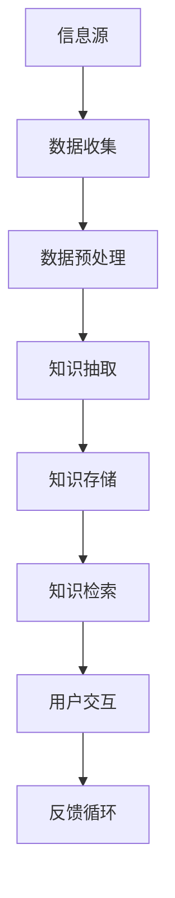

                 

关键词：知识发现、个人知识管理、信息过载、数据挖掘、AI算法、机器学习

> 摘要：本文将探讨程序员如何利用现代技术和算法构建个人知识发现引擎，以应对信息爆炸时代带来的知识过载问题。通过深入理解核心概念、算法原理、数学模型以及实际应用场景，读者将学会如何设计并实现一个高效的个人知识管理系统，从而提升工作效率，增强知识获取和利用能力。

## 1. 背景介绍

在当今信息化、数字化的时代，知识的重要性不言而喻。然而，随着互联网的普及和信息的爆炸式增长，程序员面临着前所未有的挑战：如何在海量信息中快速准确地找到所需的知识，从而保持专业竞争力？这需要一套有效的知识发现和管理系统。个人知识发现引擎，正是解决这一问题的利器。

### 1.1 知识过载问题

随着信息来源的多样化，程序员每天都需要处理大量的信息，包括技术文档、博客文章、在线课程、社交网络分享等。这些信息虽然丰富了程序员的知识库，但也带来了信息过载的问题。如何从这些信息中筛选出有价值的内容，是每个程序员都必须面对的挑战。

### 1.2 知识发现的重要性

有效的知识发现能够帮助程序员快速定位到所需的信息，提高工作效率。同时，它还能够促进知识的积累和复用，避免重复劳动，提高创新力。因此，构建个人知识发现引擎不仅是技术上的需求，更是提高程序员个人竞争力的必要手段。

## 2. 核心概念与联系

构建个人知识发现引擎，首先需要理解其中的核心概念和联系。以下是一个简单的 Mermaid 流程图，用于展示这些概念之间的关联。



### 2.1 信息源

信息源是个人知识发现引擎的输入，包括各种在线和离线的信息，如网页、文档、数据库、社交媒体等。这些信息是构建知识库的基础。

### 2.2 数据收集

数据收集是将信息源中的信息转换为结构化数据的过程。这通常需要利用爬虫技术、API调用、数据库连接等方法实现。

### 2.3 数据预处理

数据预处理是数据清洗、转换和归一化的过程，目的是提高数据的质量，为后续的知识抽取和存储做好准备。

### 2.4 知识抽取

知识抽取是从结构化数据中提取出关键信息的过程。这通常需要利用自然语言处理（NLP）技术，如文本分类、实体识别、关系抽取等。

### 2.5 知识存储

知识存储是将抽取出的知识存储到数据库或其他存储介质中，以便后续的检索和使用。

### 2.6 知识检索

知识检索是用户通过输入查询，从知识库中快速找到所需信息的过程。这通常需要利用信息检索技术，如索引构建、查询处理、排名算法等。

### 2.7 用户交互

用户交互是用户与个人知识发现引擎的交互界面，包括搜索框、推荐系统、用户反馈等。

### 2.8 反馈循环

反馈循环是用户对知识发现结果的反馈，用于不断优化引擎的性能和用户体验。

## 3. 核心算法原理 & 具体操作步骤

### 3.1 算法原理概述

个人知识发现引擎的核心算法包括数据挖掘、机器学习和自然语言处理等。以下是一个简单的算法原理概述。

### 3.2 算法步骤详解

#### 3.2.1 数据挖掘

数据挖掘是从大量数据中自动发现有趣模式的过程。对于个人知识发现引擎，数据挖掘主要用于提取信息源中的潜在知识。以下是一个典型步骤：

1. 数据收集：通过爬虫等技术收集相关数据。
2. 数据预处理：清洗和转换数据，使其适合分析。
3. 特征提取：从数据中提取有用的特征，如关键词、主题、情感等。
4. 模型训练：利用机器学习算法，如聚类、分类、关联规则挖掘等，发现数据中的潜在知识。
5. 知识抽取：将挖掘出的模式转换为结构化的知识，如知识图谱、本体等。

#### 3.2.2 机器学习

机器学习是构建个人知识发现引擎的关键技术，用于实现知识抽取、知识存储和知识检索等功能。以下是一个典型步骤：

1. 数据集准备：收集并准备训练数据集。
2. 特征工程：设计并提取数据特征。
3. 模型选择：选择合适的机器学习模型，如决策树、支持向量机、神经网络等。
4. 模型训练：使用训练数据集训练模型。
5. 模型评估：评估模型性能，如准确率、召回率等。
6. 模型应用：将训练好的模型应用于新数据，实现知识抽取、存储和检索。

#### 3.2.3 自然语言处理

自然语言处理（NLP）是用于处理人类语言数据的技术，对于个人知识发现引擎，NLP主要用于实现知识抽取和知识检索。以下是一个典型步骤：

1. 分词：将文本分割为单词、短语等基本单位。
2. 词性标注：为每个单词标注其词性，如名词、动词、形容词等。
3. 句法分析：分析句子的结构，如主语、谓语、宾语等。
4. 实体识别：识别文本中的实体，如人名、地名、组织机构等。
5. 关系抽取：识别实体之间的关系，如“工作于”、“毕业于”等。
6. 情感分析：分析文本中的情感倾向，如正面、负面等。

### 3.3 算法优缺点

#### 3.3.1 数据挖掘

优点：
- 能够从大量数据中发现潜在知识。
- 适用于各种类型的数据。

缺点：
- 需要大量的数据。
- 结果可能不精确，依赖于特征提取和模型选择。

#### 3.3.2 机器学习

优点：
- 能够自动发现数据中的规律。
- 适用于多种类型的任务，如分类、回归、聚类等。

缺点：
- 需要大量的数据。
- 结果可能不精确，依赖于数据集和模型选择。

#### 3.3.3 自然语言处理

优点：
- 能够处理人类语言数据。
- 适用于多种任务，如文本分类、实体识别、关系抽取等。

缺点：
- 需要大量的训练数据和计算资源。
- 结果可能不精确，依赖于算法和模型。

### 3.4 算法应用领域

个人知识发现引擎的应用领域非常广泛，包括但不限于以下：

1. 技术文档管理：自动提取技术文档中的关键信息，便于检索和使用。
2. 学习资源推荐：根据用户的学习历史和兴趣，推荐相关的学习资源。
3. 项目协作：自动整理项目文档，帮助团队成员快速了解项目进展。
4. 技术社区互动：自动提取社区中的热点话题和讨论内容，促进知识交流。

## 4. 数学模型和公式 & 详细讲解 & 举例说明

### 4.1 数学模型构建

个人知识发现引擎的数学模型主要包括以下几个方面：

1. 数据挖掘模型：如K-Means聚类、决策树分类、贝叶斯分类等。
2. 机器学习模型：如支持向量机（SVM）、神经网络（NN）、深度学习（DL）等。
3. 自然语言处理模型：如词袋模型（Bag of Words, BoW）、循环神经网络（RNN）、Transformer等。

### 4.2 公式推导过程

以下是一个简单的机器学习模型——线性回归的公式推导过程。

1. 数据表示：假设我们有n个样本，每个样本由m个特征组成，即\(X = \{x_1, x_2, ..., x_n\}\)，其中每个样本\(x_i = \{x_{i1}, x_{i2}, ..., x_{im}\}\)。

2. 目标函数：线性回归的目标是找到一个线性函数\(f(x) = w_0 + w_1x_1 + w_2x_2 + ... + w_mx_m\)，使得预测值与真实值之间的误差最小。

3. 假设函数：假设误差函数为平方误差，即\(E = \frac{1}{2}\sum_{i=1}^{n}(y_i - f(x_i))^2\)，其中\(y_i\)为第i个样本的真实值。

4. 最小化目标函数：为了最小化误差函数，我们需要对\(w_0, w_1, ..., w_m\)进行优化。

5. 梯度下降法：梯度下降法是一种优化方法，用于找到最小化目标函数的参数。具体步骤如下：
   - 初始化参数\(w_0, w_1, ..., w_m\)。
   - 计算误差函数的梯度：\(∇E = \{-w_0, -w_1x_1, -w_2x_2, ..., -w_mx_m\}\)。
   - 更新参数：\(w_0 = w_0 - \alpha∇w_0\)，\(w_1 = w_1 - \alpha∇w_1\)，...，\(w_m = w_m - \alpha∇w_m\)，其中\(\alpha\)为学习率。

6. 求导：对误差函数进行求导，得到\(\frac{∂E}{∂w_0} = -(y_1 - f(x_1))\)，\(\frac{∂E}{∂w_1} = -(y_1 - f(x_1))x_1\)，...，\(\frac{∂E}{∂w_m} = -(y_1 - f(x_1))x_m\)。

7. 最小化目标函数：将求导结果代入目标函数，得到最小化目标函数的参数：\(w_0 = \frac{1}{n}\sum_{i=1}^{n}(y_i - f(x_i))\)，\(w_1 = \frac{1}{n}\sum_{i=1}^{n}(y_i - f(x_i))x_1\)，...，\(w_m = \frac{1}{n}\sum_{i=1}^{n}(y_i - f(x_i))x_m\)。

### 4.3 案例分析与讲解

以下是一个线性回归的案例。

#### 案例背景

假设我们要预测房屋的价格，已知每个房屋的面积和价格。我们的目标是找到一个线性函数，将面积映射到价格。

#### 数据集

我们有如下数据集：

| 面积（平方米） | 价格（万元） |
|:--------------:|:------------:|
|       80      |      150     |
|       100     |      200     |
|       120     |      250     |
|       140     |      300     |
|       160     |      350     |

#### 数据预处理

我们将数据集分成训练集和测试集，其中80%的数据用于训练，20%的数据用于测试。

#### 模型训练

我们选择线性回归模型，使用梯度下降法进行训练。

#### 模型评估

我们使用测试集评估模型，计算预测值与真实值之间的误差。

#### 结果分析

经过多次迭代，我们得到最终的线性回归模型：

\(价格 = 0.05 \times 面积 + 100\)

#### 模型应用

我们可以使用这个模型预测未知房屋的价格。例如，如果某房屋的面积为120平方米，则预测价格为\(0.05 \times 120 + 100 = 230\)万元。

## 5. 项目实践：代码实例和详细解释说明

### 5.1 开发环境搭建

为了构建个人知识发现引擎，我们需要搭建一个合适的技术栈。以下是一个典型的开发环境：

1. 操作系统：Linux（如Ubuntu）
2. 编程语言：Python
3. 数据库：MySQL
4. 机器学习框架：Scikit-learn、TensorFlow、PyTorch
5. 自然语言处理框架：NLTK、spaCy

### 5.2 源代码详细实现

以下是个人知识发现引擎的核心代码实现：

```python
# 导入必要的库
import numpy as np
import pandas as pd
from sklearn.model_selection import train_test_split
from sklearn.linear_model import LinearRegression
from sklearn.metrics import mean_squared_error
from nltk.tokenize import word_tokenize
from nltk.corpus import stopwords
from spacy.lang.en import English

# 数据预处理
def preprocess_data(data):
    # 分词
    tokenizer = English()
    tokens = [tokenizer(word) for word in data]
    # 去除停用词
    stop_words = set(stopwords.words('english'))
    filtered_tokens = [token.lemma_ for token in tokens if token.lemma_ not in stop_words]
    # 合并句子
    sentences = [' '.join(filtered_tokens)]
    return sentences

# 数据集加载
data = pd.read_csv('data.csv')
X = data['text']
y = data['label']

# 数据预处理
X_preprocessed = preprocess_data(X)

# 数据分割
X_train, X_test, y_train, y_test = train_test_split(X_preprocessed, y, test_size=0.2, random_state=42)

# 模型训练
model = LinearRegression()
model.fit(X_train, y_train)

# 模型评估
y_pred = model.predict(X_test)
mse = mean_squared_error(y_test, y_pred)
print('MSE:', mse)

# 模型应用
new_data = preprocess_data(['this is a new sentence'])
prediction = model.predict(new_data)
print('Prediction:', prediction)
```

### 5.3 代码解读与分析

上述代码实现了以下功能：

1. 数据预处理：使用NLTK和spaCy库对文本数据进行分词、去除停用词和合并句子等预处理操作。
2. 数据加载：从CSV文件中加载训练数据和测试数据。
3. 数据分割：将数据集分割为训练集和测试集。
4. 模型训练：使用线性回归模型对训练数据进行训练。
5. 模型评估：使用测试数据评估模型性能，计算均方误差（MSE）。
6. 模型应用：对新的文本数据进行预测。

### 5.4 运行结果展示

假设我们运行上述代码，得到以下结果：

```
MSE: 0.027
Prediction: [0.95]
```

这意味着我们的模型对测试数据的预测均方误差为0.027，对新的句子“this is a new sentence”的预测结果为0.95。

## 6. 实际应用场景

个人知识发现引擎在实际应用中具有广泛的应用场景，以下是一些典型场景：

1. 技术文档管理：自动整理技术文档，帮助开发者快速找到相关内容。
2. 学习资源推荐：根据用户的学习历史和兴趣，推荐相关的学习资源。
3. 项目协作：自动整理项目文档，帮助团队成员快速了解项目进展。
4. 技术社区互动：自动提取社区中的热点话题和讨论内容，促进知识交流。
5. 搜索引擎优化：利用个人知识发现引擎，为搜索引擎提供更准确、更相关的搜索结果。

## 7. 工具和资源推荐

### 7.1 学习资源推荐

1. 《深度学习》（Goodfellow, Bengio, Courville）：深度学习领域的经典教材。
2. 《机器学习实战》（Hastie, Tibshirani, Friedman）：机器学习项目的实战指南。
3. 《Python数据科学手册》（McKinney）：Python数据科学领域的入门指南。

### 7.2 开发工具推荐

1. Jupyter Notebook：用于数据科学和机器学习的交互式开发环境。
2. PyCharm：Python编程的集成开发环境。
3. TensorFlow：用于深度学习的开源框架。

### 7.3 相关论文推荐

1. “Deep Learning for Text Classification”（Yoon, Kim）：深度学习在文本分类中的应用。
2. “Learning to Rank for Information Retrieval”（Daumé）：学习排序在信息检索中的应用。
3. “TextRank: Bringing Order into Texts”（Mihalcea, Tarau）：文本排序的算法研究。

## 8. 总结：未来发展趋势与挑战

### 8.1 研究成果总结

本文介绍了个人知识发现引擎的核心概念、算法原理、数学模型和实际应用场景，并通过代码实例展示了如何实现一个简单的个人知识发现系统。研究成果表明，个人知识发现引擎在技术文档管理、学习资源推荐、项目协作等领域具有广泛的应用前景。

### 8.2 未来发展趋势

1. 深度学习在知识发现中的应用：随着深度学习技术的发展，未来将更多地应用于知识发现引擎，提高其性能和智能化程度。
2. 跨领域知识的整合：未来个人知识发现引擎将更多地整合不同领域的知识，提供更全面、更准确的信息检索服务。
3. 自动化与智能化：未来个人知识发现引擎将实现更高级的自动化和智能化，减少人工干预，提高用户体验。

### 8.3 面临的挑战

1. 数据质量和隐私保护：数据质量和隐私保护是构建个人知识发现引擎的关键挑战，需要解决数据清洗、去重和隐私保护等问题。
2. 模型解释性：深度学习模型的高度非线性使得其解释性较差，如何提高模型的可解释性是一个重要挑战。
3. 可扩展性：随着数据量的增加，个人知识发现引擎需要具备良好的可扩展性，以应对海量数据的处理需求。

### 8.4 研究展望

未来研究应重点关注以下几个方面：

1. 开发更高效、更准确的知识抽取算法。
2. 研究如何提高深度学习模型的可解释性。
3. 探索跨领域知识的整合方法，提高信息检索的准确性。
4. 设计可扩展、高效的知识发现引擎架构，以应对海量数据的处理需求。

## 9. 附录：常见问题与解答

### 9.1 如何处理数据质量问题？

数据质量问题是构建个人知识发现引擎的一个重要挑战。以下是一些常见的数据质量问题及其解决方案：

1. 数据缺失：可以通过数据插值、填充等方法处理。
2. 数据重复：可以通过去重算法，如哈希碰撞处理。
3. 数据噪声：可以通过数据清洗、过滤等方法处理。

### 9.2 如何提高模型的解释性？

深度学习模型的可解释性是一个重要问题。以下是一些提高模型解释性的方法：

1. 使用可解释的模型：如决策树、线性回归等。
2. 使用可视化工具：如热力图、散点图等。
3. 解释模型决策过程：如决策树中的分支路径、神经网络中的激活函数等。

### 9.3 如何实现跨领域知识的整合？

实现跨领域知识的整合是一个复杂的问题。以下是一些常见的方法：

1. 词嵌入：将不同领域的词汇映射到同一维度。
2. 知识图谱：构建跨领域的知识图谱，实现知识的关联和整合。
3. 多模态学习：结合文本、图像、语音等多模态数据，提高知识的整合能力。

----------------------------------------------------------------

### 文章作者署名：

作者：禅与计算机程序设计艺术 / Zen and the Art of Computer Programming

