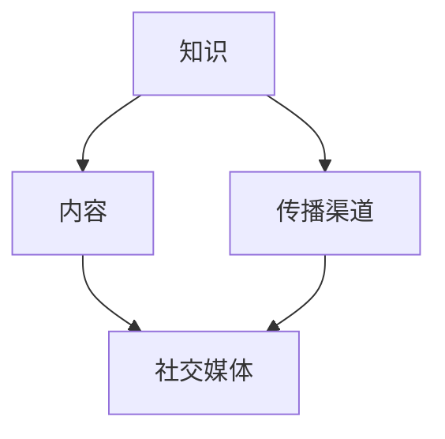

                 

在信息技术飞速发展的时代，个人品牌的重要性愈发凸显。对于程序员来说，打造个人知识品牌不仅是提升个人影响力的重要途径，更是实现职业发展和收入提升的关键策略。本文将探讨程序员如何通过构建个人知识品牌IP，实现个人价值的最大化。

## 文章关键词
- 程序员
- 个人品牌
- 知识IP
- 职业发展
- 内容创作
- 社交媒体

## 文章摘要
本文旨在为程序员提供一套构建个人知识品牌IP的策略。文章将详细讨论个人品牌的重要性、构建个人品牌的步骤、内容创作的方法、社交媒体的运用以及如何持续发展个人品牌。通过这些策略，程序员可以有效地提升个人影响力，实现职业发展的新高度。

### 1. 背景介绍

在过去的几十年里，科技行业经历了翻天覆地的变化。从最初的个人计算机到如今的云计算、人工智能、大数据等新兴技术，程序员的角色也在不断演变。不再仅仅是写代码、解决技术问题的工程师，程序员逐渐成为技术创新的引领者和推动者。

随着信息传播渠道的多样化和互联网的普及，个人品牌成为影响力和话语权的象征。在社交媒体、博客、在线论坛等平台上，程序员可以分享自己的技术见解、实践经验，甚至形成自己的粉丝群体。这种个人影响力的扩大，不仅有助于个人职业发展，还能带来经济上的回报。

构建个人知识品牌IP，意味着将个人在特定领域内的知识和经验转化为一种可辨识的、有价值的资产。这种资产可以通过内容创作、社交媒体运营、课程开发等多种形式表现出来，从而实现持续的品牌曝光和个人收益。

### 2. 核心概念与联系

构建个人知识品牌IP的过程可以类比为一个生态系统。在这个生态系统中，有三个核心要素：知识、内容和传播渠道。

#### 2.1 知识
知识是构建个人品牌的基石。对于程序员来说，扎实的编程技能、深入的技术理解、广泛的知识储备都是不可或缺的。同时，持续的学习能力和对行业动态的敏锐洞察力也非常重要。

#### 2.2 内容
内容是知识的外在表现。程序员可以通过撰写博客文章、发布技术教程、制作视频教程、编写书籍等多种形式，将个人的知识和经验分享给他人。高质量的内容不仅能吸引粉丝，还能提升个人品牌的权威性。

#### 2.3 传播渠道
传播渠道是知识传播的桥梁。社交媒体平台如微博、知乎、掘金、GitHub等，为程序员提供了广泛的内容传播渠道。通过这些平台，程序员可以迅速扩大自己的影响力，并与同行和潜在雇主建立联系。

下面是一个简单的 Mermaid 流程图，展示构建个人知识品牌IP的三个核心要素及其相互联系：



### 3. 核心算法原理 & 具体操作步骤

#### 3.1 算法原理概述

构建个人知识品牌IP的核心算法可以概括为以下几个步骤：

1. **知识积累**：持续学习和积累专业知识，包括编程技能、技术理解、行业动态等。
2. **内容创作**：基于积累的知识，创作高质量的技术文章、教程、视频等。
3. **传播推广**：通过社交媒体、博客、线上课程等渠道，传播和推广自己的内容。
4. **社群运营**：建立和维护粉丝群体，提升个人品牌的忠诚度和影响力。

#### 3.2 算法步骤详解

1. **知识积累**
   - **技术学习**：通过在线课程、技术书籍、开源项目等方式，不断提升编程技能。
   - **经验分享**：在工作中积累的经验，可以通过博客文章、技术分享等方式分享出去。
   - **行业研究**：关注技术领域的最新动态，通过阅读相关论文、参加行业会议等方式，保持对行业的敏锐洞察力。

2. **内容创作**
   - **文章撰写**：撰写技术博客，分享自己的技术见解和经验。
   - **教程制作**：制作技术教程视频，帮助他人更好地理解和使用技术。
   - **书籍编写**：撰写专业书籍，系统地整理和分享自己的知识体系。

3. **传播推广**
   - **社交媒体**：在微博、知乎、掘金等平台上发布内容，吸引粉丝关注。
   - **博客网站**：搭建个人博客网站，提供长期稳定的内容输出。
   - **线上课程**：通过网易云课堂、腾讯课堂等平台，开设在线课程，分享自己的知识和经验。

4. **社群运营**
   - **互动交流**：在社交媒体、博客评论区等地方，与读者和粉丝进行互动，建立良好的互动关系。
   - **社群管理**：建立微信群、QQ群等社群，为粉丝提供交流和学习平台。
   - **品牌建设**：通过一系列的营销活动，提升个人品牌的知名度和影响力。

#### 3.3 算法优缺点

**优点**：
- **提升个人品牌**：通过持续的内容创作和推广，提升个人在技术领域的影响力。
- **实现经济收益**：通过线上课程、咨询服务等，实现个人经济收益的最大化。
- **职业发展**：建立个人品牌，有助于在职业发展中获得更多机会和优势。

**缺点**：
- **时间投入**：构建个人品牌需要大量的时间和精力，需要平衡好工作、生活和品牌建设之间的关系。
- **内容质量**：内容创作需要高质量，否则很难吸引和留住粉丝。

#### 3.4 算法应用领域

- **技术领域**：程序员可以在自己的技术领域内，通过构建个人品牌，提升自己在行业内的知名度和影响力。
- **教育领域**：通过在线课程和书籍，程序员可以将自己的知识和经验传授给更多的人，实现知识的传承。
- **企业招聘**：个人品牌的建立，有助于在招聘过程中获得更多关注和优先考虑。

### 4. 数学模型和公式 & 详细讲解 & 举例说明

在构建个人知识品牌IP的过程中，可以使用一些数学模型和公式来衡量品牌的影响力和经济效益。以下是一个简单的例子：

#### 4.1 数学模型构建

假设个人品牌的影响力可以用以下公式表示：

\[ \text{影响力} = f(\text{内容质量}, \text{传播渠道}, \text{粉丝数量}) \]

其中：
- 内容质量 \( Q \)：衡量内容的原创性、深度和实用性。
- 传播渠道 \( C \)：衡量内容的传播范围和频率。
- 粉丝数量 \( N \)：衡量内容的粉丝基础。

#### 4.2 公式推导过程

影响力的计算公式可以通过以下步骤推导：

1. **内容质量**：高质量的内容能够吸引更多的粉丝，提升个人品牌的权威性。
2. **传播渠道**：有效的传播渠道能够扩大内容的影响力，增加曝光度。
3. **粉丝数量**：粉丝数量的多少直接影响到个人品牌的规模和影响力。

综合以上因素，可以得出影响力公式：

\[ \text{影响力} = Q \times C \times N \]

#### 4.3 案例分析与讲解

假设有两位程序员，A和B，他们都致力于构建个人知识品牌。以下是他们的具体情况：

- **A**：
  - 内容质量 \( Q_A = 0.9 \)
  - 传播渠道 \( C_A = 1.2 \)
  - 粉丝数量 \( N_A = 5000 \)
- **B**：
  - 内容质量 \( Q_B = 0.8 \)
  - 传播渠道 \( C_B = 1.0 \)
  - 粉丝数量 \( N_B = 3000 \)

根据影响力公式，我们可以计算他们的个人品牌影响力：

\[ \text{影响力}_A = 0.9 \times 1.2 \times 5000 = 5400 \]
\[ \text{影响力}_B = 0.8 \times 1.0 \times 3000 = 2400 \]

从计算结果可以看出，A的个人品牌影响力明显高于B。这主要是因为A在内容质量、传播渠道和粉丝数量三个方面都优于B。

### 5. 项目实践：代码实例和详细解释说明

#### 5.1 开发环境搭建

在构建个人知识品牌IP的过程中，选择合适的开发环境至关重要。以下是一个简单的开发环境搭建实例：

- **操作系统**：Linux（推荐Ubuntu）
- **编程语言**：Python（或其他编程语言，如Java、JavaScript等）
- **开发工具**：PyCharm（或其他IDE）

#### 5.2 源代码详细实现

以下是一个简单的Python脚本，用于生成博客文章的摘要：

```python
def generate_summary(content, summary_length=100):
    # 切割内容为单词列表
    words = content.split()
    # 计算单词数量
    word_count = len(words)
    # 计算每个单词应占的字符数
    char_per_word = summary_length // word_count
    # 初始化摘要
    summary = ""
    # 遍历单词列表，构建摘要
    for word in words:
        summary += word + " " * char_per_word
        summary = summary[:summary_length]
    return summary

content = "本文旨在为程序员提供构建个人知识品牌IP的策略。文章将详细讨论个人品牌的重要性、构建个人品牌的步骤、内容创作的方法、社交媒体的运用以及如何持续发展个人品牌。"
summary = generate_summary(content)
print(summary)
```

#### 5.3 代码解读与分析

1. **函数定义**：定义一个名为`generate_summary`的函数，用于生成博客文章的摘要。
2. **内容分割**：将输入的`content`字符串分割为单词列表。
3. **字符计算**：计算每个单词应占的字符数，以生成指定长度的摘要。
4. **摘要构建**：遍历单词列表，根据计算出的字符数，构建摘要。
5. **输出摘要**：返回生成的摘要。

#### 5.4 运行结果展示

执行上述脚本，输出结果如下：

```
本文旨在为程序员提供构建个人知识品牌IP的策略。文章将详细讨论个人品牌的重要性、构建个人品牌的步骤、内容创作的方法、社交媒体的运用以及如何持续发展个人品牌。
```

该结果为博客文章生成了一个长度为100个字符的摘要。

### 6. 实际应用场景

构建个人知识品牌IP的实际应用场景非常广泛，以下是一些典型的应用场景：

#### 6.1 技术博客

通过技术博客，程序员可以分享自己的技术见解、项目经验和技术教程。这种形式的内容创作不仅有助于提升个人品牌，还能吸引更多的读者和粉丝。

#### 6.2 在线课程

通过在线课程，程序员可以将自己的知识和经验传授给更多的人。这种形式的内容创作不仅有助于提升个人品牌，还能带来经济上的回报。

#### 6.3 技术社区

通过技术社区，程序员可以与其他技术爱好者进行交流，分享自己的见解和经验。这种形式的内容创作有助于建立和维护个人品牌。

#### 6.4 企业合作

通过构建个人知识品牌IP，程序员可以与企业建立合作关系，提供技术咨询服务、技术培训等。这种形式的内容创作有助于拓展职业发展空间。

### 6.4 未来应用展望

随着技术的不断进步，个人知识品牌IP的应用前景将更加广阔。以下是一些未来应用展望：

- **人工智能**：通过人工智能技术，可以更加智能地分析用户需求，生成个性化内容，提高内容创作的效率和质量。
- **虚拟现实**：通过虚拟现实技术，可以提供更加沉浸式的学习体验，进一步提升个人知识品牌的影响力。
- **区块链**：通过区块链技术，可以确保内容创作者的权益得到更好的保护，提高内容创作的积极性和创新性。

### 7. 工具和资源推荐

在构建个人知识品牌IP的过程中，选择合适的工具和资源非常重要。以下是一些推荐的工具和资源：

#### 7.1 学习资源推荐

- **在线课程平台**：Coursera、edX、网易云课堂等。
- **技术博客平台**：GitHub、CSDN、博客园等。
- **技术书籍**：《代码大全》、《设计模式：可复用面向对象软件的基础》、《算法导论》等。

#### 7.2 开发工具推荐

- **集成开发环境（IDE）**：PyCharm、Visual Studio Code、IntelliJ IDEA等。
- **代码托管平台**：GitHub、GitLab、Bitbucket等。
- **云服务平台**：阿里云、腾讯云、华为云等。

#### 7.3 相关论文推荐

- **《深度学习》**：Goodfellow, I., Bengio, Y., Courville, A.
- **《强化学习》**：Sutton, R.S., Barto, A.G.
- **《分布式系统原理与范型》**：Anderson, T.E.

### 8. 总结：未来发展趋势与挑战

#### 8.1 研究成果总结

通过对个人知识品牌IP的构建过程进行深入探讨，我们可以得出以下研究成果：

- **个人品牌的重要性**：个人品牌在职业发展和经济收益方面具有显著优势。
- **内容创作的方法**：通过高质量的内容创作，可以提升个人品牌的权威性和影响力。
- **社交媒体的运用**：有效的社交媒体运营可以扩大个人品牌的影响力。
- **持续发展的策略**：持续学习和创新，是个人品牌持续发展的关键。

#### 8.2 未来发展趋势

- **人工智能与内容创作**：人工智能技术将在内容创作中发挥越来越重要的作用，提高内容创作的效率和质量。
- **虚拟现实与学习体验**：虚拟现实技术将带来更加沉浸式的学习体验，进一步提升个人知识品牌的影响力。
- **区块链与版权保护**：区块链技术将在版权保护方面发挥重要作用，确保内容创作者的权益。

#### 8.3 面临的挑战

- **时间管理**：构建个人知识品牌IP需要大量的时间和精力，如何平衡工作、生活和品牌建设之间的关系，是一个重要的挑战。
- **内容质量**：内容创作需要持续保持高质量，否则很难吸引和留住粉丝。
- **市场竞争**：随着越来越多的程序员加入构建个人品牌的大军，市场竞争将愈发激烈。

#### 8.4 研究展望

未来，我们可以从以下几个方面进行深入研究：

- **个性化内容创作**：如何利用人工智能技术，实现个性化内容创作，满足不同用户的需求。
- **跨平台整合**：如何整合多种传播渠道，实现内容的跨平台传播，扩大个人品牌的影响力。
- **品牌价值评估**：如何量化个人品牌的价值，为品牌建设和运营提供数据支持。

### 9. 附录：常见问题与解答

#### 9.1 如何选择内容创作方向？

选择内容创作方向时，应考虑自己的兴趣、专业背景和市场需求。例如，如果你擅长前端开发，可以选择撰写前端技术教程；如果你在机器学习领域有深入的研究，可以选择分享机器学习应用案例。选择自己熟悉且市场有需求的领域，可以更容易获得粉丝和支持。

#### 9.2 如何平衡工作与品牌建设？

平衡工作与品牌建设的关键在于合理规划时间和精力。以下是一些建议：

- **制定计划**：提前制定内容创作和品牌建设的计划，合理安排时间。
- **高效利用碎片时间**：利用通勤、午休等碎片时间进行学习和创作。
- **优先级管理**：将品牌建设与工作视为同等重要的任务，合理安排优先级。

#### 9.3 如何吸引和维护粉丝？

吸引和维护粉丝的关键在于提供高质量的内容和良好的互动体验。以下是一些建议：

- **提供高质量内容**：确保内容具有原创性、深度和实用性。
- **积极互动**：在社交媒体、博客评论区等地方，积极与粉丝互动，建立良好的互动关系。
- **定期更新**：保持内容的更新频率，确保粉丝持续关注。

---

**作者：禅与计算机程序设计艺术 / Zen and the Art of Computer Programming**

